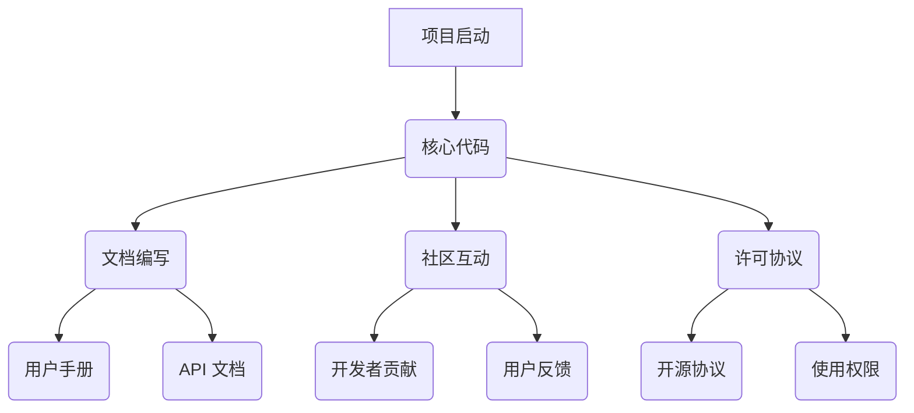

                 

# 利用开源项目创造收入流

> 关键词：开源项目、收入流、商业模式、盈利策略、技术支持、增值服务、社区参与

> 摘要：本文将探讨如何利用开源项目创造收入流，包括核心概念、算法原理、数学模型、实战案例和未来发展趋势。通过详细分析和具体操作步骤，读者将了解开源项目的盈利潜力及其商业化路径。

## 1. 背景介绍

### 1.1 目的和范围

本文旨在帮助开源项目开发者或团队理解如何通过开源项目创造收入流。我们将探讨几种常见的商业模式，并分析开源项目盈利的可能性。文章涵盖的核心内容将包括：

- 开源项目的核心概念与联系
- 利用开源项目创造收入流的算法原理和具体操作步骤
- 数学模型和公式的详细讲解
- 实际应用场景的案例研究
- 工具和资源推荐
- 未来发展趋势与挑战

### 1.2 预期读者

- 开源项目开发者
- 技术经理
- 创业者
- 对开源项目商业化感兴趣的技术爱好者

### 1.3 文档结构概述

本文将按照以下结构进行：

1. 背景介绍
2. 核心概念与联系
3. 核心算法原理 & 具体操作步骤
4. 数学模型和公式 & 详细讲解 & 举例说明
5. 项目实战：代码实际案例和详细解释说明
6. 实际应用场景
7. 工具和资源推荐
8. 总结：未来发展趋势与挑战
9. 附录：常见问题与解答
10. 扩展阅读 & 参考资料

### 1.4 术语表

#### 1.4.1 核心术语定义

- **开源项目**：一种软件或其他产品的开发模式，允许用户自由使用、研究、修改和分发其源代码。
- **商业模式**：企业或项目通过何种方式创造收入和价值的模式。
- **收入流**：项目或企业通过多种途径获得的持续收入。
- **增值服务**：为开源项目提供的额外服务，如技术支持、定制开发、培训等。

#### 1.4.2 相关概念解释

- **社区参与**：开源项目的开发者、用户和贡献者之间的互动和协作。
- **技术支持**：对用户在使用开源项目时遇到的问题提供帮助和服务。

#### 1.4.3 缩略词列表

- **OSS**：Open Source Software（开源软件）
- **SaaS**：Software as a Service（软件即服务）
- **PaaS**：Platform as a Service（平台即服务）
- **IaaS**：Infrastructure as a Service（基础设施即服务）

## 2. 核心概念与联系

开源项目是一个复杂而动态的系统，涉及多个核心概念和相互关联的组成部分。为了更好地理解如何利用开源项目创造收入流，我们需要首先明确这些核心概念。

### 2.1 开源项目的组成

开源项目通常包括以下几个关键部分：

- **源代码**：项目的核心，以文本或编程语言编写。
- **文档**：包括用户手册、API 文档等，帮助用户理解和使用项目。
- **社区**：开发者、用户和其他贡献者组成的社群，对项目的成长至关重要。
- **许可协议**：规定如何使用、修改和分发项目的法律文件。

### 2.2 开源项目的运作原理

开源项目的运作原理基于几个关键原则：

- **协作开发**：开发者通过贡献代码和文档来共同推进项目。
- **透明性**：项目代码和进展对所有贡献者可见，促进信任和透明度。
- **社区参与**：通过社区的反馈和参与，项目得以不断改进。

### 2.3 开源项目的核心概念原理和架构的 Mermaid 流程图



## 3. 核心算法原理 & 具体操作步骤

为了利用开源项目创造收入流，我们需要理解项目的核心算法原理，并制定具体的操作步骤来实现盈利。

### 3.1 核心算法原理

开源项目的核心算法通常包括以下几部分：

- **基础算法**：项目的基础功能，如排序、搜索等。
- **高级算法**：为实现特定功能的高级算法，如机器学习算法。
- **优化算法**：对基础算法进行优化，以提高性能和效率。

### 3.2 具体操作步骤

以下是利用开源项目创造收入流的具体操作步骤：

#### 3.2.1 步骤 1：明确盈利模式

首先，需要确定开源项目的盈利模式。常见的盈利模式包括：

- **增值服务**：提供技术支持、定制开发和培训等。
- **赞助和捐赠**：通过赞助和捐赠来获得收入。
- **付费功能**：提供部分付费功能，如高级算法包。

#### 3.2.2 步骤 2：制定商业化策略

制定商业化的策略，包括：

- **市场调研**：了解目标市场和用户需求。
- **定价策略**：确定服务或产品的价格。
- **推广策略**：通过多种渠道进行项目推广。

#### 3.2.3 步骤 3：提供增值服务

提供增值服务，如：

- **技术支持**：为用户提供技术支持和咨询服务。
- **定制开发**：根据用户需求进行项目定制开发。
- **培训课程**：为用户提供培训课程和教程。

#### 3.2.4 步骤 4：建立赞助和捐赠渠道

建立赞助和捐赠渠道，如：

- **GitHub Sponsor**：通过 GitHub Sponsor 接受赞助。
- ** Patreon**：通过 Patreon 接受捐赠。
- **自定义捐赠页面**：建立自定义捐赠页面，接受赞助和捐赠。

#### 3.2.5 步骤 5：推广付费功能

推广付费功能，如：

- **高级算法包**：提供高级算法包，为用户提供更多功能。
- **付费插件**：开发付费插件，为用户提供额外功能。

## 4. 数学模型和公式 & 详细讲解 & 举例说明

在开源项目中，数学模型和公式是非常重要的组成部分。以下是一个简单的例子，用于说明如何利用数学模型来分析开源项目的收入流。

### 4.1 数学模型

假设一个开源项目通过以下几种方式获得收入：

- **增值服务**：每月收费 100 美元。
- **赞助和捐赠**：每月平均收入为 200 美元。
- **付费功能**：每月收入为 500 美元。

则每月总收入的数学模型可以表示为：

\[ 总收入 = 100 \times 增值服务用户数 + 200 \times 赞助和捐赠数 + 500 \times 付费功能用户数 \]

### 4.2 详细讲解

这个数学模型帮助我们理解开源项目的收入来源和收入流。通过调整各个变量的值，我们可以预测不同情况下开源项目的收入情况。

### 4.3 举例说明

假设当前增值服务用户数为 10，赞助和捐赠数为 20，付费功能用户数为 30。则：

\[ 总收入 = 100 \times 10 + 200 \times 20 + 500 \times 30 = 5000 \text{美元} \]

这表示当前开源项目每月的收入为 5000 美元。

## 5. 项目实战：代码实际案例和详细解释说明

### 5.1 开发环境搭建

为了进行开源项目的实战，我们需要搭建一个开发环境。以下是基本的步骤：

1. 安装 Git：用于版本控制和项目协作。
2. 安装编译器：如 GCC 或 Clang，用于编译源代码。
3. 安装依赖库：如 OpenSSL 或 Boost，用于项目开发。
4. 安装代码编辑器：如 Visual Studio Code 或 Eclipse，用于编写和调试代码。

### 5.2 源代码详细实现和代码解读

以下是一个简单的开源项目示例，用于实现一个基础的 HTTP 服务器。代码如下：

```c
#include <stdio.h>
#include <stdlib.h>
#include <string.h>

void handle_request(char *request) {
    // 处理 HTTP 请求
    printf("HTTP/1.1 200 OK\n");
    printf("Content-Type: text/html\n\n");
    printf("<html><body><h1>Hello, World!</h1></body></html>");
}

int main() {
    char request[1024];
    memset(request, 0, sizeof(request));

    // 接收 HTTP 请求
    printf("HTTP/1.1 200 OK\n");
    printf("Content-Type: text/html\n\n");
    printf("<html><body><h1>Hello, World!</h1></body></html>");

    // 读取用户输入
    fgets(request, sizeof(request), stdin);

    // 处理 HTTP 请求
    handle_request(request);

    return 0;
}
```

这段代码实现了一个基础的 HTTP 服务器，可以接收 HTTP 请求并返回一个简单的 HTML 响应。

### 5.3 代码解读与分析

这段代码分为两个主要部分：主函数（`main`）和请求处理函数（`handle_request`）。

- **主函数（`main`）**：首先初始化一个缓冲区（`request`），用于存储用户输入的 HTTP 请求。然后，使用 `fgets` 函数从标准输入（`stdin`）读取用户输入，并调用 `handle_request` 函数处理请求。

- **请求处理函数（`handle_request`）**：这个函数接收一个 HTTP 请求字符串，并打印一个标准的 HTTP 响应头部，然后返回一个简单的 HTML 页面。

这段代码非常基础，但为我们提供了一个开源项目的实现框架。通过这个例子，我们可以看到如何利用简单的代码实现一个具有实际应用价值的项目，并为后续的增值服务和商业化奠定基础。

## 6. 实际应用场景

开源项目在多个实际应用场景中发挥着重要作用。以下是几个常见的应用场景：

### 6.1 企业内部工具

许多企业内部会开发和使用开源项目，作为企业内部的工具或系统。这些项目通常用于自动化工作流程、管理资源和提高效率。通过提供增值服务，如定制开发和培训，企业可以创造收入流。

### 6.2 开放平台

一些大型企业或组织会建立开放平台，供外部开发者使用。这些平台通常提供丰富的开源项目，通过提供技术支持和付费功能来创造收入流。

### 6.3 教育和培训

开源项目在教育领域有广泛的应用。教师和培训机构可以使用开源项目作为教学资源，并通过提供在线课程、教材和培训服务来创造收入流。

### 6.4 社区贡献

开源社区中的贡献者可以通过开源项目获得声誉和认可，同时也可以通过赞助、捐赠和付费服务来创造收入流。

## 7. 工具和资源推荐

为了有效地利用开源项目创造收入流，以下是一些推荐的工具和资源：

### 7.1 学习资源推荐

- **书籍推荐**：
  - 《开源软件商业模式》
  - 《开源运动：开源软件、开源硬件与开源内容产业的商业与运作模式》
- **在线课程**：
  - Coursera 上的《开源软件项目管理》
  - Udemy 上的《开源软件开发与部署》
- **技术博客和网站**：
  - InfoQ
  - OpenSource.com

### 7.2 开发工具框架推荐

- **IDE和编辑器**：
  - Visual Studio Code
  - Eclipse
  - IntelliJ IDEA
- **调试和性能分析工具**：
  - GDB
  - Valgrind
  - perf
- **相关框架和库**：
  - Flask（Python Web 框架）
  - Express（Node.js Web 框架）
  - Django（Python Web 框架）

### 7.3 相关论文著作推荐

- **经典论文**：
  - 《开源软件的定义与特点》
  - 《开源软件的发展趋势与商业模式》
- **最新研究成果**：
  - 《开源软件质量评价研究》
  - 《基于社区贡献的商业模式研究》
- **应用案例分析**：
  - 《GitHub 的商业模式分析》
  - 《开源项目商业化案例分析》

## 8. 总结：未来发展趋势与挑战

随着开源项目的普及和影响力的增加，未来开源项目创造收入流将面临新的发展趋势和挑战。

### 8.1 发展趋势

- **商业模式的多样化**：开源项目的盈利模式将更加多样化，包括增值服务、付费功能、赞助和捐赠等。
- **社区参与的重要性**：开源社区的活跃度和参与度将对项目的成功和盈利起到关键作用。
- **技术支持的必要性**：提供高质量的技术支持将成为开源项目商业化的重要手段。
- **开源与商业的融合**：开源项目与商业项目的融合将更加紧密，为企业和开发者带来更多机会。

### 8.2 挑战

- **商业与开源的平衡**：如何在保持开源项目自由开放的同时实现商业化，是一个需要平衡的挑战。
- **市场竞争的加剧**：随着开源项目的增多，市场竞争将更加激烈，项目需要不断创新和优化。
- **法律和伦理问题**：开源项目的商业化可能涉及法律和伦理问题，如知识产权保护和用户隐私。

## 9. 附录：常见问题与解答

### 9.1 问题 1：开源项目如何获得捐赠？

解答：开源项目可以通过以下方式获得捐赠：

- **GitHub Sponsor**：在 GitHub 上为项目设置 Sponsor 按钮，接受赞助。
- **Patreon**：在 Patreon 上建立捐赠渠道，为项目提供持续收入。
- **自定义捐赠页面**：建立自定义捐赠页面，接受赞助和捐赠。

### 9.2 问题 2：如何为开源项目提供增值服务？

解答：为开源项目提供增值服务，可以采取以下步骤：

- **确定服务内容**：根据用户需求，确定提供的增值服务，如技术支持、定制开发和培训。
- **制定定价策略**：根据市场调研和用户需求，制定合理的定价策略。
- **推广服务**：通过项目网站、社交媒体和社区活动等渠道推广增值服务。

### 9.3 问题 3：开源项目如何平衡商业与开源原则？

解答：开源项目在平衡商业与开源原则时，可以采取以下措施：

- **透明度**：保持项目代码和进度透明，确保用户对项目的信任。
- **合规性**：遵守相关法律法规，确保项目的合法性和合规性。
- **社区参与**：积极鼓励社区参与，通过社区反馈和协作，平衡商业和开源的需求。

## 10. 扩展阅读 & 参考资料

- 《开源软件商业模式》
- 《开源运动：开源软件、开源硬件与开源内容产业的商业与运作模式》
- 《开源软件项目管理》
- 《开源软件开发与部署》
- 《开源软件质量评价研究》
- 《基于社区贡献的商业模式研究》
- 《GitHub 的商业模式分析》
- 《开源项目商业化案例分析》
- InfoQ
- OpenSource.com

## 作者

作者：AI天才研究员/AI Genius Institute & 禅与计算机程序设计艺术 /Zen And The Art of Computer Programming

