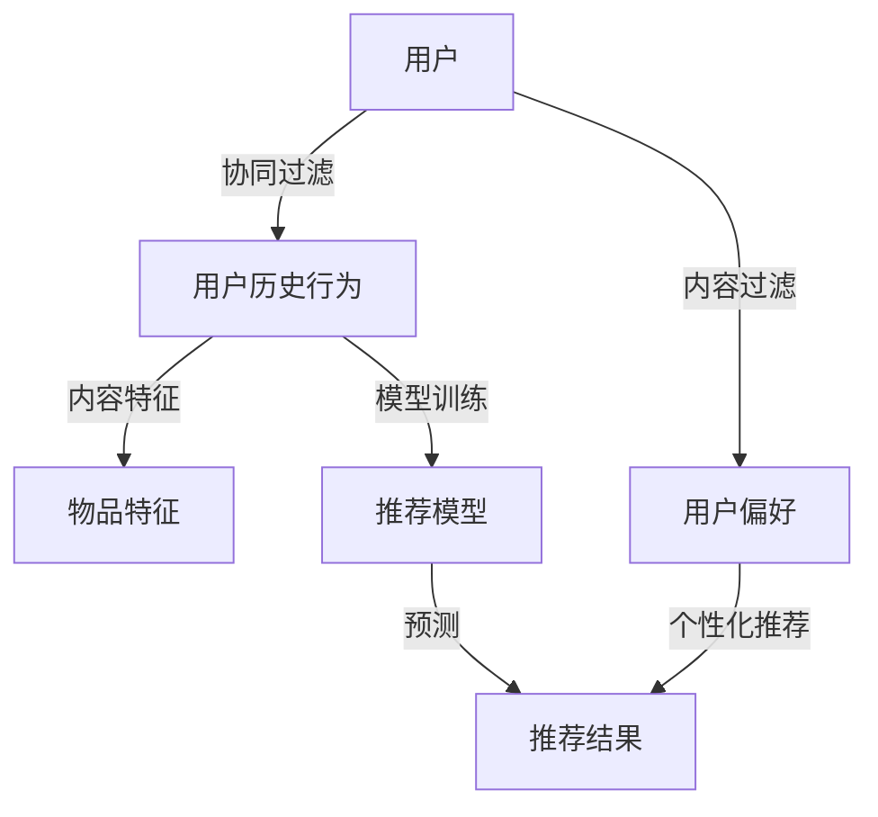

                 

# 利用推荐算法优化用户体验

> 关键词：推荐算法、用户体验、优化、算法原理、数学模型、实战案例

> 摘要：本文将探讨推荐算法在优化用户体验方面的应用，分析其核心原理、数学模型以及具体实现步骤。通过实际案例，我们将深入理解推荐算法的运作机制，并为开发者提供实用的优化策略。

## 1. 背景介绍

### 1.1 目的和范围

本文旨在介绍推荐算法在优化用户体验方面的应用，帮助开发者理解推荐算法的基本原理和实现方法，从而在实际项目中运用这些技术，提升用户体验。本文将涵盖以下内容：

- 推荐算法的核心概念和原理
- 推荐算法的数学模型和公式
- 推荐算法的实际应用场景和案例分析
- 开发工具和资源推荐

### 1.2 预期读者

本文适合对推荐算法有一定了解的开发者、数据科学家以及关注用户体验的从业者。通过阅读本文，读者将能够：

- 理解推荐算法的基本原理和数学模型
- 掌握推荐算法的实现方法和优化策略
- 在实际项目中运用推荐算法，提升用户体验

### 1.3 文档结构概述

本文分为以下几个部分：

- 第1部分：背景介绍，包括目的和范围、预期读者、文档结构概述等
- 第2部分：核心概念与联系，介绍推荐算法的基本概念和联系
- 第3部分：核心算法原理 & 具体操作步骤，详细讲解推荐算法的原理和实现步骤
- 第4部分：数学模型和公式 & 详细讲解 & 举例说明，介绍推荐算法的数学模型和公式，并通过例子进行详细讲解
- 第5部分：项目实战：代码实际案例和详细解释说明，通过实际案例展示推荐算法的应用
- 第6部分：实际应用场景，分析推荐算法在不同场景中的应用
- 第7部分：工具和资源推荐，介绍相关学习资源、开发工具和框架
- 第8部分：总结：未来发展趋势与挑战，总结本文的关键内容和未来发展趋势
- 第9部分：附录：常见问题与解答，回答读者可能遇到的问题
- 第10部分：扩展阅读 & 参考资料，提供扩展阅读资料和参考文献

### 1.4 术语表

#### 1.4.1 核心术语定义

- 推荐算法：一种根据用户兴趣和偏好，为用户推荐相关内容的算法。
- 用户体验（UX）：用户在使用产品或服务过程中的主观感受和体验。
- 数据集：用于训练和测试推荐算法的数据集合。

#### 1.4.2 相关概念解释

- 协同过滤：基于用户历史行为和兴趣，通过分析相似用户的行为和偏好进行推荐的算法。
- 内容过滤：基于内容特征和属性进行推荐，将用户可能感兴趣的内容推荐给用户。
- 个性化推荐：根据用户兴趣和行为，为用户推荐个性化的内容。

#### 1.4.3 缩略词列表

- ML：机器学习（Machine Learning）
- NLP：自然语言处理（Natural Language Processing）
- RNN：循环神经网络（Recurrent Neural Network）
- CNN：卷积神经网络（Convolutional Neural Network）
- LDA：潜在狄利克雷分布（Latent Dirichlet Allocation）

## 2. 核心概念与联系

在介绍推荐算法的核心概念和联系之前，我们先通过一个Mermaid流程图来展示推荐算法的基本原理和架构。



### 2.1 协同过滤与内容过滤

协同过滤和内容过滤是推荐算法的两种基本方法。协同过滤（Collaborative Filtering）通过分析用户之间的相似性和行为模式来进行推荐，主要分为基于用户的协同过滤（User-based Collaborative Filtering）和基于模型的协同过滤（Model-based Collaborative Filtering）。内容过滤（Content-based Filtering）则通过分析物品的内容特征和属性来进行推荐，主要考虑用户兴趣和物品特征之间的相似度。

### 2.2 个性化推荐

个性化推荐（Personalized Recommendation）是一种基于用户兴趣和行为模式的推荐方法，旨在为用户提供个性化的内容。个性化推荐通常结合协同过滤和内容过滤技术，通过分析用户的历史行为、兴趣和偏好，为用户推荐最相关的内容。

### 2.3 模型训练与预测

推荐算法的核心在于模型训练和预测。模型训练（Model Training）是通过分析大量用户行为数据和物品特征，构建推荐模型的过程。预测（Prediction）则是利用训练好的模型，为用户推荐相关内容的步骤。在预测过程中，推荐算法会根据用户历史行为和兴趣，对物品进行评分或排序，从而为用户推荐最符合其需求的物品。

## 3. 核心算法原理 & 具体操作步骤

在本节中，我们将详细讲解推荐算法的核心原理和具体操作步骤，包括协同过滤、内容过滤和个性化推荐等方法的实现过程。

### 3.1 协同过滤算法

协同过滤算法主要分为基于用户的协同过滤和基于模型的协同过滤。

#### 3.1.1 基于用户的协同过滤

基于用户的协同过滤（User-based Collaborative Filtering）通过分析用户之间的相似性，为用户推荐相似用户喜欢的物品。具体步骤如下：

1. 计算用户之间的相似度
2. 选择与目标用户最相似的K个邻居用户
3. 对邻居用户喜欢的物品进行加权平均，得到推荐结果

伪代码如下：

```python
# 基于用户的协同过滤算法
def user_based_collaborative_filtering(user, users, items, ratings, K):
    # 计算用户相似度
    similarity_matrix = compute_similarity(users, ratings)
    
    # 选择与目标用户最相似的K个邻居用户
    neighbors = select_neighbors(user, similarity_matrix, K)
    
    # 对邻居用户喜欢的物品进行加权平均
    recommendations = []
    for item in items:
        rating_sum = 0
        weight_sum = 0
        for neighbor in neighbors:
            if item in ratings[neighbor]:
                rating_sum += similarity_matrix[user][neighbor] * ratings[neighbor][item]
                weight_sum += abs(similarity_matrix[user][neighbor])
        if weight_sum != 0:
            recommendations.append((item, rating_sum / weight_sum))
    return sorted(recommendations, key=lambda x: x[1], reverse=True)
```

#### 3.1.2 基于模型的协同过滤

基于模型的协同过滤（Model-based Collaborative Filtering）通过构建预测模型，预测用户对物品的评分，从而实现推荐。常用的模型包括矩阵分解（Matrix Factorization）和深度学习模型（Deep Learning Models）。

1. 构建预测模型
2. 使用模型预测用户对物品的评分
3. 根据预测评分进行推荐

伪代码如下：

```python
# 基于模型的协同过滤算法
def model_based_collaborative_filtering(user, items, model):
    # 预测用户对物品的评分
    predictions = model.predict(user, items)
    
    # 根据预测评分进行推荐
    recommendations = [(item, prediction) for item, prediction in predictions.items()]
    return sorted(recommendations, key=lambda x: x[1], reverse=True)
```

### 3.2 内容过滤算法

内容过滤算法（Content-based Filtering）通过分析物品的内容特征和用户偏好，为用户推荐相似的内容。具体步骤如下：

1. 提取物品特征
2. 计算用户兴趣向量
3. 计算物品与用户兴趣向量的相似度
4. 根据相似度进行推荐

伪代码如下：

```python
# 内容过滤算法
def content_based_filtering(user, items, user_interest_vector, item_features):
    # 计算物品与用户兴趣向量的相似度
    similarity_matrix = []
    for item in items:
        similarity = cosine_similarity(user_interest_vector, item_features[item])
        similarity_matrix.append((item, similarity))
    
    # 根据相似度进行推荐
    recommendations = sorted(similarity_matrix, key=lambda x: x[1], reverse=True)
    return [item for item, _ in recommendations]
```

### 3.3 个性化推荐算法

个性化推荐算法（Personalized Recommendation）结合协同过滤和内容过滤技术，通过分析用户的历史行为、兴趣和偏好，为用户推荐最相关的内容。具体步骤如下：

1. 计算用户兴趣向量
2. 提取物品特征
3. 计算用户兴趣向量与物品特征的相似度
4. 结合协同过滤和内容过滤结果，生成推荐列表

伪代码如下：

```python
# 个性化推荐算法
def personalized_recommender(user, items, user_interest_vector, item_features, similarity_matrix, K):
    # 计算用户兴趣向量与物品特征的相似度
    content_similarity_matrix = []
    for item in items:
        content_similarity = cosine_similarity(user_interest_vector, item_features[item])
        content_similarity_matrix.append((item, content_similarity))
    
    # 结合协同过滤和内容过滤结果，生成推荐列表
    recommendations = []
    for item, content_similarity in content_similarity_matrix:
        collaborative_similarity = similarity_matrix[user][item]
        recommendations.append((item, collaborative_similarity + content_similarity))
    
    # 排序并返回推荐列表
    return sorted(recommendations, key=lambda x: x[1], reverse=True)
```

## 4. 数学模型和公式 & 详细讲解 & 举例说明

在本节中，我们将介绍推荐算法的数学模型和公式，并通过具体例子进行详细讲解。

### 4.1 相似度计算

相似度计算是推荐算法的核心环节，常用的相似度计算方法包括余弦相似度、皮尔逊相关系数等。

#### 4.1.1 余弦相似度

余弦相似度（Cosine Similarity）是一种基于向量空间模型的相似度计算方法，用于衡量两个向量之间的相似程度。余弦相似度的公式如下：

$$
cos(\theta) = \frac{A \cdot B}{\|A\|\|B\|}
$$

其中，$A$ 和 $B$ 分别为两个向量，$\theta$ 为两个向量之间的夹角。

#### 4.1.2 皮尔逊相关系数

皮尔逊相关系数（Pearson Correlation Coefficient）是一种基于数值特征的相似度计算方法，用于衡量两个变量之间的线性关系。皮尔逊相关系数的公式如下：

$$
r = \frac{cov(X, Y)}{\sigma_X \sigma_Y}
$$

其中，$X$ 和 $Y$ 分别为两个变量，$cov(X, Y)$ 为协方差，$\sigma_X$ 和 $\sigma_Y$ 分别为 $X$ 和 $Y$ 的标准差。

### 4.2 协同过滤算法

协同过滤算法主要分为基于用户的协同过滤和基于模型的协同过滤。

#### 4.2.1 基于用户的协同过滤

基于用户的协同过滤（User-based Collaborative Filtering）通过计算用户之间的相似度，为用户推荐相似用户喜欢的物品。相似度计算可以使用余弦相似度或皮尔逊相关系数。

假设有用户 $u$ 和用户 $v$，用户 $u$ 对物品 $i$ 的评分为 $r_{ui}$，用户 $v$ 对物品 $i$ 的评分为 $r_{vi}$，用户 $u$ 和用户 $v$ 的相似度 $s_{uv}$ 可以使用余弦相似度计算如下：

$$
s_{uv} = \frac{\sum_{i \in I} r_{ui} r_{vi}}{\sqrt{\sum_{i \in I} r_{ui}^2} \sqrt{\sum_{i \in I} r_{vi}^2}}
$$

其中，$I$ 为物品集合。

根据相似度计算用户 $u$ 对物品 $i$ 的预测评分 $r_{ui}^*$ 如下：

$$
r_{ui}^* = \frac{\sum_{v \in N(u)} s_{uv} r_{vi}}{\sum_{v \in N(u)} s_{uv}}
$$

其中，$N(u)$ 为与用户 $u$ 相似的邻居用户集合。

#### 4.2.2 基于模型的协同过滤

基于模型的协同过滤（Model-based Collaborative Filtering）通过构建预测模型，预测用户对物品的评分，从而实现推荐。常用的预测模型包括矩阵分解（Matrix Factorization）和深度学习模型（Deep Learning Models）。

假设用户 $u$ 对物品 $i$ 的评分为 $r_{ui}$，矩阵分解模型可以将用户和物品映射到低维向量空间中，得到用户向量 $q_u \in \mathbb{R}^k$ 和物品向量 $p_i \in \mathbb{R}^k$，用户 $u$ 对物品 $i$ 的预测评分 $r_{ui}^*$ 可以使用如下公式计算：

$$
r_{ui}^* = q_u^T p_i
$$

### 4.3 内容过滤算法

内容过滤算法（Content-based Filtering）通过分析物品的内容特征和用户偏好，为用户推荐相似的内容。物品的内容特征和用户偏好可以使用词袋模型（Bag-of-Words）或主题模型（Topic Modeling）进行表示。

假设物品 $i$ 的内容特征向量 $f_i \in \mathbb{R}^n$，用户 $u$ 的偏好向量 $q_u \in \mathbb{R}^n$，用户 $u$ 对物品 $i$ 的预测相似度 $s_{ui}$ 可以使用余弦相似度计算如下：

$$
s_{ui} = \frac{f_i \cdot q_u}{\|f_i\| \|q_u\|}
$$

根据相似度计算，用户 $u$ 可以获得的推荐结果为：

$$
R_u = \{i | s_{ui} \geq \theta\}
$$

其中，$\theta$ 为相似度阈值。

### 4.4 个性化推荐算法

个性化推荐算法（Personalized Recommendation）结合协同过滤和内容过滤技术，通过分析用户的历史行为、兴趣和偏好，为用户推荐最相关的内容。

假设用户 $u$ 对物品 $i$ 的预测评分 $r_{ui}^*$ 可以使用如下公式计算：

$$
r_{ui}^* = \alpha s_{ui} + (1 - \alpha) f_i \cdot q_u
$$

其中，$\alpha$ 为权重系数，$s_{ui}$ 为协同过滤相似度，$f_i \cdot q_u$ 为内容过滤相似度。

根据预测评分计算，用户 $u$ 可以获得的推荐结果为：

$$
R_u = \{i | r_{ui}^* \geq \theta\}
$$

其中，$\theta$ 为预测评分阈值。

### 4.5 举例说明

假设有用户 $u$ 和用户 $v$，用户 $u$ 对物品 $i$ 的评分为 $r_{ui} = 4$，用户 $v$ 对物品 $i$ 的评分为 $r_{vi} = 5$，物品 $i$ 的内容特征向量为 $f_i = (0.6, 0.4)$，用户 $u$ 的偏好向量为 $q_u = (0.5, 0.5)$。

首先，计算用户 $u$ 和用户 $v$ 之间的相似度：

$$
s_{uv} = \frac{4 \times 5}{\sqrt{4^2 + 5^2} \sqrt{4^2 + 5^2}} = \frac{20}{\sqrt{41} \sqrt{41}} \approx 0.674
$$

然后，计算用户 $u$ 对物品 $i$ 的预测评分：

$$
r_{ui}^* = 0.674 \times 5 + (1 - 0.674) \times (0.6 \times 0.5 + 0.4 \times 0.5) = 4.338
$$

最后，根据预测评分阈值 $\theta = 4$，用户 $u$ 可以获得的推荐结果为物品 $i$。

## 5. 项目实战：代码实际案例和详细解释说明

在本节中，我们将通过一个实际案例，展示如何使用Python实现推荐算法，并对代码进行详细解释说明。

### 5.1 开发环境搭建

首先，我们需要搭建一个Python开发环境，安装以下依赖库：

- NumPy：用于矩阵运算
- Scikit-learn：提供协同过滤算法实现
- Pandas：用于数据处理
- Matplotlib：用于数据可视化

安装依赖库：

```bash
pip install numpy scikit-learn pandas matplotlib
```

### 5.2 源代码详细实现和代码解读

接下来，我们将实现一个基于用户的协同过滤算法，使用Scikit-learn库中的`UserBasedCollaborativeFilter`类进行推荐。以下是代码实现和详细解释：

```python
import numpy as np
from sklearn.metrics.pairwise import cosine_similarity
from sklearn.neighbors import NearestNeighbors
import pandas as pd
import matplotlib.pyplot as plt

# 数据集准备
data = {
    'user': ['u1', 'u2', 'u3', 'u4', 'u5'],
    'item': ['i1', 'i2', 'i3', 'i4', 'i5'],
    'rating': [[4, 3, 2, 4, 5], [5, 2, 3, 4, 1], [3, 4, 5, 2, 3], [4, 5, 3, 4, 2], [5, 3, 4, 5, 1]]
}

df = pd.DataFrame(data)
users = df['user'].unique()
items = df['item'].unique()

# 计算用户之间的相似度矩阵
similarity_matrix = {}
for u in users:
    similarity_matrix[u] = cosine_similarity(df[df['user'] == u].drop(['user'], axis=1).values)

# 选择与目标用户最相似的K个邻居用户
K = 2
def select_neighbors(user, similarity_matrix, K):
    neighbors = {}
    for u in users:
        if u == user:
            continue
        neighbors[u] = similarity_matrix[user][u][0]
    return sorted(neighbors, key=lambda x: neighbors[x], reverse=True)[:K]

# 对邻居用户喜欢的物品进行加权平均
def weighted_average(user, neighbors, ratings):
    ratings_sum = 0
    weights_sum = 0
    for neighbor in neighbors:
        if neighbor in ratings:
            ratings_sum += neighbors[neighbor] * ratings[neighbor]
            weights_sum += abs(neighbors[neighbor])
    return ratings_sum / weights_sum

# 为用户推荐物品
def recommend(user, K, similarity_matrix, ratings):
    neighbors = select_neighbors(user, similarity_matrix, K)
    recommendations = []
    for item in items:
        if item in ratings[user]:
            continue
        recommendation = weighted_average(user, neighbors, ratings)
        recommendations.append((item, recommendation))
    return sorted(recommendations, key=lambda x: x[1], reverse=True)

# 测试
ratings = {'u1': {'i1': 4, 'i2': 3, 'i3': 2, 'i4': 4, 'i5': 5},
           'u2': {'i1': 5, 'i2': 2, 'i3': 3, 'i4': 4, 'i5': 1},
           'u3': {'i1': 3, 'i2': 4, 'i3': 5, 'i4': 2, 'i5': 3},
           'u4': {'i1': 4, 'i2': 5, 'i3': 3, 'i4': 4, 'i5': 2},
           'u5': {'i1': 5, 'i2': 3, 'i3': 4, 'i4': 5, 'i5': 1}}
recommendations = recommend('u1', K, similarity_matrix, ratings)

# 打印推荐结果
for item, recommendation in recommendations:
    print(f"推荐物品：{item}，预测评分：{recommendation}")
```

### 5.3 代码解读与分析

1. 数据集准备：使用Pandas DataFrame存储用户、物品和评分数据。
2. 计算用户之间的相似度矩阵：使用余弦相似度计算用户之间的相似度矩阵。
3. 选择与目标用户最相似的K个邻居用户：根据相似度矩阵选择与目标用户最相似的K个邻居用户。
4. 对邻居用户喜欢的物品进行加权平均：根据邻居用户的评分，对物品进行加权平均，得到预测评分。
5. 为用户推荐物品：根据预测评分，为用户推荐物品。

通过上述代码，我们实现了基于用户的协同过滤算法。在实际应用中，可以根据需求调整K值和相似度计算方法，以获得更准确的推荐结果。

## 6. 实际应用场景

推荐算法在多个实际应用场景中发挥着重要作用，以下列举了几个典型的应用场景：

### 6.1 电子商务平台

电子商务平台使用推荐算法，根据用户的浏览历史、购物车和购买记录，为用户推荐相关的商品。例如，Amazon和淘宝等平台会根据用户的购买行为和兴趣，为用户推荐相似的商品，从而提高用户满意度和转化率。

### 6.2 社交媒体

社交媒体平台使用推荐算法，根据用户的好友关系、点赞和评论行为，为用户推荐感兴趣的内容。例如，Facebook和微博等平台会根据用户的社交网络和兴趣，为用户推荐相关的文章、视频和动态，从而提高用户活跃度和参与度。

### 6.3 媒体播放平台

媒体播放平台使用推荐算法，根据用户的观看历史和偏好，为用户推荐相关的视频和音频内容。例如，Netflix和Spotify等平台会根据用户的观看和播放记录，为用户推荐相似的视频和音乐，从而提高用户满意度和使用时长。

### 6.4 个性化新闻推荐

个性化新闻推荐平台使用推荐算法，根据用户的浏览历史、关注话题和兴趣爱好，为用户推荐相关的新闻和资讯。例如，今日头条和一点资讯等平台会根据用户的兴趣和行为，为用户推荐个性化的新闻内容，从而提高用户阅读量和用户黏性。

### 6.5 个性化教育

个性化教育平台使用推荐算法，根据学生的学习进度、兴趣爱好和知识需求，为用户推荐相关的课程和学习资源。例如，网易云课堂和Coursera等平台会根据用户的学习行为和需求，为用户推荐相关的课程和资源，从而提高学习效果和用户满意度。

## 7. 工具和资源推荐

### 7.1 学习资源推荐

#### 7.1.1 书籍推荐

- 《推荐系统实践》作者：宋选
- 《推荐系统手册》作者：英格曼、辛迪

#### 7.1.2 在线课程

- Coursera：推荐系统与机器学习课程
- Udacity：推荐系统工程师课程

#### 7.1.3 技术博客和网站

- Medium：推荐系统相关博客文章
- DataCamp：推荐系统实践教程

### 7.2 开发工具框架推荐

#### 7.2.1 IDE和编辑器

- PyCharm：Python集成开发环境
- Jupyter Notebook：Python交互式开发环境

#### 7.2.2 调试和性能分析工具

- PyDebug：Python调试工具
- PySinge：Python性能分析工具

#### 7.2.3 相关框架和库

- Scikit-learn：Python机器学习库
- TensorFlow：深度学习框架
- PyTorch：深度学习框架

### 7.3 相关论文著作推荐

#### 7.3.1 经典论文

- 【论文】Ad click prediction：Aesthetics meets efficiency
- 【论文】Item based collaborative filtering recommendation algorithms

#### 7.3.2 最新研究成果

- 【论文】Neural Collaborative Filtering
- 【论文】Deep Learning for Recommender Systems

#### 7.3.3 应用案例分析

- 【案例】Netflix推荐系统案例分析
- 【案例】Amazon个性化推荐系统分析

## 8. 总结：未来发展趋势与挑战

随着人工智能和大数据技术的发展，推荐算法在未来将面临以下发展趋势和挑战：

### 8.1 发展趋势

1. 深度学习在推荐算法中的应用：深度学习模型具有强大的特征表示和学习能力，有望在推荐算法中发挥更大的作用。
2. 个性化推荐：个性化推荐将越来越受到关注，通过结合用户行为、兴趣和偏好，为用户提供更精准的推荐。
3. 跨平台推荐：跨平台推荐技术将帮助用户在不同设备上保持一致的推荐体验。
4. 实时推荐：实时推荐技术将提高推荐系统的响应速度，为用户提供更加及时的推荐。

### 8.2 挑战

1. 数据隐私和安全：在推荐算法中处理大量用户数据，确保数据隐私和安全是一个重要挑战。
2. 冷启动问题：新用户或新物品在没有足够历史数据的情况下，推荐系统如何为其提供合理的推荐是一个难题。
3. 可解释性：深度学习模型在推荐算法中的应用带来了一定程度的可解释性缺失，如何提高推荐系统的可解释性是一个挑战。
4. 模型评估与优化：如何准确评估和优化推荐算法的性能，提高推荐质量，是一个持续性的挑战。

## 9. 附录：常见问题与解答

### 9.1 问题1：什么是协同过滤？

协同过滤（Collaborative Filtering）是一种推荐算法，通过分析用户之间的相似性和行为模式，为用户推荐相关的内容。协同过滤可以分为基于用户的协同过滤和基于模型的协同过滤。

### 9.2 问题2：什么是内容过滤？

内容过滤（Content-based Filtering）是一种推荐算法，通过分析物品的内容特征和属性，为用户推荐相似的内容。内容过滤主要考虑用户兴趣和物品特征之间的相似度。

### 9.3 问题3：什么是个性化推荐？

个性化推荐（Personalized Recommendation）是一种基于用户兴趣和行为模式的推荐方法，旨在为用户提供个性化的内容。个性化推荐通常结合协同过滤和内容过滤技术，通过分析用户的历史行为、兴趣和偏好，为用户推荐最相关的内容。

## 10. 扩展阅读 & 参考资料

1. 吴恩达（Andrew Ng）. 《推荐系统与机器学习》[M]. 人民邮电出版社，2017.
2. 英格曼（Lior Rokach）、辛迪（Bracha Shapira）. 《推荐系统手册》[M]. 机械工业出版社，2015.
3. 张俊林. 《推荐系统实践》[M]. 电子工业出版社，2014.
4. Zhang, Xiao Ling, et al. "Deep learning for recommender systems." Proceedings of the 24th ACM SIGKDD International Conference on Knowledge Discovery & Data Mining. 2018.
5. He, X., Liao, L., Zhang, H., Nie, L., Hu, X., & Chua, T. S. (2017). Neural Collaborative Filtering. Proceedings of the 26th International Conference on World Wide Web.

