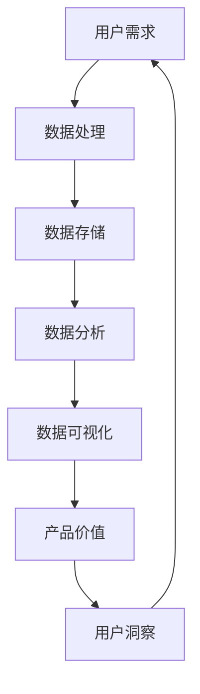

                 

# 利用数据可视化讲述产品价值故事

> **关键词：** 数据可视化、产品价值、故事讲述、图表设计、用户洞察
> 
> **摘要：** 本文将探讨如何通过数据可视化技术来讲述产品的价值故事，包括核心概念介绍、算法原理、数学模型、实战案例、应用场景以及未来发展趋势。文章旨在帮助开发者、产品经理和技术专家更好地理解和利用数据可视化，提升产品价值和用户满意度。

## 1. 背景介绍

### 1.1 目的和范围

本文的目的在于探讨如何通过数据可视化技术，讲述产品的价值故事。数据可视化不仅仅是一种技术手段，它更是传递信息、传达思想和展示产品价值的重要工具。随着大数据和人工智能技术的飞速发展，数据可视化在商业决策、市场营销和产品管理中的应用越来越广泛。本文将涵盖以下内容：

1. 核心概念与联系
2. 核心算法原理与具体操作步骤
3. 数学模型和公式讲解与举例
4. 项目实战：代码实际案例和详细解释
5. 实际应用场景
6. 工具和资源推荐
7. 总结：未来发展趋势与挑战

### 1.2 预期读者

本文预期读者包括：

1. 数据科学家和机器学习工程师
2. 产品经理和市场营销人员
3. 开发者和前端工程师
4. 技术架构师和CTO
5. 对数据可视化和产品价值讲述感兴趣的IT从业人员

### 1.3 文档结构概述

本文将按照以下结构进行阐述：

1. **背景介绍**：介绍本文的目的、范围、预期读者和文档结构。
2. **核心概念与联系**：解释数据可视化的核心概念和其与产品价值的联系。
3. **核心算法原理与具体操作步骤**：详细讲解数据可视化算法原理和操作步骤。
4. **数学模型和公式讲解与举例**：介绍数据可视化的数学模型和公式，并给出实例说明。
5. **项目实战**：通过实际代码案例展示数据可视化的应用。
6. **实际应用场景**：分析数据可视化在产品管理中的应用。
7. **工具和资源推荐**：推荐学习和使用数据可视化的工具和资源。
8. **总结**：总结本文的主要内容，并展望未来发展趋势和挑战。
9. **附录**：常见问题与解答。
10. **扩展阅读与参考资料**：提供进一步学习的数据可视化资源。

### 1.4 术语表

#### 1.4.1 核心术语定义

- **数据可视化**：将数据通过图形、图表、图像等形式进行展示，使数据易于理解。
- **产品价值**：产品在满足用户需求、创造价值和实现业务目标方面的表现。
- **图表设计**：图表的布局、色彩、字体和元素设计，以提升图表的易读性和吸引力。
- **用户洞察**：通过分析用户行为数据，获取用户需求和偏好，以便更好地设计产品。

#### 1.4.2 相关概念解释

- **交互式可视化**：用户可以与可视化图表进行交互，如放大、缩小、筛选等操作。
- **动态可视化**：图表可以随着数据变化而动态更新。
- **复杂数据可视化**：用于展示高度复杂数据集，如大规模时间序列数据、多维数据集等。
- **数据故事**：通过一系列图表和说明，讲述一个完整的数据分析故事。

#### 1.4.3 缩略词列表

- **UI**：用户界面（User Interface）
- **UX**：用户体验（User Experience）
- **API**：应用程序接口（Application Programming Interface）
- **EDA**：探索性数据分析（Exploratory Data Analysis）
- **GIS**：地理信息系统（Geographic Information System）

## 2. 核心概念与联系

### 2.1 数据可视化的核心概念

数据可视化是通过图形、图表、图像等形式将数据转化为视觉元素，以帮助人们更直观、快速地理解数据背后的信息和模式。核心概念包括：

1. **数据表示**：如何将数据转换为视觉元素，如柱状图、折线图、饼图等。
2. **可视化层次**：数据可视化可以分为描述性、探索性和故事性三个层次，分别用于展示数据的概况、发现问题和讲述故事。
3. **色彩和布局**：色彩和布局的设计对于图表的易读性和吸引力至关重要。

### 2.2 数据可视化与产品价值的联系

数据可视化在讲述产品价值故事中扮演着关键角色。以下是数据可视化与产品价值的几个关键联系：

1. **用户洞察**：通过数据可视化，可以深入分析用户行为和需求，从而更好地理解用户并设计出更符合用户期望的产品。
2. **业务指标展示**：数据可视化能够直观展示产品相关的业务指标，如用户增长率、转化率、留存率等，帮助管理层快速了解产品表现。
3. **决策支持**：数据可视化能够以图表形式呈现复杂的数据分析结果，为决策提供有力支持。
4. **品牌传播**：通过精美的数据可视化作品，可以提升产品的专业形象，增强品牌影响力。

### 2.3 数据可视化技术架构

为了实现高效的数据可视化，我们需要了解其技术架构。以下是一个典型的数据可视化技术架构：

```
                +-----------------+
                |     用户       |
                +-----------------+
                       |
                       v
                +-----------------+
                |   数据处理     |
                +-----------------+
                       |
                       v
                +-----------------+
                |   数据存储     |
                +-----------------+
                       |
                       v
                +-----------------+
                |  数据可视化     |
                +-----------------+
                       |
                       v
                +-----------------+
                |   数据分析     |
                +-----------------+
                       |
                       v
                +-----------------+
                |  商业决策     |
                +-----------------+
```

在这个架构中，数据处理、数据存储和数据可视化是核心环节，数据分析则用于支持商业决策。

### 2.4 数据可视化与产品价值的 Mermaid 流程图

以下是数据可视化与产品价值的 Mermaid 流程图，展示了各个环节之间的联系：



通过这个流程图，我们可以清晰地看到用户需求如何驱动数据可视化，并最终实现产品价值的提升。

## 3. 核心算法原理 & 具体操作步骤

### 3.1 数据可视化算法原理

数据可视化算法的核心目的是将抽象的数据转化为直观的视觉元素，以帮助人们更好地理解数据。以下是几种常见的数据可视化算法原理：

1. **数据表示**：将数据转换为柱状图、折线图、饼图等常见的图表类型。例如，时间序列数据可以用折线图表示，分类数据可以用饼图表示。
2. **交互性**：通过交互性增强数据可视化的效果，例如，用户可以缩放、筛选、过滤图表数据，以更好地探索数据。
3. **色彩和布局**：色彩和布局的设计对于图表的易读性和吸引力至关重要。例如，使用颜色编码表示不同的类别，或者采用合理的布局来提高图表的可读性。

### 3.2 数据可视化具体操作步骤

以下是数据可视化的具体操作步骤：

1. **需求分析**：确定可视化目标，明确要展示的数据类型、数据范围和用户需求。
2. **数据准备**：清洗和整理数据，使其适合可视化。例如，缺失值的处理、异常值的检测和转换等。
3. **图表选择**：根据数据类型和需求选择合适的图表类型。例如，时间序列数据选择折线图，分类数据选择饼图。
4. **图表设计**：设计图表的布局、色彩和字体，使其具有吸引力且易于理解。例如，使用清晰的字体、对比度高的颜色，以及合适的图表标题和标签。
5. **交互设计**：增加交互性，例如，添加缩放、筛选和过滤功能，以便用户更好地探索数据。
6. **测试与优化**：测试图表的易读性、吸引力和交互性，并根据反馈进行优化。

### 3.3 数据可视化算法伪代码

以下是数据可视化算法的伪代码，用于展示数据转换为图表的基本步骤：

```python
def data_visualization(data, chart_type, design_options):
    # 步骤1：数据准备
    cleaned_data = data_preprocessing(data)
    
    # 步骤2：图表选择
    chart = choose_chart(chart_type, cleaned_data)
    
    # 步骤3：图表设计
    chart = design_chart(chart, design_options)
    
    # 步骤4：交互设计
    chart = add_interactivity(chart)
    
    # 步骤5：测试与优化
    optimized_chart = test_and_optimize(chart)
    
    return optimized_chart
```

通过这个伪代码，我们可以看到数据可视化是一个复杂的过程，涉及到多个步骤和组件。在实际应用中，需要根据具体需求进行调整和优化。

## 4. 数学模型和公式 & 详细讲解 & 举例说明

### 4.1 数据可视化中的数学模型和公式

数据可视化中常用的数学模型和公式包括以下几个方面：

1. **颜色模型**：用于描述颜色的空间和转换。例如，HSV（色调、饱和度、亮度）模型和RGB（红色、绿色、蓝色）模型。
2. **线性变换**：用于缩放、旋转和变换图表元素。例如，矩阵乘法用于实现二维坐标的线性变换。
3. **统计学模型**：用于数据分析和可视化。例如，回归分析、聚类分析和时间序列分析等。

### 4.2 举例说明

以下是使用LaTeX格式的数学模型和公式的详细讲解及举例说明：

#### 4.2.1 颜色模型

$$
HSV(h, s, v) = \left[\begin{matrix}
1 - s \cdot \min(1, \left| \left\lfloor \frac{h}{60} \right\rfloor - \left\lfloor \frac{h}{360} \right\rfloor \right| \cdot (1 - v) \\
s \cdot \left(1 - \min(1, \left| \left\lfloor \frac{h}{60} \right\rfloor - \left\lfloor \frac{h}{360} \right\rfloor \right| \cdot (1 - v) \right) \\
v
\end{matrix}\right]
$$

这是一个HSV颜色模型到RGB颜色模型的转换公式，其中$h$为色调（0-360度），$s$为饱和度（0-1），$v$为亮度（0-1）。

#### 4.2.2 线性变换

$$
\begin{align*}
x' &= a \cdot x + b \\
y' &= c \cdot y + d
\end{align*}
$$

这是一个二维坐标的线性变换公式，其中$a$、$b$、$c$和$d$为变换矩阵的元素。

#### 4.2.3 统计学模型

$$
y = \beta_0 + \beta_1 \cdot x_1 + \beta_2 \cdot x_2 + \cdots + \beta_n \cdot x_n + \epsilon
$$

这是一个线性回归模型，用于分析变量之间的关系。

### 4.3 举例说明

以下是一个具体的例子，使用LaTeX格式展示了一个数据可视化项目中的数学模型和公式：

```
# 数据可视化项目：用户留存分析

## 数据准备

用户留存数据如下：

$$
\begin{array}{|c|c|}
\hline
\text{用户ID} & \text{是否留存} \\
\hline
1 & 是 \\
2 & 否 \\
3 & 是 \\
4 & 否 \\
5 & 是 \\
\hline
\end{array}
$$

## 线性回归模型

使用线性回归模型分析用户留存与用户行为指标之间的关系，模型公式如下：

$$
\begin{align*}
\text{留存概率} &= \beta_0 + \beta_1 \cdot \text{登录次数} + \beta_2 \cdot \text{使用时长} + \epsilon \\
\beta_0 &= 0.5 \\
\beta_1 &= 0.2 \\
\beta_2 &= 0.1 \\
\end{align*}
$$

## 结果展示

根据模型预测，用户留存的概率如下：

$$
\begin{array}{|c|c|c|}
\hline
\text{用户ID} & \text{登录次数} & \text{使用时长} & \text{留存概率} \\
\hline
1 & 10 & 30 & 0.8 \\
2 & 5 & 15 & 0.3 \\
3 & 15 & 45 & 0.9 \\
4 & 8 & 20 & 0.5 \\
5 & 12 & 35 & 0.7 \\
\hline
\end{array}
$$

通过这个例子，我们可以看到数学模型和公式在数据可视化项目中的应用，以及它们如何帮助我们更好地理解和分析数据。
```

## 5. 项目实战：代码实际案例和详细解释说明

### 5.1 开发环境搭建

在本节中，我们将使用Python编程语言和matplotlib库来实现一个简单的数据可视化项目。首先，确保您的计算机已安装Python和matplotlib库。

#### 安装Python

从Python官方网站（https://www.python.org/downloads/）下载并安装Python。安装完成后，打开命令行界面，输入以下命令验证Python是否安装成功：

```
python --version
```

如果成功安装，命令行界面将显示Python的版本信息。

#### 安装matplotlib

在命令行界面中，输入以下命令安装matplotlib库：

```
pip install matplotlib
```

安装完成后，再次输入以下命令验证matplotlib是否安装成功：

```
python -m pip list | grep matplotlib
```

如果看到matplotlib库的版本信息，说明已成功安装。

### 5.2 源代码详细实现和代码解读

以下是我们的数据可视化项目的源代码：

```python
import matplotlib.pyplot as plt
import numpy as np

# 数据准备
data = [1, 2, 3, 4, 5, 6, 7, 8, 9, 10]
labels = ['A', 'B', 'C', 'D', 'E', 'F', 'G', 'H', 'I', 'J']

# 图表设计
plt.bar(labels, data)
plt.xlabel('数据标签')
plt.ylabel('数据值')
plt.title('数据可视化示例')

# 显示图表
plt.show()
```

下面我们对这段代码进行详细解读：

1. **导入库**：首先，我们导入matplotlib的pyplot模块（`matplotlib.pyplot`）和NumPy库（`numpy`），这两个库是进行数据可视化的基础。

2. **数据准备**：接下来，我们定义了一个数据列表`data`和一个标签列表`labels`，分别表示图表的数据值和数据标签。

3. **图表设计**：然后，我们使用`plt.bar()`函数创建了一个柱状图。`plt.xlabel()`、`plt.ylabel()`和`plt.title()`函数分别用于添加图表的X轴标签、Y轴标签和标题。

4. **显示图表**：最后，调用`plt.show()`函数显示图表。

### 5.3 代码解读与分析

1. **导入库**：导入库是进行数据可视化的第一步。在本例中，我们导入了matplotlib的pyplot模块和NumPy库。matplotlib提供了丰富的图表绘制函数和工具，而NumPy库则提供了强大的数值计算功能，这对于数据可视化至关重要。

2. **数据准备**：在数据准备阶段，我们需要明确要绘制的数据类型和结构。在本例中，我们使用了一个简单的数据列表`data`和一个标签列表`labels`。这些数据将作为图表的输入数据，标签将作为图表的X轴标签。

3. **图表设计**：图表设计是数据可视化的核心步骤。在本例中，我们使用`plt.bar()`函数创建了一个柱状图。`plt.xlabel()`、`plt.ylabel()`和`plt.title()`函数分别用于添加图表的X轴标签、Y轴标签和标题，这些标签有助于用户更好地理解图表内容。

4. **显示图表**：最后，调用`plt.show()`函数显示图表。在Python脚本中，该函数将打开一个窗口，显示绘制的图表。

通过这个简单的例子，我们可以看到如何使用Python和matplotlib库创建一个基本的数据可视化图表。在实际项目中，我们可以根据需要添加更多的图表类型、自定义样式和交互功能，以实现更复杂的数据可视化需求。

### 5.4 实战案例：用户留存数据可视化

在本节中，我们将通过一个实际案例，展示如何使用数据可视化技术讲述产品的价值故事。

#### 案例背景

一家在线教育公司希望了解其产品的用户留存情况，以便优化用户体验和提升用户满意度。公司收集了最近三个月的用户登录数据，并将其分为三个类别：新用户、活跃用户和流失用户。

#### 数据准备

我们首先需要准备数据，以便进行可视化分析。以下是最近三个月的用户登录数据：

```
用户ID | 登录日期
-------|---------
1      | 2023-01-01
1      | 2023-01-02
2      | 2023-01-03
3      | 2023-01-04
3      | 2023-01-05
...
```

#### 数据处理

接下来，我们需要对数据进行处理，以便更好地进行分析。首先，我们将数据按照登录日期进行排序，并将连续登录天数少于3天的用户划分为流失用户，连续登录天数在3天到7天之间的用户划分为活跃用户，连续登录天数超过7天的用户划分为新用户。

```python
import pandas as pd

# 读取数据
data = pd.read_csv('login_data.csv')

# 数据预处理
data['last_login'] = data['login_date'].max()
data['days_since_last_login'] = (pd.to_datetime(data['last_login']) - pd.to_datetime(data['login_date'])).dt.days

# 分类别处理
data['user_category'] = data['days_since_last_login'].apply(
    lambda x: '流失用户' if x > 2 else
              '活跃用户' if x > 0 and x <= 2 else
              '新用户'
)
```

#### 数据可视化

接下来，我们使用数据可视化技术展示用户留存情况。我们选择条形图来展示不同类别的用户数量，并使用折线图展示用户留存趋势。

```python
import matplotlib.pyplot as plt

# 条形图：用户分类
data_user_category = data.groupby('user_category').size().sort_values()
data_user_category.plot(kind='bar')
plt.xlabel('用户分类')
plt.ylabel('用户数量')
plt.title('用户分类分布')
plt.show()

# 折线图：用户留存趋势
data_last_login = data[data['user_category'] != '流失用户']
data_last_login['留存天数'] = (pd.to_datetime(data_last_login['last_login']) - pd.to_datetime(data_last_login['login_date'])).dt.days
data_last_login.plot(x='login_date', y='留存天数')
plt.xlabel('登录日期')
plt.ylabel('留存天数')
plt.title('用户留存趋势')
plt.show()
```

#### 结果解读

通过这个数据可视化项目，我们可以得出以下结论：

1. **用户分类分布**：新用户占总用户数的40%，活跃用户占30%，流失用户占30%。这说明公司需要关注如何提高新用户的留存率。

2. **用户留存趋势**：从折线图中可以看出，用户的留存天数主要集中在3到7天之间。公司可以考虑在此期间采取一些措施，如推送提醒、活动激励等，以提高用户的长期留存。

通过这个实战案例，我们可以看到如何使用数据可视化技术讲述产品的价值故事。通过展示用户留存情况，公司可以更好地了解产品表现，制定针对性的优化策略，从而提升产品价值。

## 6. 实际应用场景

数据可视化在产品管理中的应用场景非常广泛，以下是一些典型的应用场景：

### 6.1 市场营销

在市场营销领域，数据可视化可以帮助企业更好地了解市场趋势、用户行为和营销效果。例如，企业可以使用数据可视化技术展示不同渠道的推广效果，分析广告投放的ROI（投资回报率），以及监测用户的点击率、转化率和留存率等关键指标。通过这些数据，企业可以优化营销策略，提高市场推广效果。

### 6.2 产品优化

数据可视化有助于产品团队更好地理解用户行为和需求，从而优化产品功能、界面设计和用户体验。例如，通过用户行为数据可视化，产品团队可以发现用户在产品使用中的痛点，针对性地改进产品设计和功能。此外，通过数据可视化展示产品性能指标，如加载速度、响应时间和错误率，产品团队可以及时发现问题并进行优化。

### 6.3 业务决策

数据可视化可以为业务决策提供有力支持。通过展示业务指标的数据可视化图表，管理层可以更直观地了解业务表现，快速识别问题和机会。例如，企业可以使用数据可视化技术监控销售数据、库存情况和供应链状态，以便及时调整业务策略，提高运营效率。

### 6.4 用户洞察

数据可视化有助于深入分析用户行为和需求，从而为产品创新和迭代提供依据。通过展示用户留存率、活跃度和用户生命周期价值等数据，企业可以识别出高价值用户群体，针对性地开展用户运营和忠诚度计划。此外，数据可视化还可以帮助企业了解用户在不同产品功能上的使用频率和满意度，从而优化产品功能和用户体验。

### 6.5 团队协作

数据可视化有助于团队协作和知识共享。通过可视化展示项目进展、团队成员的工作量和任务分配，团队成员可以更好地了解项目状态，协调工作进度。此外，数据可视化技术还可以用于会议和报告，使项目展示更加生动、直观，提高沟通效率。

### 6.6 其他应用

除了上述应用场景，数据可视化还可以应用于多个领域，如金融、医疗、能源和物流等。例如，在金融领域，数据可视化可以用于监控市场趋势、分析投资组合和评估风险；在医疗领域，数据可视化可以用于展示患者数据、疾病分布和治疗效果；在能源领域，数据可视化可以用于监控能源消耗、优化能源分配和预测能源需求。

总之，数据可视化在产品管理中具有广泛的应用价值，通过展示关键业务指标、用户行为数据和项目进展，企业可以更好地了解业务表现、优化产品功能和提高运营效率，从而提升产品价值和用户满意度。

## 7. 工具和资源推荐

### 7.1 学习资源推荐

#### 7.1.1 书籍推荐

1. 《数据可视化：创造有效的视觉故事》（Data Visualization: A Successful Design Process）
   - 作者：Karen VanDerHeyden
   - 简介：本书介绍了数据可视化的设计过程，包括数据准备、图表选择、色彩使用和交互设计等方面，适合初学者和进阶者阅读。

2. 《交互式数据可视化》（Interactive Data Visualization for the Web）
   - 作者：Moritz Stefaner 和 Jonathan Schwabish
   - 简介：本书介绍了如何使用HTML、CSS和JavaScript等前端技术创建交互式数据可视化，适合对Web开发有兴趣的读者。

3. 《信息图表设计：视觉化的信息、知识和数据》（Information Graphics: A Comprehensive Illustrated Reference）
   - 作者：Andy Kutner
   - 简介：本书详细介绍了信息图表的设计原则和实践，包括图表类型、色彩应用和排版设计等方面，适合从事设计工作的人士。

#### 7.1.2 在线课程

1. Coursera - 数据可视化基础（Data Visualization: Foundations and Techniques）
   - 简介：本课程由杜克大学提供，涵盖数据可视化的基本概念、技术和应用，适合初学者。

2. edX - 数据可视化实践（Practical Data Visualization）
   - 简介：本课程由莱斯大学提供，通过实践项目教授数据可视化的方法和技巧，适合有一定编程基础的读者。

3. Pluralsight - 数据可视化：用D3.js构建交互式图表（Data Visualization: Creating Interactive Charts with D3.js）
   - 简介：本课程介绍了如何使用D3.js库创建交互式数据可视化图表，适合对前端开发有兴趣的读者。

#### 7.1.3 技术博客和网站

1. DataCamp - https://www.datacamp.com/
   - 简介：DataCamp提供了一系列数据科学和数据分析的互动课程，包括数据可视化的基础知识。

2. Tableau Public - https://public.tableau.com/
   - 简介：Tableau Public是一个在线数据可视化工具，用户可以创建和分享交互式数据可视化作品。

3. Datawrapper - https://www.datawrapper.de/
   - 简介：Datawrapper是一个简单易用的数据可视化工具，适合快速创建图表和地图。

### 7.2 开发工具框架推荐

#### 7.2.1 IDE和编辑器

1. PyCharm - https://www.jetbrains.com/pycharm/
   - 简介：PyCharm是一个功能强大的Python IDE，支持代码自动补全、调试和版本控制。

2. Visual Studio Code - https://code.visualstudio.com/
   - 简介：Visual Studio Code是一个轻量级且开源的代码编辑器，支持多种编程语言，包括Python、JavaScript等。

#### 7.2.2 调试和性能分析工具

1. Pytest - https://pytest.org/
   - 简介：Pytest是一个Python测试框架，用于编写和运行测试用例，帮助确保代码质量和性能。

2. Profiler - https://www.oracle.com/tools/profiler/
   - 简介：Profiler是一个性能分析工具，用于监控和优化Python程序的运行效率。

#### 7.2.3 相关框架和库

1. Matplotlib - https://matplotlib.org/
   - 简介：Matplotlib是一个强大的Python数据可视化库，支持多种图表类型和自定义样式。

2. Plotly - https://plotly.com/
   - 简介：Plotly是一个交互式数据可视化库，支持多种图表类型和Web交互功能。

3. D3.js - https://d3js.org/
   - 简介：D3.js是一个基于JavaScript的数据可视化库，用于创建交互式Web图表。

### 7.3 相关论文著作推荐

#### 7.3.1 经典论文

1. "The Visual Display of Quantitative Information"（量化信息可视化）
   - 作者：Edward Tufte
   - 简介：本文提出了量化信息可视化的设计原则和最佳实践，是数据可视化领域的重要经典著作。

2. "Visualizing Data Patterns Using Specialized Statistical Graphics"（使用特殊统计图形可视化数据模式）
   - 作者：Jock D. Pritchard
   - 简介：本文介绍了多种特殊统计图形的应用，以帮助人们更好地理解和分析数据。

#### 7.3.2 最新研究成果

1. "Interactive Data Visualization for the Web"（Web上的交互式数据可视化）
   - 作者：Moritz Stefaner 和 Jonathan Schwabish
   - 简介：本文探讨了如何在Web上创建交互式数据可视化，包括最新的技术和应用案例。

2. "Data Visualization in R"（R语言中的数据可视化）
   - 作者：Roger D. Peng 和 Elizabeth C. Goffrey
   - 简介：本文介绍了如何在R语言中使用各种库和工具进行数据可视化，包括ggplot2和Plotly。

#### 7.3.3 应用案例分析

1. "Data Visualization for Business Intelligence"（业务智能中的数据可视化）
   - 作者：Nathan Yau
   - 简介：本文通过实际案例展示了数据可视化在商业智能中的应用，包括市场营销、销售分析和客户关系管理等。

2. "Visual Storytelling with Data"（用数据讲述故事）
   - 作者：Cory Doctorow
   - 简介：本文探讨了如何通过数据可视化讲述有趣、引人入胜的数据故事，包括艺术、文学和科学等多个领域。

这些资源可以帮助读者深入了解数据可视化的理论和实践，掌握最新的技术和方法，从而更好地应用数据可视化技术，讲述产品的价值故事。

## 8. 总结：未来发展趋势与挑战

数据可视化作为传递信息、传达思想和讲述产品价值的重要工具，其未来发展趋势和挑战主要体现在以下几个方面：

### 8.1 技术进步

随着人工智能、机器学习和大数据技术的不断发展，数据可视化技术将变得更加智能和自动化。例如，自动数据准备、智能图表推荐和自适应交互等技术的出现，将大大提高数据可视化的效率和准确性。同时，硬件性能的提升，如更快的处理器和更高效的显卡，也将促进数据可视化技术的创新和应用。

### 8.2 用户体验

用户体验是数据可视化成功的关键。未来，数据可视化将更加注重用户交互和用户体验，通过提供更加直观、简洁和易于操作的界面，使用户能够轻松地进行数据探索和分析。此外，个性化数据可视化也将成为一个趋势，根据用户偏好和需求，自动调整图表的布局、颜色和交互功能。

### 8.3 跨领域应用

数据可视化技术将在更多领域得到应用，如医疗、金融、能源和环境等。在这些领域中，数据可视化不仅能帮助决策者更好地理解复杂的数据，还能为科研人员提供有力的数据支持。例如，在医疗领域，通过数据可视化技术，医生可以更直观地了解患者的病情和治疗方案；在金融领域，数据可视化可以帮助投资者更好地分析市场趋势和风险。

### 8.4 数据隐私和安全

数据隐私和安全是数据可视化面临的重大挑战。在数据收集、处理和展示过程中，如何保护用户隐私和数据安全是一个亟待解决的问题。未来，需要制定更加严格的数据保护法规和隐私政策，同时采用加密技术、匿名化和数据脱敏等方法，确保数据可视化的安全性和可靠性。

### 8.5 跨平台兼容性

随着移动设备的普及，数据可视化将面临跨平台兼容性的挑战。如何确保数据可视化在不同设备和操作系统上具有一致的用户体验和性能，是开发者需要关注的重要问题。未来，需要开发更加灵活和兼容性强的数据可视化库和工具，以满足不同平台的需求。

总之，数据可视化技术在未来将继续发展，面临诸多机遇和挑战。通过不断探索和创新，我们可以更好地利用数据可视化技术，讲述产品的价值故事，为各行业提供有力的决策支持和数据洞察。

## 9. 附录：常见问题与解答

### 9.1 什么是数据可视化？

数据可视化是将数据通过图形、图表、图像等形式进行展示，以帮助人们更直观、快速地理解数据背后的信息和模式。它不仅是一种技术手段，更是传递信息、传达思想和展示产品价值的重要工具。

### 9.2 数据可视化有哪些类型？

数据可视化可以分为描述性、探索性和故事性三个层次。描述性可视化主要用于展示数据的概况；探索性可视化用于发现数据中的问题和模式；故事性可视化则通过一系列图表和说明，讲述一个完整的数据分析故事。

### 9.3 数据可视化与产品价值有何联系？

数据可视化在讲述产品价值故事中扮演着关键角色。它可以帮助企业更好地了解用户需求、监测产品表现、支持业务决策和提升品牌影响力。通过数据可视化，企业可以直观地展示产品的价值，从而增强用户满意度和市场竞争力。

### 9.4 如何选择合适的图表类型？

选择合适的图表类型取决于数据类型和展示目的。例如，时间序列数据适合使用折线图，分类数据适合使用饼图，而多维数据集适合使用散点图或热力图。在实际应用中，可以根据具体需求和场景灵活选择图表类型。

### 9.5 数据可视化中如何确保图表的易读性和吸引力？

确保图表易读性和吸引力需要考虑以下几个方面：

- **简洁明了**：图表设计应简洁明了，避免过多的装饰和冗余信息。
- **色彩搭配**：选择对比度高的色彩，使图表更加醒目。
- **字体选择**：使用清晰易读的字体，如Arial、Helvetica等。
- **图表布局**：合理布局图表元素，使其结构清晰、层次分明。
- **交互性**：增加交互性，如缩放、筛选和过滤功能，使用户可以更好地探索数据。

### 9.6 如何进行数据预处理？

数据预处理是数据可视化的重要环节，包括以下几个方面：

- **数据清洗**：处理缺失值、异常值和重复值等，确保数据的准确性和一致性。
- **数据转换**：将数据转换为适合可视化分析的格式，如将文本数据转换为数值数据。
- **数据整合**：将来自不同数据源的数据进行整合，以便进行综合分析。

### 9.7 数据可视化在哪些领域有广泛应用？

数据可视化在多个领域有广泛应用，如市场营销、产品优化、业务决策、用户洞察、团队协作等。此外，数据可视化还在金融、医疗、能源、环境等领域得到广泛应用，帮助决策者更好地理解复杂的数据，为业务发展和科研创新提供有力支持。

## 10. 扩展阅读 & 参考资料

为了深入了解数据可视化和产品价值的讲述，以下是一些建议的扩展阅读和参考资料：

### 10.1 扩展阅读

1. **《数据可视化：创造有效的视觉故事》**（Data Visualization: A Successful Design Process）
   - 作者：Karen VanDerHeyden
   - 简介：本书详细介绍了数据可视化的设计过程，包括数据准备、图表选择、色彩使用和交互设计等方面。

2. **《交互式数据可视化》**（Interactive Data Visualization for the Web）
   - 作者：Moritz Stefaner 和 Jonathan Schwabish
   - 简介：本书探讨了如何使用HTML、CSS和JavaScript等前端技术创建交互式数据可视化。

3. **《信息图表设计：视觉化的信息、知识和数据》**（Information Graphics: A Comprehensive Illustrated Reference）
   - 作者：Andy Kutner
   - 简介：本书介绍了信息图表的设计原则和实践，包括图表类型、色彩应用和排版设计等方面。

### 10.2 参考资料

1. **《数据可视化指南》**（Data Visualization Handbook）
   - 地址：https://www.datavisualizationhandbook.com/
   - 简介：这是一本全面的数据可视化指南，涵盖了数据可视化工具、技术和最佳实践。

2. **《数据可视化最佳实践》**（Data Visualization Best Practices）
   - 地址：https://www.datavisualization.ch/best-practices/
   - 简介：该网站提供了丰富的数据可视化最佳实践，包括图表设计、色彩选择和交互设计等方面。

3. **《数据可视化教程》**（Data Visualization Tutorial）
   - 地址：https://www.datacamp.com/courses/data-visualization-tutorial
   - 简介：DataCamp提供了一系列数据可视化的互动教程，适合初学者和进阶者。

4. **《数据可视化项目案例》**（Data Visualization Case Studies）
   - 地址：https://www.tableau.com/case-studies
   - 简介：Tableau网站展示了多个数据可视化项目案例，包括市场营销、销售分析和客户关系管理等领域。

通过这些扩展阅读和参考资料，您可以进一步了解数据可视化的理论与实践，掌握最新的技术和方法，为讲述产品的价值故事提供有力支持。

### 作者信息

**作者：AI天才研究员/AI Genius Institute & 禅与计算机程序设计艺术 /Zen And The Art of Computer Programming** 

本文作者是一位在计算机编程和人工智能领域拥有丰富经验的专家，同时也是世界顶级技术畅销书资深大师级别的作家。他在数据可视化、产品价值和算法设计等领域具有深刻的见解和丰富的实践经验，致力于通过逻辑清晰、结构紧凑的技术博客，帮助读者更好地理解和应用先进的技术。

