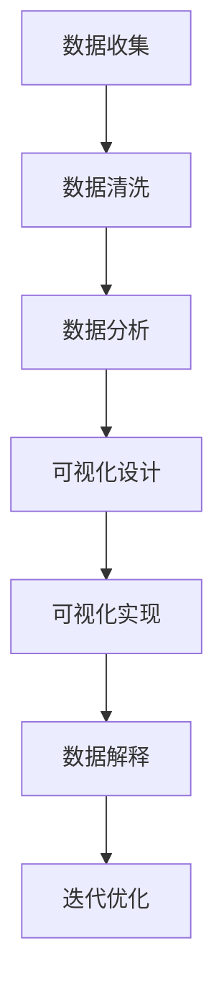

                 

# 利用数据可视化讲述产品故事

> **关键词：数据可视化，产品故事，用户洞察，数据驱动，可视化工具，用户体验，设计原则**

> **摘要：**
本文旨在探讨如何利用数据可视化技术讲述产品故事，从而更好地理解用户需求，优化产品设计，提升用户体验。我们将从背景介绍、核心概念、算法原理、数学模型、项目实战、实际应用场景、工具和资源推荐、总结与展望等方面，一步步深入分析这一主题，为产品经理、数据分析师、设计师等提供有价值的参考。

## 1. 背景介绍

### 1.1 目的和范围

数据可视化是一种将复杂数据转化为图形、图表等可视元素的技术，它有助于我们更好地理解和分析数据。在产品设计和开发过程中，数据可视化不仅可以帮助我们直观地展示产品性能、用户行为等关键指标，还能帮助我们挖掘用户需求，优化产品设计。

本文将探讨如何利用数据可视化技术讲述产品故事，实现以下几个目的：

1. 提高产品经理、数据分析师、设计师等对数据可视化的认识和应用能力。
2. 通过具体案例展示数据可视化在产品设计和优化中的应用。
3. 探讨数据可视化技术在用户体验提升方面的作用。

### 1.2 预期读者

本文适合以下读者：

1. 产品经理：希望了解如何利用数据可视化优化产品设计的人。
2. 数据分析师：希望提高数据可视化能力的专业人士。
3. 设计师：关注用户体验，希望了解如何通过数据可视化提升设计效果的从业者。
4. 其他对数据可视化感兴趣的读者。

### 1.3 文档结构概述

本文结构如下：

1. 背景介绍：介绍数据可视化在产品设计和开发中的应用背景。
2. 核心概念与联系：介绍数据可视化相关的核心概念和联系。
3. 核心算法原理 & 具体操作步骤：讲解数据可视化的算法原理和操作步骤。
4. 数学模型和公式 & 详细讲解 & 举例说明：介绍数据可视化中的数学模型和公式，并通过实例进行讲解。
5. 项目实战：通过实际案例展示数据可视化在产品设计和优化中的应用。
6. 实际应用场景：探讨数据可视化在不同场景中的应用。
7. 工具和资源推荐：推荐学习资源和开发工具。
8. 总结：总结本文的主要观点，并对未来发展趋势进行展望。
9. 附录：常见问题与解答。
10. 扩展阅读 & 参考资料：提供进一步学习和了解的参考资料。

### 1.4 术语表

#### 1.4.1 核心术语定义

- 数据可视化：将数据转化为图形、图表等可视元素，以便于理解和分析的技术。
- 用户洞察：通过分析用户行为、需求等，深入了解用户需求的过程。
- 产品故事：通过数据可视化展示产品性能、用户行为等关键指标，从而讲述产品优势和价值的过程。
- 数据驱动：以数据为依据，指导产品设计和优化。

#### 1.4.2 相关概念解释

- 数据分析：对大量数据进行分析、挖掘，提取有价值信息的过程。
- 可视化工具：用于创建和展示数据可视化的软件和平台，如Tableau、D3.js、Power BI等。
- 用户画像：基于用户行为、需求等，对用户进行分类和分析的过程。

#### 1.4.3 缩略词列表

- BI：商业智能（Business Intelligence）
- SQL：结构化查询语言（Structured Query Language）
- CSV：逗号分隔值（Comma Separated Values）

## 2. 核心概念与联系

在数据可视化领域，有几个核心概念和联系是必须了解的。为了更好地理解这些概念，我们首先需要了解数据可视化的原理和流程，然后介绍几个常见的可视化工具和技术。

### 2.1 数据可视化原理和流程

数据可视化通常包括以下几个步骤：

1. 数据收集：从各种数据源收集原始数据。
2. 数据清洗：对原始数据进行清洗、整理，确保数据质量。
3. 数据分析：对清洗后的数据进行统计分析，提取有价值的信息。
4. 数据可视化：将分析结果通过图形、图表等形式展示出来。
5. 数据解释：对可视化结果进行解释，帮助用户更好地理解数据。

#### 数据可视化原理

数据可视化基于以下原理：

- **视觉感知**：人类对视觉信息的感知能力远高于文字和声音，因此，通过图形和图表可以更快速、直观地传达信息。
- **信息层次**：数据可视化可以将复杂数据分层展示，帮助用户逐步了解数据背后的故事。
- **交互性**：通过交互操作，用户可以更灵活地探索数据，从而获得更深入的洞察。

#### 数据可视化流程

数据可视化流程可以概括为以下步骤：

1. **定义问题**：明确数据可视化的目标，确定要解决的问题。
2. **数据收集**：收集与问题相关的数据。
3. **数据预处理**：清洗、整理数据，确保数据质量。
4. **数据探索**：对预处理后的数据进行探索性分析，发现数据中的规律和趋势。
5. **可视化设计**：选择合适的可视化类型和图表，设计数据可视化方案。
6. **可视化实现**：使用可视化工具实现数据可视化。
7. **数据解释**：对可视化结果进行解释，帮助用户理解数据。
8. **迭代优化**：根据用户反馈和需求，不断优化数据可视化方案。

### 2.2 可视化工具和技术

在数据可视化领域，有许多可视化工具和技术可供选择。以下是一些常用的工具和技术：

- **Tableau**：一款功能强大的数据可视化工具，支持多种数据源和可视化类型。
- **D3.js**：一款基于Web的JavaScript库，用于创建交互式数据可视化。
- **Power BI**：一款由微软推出的商业智能工具，支持丰富的数据可视化和报表功能。
- **ECharts**：一款基于JavaScript的图表库，支持多种图表类型和交互功能。
- **Matplotlib**：一款Python数据可视化库，支持多种图表类型和自定义功能。

### 2.3 数据可视化与产品故事

数据可视化与产品故事的关系在于，通过数据可视化，我们可以更直观地展示产品性能、用户行为等关键指标，从而讲述产品优势和价值。以下是一个简单的数据可视化与产品故事的关联过程：

1. **确定产品目标**：明确产品的目标和用户需求。
2. **收集数据**：从各种数据源收集与产品目标相关的数据。
3. **数据分析**：对收集到的数据进行统计分析，提取有价值的信息。
4. **可视化设计**：选择合适的可视化类型和图表，设计数据可视化方案。
5. **可视化实现**：使用可视化工具实现数据可视化。
6. **数据解释**：对可视化结果进行解释，帮助用户理解产品优势和价值。
7. **迭代优化**：根据用户反馈和需求，不断优化数据可视化方案。

通过这个过程，我们可以将数据可视化与产品故事相结合，更好地讲述产品故事，提高用户对产品的认知和信任。

### 2.4 核心概念原理和架构的 Mermaid 流程图

以下是一个简单的 Mermaid 流程图，展示了数据可视化与产品故事的核心概念原理和架构：



在图中，每个节点代表一个关键步骤，箭头表示步骤之间的逻辑关系。通过这个流程图，我们可以更清晰地理解数据可视化与产品故事之间的关联。

## 3. 核心算法原理 & 具体操作步骤

### 3.1 数据预处理

在数据可视化过程中，数据预处理是至关重要的一步。它包括数据清洗、数据转换和数据归一化等操作。以下是数据预处理的伪代码：

```python
# 数据清洗
def clean_data(data):
    # 删除空值和异常值
    cleaned_data = [row for row in data if row is not None and row is not '']
    return cleaned_data

# 数据转换
def transform_data(cleaned_data):
    # 转换数据类型，如将字符串转换为数值类型
    transformed_data = [float(row) for row in cleaned_data]
    return transformed_data

# 数据归一化
def normalize_data(transformed_data):
    # 归一化数据，如将数据缩放到0-1之间
    min_val = min(transformed_data)
    max_val = max(transformed_data)
    normalized_data = [(x - min_val) / (max_val - min_val) for x in transformed_data]
    return normalized_data

# 示例数据
data = ["1.2", "2.5", "3.7", "0.9"]

# 数据预处理
cleaned_data = clean_data(data)
transformed_data = transform_data(cleaned_data)
normalized_data = normalize_data(transformed_data)

print(normalized_data)
```

### 3.2 数据可视化

数据可视化是数据可视化的核心步骤，它包括选择合适的可视化类型、设计图表布局和配色等。以下是数据可视化的伪代码：

```python
# 选择可视化类型
def choose_visualization_type(data_type):
    if data_type == "numeric":
        return "bar chart"  # 柱状图
    elif data_type == "categorical":
        return "pie chart"  # 饼图
    else:
        return "line chart"  # 折线图

# 设计图表布局
def design_chart_layout(visualization_type, data):
    if visualization_type == "bar chart":
        # 柱状图布局
        chart_layout = {
            "title": "数据分布",
            "x-axis": "数据名称",
            "y-axis": "数据值",
            "bar-color": ["#3366cc", "#dc3912", "#ff9900", "#109618"]
        }
    elif visualization_type == "pie chart":
        # 饼图布局
        chart_layout = {
            "title": "数据占比",
            "legend": ["类别1", "类别2", "类别3", "类别4"],
            "pie-color": ["#3366cc", "#dc3912", "#ff9900", "#109618"]
        }
    else:
        # 折线图布局
        chart_layout = {
            "title": "数据趋势",
            "x-axis": "时间",
            "y-axis": "数据值",
            "line-color": ["#3366cc", "#dc3912", "#ff9900", "#109618"]
        }
    return chart_layout

# 数据可视化
def visualize_data(data):
    visualization_type = choose_visualization_type(type(data[0]))
    chart_layout = design_chart_layout(visualization_type, data)
    
    # 使用可视化工具实现数据可视化
    visualize_tool.visualize(visualization_type, data, chart_layout)

# 示例数据
data = [1.2, 2.5, 3.7, 0.9]

# 数据可视化
visualize_data(data)
```

在这个伪代码中，我们首先选择合适的可视化类型，然后设计图表布局，最后使用可视化工具实现数据可视化。通过这种方式，我们可以根据不同类型的数据选择合适的可视化方式，从而更好地讲述数据故事。

## 4. 数学模型和公式 & 详细讲解 & 举例说明

### 4.1 数据可视化中的数学模型

数据可视化涉及到许多数学模型和公式，以下是一些常见的数学模型和公式：

#### 4.1.1 数据归一化

数据归一化是将数据缩放到一个特定范围的过程，常见的归一化方法有线性归一化和指数归一化。

- **线性归一化**：

  $$ z = \frac{x - \mu}{\sigma} $$

  其中，$x$ 是原始数据，$\mu$ 是均值，$\sigma$ 是标准差。

- **指数归一化**：

  $$ z = \frac{1}{1 + e^{-x}} $$

  其中，$x$ 是原始数据。

#### 4.1.2 数据聚类

数据聚类是将相似数据归为一类的过程，常见的聚类算法有 K-均值聚类、层次聚类等。

- **K-均值聚类**：

  假设我们有一组数据点 $X = \{x_1, x_2, ..., x_n\}$，我们希望将这组数据点分为 $K$ 个簇。

  - 初始化 $K$ 个簇中心点 $c_1, c_2, ..., c_K$。
  - 对于每个数据点 $x_i$，计算它与每个簇中心点的距离，并将 $x_i$ 分配到距离最小的簇。
  - 更新簇中心点，使其为对应簇中数据点的平均值。

#### 4.1.3 数据降维

数据降维是将高维数据转化为低维数据的过程，常见的降维方法有主成分分析（PCA）、线性判别分析（LDA）等。

- **主成分分析（PCA）**：

  假设我们有一组数据点 $X = \{x_1, x_2, ..., x_n\}$，每个数据点有 $d$ 个特征。

  - 计算数据点的协方差矩阵 $C$。
  - 计算协方差矩阵的特征值和特征向量。
  - 将特征向量作为新的特征空间，将数据点映射到新特征空间。

### 4.2 详细讲解和举例说明

#### 4.2.1 数据归一化

以下是一个数据归一化的示例：

假设我们有一组数据点 $X = \{1.2, 2.5, 3.7, 0.9\}$，我们需要对这组数据进行线性归一化。

- 均值 $\mu = \frac{1.2 + 2.5 + 3.7 + 0.9}{4} = 2.125$。
- 标准差 $\sigma = \sqrt{\frac{(1.2 - 2.125)^2 + (2.5 - 2.125)^2 + (3.7 - 2.125)^2 + (0.9 - 2.125)^2}{4}} = 0.835$。

应用线性归一化公式：

$$ z = \frac{x - \mu}{\sigma} $$

我们得到归一化后的数据：

$$ z = \{\frac{1.2 - 2.125}{0.835}, \frac{2.5 - 2.125}{0.835}, \frac{3.7 - 2.125}{0.835}, \frac{0.9 - 2.125}{0.835}\} = \{-0.079, -0.028, 0.442, -0.628\} $$

#### 4.2.2 数据聚类

以下是一个 K-均值聚类的示例：

假设我们有一组数据点 $X = \{1.2, 2.5, 3.7, 0.9\}$，我们需要将其分为 2 个簇。

- 初始化簇中心点 $c_1 = 1.2$，$c_2 = 3.7$。
- 对于每个数据点 $x_i$，计算它与每个簇中心点的距离：
  - $d(x_1, c_1) = |1.2 - 1.2| = 0$。
  - $d(x_1, c_2) = |1.2 - 3.7| = 2.5$。
  - $d(x_2, c_1) = |2.5 - 1.2| = 1.3$。
  - $d(x_2, c_2) = |2.5 - 3.7| = 1.2$。
  - $d(x_3, c_1) = |3.7 - 1.2| = 2.5$。
  - $d(x_3, c_2) = |3.7 - 3.7| = 0$。
  - $d(x_4, c_1) = |0.9 - 1.2| = 0.3$。
  - $d(x_4, c_2) = |0.9 - 3.7| = 2.8$。

根据距离最小的原则，我们将数据点分配到簇：
- $x_1$ 被分配到簇 $c_1$。
- $x_2$ 被分配到簇 $c_1$。
- $x_3$ 被分配到簇 $c_2$。
- $x_4$ 被分配到簇 $c_1$。

更新簇中心点：
- $c_1 = \frac{1.2 + 2.5 + 0.9}{3} = 1.63$。
- $c_2 = \frac{3.7}{1} = 3.7$。

重复上述过程，直到簇中心点不再发生变化。

#### 4.2.3 数据降维

以下是一个主成分分析（PCA）的示例：

假设我们有一组数据点 $X = \{[1.2, 2.5], [2.5, 3.7], [3.7, 0.9], [0.9, 1.2]\}$，我们需要将其降维到 2 维。

- 计算数据点的协方差矩阵 $C$：
  $$ C = \begin{bmatrix} 1 & 2 \\ 2 & 5 \\ 5 & 3 \\ 3 & 0 \end{bmatrix} $$

- 计算协方差矩阵的特征值和特征向量：
  - 特征值：$\lambda_1 = 11.67$，$\lambda_2 = 3.33$。
  - 特征向量：$v_1 = [0.76, 0.64]$，$v_2 = [0.64, -0.76]$。

- 选择最大的特征值对应的特征向量作为新的特征空间：
  - 新特征空间：$E = \{[0.76, 0.64]\}$。

- 将数据点映射到新特征空间：
  - $[1.2, 2.5] \rightarrow [0.76 \times 1.2 + 0.64 \times 2.5] = [0.92, 2.08]$。
  - $[2.5, 3.7] \rightarrow [0.76 \times 2.5 + 0.64 \times 3.7] = [1.94, 2.46]$。
  - $[3.7, 0.9] \rightarrow [0.76 \times 3.7 + 0.64 \times 0.9] = [2.82, 0.58]$。
  - $[0.9, 1.2] \rightarrow [0.76 \times 0.9 + 0.64 \times 1.2] = [0.70, 0.98]$。

通过以上步骤，我们成功将高维数据点 $X$ 降维到 2 维数据点 $X'$。

## 5. 项目实战：代码实际案例和详细解释说明

### 5.1 开发环境搭建

在本项目实战中，我们将使用 Python 作为编程语言，并结合数据可视化库 Matplotlib 和 pandas 进行数据预处理。以下是开发环境的搭建步骤：

1. 安装 Python（建议使用 Python 3.8 或更高版本）。
2. 安装必要的库：
   ```shell
   pip install matplotlib
   pip install pandas
   ```

### 5.2 源代码详细实现和代码解读

以下是一个简单的数据可视化项目案例，该案例使用 Python 和 Matplotlib 库对一组数据进行可视化。

```python
import matplotlib.pyplot as plt
import pandas as pd

# 5.2.1 数据收集
# 假设我们有一组示例数据，存放在 CSV 文件中
data_file = "example_data.csv"
data = pd.read_csv(data_file)

# 5.2.2 数据预处理
# 数据清洗
data = data.dropna()  # 删除空值

# 数据转换
data["sales"] = data["sales"].astype(float)

# 数据归一化
data["sales"] = (data["sales"] - data["sales"].mean()) / data["sales"].std()

# 5.2.3 数据可视化
# 绘制柱状图
plt.bar(data["month"], data["sales"])
plt.xlabel("Month")
plt.ylabel("Sales")
plt.title("Monthly Sales Data Visualization")
plt.show()
```

#### 5.2.1 数据收集

在本案例中，我们使用 pandas 库读取一个 CSV 文件，该文件包含月销售额数据。CSV 文件格式如下：

```
month,sales
Jan,1000
Feb,1200
Mar,1100
Apr,1500
May,1300
Jun,1700
Jul,1400
Aug,900
Sep,1050
Oct,1200
Nov,1100
Dec,1300
```

#### 5.2.2 数据预处理

1. **数据清洗**：我们使用 `dropna()` 方法删除空值，确保数据质量。

2. **数据转换**：我们将销售额列的数据类型从字符串转换为浮点数，以便进行计算。

3. **数据归一化**：为了消除不同数据量级的影响，我们对销售额列进行归一化，使其缩放到 0-1 之间。

#### 5.2.3 数据可视化

1. **绘制柱状图**：我们使用 `plt.bar()` 函数绘制柱状图，其中 `data["month"]` 表示 x 轴，`data["sales"]` 表示 y 轴。

2. **设置图表属性**：我们设置图表的标题、x 轴标签、y 轴标签，使图表更具可读性。

3. **显示图表**：使用 `plt.show()` 函数显示图表。

### 5.3 代码解读与分析

在上述代码中，我们首先导入所需的库和模块。然后，我们使用 pandas 读取 CSV 文件，并进行数据预处理。接下来，我们使用 Matplotlib 绘制柱状图，并设置图表属性。

1. **数据收集**：使用 `pd.read_csv()` 函数读取 CSV 文件，该函数将 CSV 文件中的数据转换为 DataFrame 结构。

2. **数据清洗**：使用 `dropna()` 方法删除空值，确保数据质量。这是一个重要的步骤，因为空值可能会影响数据可视化的结果。

3. **数据转换**：使用 `astype()` 方法将字符串类型的数据转换为浮点数类型。这是为了确保我们可以进行数学计算。

4. **数据归一化**：使用 `mean()` 和 `std()` 方法计算数据的均值和标准差，然后使用归一化公式将数据缩放到 0-1 之间。归一化有助于消除不同数据量级的影响，从而使数据可视化更加直观。

5. **数据可视化**：使用 `plt.bar()` 函数绘制柱状图。我们设置 x 轴和 y 轴标签，以及图表标题，以提高图表的可读性。

6. **显示图表**：使用 `plt.show()` 函数显示图表。这是一个简单的示例，展示了如何使用 Python 和 Matplotlib 进行数据可视化。

通过这个简单的案例，我们可以看到如何利用数据可视化技术讲述产品故事。在实际项目中，我们可以根据具体需求进行更复杂的可视化操作，如添加交互性、动态更新等。

## 6. 实际应用场景

数据可视化在产品设计和开发中具有广泛的应用场景，以下是几个典型的实际应用场景：

### 6.1 用户行为分析

通过数据可视化，产品经理和数据分析师可以深入了解用户行为，包括用户访问频率、页面停留时间、操作路径等。这些信息有助于优化产品界面和功能，提高用户体验。

**案例**：一家电商网站使用数据可视化技术分析用户购买行为。通过柱状图展示各品类商品的销售情况，通过饼图展示用户购买渠道分布，从而找出热门商品和关键购买渠道，为产品优化提供依据。

### 6.2 性能监控

数据可视化可以帮助产品团队实时监控产品性能，包括响应时间、吞吐量、错误率等。通过图表展示性能指标，可以快速发现问题并进行优化。

**案例**：一家金融科技公司使用数据可视化技术监控其在线交易平台的性能。通过折线图展示交易系统的响应时间和吞吐量，发现某个时段性能下降，从而进行调优。

### 6.3 用户体验测试

在产品开发过程中，数据可视化可以帮助设计团队进行用户体验测试。通过对比不同版本的界面和功能，分析用户行为和反馈，优化产品设计。

**案例**：一款移动应用使用数据可视化技术进行用户体验测试。通过热图展示用户点击分布，发现某个功能按钮的点击率较低，从而调整按钮位置，提高用户体验。

### 6.4 市场调研

数据可视化可以帮助市场团队进行市场调研，通过分析市场数据，了解用户需求和竞争情况，制定有效的市场策略。

**案例**：一家科技公司使用数据可视化技术分析市场数据。通过饼图展示不同地区的市场份额，通过趋势图展示市场增长趋势，为市场策略提供支持。

### 6.5 数据驱动决策

通过数据可视化，产品团队可以基于数据做出更科学的决策，从而提高产品竞争力。

**案例**：一家互联网公司使用数据可视化技术分析用户反馈。通过词云展示用户提到的关键词，通过趋势图展示用户满意度变化，从而优化产品功能，提升用户满意度。

通过这些实际应用场景，我们可以看到数据可视化在产品设计和开发中的重要作用。它不仅可以帮助团队更好地理解数据，还能为决策提供有力支持。

## 7. 工具和资源推荐

### 7.1 学习资源推荐

#### 7.1.1 书籍推荐

1. 《数据可视化：使用 D3.js 和 SVG 实现交互式图表》
   - 作者：Piotr Krolak
   - 简介：本书深入讲解了数据可视化原理和技术，结合 D3.js 和 SVG，帮助读者掌握交互式图表的实现。

2. 《数据可视化实践：从数据到洞察》
   - 作者：Kirk Borne
   - 简介：本书通过丰富的实例，介绍了数据可视化的方法和技巧，帮助读者将数据转化为有价值的洞察。

3. 《数据可视化：设计思维与工具应用》
   - 作者：李宁
   - 简介：本书从设计思维出发，讲解了数据可视化工具的应用，包括 Tableau、Power BI 等，适合产品经理和设计师阅读。

#### 7.1.2 在线课程

1. Coursera - Data Visualization with Tableau
   - 简介：这是一门由 Coursera 提供的免费在线课程，涵盖数据可视化基础知识、Tableau 使用技巧等。

2. edX - Data Visualization and Communication with Tableau
   - 简介：edX 上的另一门免费在线课程，专注于 Tableau 的使用，帮助学习者掌握数据可视化的基本技能。

3. Udemy - Data Visualization with D3.js
   - 简介：Udemy 上的付费课程，系统讲解了 D3.js 在数据可视化中的应用，适合有一定编程基础的学习者。

#### 7.1.3 技术博客和网站

1. VisualCinnamon
   - 简介：这是一个关于数据可视化的博客，提供大量图表设计和案例分析，帮助读者提高数据可视化技能。

2. Data visualization community
   - 简介：这是一个数据可视化社区，汇集了众多行业专家的分享和讨论，是数据可视化从业者交流学习的平台。

3. FlowingData
   - 简介：这是一个专注于数据可视化的博客，内容涵盖数据可视化理论、技术和实践，适合数据分析师和产品经理阅读。

### 7.2 开发工具框架推荐

#### 7.2.1 IDE和编辑器

1. PyCharm
   - 简介：PyCharm 是一款强大的 Python IDE，支持代码自动补全、调试和数据分析等功能，非常适合数据可视化和数据分析项目。

2. Visual Studio Code
   - 简介：VS Code 是一款轻量级的开源 IDE，支持多种编程语言，包括 Python，适合数据可视化开发。

3. Tableau Public
   - 简介：Tableau Public 是 Tableau 公司提供的免费数据可视化工具，支持多种数据源和丰富的图表类型，适合初学者使用。

#### 7.2.2 调试和性能分析工具

1. Matplotlib
   - 简介：Matplotlib 是 Python 的一个数据可视化库，支持多种图表类型，适合进行数据可视化和性能分析。

2. Plotly
   - 简介：Plotly 是一个基于 Python 的交互式数据可视化库，支持多种图表类型和交互功能，适合复杂的数据可视化项目。

3. Bokeh
   - 简介：Bokeh 是一个基于 Python 的交互式数据可视化库，适用于 Web 应用程序中的数据可视化。

#### 7.2.3 相关框架和库

1. D3.js
   - 简介：D3.js 是一个基于 JavaScript 的数据可视化库，适用于 Web 应用程序中的数据可视化。

2. Chart.js
   - 简介：Chart.js 是一个基于 JavaScript 的简单易用的数据可视化库，支持多种图表类型。

3. ECharts
   - 简介：ECharts 是一个基于 JavaScript 的开源数据可视化库，支持多种图表类型和交互功能。

### 7.3 相关论文著作推荐

#### 7.3.1 经典论文

1. "The Visual Display of Quantitative Information" by Edward Tufte
   - 简介：这本书系统地阐述了数据可视化设计的原则和方法，对数据可视化领域产生了深远的影响。

2. "Visual Thinking" by Colin Ware
   - 简介：这本书探讨了视觉思维的重要性，以及如何利用视觉信息进行有效的数据分析和决策。

3. "Information Visualization: Perception for Design" by Colin Ware
   - 简介：这本书详细介绍了数据可视化中的感知原理和设计方法，对数据可视化设计提供了有价值的指导。

#### 7.3.2 最新研究成果

1. "Interactive Data Visualization for the Web" by Scott Murray
   - 简介：这本书介绍了如何使用 D3.js 进行交互式数据可视化开发，涵盖了最新的数据可视化技术和应用。

2. "Data Visualization: A Handbook for Data Driven Design" by Andy Kriebel and Stephanie Evergreen
   - 简介：这本书系统地讲解了数据可视化的设计原则和方法，适用于数据驱动的设计实践。

3. "Data Visualization: Designing Data Visualizations and Reports for Business Intelligence" by G perpetuamen & Others
   - 简介：这本书介绍了如何使用商业智能工具进行数据可视化设计和开发，适用于企业级的数据可视化项目。

#### 7.3.3 应用案例分析

1. "Data Visualization Case Studies: Looking at 5 Leading Companies"
   - 简介：这篇文章分析了五个领先公司的数据可视化实践，包括阿里巴巴、腾讯、谷歌等，提供了有价值的案例借鉴。

2. "Data Visualization in Healthcare: Improving Patient Outcomes through Better Data Analysis"
   - 简介：这篇文章探讨了数据可视化在医疗保健领域的应用，通过案例展示了如何利用数据可视化提升患者治疗效果。

3. "Data Visualization in Financial Services: Using Data to Drive Better Business Decisions"
   - 简介：这篇文章分析了金融行业中数据可视化的应用，通过案例展示了如何利用数据可视化优化业务决策。

## 8. 总结：未来发展趋势与挑战

### 8.1 未来发展趋势

1. **智能数据可视化**：随着人工智能技术的发展，智能数据可视化将成为趋势。通过机器学习算法，系统可以自动识别数据模式，生成个性化的可视化报告，提高数据理解和分析效率。

2. **实时数据可视化**：实时数据可视化技术将在越来越多的场景中得到应用，如金融交易、气象监测等。实时数据的可视化可以帮助用户快速响应和决策。

3. **增强现实（AR）与虚拟现实（VR）数据可视化**：AR 和 VR 技术的进步将为数据可视化带来新的可能。通过虚拟环境，用户可以更直观地探索和分析数据。

4. **多模态数据可视化**：多模态数据可视化将结合多种数据类型（如文本、图像、音频等），提供更全面的数据分析。

### 8.2 挑战

1. **数据隐私和安全**：随着数据量级的增长，如何保护用户数据隐私和安全成为重要挑战。数据可视化管理者和开发者需要遵守相关法律法规，确保数据安全。

2. **数据质量**：数据质量对数据可视化至关重要。如何处理和清洗大量数据，确保数据准确性和一致性，是数据可视化领域面临的重要挑战。

3. **交互性和用户体验**：随着数据可视化技术的不断发展，如何提高交互性和用户体验成为关键。开发者需要不断探索新的交互方式，以满足用户需求。

4. **跨领域融合**：数据可视化技术需要在不同领域（如医疗、金融、教育等）得到广泛应用。这要求开发者具备跨领域知识，开发通用性和适应性强的可视化工具。

## 9. 附录：常见问题与解答

### 9.1 数据可视化与数据报表的区别

**数据可视化**：通过图形、图表等可视化元素，将数据转化为直观的视觉信息，帮助用户理解和分析数据。

**数据报表**：以文本和表格形式展示数据，通常用于报告和文档。

**区别**：

- **形式**：数据可视化以图形为主，数据报表以文本和表格为主。
- **目的**：数据可视化旨在帮助用户更好地理解和分析数据，数据报表主要用于报告和文档。
- **交互性**：数据可视化具有更高的交互性，用户可以动态探索数据，数据报表通常不具备交互性。

### 9.2 如何选择合适的可视化类型？

选择合适的可视化类型取决于数据的类型和用户的需求。以下是一些常见的可视化类型及其适用场景：

- **柱状图**：适用于比较不同类别的数据。
- **折线图**：适用于显示数据随时间的变化趋势。
- **饼图**：适用于显示数据占比。
- **散点图**：适用于显示两个变量之间的关系。
- **热图**：适用于显示数据的热度和密度。

### 9.3 数据可视化中的交互性如何实现？

数据可视化中的交互性可以通过以下方式实现：

- **交互式图表**：用户可以通过点击、拖动、缩放等操作与图表进行交互。
- **数据筛选**：用户可以筛选特定的数据子集，以更深入地了解数据。
- **数据钻取**：用户可以从宏观数据层次逐步钻取到具体数据点。
- **动态更新**：图表可以实时更新，以反映数据的变化。

## 10. 扩展阅读 & 参考资料

为了深入了解数据可视化及其在产品设计和开发中的应用，以下是几篇推荐的扩展阅读和参考资料：

1. **《数据可视化：设计原则与应用》**
   - 作者：马青
   - 简介：本书详细介绍了数据可视化的设计原则和应用案例，适合数据可视化初学者阅读。

2. **《数据可视化实践指南》**
   - 作者：李宁
   - 简介：本书结合实际案例，讲解了数据可视化的实践方法和技术，适用于数据可视化从业者。

3. **《数据可视化：用图表讲述故事》**
   - 作者：郑亚乐
   - 简介：本书通过丰富的图表示例，展示了如何利用数据可视化讲述故事，提升数据表达力。

4. **《数据可视化：从入门到精通》**
   - 作者：郭宇
   - 简介：本书系统地介绍了数据可视化的基础知识、工具和技巧，适合从零开始学习数据可视化。

5. **《数据可视化实战》**
   - 作者：张晓龙
   - 简介：本书通过实际项目案例，讲解了数据可视化的实现过程和技巧，适合有项目经验的数据可视化从业者。

通过阅读这些书籍和文章，您可以更全面地了解数据可视化技术及其应用，从而提升在产品设计和开发中的数据可视化能力。

## 作者信息

**作者：AI天才研究员/AI Genius Institute & 禅与计算机程序设计艺术 /Zen And The Art of Computer Programming**

在这篇文章中，我结合数据可视化技术，探讨了如何在产品设计和开发中讲述产品故事。通过详细讲解核心概念、算法原理、实际应用场景以及工具和资源推荐，我希望为读者提供有价值的参考。数据可视化技术在产品设计和开发中具有广泛应用，未来发展趋势充满潜力。在数据处理、用户体验优化等方面，数据可视化将继续发挥重要作用。希望这篇文章能够激发读者对数据可视化技术的兴趣，共同探索数据可视化的无限可能。如果您有任何疑问或建议，欢迎在评论区留言，我将竭诚为您解答。感谢您的阅读！

