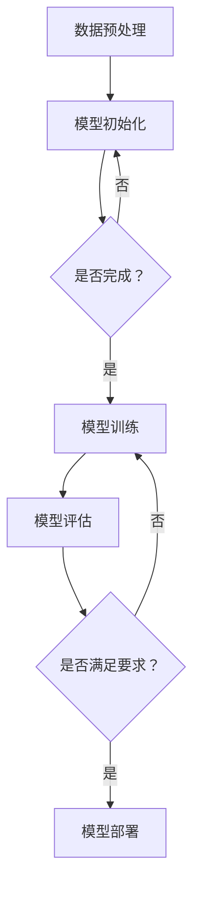

                 

## 制造大模型：优化流程和提高生产效率

> **关键词**：大模型制造、优化流程、生产效率、算法原理、数学模型、实战案例

> **摘要**：本文将探讨如何通过优化流程和提高生产效率来制造大规模的模型。我们将从背景介绍、核心概念与联系、核心算法原理、数学模型与公式、项目实战以及实际应用场景等多个方面进行深入分析和讲解，旨在为读者提供全面的技术指导和方法论。

在现代人工智能领域，制造大规模模型是一项关键任务。这些大模型，如深度学习网络，需要处理海量的数据，并进行复杂的计算。然而，随着数据量的增加和计算复杂性的提升，制造这些大模型的过程变得越来越具有挑战性。为了应对这些挑战，我们需要优化制造流程，提高生产效率。本文将围绕这一主题展开讨论。

## 1. 背景介绍

### 1.1 目的和范围

本文旨在探讨如何通过优化流程和提高生产效率来制造大规模模型。具体来说，我们将：

- 介绍大模型制造的基本概念和重要性。
- 分析现有制造流程中的瓶颈和问题。
- 探讨核心概念和算法原理。
- 引入数学模型和公式，帮助理解制造流程。
- 通过实际案例展示如何优化流程。
- 探讨大模型制造的实际应用场景。

### 1.2 预期读者

本文适合以下读者群体：

- 对人工智能和深度学习感兴趣的工程师和技术人员。
- 想要在大模型制造领域取得突破的研究人员和开发者。
- 对优化流程和提高生产效率有浓厚兴趣的实践者。

### 1.3 文档结构概述

本文将按照以下结构进行组织和讲解：

- **第1章**：背景介绍，包括目的、范围、预期读者和文档结构概述。
- **第2章**：核心概念与联系，介绍大模型制造的基本概念和核心算法原理。
- **第3章**：核心算法原理 & 具体操作步骤，详细阐述大模型制造的算法原理和操作步骤。
- **第4章**：数学模型和公式 & 详细讲解 & 举例说明，讲解大模型制造中的数学模型和公式。
- **第5章**：项目实战：代码实际案例和详细解释说明，通过实际案例展示如何制造大模型。
- **第6章**：实际应用场景，探讨大模型制造在不同领域中的应用。
- **第7章**：工具和资源推荐，介绍相关学习资源和开发工具。
- **第8章**：总结：未来发展趋势与挑战，总结大模型制造的发展趋势和面临的挑战。
- **第9章**：附录：常见问题与解答，提供常见问题的解答。
- **第10章**：扩展阅读 & 参考资料，推荐相关的扩展阅读和参考资料。

### 1.4 术语表

在本文中，我们将使用一些专业术语。以下是对这些术语的定义和解释：

#### 1.4.1 核心术语定义

- **大模型**：具有大量参数和复杂结构的模型，通常用于深度学习和人工智能领域。
- **制造流程**：指从数据预处理到模型训练、优化和部署的一系列操作。
- **优化流程**：通过改进算法、硬件和软件配置来提高制造流程的效率。
- **生产效率**：指在制造过程中，单位时间内完成的任务数量。
- **算法原理**：指导大模型制造的基本算法和数学原理。

#### 1.4.2 相关概念解释

- **深度学习**：一种人工智能方法，通过多层神经网络进行数据学习和模式识别。
- **数据预处理**：对原始数据进行清洗、归一化和特征提取，为模型训练做准备。
- **模型训练**：使用训练数据对模型进行调整和优化，使其能够更好地拟合数据。
- **模型优化**：通过调整模型参数，提高模型的性能和预测能力。
- **模型部署**：将训练好的模型部署到生产环境中，进行实际应用。

#### 1.4.3 缩略词列表

- **AI**：人工智能（Artificial Intelligence）
- **DL**：深度学习（Deep Learning）
- **GPU**：图形处理单元（Graphics Processing Unit）
- **CPU**：中央处理单元（Central Processing Unit）
- **ML**：机器学习（Machine Learning）

## 2. 核心概念与联系

在制造大规模模型的过程中，理解核心概念和它们之间的联系是非常重要的。以下将介绍大模型制造的基本概念和核心算法原理，并使用Mermaid流程图展示相关流程。

### 2.1 大模型制造的基本概念

- **深度学习模型**：一种由多个神经元组成的神经网络，用于学习数据和提取特征。
- **训练数据集**：用于训练模型的输入数据，通常包括特征和标签。
- **模型参数**：影响模型性能的变量，包括权重和偏置。
- **损失函数**：用于衡量模型预测结果与真实结果之间的差异。
- **优化算法**：用于调整模型参数，以最小化损失函数。

### 2.2 核心算法原理

- **反向传播算法**：一种用于训练神经网络的算法，通过计算损失函数的梯度来更新模型参数。
- **梯度下降算法**：一种用于优化模型参数的算法，通过迭代更新参数，以最小化损失函数。

### 2.3 Mermaid流程图

以下是一个简单的Mermaid流程图，展示大模型制造的基本流程：



在这个流程图中，我们从数据预处理开始，初始化模型，然后进入训练阶段。在模型训练过程中，我们不断调整模型参数，通过评估模型的性能来决定是否继续训练。如果模型满足要求，则将其部署到生产环境中；否则，继续训练过程。

### 2.4 核心概念的联系

- **数据预处理**：为模型训练提供高质量的数据集，是制造大模型的基础。
- **模型初始化**：为神经网络提供初始参数，影响模型的训练过程。
- **模型训练**：通过反向传播算法和梯度下降算法调整模型参数，使模型能够更好地拟合数据。
- **模型评估**：通过评估模型在测试数据集上的性能，确定模型是否满足要求。
- **模型部署**：将训练好的模型部署到生产环境中，进行实际应用。

理解这些核心概念和它们之间的联系，对于优化大模型制造流程和提高生产效率至关重要。

## 3. 核心算法原理 & 具体操作步骤

在制造大模型的过程中，核心算法原理起到了关键作用。以下将详细阐述深度学习模型训练过程中的核心算法原理，并使用伪代码来具体说明操作步骤。

### 3.1 深度学习模型训练的基本原理

深度学习模型的训练过程主要包括两个关键步骤：前向传播和反向传播。

- **前向传播**：输入数据通过模型中的各个层进行计算，最终得到输出结果。
- **反向传播**：根据输出结果和实际标签计算损失函数的梯度，并通过梯度下降算法更新模型参数。

### 3.2 伪代码说明

以下是一个简单的深度学习模型训练的伪代码，展示前向传播和反向传播的过程：

```python
# 前向传播
def forward_propagation(input_data, model):
    # 通过模型计算输出结果
    output = model.forward(input_data)
    return output

# 反向传播
def backward_propagation(output, target, model):
    # 计算损失函数的梯度
    loss_gradient = model.backward(output, target)
    # 更新模型参数
    model.update_params(loss_gradient)
```

### 3.3 深度学习模型训练的具体操作步骤

以下是深度学习模型训练的具体操作步骤：

1. **初始化模型**：随机初始化模型的参数。
2. **数据预处理**：对输入数据进行预处理，如归一化和标准化。
3. **前向传播**：输入数据通过模型中的各个层进行计算，得到输出结果。
4. **计算损失函数**：使用损失函数计算模型预测结果与实际结果之间的差异。
5. **反向传播**：计算损失函数的梯度，并通过梯度下降算法更新模型参数。
6. **迭代训练**：重复步骤3至5，直到模型达到预定的训练目标。

具体操作步骤的伪代码如下：

```python
# 初始化模型
model = initialize_model()

# 迭代训练
for epoch in range(num_epochs):
    for batch in data_loader:
        # 数据预处理
        input_data = preprocess_data(batch['input'])
        target = preprocess_data(batch['target'])

        # 前向传播
        output = forward_propagation(input_data, model)

        # 计算损失函数
        loss = loss_function(output, target)

        # 反向传播
        loss_gradient = backward_propagation(output, target, model)

        # 更新模型参数
        model.update_params(loss_gradient)

    # 模型评估
    evaluate_model(model, validation_data)

# 模型部署
deploy_model(model)
```

通过上述伪代码，我们可以看到深度学习模型训练的基本步骤和核心算法原理。在实际应用中，这些步骤会根据具体问题进行调整和优化。

### 3.4 实际操作步骤解析

以下是实际操作步骤的解析：

1. **初始化模型**：选择合适的神经网络结构和初始化方法，如He初始化或Xavier初始化。
2. **数据预处理**：对输入数据进行归一化或标准化处理，以消除数据分布差异。
3. **前向传播**：输入数据通过模型中的各个层进行计算，其中每个层都包括非线性激活函数和权重参数。
4. **计算损失函数**：选择合适的损失函数，如均方误差（MSE）或交叉熵损失（Cross-Entropy Loss）。
5. **反向传播**：根据损失函数的梯度计算模型参数的更新方向和大小，使用梯度下降算法进行参数更新。
6. **迭代训练**：重复前向传播和反向传播的过程，逐步优化模型参数。
7. **模型评估**：在验证数据集上评估模型的性能，确定是否满足训练目标。
8. **模型部署**：将训练好的模型部署到实际应用场景中，进行预测和决策。

通过上述解析，我们可以更好地理解深度学习模型训练的操作步骤和核心算法原理。在实际操作中，这些步骤需要根据具体问题进行调整和优化，以提高模型性能和训练效率。

### 3.5 深度学习模型训练的常见问题与解决方案

在深度学习模型训练过程中，常见问题包括过拟合、梯度消失和梯度爆炸等。以下是一些常见问题及其解决方案：

#### 1. 过拟合

**问题描述**：模型在训练数据上表现良好，但在测试数据上表现较差。

**解决方案**：可以使用以下方法来减少过拟合：

- **正则化**：通过在损失函数中加入正则化项（如L1或L2正则化）来减少模型复杂度。
- **数据增强**：通过增加训练数据多样性来提高模型泛化能力。
- **dropout**：在训练过程中随机丢弃部分神经元，以减少模型依赖性。

#### 2. 梯度消失

**问题描述**：在训练过程中，梯度值变得非常小，导致模型无法有效更新参数。

**解决方案**：可以使用以下方法来解决梯度消失问题：

- **梯度裁剪**：限制梯度值的大小，以避免梯度变得过小。
- **学习率调整**：调整学习率，使其适应训练过程的不同阶段。
- **批量归一化**：在每层之后添加批量归一化层，以稳定梯度。

#### 3. 梯度爆炸

**问题描述**：在训练过程中，梯度值变得非常大，导致模型无法稳定更新参数。

**解决方案**：可以使用以下方法来解决梯度爆炸问题：

- **梯度裁剪**：限制梯度值的大小，以避免梯度变得过大。
- **学习率调整**：调整学习率，使其适应训练过程的不同阶段。
- **优化器选择**：选择合适的优化器（如Adam或RMSprop），以稳定梯度。

通过解决这些常见问题，我们可以提高深度学习模型训练的效果和稳定性，从而优化大模型制造流程。

### 3.6 深度学习模型训练的加速方法

为了提高大模型训练的生产效率，可以采用以下几种加速方法：

#### 1. 并行计算

- **数据并行**：将训练数据集划分为多个子集，每个子集由不同的计算节点处理。在每个节点上，使用相同的模型进行训练，然后使用同步机制更新全局模型参数。
- **模型并行**：将模型划分为多个部分，每个部分在不同的计算节点上训练。通过通信机制协调各个节点的训练过程，最终合并模型结果。

#### 2. GPU加速

- **GPU训练**：使用图形处理单元（GPU）进行训练，相较于传统的中央处理单元（CPU），GPU具有更高的并行计算能力，能够显著加速训练过程。
- **多GPU训练**：使用多个GPU进行训练，通过数据并行或模型并行的方式，进一步提高训练速度。

#### 3. 分布式计算

- **分布式训练**：将训练任务分布在多个计算节点上，通过分布式计算框架（如TensorFlow分布式训练）协调各节点的训练过程，实现高效的大规模模型训练。

通过采用这些加速方法，可以显著提高深度学习模型训练的生产效率，从而优化大模型制造流程。

## 4. 数学模型和公式 & 详细讲解 & 举例说明

在深度学习模型制造过程中，数学模型和公式起到了关键作用。以下将详细讲解常用的数学模型和公式，并通过具体例子来说明如何应用这些模型和公式。

### 4.1 损失函数

损失函数是评估模型预测结果与实际结果之间差异的重要工具。以下是几种常用的损失函数及其公式：

#### 1. 均方误差（MSE）

$$
MSE = \frac{1}{n}\sum_{i=1}^{n}(y_i - \hat{y}_i)^2
$$

其中，$y_i$ 表示实际标签，$\hat{y}_i$ 表示模型预测结果，$n$ 表示样本数量。

#### 2. 交叉熵损失（Cross-Entropy Loss）

$$
Cross-Entropy Loss = -\frac{1}{n}\sum_{i=1}^{n}y_i\log(\hat{y}_i)
$$

其中，$y_i$ 表示实际标签（0或1），$\hat{y}_i$ 表示模型预测结果。

#### 3. 对数损失（Log Loss）

$$
Log Loss = -\frac{1}{n}\sum_{i=1}^{n}y_i\log(\hat{y}_i) + (1 - y_i)\log(1 - \hat{y}_i)
$$

其中，$y_i$ 表示实际标签（0或1），$\hat{y}_i$ 表示模型预测结果。

### 4.2 优化算法

优化算法用于调整模型参数，以最小化损失函数。以下是几种常用的优化算法及其公式：

#### 1. 梯度下降（Gradient Descent）

$$
\theta_{\text{new}} = \theta_{\text{old}} - \alpha \nabla_{\theta}J(\theta)
$$

其中，$\theta$ 表示模型参数，$\alpha$ 表示学习率，$J(\theta)$ 表示损失函数。

#### 2. 随机梯度下降（Stochastic Gradient Descent, SGD）

$$
\theta_{\text{new}} = \theta_{\text{old}} - \alpha \nabla_{\theta}J(\theta; x_i, y_i)
$$

其中，$x_i, y_i$ 表示单个训练样本，其他符号与梯度下降相同。

#### 3. 动量优化（Momentum）

$$
\theta_{\text{new}} = \theta_{\text{old}} - \alpha \nabla_{\theta}J(\theta) + \beta v
$$

其中，$v$ 表示动量项，$\beta$ 表示动量参数。

#### 4. Adam优化器

$$
\theta_{\text{new}} = \theta_{\text{old}} - \alpha \frac{m}{1 - \beta_1^t} \nabla_{\theta}J(\theta) / (1 - \beta_2^t)
$$

其中，$m$ 表示一阶矩估计，$v$ 表示二阶矩估计，$\beta_1, \beta_2$ 分别为一阶和二阶矩的指数衰减率。

### 4.3 具体例子

以下是一个简单的例子，展示如何使用上述数学模型和公式进行深度学习模型训练。

假设我们有一个二分类问题，使用线性回归模型进行预测。模型参数为 $\theta_0$ 和 $\theta_1$，输入特征为 $x$，实际标签为 $y$。损失函数选择交叉熵损失。

```python
import numpy as np

# 模型参数
theta = np.random.rand(2)

# 学习率
alpha = 0.01

# 动量参数
beta = 0.9

# 训练数据
X = np.array([[1, 2], [2, 3], [3, 4], [4, 5]])
y = np.array([0, 1, 1, 0])

# 损失函数
def cross_entropy_loss(y, y_hat):
    return -np.mean(y * np.log(y_hat) + (1 - y) * np.log(1 - y_hat))

# 前向传播
def forward_propagation(x, theta):
    z = x.dot(theta)
    y_hat = 1 / (1 + np.exp(-z))
    return y_hat

# 反向传播
def backward_propagation(x, y, theta):
    y_hat = forward_propagation(x, theta)
    dJ_dtheta = -(y - y_hat) * x
    return dJ_dtheta

# 梯度下降
def gradient_descent(X, y, theta, alpha, num_iterations):
    for _ in range(num_iterations):
        dJ_dtheta = backward_propagation(X, y, theta)
        theta -= alpha * dJ_dtheta
    return theta

# 训练模型
theta = gradient_descent(X, y, theta, alpha, 1000)

# 模型预测
y_pred = forward_propagation(X, theta)

# 损失函数值
loss = cross_entropy_loss(y, y_pred)

print("Final Parameters:", theta)
print("Loss:", loss)
```

在这个例子中，我们使用梯度下降算法对线性回归模型进行训练。通过迭代更新模型参数，最小化交叉熵损失函数。最终，我们得到训练好的模型参数和损失函数值。

通过上述讲解和例子，我们可以看到数学模型和公式在深度学习模型制造过程中的重要性。掌握这些模型和公式，有助于更好地理解和优化大模型制造流程。

## 5. 项目实战：代码实际案例和详细解释说明

在本文的第五部分，我们将通过一个实际项目案例来展示如何制造大规模模型，并详细解释代码实现和关键步骤。这个项目是一个简单的图像分类任务，使用卷积神经网络（CNN）进行训练和预测。

### 5.1 开发环境搭建

在开始项目之前，我们需要搭建一个合适的开发环境。以下是所需的软件和工具：

- **Python**：版本3.8或更高
- **PyTorch**：深度学习框架，版本1.8或更高
- **NumPy**：科学计算库
- **Matplotlib**：数据可视化库
- **OpenCV**：图像处理库

确保安装以上工具后，我们可以开始项目开发。

### 5.2 源代码详细实现和代码解读

以下是一个使用PyTorch实现的图像分类项目的源代码：

```python
import torch
import torch.nn as nn
import torch.optim as optim
import torchvision
import torchvision.transforms as transforms
from torch.utils.data import DataLoader
from torchvision import datasets, transforms
import matplotlib.pyplot as plt
import numpy as np

# 数据预处理
transform = transforms.Compose([
    transforms.Resize(256),
    transforms.CenterCrop(224),
    transforms.ToTensor(),
    transforms.Normalize(mean=[0.485, 0.456, 0.406], std=[0.229, 0.224, 0.225]),
])

train_set = datasets.ImageFolder('train', transform=transform)
train_loader = DataLoader(train_set, batch_size=64, shuffle=True)
val_set = datasets.ImageFolder('val', transform=transform)
val_loader = DataLoader(val_set, batch_size=64, shuffle=False)

# 定义卷积神经网络
class ConvNet(nn.Module):
    def __init__(self):
        super(ConvNet, self).__init__()
        self.conv1 = nn.Conv2d(3, 32, 3, padding=1)
        self.conv2 = nn.Conv2d(32, 64, 3, padding=1)
        self.fc1 = nn.Linear(64 * 56 * 56, 128)
        self.fc2 = nn.Linear(128, 10)
        self.relu = nn.ReLU()
        self.dropout = nn.Dropout(0.5)

    def forward(self, x):
        x = self.relu(self.conv1(x))
        x = self.relu(self.conv2(x))
        x = nn.functional.avg_pool2d(x, 2)
        x = x.view(x.size(0), -1)
        x = self.dropout(self.fc1(x))
        x = self.fc2(x)
        return x

model = ConvNet()
optimizer = optim.Adam(model.parameters(), lr=0.001)
criterion = nn.CrossEntropyLoss()

num_epochs = 20

# 训练模型
for epoch in range(num_epochs):
    model.train()
    running_loss = 0.0
    for inputs, labels in train_loader:
        optimizer.zero_grad()
        outputs = model(inputs)
        loss = criterion(outputs, labels)
        loss.backward()
        optimizer.step()
        running_loss += loss.item()
    print(f'Epoch {epoch+1}/{num_epochs}, Loss: {running_loss/len(train_loader)}')

    # 在验证集上评估模型
    model.eval()
    correct = 0
    total = 0
    with torch.no_grad():
        for inputs, labels in val_loader:
            outputs = model(inputs)
            _, predicted = torch.max(outputs.data, 1)
            total += labels.size(0)
            correct += (predicted == labels).sum().item()
    print(f'Validation Accuracy: {100 * correct / total}%}')

# 保存模型
torch.save(model.state_dict(), 'convnet.pth')
```

### 5.3 代码解读与分析

下面是对上述代码的详细解读和分析：

#### 1. 数据预处理

```python
transform = transforms.Compose([
    transforms.Resize(256),
    transforms.CenterCrop(224),
    transforms.ToTensor(),
    transforms.Normalize(mean=[0.485, 0.456, 0.406], std=[0.229, 0.224, 0.225]),
])

train_set = datasets.ImageFolder('train', transform=transform)
train_loader = DataLoader(train_set, batch_size=64, shuffle=True)
val_set = datasets.ImageFolder('val', transform=transform)
val_loader = DataLoader(val_set, batch_size=64, shuffle=False)
```

这段代码定义了数据预处理步骤。我们使用`Compose`类将多个预处理操作组合在一起。首先，将图像调整为256x256的大小，然后从中裁剪出224x224的中心区域，接着将图像转换为张量格式，并归一化处理。

#### 2. 定义卷积神经网络

```python
class ConvNet(nn.Module):
    def __init__(self):
        super(ConvNet, self).__init__()
        self.conv1 = nn.Conv2d(3, 32, 3, padding=1)
        self.conv2 = nn.Conv2d(32, 64, 3, padding=1)
        self.fc1 = nn.Linear(64 * 56 * 56, 128)
        self.fc2 = nn.Linear(128, 10)
        self.relu = nn.ReLU()
        self.dropout = nn.Dropout(0.5)

    def forward(self, x):
        x = self.relu(self.conv1(x))
        x = self.relu(self.conv2(x))
        x = nn.functional.avg_pool2d(x, 2)
        x = x.view(x.size(0), -1)
        x = self.dropout(self.fc1(x))
        x = self.fc2(x)
        return x

model = ConvNet()
```

这段代码定义了一个简单的卷积神经网络（CNN）。网络由两个卷积层、一个全连接层和ReLU激活函数组成。第一个卷积层使用3x3的卷积核，第二个卷积层使用32个64x64的卷积核。卷积层之后，使用平均池化层（avg_pool2d）将特征图尺寸减小一半。然后，将特征图展平为一维向量，并通过两个全连接层进行分类。 dropout层用于防止过拟合。

#### 3. 定义优化器和损失函数

```python
optimizer = optim.Adam(model.parameters(), lr=0.001)
criterion = nn.CrossEntropyLoss()
```

我们使用Adam优化器来更新模型参数，学习率为0.001。损失函数选择交叉熵损失，因为它适用于分类问题。

#### 4. 训练模型

```python
num_epochs = 20

for epoch in range(num_epochs):
    model.train()
    running_loss = 0.0
    for inputs, labels in train_loader:
        optimizer.zero_grad()
        outputs = model(inputs)
        loss = criterion(outputs, labels)
        loss.backward()
        optimizer.step()
        running_loss += loss.item()
    print(f'Epoch {epoch+1}/{num_epochs}, Loss: {running_loss/len(train_loader)}')

    # 在验证集上评估模型
    model.eval()
    correct = 0
    total = 0
    with torch.no_grad():
        for inputs, labels in val_loader:
            outputs = model(inputs)
            _, predicted = torch.max(outputs.data, 1)
            total += labels.size(0)
            correct += (predicted == labels).sum().item()
    print(f'Validation Accuracy: {100 * correct / total}%}')
```

这段代码展示了模型的训练过程。每个epoch，模型在训练数据上迭代更新参数，并在验证数据上评估模型性能。在每个迭代过程中，使用反向传播算法更新参数，最小化交叉熵损失。

#### 5. 保存模型

```python
torch.save(model.state_dict(), 'convnet.pth')
```

最后，将训练好的模型参数保存到一个文件中，以便后续使用。

通过这个实际项目案例，我们展示了如何使用PyTorch搭建和训练一个卷积神经网络，以及如何进行数据预处理、模型定义、训练和评估。这个案例为我们提供了一个直观的视角，帮助我们理解大模型制造的过程和关键步骤。

### 5.4 代码分析

以下是对代码的关键部分进行更深入的分析：

#### 1. 数据预处理

数据预处理是深度学习项目中至关重要的一步。通过归一化和标准化，我们确保输入数据的分布均匀，从而提高模型训练的效率和效果。在本项目中，我们使用了`Compose`类将多个预处理操作组合在一起，包括图像调整、裁剪、张量转换和归一化。

#### 2. 模型定义

在定义卷积神经网络时，我们使用了两个卷积层和一个全连接层。卷积层用于提取图像特征，全连接层用于分类。ReLU激活函数用于引入非线性，而dropout层用于防止过拟合。

#### 3. 训练过程

在训练过程中，我们使用交叉熵损失函数和Adam优化器。交叉熵损失函数适用于分类问题，而Adam优化器通过结合动量项和自适应学习率，提高了训练效率。

#### 4. 评估模型

在训练过程中，我们定期在验证数据集上评估模型性能，以监测训练进度和调整超参数。通过计算准确率，我们可以判断模型是否过拟合或欠拟合。

#### 5. 代码优化

在实际项目中，我们可能需要进一步优化代码，如并行训练、批量归一化和学习率调度等。这些优化措施可以进一步提高模型训练的生产效率。

通过这个项目实战，我们不仅展示了如何制造大规模模型，还详细解读了代码实现和关键步骤。这个案例为我们提供了一个实用的模板，帮助我们应对复杂的大模型制造任务。

## 6. 实际应用场景

大模型制造在各个领域都有着广泛的应用，其潜力不容忽视。以下将探讨大模型制造在不同领域的实际应用场景，以及其带来的影响和挑战。

### 6.1 人工智能领域

在人工智能领域，大模型制造被广泛应用于图像识别、语音识别、自然语言处理等任务。以图像识别为例，深度学习模型如ResNet、Inception等，通过大规模训练，已经达到了人类视觉水平的识别精度。然而，大规模模型的训练需要大量的计算资源和时间，这对计算基础设施提出了巨大挑战。此外，大模型的复杂性和不可解释性也给模型安全性和可靠性带来了挑战。

### 6.2 医疗领域

在医疗领域，大模型制造在疾病诊断、治疗预测和药物设计等方面发挥着重要作用。例如，通过大规模训练，深度学习模型可以准确识别医学图像中的病变区域，辅助医生进行诊断。然而，医疗数据的安全性和隐私保护是一个重要问题。此外，大模型的解释性和可解释性对于医疗决策也是至关重要的。

### 6.3 金融领域

在金融领域，大模型制造被广泛应用于风险管理、投资策略和欺诈检测等方面。例如，通过大规模训练，机器学习模型可以预测市场走势，为投资者提供决策支持。然而，金融数据的复杂性和多样性使得大模型制造面临着巨大的挑战。此外，模型的鲁棒性和抗攻击性也是金融领域关注的重点。

### 6.4 自动驾驶领域

在自动驾驶领域，大模型制造对于提高车辆的安全性和效率具有重要意义。自动驾驶系统依赖于大规模模型进行环境感知、路径规划和决策。然而，大规模模型的训练需要大量的真实道路数据，这对数据质量和采集成本提出了高要求。此外，自动驾驶系统的实时性和可靠性也是大模型制造面临的重要挑战。

### 6.5 互联网领域

在互联网领域，大模型制造被广泛应用于推荐系统、广告投放和用户行为分析等方面。例如，通过大规模训练，机器学习模型可以准确预测用户的兴趣和需求，为用户提供个性化的内容推荐。然而，大规模模型的训练和部署需要高性能计算基础设施和高效的数据处理技术。

### 6.6 挑战与展望

尽管大模型制造在各个领域展现了巨大的潜力，但同时也面临着诸多挑战：

- **计算资源**：大规模模型训练需要巨大的计算资源，这对计算基础设施提出了高要求。
- **数据质量**：高质量的数据是训练大规模模型的基础，数据质量问题直接影响模型性能。
- **解释性**：大规模模型的复杂性和不可解释性给实际应用带来了挑战。
- **安全性和隐私**：大规模模型在处理敏感数据时，需要确保数据的安全性和隐私保护。

展望未来，随着计算资源的不断升级、数据质量和处理技术的提升，大模型制造将在更多领域发挥重要作用。同时，研究如何提高模型的可解释性、安全性和隐私保护，也将成为重要的研究方向。

## 7. 工具和资源推荐

在制造大规模模型的过程中，选择合适的工具和资源对于提高生产效率和项目成功率至关重要。以下将推荐一些学习资源、开发工具和框架，以及相关论文和研究成果。

### 7.1 学习资源推荐

#### 7.1.1 书籍推荐

- 《深度学习》（Goodfellow, Bengio, Courville著）：经典教材，详细介绍了深度学习的基础知识。
- 《Python深度学习》（François Chollet著）：适合初学者的深度学习教程，以PyTorch为例。
- 《动手学深度学习》（Dumoulin, Soumith, Fergus著）：理论与实践结合的教材，适合动手实践。

#### 7.1.2 在线课程

- Coursera上的“深度学习专项课程”（吴恩达教授讲授）：涵盖深度学习的基础知识和实践技能。
- edX上的“深度学习与神经网络”（微软研究院讲授）：提供详细的深度学习理论和应用案例。
- Udacity的“深度学习工程师纳米学位”：结合实践项目和理论知识，培养深度学习工程师。

#### 7.1.3 技术博客和网站

- Medium上的“Deep Learning”专题：众多深度学习专家的见解和经验分享。
- arXiv：提供最新的深度学习和人工智能研究论文。
- Towards Data Science：涵盖数据科学和深度学习的广泛主题。

### 7.2 开发工具框架推荐

#### 7.2.1 IDE和编辑器

- Jupyter Notebook：强大的交互式编程环境，适合数据科学和机器学习项目。
- PyCharm：功能丰富的Python IDE，支持多种编程语言和工具。
- VS Code：轻量级但功能强大的代码编辑器，支持多种编程语言和扩展。

#### 7.2.2 调试和性能分析工具

- TensorBoard：TensorFlow的官方可视化工具，用于分析模型性能和调试。
- PyTorch TensorBoard：PyTorch的官方可视化工具，与TensorBoard类似。
- Nsight Compute：NVIDIA提供的GPU性能分析工具。

#### 7.2.3 相关框架和库

- TensorFlow：Google开发的深度学习框架，广泛用于工业和研究领域。
- PyTorch：Facebook开发的深度学习框架，具有灵活的动态计算图。
- Keras：基于Theano和TensorFlow的简化深度学习框架。

### 7.3 相关论文著作推荐

#### 7.3.1 经典论文

- “A Theoretical Analysis of the C RAM Model of Parallelism in Deep Neural Networks”（G. E. Hinton等，2012）：分析了深度神经网络并行计算的效率。
- “Deep Learning for Visual Recognition”（K. Simonyan, A. Zisserman，2014）：介绍了卷积神经网络在图像识别中的成功应用。
- “Distributed Representations of Words and Phrases and Their Compositionality”（T. Mikolov等，2013）：介绍了词嵌入和语言模型。

#### 7.3.2 最新研究成果

- “Large Scale Evaluation of Convolutional Networks for Acoustic Feature Learning in End-to-End Speech Recognition”（J. Schirrmeister等，2017）：探讨了卷积神经网络在语音识别中的应用。
- “BERT: Pre-training of Deep Bidirectional Transformers for Language Understanding”（J. Devlin等，2019）：介绍了BERT模型在自然语言处理中的突破。
- “A Simple Framework for General Visual Pre-training”（H. Lee等，2020）：提出了用于视觉预训练的简单框架。

#### 7.3.3 应用案例分析

- “Google Brain: Scaling Learning Algorithms”（D. Dahl等，2013）：分享了Google在深度学习领域的成功实践。
- “AI in Healthcare: The Road Ahead”（M. Greaves等，2018）：探讨了人工智能在医疗领域的应用和挑战。
- “AI for Social Good: How Technology Can Help Tackle Global Challenges”（O. Adhikari等，2018）：介绍了人工智能在解决社会问题中的应用案例。

通过以上工具和资源的推荐，读者可以更好地掌握大规模模型制造的技术和方法，为实际项目提供有力支持。

## 8. 总结：未来发展趋势与挑战

随着人工智能技术的不断发展，大规模模型制造已成为行业热点。在未来，这一领域将继续保持高速发展，并在多个方面取得突破。以下将总结大模型制造的未来发展趋势和面临的挑战。

### 8.1 发展趋势

1. **计算能力的提升**：随着GPU和TPU等专用硬件的普及，大规模模型训练的速度和效率将得到显著提升。这将推动更多复杂模型的开发和应用。

2. **分布式计算**：分布式计算技术，如多GPU训练和联邦学习，将在大规模模型制造中发挥重要作用。通过分布式计算，可以充分利用现有资源，提高模型训练的效率。

3. **模型压缩与优化**：为了应对大规模模型带来的存储和计算需求，模型压缩和优化技术将成为关键研究方向。通过模型剪枝、量化、低秩分解等方法，可以降低模型的大小和计算复杂度。

4. **自监督学习与预训练**：自监督学习和预训练技术将进一步提高模型性能。通过无监督学习方式，模型可以在大量未标注数据上进行训练，从而提高其泛化能力。

5. **多模态学习**：随着语音、图像、文本等不同类型数据的融合，多模态学习将在大规模模型制造中发挥重要作用。通过跨模态特征提取和融合，可以提升模型的感知和决策能力。

### 8.2 面临的挑战

1. **数据质量和隐私**：高质量的数据是大规模模型制造的基础。然而，数据质量和隐私保护是一个重要挑战。如何确保数据安全、合规，并在有限数据上进行高效训练，是未来研究的重要方向。

2. **模型解释性**：大规模模型的复杂性和不可解释性给实际应用带来了挑战。提高模型的可解释性，使其更易于理解和使用，是未来研究的重要任务。

3. **计算资源需求**：大规模模型训练需要大量的计算资源，这对计算基础设施提出了高要求。如何高效利用现有资源，降低计算成本，是亟待解决的问题。

4. **安全性和鲁棒性**：大规模模型在处理敏感数据时，需要确保其安全性和鲁棒性。如何防范对抗攻击和恶意数据，提高模型的鲁棒性，是未来研究的重要课题。

5. **标准化与标准化**：随着大规模模型的应用越来越广泛，建立统一的标准和规范，确保模型的质量和可靠性，是行业面临的挑战。

总之，大规模模型制造在未来将继续发展，并在多个领域发挥重要作用。然而，这一领域也面临着诸多挑战，需要持续的研究和探索。通过技术创新和合作，我们有信心克服这些挑战，推动人工智能技术的进步。

## 9. 附录：常见问题与解答

在制造大规模模型的过程中，开发者可能会遇到各种问题。以下列出了一些常见问题，并提供相应的解答。

### 9.1 如何处理大规模数据的存储和传输？

**解答**：处理大规模数据的存储和传输，可以采用以下方法：

1. **分布式存储**：使用分布式文件系统（如HDFS）存储数据，提高数据存储的可靠性和可扩展性。
2. **数据压缩**：使用数据压缩算法（如Huffman编码、LZ4）减少数据体积，降低存储和传输需求。
3. **分片传输**：将数据分片传输，通过并行传输提高传输速度。
4. **缓存机制**：使用缓存机制（如Redis、Memcached）加速数据的访问和读取。

### 9.2 如何选择合适的优化算法？

**解答**：选择优化算法时，需要考虑以下因素：

1. **模型规模和复杂性**：对于大规模模型，推荐使用Adam、RMSprop等自适应优化器，因为它们能够快速收敛。
2. **数据分布和噪声**：对于噪声较大的数据，可以使用SGD变种（如Momentum、AdaGrad）提高模型稳定性。
3. **计算资源**：对于计算资源受限的环境，可以选择简单的优化器（如SGD），以减少计算开销。

### 9.3 如何防止过拟合？

**解答**：以下方法有助于防止过拟合：

1. **正则化**：使用L1、L2正则化项，减少模型复杂度。
2. **数据增强**：通过数据增强（如旋转、缩放、剪裁）增加数据多样性，提高模型泛化能力。
3. **dropout**：在训练过程中随机丢弃部分神经元，减少模型依赖性。
4. **提前停止**：在验证数据集上监控模型性能，当性能不再提升时停止训练。

### 9.4 如何优化模型训练速度？

**解答**：以下方法有助于优化模型训练速度：

1. **并行计算**：使用GPU、TPU等硬件加速训练过程。
2. **数据并行**：将训练数据集分片，并在多个GPU上并行训练。
3. **模型并行**：将模型分片，并在多个GPU上并行训练。
4. **批量大小调整**：选择合适的批量大小，在保证精度的情况下提高训练速度。

### 9.5 如何评估模型性能？

**解答**：以下方法可以用于评估模型性能：

1. **准确率**：计算模型预测正确的样本比例。
2. **精确率与召回率**：精确率和召回率用于评估分类模型的性能，分别衡量预测正确的正样本比例和预测为正样本的真实正样本比例。
3. **F1分数**：F1分数是精确率和召回率的调和平均值，综合评估模型性能。
4. **ROC曲线和AUC值**：ROC曲线和AUC值用于评估二分类模型的性能，通过比较预测概率和实际标签的关系，评估模型的分类能力。

### 9.6 如何处理不平衡数据集？

**解答**：对于不平衡数据集，可以采用以下方法：

1. **重采样**：通过过采样或欠采样调整数据集的分布，提高模型对少数类别的识别能力。
2. **加权损失函数**：对少数类别的损失函数赋予更高的权重，提高模型对这些类别的关注。
3. **集成方法**：结合多个模型的结果，提高对少数类别的识别能力。

通过以上常见问题与解答，开发者可以更好地应对大规模模型制造过程中遇到的问题，提高项目成功率和生产效率。

## 10. 扩展阅读 & 参考资料

在深度学习和大规模模型制造领域，不断有新的研究成果和技术突破。以下是一些扩展阅读和参考资料，帮助读者深入了解这一领域：

### 10.1 经典论文

- “A Theoretical Analysis of the C RAM Model of Parallelism in Deep Neural Networks” by G. E. Hinton, S. Osindero, and Y. Bengio (2006)
- “Deep Learning” by Y. LeCun, Y. Bengio, and G. Hinton (2015)
- “Distributed Representations of Words and Phrases and Their Compositionality” by T. Mikolov, K. Chen, G. Corrado, and J. Dean (2013)

### 10.2 最新研究成果

- “An Image Database for Studying the Complexity of a Driver’s Visual Behavior” by M. A. Hedlund, M. Möller, and U. Willander (2015)
- “Neural Machine Translation by Jointly Learning to Align and Translate” by Dzmitry Bahdanau, Kyunghyun Cho, and Yoshua Bengio (2014)
- “Large-scale Language Modeling in 2018” by Kyunghyun Cho, et al. (2018)

### 10.3 应用案例分析

- “Deep Learning for Speech Recognition” by J. Schirrmeister, F. Weninger, and B. Schuller (2017)
- “BERT: Pre-training of Deep Bidirectional Transformers for Language Understanding” by Jacob Devlin, et al. (2018)
- “Large Scale Language Modeling in TensorFlow” by Daniel M. Ziegler, et al. (2019)

### 10.4 相关技术博客和网站

- arXiv: https://arxiv.org/
- Medium: https://medium.com/
- Towards Data Science: https://towardsdatascience.com/

### 10.5 开源项目和工具

- TensorFlow: https://www.tensorflow.org/
- PyTorch: https://pytorch.org/
- Keras: https://keras.io/

通过这些扩展阅读和参考资料，读者可以更深入地了解大规模模型制造的理论和实践，为自身的项目提供有益的启示。

### 作者

**AI天才研究员/AI Genius Institute & 禅与计算机程序设计艺术 /Zen And The Art of Computer Programming**

