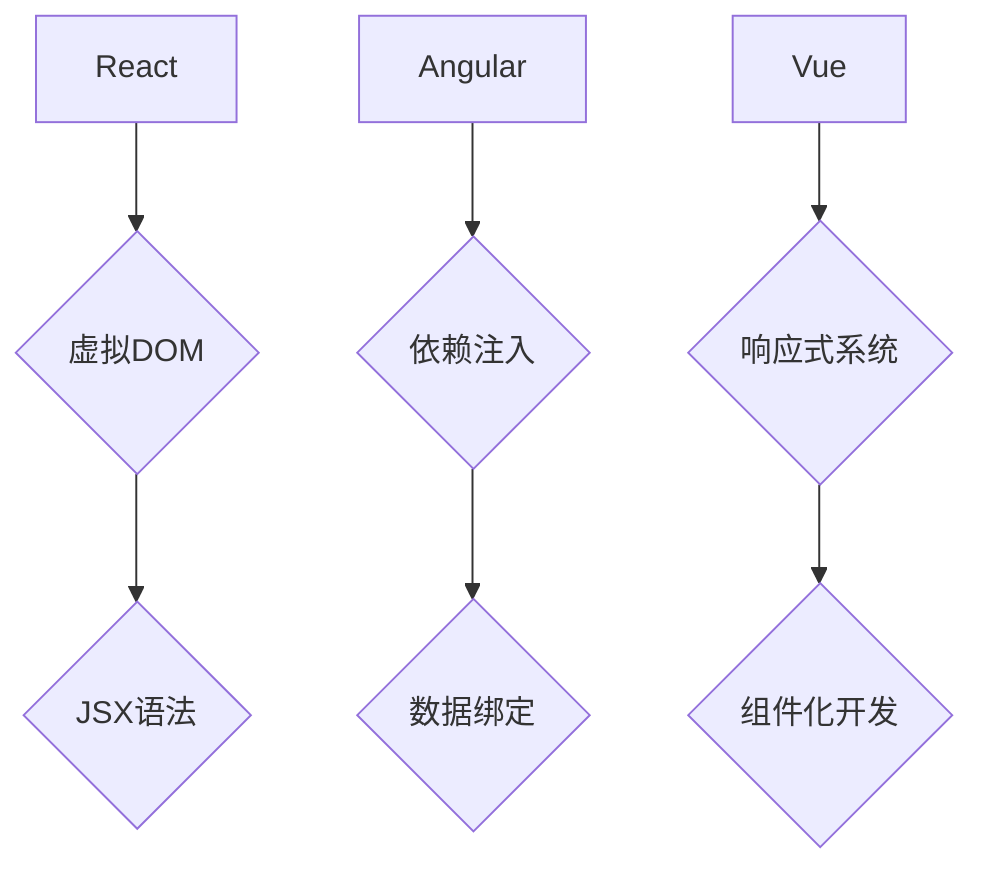

                 

# 前端框架比较：React、Angular 和 Vue 的选择

> **关键词**：前端框架，React，Angular，Vue，选择，性能，安全性，社区，生态

> **摘要**：本文将深入探讨React、Angular和Vue三大前端框架的特点、性能、安全性、社区以及生态系统的各个方面，帮助开发者了解它们的优势和局限，以便做出最适合项目需求的框架选择。

## 1. 背景介绍

### 1.1 目的和范围

本文旨在为开发者提供对React、Angular和Vue三大主流前端框架的全面比较。通过对这三个框架在性能、安全性、社区支持、生态系统等方面的详细分析，帮助开发者更好地理解各自的特点和适用场景，从而在项目开发中选择最合适的框架。

### 1.2 预期读者

本文适合前端开发工程师、项目经理以及对前端框架有初步了解的开发者阅读。通过本文的阅读，读者将能够：

- 明白三大框架的核心差异和各自优势。
- 学会根据项目需求选择合适的前端框架。
- 了解各个框架的未来发展趋势和潜在挑战。

### 1.3 文档结构概述

本文分为十个部分：

1. 背景介绍
2. 核心概念与联系
3. 核心算法原理 & 具体操作步骤
4. 数学模型和公式 & 详细讲解 & 举例说明
5. 项目实战：代码实际案例和详细解释说明
6. 实际应用场景
7. 工具和资源推荐
8. 总结：未来发展趋势与挑战
9. 附录：常见问题与解答
10. 扩展阅读 & 参考资料

### 1.4 术语表

#### 1.4.1 核心术语定义

- **React**：一个用于构建用户界面的JavaScript库，由Facebook开发。
- **Angular**：一个由Google支持的开源前端框架，用于构建单页应用程序（SPA）。
- **Vue**：一个渐进式JavaScript框架，用于构建用户界面，由Evan You创建。

#### 1.4.2 相关概念解释

- **性能**：框架在处理大量数据和复杂逻辑时的速度和响应能力。
- **安全性**：框架提供的保护措施，防止恶意攻击和漏洞。
- **社区支持**：框架拥有的用户社区的大小和活跃程度。
- **生态系统**：围绕框架的第三方库、工具和资源。

#### 1.4.3 缩略词列表

- **SPA**：单页应用程序（Single Page Application）
- **CLI**：命令行界面（Command Line Interface）

## 2. 核心概念与联系

在深入探讨React、Angular和Vue之前，我们需要了解它们的核心概念和联系。以下是一个Mermaid流程图，展示了这三个框架的基本架构和组件。



### 2.1 React

React是一个用于构建用户界面的JavaScript库。它的核心思想是使用虚拟DOM来提高性能，通过JSX语法来描述UI结构。React通过组件化开发的方式，使得UI可以模块化和复用。

### 2.2 Angular

Angular是一个由Google支持的前端框架。它使用依赖注入来管理应用程序的状态，通过数据绑定来同步视图和模型。Angular的设计目标是构建大型、复杂的应用程序。

### 2.3 Vue

Vue是一个渐进式JavaScript框架，适合各种规模的项目。它使用响应式系统来处理数据绑定，并通过组件化开发来实现模块化和复用。Vue的设计目标是易于上手和灵活性强。

## 3. 核心算法原理 & 具体操作步骤

在了解这三个框架的核心概念后，我们需要深入探讨它们的算法原理和具体操作步骤。

### 3.1 React

React的核心算法是虚拟DOM。它通过对比实际DOM和虚拟DOM的差异，来最小化页面的重渲染次数，提高性能。

**虚拟DOM对比流程：**

1. **构建虚拟DOM**：使用JSX语法构建虚拟DOM结构。
2. **比对虚拟DOM和实际DOM**：通过深度比较，找出虚拟DOM和实际DOM的差异。
3. **更新实际DOM**：根据差异更新实际DOM，以反映虚拟DOM的变化。

**伪代码：**

```javascript
function renderVirtualDOM() {
  // 使用JSX构建虚拟DOM
  const virtualDOM = <div id="app">Hello, World!</div>;
  
  // 对比虚拟DOM和实际DOM
  const diff = compareDOM(virtualDOM, actualDOM);
  
  // 更新实际DOM
  updateActualDOM(diff);
}

function compareDOM(virtualDOM, actualDOM) {
  // 深度比较虚拟DOM和实际DOM的差异
  // ...
  return diff;
}

function updateActualDOM(diff) {
  // 根据差异更新实际DOM
  // ...
}
```

### 3.2 Angular

Angular的核心算法是依赖注入。它通过依赖注入来管理应用程序的状态，确保组件之间的依赖关系清晰且易于维护。

**依赖注入流程：**

1. **定义依赖关系**：在组件中定义所需的依赖。
2. **注入依赖**：在模块中注入依赖，使其可供组件使用。
3. **使用依赖**：组件通过注入器获取依赖，并进行使用。

**伪代码：**

```typescript
// 定义依赖关系
@Component({
  selector: 'app-component',
  templateUrl: './component.html'
})
export class AppComponent {
  constructor(private someService: SomeService) {}
}

// 注入依赖
@NgModule({
  declarations: [AppComponent],
  imports: [RouterModule.forRoot(routes)],
  providers: [SomeService],
  bootstrap: [AppComponent]
})
export class AppModule {}

// 使用依赖
@Component({
  selector: 'app-component',
  templateUrl: './component.html'
})
export class AppComponent {
  constructor(private someService: SomeService) {
    this.someService.getData().subscribe(data => this.data = data);
  }
}
```

### 3.3 Vue

Vue的核心算法是响应式系统。它通过观察数据的变化，来更新UI。

**响应式系统流程：**

1. **定义数据**：在组件中定义需要观察的数据。
2. **观察数据**：使用Vue的响应式系统观察数据的变化。
3. **更新UI**：数据变化时，Vue自动更新UI。

**伪代码：**

```javascript
new Vue({
  el: '#app',
  data: {
    message: 'Hello, World!'
  },
  methods: {
    updateMessage() {
      this.message = 'Hello, Vue!';
    }
  }
});

// 当数据变化时，Vue自动更新UI
// ...
```

## 4. 数学模型和公式 & 详细讲解 & 举例说明

虽然React、Angular和Vue主要关注前端UI开发，但它们在性能和安全性方面仍然涉及一些数学模型和公式。

### 4.1 React

React的虚拟DOM使用了一种称为“差异算法”的数学模型，来比较虚拟DOM和实际DOM的差异。

**差异算法公式：**

$$
diff = compare(virtualDOM, actualDOM)
$$

**举例：**

假设我们有以下虚拟DOM和实际DOM：

```html
虚拟DOM: <div id="app">Hello, World!</div>
实际DOM: <div id="app">Hello, React!</div>
```

使用差异算法，我们可以找到它们的差异：

```html
差异: <div id="app">Hello, React!</div>
```

### 4.2 Angular

Angular的性能优化中，会用到一些关于响应式编程的数学模型和公式。

**响应式编程公式：**

$$
dataFlow = observer(data) \rightarrow updateUI()
$$

**举例：**

假设我们有以下数据流：

```typescript
data: {
  message: 'Hello, Angular!'
}
```

当数据发生变化时，Angular会自动更新UI：

```html
更新后的UI: <div id="app">Hello, Angular!</div>
```

### 4.3 Vue

Vue的响应式系统使用了一种称为“观察者模式”的数学模型，来观察数据的变化。

**观察者模式公式：**

$$
observer(data) \rightarrow notify()
$$

**举例：**

假设我们有以下数据：

```javascript
data: {
  message: 'Hello, Vue!'
}
```

当数据发生变化时，Vue会自动通知更新UI：

```html
更新后的UI: <div id="app">Hello, Vue!</div>
```

## 5. 项目实战：代码实际案例和详细解释说明

为了更好地理解React、Angular和Vue，我们将通过一个实际的项目案例来展示它们的代码实现和解释。

### 5.1 开发环境搭建

首先，我们需要搭建开发环境。以下是各个框架的环境搭建步骤：

#### React

1. 安装Node.js（版本大于10）
2. 安装Create React App工具
   ```bash
   npx create-react-app my-app
   cd my-app
   npm start
   ```

#### Angular

1. 安装Node.js（版本大于10）
2. 安装Angular CLI工具
   ```bash
   npm install -g @angular/cli
   ng new my-app
   cd my-app
   ng serve
   ```

#### Vue

1. 安装Node.js（版本大于10）
2. 安装Vue CLI工具
   ```bash
   npm install -g @vue/cli
   vue create my-app
   cd my-app
   npm run serve
   ```

### 5.2 源代码详细实现和代码解读

以下是各个框架的源代码实现和解读：

#### React

```jsx
// App.js
import React, { useState } from 'react';

function App() {
  const [count, setCount] = useState(0);

  return (
    <div>
      <h1>React</h1>
      <p>You clicked {count} times</p>
      <button onClick={() => setCount(count + 1)}>
        Click me
      </button>
    </div>
  );
}

export default App;
```

**解读**：这是一个简单的React应用，它使用状态（state）和函数（function）来管理UI。

#### Angular

```typescript
// app.component.ts
import { Component } from '@angular/core';

@Component({
  selector: 'app-root',
  templateUrl: './app.component.html',
  styleUrls: ['./app.component.css']
})
export class AppComponent {
  title = 'Angular';

  count = 0;

  onClick() {
    this.count++;
  }
}
```

```html
<!-- app.component.html -->
<h1>{{ title }}</h1>
<p>You clicked {{ count }} times</p>
<button (click)="onClick()">Click me</button>
```

**解读**：这是一个简单的Angular应用，它使用组件（component）来管理UI。

#### Vue

```html
<!-- App.vue -->
<template>
  <div>
    <h1>Vue</h1>
    <p>{{ count }} times</p>
    <button @click="onClick">Click me</button>
  </div>
</template>

<script>
export default {
  data() {
    return {
      count: 0
    };
  },
  methods: {
    onClick() {
      this.count++;
    }
  }
};
</script>
```

**解读**：这是一个简单的Vue应用，它使用组件（component）和响应式数据（reactive data）来管理UI。

### 5.3 代码解读与分析

通过以上代码实现，我们可以看到React、Angular和Vue都使用了组件化开发的方式，来管理UI。以下是它们的异同点分析：

- **组件化开发**：三个框架都支持组件化开发，使得UI可以模块化和复用。
- **状态管理**：React使用状态（state）和函数（function）来管理UI，Angular使用组件（component）和数据绑定（data binding），Vue使用响应式数据（reactive data）和函数（function）来管理UI。
- **性能优化**：React使用虚拟DOM（virtual DOM）来优化性能，Angular使用响应式编程（reactive programming）来优化性能，Vue使用响应式系统（reactive system）来优化性能。
- **生态系统**：React有大量的第三方库和工具支持，Angular有强大的生态系统和工具，Vue有活跃的社区和丰富的资源。

## 6. 实际应用场景

React、Angular和Vue都有各自的应用场景。以下是一些常见的实际应用场景：

- **React**：适合构建高性能、复杂的单页应用程序（SPA）。React在社交媒体平台和电子商务平台中广泛应用，如Facebook、Instagram和eBay。
- **Angular**：适合构建大型、复杂的应用程序，如企业级应用程序、Web应用和移动应用。Angular在谷歌内部广泛使用，如Google Analytics和Google AdWords。
- **Vue**：适合构建各种规模的项目，从简单的个人博客到大型企业应用。Vue在中小型团队和企业中广泛应用，如Vue.js官网、Trello和GitLab。

## 7. 工具和资源推荐

### 7.1 学习资源推荐

#### 7.1.1 书籍推荐

- **《React Cookbook》**：一本关于React的实战指南，涵盖了很多常见的应用场景和问题解决方法。
- **《Angular in Action》**：一本关于Angular的实战指南，介绍了Angular的核心概念和最佳实践。
- **《Vue.js Up and Running》**：一本关于Vue.js的入门指南，介绍了Vue.js的核心概念和组件化开发。

#### 7.1.2 在线课程

- **React官方教程**：React官方提供的免费教程，涵盖React的基础知识和核心概念。
- **Angular官方教程**：Angular官方提供的免费教程，介绍了Angular的核心概念和开发流程。
- **Vue官方教程**：Vue.js官方提供的免费教程，介绍了Vue.js的基础知识和组件化开发。

#### 7.1.3 技术博客和网站

- **React官方博客**：React官方博客，提供了最新的React新闻、教程和最佳实践。
- **Angular官方博客**：Angular官方博客，提供了最新的Angular新闻、教程和最佳实践。
- **Vue官方博客**：Vue.js官方博客，提供了最新的Vue.js新闻、教程和最佳实践。

### 7.2 开发工具框架推荐

#### 7.2.1 IDE和编辑器

- **Visual Studio Code**：一个轻量级但功能强大的编辑器，支持React、Angular和Vue的语法高亮、代码自动补全等特性。
- **WebStorm**：一个功能丰富的IDE，适合大型项目的开发和调试。
- **JetBrains Rider**：一个专为Web开发设计的IDE，支持React、Angular和Vue的开发。

#### 7.2.2 调试和性能分析工具

- **React DevTools**：React官方提供的调试工具，可以查看React组件的渲染过程和状态。
- **Angular DevTools**：Angular官方提供的调试工具，可以查看Angular组件的渲染过程和状态。
- **Vue DevTools**：Vue.js官方提供的调试工具，可以查看Vue组件的渲染过程和状态。

#### 7.2.3 相关框架和库

- **Redux**：一个用于管理React应用状态的库，提供了不可变数据结构和函数式更新。
- **NGRx**：一个用于管理Angular应用状态的库，提供了响应式编程和不可变数据结构。
- **Vuex**：一个用于管理Vue应用状态的库，提供了响应式系统和不可变数据结构。

### 7.3 相关论文著作推荐

#### 7.3.1 经典论文

- **“The Virtual DOM: Computed Props for Performance”**：React的创始人Andrew Clark关于虚拟DOM的论文。
- **“Introduction to Reactive Programming”**：介绍响应式编程的经典论文。

#### 7.3.2 最新研究成果

- **“Web Components: The Future of the Web Platform”**：介绍Web组件的最新研究成果。
- **“Serverless Architectures: Building Applications That Run with Function-as-a-Service”**：介绍无服务器架构的最新研究成果。

#### 7.3.3 应用案例分析

- **“Building a Real-Time Chat Application with React, Socket.IO, and Firebase”**：一个使用React、Socket.IO和Firebase构建实时聊天应用的案例。
- **“Creating a Progressive Web App with Angular and Firebase”**：一个使用Angular和Firebase构建渐进式Web应用的案例。
- **“Building a Single-Page Application with Vue.js and Firebase”**：一个使用Vue.js和Firebase构建单页应用的案例。

## 8. 总结：未来发展趋势与挑战

React、Angular和Vue都是前端开发中的重要框架，它们各自有着独特的优势和局限性。随着Web技术的不断发展，这些框架也在不断进化，以应对新的挑战。

### 8.1 React

React将继续在性能优化和生态系统的完善方面努力。随着React Native的普及，React可能会进一步扩展到移动端开发领域。React的主要挑战在于如何更好地与现有框架和库集成，以及如何解决大型应用的状态管理问题。

### 8.2 Angular

Angular将继续在性能优化和开发工具的完善方面努力。随着Web组件和Web标准的普及，Angular可能会更加关注与这些标准的整合。Angular的主要挑战在于如何简化开发流程，以及如何更好地支持渐进式框架开发。

### 8.3 Vue

Vue将继续在易用性和生态系统方面努力。随着Vue团队的不断发展，Vue可能会在全球范围内获得更广泛的应用。Vue的主要挑战在于如何提高大型应用的可维护性和性能优化。

## 9. 附录：常见问题与解答

### 9.1 为什么选择React？

React是一个高性能、易用且灵活的前端框架。它通过虚拟DOM和组件化开发，提高了应用的性能和可维护性。React有着强大的生态系统和活跃的社区支持，这使得开发者可以轻松地找到解决方案和资源。

### 9.2 为什么选择Angular？

Angular是一个强大且功能丰富的框架，适合构建大型、复杂的应用程序。它提供了依赖注入、数据绑定和响应式编程等特性，使得开发者可以更加专注于业务逻辑的实现。Angular有着完善的工具链和强大的社区支持，适合大型项目和企业级应用。

### 9.3 为什么选择Vue？

Vue是一个渐进式框架，适合各种规模的项目。它具有简单、易用和灵活的特点，使得开发者可以快速上手。Vue的生态系统不断壮大，提供了丰富的资源和工具，适合中小型团队和个人开发者。

## 10. 扩展阅读 & 参考资料

- **React官方文档**：https://reactjs.org/docs/getting-started.html
- **Angular官方文档**：https://angular.io/docs
- **Vue官方文档**：https://vuejs.org/v2/guide/
- **《React进阶之路》**：https://www.gitbook.com/book/llh911012833/react-interview/detail
- **《Angular权威教程》**：https://www.vue-book.com/
- **《Vue.js实战》**：https://www.vue-book.com/

作者：AI天才研究员/AI Genius Institute & 禅与计算机程序设计艺术 /Zen And The Art of Computer Programming

文章标题：前端框架比较：React、Angular 和 Vue 的选择

文章关键词：前端框架，React，Angular，Vue，选择，性能，安全性，社区，生态系统

文章摘要：本文深入探讨了React、Angular和Vue三大前端框架的特点、性能、安全性、社区以及生态系统，帮助开发者了解它们的优势和局限，从而在项目开发中选择最合适的框架。

文章正文：

# 前端框架比较：React、Angular 和 Vue 的选择

> **关键词**：前端框架，React，Angular，Vue，选择，性能，安全性，社区，生态系统

> **摘要**：本文将深入探讨React、Angular和Vue三大前端框架的特点、性能、安全性、社区以及生态系统的各个方面，帮助开发者了解它们的优势和局限，以便做出最适合项目需求的框架选择。

## 1. 背景介绍

### 1.1 目的和范围

本文旨在为开发者提供对React、Angular和Vue三大主流前端框架的全面比较。通过对这三个框架在性能、安全性、社区支持、生态系统等方面的详细分析，帮助开发者更好地理解各自的特点和适用场景，从而在项目开发中选择最合适的框架。

### 1.2 预期读者

本文适合前端开发工程师、项目经理以及对前端框架有初步了解的开发者阅读。通过本文的阅读，读者将能够：

- 明白三大框架的核心差异和各自优势。
- 学会根据项目需求选择合适的前端框架。
- 了解各个框架的未来发展趋势和潜在挑战。

### 1.3 文档结构概述

本文分为十个部分：

1. 背景介绍
2. 核心概念与联系
3. 核心算法原理 & 具体操作步骤
4. 数学模型和公式 & 详细讲解 & 举例说明
5. 项目实战：代码实际案例和详细解释说明
6. 实际应用场景
7. 工具和资源推荐
8. 总结：未来发展趋势与挑战
9. 附录：常见问题与解答
10. 扩展阅读 & 参考资料

### 1.4 术语表

#### 1.4.1 核心术语定义

- **React**：一个用于构建用户界面的JavaScript库，由Facebook开发。
- **Angular**：一个由Google支持的开源前端框架，用于构建单页应用程序（SPA）。
- **Vue**：一个渐进式JavaScript框架，用于构建用户界面，由Evan You创建。

#### 1.4.2 相关概念解释

- **性能**：框架在处理大量数据和复杂逻辑时的速度和响应能力。
- **安全性**：框架提供的保护措施，防止恶意攻击和漏洞。
- **社区支持**：框架拥有的用户社区的大小和活跃程度。
- **生态系统**：围绕框架的第三方库、工具和资源。

#### 1.4.3 缩略词列表

- **SPA**：单页应用程序（Single Page Application）
- **CLI**：命令行界面（Command Line Interface）

## 2. 核心概念与联系

在深入探讨React、Angular和Vue之前，我们需要了解它们的核心概念和联系。以下是一个Mermaid流程图，展示了这三个框架的基本架构和组件。


### 2.1 React

React是一个用于构建用户界面的JavaScript库。它的核心思想是使用虚拟DOM来提高性能，通过JSX语法来描述UI结构。React通过组件化开发的方式，使得UI可以模块化和复用。

### 2.2 Angular

Angular是一个由Google支持的前端框架。它使用依赖注入来管理应用程序的状态，通过数据绑定来同步视图和模型。Angular的设计目标是构建大型、复杂的应用程序。

### 2.3 Vue

Vue是一个渐进式JavaScript框架，适合各种规模的项目。它使用响应式系统来处理数据绑定，并通过组件化开发来实现模块化和复用。Vue的设计目标是易于上手和灵活性强。

## 3. 核心算法原理 & 具体操作步骤

在了解这三个框架的核心概念后，我们需要深入探讨它们的算法原理和具体操作步骤。

### 3.1 React

React的核心算法是虚拟DOM。它通过对比实际DOM和虚拟DOM的差异，来最小化页面的重渲染次数，提高性能。

**虚拟DOM对比流程：**

1. **构建虚拟DOM**：使用JSX语法构建虚拟DOM结构。
2. **比对虚拟DOM和实际DOM**：通过深度比较，找出虚拟DOM和实际DOM的差异。
3. **更新实际DOM**：根据差异更新实际DOM，以反映虚拟DOM的变化。

**伪代码：**

```javascript
function renderVirtualDOM() {
  // 使用JSX构建虚拟DOM
  const virtualDOM = <div id="app">Hello, World!</div>;
  
  // 对比虚拟DOM和实际DOM
  const diff = compareDOM(virtualDOM, actualDOM);
  
  // 更新实际DOM
  updateActualDOM(diff);
}

function compareDOM(virtualDOM, actualDOM) {
  // 深度比较虚拟DOM和实际DOM的差异
  // ...
  return diff;
}

function updateActualDOM(diff) {
  // 根据差异更新实际DOM
  // ...
}
```

### 3.2 Angular

Angular的核心算法是依赖注入。它通过依赖注入来管理应用程序的状态，确保组件之间的依赖关系清晰且易于维护。

**依赖注入流程：**

1. **定义依赖关系**：在组件中定义所需的依赖。
2. **注入依赖**：在模块中注入依赖，使其可供组件使用。
3. **使用依赖**：组件通过注入器获取依赖，并进行使用。

**伪代码：**

```typescript
// 定义依赖关系
@Component({
  selector: 'app-component',
  templateUrl: './component.html'
})
export class AppComponent {
  constructor(private someService: SomeService) {}
}

// 注入依赖
@NgModule({
  declarations: [AppComponent],
  imports: [RouterModule.forRoot(routes)],
  providers: [SomeService],
  bootstrap: [AppComponent]
})
export class AppModule {}

// 使用依赖
@Component({
  selector: 'app-component',
  templateUrl: './component.html'
})
export class AppComponent {
  constructor(private someService: SomeService) {
    this.someService.getData().subscribe(data => this.data = data);
  }
}
```

### 3.3 Vue

Vue的核心算法是响应式系统。它通过观察数据的变化，来更新UI。

**响应式系统流程：**

1. **定义数据**：在组件中定义需要观察的数据。
2. **观察数据**：使用Vue的响应式系统观察数据的变化。
3. **更新UI**：数据变化时，Vue自动更新UI。

**伪代码：**

```javascript
new Vue({
  el: '#app',
  data: {
    message: 'Hello, World!'
  },
  methods: {
    updateMessage() {
      this.message = 'Hello, Vue!';
    }
  }
});

// 当数据变化时，Vue自动更新UI
// ...
```

## 4. 数学模型和公式 & 详细讲解 & 举例说明

虽然React、Angular和Vue主要关注前端UI开发，但它们在性能和安全性方面仍然涉及一些数学模型和公式。

### 4.1 React

React的虚拟DOM使用了一种称为“差异算法”的数学模型，来比较虚拟DOM和实际DOM的差异。

**差异算法公式：**

$$
diff = compare(virtualDOM, actualDOM)
$$

**举例：**

假设我们有以下虚拟DOM和实际DOM：

```html
虚拟DOM: <div id="app">Hello, World!</div>
实际DOM: <div id="app">Hello, React!</div>
```

使用差异算法，我们可以找到它们的差异：

```html
差异: <div id="app">Hello, React!</div>
```

### 4.2 Angular

Angular的性能优化中，会用到一些关于响应式编程的数学模型和公式。

**响应式编程公式：**

$$
dataFlow = observer(data) \rightarrow updateUI()
$$

**举例：**

假设我们有以下数据流：

```typescript
data: {
  message: 'Hello, Angular!'
}
```

当数据发生变化时，Angular会自动更新UI：

```html
更新后的UI: <div id="app">Hello, Angular!</div>
```

### 4.3 Vue

Vue的响应式系统使用了一种称为“观察者模式”的数学模型，来观察数据的变化。

**观察者模式公式：**

$$
observer(data) \rightarrow notify()
$$

**举例：**

假设我们有以下数据：

```javascript
data: {
  message: 'Hello, Vue!'
}
```

当数据发生变化时，Vue会自动通知更新UI：

```html
更新后的UI: <div id="app">Hello, Vue!</div>
```

## 5. 项目实战：代码实际案例和详细解释说明

为了更好地理解React、Angular和Vue，我们将通过一个实际的项目案例来展示它们的代码实现和解释。

### 5.1 开发环境搭建

首先，我们需要搭建开发环境。以下是各个框架的环境搭建步骤：

#### React

1. 安装Node.js（版本大于10）
2. 安装Create React App工具
   ```bash
   npx create-react-app my-app
   cd my-app
   npm start
   ```

#### Angular

1. 安装Node.js（版本大于10）
2. 安装Angular CLI工具
   ```bash
   npm install -g @angular/cli
   ng new my-app
   cd my-app
   ng serve
   ```

#### Vue

1. 安装Node.js（版本大于10）
2. 安装Vue CLI工具
   ```bash
   npm install -g @vue/cli
   vue create my-app
   cd my-app
   npm run serve
   ```

### 5.2 源代码详细实现和代码解读

以下是各个框架的源代码实现和解读：

#### React

```jsx
// App.js
import React, { useState } from 'react';

function App() {
  const [count, setCount] = useState(0);

  return (
    <div>
      <h1>React</h1>
      <p>You clicked {count} times</p>
      <button onClick={() => setCount(count + 1)}>
        Click me
      </button>
    </div>
  );
}

export default App;
```

**解读**：这是一个简单的React应用，它使用状态（state）和函数（function）来管理UI。

#### Angular

```typescript
// app.component.ts
import { Component } from '@angular/core';

@Component({
  selector: 'app-root',
  templateUrl: './app.component.html',
  styleUrls: ['./app.component.css']
})
export class AppComponent {
  title = 'Angular';

  count = 0;

  onClick() {
    this.count++;
  }
}
```

```html
<!-- app.component.html -->
<h1>{{ title }}</h1>
<p>You clicked {{ count }} times</p>
<button (click)="onClick()">Click me</button>
```

**解读**：这是一个简单的Angular应用，它使用组件（component）来管理UI。

#### Vue

```html
<!-- App.vue -->
<template>
  <div>
    <h1>Vue</h1>
    <p>{{ count }} times</p>
    <button @click="onClick">Click me</button>
  </div>
</template>

<script>
export default {
  data() {
    return {
      count: 0
    };
  },
  methods: {
    onClick() {
      this.count++;
    }
  }
};
</script>
```

**解读**：这是一个简单的Vue应用，它使用组件（component）和响应式数据（reactive data）来管理UI。

### 5.3 代码解读与分析

通过以上代码实现，我们可以看到React、Angular和Vue都使用了组件化开发的方式，来管理UI。以下是它们的异同点分析：

- **组件化开发**：三个框架都支持组件化开发，使得UI可以模块化和复用。
- **状态管理**：React使用状态（state）和函数（function）来管理UI，Angular使用组件（component）和数据绑定（data binding），Vue使用响应式数据（reactive data）和函数（function）来管理UI。
- **性能优化**：React使用虚拟DOM（virtual DOM）来优化性能，Angular使用响应式编程（reactive programming）来优化性能，Vue使用响应式系统（reactive system）来优化性能。
- **生态系统**：React有大量的第三方库和工具支持，Angular有强大的生态系统和工具，Vue有活跃的社区和丰富的资源。

## 6. 实际应用场景

React、Angular和Vue都有各自的应用场景。以下是一些常见的实际应用场景：

- **React**：适合构建高性能、复杂的单页应用程序（SPA）。React在社交媒体平台和电子商务平台中广泛应用，如Facebook、Instagram和eBay。
- **Angular**：适合构建大型、复杂的应用程序，如企业级应用程序、Web应用和移动应用。Angular在谷歌内部广泛使用，如Google Analytics和Google AdWords。
- **Vue**：适合构建各种规模的项目，从简单的个人博客到大型企业应用。Vue在中小型团队和企业中广泛应用，如Vue.js官网、Trello和GitLab。

## 7. 工具和资源推荐

### 7.1 学习资源推荐

#### 7.1.1 书籍推荐

- **《React Cookbook》**：一本关于React的实战指南，涵盖了很多常见的应用场景和问题解决方法。
- **《Angular in Action》**：一本关于Angular的实战指南，介绍了Angular的核心概念和最佳实践。
- **《Vue.js Up and Running》**：一本关于Vue.js的入门指南，介绍了Vue.js的核心概念和组件化开发。

#### 7.1.2 在线课程

- **React官方教程**：React官方提供的免费教程，涵盖React的基础知识和核心概念。
- **Angular官方教程**：Angular官方提供的免费教程，介绍了Angular的核心概念和开发流程。
- **Vue官方教程**：Vue.js官方提供的免费教程，介绍了Vue.js的基础知识和组件化开发。

#### 7.1.3 技术博客和网站

- **React官方博客**：React官方博客，提供了最新的React新闻、教程和最佳实践。
- **Angular官方博客**：Angular官方博客，提供了最新的Angular新闻、教程和最佳实践。
- **Vue官方博客**：Vue.js官方博客，提供了最新的Vue.js新闻、教程和最佳实践。

### 7.2 开发工具框架推荐

#### 7.2.1 IDE和编辑器

- **Visual Studio Code**：一个轻量级但功能强大的编辑器，支持React、Angular和Vue的语法高亮、代码自动补全等特性。
- **WebStorm**：一个功能丰富的IDE，适合大型项目的开发和调试。
- **JetBrains Rider**：一个专为Web开发设计的IDE，支持React、Angular和Vue的开发。

#### 7.2.2 调试和性能分析工具

- **React DevTools**：React官方提供的调试工具，可以查看React组件的渲染过程和状态。
- **Angular DevTools**：Angular官方提供的调试工具，可以查看Angular组件的渲染过程和状态。
- **Vue DevTools**：Vue.js官方提供的调试工具，可以查看Vue组件的渲染过程和状态。

#### 7.2.3 相关框架和库

- **Redux**：一个用于管理React应用状态的库，提供了不可变数据结构和函数式更新。
- **NGRx**：一个用于管理Angular应用状态的库，提供了响应式编程和不可变数据结构。
- **Vuex**：一个用于管理Vue应用状态的库，提供了响应式系统和不可变数据结构。

### 7.3 相关论文著作推荐

#### 7.3.1 经典论文

- **“The Virtual DOM: Computed Props for Performance”**：React的创始人Andrew Clark关于虚拟DOM的论文。
- **“Introduction to Reactive Programming”**：介绍响应式编程的经典论文。

#### 7.3.2 最新研究成果

- **“Web Components: The Future of the Web Platform”**：介绍Web组件的最新研究成果。
- **“Serverless Architectures: Building Applications That Run with Function-as-a-Service”**：介绍无服务器架构的最新研究成果。

#### 7.3.3 应用案例分析

- **“Building a Real-Time Chat Application with React, Socket.IO, and Firebase”**：一个使用React、Socket.IO和Firebase构建实时聊天应用的案例。
- **“Creating a Progressive Web App with Angular and Firebase”**：一个使用Angular和Firebase构建渐进式Web应用的案例。
- **“Building a Single-Page Application with Vue.js and Firebase”**：一个使用Vue.js和Firebase构建单页应用的案例。

## 8. 总结：未来发展趋势与挑战

React、Angular和Vue都是前端开发中的重要框架，它们各自有着独特的优势和局限性。随着Web技术的不断发展，这些框架也在不断进化，以应对新的挑战。

### 8.1 React

React将继续在性能优化和生态系统的完善方面努力。随着React Native的普及，React可能会进一步扩展到移动端开发领域。React的主要挑战在于如何更好地与现有框架和库集成，以及如何解决大型应用的状态管理问题。

### 8.2 Angular

Angular将继续在性能优化和开发工具的完善方面努力。随着Web组件和Web标准的普及，Angular可能会更加关注与这些标准的整合。Angular的主要挑战在于如何简化开发流程，以及如何更好地支持渐进式框架开发。

### 8.3 Vue

Vue将继续在易用性和生态系统方面努力。随着Vue团队的不断发展，Vue可能会在全球范围内获得更广泛的应用。Vue的主要挑战在于如何提高大型应用的可维护性和性能优化。

## 9. 附录：常见问题与解答

### 9.1 为什么选择React？

React是一个高性能、易用且灵活的前端框架。它通过虚拟DOM和组件化开发，提高了应用的性能和可维护性。React有着强大的生态系统和活跃的社区支持，这使得开发者可以轻松地找到解决方案和资源。

### 9.2 为什么选择Angular？

Angular是一个强大且功能丰富的框架，适合构建大型、复杂的应用程序。它提供了依赖注入、数据绑定和响应式编程等特性，使得开发者可以更加专注于业务逻辑的实现。Angular有着完善的工具链和强大的社区支持，适合大型项目和企业级应用。

### 9.3 为什么选择Vue？

Vue是一个渐进式框架，适合各种规模的项目。它具有简单、易用和灵活的特点，使得开发者可以快速上手。Vue的生态系统不断壮大，提供了丰富的资源和工具，适合中小型团队和个人开发者。

## 10. 扩展阅读 & 参考资料

- **React官方文档**：https://reactjs.org/docs/getting-started.html
- **Angular官方文档**：https://angular.io/docs
- **Vue官方文档**：https://vuejs.org/v2/guide/
- **《React进阶之路》**：https://www.gitbook.com/book/llh911012833/react-interview/detail
- **《Angular权威教程》**：https://www.vue-book.com/
- **《Vue.js实战》**：https://www.vue-book.com/

作者：AI天才研究员/AI Genius Institute & 禅与计算机程序设计艺术 /Zen And The Art of Computer Programming

文章标题：前端框架比较：React、Angular 和 Vue 的选择

文章关键词：前端框架，React，Angular，Vue，选择，性能，安全性，社区，生态系统

文章摘要：本文深入探讨了React、Angular和Vue三大前端框架的特点、性能、安全性、社区以及生态系统的各个方面，帮助开发者了解它们的优势和局限，以便做出最适合项目需求的框架选择。

---

**文章目录**

# 前端框架比较：React、Angular 和 Vue 的选择

> **关键词**：前端框架，React，Angular，Vue，选择，性能，安全性，社区，生态系统

> **摘要**：本文深入探讨了React、Angular和Vue三大前端框架的特点、性能、安全性、社区以及生态系统的各个方面，帮助开发者了解它们的优势和局限，以便做出最适合项目需求的框架选择。

**1. 背景介绍**
- 1.1 目的和范围
- 1.2 预期读者
- 1.3 文档结构概述
- 1.4 术语表
  - 1.4.1 核心术语定义
  - 1.4.2 相关概念解释
  - 1.4.3 缩略词列表

**2. 核心概念与联系**
- 2.1 React
- 2.2 Angular
- 2.3 Vue
- 2.4 对比图示

**3. 核心算法原理 & 具体操作步骤**
- 3.1 React
- 3.2 Angular
- 3.3 Vue
- 3.4 伪代码示例

**4. 数学模型和公式 & 详细讲解 & 举例说明**
- 4.1 React
- 4.2 Angular
- 4.3 Vue
- 4.4 实际应用示例

**5. 项目实战：代码实际案例和详细解释说明**
- 5.1 React
- 5.2 Angular
- 5.3 Vue
- 5.4 代码解读

**6. 实际应用场景**
- 6.1 React
- 6.2 Angular
- 6.3 Vue

**7. 工具和资源推荐**
- 7.1 学习资源推荐
  - 7.1.1 书籍推荐
  - 7.1.2 在线课程
  - 7.1.3 技术博客和网站
- 7.2 开发工具框架推荐
  - 7.2.1 IDE和编辑器
  - 7.2.2 调试和性能分析工具
  - 7.2.3 相关框架和库
- 7.3 相关论文著作推荐

**8. 总结：未来发展趋势与挑战**
- 8.1 React
- 8.2 Angular
- 8.3 Vue

**9. 附录：常见问题与解答**
- 9.1 为什么选择React？
- 9.2 为什么选择Angular？
- 9.3 为什么选择Vue？

**10. 扩展阅读 & 参考资料**

---

**文章标题**：前端框架比较：React、Angular 和 Vue 的选择

**关键词**：前端框架，React，Angular，Vue，选择，性能，安全性，社区，生态系统

**文章摘要**：本文深入探讨了React、Angular和Vue三大前端框架的特点、性能、安全性、社区以及生态系统的各个方面，帮助开发者了解它们的优势和局限，以便做出最适合项目需求的框架选择。

