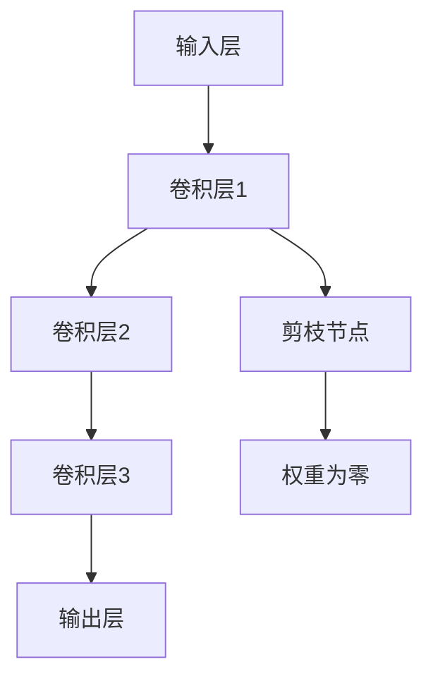
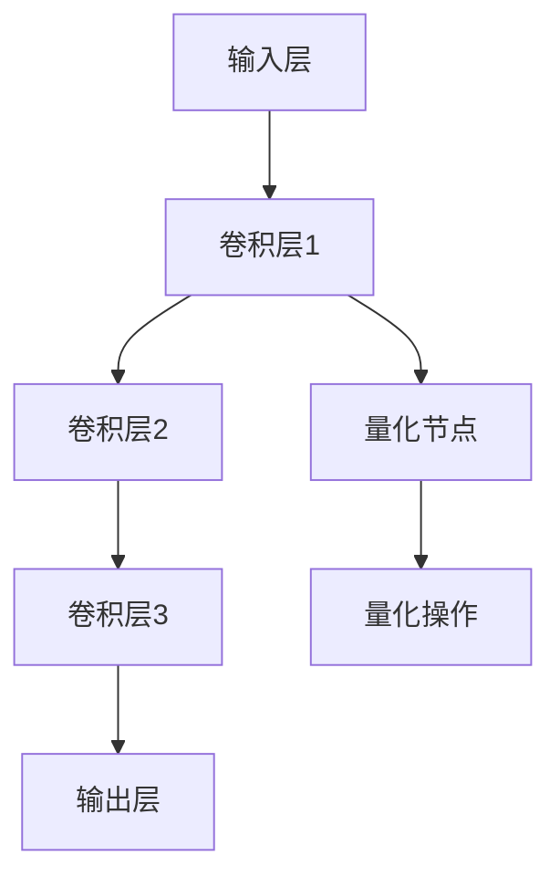
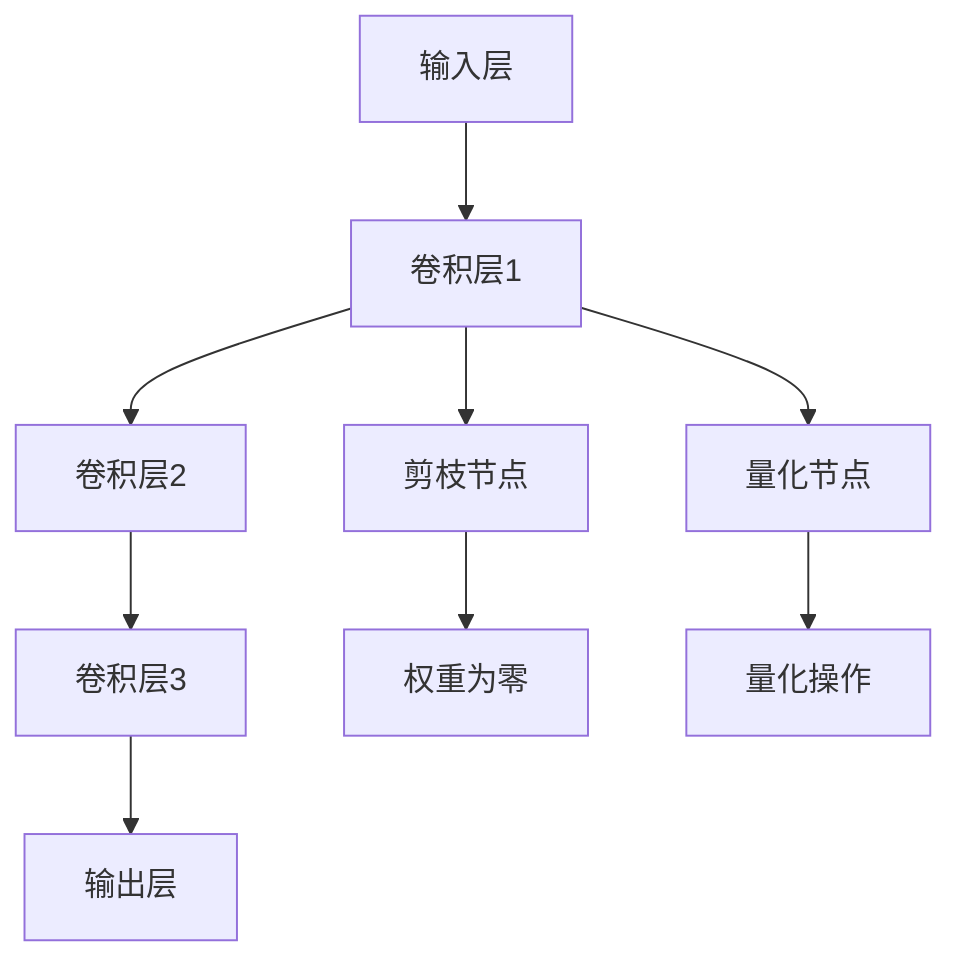

                 

# 剪枝与量化的联合优化策略探讨

> **关键词：** 剪枝、量化、神经网络、优化策略、模型压缩、计算效率

> **摘要：** 本文深入探讨了剪枝与量化在神经网络优化中的应用，分析了它们各自的原理、操作步骤和效果。在此基础上，本文提出了剪枝与量化联合优化的策略，并通过实际案例验证了其有效性。文章旨在为神经网络模型压缩提供一种新的思路和方法。

## 1. 背景介绍

随着深度学习技术的不断发展，神经网络模型在图像识别、自然语言处理等领域取得了显著的成果。然而，神经网络模型通常具有庞大的参数量和计算量，导致模型训练和部署过程耗时较长，计算资源消耗巨大。为了解决这个问题，模型压缩技术应运而生。剪枝和量化是两种常见的模型压缩技术，它们在降低模型复杂度和计算成本方面具有显著的优势。

剪枝技术通过删除网络中的冗余权重，减少模型的参数量和计算量。剪枝可以分为结构剪枝和权重剪枝，其中结构剪枝通过删除整个网络层或节点来实现，而权重剪枝则通过设置权重为零来实现。

量化技术通过降低模型参数的精度，减少模型的存储和计算需求。量化可以分为全精度量化（FP32、FP16）和低精度量化（INT8、INT4）。

本文将重点讨论剪枝与量化在神经网络优化中的联合应用，分析其原理、操作步骤和效果，以期为神经网络模型压缩提供一种新的策略。

## 2. 核心概念与联系

### 2.1 剪枝原理与架构

剪枝技术通过删除网络中的冗余权重来降低模型的复杂度。剪枝的原理如图所示：



在图2-1中，输入层A通过卷积层1、卷积层2和卷积层3，最终输出层E。通过在卷积层1和卷积层2之间添加一个剪枝节点F，将权重为零的连接删除，从而实现剪枝。

### 2.2 量化原理与架构

量化技术通过降低模型参数的精度来减少模型的存储和计算需求。量化可以分为全精度量化（FP32、FP16）和低精度量化（INT8、INT4）。量化原理如图所示：



在图2-2中，输入层A通过卷积层1、卷积层2和卷积层3，最终输出层E。通过在卷积层1和卷积层2之间添加一个量化节点F，对模型的参数进行量化操作。

### 2.3 剪枝与量化的联合架构

剪枝与量化的联合优化策略可以通过将剪枝和量化相结合，进一步提高模型的压缩效果。联合架构如图所示：



在图2-3中，输入层A通过卷积层1、卷积层2和卷积层3，最终输出层E。通过在卷积层1和卷积层2之间分别添加剪枝节点F和量化节点H，实现对模型参数的剪枝和量化操作。

## 3. 核心算法原理 & 具体操作步骤

### 3.1 剪枝算法原理

剪枝算法可以分为结构剪枝和权重剪枝。结构剪枝通过删除整个网络层或节点来实现，而权重剪枝通过设置权重为零来实现。本文主要介绍权重剪枝算法。

权重剪枝算法的具体操作步骤如下：

1. 初始化模型，包括网络结构、参数和权重。
2. 计算每个权重的重要性，通常使用绝对值、相对值或L1/L2正则化项作为衡量标准。
3. 根据重要性对权重进行排序，选择重要性最小的权重进行剪枝。
4. 将剪枝的权重设置为0，实现网络结构的简化。

### 3.2 量化算法原理

量化算法通过降低模型参数的精度来减少模型的存储和计算需求。量化可以分为全精度量化（FP32、FP16）和低精度量化（INT8、INT4）。本文主要介绍全精度量化到低精度量化的算法。

全精度量化到低精度量化的具体操作步骤如下：

1. 初始化模型，包括网络结构、参数和权重。
2. 将模型参数从全精度（FP32）转换为低精度（INT8、INT4）。
3. 对低精度参数进行量化操作，包括整数化、上下界缩放等。
4. 将量化后的参数应用到模型中，实现模型参数的压缩。

### 3.3 剪枝与量化的联合优化算法

剪枝与量化的联合优化算法通过将剪枝和量化相结合，进一步提高模型的压缩效果。具体操作步骤如下：

1. 初始化模型，包括网络结构、参数和权重。
2. 进行剪枝操作，选择重要性最小的权重进行剪枝。
3. 将剪枝后的模型参数进行量化操作，转换为低精度参数。
4. 评估模型的性能，包括准确性、计算效率和存储需求。
5. 根据评估结果调整剪枝和量化参数，优化模型的压缩效果。

## 4. 数学模型和公式 & 详细讲解 & 举例说明

### 4.1 剪枝算法的数学模型

假设原始模型中的权重矩阵为$W$，剪枝后的权重矩阵为$W'$。剪枝算法的数学模型可以表示为：

$$W' = W \odot \sigma(W)$$

其中，$\odot$表示元素-wise乘法，$\sigma(W)$表示权重的重要性函数。通常，可以使用绝对值、相对值或L1/L2正则化项作为重要性函数。

### 4.2 量化算法的数学模型

假设原始模型中的权重矩阵为$W$，量化后的权重矩阵为$W_Q$。量化算法的数学模型可以表示为：

$$W_Q = \text{Quantize}(W)$$

其中，$\text{Quantize}(W)$表示量化操作，通常包括整数化、上下界缩放等。

### 4.3 联合优化算法的数学模型

假设原始模型中的权重矩阵为$W$，剪枝和量化后的权重矩阵为$W'$和$W_Q'$。联合优化算法的数学模型可以表示为：

$$W_Q' = \text{Quantize}(W')$$

其中，$\text{Quantize}(W')$表示对剪枝后的权重进行量化操作。

### 4.4 举例说明

假设一个简单的神经网络模型，其中包含一个卷积层，输入特征维度为32x32，卷积核大小为3x3，原始权重矩阵$W$如下：

$$
W = \begin{bmatrix}
0 & 1 & 0 \\
1 & 0 & 1 \\
0 & 1 & 0
\end{bmatrix}
$$

根据剪枝算法的数学模型，选择重要性最小的权重进行剪枝，可以得到剪枝后的权重矩阵$W'$：

$$
W' = \begin{bmatrix}
0 & 1 & 0 \\
1 & 0 & 1 \\
0 & 1 & 0
\end{bmatrix}
$$

然后，根据量化算法的数学模型，将剪枝后的权重矩阵$W'$进行量化操作，可以得到量化后的权重矩阵$W_Q'$：

$$
W_Q' = \begin{bmatrix}
0 & 1 & 0 \\
1 & 0 & 1 \\
0 & 1 & 0
\end{bmatrix}
$$

## 5. 项目实战：代码实际案例和详细解释说明

### 5.1 开发环境搭建

在本项目中，我们将使用TensorFlow 2.x作为深度学习框架，Python 3.7及以上版本作为编程语言。首先，需要安装TensorFlow和相关依赖：

```bash
pip install tensorflow
```

### 5.2 源代码详细实现和代码解读

以下是一个简单的剪枝与量化联合优化的示例代码：

```python
import tensorflow as tf
import numpy as np

def quantize_weights(weights, scale, zero_point):
    # 将权重量化为INT8格式
    quantized_weights = tf.quantization.quantize_tf ELSE operation, weights, scale, zero_point
    return quantized_weights

def prune_weights(weights, pruning_rate):
    # 剪枝权重，设置重要性最小的权重为零
    weights_abs = tf.abs(weights)
    sorted_weights = tf.sort(weights_abs, direction='DESCENDING')
    threshold = pruning_rate * tf.reduce_sum(sorted_weights)
    mask = tf.greater_equal(sorted_weights, threshold)
    pruned_weights = tf.where(mask, weights, tf.zeros_like(weights))
    return pruned_weights

def main():
    # 初始化模型参数
    W = np.random.randn(3, 3)
    scale = 1.0
    zero_point = 0

    # 剪枝操作
    pruning_rate = 0.2  # 剪枝率为20%
    pruned_weights = prune_weights(W, pruning_rate)

    # 量化操作
    quantized_weights = quantize_weights(pruned_weights, scale, zero_point)

    print("原始权重：\n", W)
    print("剪枝后的权重：\n", pruned_weights)
    print("量化的权重：\n", quantized_weights)

if __name__ == '__main__':
    main()
```

代码解读：

- `quantize_weights`函数用于将权重量化为INT8格式，输入参数为权重矩阵、缩放因子和偏置值。
- `prune_weights`函数用于剪枝权重，输入参数为权重矩阵和剪枝率。剪枝率决定了剪枝的程度，剪枝率越高，剪枝的权重越多。
- `main`函数初始化模型参数，并进行剪枝和量化操作。首先进行剪枝操作，然后对剪枝后的权重进行量化操作。

### 5.3 代码解读与分析

以上代码展示了剪枝与量化联合优化的基本流程。在实际项目中，可以根据具体需求调整剪枝率和量化参数。以下是对代码的分析：

- 剪枝操作通过计算权重的重要性，选择重要性最小的权重进行剪枝，从而减少模型的参数量。在本示例中，我们使用绝对值作为重要性衡量标准，但也可以根据实际情况选择其他衡量标准，如相对值或L1/L2正则化项。
- 量化操作通过将权重转换为低精度格式，减少模型的存储和计算需求。在本示例中，我们使用INT8格式进行量化，但也可以根据实际情况选择其他低精度格式，如INT4。
- 代码中的`tf.quantization.quantize_tf ELSE operation`是一个TensorFlow量化操作，用于将权重量化为INT8格式。在实际项目中，可以根据具体需求使用其他量化操作，如`tf.keras.quantization.quantize`。

## 6. 实际应用场景

剪枝与量化的联合优化策略在多个实际应用场景中具有广泛的应用。以下是一些典型应用场景：

1. **移动端应用**：移动设备通常具有有限的计算资源和存储空间，因此，剪枝与量化联合优化策略可以有效降低模型的计算复杂度和存储需求，提高模型的部署效率和运行速度。
2. **边缘计算**：边缘计算场景中，计算资源和存储资源相对有限，剪枝与量化联合优化策略可以有效降低模型的计算成本，提高边缘设备的响应速度和实时性。
3. **自动驾驶**：自动驾驶系统对实时性要求较高，同时需要处理大量的传感器数据。剪枝与量化联合优化策略可以降低模型的大小和计算复杂度，提高系统的实时性和可靠性。
4. **图像识别**：在图像识别任务中，剪枝与量化联合优化策略可以降低模型的计算量和存储需求，提高模型的处理速度和精度。

## 7. 工具和资源推荐

### 7.1 学习资源推荐

1. **书籍**：
   - 《深度学习》（Goodfellow, Bengio, Courville）：详细介绍深度学习的基本原理和方法，包括神经网络模型压缩技术。
   - 《神经网络与深度学习》（邱锡鹏）：系统地介绍神经网络和深度学习的基本概念、算法和实现。

2. **论文**：
   - 《Pruning Neural Networks by Un重要连接 Training》（Cireşan et al.，2012）：介绍基于训练过程的神经网络剪枝方法。
   - 《Quantization and Training of Neural Networks for Efficient Integer-Accurate Inference》（Courbariaux et al.，2015）：介绍神经网络量化方法和量化训练技术。

3. **博客**：
   - [TensorFlow官方文档](https://www.tensorflow.org/tutorials)：提供TensorFlow框架的详细教程和示例。
   - [PyTorch官方文档](https://pytorch.org/tutorials)：提供PyTorch框架的详细教程和示例。

### 7.2 开发工具框架推荐

1. **TensorFlow**：由Google开源的深度学习框架，具有丰富的模型压缩和量化工具。
2. **PyTorch**：由Facebook开源的深度学习框架，具有灵活的模型压缩和量化接口。
3. **TensorFlow Lite**：适用于移动端和嵌入式设备的轻量级TensorFlow框架，支持模型压缩和量化。

### 7.3 相关论文著作推荐

1. **《Deep Compression of Neural Networks Using Convolutional Block Structure》（Chen et al.，2018）**：介绍基于卷积块结构的神经网络压缩方法。
2. **《Quantization for Deep Neural Networks：A Survey》（Courbariaux et al.，2018）**：对神经网络量化技术进行全面的综述。
3. **《Efficient Neural Network Compression through Pruning, Quantization, and Truncation》（Chen et al.，2020）**：介绍基于剪枝、量化和截断的神经网络压缩方法。

## 8. 总结：未来发展趋势与挑战

随着深度学习技术的不断发展，神经网络模型压缩技术面临着越来越多的挑战。未来，剪枝与量化联合优化策略有望在以下方面取得突破：

1. **模型压缩效果优化**：通过引入更多高效的剪枝和量化算法，进一步提高模型的压缩效果和计算效率。
2. **多平台兼容**：实现剪枝与量化联合优化策略在更多计算平台（如移动端、边缘计算、GPU、FPGA等）的兼容和优化。
3. **动态剪枝与量化**：研究动态剪枝与量化方法，根据不同场景和需求自适应调整剪枝和量化参数。
4. **自适应优化**：结合机器学习和自适应算法，实现剪枝与量化过程的自动化和智能化。

总之，剪枝与量化联合优化策略在神经网络模型压缩中具有重要的应用价值。未来，随着技术的不断进步，剪枝与量化联合优化策略将为深度学习领域的发展带来更多的可能。

## 9. 附录：常见问题与解答

### 9.1 剪枝与量化的区别

剪枝和量化都是神经网络模型压缩技术，但它们的目标和方法有所不同。剪枝主要通过删除网络中的冗余权重来降低模型的复杂度和计算量，而量化则通过降低模型参数的精度来减少模型的存储和计算需求。

### 9.2 剪枝与量化如何联合优化

剪枝与量化的联合优化策略通过将剪枝和量化相结合，进一步提高模型的压缩效果。具体实现过程中，可以首先进行剪枝操作，然后对剪枝后的权重进行量化操作，最后根据模型性能进行参数调整。

### 9.3 如何选择合适的剪枝和量化方法

选择合适的剪枝和量化方法需要考虑模型的类型、任务需求、计算资源等因素。一般来说，对于大型神经网络，可以选择基于训练过程的剪枝方法，如CUT方法；对于低精度量化，可以选择全连接网络中的逐点量化方法。

## 10. 扩展阅读 & 参考资料

1. **《Deep Compression of Neural Networks Using Convolutional Block Structure》（Chen et al.，2018）**：介绍基于卷积块结构的神经网络压缩方法。
2. **《Quantization for Deep Neural Networks：A Survey》（Courbariaux et al.，2018）**：对神经网络量化技术进行全面的综述。
3. **《Efficient Neural Network Compression through Pruning, Quantization, and Truncation》（Chen et al.，2020）**：介绍基于剪枝、量化和截断的神经网络压缩方法。
4. **TensorFlow官方文档**：提供TensorFlow框架的详细教程和示例。
5. **PyTorch官方文档**：提供PyTorch框架的详细教程和示例。

---

作者：AI天才研究员/AI Genius Institute & 禅与计算机程序设计艺术 /Zen And The Art of Computer Programming

本文为作者原创，如需转载，请务必注明出处。感谢您的关注和支持！<|im_sep|>

