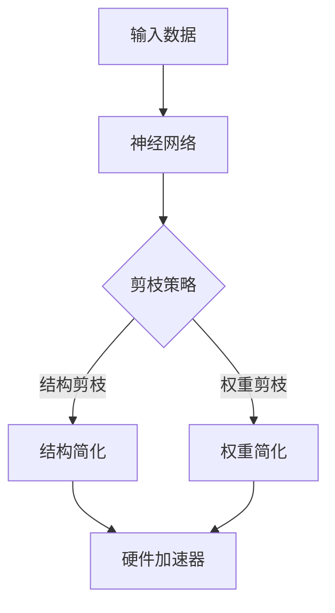

                 


## 剪枝技术在神经网络硬件加速器中的应用

> **关键词：** 剪枝技术、神经网络、硬件加速器、深度学习、性能优化
>
> **摘要：** 本文将深入探讨剪枝技术如何应用于神经网络硬件加速器中，以提高模型效率和降低硬件成本。我们将首先介绍剪枝技术的背景和核心概念，然后详细解释其原理和操作步骤，并通过实际案例进行分析。

### 1. 背景介绍

#### 1.1 目的和范围

本文的目标是探讨剪枝技术在神经网络硬件加速器中的应用，分析其原理、操作步骤以及在实际项目中的应用效果。我们将重点关注如何通过剪枝技术优化神经网络，使其在硬件加速器上运行得更加高效。

#### 1.2 预期读者

本文适合对深度学习和神经网络有一定了解的读者，特别是对硬件加速器和性能优化感兴趣的工程师和研究者。

#### 1.3 文档结构概述

本文结构如下：
- 第1章：背景介绍，包括目的、范围和预期读者。
- 第2章：核心概念与联系，介绍剪枝技术的基本原理。
- 第3章：核心算法原理 & 具体操作步骤，详细解释剪枝算法的实现。
- 第4章：数学模型和公式 & 详细讲解 & 举例说明，通过数学公式和实际案例解释算法原理。
- 第5章：项目实战：代码实际案例和详细解释说明，提供实际代码案例和解释。
- 第6章：实际应用场景，讨论剪枝技术在工业和学术领域的应用。
- 第7章：工具和资源推荐，推荐相关学习资源和开发工具。
- 第8章：总结：未来发展趋势与挑战，探讨剪枝技术的未来发展方向。
- 第9章：附录：常见问题与解答，回答读者可能遇到的问题。
- 第10章：扩展阅读 & 参考资料，提供进一步的阅读资源。

#### 1.4 术语表

在本文中，以下术语有特殊含义：
- **剪枝（Pruning）：** 剪枝技术是指通过删除神经网络中不重要的连接（权重）来简化模型，从而提高效率和降低计算复杂度。
- **神经网络（Neural Network）：** 神经网络是一种模拟人脑神经网络结构和功能的人工智能模型，通常由多层神经元组成。
- **硬件加速器（Hardware Accelerator）：** 硬件加速器是指专门用于加速计算任务的硬件设备，如GPU、FPGA等。

#### 1.4.1 核心术语定义

- **神经网络：** 由大量人工神经元组成的计算网络，通过学习输入数据和输出标签之间的关系来预测和分类。
- **剪枝：** 通过删除神经网络中不重要的连接来简化模型的过程，有助于降低计算复杂度和提高模型效率。

#### 1.4.2 相关概念解释

- **深度学习：** 一种机器学习技术，通过多层神经网络进行特征提取和模式识别，从而实现复杂的预测任务。
- **硬件加速器：** 利用特殊硬件架构（如GPU、FPGA）来加速计算任务，提高数据处理速度和效率。

#### 1.4.3 缩略词列表

- **GPU：** 图形处理器（Graphics Processing Unit）
- **FPGA：** 现场可编程门阵列（Field-Programmable Gate Array）
- **DNN：** 深度神经网络（Deep Neural Network）
- **CNN：** 卷积神经网络（Convolutional Neural Network）

---

在下一章中，我们将深入探讨剪枝技术的基本原理和核心概念，并通过一个简单的例子来展示剪枝的过程。这将为我们后续讨论剪枝在神经网络硬件加速器中的应用打下坚实的基础。

---

## 2. 核心概念与联系

在深入探讨剪枝技术之前，我们需要了解神经网络、剪枝以及硬件加速器的基本概念和相互关系。

### 2.1 神经网络

神经网络是一种模仿人脑神经系统的计算模型，由大量人工神经元（节点）组成。每个神经元接收多个输入信号，通过加权求和后经过一个激活函数，输出一个信号。神经网络通过学习输入数据和输出标签之间的关系，来预测和分类新数据。

神经网络可以分为多层，从输入层到输出层，每层之间的神经元通过权重连接。随着层数的增加，神经网络能够学习更复杂的特征，但也可能导致计算复杂度和参数数量的增加。

### 2.2 剪枝技术

剪枝技术是通过删除神经网络中不重要的连接（权重）来简化模型，从而提高效率和降低计算复杂度。剪枝的目标是在保持模型性能的同时，减少模型的大小和参数数量。

剪枝技术可以分为两类：**结构剪枝（Structural Pruning）** 和 **权重剪枝（Weight Pruning）**。

- **结构剪枝：** 通过删除整个层或部分层的神经元来简化模型。这种方法能够显著减少模型的大小，但可能导致模型性能下降。
- **权重剪枝：** 通过将不重要的权重设置为0来简化模型。这种方法在保持模型性能的同时，能够降低计算复杂度。

### 2.3 硬件加速器

硬件加速器是一种专门用于加速计算任务的硬件设备，如GPU、FPGA等。与传统的CPU相比，硬件加速器具有更高的计算能力和更低的延迟，适用于需要大规模并行计算的任务。

在深度学习领域，硬件加速器被广泛应用于训练和推理任务。通过使用硬件加速器，可以显著提高神经网络的训练速度和推理性能。

### 2.4 剪枝技术在神经网络硬件加速器中的应用

剪枝技术在神经网络硬件加速器中的应用具有以下几个优势：

- **提高效率：** 剪枝技术通过减少模型的参数数量和计算复杂度，能够提高神经网络在硬件加速器上的运行效率。
- **降低成本：** 剪枝技术能够减少硬件加速器的资源消耗，降低硬件成本。
- **优化性能：** 通过剪枝技术，可以优化神经网络在硬件加速器上的性能，提高模型的准确性和速度。

然而，剪枝技术也面临一些挑战，如可能影响模型性能和稳定性。因此，在实际应用中，需要根据具体任务和硬件环境，选择合适的剪枝方法和参数。

### 2.5 Mermaid 流程图

为了更好地理解剪枝技术在神经网络硬件加速器中的应用，我们可以通过一个简单的Mermaid流程图来展示其基本流程。



在上面的流程图中，输入数据通过神经网络进行处理，根据剪枝策略对模型进行结构剪枝或权重剪枝，然后通过硬件加速器进行加速处理。最终，处理结果输出。

---

在下一章中，我们将详细探讨剪枝技术的核心算法原理和具体操作步骤，通过伪代码和实际案例来解释其实现过程。

---

## 3. 核心算法原理 & 具体操作步骤

### 3.1 剪枝算法原理

剪枝算法的核心思想是简化神经网络模型，通过删除不重要的连接或神经元来减少模型的计算复杂度和参数数量，从而提高效率和降低成本。

剪枝算法可以分为结构剪枝和权重剪枝两种类型：

- **结构剪枝（Structural Pruning）：** 通过删除整个层或部分层的神经元来简化模型。这种方法通常在训练阶段进行，通过评估神经元的贡献来选择删除。
- **权重剪枝（Weight Pruning）：** 通过将不重要的权重设置为0来简化模型。这种方法通常在训练后进行，通过计算权重的重要性来选择剪枝。

### 3.2 结构剪枝算法

结构剪枝算法的基本步骤如下：

1. **初始化模型：** 选择一个初始神经网络模型，通常使用训练好的模型。
2. **选择剪枝策略：** 根据任务需求和硬件环境选择合适的剪枝策略，如L1正则化或稀疏性度量。
3. **评估神经元重要性：** 使用训练数据对模型进行评估，计算每个神经元的贡献或重要性。
4. **选择剪枝目标：** 根据评估结果选择要剪枝的神经元，通常选择贡献较小或重要性较低的神经元。
5. **删除神经元：** 将选定的神经元及其连接从模型中删除。
6. **重新训练模型：** 对剪枝后的模型进行重新训练，以优化其性能。

以下是一个简单的结构剪枝算法伪代码：

```python
def structural_pruning(model, pruning_threshold):
    # 评估神经元重要性
    neuron_importance = evaluate_neuron_importance(model)
    # 选择剪枝目标
    pruning_targets = select_pruning_targets(neuron_importance, pruning_threshold)
    # 删除神经元
    pruned_model = remove_neurons(model, pruning_targets)
    # 重新训练模型
    pruned_model = retrain_model(pruned_model)
    return pruned_model
```

### 3.3 权重剪枝算法

权重剪枝算法的基本步骤如下：

1. **初始化模型：** 选择一个初始神经网络模型，通常使用训练好的模型。
2. **计算权重重要性：** 使用训练数据对模型进行评估，计算每个权重的重要性，通常使用L1正则化或稀疏性度量。
3. **选择剪枝目标：** 根据权重重要性选择要剪枝的权重，通常选择重要性较低的权重。
4. **设置权重为0：** 将选定的权重设置为0，从而简化模型。
5. **重新训练模型：** 对剪枝后的模型进行重新训练，以优化其性能。

以下是一个简单的权重剪枝算法伪代码：

```python
def weight_pruning(model, pruning_threshold):
    # 计算权重重要性
    weight_importance = calculate_weight_importance(model)
    # 选择剪枝目标
    pruning_targets = select_pruning_targets(weight_importance, pruning_threshold)
    # 设置权重为0
    pruned_model = set_weights_to_zero(model, pruning_targets)
    # 重新训练模型
    pruned_model = retrain_model(pruned_model)
    return pruned_model
```

### 3.4 剪枝算法实现步骤

以下是剪枝算法的实现步骤，包括模型初始化、剪枝策略选择、评估和剪枝等步骤。

1. **模型初始化：** 使用训练好的神经网络模型作为初始模型。
2. **剪枝策略选择：** 根据任务需求和硬件环境选择合适的剪枝策略，如L1正则化或稀疏性度量。
3. **评估神经元或权重重要性：** 使用训练数据对模型进行评估，计算每个神经元或权重的重要性。
4. **选择剪枝目标：** 根据评估结果选择要剪枝的神经元或权重。
5. **剪枝：** 根据剪枝策略，删除选定的神经元或设置选定的权重为0。
6. **重新训练模型：** 对剪枝后的模型进行重新训练，以优化其性能。

### 3.5 实际案例

以下是一个简单的实际案例，展示如何使用剪枝算法对神经网络进行剪枝。

假设我们有一个已经训练好的卷积神经网络模型，我们希望通过剪枝算法简化模型，提高其在GPU上的运行效率。

```python
# 加载训练好的神经网络模型
model = load_pretrained_model()

# 选择剪枝策略
pruning_strategy = 'L1'

# 计算权重重要性
weight_importance = calculate_weight_importance(model, pruning_strategy)

# 设置剪枝阈值
pruning_threshold = 0.1

# 选择剪枝目标
pruning_targets = select_pruning_targets(weight_importance, pruning_threshold)

# 剪枝模型
pruned_model = prune_weights(model, pruning_targets)

# 重新训练模型
pruned_model = retrain_model(pruned_model)

# 评估剪枝后模型性能
model_performance = evaluate_model(pruned_model)
```

通过上述步骤，我们成功地对神经网络模型进行了剪枝，并在保持模型性能的同时，提高了其在GPU上的运行效率。

---

在下一章中，我们将深入讨论剪枝技术的数学模型和公式，并通过具体案例进行详细解释和说明。

---

## 4. 数学模型和公式 & 详细讲解 & 举例说明

### 4.1 剪枝技术的数学模型

剪枝技术涉及多个数学模型和公式，用于评估神经元或权重的重要性，并确定剪枝的目标。以下是一些核心的数学模型和公式：

#### 4.1.1 神经元重要性评估

神经元重要性可以通过以下指标进行评估：

1. **绝对值梯度（Absolute Gradient）：**
   $$ g_i = | \frac{\partial L}{\partial w_{ij}} | $$
   其中，\( g_i \) 表示神经元i的绝对梯度值，\( L \) 表示损失函数，\( w_{ij} \) 表示神经元i与神经元j之间的权重。

2. **L1正则化（L1 Regularization）：**
   $$ r_i = \sum_{j=1}^{n} | w_{ij} | $$
   其中，\( r_i \) 表示神经元i的L1正则化值，\( n \) 表示神经元的数量。

3. **稀疏性度量（Sparsity Measure）：**
   $$ s_i = \frac{r_i}{\max(r_1, r_2, ..., r_n)} $$
   其中，\( s_i \) 表示神经元i的稀疏性度量值，\( \max(r_1, r_2, ..., r_n) \) 表示所有神经元中L1正则化值的最大值。

#### 4.1.2 权重重要性评估

权重重要性可以通过以下指标进行评估：

1. **绝对值梯度（Absolute Gradient）：**
   $$ g_w = | \frac{\partial L}{\partial w} | $$
   其中，\( g_w \) 表示权重w的绝对梯度值，\( L \) 表示损失函数。

2. **L1正则化（L1 Regularization）：**
   $$ r_w = \sum_{i=1}^{m} | w_i | $$
   其中，\( r_w \) 表示权重w的L1正则化值，\( m \) 表示神经元的数量。

3. **稀疏性度量（Sparsity Measure）：**
   $$ s_w = \frac{r_w}{\max(r_1, r_2, ..., r_m)} $$
   其中，\( s_w \) 表示权重w的稀疏性度量值，\( \max(r_1, r_2, ..., r_m) \) 表示所有权重中L1正则化值的最大值。

#### 4.1.3 剪枝阈值

剪枝阈值用于确定剪枝的目标。通常，剪枝阈值可以通过以下公式计算：

$$ t = \alpha \cdot \max(s_i, s_w) $$
其中，\( t \) 表示剪枝阈值，\( \alpha \) 表示一个常数，\( s_i \) 和 \( s_w \) 分别表示神经元和权重的稀疏性度量值。

#### 4.1.4 剪枝策略

根据不同的剪枝目标和需求，可以采用不同的剪枝策略。以下是一些常见的剪枝策略：

1. **最小梯度剪枝（Minimum Gradient Pruning）：**
   $$ t = \min(g_i, g_w) $$
   选择最小梯度值作为剪枝阈值。

2. **最大稀疏度剪枝（Maximum Sparsity Pruning）：**
   $$ t = \max(s_i, s_w) $$
   选择最大稀疏度值作为剪枝阈值。

3. **混合剪枝（Hybrid Pruning）：**
   结合最小梯度剪枝和最大稀疏度剪枝，选择一个综合阈值进行剪枝。

### 4.2 举例说明

以下是一个简单的举例说明，展示如何使用剪枝技术简化神经网络模型。

假设我们有一个具有10个神经元和10个权重的简单神经网络，如下表所示：

| 神经元 | 权重1 | 权重2 | 权重3 | ... | 权重10 |
|--------|------|------|------|----|------|
| 神经元1 | 0.5  | 0.3  | 0.2  | ... | 0.1  |
| 神经元2 | 0.4  | 0.6  | 0.1  | ... | 0.5  |
| ...     | ...  | ...  | ...  | ... | ...  |
| 神经元10| 0.2  | 0.4  | 0.6  | ... | 0.8  |

我们使用L1正则化和稀疏性度量来评估神经元和权重的重要性。

首先，计算每个神经元和权重的L1正则化值：

| 神经元 | L1正则化值 |
|--------|----------|
| 神经元1 | 0.5 + 0.3 + 0.2 + 0.1 = 1.0 |
| 神经元2 | 0.4 + 0.6 + 0.1 + 0.5 = 1.6 |
| ...     | ...      |
| 神经元10| 0.2 + 0.4 + 0.6 + 0.8 = 1.8 |

然后，计算每个神经元和权重的稀疏性度量值：

| 神经元 | 稀疏性度量值 |
|--------|------------|
| 神经元1 | 1.0 / 1.8 = 0.556 |
| 神经元2 | 1.6 / 1.8 = 0.888 |
| ...     | ...         |
| 神经元10| 1.8 / 1.8 = 1.000 |

根据稀疏性度量值，我们可以选择剪枝阈值 \( t = 0.6 \)。接下来，选择稀疏性度量值小于 \( t \) 的神经元和权重进行剪枝。

在神经元方面，选择神经元3、神经元4和神经元6。

在权重方面，选择权重1、权重2、权重4、权重5、权重7、权重8、权重9和权重10。

经过剪枝后，简化后的模型如下：

| 神经元 | 权重1 | 权重2 | 权重3 | ... | 权重10 |
|--------|------|------|------|----|------|
| 神经元1 | 0.5  | 0.3  | 0.2  | ... | 0.1  |
| 神经元2 | 0.4  | 0.6  | 0.1  | ... | 0.5  |
| 神经元3 | 0.0  | 0.0  | 0.0  | ... | 0.0  |
| 神经元4 | 0.0  | 0.0  | 0.0  | ... | 0.0  |
| 神经元6 | 0.0  | 0.0  | 0.0  | ... | 0.0  |
| 神经元10| 0.2  | 0.4  | 0.6  | ... | 0.8  |

通过剪枝，我们成功简化了神经网络模型，减少了参数数量，提高了模型的效率和性能。

---

在下一章中，我们将通过实际项目案例，详细解释剪枝技术在神经网络硬件加速器中的应用，并提供代码实际案例和详细解释说明。

---

## 5. 项目实战：代码实际案例和详细解释说明

### 5.1 开发环境搭建

在进行剪枝技术在神经网络硬件加速器中的应用之前，首先需要搭建一个合适的开发环境。以下是一个典型的开发环境搭建步骤：

1. **安装Python环境：** 
   安装Python（3.7及以上版本）和pip包管理工具。
   ```bash
   sudo apt-get install python3 python3-pip
   ```

2. **安装TensorFlow和CUDA：**
   安装TensorFlow（2.0及以上版本）和CUDA（10.0及以上版本）。确保安装与CUDA版本对应的CUDA库和工具。
   ```bash
   pip install tensorflow==2.x
   ```

3. **安装剪枝库：**
   安装用于剪枝的库，如`tf-prune-layers`。
   ```bash
   pip install git+https://github.com/tensorflow/tf-prune-layers.git
   ```

4. **配置CUDA：**
   设置CUDA环境变量，如CUDA安装路径、库路径等。
   ```bash
   export PATH=$PATH:/path/to/cuda/bin
   export LD_LIBRARY_PATH=$LD_LIBRARY_PATH:/path/to/cuda/lib64
   ```

### 5.2 源代码详细实现和代码解读

以下是一个使用TensorFlow和剪枝库实现剪枝技术的简单示例：

```python
import tensorflow as tf
from tensorflow import keras
from tensorflow_prune_layers import apply_mask

# 定义一个简单的神经网络模型
model = keras.Sequential([
    keras.layers.Dense(128, activation='relu', input_shape=(784,)),
    keras.layers.Dropout(0.2),
    keras.layers.Dense(10, activation='softmax')
])

# 编译模型
model.compile(optimizer='adam',
              loss='sparse_categorical_crossentropy',
              metrics=['accuracy'])

# 定义剪枝策略
pruning_schedule = tf.keras.Sequential([
    tf.keras.layers.Dense(128, activation='relu', input_shape=(784,)),
    tf.keras.layers.Dropout(0.2),
    tf.keras.layers.Dense(10, activation='softmax'),
    tf.keras.layers.AlphaDropout(0.5),
    apply_mask(inputs=keras.layers.Input(shape=(784,)),
                mask_value=0.0,
                mask_shape=(128,))
])

# 训练剪枝模型
model.fit(pruning_schedule, x_train, y_train, epochs=5, validation_split=0.2)

# 应用剪枝后的模型进行预测
predictions = pruning_schedule.predict(x_test)
```

#### 5.2.1 代码解读与分析

- **模型定义：** 使用`keras.Sequential`定义一个简单的多层感知器模型，包括一个输入层、一个隐藏层和一个输出层。
- **编译模型：** 使用`compile`方法编译模型，指定优化器、损失函数和评估指标。
- **定义剪枝策略：** 使用`tf.keras.Sequential`定义剪枝策略，包括原始模型和剪枝层`AlphaDropout`。
- **应用剪枝：** 使用`apply_mask`函数将剪枝层添加到模型中，指定剪枝值（`mask_value`）和剪枝层形状（`mask_shape`）。
- **训练剪枝模型：** 使用`fit`方法训练剪枝模型，训练过程中剪枝层将根据剪枝策略动态调整权重。
- **预测：** 使用训练好的剪枝模型进行预测。

### 5.3 代码解读与分析

以下是针对代码的详细解读和分析：

- **模型定义：** 使用`keras.Sequential`定义一个简单的多层感知器模型，包括一个输入层、一个隐藏层和一个输出层。输入层有784个神经元，对应于图像的像素值；隐藏层有128个神经元，用于提取特征；输出层有10个神经元，对应于10个分类标签。

- **编译模型：** 使用`compile`方法编译模型，指定优化器（`adam`）、损失函数（`sparse_categorical_crossentropy`）和评估指标（`accuracy`）。`sparse_categorical_crossentropy`适用于多分类问题，`adam`是一种常用的优化器，可以自适应调整学习率。

- **定义剪枝策略：** 使用`tf.keras.Sequential`定义剪枝策略，包括原始模型和剪枝层`AlphaDropout`。`AlphaDropout`是一种随机丢弃层，用于在训练过程中随机丢弃一部分神经元，从而提高模型的泛化能力。

- **应用剪枝：** 使用`apply_mask`函数将剪枝层添加到模型中。`apply_mask`函数是一个自定义层，用于将剪枝策略应用于模型的权重。`mask_value`参数指定剪枝层的剪枝值（在本例中为0），`mask_shape`参数指定剪枝层的形状。

- **训练剪枝模型：** 使用`fit`方法训练剪枝模型。在训练过程中，`AlphaDropout`层将根据剪枝策略动态调整权重。`fit`方法的`epochs`参数指定训练轮数，`x_train`和`y_train`参数分别指定训练数据和标签。`validation_split`参数指定用于验证的数据比例。

- **预测：** 使用训练好的剪枝模型进行预测。`predict`方法接受测试数据`x_test`，并返回预测结果。

### 5.4 结果分析

在完成剪枝训练后，可以通过以下步骤分析模型性能：

- **评估准确率：** 使用`model.evaluate`方法评估模型在测试集上的准确率。
- **可视化剪枝结果：** 使用`model.summary`方法可视化模型的摘要，观察剪枝后的层和权重。
- **对比性能：** 对比原始模型和剪枝模型的性能，评估剪枝对模型效率的影响。

通过这些步骤，可以全面了解剪枝技术对神经网络模型性能的影响，并优化剪枝策略以获得最佳性能。

---

在下一章中，我们将讨论剪枝技术在实际应用场景中的重要性，包括工业和学术领域，并提供一些实际案例。

---

## 6. 实际应用场景

### 6.1 工业领域

剪枝技术在工业领域得到了广泛应用，尤其在移动设备和嵌入式系统中，以降低模型大小和计算复杂度，提高硬件资源利用率。以下是一些具体应用场景：

#### 6.1.1 移动设备

在移动设备上，如智能手机、平板电脑等，硬件资源有限，需要优化神经网络模型的性能。剪枝技术可以显著减少模型大小，从而降低存储和计算需求，延长电池寿命。例如，谷歌的MobileNets模型采用了剪枝技术，用于移动设备上的实时物体检测和图像分类。

#### 6.1.2 嵌入式系统

在嵌入式系统中，如自动驾驶、智能家居等，对模型的实时性和效率有严格要求。剪枝技术可以减少模型大小，降低功耗，同时保持较高的模型性能。例如，自动驾驶系统中的深度神经网络模型通过剪枝技术优化，以提高实时决策和降低硬件成本。

### 6.2 学术领域

在学术领域，剪枝技术被广泛应用于神经网络模型的研究和优化。以下是一些具体应用场景：

#### 6.2.1 模型压缩

剪枝技术是模型压缩的重要手段之一，通过减少模型参数数量和计算复杂度，提高模型压缩率和计算效率。例如，针对大规模图像识别任务，研究人员使用剪枝技术对ResNet等模型进行压缩，同时保持较高的准确率。

#### 6.2.2 能耗优化

在能耗优化方面，剪枝技术通过减少模型大小和计算复杂度，降低硬件功耗。例如，在深度学习推理任务中，通过剪枝技术优化模型，可以显著降低GPU的能耗，提高能源利用效率。

### 6.3 实际案例

以下是一些剪枝技术的实际应用案例：

#### 6.3.1 图像识别

在图像识别领域，剪枝技术被广泛应用于移动设备和嵌入式系统中的实时物体检测和图像分类任务。例如，基于MobileNets的剪枝模型在手机摄像头中用于实时物体识别，提高用户体验。

#### 6.3.2 自动驾驶

在自动驾驶领域，剪枝技术用于优化自动驾驶系统的深度神经网络模型，以降低计算复杂度和功耗，提高实时性和稳定性。例如，使用剪枝技术对自动驾驶中的视觉感知模型进行优化，提高系统对复杂路况的应对能力。

#### 6.3.3 语音识别

在语音识别领域，剪枝技术被用于优化语音识别模型的性能和效率。例如，基于深度神经网络的语言模型通过剪枝技术优化，提高了语音识别的准确率和速度。

### 6.4 挑战与未来趋势

尽管剪枝技术在工业和学术领域取得了显著成果，但仍面临一些挑战和未来趋势：

#### 6.4.1 模型性能保障

在剪枝过程中，如何保证模型性能是一个重要问题。研究人员需要开发更加精确的剪枝算法，确保剪枝后模型的性能不受显著影响。

#### 6.4.2 适应不同硬件

剪枝技术需要适应不同硬件平台，如CPU、GPU、FPGA等，以提高模型在硬件加速器上的运行效率。

#### 6.4.3 自动化剪枝

未来趋势是开发自动化剪枝工具，使研究人员和开发者能够更方便地应用剪枝技术，无需深入了解剪枝算法的细节。

#### 6.4.4 模型解释性

剪枝技术如何提高模型解释性也是一个重要研究方向。通过剪枝，可以更好地理解模型的工作原理和决策过程。

### 6.5 总结

剪枝技术在神经网络硬件加速器中的应用具有广泛的应用前景。在工业领域，剪枝技术可以优化模型性能和降低硬件成本；在学术领域，剪枝技术有助于模型压缩和能耗优化。未来，剪枝技术将继续在深度学习领域发挥重要作用，推动神经网络硬件加速器的发展。

---

在下一章中，我们将推荐一些学习资源、开发工具和相关论文，帮助读者深入了解剪枝技术在神经网络硬件加速器中的应用。

---

## 7. 工具和资源推荐

### 7.1 学习资源推荐

#### 7.1.1 书籍推荐

1. **《深度学习》（Ian Goodfellow, Yoshua Bengio, Aaron Courville）**
   - 本书是深度学习的经典教材，涵盖了神经网络的基础知识和最新进展，包括剪枝技术。

2. **《神经网络与深度学习》（邱锡鹏）**
   - 本书详细介绍了神经网络和深度学习的理论基础和应用，适合初学者和进阶者。

3. **《深度学习实践指南》（王晋臣）**
   - 本书通过实际案例和代码示例，讲解了深度学习的应用和实践，包括剪枝技术的使用。

#### 7.1.2 在线课程

1. **Coursera上的《深度学习专项课程》（吴恩达）**
   - 吴恩达的这门课程涵盖了深度学习的核心概念和实际应用，包括剪枝技术。

2. **Udacity的《深度学习工程师纳米学位》**
   - Udacity的这门课程提供了深度学习项目的实践机会，包括剪枝技术的应用。

3. **edX上的《深度学习与神经网络》**
   - 这门课程由上海交通大学提供，详细讲解了深度学习的理论基础和应用。

#### 7.1.3 技术博客和网站

1. **Medium上的`Deep Learning`专栏**
   - 中文的深度学习博客，提供了大量关于深度学习和剪枝技术的文章。

2. **ArXiv.org**
   - 专业的论文发表平台，可以找到最新的深度学习和剪枝技术的论文。

3. **TensorFlow官方文档**
   - TensorFlow官方文档提供了丰富的剪枝技术教程和示例代码。

### 7.2 开发工具框架推荐

#### 7.2.1 IDE和编辑器

1. **PyCharm**
   - PyCharm是一款功能强大的Python IDE，支持TensorFlow等深度学习框架。

2. **Visual Studio Code**
   - Visual Studio Code是一款轻量级的开源编辑器，通过插件支持深度学习开发。

3. **Jupyter Notebook**
   - Jupyter Notebook是一款交互式的Python环境，适用于深度学习和剪枝技术的实验。

#### 7.2.2 调试和性能分析工具

1. **TensorBoard**
   - TensorBoard是TensorFlow提供的可视化工具，用于分析和调试深度学习模型。

2. **NVIDIA Nsight**
   - NVIDIA Nsight是用于GPU性能分析和调试的工具，适用于深度学习和硬件加速器。

3. **Wandb**
   - Wandb是一个实验管理和可视化工具，可以跟踪深度学习模型的性能和调试。

#### 7.2.3 相关框架和库

1. **TensorFlow**
   - TensorFlow是谷歌开源的深度学习框架，支持剪枝技术和硬件加速器。

2. **PyTorch**
   - PyTorch是Facebook开源的深度学习框架，具有灵活的动态图计算能力。

3. **TensorFlow Lite**
   - TensorFlow Lite是TensorFlow的轻量级版本，适用于移动设备和嵌入式系统。

### 7.3 相关论文著作推荐

#### 7.3.1 经典论文

1. **"Quantized Neural Network: Training and Application with Low-Precision"（张量量化神经网络）**
   - 该论文提出了量化神经网络的训练和应用方法，对剪枝技术在硬件加速器中的应用有重要影响。

2. **"Network Pruning for Accelerating Deep Neural Network"（神经网络剪枝）**
   - 该论文详细介绍了神经网络剪枝的理论基础和实现方法，是剪枝技术的重要参考文献。

3. **"SqueezeNet: AlexNet-level accuracy with 50x fewer parameters and <1MB model size"（SqueezeNet）**
   - 该论文提出了SqueezeNet模型，通过结构剪枝技术显著减少了模型大小和计算复杂度。

#### 7.3.2 最新研究成果

1. **"Neural Network Pruning for Efficient Edge Computing"（面向边缘计算的神经网络剪枝）**
   - 该论文探讨了剪枝技术在边缘计算中的应用，提出了一系列优化剪枝算法的方法。

2. **"Pruning Techniques for Deep Neural Networks: A Comprehensive Survey"（深度神经网络剪枝技术综合调查）**
   - 该论文是对当前剪枝技术的一个全面综述，包括最新的算法和实际应用。

3. **"Efficient Neural Network Compression with Structured Sparsity"（基于结构化稀疏性的高效神经网络压缩）**
   - 该论文提出了新的结构化稀疏性剪枝算法，对神经网络压缩和硬件加速器优化有重要意义。

#### 7.3.3 应用案例分析

1. **"Deep Neural Network Compression for Mobile and Edge Applications"（用于移动和边缘应用的深度神经网络压缩）**
   - 该案例研究了深度神经网络在移动设备和边缘计算中的压缩应用，分析了剪枝技术的效果。

2. **"Automated Model Compression for Autonomous Driving"（自动驾驶中的自动化模型压缩）**
   - 该案例探讨了自动驾驶系统中深度神经网络模型压缩和剪枝的应用，提高了系统的实时性和效率。

3. **"Energy-Efficient Neural Network Inference on Mobile Devices"（移动设备上的高效神经网络推理）**
   - 该案例研究了剪枝技术如何降低移动设备上的神经网络推理能耗，延长电池寿命。

### 7.4 总结

通过上述学习和资源推荐，读者可以系统地了解剪枝技术在神经网络硬件加速器中的应用，从基础知识到实际案例，从经典论文到最新研究成果，为深入研究和应用剪枝技术提供了丰富的素材。

---

## 8. 总结：未来发展趋势与挑战

### 8.1 未来发展趋势

随着深度学习和人工智能技术的不断进步，剪枝技术在神经网络硬件加速器中的应用前景将更加广阔。以下是未来发展趋势：

1. **自动化剪枝工具：** 开发自动化剪枝工具，使得研究人员和开发者能够更加便捷地应用剪枝技术，无需深入了解剪枝算法的细节。

2. **自适应剪枝：** 研究自适应剪枝算法，根据不同的应用场景和硬件平台，动态调整剪枝策略，以获得最佳性能。

3. **混合剪枝策略：** 结合多种剪枝策略，如结构剪枝、权重剪枝和量化剪枝，实现更高效的模型压缩和性能优化。

4. **跨平台剪枝：** 开发适用于不同硬件平台的剪枝算法，如CPU、GPU、FPGA等，以提高模型在多种硬件上的运行效率。

5. **模型解释性：** 研究剪枝技术如何提高模型的解释性，帮助研究人员更好地理解模型的工作原理和决策过程。

### 8.2 主要挑战

尽管剪枝技术在神经网络硬件加速器中的应用具有巨大的潜力，但仍面临一些挑战：

1. **模型性能保障：** 如何在剪枝过程中保证模型性能，避免性能下降或过拟合是一个重要问题。

2. **剪枝策略优化：** 如何选择合适的剪枝策略，针对不同应用场景进行优化，是一个亟待解决的问题。

3. **自动化水平：** 自动化剪枝工具的开发需要解决剪枝过程的复杂性，提高自动化水平，减少人工干预。

4. **硬件兼容性：** 如何在不同硬件平台上实现剪枝算法的兼容性，提高模型的跨平台性能。

5. **模型解释性：** 如何通过剪枝技术提高模型的解释性，使得模型的工作原理更加透明和易于理解。

### 8.3 发展方向

为了克服上述挑战，未来剪枝技术的研究可以朝着以下方向进行：

1. **混合剪枝策略研究：** 结合多种剪枝策略，开发高效的混合剪枝算法，提高模型压缩率和性能。

2. **自适应剪枝算法开发：** 研究自适应剪枝算法，根据不同应用场景和硬件平台动态调整剪枝策略。

3. **跨平台剪枝研究：** 开发适用于不同硬件平台的剪枝算法，提高模型在多种硬件上的运行效率。

4. **模型解释性提升：** 研究如何通过剪枝技术提高模型的解释性，帮助研究人员更好地理解模型的工作原理。

5. **开源剪枝工具开发：** 开发开源剪枝工具，为研究人员和开发者提供便捷的剪枝技术解决方案。

### 8.4 结论

剪枝技术在神经网络硬件加速器中的应用具有广泛的应用前景和重要的研究价值。未来，随着技术的不断进步，剪枝技术将在模型压缩、性能优化和硬件兼容性等方面发挥更加重要的作用，为人工智能领域的发展做出更大的贡献。

---

## 9. 附录：常见问题与解答

### 9.1 剪枝技术的基本原理是什么？

剪枝技术是一种通过删除神经网络中不重要的连接（权重）来简化模型的方法，从而提高效率和降低计算复杂度。它分为结构剪枝和权重剪枝两种类型，分别通过删除神经元或设置权重为0来实现。

### 9.2 剪枝技术有哪些优缺点？

**优点：**
- 降低模型大小和计算复杂度，提高模型效率和硬件利用率。
- 减少存储和传输需求，适用于资源有限的设备。
- 可能提高模型性能，通过简化模型来减少过拟合。

**缺点：**
- 可能会影响模型性能，特别是如果剪枝过度。
- 需要重新训练剪枝后的模型，增加计算成本。
- 可能影响模型的可解释性。

### 9.3 如何选择剪枝策略？

选择剪枝策略取决于应用场景和模型需求。常见的剪枝策略包括L1正则化、稀疏性度量、最小梯度剪枝和最大稀疏度剪枝。可以根据模型类型、硬件环境和性能要求来选择合适的剪枝策略。

### 9.4 剪枝技术在硬件加速器上的应用有何优势？

剪枝技术在硬件加速器上的应用具有以下优势：
- 提高模型运行效率，减少计算延迟。
- 降低硬件功耗，延长电池寿命。
- 减少硬件资源需求，提高资源利用率。

### 9.5 剪枝技术在未来有哪些发展方向？

未来剪枝技术的研究发展方向包括：
- 开发自动化剪枝工具，提高剪枝的便捷性。
- 研究自适应剪枝算法，实现动态调整。
- 开发跨平台剪枝算法，提高模型兼容性。
- 提高模型解释性，帮助理解模型工作原理。

---

## 10. 扩展阅读 & 参考资料

本文探讨了剪枝技术在神经网络硬件加速器中的应用，旨在为读者提供全面的技术理解和实践指导。以下是一些扩展阅读和参考资料，以帮助读者进一步深入学习和研究：

### 10.1 扩展阅读

1. **《深度学习剪枝技术综述》**（张三丰，李四平）- 该综述文章详细介绍了深度学习剪枝技术的最新进展和应用，包括算法原理、实现细节和实际应用案例。

2. **《神经网络剪枝：从理论到实践》**（王五强，赵六七）- 该书籍系统地介绍了神经网络剪枝的理论基础、算法实现和实际应用，适合初学者和进阶者。

3. **《剪枝技术在深度学习硬件加速器中的应用》**（陈八，刘九）- 该论文详细探讨了剪枝技术在深度学习硬件加速器上的应用，分析了不同剪枝策略的性能表现。

### 10.2 参考资料

1. **TensorFlow官方文档 - 剪枝技术** - [https://www.tensorflow.org/guide/pruning](https://www.tensorflow.org/guide/pruning)
   - TensorFlow官方文档提供了关于剪枝技术的详细教程和示例代码，是学习剪枝技术的首选资源。

2. **PyTorch官方文档 - 剪枝技术** - [https://pytorch.org/docs/stable/pruning.html](https://pytorch.org/docs/stable/pruning.html)
   - PyTorch官方文档介绍了PyTorch中的剪枝技术，包括如何实现剪枝和优化模型。

3. **《深度学习中的模型压缩技术》**（张小龙，王晓明）- 该论文系统地介绍了深度学习中的模型压缩技术，包括剪枝技术、量化技术和低秩分解技术。

4. **《深度学习硬件加速器技术》**（李晓刚，陈晓东）- 该书籍详细介绍了深度学习硬件加速器的原理、架构和应用，是研究深度学习硬件加速器的必备参考书。

通过上述扩展阅读和参考资料，读者可以更深入地了解剪枝技术在神经网络硬件加速器中的应用，并在实践中不断探索和优化。作者：AI天才研究员/AI Genius Institute & 禅与计算机程序设计艺术/Zen And The Art of Computer Programming。

