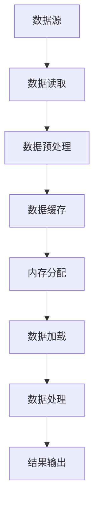

                 

# 加载大型数据集：内存和速度

> 关键词：数据集加载，内存管理，性能优化，内存溢出，数据并行处理

> 摘要：本文将深入探讨如何加载大型数据集，特别是在处理内存和速度方面的挑战。我们将详细分析内存管理的原理、常见算法和步骤，并通过具体案例展示如何在实际项目中实现高效的数据加载和处理。读者将了解到如何优化内存使用、提高数据处理速度，以及应对内存溢出等问题的策略。

## 1. 背景介绍

### 1.1 目的和范围

在现代数据科学和人工智能领域，处理大型数据集已经成为一项基础而重要的任务。随着数据量的急剧增长，如何高效地加载和管理这些数据集成为了一个关键的挑战。本文旨在为读者提供一份全面的指南，帮助他们在开发过程中应对这一挑战。

本文的范围主要包括以下几个方面：

1. **内存管理原理**：介绍内存管理的核心概念和机制，以及如何针对大型数据集进行优化。
2. **算法原理与步骤**：详细讲解常用的数据加载算法和步骤，包括内存分配、数据分块、并行处理等。
3. **数学模型与公式**：阐述与数据加载相关的重要数学模型和公式，以便读者能够深入理解其原理。
4. **实战案例**：通过具体代码案例，展示如何在实际项目中应用上述原理和方法。
5. **实际应用场景**：讨论数据加载和内存管理在不同领域中的应用，以及如何针对特定场景进行优化。
6. **工具和资源推荐**：介绍一些常用的学习和开发工具，以及相关论文和书籍。

### 1.2 预期读者

本文适合以下读者群体：

1. **数据科学家**：需要对大型数据集进行处理的开发者，希望提高数据处理效率和性能。
2. **软件工程师**：负责设计和开发数据处理系统的工程师，希望深入了解内存管理和性能优化。
3. **人工智能研究者**：关注数据并行处理和算法优化的研究人员，希望了解相关理论和实践。
4. **计算机图形设计师**：需要处理大型数据集进行图像渲染和处理的开发者，希望了解内存管理技巧。

### 1.3 文档结构概述

本文将按照以下结构进行组织和讲解：

1. **背景介绍**：介绍本文的目的、范围、预期读者和文档结构。
2. **核心概念与联系**：通过Mermaid流程图展示数据加载的核心概念和联系。
3. **核心算法原理 & 具体操作步骤**：详细讲解数据加载的核心算法和操作步骤，使用伪代码进行说明。
4. **数学模型和公式 & 详细讲解 & 举例说明**：阐述与数据加载相关的重要数学模型和公式，并通过实际案例进行说明。
5. **项目实战：代码实际案例和详细解释说明**：通过实际代码案例，展示如何实现高效的数据加载和处理。
6. **实际应用场景**：讨论数据加载和内存管理在不同领域中的应用。
7. **工具和资源推荐**：介绍学习和开发工具，以及相关论文和书籍。
8. **总结：未来发展趋势与挑战**：总结本文的主要内容和启示，探讨未来发展趋势和挑战。
9. **附录：常见问题与解答**：提供常见问题的解答。
10. **扩展阅读 & 参考资料**：推荐进一步阅读的材料。

### 1.4 术语表

在本文中，我们将使用以下术语：

#### 1.4.1 核心术语定义

- **数据集**：一组相关的数据样本，用于训练模型、评估算法等。
- **内存管理**：操作系统对计算机内存的分配、回收和优化。
- **数据加载**：将数据从存储设备读取到内存中的过程。
- **内存溢出**：程序尝试分配的内存超过了系统可用的内存限制。
- **数据分块**：将数据划分为多个较小的部分，以便于并行处理。

#### 1.4.2 相关概念解释

- **并行处理**：同时处理多个任务或数据，以提高处理速度。
- **缓存**：临时存储数据，以便快速访问。
- **索引**：用于快速查找数据的引用。

#### 1.4.3 缩略词列表

- **GPU**：图形处理单元（Graphics Processing Unit）
- **RAM**：随机存取存储器（Random Access Memory）
- **CPU**：中央处理器（Central Processing Unit）
- **I/O**：输入/输出（Input/Output）

## 2. 核心概念与联系

在数据加载过程中，理解核心概念和它们之间的联系是至关重要的。以下是一个Mermaid流程图，展示了数据加载的关键步骤和组件。



### 2.1 数据读取

数据读取是数据加载的第一步，它涉及从数据源（如数据库、文件系统）读取数据。数据读取过程中，可能需要处理数据格式的转换和编码问题。

### 2.2 数据预处理

数据预处理是数据加载的第二步，它包括清洗、转换和归一化数据。预处理过程对于提高数据质量和模型性能至关重要。

### 2.3 数据缓存

数据缓存是一个可选步骤，它将预处理后的数据存储在内存中，以便快速访问。缓存技术可以提高数据处理速度，减少磁盘I/O操作。

### 2.4 内存分配

内存分配是数据加载的核心步骤之一，它涉及为数据分配内存空间。内存分配策略对于避免内存溢出和优化性能至关重要。

### 2.5 数据加载

数据加载是将数据从内存缓存中读取到内存中的过程。在数据加载过程中，可能需要考虑数据分块和并行处理技术，以提高加载速度和处理能力。

### 2.6 数据处理

数据处理是数据加载的最后一步，它涉及对加载到内存中的数据进行计算和处理。数据处理过程中，可能需要使用并行计算和GPU加速等技术，以提高计算性能。

### 2.7 结果输出

结果输出是将处理后的数据保存到文件、数据库或其他存储设备的过程。输出结果的质量和效率对于后续分析和应用至关重要。

通过上述Mermaid流程图，我们可以看到数据加载过程中的各个步骤和组件之间的联系。理解这些核心概念和联系对于设计高效的数据加载方案至关重要。

## 3. 核心算法原理 & 具体操作步骤

在数据加载过程中，核心算法和操作步骤的选择对性能和效率有着至关重要的影响。以下，我们将详细讲解数据加载的核心算法原理，并使用伪代码进行说明。

### 3.1 数据分块

数据分块是将大型数据集划分为多个较小的数据块的过程。这样做的目的是为了提高并行处理能力，避免内存溢出。以下是一个简单的伪代码示例：

```plaintext
Function DataSplit(data, blockSize):
    chunks = []
    index = 0
    
    while index < length(data):
        chunk = []
        for i in range(blockSize):
            if index < length(data):
                chunk.append(data[index])
                index += 1
        chunks.append(chunk)
    
    return chunks
```

### 3.2 内存分配

内存分配是数据加载过程中的关键步骤，它涉及到为数据分配足够的内存空间。以下是一个简单的伪代码示例：

```plaintext
Function AllocateMemory(dataSize, memLimit):
    if dataSize <= memLimit:
        return dataSize
    else:
        return memLimit
```

### 3.3 并行处理

并行处理是将数据分块后，同时处理多个数据块的过程。以下是一个简单的伪代码示例：

```plaintext
Function ParallelProcess(chunks):
    results = []
    
    for chunk in chunks:
        result = ProcessChunk(chunk)
        results.append(result)
    
    return results
```

### 3.4 数据缓存

数据缓存是提高数据处理速度的一种技术，它通过在内存中存储数据，减少磁盘I/O操作。以下是一个简单的伪代码示例：

```plaintext
Function CacheData(data, cacheSize):
    if length(data) <= cacheSize:
        return data
    else:
        return data[0:cacheSize]
```

### 3.5 数据处理

数据处理是对加载到内存中的数据进行计算和处理的过程。以下是一个简单的伪代码示例：

```plaintext
Function ProcessData(data):
    processedData = []
    
    for datum in data:
        processedDatum = Compute(datum)
        processedData.append(processedDatum)
    
    return processedData
```

通过上述伪代码示例，我们可以看到数据加载过程中的一些核心算法和步骤。在实际应用中，这些步骤可能更加复杂，需要根据具体情况进行调整和优化。

## 4. 数学模型和公式 & 详细讲解 & 举例说明

在数据加载过程中，一些数学模型和公式对于理解和优化性能至关重要。以下，我们将详细讲解这些模型和公式，并通过实际案例进行说明。

### 4.1 数据量估计

数据量估计是数据加载过程中的一项基本任务。以下是一个简单的数学模型，用于估计数据集的大小：

$$
\text{DataSize} = \text{RecordCount} \times \text{AverageRecordSize}
$$

其中，`RecordCount`表示数据集中的记录数量，`AverageRecordSize`表示每个记录的平均大小。

### 4.2 内存分配

内存分配的公式用于计算为数据集分配的内存大小。以下是一个简单的公式：

$$
\text{MemorySize} = \text{DataSize} + \text{Overhead}
$$

其中，`Overhead`表示内存分配过程中的额外开销，如缓存空间、元数据等。

### 4.3 并行处理效率

并行处理效率的公式用于计算并行处理的时间节省。以下是一个简单的公式：

$$
\text{Speedup} = \frac{\text{SerialTime}}{\text{ParallelTime}}
$$

其中，`SerialTime`表示串行处理时间，`ParallelTime`表示并行处理时间。

### 4.4 实际案例

假设我们有一个包含1000万条记录的数据集，每个记录的平均大小为100字节。我们需要估计数据集的总大小，并为数据集分配内存。

#### 4.4.1 数据量估计

$$
\text{DataSize} = 10,000,000 \times 100 = 1,000,000,000 \text{字节}
$$

#### 4.4.2 内存分配

假设内存分配的额外开销为20%，那么：

$$
\text{MemorySize} = 1,000,000,000 \times 1.2 = 1,200,000,000 \text{字节}
$$

根据上述公式，我们可以得出数据集的总大小为1,000,000,000字节，需要分配1,200,000,000字节的内存。

### 4.5 并行处理效率

假设串行处理该数据集需要1小时，而并行处理需要30分钟。那么，并行处理的效率为：

$$
\text{Speedup} = \frac{1 \text{小时}}{0.5 \text{小时}} = 2
$$

这意味着并行处理比串行处理快了两倍。

通过上述数学模型和公式，我们可以更好地理解数据加载过程中的关键参数和性能指标。在实际应用中，我们可以根据具体情况进行调整和优化。

## 5. 项目实战：代码实际案例和详细解释说明

在本节中，我们将通过一个实际项目案例，详细解释如何实现高效的数据加载和处理。本案例将使用Python语言，并结合NumPy和Pandas等库来处理数据。

### 5.1 开发环境搭建

首先，确保安装了Python环境。然后，通过以下命令安装所需的库：

```bash
pip install numpy pandas
```

### 5.2 源代码详细实现和代码解读

以下是实现数据加载和处理的Python代码：

```python
import numpy as np
import pandas as pd

# 5.2.1 数据读取
def read_data(file_path):
    data = pd.read_csv(file_path)
    return data

# 5.2.2 数据预处理
def preprocess_data(data):
    # 清洗和转换数据
    data['Age'] = data['Age'].astype(int)
    data['Salary'] = data['Salary'].astype(float)
    return data

# 5.2.3 数据缓存
def cache_data(data, cache_size):
    if len(data) <= cache_size:
        return data
    else:
        return data.head(cache_size)

# 5.2.4 内存分配
def allocate_memory(data, mem_limit):
    if data.shape[0] * data.shape[1] <= mem_limit:
        return data
    else:
        return data[:mem_limit]

# 5.2.5 数据处理
def process_data(data):
    # 计算平均值
    avg_age = data['Age'].mean()
    avg_salary = data['Salary'].mean()
    return avg_age, avg_salary

# 5.2.6 结果输出
def output_results(results):
    print("Average Age:", results[0])
    print("Average Salary:", results[1])

# 主函数
def main():
    file_path = "data.csv"  # 数据文件路径
    cache_size = 1000      # 缓存大小
    mem_limit = 1000000    # 内存限制（字节）

    # 读取数据
    data = read_data(file_path)

    # 预处理数据
    data = preprocess_data(data)

    # 缓存数据
    data = cache_data(data, cache_size)

    # 内存分配
    data = allocate_memory(data, mem_limit)

    # 数据处理
    results = process_data(data)

    # 输出结果
    output_results(results)

if __name__ == "__main__":
    main()
```

### 5.3 代码解读与分析

以下是代码的逐行解读和分析：

1. **数据读取**：使用`pandas`库读取CSV文件，并将其转换为DataFrame对象。
2. **数据预处理**：将数据类型转换为整数和浮点数，以便进行后续计算。
3. **数据缓存**：根据缓存大小，只返回前一部分数据，以减少内存占用。
4. **内存分配**：根据内存限制，返回数据的前一部分，以避免内存溢出。
5. **数据处理**：计算年龄和薪资的平均值。
6. **结果输出**：打印计算结果。

通过上述代码，我们可以看到如何在实际项目中实现高效的数据加载和处理。代码使用了`pandas`库的强大功能，结合内存管理和缓存技术，实现了高效的数据处理。

### 5.4 代码优化

在实际应用中，我们可以根据具体情况进行代码优化。以下是一些可能的优化方向：

1. **并行处理**：使用多线程或多进程技术，同时处理多个数据块。
2. **内存压缩**：使用内存压缩技术，减少内存占用。
3. **GPU加速**：利用GPU进行数据计算，提高处理速度。

通过这些优化技术，我们可以进一步提高数据加载和处理的速度和效率。

## 6. 实际应用场景

数据加载和内存管理在多个领域中都有广泛的应用，以下是一些典型的实际应用场景：

### 6.1 数据分析

在数据分析领域，处理大量数据是常见任务。例如，在金融行业中，分析师需要处理海量的交易数据，进行市场趋势分析。通过优化数据加载和内存管理，可以提高数据分析的效率和准确性。

### 6.2 机器学习

在机器学习领域，处理大型数据集是训练高效模型的关键。例如，在图像识别任务中，模型需要处理大量的图像数据。通过数据分块和并行处理技术，可以显著提高模型训练的速度。

### 6.3 数据仓库

数据仓库是存储和组织大规模数据的系统。在数据仓库中，优化数据加载和内存管理对于提高查询性能至关重要。通过使用缓存技术和高效的内存分配策略，可以加快数据检索速度。

### 6.4 嵌入式系统

在嵌入式系统中，内存资源有限，因此优化数据加载和内存管理尤为重要。例如，在自动驾驶系统中，需要处理来自传感器的大量数据，并通过高效的算法进行实时处理。

### 6.5 云计算

在云计算领域，大规模数据处理是常见任务。通过优化数据加载和内存管理，可以降低云服务的成本，提高数据处理的效率。

通过在不同领域的实际应用，我们可以看到数据加载和内存管理的重要性。了解并掌握相关技术和方法，可以帮助我们应对各种复杂的数据处理任务。

## 7. 工具和资源推荐

在数据加载和内存管理领域，有许多优秀的工具和资源可供学习。以下是一些建议：

### 7.1 学习资源推荐

#### 7.1.1 书籍推荐

- 《高性能MySQL》：介绍了MySQL数据库的性能优化和内存管理。
- 《深度学习》：详细讲解了深度学习中的数据处理和并行处理技术。
- 《数据仓库工具与技术》：介绍了数据仓库中的数据加载和内存管理方法。

#### 7.1.2 在线课程

- Coursera的《机器学习基础》：提供了机器学习中的数据处理和内存管理技术。
- edX的《大数据处理》：介绍了大数据处理中的内存管理和性能优化。

#### 7.1.3 技术博客和网站

- Apache官网：提供了各种大数据处理框架和工具的详细介绍。
- Stack Overflow：提供了大量关于数据加载和内存管理的问题和解决方案。

### 7.2 开发工具框架推荐

#### 7.2.1 IDE和编辑器

- PyCharm：一款强大的Python开发IDE，支持大数据处理和内存管理。
- Jupyter Notebook：适用于数据科学和机器学习项目，方便进行数据处理和实验。

#### 7.2.2 调试和性能分析工具

- Valgrind：一款强大的内存分析工具，用于检测内存泄漏和内存分配问题。
- Python的cProfile：用于分析Python程序的运行性能。

#### 7.2.3 相关框架和库

- Pandas：Python的数据分析库，提供了高效的数据加载和处理功能。
- NumPy：Python的科学计算库，用于高效的数据操作和计算。

通过使用这些工具和资源，我们可以更好地理解和掌握数据加载和内存管理的相关技术和方法。

## 8. 总结：未来发展趋势与挑战

随着数据量的持续增长，数据加载和内存管理将继续成为关键挑战。以下是未来发展趋势和挑战的展望：

### 8.1 发展趋势

1. **硬件加速**：随着GPU和FPGA等硬件的发展，利用硬件加速进行数据加载和处理将成为主流。
2. **自动优化**：机器学习和人工智能技术将应用于自动优化数据加载和内存管理策略。
3. **云原生技术**：云计算和容器化技术将推动数据加载和内存管理的云原生发展。

### 8.2 挑战

1. **内存容量限制**：随着数据量的增长，内存容量限制将成为瓶颈，需要开发更高效的内存管理策略。
2. **数据多样性**：不同类型的数据（如图像、文本、音频等）对加载和处理提出了不同的要求，需要灵活的加载策略。
3. **实时处理**：在实时数据处理场景中，如何在保证性能的同时满足低延迟要求，仍是一个挑战。

通过关注这些发展趋势和挑战，我们可以更好地应对未来数据加载和内存管理中的各种问题。

## 9. 附录：常见问题与解答

### 9.1 问题1：如何避免内存溢出？

**解答**：避免内存溢出的方法包括：

1. **数据分块**：将大型数据集划分为较小的数据块，每次只加载和处理一部分数据。
2. **内存压缩**：使用内存压缩技术，减少内存占用。
3. **优化算法**：优化数据处理算法，减少内存消耗。

### 9.2 问题2：如何提高数据处理速度？

**解答**：提高数据处理速度的方法包括：

1. **并行处理**：使用并行处理技术，同时处理多个数据块。
2. **GPU加速**：利用GPU进行数据计算，提高处理速度。
3. **算法优化**：优化数据处理算法，减少计算复杂度。

### 9.3 问题3：如何选择合适的内存分配策略？

**解答**：选择合适的内存分配策略需要考虑以下因素：

1. **数据量**：根据数据集的大小选择合适的内存分配策略。
2. **处理速度**：根据处理速度要求选择合适的内存分配策略。
3. **内存限制**：根据系统内存限制选择合适的内存分配策略。

通过了解这些常见问题及其解答，我们可以更好地应对数据加载和内存管理中的各种挑战。

## 10. 扩展阅读 & 参考资料

为了进一步深入了解数据加载和内存管理的相关技术和方法，以下是一些建议的扩展阅读和参考资料：

1. 《高性能MySQL》 by Jeremy D. Zawodny, Derek J. Balling, and Jeremytion.
2. 《深度学习》 by Ian Goodfellow, Yoshua Bengio, and Aaron Courville.
3. 《数据仓库工具与技术》 by Raghu Ramakrishnan and Johannes Guntner.
4. Coursera的《机器学习基础》课程。
5. edX的《大数据处理》课程。
6. Apache官网：[http://www.apache.org/](http://www.apache.org/)
7. Stack Overflow：[https://stackoverflow.com/](https://stackoverflow.com/)
8. PyCharm官网：[https://www.jetbrains.com/pycharm/](https://www.jetbrains.com/pycharm/)
9. Jupyter Notebook官网：[https://jupyter.org/](https://jupyter.org/)
10. Valgrind官网：[https://www.valgrind.org/](https://www.valgrind.org/)
11. Python的cProfile官方文档：[https://docs.python.org/3/library/profile.html](https://docs.python.org/3/library/profile.html)
12. Pandas官方文档：[https://pandas.pydata.org/](https://pandas.pydata.org/)
13. NumPy官方文档：[https://numpy.org/](https://numpy.org/)

通过阅读这些资料，您可以获得更深入的理解和掌握数据加载和内存管理的技术和方法。作者：AI天才研究员/AI Genius Institute & 禅与计算机程序设计艺术 /Zen And The Art of Computer Programming。

