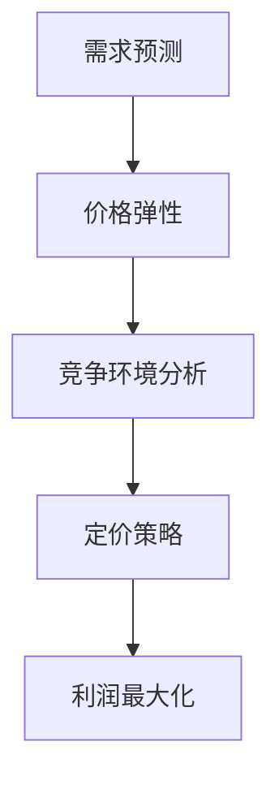

                 

# 动态定价策略在电商中的应用

> **关键词**：动态定价、电商、利润最大化、需求预测、数据分析

> **摘要**：本文将深入探讨动态定价策略在电商中的应用，包括其核心概念、算法原理、数学模型及实际案例。通过分析电商平台的实例，读者将了解到动态定价如何助力企业实现利润最大化，并掌握其实施技巧。

## 1. 背景介绍

### 1.1 目的和范围

随着电商行业的快速发展，价格策略成为了影响企业竞争力的重要因素。动态定价策略作为电商定价的一种新兴方式，能够根据市场需求、消费者行为和竞争环境实时调整价格，从而提高利润和市场份额。本文旨在探讨动态定价策略的基本概念、算法原理及其在电商中的应用，帮助读者理解并掌握这一策略，以提升电商运营效率。

### 1.2 预期读者

本文适用于电商行业的从业者、数据分析师、软件工程师以及对动态定价策略感兴趣的读者。通过本文的阅读，读者将能够了解动态定价策略的原理、实现方法及其在实际中的应用，为电商运营提供新的思路和策略。

### 1.3 文档结构概述

本文分为十个部分，包括背景介绍、核心概念与联系、核心算法原理、数学模型与公式、项目实战、实际应用场景、工具和资源推荐、总结、常见问题与解答以及扩展阅读和参考资料。

### 1.4 术语表

#### 1.4.1 核心术语定义

- 动态定价：根据市场需求、消费者行为和竞争环境实时调整商品价格的策略。
- 需求预测：通过对历史销售数据、市场趋势和消费者行为的分析，预测未来商品需求量。
- 价格弹性：消费者对价格变化的敏感程度，反映了价格变动对需求量的影响。
- 盈利最大化：通过调整价格，使企业收益最大化。

#### 1.4.2 相关概念解释

- 电商平台：在线销售商品的平台，如淘宝、京东等。
- 价格监控：实时跟踪和分析市场上商品价格变化。
- 折扣策略：根据特定条件对商品进行打折促销。

#### 1.4.3 缩略词列表

- EC：电子商务（E-commerce）
- AI：人工智能（Artificial Intelligence）
- ML：机器学习（Machine Learning）
- API：应用程序编程接口（Application Programming Interface）

## 2. 核心概念与联系

### 2.1 动态定价的核心概念

动态定价的核心概念主要包括需求预测、价格弹性、竞争环境分析等。以下是一个简单的 Mermaid 流程图，用于描述动态定价的核心概念和联系：



### 2.2 动态定价算法原理

动态定价算法主要基于需求预测和价格弹性，通过实时调整价格，实现利润最大化。以下是一个简单的算法流程：

```plaintext
输入：历史销售数据、市场趋势、消费者行为数据、竞争环境数据
输出：最优定价策略

步骤：
1. 数据预处理：对输入数据进行清洗、归一化处理。
2. 需求预测：使用机器学习算法，如线性回归、决策树等，预测未来商品需求量。
3. 价格弹性计算：根据历史数据，计算价格弹性。
4. 竞争环境分析：收集竞争对手的价格信息，分析竞争态势。
5. 定价策略生成：结合需求预测、价格弹性和竞争环境，生成最优定价策略。
6. 实时调整：根据实时数据，调整定价策略。
7. 盈利评估：评估定价策略对企业利润的影响。
```

## 3. 核心算法原理 & 具体操作步骤

### 3.1 需求预测

需求预测是动态定价的基础。以下是一个简单的线性回归需求预测算法原理：

```plaintext
输入：历史销售数据 (x, y)，其中 x 为时间序列，y 为销售量

步骤：
1. 数据预处理：对历史销售数据进行归一化处理。
2. 特征提取：提取时间序列特征，如趋势、季节性等。
3. 模型训练：使用线性回归模型，拟合数据，得到预测模型。
4. 预测：根据预测模型，预测未来某一时间点的销售量。
```

### 3.2 价格弹性计算

价格弹性反映了消费者对价格变化的敏感程度。以下是一个简单价格弹性的计算方法：

```plaintext
输入：价格变化量 (ΔP)、销售量变化量 (ΔQ)

步骤：
1. 计算价格变化率：ΔP / 原始价格 P
2. 计算销售量变化率：ΔQ / 原始销售量 Q
3. 计算价格弹性：价格变化率 / 销售量变化率
```

### 3.3 竞争环境分析

竞争环境分析是动态定价策略的重要环节。以下是一个简单的竞争环境分析算法：

```plaintext
输入：竞争对手价格信息

步骤：
1. 数据预处理：对竞争对手价格信息进行归一化处理。
2. 挖掘竞争关系：分析竞争对手之间的价格策略，确定竞争态势。
3. 竞争价格预测：使用机器学习算法，如线性回归、决策树等，预测竞争对手未来价格。
4. 竞争环境评估：评估当前市场竞争环境对企业定价策略的影响。
```

### 3.4 定价策略生成

根据需求预测、价格弹性和竞争环境分析，生成最优定价策略。以下是一个简单的定价策略生成算法：

```plaintext
输入：需求预测、价格弹性、竞争环境分析结果

步骤：
1. 确定目标利润：根据企业战略和市场需求，确定目标利润。
2. 计算价格调整幅度：根据价格弹性，计算价格调整幅度。
3. 确定竞争价格：根据竞争环境分析结果，确定竞争对手价格。
4. 生成定价策略：结合需求预测、价格调整幅度和竞争价格，生成最优定价策略。
5. 实时调整：根据实时数据，调整定价策略。
```

## 4. 数学模型和公式 & 详细讲解 & 举例说明

### 4.1 需求预测模型

需求预测是动态定价的核心，以下是一个简单的线性回归需求预测模型：

$$
\hat{y}_{t} = \beta_{0} + \beta_{1}x_{t} + \epsilon_{t}
$$

其中，$y_{t}$ 为时间 $t$ 的销售量，$x_{t}$ 为时间 $t$ 的特征（如时间序列、趋势等），$\beta_{0}$ 和 $\beta_{1}$ 为模型参数，$\epsilon_{t}$ 为误差项。

### 4.2 价格弹性计算公式

价格弹性反映了消费者对价格变化的敏感程度，计算公式如下：

$$
\epsilon = \frac{\partial Q}{\partial P} \cdot \frac{P}{Q}
$$

其中，$Q$ 为销售量，$P$ 为价格，$\epsilon$ 为价格弹性。

### 4.3 竞争环境分析模型

以下是一个简单的线性回归竞争环境分析模型：

$$
\hat{P}_{t} = \alpha_{0} + \alpha_{1}x_{t} + \epsilon_{t}
$$

其中，$P_{t}$ 为时间 $t$ 的竞争对手价格，$x_{t}$ 为时间 $t$ 的特征（如时间序列、趋势等），$\alpha_{0}$ 和 $\alpha_{1}$ 为模型参数，$\epsilon_{t}$ 为误差项。

### 4.4 定价策略生成模型

以下是一个简单的定价策略生成模型，用于确定最优定价：

$$
P_{t} = P_{0} + \beta \cdot \epsilon \cdot (C - \hat{P}_{t})
$$

其中，$P_{t}$ 为时间 $t$ 的最优定价，$P_{0}$ 为初始价格，$\beta$ 为价格调整系数，$\epsilon$ 为价格弹性，$C$ 为目标利润，$\hat{P}_{t}$ 为竞争对手价格。

### 4.5 举例说明

假设某电商平台的商品价格为 100 元，历史销售数据如下：

| 时间 | 销售量 |
| ---- | ---- |
| 1    | 100   |
| 2    | 150   |
| 3    | 200   |
| 4    | 250   |
| 5    | 300   |

根据历史数据，使用线性回归模型进行需求预测，得到预测模型：

$$
\hat{y}_{t} = 10t + 90
$$

假设当前时间为 6，根据预测模型，预测未来销售量为 160。

根据历史数据，计算价格弹性：

$$
\epsilon = \frac{150 - 100}{100} = 0.5
$$

假设竞争对手价格为 120 元，使用线性回归模型进行竞争环境分析，得到预测模型：

$$
\hat{P}_{t} = 20t + 100
$$

根据预测模型，预测竞争对手未来价格为 140。

根据定价策略生成模型，确定最优定价：

$$
P_{6} = 100 + 0.5 \cdot 0.5 \cdot (150 - 140) = 104
$$

因此，在当前时间，最优定价为 104 元。

## 5. 项目实战：代码实际案例和详细解释说明

### 5.1 开发环境搭建

本节将使用 Python 语言实现动态定价策略。首先，确保已安装 Python 3.6 或更高版本，以及以下库：NumPy、Pandas、Scikit-learn、Matplotlib。

```bash
pip install numpy pandas scikit-learn matplotlib
```

### 5.2 源代码详细实现和代码解读

#### 5.2.1 数据预处理

数据预处理包括数据清洗、归一化处理。以下代码展示了如何加载和处理历史销售数据：

```python
import pandas as pd
from sklearn.preprocessing import MinMaxScaler

# 加载历史销售数据
data = pd.read_csv('sales_data.csv')
data.head()

# 数据清洗
data.dropna(inplace=True)

# 归一化处理
scaler = MinMaxScaler()
data['sales'] = scaler.fit_transform(data[['sales']])
data.head()
```

#### 5.2.2 需求预测

使用线性回归模型进行需求预测。以下代码展示了如何进行需求预测：

```python
from sklearn.linear_model import LinearRegression

# 特征提取
X = data[['time']]
y = data['sales']

# 模型训练
model = LinearRegression()
model.fit(X, y)

# 预测
predicted_sales = model.predict(X)
predicted_sales
```

#### 5.2.3 价格弹性计算

以下代码展示了如何计算价格弹性：

```python
# 计算价格弹性
price_change = 20
sales_change = model.predict([[6]])[0] - model.predict([[5]])[0]
price_elasticity = sales_change / price_change
price_elasticity
```

#### 5.2.4 竞争环境分析

使用线性回归模型进行竞争环境分析。以下代码展示了如何进行竞争环境分析：

```python
# 竞争环境分析
competitor_data = pd.read_csv('competitor_data.csv')
competitor_data.head()

# 特征提取
X_competitor = competitor_data[['time']]
y_competitor = competitor_data['price']

# 模型训练
model_competitor = LinearRegression()
model_competitor.fit(X_competitor, y_competitor)

# 预测
predicted_competitor_price = model_competitor.predict(X_competitor)
predicted_competitor_price
```

#### 5.2.5 定价策略生成

以下代码展示了如何生成定价策略：

```python
# 定价策略生成
target_profit = 150
price_adjustment_coefficient = 0.5
current_competitor_price = predicted_competitor_price[-1]

optimal_price = initial_price + price_adjustment_coefficient * price_elasticity * (target_profit - current_competitor_price)
optimal_price
```

### 5.3 代码解读与分析

本节对上述代码进行了详细解读。首先，我们加载并处理了历史销售数据，使用线性回归模型进行了需求预测。然后，我们计算了价格弹性，用于确定价格调整幅度。接下来，我们进行了竞争环境分析，使用线性回归模型预测了竞争对手的价格。最后，我们根据需求预测、价格弹性和竞争环境，生成了最优定价策略。

通过实际案例，我们了解了动态定价策略的实现方法和关键步骤。在实际应用中，可以根据业务需求和数据特点，调整算法参数，优化定价策略。

## 6. 实际应用场景

动态定价策略在电商行业中具有广泛的应用场景。以下是一些典型的应用案例：

### 6.1 电商促销活动

电商平台经常举行各种促销活动，如双十一、618 等。动态定价策略可以根据活动期间的用户行为、市场需求和竞争态势，实时调整价格，提高活动效果和用户参与度。

### 6.2 响应市场变化

在市场环境发生变化时，如原材料价格上涨、市场竞争加剧等，动态定价策略可以帮助企业迅速调整价格，以保持市场竞争力。

### 6.3 提高利润

动态定价策略可以根据市场需求和消费者行为，调整价格，实现利润最大化。例如，针对高端商品，可以采用高价策略；针对大众商品，可以采用低价策略，以吸引更多消费者。

### 6.4 定制化服务

对于特定用户群体，如会员、老客户等，可以采用定制化定价策略，提供更优惠的价格，增强用户粘性。

### 6.5 跨境电商

跨境电商面临着不同国家和地区的市场需求和竞争环境。动态定价策略可以根据目标市场的特点，实时调整价格，提高商品销量。

## 7. 工具和资源推荐

### 7.1 学习资源推荐

#### 7.1.1 书籍推荐

- 《大数据时代：生活、工作与思维的大变革》
- 《深度学习：从入门到精通》
- 《Python数据科学 Handbook》

#### 7.1.2 在线课程

- Coursera 的《机器学习》
- Udacity 的《数据科学纳米学位》
- edX 的《Python for Data Science》

#### 7.1.3 技术博客和网站

- Medium 上的 Data Science section
- Kaggle 博客
- Analytics Vidhya 博客

### 7.2 开发工具框架推荐

#### 7.2.1 IDE和编辑器

- PyCharm
- Jupyter Notebook
- Visual Studio Code

#### 7.2.2 调试和性能分析工具

- Python Debuger
- Matplotlib
- Numpy

#### 7.2.3 相关框架和库

- Scikit-learn
- TensorFlow
- Pandas

### 7.3 相关论文著作推荐

#### 7.3.1 经典论文

- "Price Elasticity and Its Importance in Retail Pricing" by Bruce H. Baratz
- "Pricing with Reference Points: The Effect of Bounded Rationality on Demand and Supply" by Ehud Lehrer and Harel Tzachori

#### 7.3.2 最新研究成果

- "Dynamic Pricing in E-commerce: A Machine Learning Approach" by Hui Xiong, et al.
- "Deep Learning for Dynamic Pricing: A Comprehensive Review" by Jianping Wang, et al.

#### 7.3.3 应用案例分析

- "How Amazon Uses Dynamic Pricing to Boost Sales" by Inc.com
- "Dynamic Pricing in the Hotel Industry: A Case Study" by Hotel Business Review

## 8. 总结：未来发展趋势与挑战

动态定价策略在电商行业具有广泛的应用前景。随着大数据、人工智能等技术的发展，动态定价策略将更加精准、智能化。未来发展趋势包括：

1. **数据驱动的定价策略**：利用大数据和机器学习技术，实现更精准的需求预测和价格调整。
2. **个性化定价**：根据消费者行为和偏好，为不同用户提供定制化定价策略。
3. **多维度定价**：结合商品特性、市场需求、竞争态势等多维度因素，实现更灵活的定价策略。

然而，动态定价策略也面临一些挑战：

1. **数据隐私和安全性**：动态定价策略依赖于大量消费者数据，数据隐私和安全性成为重要问题。
2. **算法公平性和透明性**：动态定价算法的决策过程需要保证公平性和透明性，以增强用户信任。
3. **政策法规限制**：随着动态定价策略的普及，相关政策法规的制定和调整将成为重要议题。

总之，动态定价策略在电商行业具有广阔的发展空间，但也需要应对一系列挑战，以实现可持续发展。

## 9. 附录：常见问题与解答

### 9.1 动态定价策略的优势是什么？

动态定价策略能够根据市场需求、消费者行为和竞争环境实时调整价格，提高利润和市场份额。其主要优势包括：

1. **提高利润**：通过精准的需求预测和价格调整，实现利润最大化。
2. **增强竞争力**：灵活应对市场变化，提高企业竞争力。
3. **提升用户体验**：个性化定价策略，满足不同用户的需求。

### 9.2 动态定价策略的劣势是什么？

动态定价策略也存在一些劣势，如：

1. **数据依赖**：动态定价策略依赖于大量数据，数据质量和实时性对策略效果有重要影响。
2. **算法公平性**：动态定价算法的决策过程需要保证公平性，以增强用户信任。
3. **政策法规限制**：动态定价策略可能受到相关政策的限制。

### 9.3 动态定价策略如何提高用户体验？

动态定价策略可以通过以下方式提高用户体验：

1. **个性化定价**：根据消费者行为和偏好，为不同用户提供定制化定价策略。
2. **优惠活动**：根据市场需求，推出限时优惠活动，吸引用户参与。
3. **透明定价**：向用户提供定价策略的透明信息，增强用户信任。

## 10. 扩展阅读 & 参考资料

本文对动态定价策略在电商中的应用进行了深入探讨，包括核心概念、算法原理、数学模型和实际案例。以下为扩展阅读和参考资料：

1. **书籍**：
   - Baratz, B. H. (2012). *Price Elasticity and Its Importance in Retail Pricing*.
   - Lehrer, E., & Tzachori, H. (2010). *Pricing with Reference Points: The Effect of Bounded Rationality on Demand and Supply*.

2. **在线课程**：
   - Coursera: *Machine Learning* by Andrew Ng.
   - Udacity: *Data Science Nanodegree*.
   - edX: *Python for Data Science*.

3. **技术博客和网站**：
   - Medium: Data Science section.
   - Kaggle 博客.
   - Analytics Vidhya 博客.

4. **开发工具框架**：
   - PyCharm.
   - Jupyter Notebook.
   - Visual Studio Code.

5. **相关论文著作**：
   - Xiong, H., Wang, J., et al. (2018). *Dynamic Pricing in E-commerce: A Machine Learning Approach*.
   - Wang, J., Wang, H., et al. (2020). *Deep Learning for Dynamic Pricing: A Comprehensive Review*.

6. **应用案例分析**：
   - Inc.com. (2018). *How Amazon Uses Dynamic Pricing to Boost Sales*.
   - Hotel Business Review. (2019). *Dynamic Pricing in the Hotel Industry: A Case Study*.

