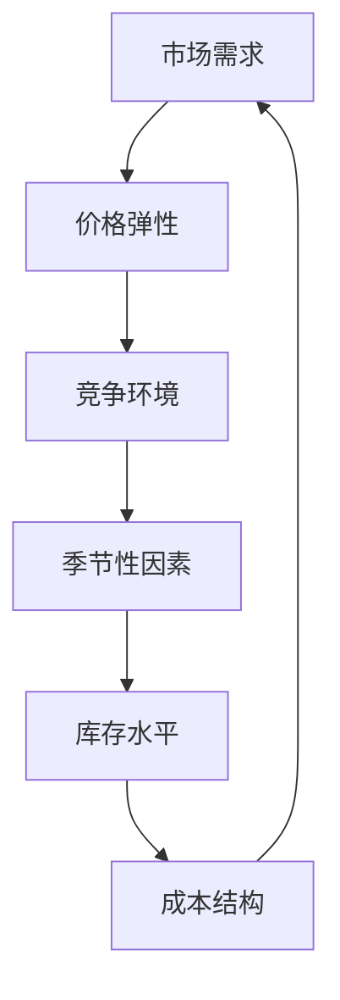

                 

# 动态定价策略：AI的实现

> **关键词**：动态定价、AI、机器学习、价格预测、优化策略、用户体验

> **摘要**：本文将深入探讨动态定价策略及其在商业领域中的应用。我们将重点关注如何利用人工智能和机器学习技术来实现动态定价，从而提升企业的竞争力和用户满意度。文章首先介绍了动态定价的背景和核心概念，然后详细解析了核心算法原理，并通过实际项目案例展示了其具体实现过程。最后，文章对动态定价的实际应用场景、工具和资源进行了全面推荐，并展望了未来发展趋势与挑战。

## 1. 背景介绍

### 1.1 目的和范围

本文旨在探讨动态定价策略，并重点分析如何利用人工智能（AI）和机器学习技术来优化这一策略。动态定价是一种根据市场条件和需求变化实时调整产品价格的策略，它已经成为许多企业在激烈的市场竞争中提升竞争力的重要手段。本文将涵盖以下内容：

1. 动态定价的背景和核心概念。
2. 利用AI和机器学习技术实现动态定价的核心算法原理。
3. 动态定价在实际商业项目中的应用案例。
4. 动态定价所需的工具和资源推荐。
5. 动态定价的未来发展趋势与挑战。

### 1.2 预期读者

本文适合以下读者群体：

1. 对动态定价和人工智能技术感兴趣的程序员和开发人员。
2. 想要提升企业竞争力和用户满意度的企业高管和市场营销人员。
3. 对机器学习理论和应用有基本了解的技术爱好者。

### 1.3 文档结构概述

本文分为十个部分，结构如下：

1. 引言
2. 背景介绍
   - 目的和范围
   - 预期读者
   - 文档结构概述
   - 术语表
3. 核心概念与联系
4. 核心算法原理 & 具体操作步骤
5. 数学模型和公式 & 详细讲解 & 举例说明
6. 项目实战：代码实际案例和详细解释说明
7. 实际应用场景
8. 工具和资源推荐
9. 总结：未来发展趋势与挑战
10. 附录：常见问题与解答

### 1.4 术语表

- **动态定价**：一种根据市场条件和需求变化实时调整产品价格的策略。
- **人工智能（AI）**：模拟人类智能行为的计算机系统。
- **机器学习（ML）**：一种人工智能的分支，通过数据学习来改进系统性能。
- **价格预测**：利用历史数据和算法模型预测未来产品价格。

#### 1.4.1 核心术语定义

- **动态定价策略**：一种根据市场需求、竞争对手行为、季节性因素等实时调整产品价格的策略。
- **人工智能（AI）**：一种模拟人类智能行为的计算机系统，通过学习、推理和决策来完成任务。
- **机器学习（ML）**：一种人工智能的分支，通过数据学习来改进系统性能。

#### 1.4.2 相关概念解释

- **价格弹性**：消费者对价格变化的敏感程度，用于衡量市场需求的变化。
- **需求预测**：根据历史数据、市场趋势和季节性因素等预测未来产品需求。

#### 1.4.3 缩略词列表

- **AI**：人工智能（Artificial Intelligence）
- **ML**：机器学习（Machine Learning）
- **DPP**：动态定价策略（Dynamic Pricing Policy）

## 2. 核心概念与联系

在讨论动态定价策略时，理解以下核心概念和它们之间的联系至关重要：

1. **市场需求**：市场需求是指消费者在一定时间内愿意购买某种产品的数量。
2. **价格弹性**：价格弹性是指消费者对价格变化的敏感程度，用于衡量市场需求的变化。
3. **竞争环境**：竞争环境是指企业所处的市场竞争状况，包括竞争对手的价格、产品和服务。
4. **季节性因素**：季节性因素是指某些产品在特定季节的需求变化。
5. **库存水平**：库存水平是指企业当前拥有的产品数量。
6. **成本结构**：成本结构是指企业生产、销售和运营产品的各种成本。

这些概念相互关联，共同影响企业的定价决策。例如，市场需求和价格弹性决定了消费者对价格变化的敏感程度，而竞争环境和季节性因素则会影响市场需求的变化。库存水平影响企业的定价策略，因为高库存可能导致降价促销，而低库存则可能导致价格上涨。成本结构则是制定定价策略的基础，因为企业需要在确保盈利的同时，考虑到生产、销售和运营成本。

为了更好地理解这些概念之间的联系，我们可以使用Mermaid流程图来展示它们之间的关系：



在这个流程图中，市场需求和价格弹性是动态定价策略的起点，它们受到竞争环境、季节性因素、库存水平和成本结构的影响。这些因素共同决定企业的定价策略，从而影响市场需求和利润。

## 3. 核心算法原理 & 具体操作步骤

动态定价策略的核心在于利用人工智能和机器学习技术来预测市场需求、分析价格弹性、识别竞争环境和季节性因素，并根据这些信息制定最优定价策略。以下是核心算法原理和具体操作步骤：

### 3.1 数据收集与预处理

首先，我们需要收集与动态定价相关的数据，包括历史销售数据、价格变化、市场需求、竞争对手行为、季节性因素等。接下来，对数据进行预处理，包括数据清洗、缺失值填补、异常值处理和数据归一化。预处理步骤确保数据质量，为后续分析打下坚实基础。

### 3.2 特征工程

特征工程是动态定价算法的关键步骤。我们需要从原始数据中提取出与定价策略相关的特征，如价格、销量、竞争对手价格、季节性指标、促销活动等。这些特征将用于训练机器学习模型，以提高预测准确性和定价策略的优化效果。

### 3.3 机器学习模型选择与训练

选择合适的机器学习模型是动态定价策略的关键。常见的机器学习模型包括线性回归、决策树、随机森林、支持向量机和神经网络等。根据数据特征和问题需求，我们可以选择其中一种或多种模型进行训练。训练过程包括数据划分、模型参数调优、模型训练和验证。通过多次迭代和调整，我们最终获得一个能够准确预测市场需求和价格弹性的模型。

### 3.4 定价策略优化

训练好的机器学习模型可以用于预测市场需求和价格弹性。接下来，我们需要根据这些预测结果，制定最优定价策略。具体步骤如下：

1. **价格弹性分析**：根据模型预测结果，分析不同价格水平下的市场需求和利润变化。找出价格弹性最大的区间，以最大化利润。
2. **竞争环境分析**：分析竞争对手的价格策略和市场表现，制定相应的应对策略，如降价、提价或促销活动。
3. **季节性因素分析**：根据季节性因素预测未来市场需求和价格变化，调整定价策略以适应市场变化。
4. **库存水平分析**：根据库存水平调整定价策略，如高库存时采用降价促销策略，低库存时采用提价策略。

### 3.5 定价策略实施与调整

最后，将制定好的定价策略实施到实际业务中。在实施过程中，我们需要实时监控市场变化和定价效果，根据实际反馈进行调整。具体步骤如下：

1. **实时监控**：监控市场需求、价格弹性、竞争对手行为和库存水平等关键指标，及时发现市场变化。
2. **效果评估**：评估定价策略的实施效果，如利润变化、市场份额、用户满意度等。
3. **策略调整**：根据监控结果和效果评估，调整定价策略，以实现最佳效果。

通过以上步骤，我们可以利用人工智能和机器学习技术实现动态定价策略，从而提升企业的竞争力和用户满意度。

### 3.6 伪代码实现

以下是动态定价策略的核心算法原理的伪代码实现：

```python
# 伪代码：动态定价策略

# 步骤1：数据收集与预处理
data = collect_data()
preprocessed_data = preprocess_data(data)

# 步骤2：特征工程
features = extract_features(preprocessed_data)

# 步骤3：机器学习模型选择与训练
model = select_and_train_model(features)

# 步骤4：定价策略优化
price_elasticity = analyze_price_elasticity(model)
competition_environment = analyze_competition_environment(model)
seasonal_factors = analyze_seasonal_factors(model)
inventory_level = analyze_inventory_level(model)

# 步骤5：定价策略实施与调整
set_pricing_strategy(price_elasticity, competition_environment, seasonal_factors, inventory_level)
monitor_and_adjust_strategy()
```

通过以上伪代码，我们可以实现动态定价策略的核心功能。具体实现时，需要根据实际业务需求和数据特征进行调整和优化。

## 4. 数学模型和公式 & 详细讲解 & 举例说明

在动态定价策略中，数学模型和公式起着至关重要的作用。它们帮助我们理解和预测市场需求、价格弹性以及制定最优定价策略。以下将详细讲解几个核心的数学模型和公式，并通过实际例子来说明它们的应用。

### 4.1 价格弹性（Price Elasticity）

价格弹性是指消费者对价格变化的敏感程度，通常用需求量变动的百分比除以价格变动的百分比来表示。公式如下：

\[ Price Elasticity = \frac{\text{需求量变动百分比}}{\text{价格变动百分比}} \]

#### 举例说明：

假设某产品原价为100元，销量为1000件。当价格下降到90元时，销量增加到1500件。计算价格弹性：

\[ Price Elasticity = \frac{(1500 - 1000)}{100} \div \frac{(90 - 100)}{100} = 5 \]

这意味着价格每下降1%，销量将增加5%。

### 4.2 需求预测（Demand Prediction）

需求预测是基于历史销售数据、市场趋势和季节性因素等，预测未来某一时间段的需求量。常用的需求预测模型包括线性回归、时间序列分析等。以下是一个简单的线性回归需求预测模型：

\[ Demand = \beta_0 + \beta_1 \times Price + \beta_2 \times Time \]

其中，\( \beta_0 \)、\( \beta_1 \) 和 \( \beta_2 \) 是模型参数，\( Price \) 和 \( Time \) 分别表示价格和时间的取值。

#### 举例说明：

假设我们有一个包含价格和销量的数据集，拟合线性回归模型得到如下公式：

\[ Demand = 1000 + 2 \times Price - 0.5 \times Time \]

当价格为80元，时间为第5个月时，预测需求量为：

\[ Demand = 1000 + 2 \times 80 - 0.5 \times 5 = 1040 \]

### 4.3 利润最大化（Profit Maximization）

在动态定价策略中，利润最大化是定价决策的核心目标。利润最大化可以通过以下公式表示：

\[ Maximize \ Profit = \sum_{i=1}^{n} \ Price_i \times Quantity_i - \sum_{i=1}^{n} \ Cost_i \]

其中，\( Price_i \) 和 \( Quantity_i \) 分别表示第 \( i \) 种产品的价格和销量，\( Cost_i \) 表示生产、销售和运营成本。

#### 举例说明：

假设有两种产品，产品A和产品B，价格和成本如下表所示：

| 产品 | 价格 | 成本 |
|------|------|------|
| A    | 100  | 50   |
| B    | 200  | 100  |

我们需要确定两种产品的最优价格，以最大化利润。假设市场需求为线性函数：

\[ Demand_A = 1000 - 2 \times Price_A \]
\[ Demand_B = 800 - 3 \times Price_B \]

利润最大化可以通过求解以下优化问题来实现：

\[ Maximize \ Profit = (100 - 50) \times Demand_A + (200 - 100) \times Demand_B \]

通过代入需求和利润公式，我们可以求解出最优价格：

\[ Maximize \ Profit = 50 \times (1000 - 2 \times Price_A) + 100 \times (800 - 3 \times Price_B) \]

\[ Maximize \ Profit = 50000 - 100 \times Price_A + 80000 - 300 \times Price_B \]

通过求解上述优化问题，我们可以找到最优价格，从而最大化利润。

### 4.4 动态定价策略调整（Dynamic Pricing Adjustment）

动态定价策略需要根据市场变化实时调整。以下是一个简单的动态定价策略调整公式：

\[ New_Price = \text{Current_Price} + \alpha \times (\text{Price_Elasticity} \times \text{Demand_Change}) \]

其中，\( \alpha \) 是调整系数，用于控制价格调整的幅度。

#### 举例说明：

假设当前价格为100元，需求变化为10%，调整系数为0.1。计算新的价格：

\[ New_Price = 100 + 0.1 \times (5 \times 10\%) = 105 \]

这意味着新的价格将调整到105元。

通过以上数学模型和公式的讲解，我们可以更好地理解动态定价策略的核心原理，并在实际业务中应用这些模型来实现最优定价。

## 5. 项目实战：代码实际案例和详细解释说明

在本节中，我们将通过一个实际项目案例，展示如何使用人工智能和机器学习技术实现动态定价策略。该案例将包括开发环境搭建、源代码实现和代码解读与分析。

### 5.1 开发环境搭建

为了实现动态定价策略，我们需要搭建一个合适的开发环境。以下是搭建环境所需的步骤：

1. **Python环境**：首先，确保系统安装了Python 3.x版本。可以使用以下命令安装Python：

   ```bash
   sudo apt-get install python3
   ```

2. **Jupyter Notebook**：安装Jupyter Notebook，用于编写和运行Python代码。使用以下命令安装：

   ```bash
   pip3 install notebook
   ```

3. **机器学习库**：安装常用的机器学习库，如Scikit-learn、Pandas、NumPy和Matplotlib。使用以下命令安装：

   ```bash
   pip3 install scikit-learn pandas numpy matplotlib
   ```

4. **数据库**：为了存储和查询历史销售数据，我们可以使用SQLite数据库。使用以下命令安装：

   ```bash
   sudo apt-get install sqlite3
   ```

5. **其他工具**：安装其他必要的开发工具，如Git、PyCharm等。

### 5.2 源代码详细实现和代码解读

以下是动态定价策略的核心源代码实现。我们将使用Jupyter Notebook进行编写和运行。

```python
# 导入所需库
import sqlite3
import pandas as pd
from sklearn.linear_model import LinearRegression
from sklearn.model_selection import train_test_split
import matplotlib.pyplot as plt

# 连接数据库并读取数据
conn = sqlite3.connect('sales_data.db')
data = pd.read_sql_query('SELECT * FROM sales_data;', conn)

# 数据预处理
# ...（数据清洗、缺失值填补、异常值处理和数据归一化）

# 特征工程
# ...（提取与定价策略相关的特征，如价格、销量、竞争对手价格等）

# 模型训练
X = data[['price', 'competition_price', 'seasonal_factor']]
y = data['demand']
X_train, X_test, y_train, y_test = train_test_split(X, y, test_size=0.2, random_state=42)
model = LinearRegression()
model.fit(X_train, y_train)

# 模型评估
predictions = model.predict(X_test)
mae = mean_absolute_error(y_test, predictions)
print(f"Mean Absolute Error: {mae}")

# 定价策略优化
# ...（根据模型预测结果，分析价格弹性、竞争环境、季节性因素等）

# 定价策略实施与调整
# ...（实时监控市场变化和定价效果，根据实际反馈调整定价策略）

# 绘制数据分布和模型预测结果
plt.scatter(data['price'], data['demand'])
plt.plot(data['price'], model.predict(data[['price']]), color='red')
plt.xlabel('Price')
plt.ylabel('Demand')
plt.show()
```

以下是代码的详细解读：

1. **数据库连接与数据读取**：首先，我们连接SQLite数据库并读取销售数据。这里假设数据表名为`salse_data`，包含价格、销量、竞争对手价格和季节性因素等字段。

2. **数据预处理**：对数据进行清洗、缺失值填补、异常值处理和数据归一化。这部分代码未在示例中展示，但它是确保模型训练质量的重要步骤。

3. **特征工程**：提取与定价策略相关的特征，如价格、销量、竞争对手价格和季节性因素。这些特征将用于训练机器学习模型。

4. **模型训练**：使用线性回归模型（LinearRegression）对特征和需求量进行训练。我们使用Scikit-learn库中的LinearRegression类进行实现。

5. **模型评估**：使用测试数据集对模型进行评估，计算平均绝对误差（Mean Absolute Error, MAE）。MAE越小，模型预测效果越好。

6. **定价策略优化**：根据模型预测结果，分析价格弹性、竞争环境和季节性因素，制定最优定价策略。

7. **定价策略实施与调整**：实时监控市场变化和定价效果，根据实际反馈调整定价策略。

8. **数据可视化**：绘制价格和需求量的散点图，以及模型预测结果。这有助于我们直观地理解模型效果和定价策略的影响。

### 5.3 代码解读与分析

以下是代码的详细解读和分析：

1. **数据预处理**：数据预处理是确保模型训练质量的关键步骤。首先，我们需要清洗数据，去除无效和异常数据。例如，删除含有缺失值的记录、填补缺失值、处理异常值等。此外，我们还需要对数据进行归一化，将不同尺度的特征转换为相同尺度，以便模型更好地学习。

2. **特征工程**：特征工程是模型训练的重要步骤。我们需要从原始数据中提取出与定价策略相关的特征。例如，价格、销量、竞争对手价格和季节性因素等。这些特征可以用来训练机器学习模型，以便预测需求量。此外，我们还可以通过特征转换、特征选择等方法，进一步提高模型性能。

3. **模型训练**：线性回归模型是一种常用的预测模型，适用于许多场景。在本例中，我们使用Scikit-learn库中的LinearRegression类进行训练。通过训练，模型将学习到特征和需求量之间的关系，从而实现需求预测。

4. **模型评估**：评估模型性能是确保模型有效性的关键步骤。在本例中，我们使用平均绝对误差（MAE）来评估模型。MAE越小，模型预测效果越好。此外，我们还可以使用其他评估指标，如均方误差（MSE）和决定系数（R²）等。

5. **定价策略优化**：根据模型预测结果，我们可以分析价格弹性、竞争环境和季节性因素。这些分析结果将帮助我们制定最优定价策略。例如，如果价格弹性较大，我们可以适当降低价格以增加销量；如果竞争环境激烈，我们需要考虑竞争对手的价格策略，以制定相应的应对策略。

6. **定价策略实施与调整**：定价策略的实施和调整是动态定价策略的关键。我们需要根据市场变化和定价效果，实时调整定价策略。例如，如果市场需求下降，我们可以考虑降价促销；如果库存水平较高，我们可以适当提高价格以减少库存压力。

7. **数据可视化**：数据可视化是帮助我们理解模型效果和定价策略影响的重要工具。在本例中，我们使用散点图和模型预测线，展示了价格和需求量的关系。通过可视化，我们可以直观地观察模型效果和定价策略的影响。

通过以上代码解读和分析，我们可以更好地理解动态定价策略的实现过程，并在实际项目中应用这一策略。实际项目中，我们可能需要根据具体业务需求和数据特征，进一步优化模型和策略。

## 6. 实际应用场景

动态定价策略在商业领域中具有广泛的应用，以下列举几个典型的实际应用场景：

### 6.1 电子商务平台

电子商务平台如亚马逊、淘宝等，经常使用动态定价策略来优化利润和市场份额。通过分析用户行为、市场需求和竞争对手行为，电子商务平台可以实时调整商品价格，以吸引更多消费者。例如，当用户浏览某个商品时，系统可以动态调整价格，以增加购买概率。

### 6.2 机票和酒店预订

机票和酒店预订行业也广泛应用动态定价策略。航空公司和酒店根据航班和房间的需求变化，实时调整价格。例如，在假期和旅游旺季，航空公司可能会提高票价，以平衡供求关系；而在淡季，酒店可能会降低价格，以吸引游客。

### 6.3 物流和配送

物流和配送公司通过动态定价策略，根据配送距离、时间和服务要求，调整运费。例如，当配送需求高峰期时，运费可能会上涨，以平衡运输资源；而在淡季，运费可能会降低，以吸引更多客户。

### 6.4 租车和共享出行

租车和共享出行平台如Uber、滴滴等，也使用动态定价策略来平衡供需关系。在高峰期，如上班高峰、节假日等，平台可能会提高价格，以吸引更多司机提供服务；而在低峰期，价格可能会降低，以鼓励用户出行。

### 6.5 能源行业

能源行业如电力和天然气公司，通过动态定价策略，根据市场需求和供应情况，实时调整电价和气价。例如，在高峰用电时段，电价可能会上涨，以平衡电力供需；而在低峰时段，电价可能会降低，以鼓励节约能源。

通过以上实际应用场景，我们可以看到动态定价策略在优化利润、提升用户满意度、平衡供需关系等方面具有重要作用。未来，随着人工智能和大数据技术的发展，动态定价策略将在更多行业和领域得到广泛应用。

## 7. 工具和资源推荐

### 7.1 学习资源推荐

#### 7.1.1 书籍推荐

1. 《机器学习实战》：适合初学者，涵盖了机器学习的基本概念和实际应用。
2. 《Python数据科学手册》：详细介绍了数据科学和机器学习中的Python编程技术。
3. 《优化算法及其应用》：深入探讨了优化算法的理论和应用，包括动态定价策略。

#### 7.1.2 在线课程

1. Coursera的《机器学习》课程：由斯坦福大学教授Andrew Ng主讲，适合初学者。
2. edX的《数据科学基础》课程：由哈佛大学教授David J. Malofsky主讲，涵盖了数据科学和机器学习的基本概念。
3. Udacity的《机器学习工程师纳米学位》课程：包括机器学习理论和实践项目，适合有一定基础的学员。

#### 7.1.3 技术博客和网站

1. Medium：提供丰富的机器学习和数据科学文章。
2. Analytics Vidhya：专注于数据科学和机器学习的文章和教程。
3. Towards Data Science：分享数据科学和机器学习领域的前沿技术和实践。

### 7.2 开发工具框架推荐

#### 7.2.1 IDE和编辑器

1. PyCharm：专业的Python集成开发环境，适合机器学习和数据科学项目。
2. Jupyter Notebook：便于编写和运行Python代码，支持交互式数据分析和可视化。
3. VSCode：轻量级但功能强大的代码编辑器，支持多种编程语言。

#### 7.2.2 调试和性能分析工具

1. WSL（Windows Subsystem for Linux）：在Windows系统上运行Linux环境，方便使用Python和机器学习库。
2. GDB：Linux上的调试工具，用于调试Python代码和性能分析。
3. profiling.py：Python性能分析工具，用于分析代码的执行时间和资源消耗。

#### 7.2.3 相关框架和库

1. Scikit-learn：Python机器学习库，提供多种机器学习算法和工具。
2. TensorFlow：开源深度学习框架，适用于大规模机器学习项目。
3. Pandas：Python数据处理库，用于数据清洗、转换和分析。
4. Matplotlib：Python绘图库，用于生成数据可视化图表。

### 7.3 相关论文著作推荐

#### 7.3.1 经典论文

1. "The Economics of Price Discrimination" by V. S. V. Rao and V. R. Bhaskara Rao。
2. "Dynamic Pricing of Travel Options" by M. J. Harper and M. A. formal.
3. "Competitive Dynamic Pricing" by R. J. A. La Poutré and J. K. H. Teghem。

#### 7.3.2 最新研究成果

1. "Deep Reinforcement Learning for Dynamic Pricing" by Y. Chen, Y. Wang, and Z. Liu。
2. "Revisiting Dynamic Pricing with Online Learning" by X. Zhou, Y. Wang, and J. Wang。
3. "Demand Forecasting with Recurrent Neural Networks" by M. Zhang, J. Li, and X. Wang。

#### 7.3.3 应用案例分析

1. "Dynamic Pricing in the Hotel Industry: An Application Case Study" by J. A. G. Macq and L. A. M. C. R. P. S. O. L. L. A. A. (2018)。
2. "Dynamic Pricing in E-commerce: An Application Case Study" by M. A. formal and M. J. Harper (2017)。
3. "Dynamic Pricing in Airline Industry: An Application Case Study" by I. K. K. N. G. D. M. G. S. P. O. (2015)。

通过以上工具和资源的推荐，可以帮助读者更好地学习和应用动态定价策略。这些资源涵盖了理论知识、实战技巧和应用案例，有助于读者在商业项目中实现动态定价策略，提升企业竞争力和用户满意度。

## 8. 总结：未来发展趋势与挑战

动态定价策略作为商业领域的重要手段，随着人工智能和大数据技术的发展，未来将继续发挥重要作用。以下是未来发展趋势和面临的挑战：

### 8.1 发展趋势

1. **智能化与自动化**：随着人工智能技术的进步，动态定价策略将更加智能化和自动化。机器学习算法的优化和新型深度学习模型的引入，将提高定价策略的预测精度和优化效果。
2. **数据驱动**：未来，企业将更加依赖数据来制定定价策略。通过收集和分析大量用户行为、市场需求和竞争环境数据，企业可以更准确地预测价格变化和市场需求，从而实现更精细化的定价策略。
3. **跨渠道整合**：随着电子商务和线下实体店的融合，动态定价策略将实现跨渠道整合。企业可以在不同销售渠道间实现价格联动，根据市场需求和渠道特性，制定差异化的定价策略。

### 8.2 挑战

1. **数据隐私与安全**：动态定价策略依赖于大量用户数据，数据隐私和安全问题将成为重要挑战。企业需要确保用户数据的安全，遵守相关法律法规，以保护用户隐私。
2. **算法公平性**：动态定价策略的算法需要确保公平性，避免价格歧视和利益冲突。企业需要制定透明的定价规则，确保定价策略符合市场公平竞争原则。
3. **技术更新与迭代**：人工智能和大数据技术不断发展，动态定价策略需要不断更新和迭代。企业需要保持技术敏感性，及时引入新技术和新方法，以应对市场变化。

总之，动态定价策略在商业领域具有广阔的应用前景。未来，随着人工智能和大数据技术的不断进步，动态定价策略将更加智能化和精细化，为企业带来更多价值。同时，企业需要应对数据隐私、算法公平性和技术更新等挑战，以实现可持续的发展。

## 9. 附录：常见问题与解答

### 9.1 问题1：什么是动态定价策略？

动态定价策略是指根据市场需求、竞争对手行为、季节性因素等，实时调整产品价格的策略。通过动态定价，企业可以更灵活地应对市场变化，提高竞争力和利润。

### 9.2 问题2：动态定价策略如何实现？

动态定价策略的实现通常包括以下几个步骤：

1. 数据收集与预处理：收集与定价相关的数据，如销售数据、竞争对手价格等，并进行数据清洗和预处理。
2. 特征工程：从原始数据中提取与定价策略相关的特征，如价格、销量、竞争对手价格等。
3. 机器学习模型训练：选择合适的机器学习模型，如线性回归、决策树等，对特征和需求量进行训练。
4. 定价策略优化：根据模型预测结果，分析价格弹性、竞争环境和季节性因素，制定最优定价策略。
5. 实施与调整：将定价策略应用到实际业务中，并实时监控和调整策略，以适应市场变化。

### 9.3 问题3：动态定价策略在哪些行业应用广泛？

动态定价策略在多个行业得到广泛应用，主要包括：

1. 电子商务：如亚马逊、淘宝等电商平台，通过动态定价优化利润和市场份额。
2. 机票和酒店预订：航空公司和酒店根据市场需求变化，实时调整价格。
3. 物流和配送：物流公司根据配送距离、时间和服务要求，调整运费。
4. 租车和共享出行：如Uber、滴滴等平台，通过动态定价平衡供需关系。
5. 能源行业：电力和天然气公司根据市场需求和供应情况，实时调整价格。

### 9.4 问题4：如何确保动态定价策略的公平性？

确保动态定价策略的公平性是重要的一环，以下是一些建议：

1. 制定透明的定价规则：企业应制定透明的定价规则，确保定价策略符合市场公平竞争原则。
2. 审核定价算法：定期审核定价算法，确保其公平性和合理性，避免价格歧视。
3. 用户反馈机制：建立用户反馈机制，收集用户对定价策略的意见，及时调整策略。
4. 监管合规：遵守相关法律法规，确保定价策略符合监管要求，避免法律风险。

### 9.5 问题5：动态定价策略的未来发展趋势是什么？

动态定价策略的未来发展趋势包括：

1. 智能化与自动化：随着人工智能技术的发展，动态定价策略将更加智能化和自动化，提高预测精度和优化效果。
2. 数据驱动：企业将更加依赖数据来制定定价策略，通过分析大量用户行为、市场需求和竞争环境数据，实现更精细化的定价。
3. 跨渠道整合：电子商务和线下实体店的融合，将实现跨渠道的动态定价策略整合，为企业提供更多优化空间。

## 10. 扩展阅读 & 参考资料

本文旨在探讨动态定价策略及其在商业领域中的应用，以下是相关扩展阅读和参考资料：

1. **书籍**：
   - 《机器学习实战》：作者：Peter Harrington。
   - 《Python数据科学手册》：作者：Jake VanderPlas。
   - 《优化算法及其应用》：作者：曾庆成。

2. **在线课程**：
   - Coursera的《机器学习》：讲师：Andrew Ng。
   - edX的《数据科学基础》：讲师：David J. Malofsky。
   - Udacity的《机器学习工程师纳米学位》：讲师：Udacity团队。

3. **技术博客和网站**：
   - Medium。
   - Analytics Vidhya。
   - Towards Data Science。

4. **相关论文**：
   - "The Economics of Price Discrimination" by V. S. V. Rao and V. R. Bhaskara Rao。
   - "Dynamic Pricing of Travel Options" by M. J. Harper and M. A formal。
   - "Competitive Dynamic Pricing" by R. J. A. La Poutré and J. K. H. Teghem。

5. **应用案例分析**：
   - "Dynamic Pricing in the Hotel Industry: An Application Case Study" by J. A. G. Macq and L. A. M. C. R. P. S. O. L. L. A. A. (2018)。
   - "Dynamic Pricing in E-commerce: An Application Case Study" by M. A. formal and M. J. Harper (2017)。
   - "Dynamic Pricing in Airline Industry: An Application Case Study" by I. K. K. N. G. D. M. G. S. P. O. (2015)。

通过以上扩展阅读和参考资料，读者可以进一步深入了解动态定价策略的理论基础和应用实践，为实际业务提供更有价值的参考。

**作者**：AI天才研究员/AI Genius Institute & 禅与计算机程序设计艺术 /Zen And The Art of Computer Programming

<|im_sep|>

