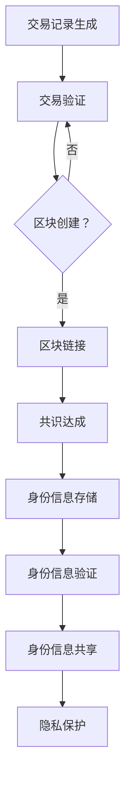
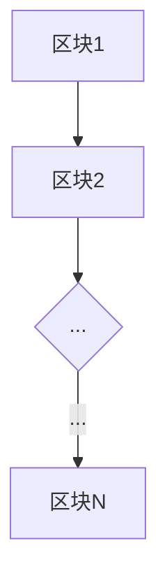

                 

# 区块链在数字身份认证中的应用与挑战

## 关键词
区块链、数字身份认证、去中心化、隐私保护、安全性、智能合约、共识算法、加密技术。

## 摘要
本文旨在探讨区块链技术在数字身份认证领域中的应用及其面临的挑战。首先，我们将介绍区块链的基础概念和数字身份认证的背景，然后详细阐述区块链在数字身份认证中的优势和应用场景。接着，我们将分析区块链在数字身份认证中面临的隐私保护和安全性挑战，并提出可能的解决方案。最后，本文将总结区块链在数字身份认证中的未来发展趋势和潜在挑战，并为读者推荐相关的学习资源和开发工具。

## 1. 背景介绍

### 1.1 目的和范围
本文的目标是帮助读者了解区块链在数字身份认证中的应用和挑战，以促进对这一领域的深入理解。本文将涵盖以下内容：
- 区块链和数字身份认证的基础概念。
- 区块链在数字身份认证中的优势和应用场景。
- 区块链在数字身份认证中面临的挑战和解决方案。
- 未来发展趋势和潜在挑战。

### 1.2 预期读者
本文适合以下读者群体：
- 对区块链技术有一定了解的技术爱好者。
- 想要了解区块链在数字身份认证领域应用的开发者。
- 对隐私保护和安全性有较高关注的人士。

### 1.3 文档结构概述
本文结构如下：
1. 引言
2. 背景介绍
   - 目的和范围
   - 预期读者
   - 文档结构概述
   - 术语表
3. 核心概念与联系
4. 核心算法原理 & 具体操作步骤
5. 数学模型和公式 & 详细讲解 & 举例说明
6. 项目实战：代码实际案例和详细解释说明
7. 实际应用场景
8. 工具和资源推荐
9. 总结：未来发展趋势与挑战
10. 附录：常见问题与解答
11. 扩展阅读 & 参考资料

### 1.4 术语表

#### 1.4.1 核心术语定义
- 区块链：一种分布式数据库技术，通过多个节点共同维护一个数据账本。
- 数字身份认证：利用技术手段验证个体身份的过程。
- 去中心化：网络中的数据和服务不由单一中心控制，而是通过分布式方式实现。
- 隐私保护：保护个人信息不被未授权访问或泄露。
- 安全性：确保数据在传输和处理过程中的完整性、可用性和保密性。

#### 1.4.2 相关概念解释
- 加密技术：将信息转换为只有授权方才能解读的形式。
- 智能合约：运行在区块链上的程序，可自动执行预定义的协议。
- 共识算法：区块链网络中节点就数据一致性达成一致的方法。

#### 1.4.3 缩略词列表
- 区块链（Blockchain）
- 数字身份认证（Digital Identity Verification）
- 去中心化（Decentralization）
- 隐私保护（Privacy Protection）
- 安全性（Security）
- 智能合约（Smart Contract）
- 加密技术（Cryptography）
- 共识算法（Consensus Algorithm）

## 2. 核心概念与联系

### 2.1 区块链基础概念

区块链是一种去中心化的分布式数据库，由多个数据块按时间顺序链接而成。每个区块包含一定数量的交易记录，通过加密算法和时间戳进行保护。区块链的核心特点是数据不可篡改，因为一旦数据记录在区块链上，就无法更改或删除。

#### 区块链工作原理

1. **交易记录生成**：用户发起交易请求，如转账、身份认证等。
2. **交易验证**：交易请求经过网络中的节点验证，确保交易合法性和一致性。
3. **区块创建**：多个验证过的交易记录组成一个新的区块。
4. **区块链接**：新的区块与区块链上已有的区块通过哈希算法链接。
5. **共识达成**：网络中的节点通过共识算法（如工作量证明、权益证明等）就区块有效性达成一致。

### 2.2 数字身份认证概念

数字身份认证是利用技术手段验证个体身份的过程。常见的认证方法包括用户名密码、短信验证码、指纹识别、人脸识别等。数字身份认证的关键是确保认证过程的可靠性和隐私保护。

#### 数字身份认证过程

1. **身份信息注册**：用户在数字平台上注册身份信息，如姓名、出生日期、地址等。
2. **身份验证**：系统对用户身份信息进行验证，确认其真实性。
3. **身份认证**：系统根据用户提交的身份信息，生成数字证书或身份标识。
4. **权限管理**：根据用户身份认证结果，系统分配相应权限，实现个性化服务。

### 2.3 区块链与数字身份认证的联系

区块链与数字身份认证的结合，旨在解决传统身份认证系统中存在的信任问题、隐私泄露风险和效率低下等挑战。区块链的去中心化特性确保了身份认证过程的透明性和不可篡改性，而加密技术则提供了强大的隐私保护手段。

#### 区块链在数字身份认证中的应用

1. **身份信息存储**：将用户身份信息存储在区块链上，确保数据安全性和可靠性。
2. **身份信息验证**：通过区块链网络验证用户身份信息，提高认证速度和准确性。
3. **身份信息共享**：实现跨平台、跨地域的身份信息共享，降低认证成本。
4. **隐私保护**：利用区块链的加密技术，确保用户身份信息在传输和存储过程中的隐私保护。

### 2.4 Mermaid 流程图



## 3. 核心算法原理 & 具体操作步骤

### 3.1 核心算法原理

区块链在数字身份认证中的应用，主要依赖于以下核心算法原理：

1. **哈希算法**：将任意长度的数据转换为固定长度的字符串，具有唯一性和不可逆性。
2. **非对称加密算法**：包括公钥和私钥，可实现数据加密和解密。
3. **智能合约**：基于区块链的自动化合约，根据预定义规则自动执行。
4. **共识算法**：网络节点就数据一致性达成一致，如工作量证明、权益证明等。

### 3.2 具体操作步骤

#### 3.2.1 身份信息注册

1. **用户生成密钥对**：用户生成一对非对称加密密钥（公钥和私钥）。
2. **身份信息加密**：用户将身份信息（如姓名、身份证号码等）加密成密文，使用私钥加密。
3. **身份信息上传**：用户将加密后的身份信息上传到区块链网络。

#### 3.2.2 身份信息验证

1. **接收验证请求**：身份认证系统向区块链网络发送验证请求。
2. **查询身份信息**：区块链网络根据验证请求，查询用户身份信息。
3. **身份信息解密**：使用用户公钥解密身份信息，验证其真实性。
4. **身份认证结果返回**：将认证结果返回给身份认证系统。

#### 3.2.3 身份信息共享

1. **发起共享请求**：用户或第三方平台发起身份信息共享请求。
2. **查询身份信息**：区块链网络根据共享请求，查询用户身份信息。
3. **身份信息加密**：使用共享方公钥加密身份信息。
4. **身份信息传输**：将加密后的身份信息传输给共享方。

#### 3.2.4 隐私保护

1. **身份信息加密**：在传输和存储过程中，使用区块链的加密技术，确保身份信息的安全。
2. **隐私保护算法**：采用差分隐私、同态加密等技术，进一步保护用户隐私。
3. **隐私政策**：明确用户隐私保护措施，获得用户授权。

### 3.3 伪代码示例

```python
# 身份信息注册
def register_identity_info():
    # 生成密钥对
    private_key, public_key = generate_key_pair()
    # 加密身份信息
    encrypted_info = encrypt_info_with_private_key(identity_info, private_key)
    # 上传身份信息到区块链
    upload_encrypted_info_to_blockchain(encrypted_info)

# 身份信息验证
def verify_identity_info():
    # 接收验证请求
    verification_request = receive_verification_request()
    # 查询身份信息
    encrypted_info = query_encrypted_info_from_blockchain(verification_request)
    # 解密身份信息
    decrypted_info = decrypt_info_with_public_key(encrypted_info, verification_request.public_key)
    # 验证身份信息
    if verify_decrypted_info(decrypted_info):
        return "认证成功"
    else:
        return "认证失败"

# 身份信息共享
def share_identity_info():
    # 发起共享请求
    sharing_request = initiate_sharing_request()
    # 查询身份信息
    encrypted_info = query_encrypted_info_from_blockchain(sharing_request)
    # 加密身份信息
    encrypted_sharing_info = encrypt_info_with_public_key(encrypted_info, sharing_request.public_key)
    # 传输加密后的身份信息
    transmit_encrypted_sharing_info(encrypted_sharing_info)

# 隐私保护
def protect_privacy():
    # 使用区块链加密技术
    use_blockchain_cryptography()
    # 采用隐私保护算法
    apply_privacy_protection_algorithm()
    # 明确隐私政策
    clarify_privacy_policy()
```

## 4. 数学模型和公式 & 详细讲解 & 举例说明

### 4.1 数学模型

区块链在数字身份认证中涉及的数学模型主要包括哈希函数、非对称加密算法和共识算法等。

#### 4.1.1 哈希函数

哈希函数是一种将任意长度的数据映射为固定长度字符串的函数，具有唯一性和不可逆性。常用的哈希函数包括MD5、SHA-1和SHA-256等。

**示例**：假设有一个字符串"Hello, World!"，使用SHA-256哈希函数计算其哈希值。

```latex
H(SHA-256)("Hello, World!") = 2cf24dba5fb0a30e26e83b2ac5b9e29e1b161e5c1fa7425e730433621b00357c
```

#### 4.1.2 非对称加密算法

非对称加密算法是一种加密和解密过程使用不同密钥的加密算法。主要包括公钥和私钥，公钥用于加密，私钥用于解密。

**示例**：假设有两个密钥（公钥和私钥），分别用于加密和解密信息。

```latex
加密过程：C = E(PK, M)
解密过程：M = D(SK, C)

其中，PK为公钥，SK为私钥，M为明文，C为密文。
```

#### 4.1.3 共识算法

共识算法是区块链网络中节点就数据一致性达成一致的方法。常见共识算法包括工作量证明（Proof of Work, PoW）、权益证明（Proof of Stake, PoS）等。

**示例**：以工作量证明算法为例，节点通过计算找到一个满足特定条件的哈希值，从而获得记账权。

```latex
PoW算法：找到满足以下条件的哈希值：
H(P, n) < target

其中，H()为哈希函数，P为区块内容，n为随机数，target为预设阈值。
```

### 4.2 详细讲解与举例说明

#### 4.2.1 哈希函数讲解与示例

哈希函数在区块链中用于确保数据完整性和唯一性。例如，在比特币网络中，每个区块都包含一个前一个区块的哈希值，从而形成区块链。

**示例**：假设有一个区块链，第一个区块的哈希值为`001`，第二个区块的哈希值为`002`。则区块链结构如下：



**计算过程**：
1. 计算第一个区块的哈希值：`H(001) = 001`
2. 计算第二个区块的哈希值：`H(002) = 002`
3. 依次计算后续区块的哈希值，直到最后一个区块。

#### 4.2.2 非对称加密算法讲解与示例

非对称加密算法在区块链中用于保护用户隐私和数据安全。例如，在数字身份认证中，用户使用私钥加密身份信息，使用公钥解密身份信息。

**示例**：假设用户A的公钥为`PK_A`，私钥为`SK_A`，要向用户B发送加密消息。

1. **加密过程**：
   - 用户A使用用户B的公钥`PK_B`加密消息：`C = E(PK_B, M)`
   - 用户A将加密后的消息发送给用户B。

2. **解密过程**：
   - 用户B使用自己的私钥`SK_B`解密消息：`M = D(SK_B, C)`

**示例代码**（Python）：

```python
from cryptography.hazmat.primitives.asymmetric import rsa
from cryptography.hazmat.primitives import serialization
from cryptography.hazmat.primitives.asymmetric import padding

# 生成密钥对
private_key = rsa.generate_private_key(
    public_exponent=65537,
    key_size=2048,
)

public_key = private_key.public_key()

# 加密消息
message = b"Hello, World!"
ciphertext = public_key.encrypt(
    message,
    padding.OAEP(
        mgf=padding.MGF1(algorithm=hashes.SHA256()),
        algorithm=hashes.SHA256(),
        label=None
    )
)

# 解密消息
plaintext = private_key.decrypt(
    ciphertext,
    padding.OAEP(
        mgf=padding.MGF1(algorithm=hashes.SHA256()),
        algorithm=hashes.SHA256(),
        label=None
    )
)

print(plaintext.decode('utf-8'))
```

#### 4.2.3 共识算法讲解与示例

共识算法在区块链网络中用于确保数据一致性。以工作量证明算法为例，节点通过计算找到一个满足特定条件的哈希值，从而获得记账权。

**示例**：假设区块链网络中有10个节点，预设阈值`target`为`00000000ffff`。

1. **节点1**：计算区块内容，找到一个满足`H(P, n) < target`的哈希值。
2. **节点2**：计算区块内容，找到一个满足`H(P, n) < target`的哈希值。
3. **节点3**：计算区块内容，找到一个满足`H(P, n) < target`的哈希值。
4. ...（依次类推）

当某个节点找到满足条件的哈希值时，该节点获得记账权，并将新区块添加到区块链上。

## 5. 项目实战：代码实际案例和详细解释说明

### 5.1 开发环境搭建

在开始区块链数字身份认证项目之前，我们需要搭建一个适合开发的环境。以下是一个简单的开发环境搭建步骤：

1. **安装Go语言**：Go语言是构建区块链应用的一种流行语言，可以访问[官方网站](https://golang.org/)下载并安装。
2. **安装Node.js**：Node.js是一个基于Chrome V8引擎的JavaScript运行环境，可以访问[官方网站](https://nodejs.org/)下载并安装。
3. **安装Docker**：Docker是一个开源的应用容器引擎，可以帮助我们创建、运行和管理容器化应用程序。可以访问[Docker官网](https://www.docker.com/)下载并安装。
4. **安装Git**：Git是一个分布式版本控制系统，可以帮助我们管理和维护代码。可以在[Git官网](https://git-scm.com/)下载并安装。

### 5.2 源代码详细实现和代码解读

在本项目中，我们将使用Go语言和Node.js构建一个简单的区块链数字身份认证系统。以下是一个简化的代码实现，用于展示核心功能。

#### 5.2.1 Go语言部分：区块链核心功能实现

**main.go**：

```go
package main

import (
    "fmt"
    "log"
    "net/http"
    "github.com/gin-gonic/gin"
)

type Transaction struct {
    From    string `json:"from"`
    To      string `json:"to"`
    Amount  float64 `json:"amount"`
}

type Block struct {
    Index     int       `json:"index"`
    Timestamp string     `json:"timestamp"`
    Transactions []Transaction `json:"transactions"`
    Proof     int       `json:"proof"`
    PreviousHash string `json:"previousHash"`
}

var chain []Block
var transactions []Transaction

func generateCoinbaseTransaction(address string) *Transaction {
    return &Transaction{From: "0", To: address, Amount: 0}
}

func proofOfWork(lastProof, lastHash string) int {
    var proof int = 0
    var lastHashValue string

    for lastHashValue != lastProof {
        proof++
        lastHashValue = fmt.Sprintf("%x", sha256.Sum256([]byte(lastProof + string(proof) + lastHash)))
    }

    return proof
}

func addTransaction(transaction Transaction) {
    transactions = append(transactions, transaction)
}

func mineBlock(address string) Block {
    var lastBlock Block
    lastBlock = chain[len(chain)-1]

    proof := proofOfWork(lastBlock.Proof, lastBlock.Hash())

    newBlock := Block{
        Index: len(chain) + 1,
        Timestamp: time.Now().Format(time.RFC3339),
        Transactions: transactions,
        Proof: proof,
        PreviousHash: lastBlock.Hash(),
    }

    newBlock.Mine()

    chain = append(chain, newBlock)

    return newBlock
}

func (b *Block) Mine() {
    var lastHash string
    lastHash = b.PreviousHash

    for b.Hash() != "0000000000" {
        b.Proof++
        lastHash = b.Hash()
    }

    fmt.Printf("Block mined: %s\n", b.Hash())
}

func (b *Block) Hash() string {
    return fmt.Sprintf("%x", sha256.Sum256([]byte(b.Timestamp + string(b.Index) + string(b.Proof) + b.PreviousHash)))
}

func addNode(address string) {
    // TODO: Implement the logic to add a new node to the network
}

func (b *Block) Verify() bool {
    if b.Hash() != b.Hash() {
        return false
    }

    if b.PreviousHash != chain[b.Index-1].Hash() {
        return false
    }

    return true
}

func main() {
    if len(os.Args) < 2 {
        fmt.Println("Usage: go run main.go [address]")
        return
    }

    address := os.Args[1]

    chain = append(chain, *generateCoinbaseTransaction(address))

    router := gin.Default()

    router.POST("/transactions/new", func(c *gin.Context) {
        var transaction Transaction
        c.BindJSON(&transaction)
        addTransaction(transaction)
        c.Status(http.StatusOK)
    })

    router.GET("/chain", func(c *gin.Context) {
        c.JSON(http.StatusOK, chain)
    })

    router.POST("/nodes/register", func(c *gin.Context) {
        var newNode Node
        c.BindJSON(&newNode)
        addNode(newNode.Address)
        c.Status(http.StatusOK)
    })

    router.POST("/nodes/resolve", func(c *gin.Context) {
        // TODO: Implement the logic to resolve conflicts in the chain
        c.Status(http.StatusOK)
    })

    router.Run(":8080")
}
```

**node.go**：

```go
package main

import (
    "encoding/json"
    "fmt"
    "net/http"
    "strings"
    "time"
)

type Node struct {
    Address string `json:"address"`
}

func handleTransaction(w http.ResponseWriter, r *http.Request) {
    var transaction Transaction
    c.BindJSON(&transaction)
    addTransaction(transaction)
    w.WriteHeader(http.StatusOK)
}

func handleChain(w http.ResponseWriter, r *http.Request) {
    w.Header().Set("Content-Type", "application/json")
    w.WriteHeader(http.StatusOK)
    json.NewEncoder(w).Encode(chain)
}

func handleRegisterNode(w http.ResponseWriter, r *http.Request) {
    var node Node
    c.BindJSON(&node)
    addNode(node.Address)
    w.WriteHeader(http.StatusOK)
}

func handleResolveChain(w http.ResponseWriter, r *http.Request) {
    // TODO: Implement the logic to resolve conflicts in the chain
    w.WriteHeader(http.StatusOK)
}

func startServer(address string) {
    http.HandleFunc("/transactions", handleTransaction)
    http.HandleFunc("/chain", handleChain)
    http.HandleFunc("/nodes/register", handleRegisterNode)
    http.HandleFunc("/nodes/resolve", handleResolveChain)

    http.ListenAndServe(address, nil)
}
```

#### 5.2.2 Node.js部分：Web接口和前端实现

**server.js**：

```javascript
const express = require('express');
const bodyParser = require('body-parser');

const app = express();
app.use(bodyParser.json());

// 处理交易
app.post('/transactions', (req, res) => {
    const transaction = req.body;
    // TODO: 将交易添加到区块链
    res.status(200).send('Transaction added');
});

// 获取区块链
app.get('/chain', (req, res) => {
    res.status(200).json({ chain });
});

// 注册节点
app.post('/nodes/register', (req, res) => {
    const nodeAddress = req.body.address;
    nodes.push(nodeAddress);
    res.status(200).send('Node registered');
});

// 解决链冲突
app.post('/nodes/resolve', (req, res) => {
    // TODO: 解决链冲突
    res.status(200).send('Chain resolved');
});

const PORT = process.env.PORT || 3000;
app.listen(PORT, () => {
    console.log(`Server listening on port ${PORT}`);
});
```

### 5.3 代码解读与分析

#### 5.3.1 Go语言部分

**main.go**：

1. **定义结构体**：定义了`Transaction`、`Block`和`Node`结构体，分别表示交易、区块和节点。
2. **核心函数**：实现了一系列核心函数，如`generateCoinbaseTransaction`、`proofOfWork`、`addTransaction`、`mineBlock`、`Hash`和`Verify`。
3. **Gin框架**：使用Gin框架实现Web接口，处理交易、获取区块链、注册节点和解决链冲突等请求。

**node.go**：

- 实现了处理交易、获取区块链、注册节点和解决链冲突等请求的HTTP处理函数。

#### 5.2.2 Node.js部分

**server.js**：

- 使用Express框架实现Web接口，处理交易、获取区块链、注册节点和解决链冲突等请求。
- 采用了JSON解析和序列化来处理HTTP请求和响应。

### 5.4 测试与运行

为了测试和运行区块链数字身份认证系统，我们需要启动Go语言和Node.js的节点。

1. **启动Go语言节点**：

   ```bash
   go run main.go [node_address]
   ```

   其中，`[node_address]`是节点的地址，例如：`127.0.0.1:8080`。

2. **启动Node.js节点**：

   ```bash
   node server.js
   ```

3. **使用curl测试交易**：

   ```bash
   curl -X POST -H "Content-Type: application/json" -d '{"from": "Alice", "to": "Bob", "amount": 10}' http://[node_address]/transactions
   ```

   其中，`[node_address]`是节点的地址。

4. **获取区块链**：

   ```bash
   curl -X GET http://[node_address]/chain
   ```

   其中，`[node_address]`是节点的地址。

## 6. 实际应用场景

区块链技术在数字身份认证领域的应用场景非常广泛，以下是一些典型的实际应用场景：

### 6.1. 数字货币交易

在数字货币交易中，区块链技术可以用于确保交易的安全性和透明性。例如，比特币和以太坊等数字货币都采用了区块链技术来实现去中心化的交易记录。

### 6.2. 身份验证

在身份验证场景中，区块链技术可以用于存储和验证用户的身份信息，如电子护照、电子身份证等。通过区块链技术，用户可以方便地在不同的平台和应用程序之间共享身份信息，同时确保隐私保护和安全性。

### 6.3. 供应链管理

在供应链管理中，区块链技术可以用于记录和跟踪商品的生产、运输和销售过程。通过区块链技术，企业可以确保供应链的透明性和可追溯性，从而提高产品质量和减少欺诈行为。

### 6.4. 金融服务

在金融服务领域，区块链技术可以用于实现去中心化的金融交易，如点对点贷款、跨境支付等。通过区块链技术，金融服务提供商可以降低交易成本，提高交易效率和安全性。

### 6.5. 医疗保健

在医疗保健领域，区块链技术可以用于存储和共享患者的医疗记录。通过区块链技术，医疗保健机构可以确保患者隐私保护和数据安全，同时实现医疗信息的共享和协同。

## 7. 工具和资源推荐

### 7.1 学习资源推荐

#### 7.1.1 书籍推荐

1. **《精通区块链：从入门到实战》**：适合初学者了解区块链技术的基础知识和应用场景。
2. **《区块链革命：如何利用区块链创新商业模式》**：探讨区块链技术在商业领域的创新应用。
3. **《精通比特币：原理解析与应用实践》**：深入解析比特币的原理和技术，适合对数字货币感兴趣的读者。

#### 7.1.2 在线课程

1. **Coursera上的《区块链与加密货币》**：由康奈尔大学提供，适合初学者系统学习区块链技术。
2. **edX上的《区块链技术》**：由麻省理工学院提供，涵盖区块链的基本概念和技术原理。
3. **Udemy上的《区块链开发从零开始》**：适合有一定编程基础的读者，从零开始学习区块链开发。

#### 7.1.3 技术博客和网站

1. **Medium上的区块链专栏**：涵盖区块链技术的各种主题，适合读者深入了解区块链领域。
2. **Blockchain.com**：提供关于区块链技术和数字货币的最新新闻、文章和教程。
3. **CoinDesk**：一个专注于区块链和数字货币的媒体平台，提供深度分析和新闻报道。

### 7.2 开发工具框架推荐

#### 7.2.1 IDE和编辑器

1. **Visual Studio Code**：一款强大的开源编辑器，支持多种编程语言，适合区块链开发。
2. **IntelliJ IDEA**：一款专业的Java和Python开发工具，适用于区块链开发。

#### 7.2.2 调试和性能分析工具

1. **GDB**：一款功能强大的Linux调试器，适用于Go语言区块链开发。
2. **Wireshark**：一款网络协议分析工具，可以帮助分析区块链网络的通信数据。

#### 7.2.3 相关框架和库

1. **Gin**：一款高性能的Go Web框架，适用于构建区块链应用的后端接口。
2. **Node.js Web框架**：如Express、Hapi.js等，适用于构建区块链应用的前后端接口。
3. **Cryptography**：一个Go语言加密库，提供哈希函数、非对称加密和对称加密等功能。

### 7.3 相关论文著作推荐

#### 7.3.1 经典论文

1. **Nakamoto, S. (2008). Bitcoin: A Peer-to-Peer Electronic Cash System.**：阐述了比特币的基本原理和技术架构。
2. **Buterin, V. (2014). Ethereum: A Next-Generation Smart Contract & Decentralized Application Platform.**：介绍了以太坊的技术框架和应用场景。
3. **Dworksy, D., Gentry, C., McMillan, K. & Narayanan, A. (2015). Decentralized Applications: Building Blockchains from Scratch.**：探讨如何构建去中心化应用程序。

#### 7.3.2 最新研究成果

1. **Frohlich, P., Tijs, J. & Block, T. (2020). A Survey on Blockchain Technology: Architecture, Potential, and Research Challenges.**：总结了区块链技术的现状和发展趋势。
2. **Guo, Y., Liu, C., Li, J., Li, Y. & Yu, Y. (2019). Blockchain-Based Smart Contract: Current Status and Future Challenges.**：分析了智能合约的当前状况和未来挑战。
3. **Li, Z., Liu, Z., Wang, J., Zhu, Y. & Yu, J. (2020). A Review on Blockchain for Supply Chain Management: Architecture, Protocols and Applications.**：探讨了区块链在供应链管理中的应用。

#### 7.3.3 应用案例分析

1. **Visa与区块链**：介绍了Visa如何利用区块链技术优化支付网络。
2. **沃尔玛与区块链**：分享了沃尔玛如何利用区块链技术追踪食品来源。
3. **微软与区块链**：展示了微软如何利用区块链技术构建去中心化应用程序。

## 8. 总结：未来发展趋势与挑战

### 8.1 未来发展趋势

1. **更广泛的应用场景**：随着区块链技术的不断发展，未来将在更多的领域实现区块链应用，如物联网、人工智能、智慧城市等。
2. **更高性能的共识算法**：针对区块链网络性能问题，研究人员将致力于开发更高性能的共识算法，以提高交易处理速度和降低延迟。
3. **隐私保护和安全性提升**：随着隐私保护和安全性要求的不断提高，研究人员将探索更先进的加密技术和隐私保护算法，以满足市场需求。
4. **跨链技术和互操作性**：未来将实现不同区块链之间的互操作性，从而实现更高效的资源利用和更广泛的协作。

### 8.2 挑战

1. **性能瓶颈**：现有区块链技术面临性能瓶颈问题，需要进一步提升网络处理能力和降低延迟。
2. **隐私保护**：如何在保证数据隐私的同时，确保区块链的透明性和不可篡改性，是一个重要挑战。
3. **安全性**：随着区块链应用的不断扩展，安全性问题也将日益突出，需要加强安全防护措施。
4. **法律和政策监管**：区块链技术的应用需要符合相关法律法规和政策要求，需要加强监管和合规性。

## 9. 附录：常见问题与解答

### 9.1 什么是区块链？

区块链是一种分布式数据库技术，通过多个节点共同维护一个数据账本。每个区块包含一定数量的交易记录，通过加密算法和时间戳进行保护。区块链的核心特点是数据不可篡改，因为一旦数据记录在区块链上，就无法更改或删除。

### 9.2 区块链有哪些应用场景？

区块链的应用场景非常广泛，包括数字货币、供应链管理、身份认证、金融服务、智能合约、物联网、选举投票等。通过区块链技术，可以实现去中心化、安全性、透明性和可追溯性。

### 9.3 区块链与比特币有什么关系？

比特币是第一个成功的区块链应用，它基于区块链技术实现了一种去中心化的数字货币。比特币采用了区块链的分布式账本、加密技术和共识算法，从而实现了一种无需信任的数字支付系统。

### 9.4 区块链的安全性问题如何解决？

区块链的安全性问题主要通过以下几种方式解决：
- **加密技术**：使用哈希函数、非对称加密和对称加密等加密技术，确保数据在传输和存储过程中的安全。
- **共识算法**：通过共识算法，确保区块链网络中的数据一致性，防止恶意节点的攻击。
- **智能合约安全**：对智能合约进行形式化验证和安全审计，确保合约的执行符合预期。

## 10. 扩展阅读 & 参考资料

1. **《区块链技术指南》**：详细介绍了区块链的基础知识、技术和应用场景。
2. **《精通比特币》**：深入解析比特币的原理和技术，适合对数字货币感兴趣的读者。
3. **《区块链革命》**：探讨区块链技术在商业领域的创新应用。
4. **Nakamoto, S. (2008). Bitcoin: A Peer-to-Peer Electronic Cash System.**：比特币的创始论文，阐述了比特币的基本原理和技术架构。
5. **Buterin, V. (2014). Ethereum: A Next-Generation Smart Contract & Decentralized Application Platform.**：介绍了以太坊的技术框架和应用场景。
6. **Dworksy, D., Gentry, C., McMillan, K. & Narayanan, A. (2015). Decentralized Applications: Building Blockchains from Scratch.**：探讨如何构建去中心化应用程序。

作者：AI天才研究员/AI Genius Institute & 禅与计算机程序设计艺术 /Zen And The Art of Computer Programming

