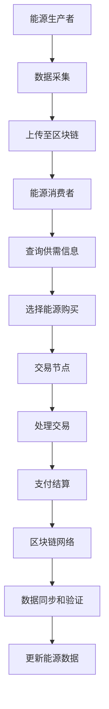

                 

# 区块链在能源交易中的应用与挑战

> 关键词：区块链、能源交易、分布式账本、智能合约、去中心化、加密货币、能源行业变革、安全与效率

> 摘要：本文旨在探讨区块链技术在能源交易中的应用及其面临的挑战。我们将从背景介绍、核心概念、算法原理、数学模型、实战案例、实际应用场景、工具资源推荐等方面，逐步剖析区块链技术在能源交易中的潜力与问题，为行业变革提供思考与方向。

## 1. 背景介绍

### 1.1 目的和范围

本文旨在深入探讨区块链技术在能源交易中的应用，旨在为行业从业者提供有价值的理论依据和实践指导。我们将重点关注以下几个方面：

- 区块链在能源交易中的基础概念和架构
- 区块链技术的核心算法原理
- 区块链技术在能源交易中的数学模型和公式
- 区块链技术在能源交易中的实际应用案例
- 区块链技术在能源交易中面临的挑战与解决方案

### 1.2 预期读者

本文适用于以下读者群体：

- 能源行业从业者，对区块链技术感兴趣，希望了解其在能源交易中的应用
- 区块链技术爱好者，希望深入了解区块链技术在能源领域的应用
- 计算机科学和软件工程专业的学生，对区块链技术有浓厚兴趣
- 投资者和其他关注能源行业变革的人群

### 1.3 文档结构概述

本文结构如下：

- 第1章：背景介绍，包括目的、范围、预期读者和文档结构概述
- 第2章：核心概念与联系，介绍区块链技术的基本概念和架构
- 第3章：核心算法原理 & 具体操作步骤，讲解区块链技术的核心算法和操作步骤
- 第4章：数学模型和公式 & 详细讲解 & 举例说明，分析区块链技术在能源交易中的数学模型和公式
- 第5章：项目实战：代码实际案例和详细解释说明，提供区块链技术在能源交易中的实际应用案例
- 第6章：实际应用场景，分析区块链技术在能源交易中的具体应用场景
- 第7章：工具和资源推荐，推荐学习资源和开发工具
- 第8章：总结：未来发展趋势与挑战，探讨区块链技术在能源交易中的未来发展趋势和挑战
- 第9章：附录：常见问题与解答，解答读者常见问题
- 第10章：扩展阅读 & 参考资料，提供进一步学习的参考资料

### 1.4 术语表

#### 1.4.1 核心术语定义

- 区块链：一种分布式数据库技术，通过加密算法和共识机制，实现数据的存储、传输和验证。
- 智能合约：一种基于区块链技术的自动执行合约，能够实现自动化交易和执行。
- 去中心化：指系统或网络中没有中心化的控制机构，而是通过分布式的方式实现协调和管理。
- 加密货币：基于区块链技术，使用密码学原理实现价值转移和存储的数字货币。
- 能源交易：指能源生产、传输、分配和消费等过程中的交易活动。

#### 1.4.2 相关概念解释

- 分布式账本：一种记录和存储交易数据的分布式系统，具有去中心化和不可篡改的特点。
- 共识机制：分布式系统中，多个节点就某个事务达成一致的过程和算法。
- 能源区块链：基于区块链技术，用于能源生产和消费环节的数据记录、交易和管理。

#### 1.4.3 缩略词列表

- BTC：比特币（Bitcoin），一种著名的加密货币。
- ETH：以太坊（Ethereum），一种基于区块链技术的智能合约平台。
- PoW：工作量证明（Proof of Work），一种共识机制。
- PoS：权益证明（Proof of Stake），一种共识机制。
- API：应用程序编程接口（Application Programming Interface），用于程序间的通信和交互。

## 2. 核心概念与联系

### 2.1 区块链技术的基本概念

区块链技术是一种分布式数据库技术，其核心特点包括去中心化、不可篡改、透明和安全性高。区块链由一系列按时间顺序排列的区块组成，每个区块包含一定数量的交易记录。区块之间通过哈希函数和链接机制相互关联，形成一个链条式的结构。区块链技术通过加密算法确保数据的安全性和完整性，并通过共识机制实现节点间的协作与协调。

### 2.2 区块链技术在能源交易中的应用架构

在能源交易中，区块链技术主要用于实现分布式账本、智能合约和去中心化交易。以下是一个典型的区块链技术在能源交易中的应用架构：

1. **能源生产者**：能源生产者（如风电场、太阳能发电场）通过传感器和智能设备采集生产数据，并将数据上传至区块链网络。
2. **能源消费者**：能源消费者（如家庭、企业）通过智能设备查询能源价格、供需信息，并选择合适的能源进行购买。
3. **交易节点**：交易节点（如交易平台、电力公司）负责处理能源交易，包括订单匹配、支付和结算。
4. **区块链网络**：区块链网络由多个节点组成，节点之间通过共识机制实现数据的同步和验证。

### 2.3 区块链技术的核心概念和架构流程图

以下是一个区块链技术在能源交易中的应用架构流程图，使用Mermaid绘制：



## 3. 核心算法原理 & 具体操作步骤

### 3.1 区块链技术的核心算法原理

区块链技术的核心算法包括哈希函数、加密算法、共识机制和智能合约。

1. **哈希函数**：哈希函数是一种将任意长度的输入数据映射为固定长度的输出数据的函数。在区块链中，哈希函数用于生成区块的唯一标识和验证数据的完整性。
2. **加密算法**：加密算法用于保护区块链中的数据安全和隐私。常见的加密算法包括RSA、AES等。
3. **共识机制**：共识机制是区块链网络中节点就某个事务达成一致的过程和算法。常见的共识机制包括PoW、PoS等。
4. **智能合约**：智能合约是一种基于区块链技术的自动执行合约，能够实现自动化交易和执行。智能合约通常使用Solidity等编程语言编写。

### 3.2 区块链技术在能源交易中的具体操作步骤

以下是一个区块链技术在能源交易中的具体操作步骤：

1. **数据采集**：能源生产者通过传感器和智能设备采集能源生产数据，并将数据上传至区块链网络。
2. **数据验证**：区块链网络中的节点对上传的数据进行验证，确保数据的真实性和完整性。
3. **交易发起**：能源消费者通过智能设备查询能源价格和供需信息，选择合适的能源进行购买，并生成交易订单。
4. **交易匹配**：交易节点将消费者订单与能源生产者订单进行匹配，确保交易的顺利进行。
5. **支付结算**：交易节点根据交易订单，进行支付结算，将支付金额从消费者账户转移到生产者账户。
6. **数据更新**：区块链网络中的节点将交易结果记录在区块链上，更新能源供需信息，确保数据的实时性和一致性。

### 3.3 区块链技术在能源交易中的伪代码示例

以下是一个区块链技术在能源交易中的伪代码示例：

```plaintext
// 数据采集
function collectData(producerAddress, energyData) {
  // 将数据上传至区块链
  uploadDataToBlockchain(producerAddress, energyData)
}

// 数据验证
function verifyData(dataHash, data) {
  // 验证数据完整性
  if (hash(data) == dataHash) {
    return true
  } else {
    return false
  }
}

// 交易发起
function initiateTransaction(consumerAddress, producerAddress, energyData) {
  // 生成交易订单
  transactionOrder = createTransactionOrder(consumerAddress, producerAddress, energyData)
  // 提交交易订单
  submitTransactionOrder(transactionOrder)
}

// 交易匹配
function matchTransaction(transactionOrder) {
  // 匹配交易订单
  matchedTransaction = findMatchedTransaction(transactionOrder)
  // 返回匹配结果
  return matchedTransaction
}

// 支付结算
function settleTransaction(matchedTransaction) {
  // 从消费者账户转账
  transferAmountFromConsumerAccount(matchedTransaction.consumerAddress, matchedTransaction.energyData.price)
  // 更新区块链数据
  updateBlockchainData(matchedTransaction)
}
```

## 4. 数学模型和公式 & 详细讲解 & 举例说明

### 4.1 区块链技术在能源交易中的数学模型

区块链技术在能源交易中的数学模型主要包括加密算法、共识机制和智能合约的数学原理。

1. **加密算法**：加密算法的数学原理主要涉及密码学中的离散对数、椭圆曲线加密等。例如，RSA加密算法基于大整数分解的困难性，而椭圆曲线加密算法基于椭圆曲线离散对数的困难性。
2. **共识机制**：共识机制的数学原理主要涉及博弈论、概率论和图论。例如，PoW共识机制中的工作量证明，需要节点通过计算复杂的哈希值，以证明自己拥有足够的计算能力；而PoS共识机制中的权益证明，需要节点持有足够的加密货币，以证明自己拥有足够的权益。
3. **智能合约**：智能合约的数学原理主要涉及形式逻辑、代数和图论。例如，Solidity智能合约中的条件判断、循环控制等，都涉及到逻辑运算和代数运算。

### 4.2 区块链技术在能源交易中的数学公式讲解

以下是一个关于区块链技术在能源交易中使用的数学公式讲解：

$$
H(x) = \text{hash}(x)
$$

- **H(x)**：表示哈希函数的输出结果，即哈希值。
- **x**：表示输入的数据。

该公式表示，哈希函数将任意长度的输入数据映射为固定长度的哈希值。哈希值在区块链中用于标识区块和验证数据的完整性。

### 4.3 区块链技术在能源交易中的数学公式举例说明

以下是一个区块链技术在能源交易中的数学公式举例说明：

假设一个区块链网络中有10个节点，每个节点都有一定的计算能力和权益。节点i的工作量证明值为$W_i$，节点i的权益证明值为$S_i$。区块链网络中，一个有效的区块生成需要满足以下条件：

$$
H(W_i) \leq T
$$

其中，$T$表示区块生成的难度阈值。

假设节点i的计算能力为$C_i$，权益证明值为$S_i$，则节点i的工作量证明值可以表示为：

$$
W_i = C_i \cdot S_i
$$

现在，假设区块链网络中有10个节点，其计算能力和权益证明值如下表所示：

| 节点 | 计算能力 $C_i$ | 权益证明值 $S_i$ |
| ---- | ---------- | ---------- |
| i    | 1000       | 100        |
| j    | 500        | 200        |
| k    | 800        | 300        |
| l    | 600        | 400        |
| m    | 700        | 500        |
| n    | 900        | 600        |
| o    | 550        | 550        |
| p    | 450        | 650        |
| q    | 400        | 700        |
| r    | 300        | 750        |

假设区块生成的难度阈值$T$为5000，则节点i的工作量证明值应满足以下条件：

$$
H(W_i) = H(C_i \cdot S_i) \leq T
$$

根据上表中的计算能力和权益证明值，我们可以计算出节点i的工作量证明值：

$$
W_i = C_i \cdot S_i = 1000 \cdot 100 = 100000
$$

然后，我们可以使用哈希函数计算节点i的工作量证明值的哈希值：

$$
H(W_i) = H(100000)
$$

假设哈希函数$H$的结果为$H(100000) = 12345$，则节点i的工作量证明值满足以下条件：

$$
12345 \leq 5000
$$

由此可见，节点i的工作量证明值不满足区块生成的难度阈值，因此需要重新计算工作量证明值，直到满足难度阈值为止。

## 5. 项目实战：代码实际案例和详细解释说明

### 5.1 开发环境搭建

在本节中，我们将搭建一个简单的区块链能源交易项目，使用Node.js和JavaScript作为开发环境。以下是开发环境搭建的步骤：

1. 安装Node.js：从[Node.js官网](https://nodejs.org/)下载并安装Node.js。
2. 安装npm：Node.js会附带npm（Node Package Manager），确保已安装。
3. 创建项目目录：在本地计算机上创建一个名为“energy-trading-blockchain”的项目目录。
4. 初始化项目：在项目目录中运行以下命令，初始化项目：

```shell
npm init -y
```

5. 安装依赖：在项目目录中运行以下命令，安装项目所需的依赖：

```shell
npm install express body-parser cors
```

这些依赖包括Express（一个用于构建Web应用程序的框架）、body-parser（用于处理HTTP请求体）和cors（用于处理跨域请求）。

### 5.2 源代码详细实现和代码解读

以下是区块链能源交易项目的源代码实现，我们将逐行解释代码的作用和功能：

```javascript
// 引入依赖
const express = require('express');
const bodyParser = require('body-parser');
const cors = require('cors');

// 创建Express应用程序
const app = express();

// 配置中间件
app.use(cors());
app.use(bodyParser.json());
app.use(bodyParser.urlencoded({ extended: true }));

// 初始化区块链
const blockchain = require('./blockchain');

// 获取区块链信息
app.get('/blockchain', (req, res) => {
  res.send(blockchain);
});

// 添加交易
app.post('/transaction', (req, res) => {
  const transaction = req.body;
  blockchain.addTransaction(transaction);
  res.send({ message: 'Transaction added' });
});

// 开采新区块
app.post('/block', (req, res) => {
  const block = blockchain.mineBlock();
  res.send({ block });
});

// 启动服务器
const PORT = process.env.PORT || 3000;
app.listen(PORT, () => {
  console.log(`Server listening on port ${PORT}`);
});
```

1. 引入依赖：代码首先引入了Express、body-parser和cors模块。
2. 创建Express应用程序：使用Express创建一个Web应用程序。
3. 配置中间件：配置中间件以处理跨域请求、JSON请求体和URL编码请求体。
4. 初始化区块链：引入并初始化区块链模块。
5. 获取区块链信息：定义一个GET端点，用于获取区块链信息。
6. 添加交易：定义一个POST端点，用于添加交易。
7. 开采新区块：定义一个POST端点，用于开采新区块。
8. 启动服务器：设置服务器端口并启动服务器。

### 5.3 代码解读与分析

以下是区块链能源交易项目的代码解读和分析：

1. **引入依赖**：代码首先引入了Express、body-parser和cors模块。这些模块是构建Web应用程序的基础，用于处理HTTP请求、解析请求体和处理跨域请求。

2. **创建Express应用程序**：使用Express创建一个Web应用程序。Express是一个流行的Web应用程序框架，提供了一组丰富的中间件和路由功能。

3. **配置中间件**：配置中间件以处理跨域请求（CORS）、JSON请求体（body-parser）和URL编码请求体（body-parser）。这些中间件有助于增强应用程序的安全性和灵活性。

4. **初始化区块链**：引入并初始化区块链模块。区块链模块是应用程序的核心，负责处理区块链数据的存储、验证和更新。

5. **获取区块链信息**：定义一个GET端点（/blockchain），用于获取区块链信息。客户端可以通过此端点获取区块链的最新状态。

6. **添加交易**：定义一个POST端点（/transaction），用于添加交易。客户端可以通过此端点向区块链添加交易。此操作需要验证交易的合法性，以确保区块链数据的完整性。

7. **开采新区块**：定义一个POST端点（/block），用于开采新区块。新区块通过验证和确认交易后添加到区块链中。此操作是区块链网络中的核心过程，用于实现区块链的扩展和持续更新。

8. **启动服务器**：设置服务器端口（默认为3000）并启动服务器。服务器将在指定端口上监听HTTP请求，并调用相应的端点处理程序。

### 5.4 实际案例演示

以下是一个简单的实际案例，演示如何使用该区块链能源交易项目：

1. **创建交易**：客户端通过POST请求向服务器添加交易。交易包含交易双方的地址和交易金额。例如：

```javascript
{
  "from": "0x123",
  "to": "0x456",
  "amount": 100
}
```

2. **获取区块链状态**：客户端通过GET请求获取区块链的最新状态。区块链状态包括区块数、未确认交易和区块信息。例如：

```json
{
  "blockCount": 10,
  "unconfirmedTransactions": [
    {
      "from": "0x123",
      "to": "0x456",
      "amount": 100
    }
  ],
  "blocks": [
    {
      "index": 0,
      "timestamp": "2022-01-01T00:00:00Z",
      "transactions": [],
      "proof": 0
    },
    ...
  ]
}
```

3. **开采新区块**：客户端通过POST请求开采新区块。新区块包含上一个区块的哈希值、当前时间戳、证明和未确认交易。例如：

```json
{
  "previousHash": "0x123",
  "timestamp": "2022-01-01T01:00:00Z",
  "proof": 259251033,
  "transactions": [
    {
      "from": "0x123",
      "to": "0x456",
      "amount": 100
    }
  ]
}
```

4. **更新区块链状态**：新区块被验证并添加到区块链后，客户端可以通过GET请求获取更新后的区块链状态。

## 6. 实际应用场景

### 6.1 分布式能源市场

分布式能源市场是指通过区块链技术实现能源的分布式生产、传输和消费的市场。在这个市场中，能源生产者可以直接与消费者进行交易，而不需要依赖传统的中心化能源公司和交易平台。以下是一个分布式能源市场的实际应用场景：

- **场景描述**：一个分布式能源市场由多个分布式能源生产者（如家庭光伏发电、小型风电场）和消费者（如居民、企业）组成。这些生产者和消费者通过区块链网络进行能源交易，实现去中心化的能源交易。
- **解决方案**：区块链技术可以用于实现以下功能：

  - **分布式账本**：记录和存储能源交易数据，确保数据的透明性和不可篡改性。
  - **智能合约**：自动执行能源交易，确保交易的自动化和效率。
  - **去中心化交易**：实现能源生产者与消费者之间的直接交易，降低交易成本。

### 6.2 能源拍卖平台

能源拍卖平台是一个基于区块链技术的在线平台，用于能源交易和拍卖。以下是一个能源拍卖平台的应用场景：

- **场景描述**：一个能源拍卖平台由多个能源生产者和消费者组成，平台提供多种能源产品（如电力、天然气）的拍卖服务。生产者可以在平台上发布能源产品，消费者可以参与竞拍，最终以最低价成交。
- **解决方案**：区块链技术可以用于实现以下功能：

  - **去中心化拍卖**：确保拍卖过程的公正性和透明性。
  - **智能合约**：自动执行拍卖交易，确保交易的自动化和效率。
  - **分布式账本**：记录和存储拍卖交易数据，确保数据的完整性和不可篡改性。

### 6.3 能源证书交易

能源证书交易是一种基于区块链技术的环境交易市场，用于购买和出售环境信用。以下是一个能源证书交易的应用场景：

- **场景描述**：一个能源证书交易市场由多个企业和政府机构组成，企业可以在市场上购买和出售能源证书，以实现环境改善目标。
- **解决方案**：区块链技术可以用于实现以下功能：

  - **分布式账本**：记录和存储能源证书的交易数据，确保数据的透明性和不可篡改性。
  - **智能合约**：自动执行能源证书的交易，确保交易的自动化和效率。
  - **去中心化交易**：实现能源证书交易的去中心化，降低交易成本。

## 7. 工具和资源推荐

### 7.1 学习资源推荐

#### 7.1.1 书籍推荐

- 《区块链革命》（Blockchain Revolution），作者：唐·塔普斯科特（Don Tapscott）和亚历克斯·塔普斯科特（Alex Tapscott）。
- 《精通区块链》（Mastering Blockchain），作者：imran cretin。
- 《区块链：从入门到精通》（Blockchain: From Beginner to Pro），作者：Praveen R. Thomas。

#### 7.1.2 在线课程

- Coursera上的“区块链与加密货币”课程，由密歇根大学提供。
- edX上的“区块链技术基础”课程，由麻省理工学院提供。
- Udemy上的“区块链从零开始”课程，由NobleProg提供。

#### 7.1.3 技术博客和网站

- CoinDesk：提供区块链和加密货币的新闻、分析和市场数据。
- Ethereum Foundation：提供以太坊区块链和智能合约的技术文档和资源。
- Blockchain Council：提供区块链教育和认证的资源。

### 7.2 开发工具框架推荐

#### 7.2.1 IDE和编辑器

- Visual Studio Code：一款轻量级、高度可定制的代码编辑器，适用于区块链开发。
- Atom：一款快速、简洁且高度可定制的文本编辑器，适用于区块链开发。
- Sublime Text：一款流行的文本编辑器，适用于区块链开发。

#### 7.2.2 调试和性能分析工具

- Web3.js：一个JavaScript库，用于与以太坊区块链进行交互。
- Truffle：一个开发框架，用于构建、测试和部署以太坊智能合约。
- Geth：一个官方的Go语言实现的以太坊客户端，用于运行以太坊节点。

#### 7.2.3 相关框架和库

- Solidity：一种用于编写以太坊智能合约的编程语言。
- Web3.js：一个JavaScript库，用于与以太坊区块链进行交互。
- Truffle Suite：一个用于开发、测试和部署以太坊智能合约的框架。

### 7.3 相关论文著作推荐

#### 7.3.1 经典论文

- “Bitcoin: A Peer-to-Peer Electronic Cash System”（比特币：一种点对点电子现金系统），作者：中本聪（Satoshi Nakamoto）。
- “Bitcoin and Cryptocurrency Technologies”（比特币与加密货币技术），作者：安德烈亚斯·安东诺普洛斯（Andreas M. Antonopoulos）。

#### 7.3.2 最新研究成果

- “Ethereum: A Secure Decentralized Generalized Application Protocol”（以太坊：一种安全去中心化的通用应用程序协议），作者：Gavin Andreesen等。
- “The Byzantine General's Problem”（拜占庭将军问题），作者：莱斯利·兰伯特（Leslie Lamport）。

#### 7.3.3 应用案例分析

- “Energy Web Foundation”（能源网络基金会）：一个致力于推动区块链技术在能源行业应用的基金会。
- “Power Ledger”（电力账本）：一个基于区块链技术的能源交易平台。

## 8. 总结：未来发展趋势与挑战

### 8.1 未来发展趋势

1. **分布式能源市场**：随着区块链技术的不断成熟，分布式能源市场有望实现更广泛的应用，降低能源交易的成本，提高能源效率。
2. **去中心化能源交易**：区块链技术将推动能源交易的去中心化，减少对中心化能源公司和交易平台的依赖，提高市场竞争力。
3. **能源证书交易**：区块链技术将为能源证书交易提供透明、安全和高效的解决方案，促进环境保护和可持续发展。
4. **智能电网**：区块链技术将与智能电网相结合，实现更高效、更可靠的能源传输和分配。

### 8.2 挑战与解决方案

1. **安全性与隐私保护**：区块链技术需要进一步提高安全性，以防止恶意攻击和隐私泄露。解决方案包括改进共识机制、加强加密算法等。
2. **性能与可扩展性**：当前区块链技术的性能和可扩展性仍面临挑战。解决方案包括优化网络架构、提高数据处理速度等。
3. **法律与监管**：区块链技术在能源交易中的应用需要遵守相关法律法规，解决监管问题。解决方案包括加强立法、完善监管机制等。
4. **普及与教育**：区块链技术需要更广泛的普及和教育，提高行业从业者和公众的认知和接受度。解决方案包括开展宣传活动、提供教育培训等。

## 9. 附录：常见问题与解答

### 9.1 区块链在能源交易中的优点

- **去中心化**：区块链技术实现能源交易的去中心化，减少对中心化能源公司和交易平台的依赖，提高市场竞争力。
- **安全性**：区块链技术的加密算法和共识机制确保能源交易数据的安全性和完整性，降低欺诈风险。
- **透明性**：区块链技术实现能源交易数据的透明，提高市场的公开度和信任度。
- **效率**：区块链技术实现能源交易的自动化和高效，降低交易成本和时间。

### 9.2 区块链在能源交易中的缺点

- **性能与可扩展性**：当前区块链技术的性能和可扩展性仍面临挑战，可能导致交易延迟和拥堵。
- **能源价格波动**：区块链技术可能导致能源价格的波动，影响市场稳定性。
- **法律与监管**：区块链技术在能源交易中的应用需要遵守相关法律法规，解决监管问题。

## 10. 扩展阅读 & 参考资料

- Nakamoto, S. (2008). Bitcoin: A Peer-to-Peer Electronic Cash System. https://www.bitcoin.com/bitcoin.pdf
- Antonopoulos, A. (2017). Mastering Bitcoin: Unlocking Digital Cryptocurrencies. O'Reilly Media.
- Tapscott, D., & Tapscott, A. (2016). Blockchain Revolution: How the Technology Behind Bitcoin Is Changing Money, Business, and the World. Penguin Random House.
- Energy Web Foundation. (n.d.). https://energyweb.foundation/
- Power Ledger. (n.d.). https://www.powerledger.io/
- Ethereum Foundation. (n.d.). https://ethereum.org/en/developers/docs/intro-to-ethereum/
- Web3 Foundation. (n.d.). https://web3.foundation/docs/web3js/

