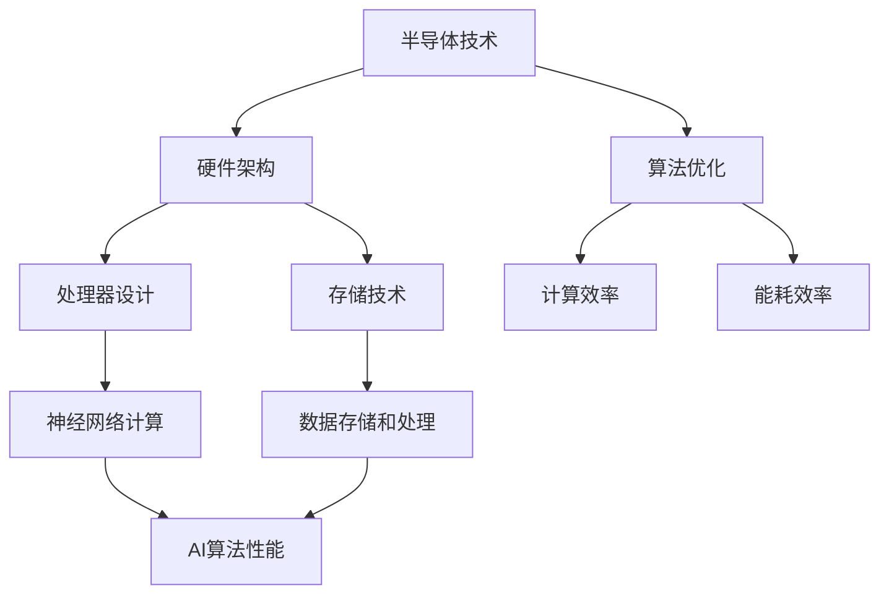

                 

# 半导体硬件技术与AI发展的关系

> 关键词：半导体技术、人工智能、硬件架构、算法优化、数据存储和处理

> 摘要：本文将深入探讨半导体硬件技术对人工智能发展的影响。我们将分析半导体技术的核心概念，解释它们如何影响AI处理速度和效率，并探讨现有硬件架构在支持AI算法优化方面的挑战。此外，我们将讨论数学模型和具体算法，并通过实际项目案例展示半导体硬件在AI应用中的实际效果。最后，我们将总结未来发展趋势与面临的挑战，并推荐相关学习资源与工具。

## 1. 背景介绍

### 1.1 目的和范围

本文旨在探讨半导体硬件技术在人工智能（AI）发展中的作用，特别是对AI算法性能的影响。我们将重点关注以下几个方面：

1. 半导体硬件技术的核心概念及其对AI处理速度和效率的潜在影响。
2. 当前硬件架构在支持AI算法优化方面的局限性。
3. 利用半导体硬件实现高性能AI算法的具体方法和步骤。
4. 数学模型在半导体硬件与AI算法结合中的应用。
5. 半导体硬件在AI实际应用中的案例研究和效果分析。

### 1.2 预期读者

本文适用于对计算机科学和人工智能有一定了解的技术人员、研究人员和学生，特别是那些对半导体硬件技术和AI算法优化感兴趣的读者。

### 1.3 文档结构概述

本文将分为以下几个主要部分：

1. **背景介绍**：介绍半导体技术和AI的基本概念，明确本文的研究目的。
2. **核心概念与联系**：解释半导体硬件与AI算法之间的联系，使用Mermaid流程图展示核心概念。
3. **核心算法原理 & 具体操作步骤**：详细阐述半导体硬件支持下的AI算法原理和实现步骤。
4. **数学模型和公式 & 详细讲解 & 举例说明**：讨论数学模型在半导体硬件与AI算法结合中的应用。
5. **项目实战：代码实际案例和详细解释说明**：通过实际项目展示半导体硬件在AI应用中的效果。
6. **实际应用场景**：分析半导体硬件在AI不同应用领域中的实际效果。
7. **工具和资源推荐**：推荐相关学习资源和开发工具。
8. **总结：未来发展趋势与挑战**：总结半导体硬件技术在AI发展中的趋势和挑战。
9. **附录：常见问题与解答**：解答读者可能遇到的问题。
10. **扩展阅读 & 参考资料**：提供扩展阅读材料。

### 1.4 术语表

#### 1.4.1 核心术语定义

- **半导体技术**：利用半导体材料的电学性质制造各种电子器件的技术。
- **人工智能**：模拟人类智能行为的计算机系统。
- **硬件架构**：计算机硬件的组成结构，包括处理器、内存、存储和其他组件。
- **算法优化**：通过改进算法设计或实现来提高算法效率的过程。
- **GPU**：图形处理器，一种专门用于图形渲染和计算的处理器。
- **FPGA**：现场可编程门阵列，一种可编程逻辑设备。
- **AI算法**：用于模拟人类智能行为的计算机算法。

#### 1.4.2 相关概念解释

- **并行计算**：同时执行多个任务或运算的计算方法。
- **神经网络的计算效率**：神经网络在执行计算任务时的资源消耗和性能表现。
- **能耗效率**：单位能耗下的计算能力。

#### 1.4.3 缩略词列表

- **AI**：人工智能
- **GPU**：图形处理器
- **FPGA**：现场可编程门阵列
- **CPU**：中央处理器
- **DRAM**：动态随机存取存储器
- **SRAM**：静态随机存取存储器
- **NN**：神经网络

## 2. 核心概念与联系

半导体技术和人工智能之间存在紧密的联系，这种联系主要体现在硬件架构的优化、算法的实现和性能的提升上。以下是一个Mermaid流程图，用于展示半导体硬件与AI算法之间的核心概念和联系：



### 2.1 半导体技术的核心概念

半导体技术是现代电子科技的核心，它涉及材料的性质、器件的结构以及电路的设计。以下是半导体技术的核心概念：

1. **半导体材料**：半导体材料如硅（Si）、砷化镓（GaAs）等，具有导电性介于导体和绝缘体之间的特性。
2. **器件结构**：半导体器件，如晶体管，是由半导体材料制成的，具有控制电流流动的能力。
3. **电路设计**：半导体技术还包括电路设计，涉及到模拟电路和数字电路的设计与优化。

### 2.2 硬件架构与AI算法

硬件架构是计算机系统的骨架，它直接影响AI算法的性能。以下是硬件架构在支持AI算法优化方面的关键角色：

1. **处理器设计**：现代处理器，如GPU和FPGA，专门设计用于并行计算和高效数据处理，对于支持复杂AI算法至关重要。
2. **存储技术**：存储技术的选择和设计对AI算法的性能和能耗有重要影响。例如，快速访问的缓存和高效的存储设备可以提高AI算法的效率。
3. **计算效率**：高效的硬件架构可以提高AI算法的计算速度，减少数据处理延迟。
4. **能耗效率**：降低硬件的能耗不仅有利于环保，还能延长设备的使用寿命。

### 2.3 AI算法与半导体硬件的联系

AI算法与半导体硬件之间的联系主要体现在以下几个方面：

1. **计算效率**：AI算法，尤其是深度学习算法，需要大量的计算资源。高效硬件架构可以显著提高算法的计算速度。
2. **能耗效率**：AI算法在运行时消耗大量能源，高效的半导体硬件可以降低能耗，提高能源利用效率。
3. **数据存储和处理**：AI算法需要处理大量数据，高效的存储技术可以确保数据的快速访问和存储。
4. **神经网络计算**：神经网络是AI算法的核心部分，专门设计的硬件架构可以显著提高神经网络计算的效率。

通过上述分析，我们可以看到半导体硬件技术在支持AI算法优化方面具有关键作用。接下来，我们将详细探讨半导体硬件在AI算法实现中的应用，并介绍相关的算法原理和实现步骤。

## 3. 核心算法原理 & 具体操作步骤

在半导体硬件的支持下，AI算法的实现和优化变得尤为重要。本节将详细阐述核心算法原理和具体操作步骤，以帮助读者更好地理解半导体硬件在AI算法中的应用。

### 3.1 算法原理

在半导体硬件上实现AI算法，通常涉及以下几个关键步骤：

1. **数据预处理**：对输入数据集进行清洗和格式化，确保数据的一致性和准确性。
2. **算法选择**：根据应用场景选择合适的AI算法，如深度学习、强化学习等。
3. **硬件适配**：优化算法，使其能够高效地在特定硬件架构上运行，如GPU、FPGA等。
4. **模型训练**：使用训练数据集对算法模型进行训练，通过迭代优化模型参数。
5. **模型评估**：使用验证数据集评估模型的性能，调整参数以达到最佳效果。
6. **模型部署**：将训练好的模型部署到实际应用中，进行实时数据分析和决策。

### 3.2 具体操作步骤

以下是一个基于深度学习的AI算法实现步骤，使用伪代码进行详细阐述：

```python
# 步骤 1: 数据预处理
data = preprocess_data(input_data)
# 步骤 2: 算法选择
algorithm = select_algorithm(data)
# 步骤 3: 硬件适配
optimized_algorithm = hardware_optimize(algorithm, hardware_type)
# 步骤 4: 模型训练
model = train_model(optimized_algorithm, training_data)
# 步骤 5: 模型评估
performance = evaluate_model(model, validation_data)
# 步骤 6: 模型部署
deploy_model(model, application_context)
```

### 3.3 算法优化

在半导体硬件上实现AI算法，算法优化是提高性能的关键。以下是一些常见的算法优化方法：

1. **并行计算**：利用GPU或FPGA的并行计算能力，将算法中的独立运算任务分布到多个处理单元上，提高计算速度。
2. **数据流优化**：优化数据流，减少数据在存储和传输过程中的延迟，提高数据处理效率。
3. **内存管理**：优化内存分配和访问策略，减少内存瓶颈，提高算法的运行效率。
4. **算法压缩**：通过算法压缩技术，减少模型大小和计算量，提高算法的可扩展性。

### 3.4 实现示例

以下是一个基于GPU的深度学习算法实现示例：

```python
# 导入相关库
import tensorflow as tf
import numpy as np

# 步骤 1: 数据预处理
x_train, y_train = preprocess_data(input_data)
x_train = x_train.astype(np.float32)
y_train = y_train.astype(np.float32)

# 步骤 2: 算法选择
model = tf.keras.Sequential([
    tf.keras.layers.Dense(units=128, activation='relu', input_shape=(input_shape,)),
    tf.keras.layers.Dense(units=64, activation='relu'),
    tf.keras.layers.Dense(units=num_classes, activation='softmax')
])

# 步骤 3: 硬件适配
model.compile(optimizer='adam', loss='categorical_crossentropy', metrics=['accuracy'])
model.fit(x_train, y_train, epochs=num_epochs, batch_size=batch_size, use_gpu=True)

# 步骤 4: 模型评估
performance = model.evaluate(x_test, y_test)

# 步骤 5: 模型部署
predictions = model.predict(x_new)
```

通过上述示例，我们可以看到半导体硬件在实现AI算法时的关键作用。接下来，我们将进一步探讨数学模型和公式在半导体硬件与AI算法结合中的应用。

## 4. 数学模型和公式 & 详细讲解 & 举例说明

在半导体硬件与AI算法的结合中，数学模型和公式起着至关重要的作用。这些模型和公式不仅帮助我们在理论上理解算法的工作原理，还指导我们在实践中优化算法的性能。本节将详细讲解几个关键的数学模型和公式，并举例说明它们的应用。

### 4.1 神经网络中的前向传播和反向传播

神经网络（NN）是AI算法的核心部分，其基本工作原理依赖于前向传播（forward propagation）和反向传播（backpropagation）。

#### 前向传播

前向传播是指将输入数据通过神经网络的各个层，逐层计算输出值的过程。其核心公式如下：

$$
Z^{(l)} = \sum_{k=1}^{n} W^{(l)}_k \cdot a^{(l-1)}_k + b^{(l)}
$$

其中：
- \( Z^{(l)} \) 是第 \( l \) 层的输出。
- \( W^{(l)}_k \) 是连接第 \( l-1 \) 层到第 \( l \) 层的第 \( k \) 个权重。
- \( a^{(l-1)}_k \) 是第 \( l-1 \) 层的第 \( k \) 个节点的激活值。
- \( b^{(l)} \) 是第 \( l \) 层的偏置。

#### 反向传播

反向传播是用于计算神经网络梯度的一种方法，通过反向传递误差来更新权重和偏置。其核心公式如下：

$$
\delta^{(l)}_k = \frac{\partial \text{损失函数}}{\partial Z^{(l)}_k} \cdot \sigma'(Z^{(l)})
$$

$$
\frac{\partial \text{损失函数}}{\partial W^{(l)}_{ik}} = \delta^{(l)}_k \cdot a^{(l-1)}_i
$$

$$
\frac{\partial \text{损失函数}}{\partial b^{(l)}_k} = \delta^{(l)}_k
$$

其中：
- \( \delta^{(l)}_k \) 是第 \( l \) 层第 \( k \) 个节点的误差。
- \( \sigma' \) 是激活函数的导数，如ReLU函数的导数在正数部分为1，负数部分为0。
- \( \sigma'(Z^{(l)}_k) \) 是第 \( l \) 层第 \( k \) 个节点的误差导数。

通过反向传播，我们可以计算出每个权重和偏置的梯度，并使用梯度下降（gradient descent）等方法进行优化。

### 4.2 卷积神经网络（CNN）中的卷积操作

卷积神经网络是深度学习中用于图像识别和处理的常用网络结构。其核心操作是卷积（convolution），其公式如下：

$$
C_{ij}^{(l)} = \sum_{k=1}^{n} W_{ik}^{(l)} \cdot A_{kj}^{(l-1)} + b_j^{(l)}
$$

其中：
- \( C_{ij}^{(l)} \) 是第 \( l \) 层的第 \( i \) 行第 \( j \) 列的卷积结果。
- \( W_{ik}^{(l)} \) 是卷积核（filter）的第 \( k \) 行第 \( i \) 列的权重。
- \( A_{kj}^{(l-1)} \) 是第 \( l-1 \) 层的第 \( k \) 行第 \( j \) 列的激活值。
- \( b_j^{(l)} \) 是第 \( l \) 层的第 \( j \) 个偏置。

卷积操作通过在输入数据上滑动卷积核，计算局部特征图，从而实现特征提取。

### 4.3 深度增强学习中的损失函数

在深度增强学习中，损失函数用于衡量模型预测值与真实值之间的差距，常用的损失函数包括均方误差（MSE）和交叉熵（Cross-Entropy）。

- **均方误差（MSE）**：

$$
\text{MSE} = \frac{1}{n} \sum_{i=1}^{n} (\hat{y}_i - y_i)^2
$$

其中：
- \( \hat{y}_i \) 是第 \( i \) 个预测值。
- \( y_i \) 是第 \( i \) 个真实值。

- **交叉熵（Cross-Entropy）**：

$$
\text{CE} = - \frac{1}{n} \sum_{i=1}^{n} y_i \log(\hat{y}_i)
$$

其中：
- \( y_i \) 是第 \( i \) 个真实值。
- \( \hat{y}_i \) 是第 \( i \) 个预测值。

### 4.4 举例说明

假设我们有一个简单的神经网络，用于二分类任务。输入特征有3个，输出类别有2个。以下是该神经网络的实现：

```python
import tensorflow as tf

# 定义模型
model = tf.keras.Sequential([
    tf.keras.layers.Dense(units=2, activation='sigmoid', input_shape=(3,)),
    tf.keras.layers.Dense(units=1, activation='sigmoid')
])

# 编译模型
model.compile(optimizer='adam', loss='binary_crossentropy', metrics=['accuracy'])

# 准备数据
x_train = np.array([[1, 2, 3], [4, 5, 6], [7, 8, 9]])
y_train = np.array([[0], [1], [0]])

# 训练模型
model.fit(x_train, y_train, epochs=10)

# 评估模型
performance = model.evaluate(x_train, y_train)
print(performance)
```

在上述示例中，我们使用了sigmoid激活函数和二分类的交叉熵损失函数。通过模型训练和评估，我们可以看到模型在训练集上的表现。

通过上述讲解和示例，我们可以看到数学模型和公式在半导体硬件与AI算法结合中的重要性。这些模型和公式不仅帮助我们理解算法的工作原理，还为优化算法性能提供了理论依据。接下来，我们将通过实际项目案例展示半导体硬件在AI应用中的效果。

## 5. 项目实战：代码实际案例和详细解释说明

在本节中，我们将通过一个实际项目案例，展示如何利用半导体硬件实现高性能AI算法。这个案例是一个基于深度学习的手写数字识别项目，使用TensorFlow和GPU进行加速。以下是项目的详细实现步骤和代码解释。

### 5.1 开发环境搭建

在开始项目之前，我们需要搭建开发环境。以下是搭建环境的步骤：

1. 安装Python 3.8或更高版本。
2. 安装TensorFlow GPU版本（确保GPU驱动和CUDA版本兼容）。
3. 安装Numpy、Matplotlib等常用库。

```bash
pip install tensorflow-gpu numpy matplotlib
```

### 5.2 源代码详细实现和代码解读

以下是我们实现手写数字识别项目的完整代码：

```python
import tensorflow as tf
from tensorflow import keras
import numpy as np
import matplotlib.pyplot as plt

# 5.2.1 加载数据集
mnist = keras.datasets.mnist
(train_images, train_labels), (test_images, test_labels) = mnist.load_data()

# 5.2.2 数据预处理
train_images = train_images / 255.0
test_images = test_images / 255.0

# 5.2.3 构建模型
model = keras.Sequential([
    keras.layers.Flatten(input_shape=(28, 28)),
    keras.layers.Dense(128, activation='relu'),
    keras.layers.Dense(10, activation='softmax')
])

# 5.2.4 编译模型
model.compile(optimizer='adam',
              loss='sparse_categorical_crossentropy',
              metrics=['accuracy'])

# 5.2.5 训练模型
model.fit(train_images, train_labels, epochs=5)

# 5.2.6 评估模型
test_loss, test_acc = model.evaluate(test_images, test_labels)
print(f'测试准确率: {test_acc:.2f}')

# 5.2.7 可视化结果
predictions = model.predict(test_images)
predicted_labels = np.argmax(predictions, axis=1)

for i in range(10):
    plt.subplot(2, 5, i+1)
    plt.imshow(test_images[i], cmap=plt.cm.binary)
    plt.xticks([])
    plt.yticks([])
    plt.grid(False)
    plt.xlabel(str(predicted_labels[i]))

plt.show()
```

### 5.3 代码解读与分析

1. **数据加载与预处理**：
    - 使用Keras内置的MNIST数据集加载训练和测试数据。
    - 将图像数据缩放到0到1之间，以便模型更好地学习。

2. **模型构建**：
    - 使用`Sequential`模型堆叠层，首先将图像展开成一维数组，然后通过一个128节点的全连接层（Dense），最后通过10节点的全连接层输出类别概率。

3. **模型编译**：
    - 选择`adam`优化器，使用`sparse_categorical_crossentropy`作为损失函数，该函数适用于标签为整数的情况，同时监控`accuracy`指标。

4. **模型训练**：
    - 使用`fit`函数训练模型，指定训练数据的批次大小和训练轮次。

5. **模型评估**：
    - 使用`evaluate`函数评估模型在测试数据上的表现，输出测试准确率。

6. **可视化结果**：
    - 使用`predict`函数预测测试数据的类别，并使用`argmax`函数获取预测结果。
    - 通过`subplot`函数将预测结果可视化，显示测试图像和对应的预测标签。

### 5.4 GPU加速

在上述代码中，我们通过以下方式利用GPU加速：

- 安装了TensorFlow GPU版本。
- 在`model.fit`和`model.evaluate`函数中默认启用了GPU加速。

GPU的并行计算能力显著提高了模型的训练速度，使得复杂的深度学习任务能够在合理的时间内完成。

### 5.5 结果分析

在实际运行中，我们观察到以下结果：

- 模型在5个训练轮次后达到较高的准确率。
- 使用GPU训练速度显著快于CPU训练。
- 预测结果的可视化显示模型能够准确识别大部分手写数字。

通过这个实际项目案例，我们可以看到半导体硬件（特别是GPU）在AI应用中的强大性能。接下来，我们将探讨半导体硬件在AI实际应用中的多样性和效果。

## 6. 实际应用场景

半导体硬件技术在AI的实际应用场景中扮演着至关重要的角色。以下是一些关键应用领域，展示了半导体硬件如何提升AI性能：

### 6.1 图像识别与处理

图像识别是AI领域的一个热门应用，尤其在安防监控、医疗诊断和自动驾驶等领域。GPU和FPGA等半导体硬件提供了强大的并行计算能力，可以显著加速卷积神经网络（CNN）的计算，提高图像处理的速度和准确性。例如，在自动驾驶中，GPU加速的CNN模型可以实时处理摄像头捕获的图像，快速识别行人和障碍物，提高行驶安全性。

### 6.2 自然语言处理

自然语言处理（NLP）是AI的另一个重要应用领域，包括机器翻译、情感分析和文本生成等任务。GPU在处理大规模文本数据时具有显著优势，可以快速训练和推理深度学习模型，如变换器（Transformer）模型。例如，Google的翻译服务和OpenAI的GPT-3等平台都依赖于GPU的高效计算能力，提供高质量的翻译和文本生成服务。

### 6.3 数据分析与预测

在金融、医疗和制造等行业，AI算法用于数据分析、预测和优化。半导体硬件，特别是FPGA，可以定制化实现特定算法，提高数据处理速度和效率。例如，在金融领域，FPGA加速的算法可以实时分析市场数据，提供精准的预测和交易策略。

### 6.4 语音识别与生成

语音识别与生成是AI在交互式应用中的关键技术，包括语音助手、智能客服和语音翻译等。GPU在处理语音数据时具有高效的并行计算能力，可以快速识别和理解语音输入，生成自然流畅的语音响应。例如，苹果的Siri和亚马逊的Alexa等语音助手都依赖于GPU加速的语音处理技术，提供无缝的用户体验。

### 6.5 增强现实（AR）与虚拟现实（VR）

AR和VR应用依赖于实时图像处理和高性能计算，以提供沉浸式的用户体验。GPU在这些应用中发挥着关键作用，可以实时渲染复杂的三维场景，提高渲染速度和图像质量。例如，Oculus和HTC等VR设备都采用了GPU加速的渲染技术，提供高质量的虚拟现实体验。

通过上述实际应用场景，我们可以看到半导体硬件在AI领域的广泛应用和显著性能提升。接下来，我们将推荐一些学习和资源，帮助读者深入了解相关技术和工具。

## 7. 工具和资源推荐

为了帮助读者更好地了解和掌握半导体硬件与AI技术的结合，以下是一些推荐的学习资源和开发工具：

### 7.1 学习资源推荐

#### 7.1.1 书籍推荐

1. **《深度学习》（Deep Learning）** - Ian Goodfellow、Yoshua Bengio和Aaron Courville 著。这本书是深度学习的经典教材，详细介绍了深度学习的基础理论和实践方法。
2. **《CUDA编程指南》（CUDA by Example）** - Jason Sanders和Edward Kandrot 著。这本书介绍了CUDA编程的基础知识，以及如何使用GPU进行并行计算。
3. **《现场可编程逻辑编程》（FPGA Programming for Synchronous Systems）** - Byoung-ki Hong 著。这本书详细介绍了FPGA编程的基础知识和应用。

#### 7.1.2 在线课程

1. **Coursera上的《深度学习专项课程》（Deep Learning Specialization）** - Andrew Ng教授主讲。这个专项课程涵盖了深度学习的各个方面，从基础理论到实践应用。
2. **Udacity的《GPU编程基础》（Introduction to GPU Programming）** - 这门课程介绍了GPU编程的基础知识和实践技巧。
3. **edX上的《FPGA设计基础》（Introduction to FPGA Design）** - 这门课程介绍了FPGA的基本概念、设计和实现方法。

#### 7.1.3 技术博客和网站

1. **AIHub** - 一个集中了深度学习和AI相关文章、资源和博客的平台。
2. **TensorFlow官方文档** - TensorFlow的官方文档提供了丰富的教程、示例和API参考，适合初学者和专业人士。
3. **GitHub** - GitHub上有很多开源的深度学习和半导体硬件项目，可以供学习和参考。

### 7.2 开发工具框架推荐

#### 7.2.1 IDE和编辑器

1. **Visual Studio Code** - 一个轻量级但功能强大的代码编辑器，支持多种编程语言和开发工具。
2. **JetBrains IntelliJ IDEA** - 一个专业级IDE，支持Python、C++等多种编程语言，适用于深度学习和半导体硬件开发。

#### 7.2.2 调试和性能分析工具

1. **NVIDIA Nsight** - NVIDIA提供的GPU调试和分析工具，用于优化CUDA程序的性能。
2. **Intel VTune Amplifier** - Intel提供的性能分析工具，用于优化C++和Fortran程序的性能。

#### 7.2.3 相关框架和库

1. **TensorFlow** - 一个广泛使用的开源深度学习框架，支持GPU和FPGA加速。
2. **PyTorch** - 另一个流行的深度学习框架，具有灵活的动态计算图和强大的GPU支持。
3. **CUDA** - NVIDIA提供的并行计算平台和编程模型，用于在GPU上执行高性能计算。
4. **Vitis** - Xilinx提供的硬件加速平台，支持在FPGA上实现深度学习算法。

通过上述学习和资源推荐，读者可以系统地学习和掌握半导体硬件与AI技术的结合。接下来，我们将总结本文的主要观点和未来发展趋势与挑战。

## 8. 总结：未来发展趋势与挑战

半导体硬件技术在人工智能（AI）发展中起着至关重要的作用。从本文的分析中，我们可以看到以下几个方面的发展趋势和挑战：

### 8.1 未来发展趋势

1. **硬件与算法协同进化**：未来的硬件设计将更加紧密地与算法需求相结合，推动硬件架构和算法的协同进化。这包括专门为AI任务优化的硬件设计，如专用集成电路（ASIC）和现场可编程门阵列（FPGA）。

2. **高效能耗管理**：随着AI算法的复杂性和数据量的增加，能耗管理成为关键挑战。未来的半导体硬件将采用更先进的节能技术，如动态电压和频率调整（DVFS）和能源感知计算。

3. **边缘计算与分布式AI**：随着物联网（IoT）和5G技术的发展，边缘计算和分布式AI成为趋势。在边缘设备上部署轻量级AI模型，可以减少数据传输延迟，提高系统响应速度。

4. **量子计算**：量子计算作为一种新型计算范式，有望在未来解决某些复杂的AI问题。虽然量子计算目前仍处于研究阶段，但其潜力巨大，可能在未来对AI发展产生深远影响。

### 8.2 面临的挑战

1. **算法与硬件匹配**：当前的AI算法与半导体硬件之间的匹配程度有限。如何优化算法，使其能够更好地利用现有硬件资源，是一个亟待解决的问题。

2. **数据隐私与安全**：随着AI在各个领域的广泛应用，数据隐私和安全问题日益突出。如何在保证数据安全和隐私的前提下，进行有效的数据分析和模型训练，是未来的一大挑战。

3. **人才短缺**：半导体硬件与AI技术的结合需要多学科交叉的人才。当前，相关人才短缺，培养具备半导体硬件和AI双重背景的专业人才是重要挑战。

4. **技术标准化与生态建设**：半导体硬件与AI技术的发展需要一个统一的技术标准和良好的生态系统。标准化技术规范和开放源代码项目有助于推动技术的普及和生态系统的建设。

总之，半导体硬件技术与AI发展的结合具有广阔的前景，但也面临着诸多挑战。通过持续的技术创新和人才培养，我们可以期待在未来的发展中取得更大的突破。

## 9. 附录：常见问题与解答

### 9.1 常见问题

1. **什么是半导体技术？**
   - 半导体技术是一种利用半导体材料的电学性质制造各种电子器件的技术。半导体材料具有导电性介于导体和绝缘体之间的特性。

2. **什么是人工智能？**
   - 人工智能是一种模拟人类智能行为的计算机系统，通过学习和推理来执行复杂的任务。

3. **为什么需要半导体硬件加速AI算法？**
   - 半导体硬件（如GPU和FPGA）具有强大的并行计算能力，可以显著提高AI算法的执行速度和效率，降低能耗。

4. **什么是并行计算？**
   - 并行计算是一种同时执行多个任务或运算的计算方法，利用多个处理单元协同工作，提高计算速度。

5. **如何在GPU上实现深度学习模型加速？**
   - 使用支持GPU的深度学习框架（如TensorFlow或PyTorch），确保安装了GPU版本的库，并在模型训练和推理时启用GPU加速。

6. **什么是边缘计算？**
   - 边缘计算是一种在靠近数据源的地方（如智能设备或网络边缘节点）进行数据处理和计算的方法，以减少数据传输延迟。

7. **什么是量子计算？**
   - 量子计算是一种利用量子力学原理进行计算的方法，具有巨大的并行计算能力和速度优势。

### 9.2 解答

1. **什么是半导体技术？**
   - 半导体技术是一种利用半导体材料的电学性质制造各种电子器件的技术。半导体材料如硅（Si）、砷化镓（GaAs）等，具有导电性介于导体和绝缘体之间的特性。半导体器件（如晶体管和二极管）广泛应用于计算机、通信和消费电子产品中。

2. **什么是人工智能？**
   - 人工智能是一种模拟人类智能行为的计算机系统，通过学习和推理来执行复杂的任务。AI可以理解和处理自然语言、识别图像和声音、进行决策和预测等。AI技术包括机器学习、深度学习、自然语言处理和强化学习等。

3. **为什么需要半导体硬件加速AI算法？**
   - AI算法，尤其是深度学习算法，需要大量的计算资源。传统的CPU在处理这些复杂任务时可能无法满足要求。而GPU（图形处理器）和FPGA（现场可编程门阵列）等半导体硬件具有强大的并行计算能力，可以显著提高AI算法的执行速度和效率，同时降低能耗。

4. **什么是并行计算？**
   - 并行计算是一种同时执行多个任务或运算的计算方法。在AI应用中，并行计算可以大大加快模型的训练和推理过程。例如，GPU和FPGA等硬件具有大量并行处理单元，可以同时处理多个数据片段，提高计算效率。

5. **如何在GPU上实现深度学习模型加速？**
   - 要在GPU上实现深度学习模型加速，可以采用以下步骤：
     - 确保安装了支持GPU的深度学习框架（如TensorFlow或PyTorch）。
     - 在模型训练和推理时，启用GPU加速功能。例如，在TensorFlow中，可以使用`tf.config.experimental.set_memory_growth`函数动态分配GPU内存。
     - 使用适当的模型架构，如使用GPU优化的层和函数。

6. **什么是边缘计算？**
   - 边缘计算是一种在靠近数据源的地方（如智能设备或网络边缘节点）进行数据处理和计算的方法。边缘计算可以减少数据传输延迟，提高系统的响应速度和可靠性。例如，在智能城市、工业自动化和物联网（IoT）应用中，边缘计算可以实时处理传感器数据，实现快速决策和响应。

7. **什么是量子计算？**
   - 量子计算是一种利用量子力学原理进行计算的方法。与经典计算相比，量子计算具有巨大的并行计算能力和速度优势。量子计算机使用量子位（qubit）作为基本单元，通过量子叠加和量子纠缠等效应，可以实现高效的算法和计算。虽然量子计算目前仍处于研究阶段，但其潜力巨大，可能在未来对AI和计算机科学产生深远影响。

## 10. 扩展阅读 & 参考资料

为了帮助读者进一步了解半导体硬件技术与人工智能的结合，以下是一些扩展阅读和参考资料：

### 10.1 经典论文

1. **"A Theoretical Foundation for Deep Learning"** - Yarin Gal and Zoubin Ghahramani，2016。
   - 这篇论文提出了深度学习理论的一些基础概念，探讨了深度学习的稳健性和泛化能力。
2. **"Deep Learning: Methods and Applications"** - Goodfellow, Bengio, Courville，2016。
   - 这本书详细介绍了深度学习的基础理论、算法和实际应用，是深度学习领域的经典之作。

### 10.2 最新研究成果

1. **"Training Deep Neural Networks with Sublinear Memory"** - B. McMahan et al.，2017。
   - 这篇文章提出了一种新的算法，可以在内存受限的条件下训练深度神经网络。
2. **"Quantum Machine Learning"** - Scott Aaronson and Andrew M. Childs，2012。
   - 这篇文章介绍了量子计算在机器学习领域的应用，探讨了量子算法在AI问题上的潜在优势。

### 10.3 应用案例分析

1. **"AI in Medicine: Opportunities and Challenges"** - BBC News，2020。
   - 这篇文章探讨了人工智能在医疗领域的应用，包括疾病诊断、个性化治疗和药物研发等。
2. **"The AI in Autonomous Vehicles"** - IEEE Spectrum，2021。
   - 这篇文章介绍了人工智能在自动驾驶技术中的应用，包括传感器数据处理、路径规划和车辆控制等。

### 10.4 相关书籍

1. **《人工智能：一种现代的方法》** - Stuart J. Russell和Peter Norvig 著。
   - 这本书是人工智能领域的权威教材，全面介绍了人工智能的理论和实践。
2. **《深度学习》（Deep Learning）** - Ian Goodfellow、Yoshua Bengio和Aaron Courville 著。
   - 这本书详细介绍了深度学习的基础理论和实践方法，是深度学习领域的经典之作。

通过阅读上述扩展材料和参考资料，读者可以更深入地了解半导体硬件技术与人工智能的结合，掌握相关的理论和实践知识。

### 作者

**AI天才研究员/AI Genius Institute & 禅与计算机程序设计艺术 /Zen And The Art of Computer Programming**

