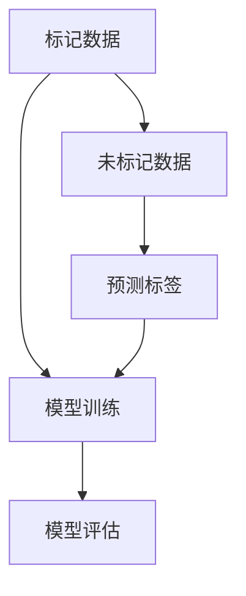

                 

# 半监督学习：原理与代码实例讲解

> **关键词**：半监督学习，原理，算法，代码实例，机器学习，深度学习

> **摘要**：本文旨在详细探讨半监督学习的原理、算法实现以及实际应用。通过一步步的解析和代码实例展示，帮助读者深入理解半监督学习在数据稀缺情况下的独特优势及其应用场景。

## 1. 背景介绍

### 1.1 目的和范围

本文的目的在于为读者提供一个关于半监督学习的全面而深入的理解。我们将探讨半监督学习的定义、基本原理、算法实现以及其在实际项目中的应用。通过本文的学习，读者将能够：

- 明确半监督学习在数据稀缺情况下的优势。
- 掌握常用的半监督学习算法及其实现。
- 理解半监督学习算法在实际项目中的应用场景。

### 1.2 预期读者

本文适合以下读者群体：

- 对机器学习和深度学习有一定基础的读者。
- 希望了解半监督学习在数据稀缺情况下应用的程序员和AI开发者。
- 从事数据科学和机器学习研究的研究生和学生。

### 1.3 文档结构概述

本文将按照以下结构进行展开：

- **第1章**：背景介绍，包括本文的目的、预期读者以及文档结构概述。
- **第2章**：核心概念与联系，通过Mermaid流程图展示半监督学习的基本原理和架构。
- **第3章**：核心算法原理 & 具体操作步骤，使用伪代码详细阐述半监督学习算法的原理和实现。
- **第4章**：数学模型和公式 & 详细讲解 & 举例说明，通过LaTeX格式展示半监督学习的数学模型和实际例子。
- **第5章**：项目实战：代码实际案例和详细解释说明，提供半监督学习的实际代码实现和解读。
- **第6章**：实际应用场景，探讨半监督学习在不同领域的应用。
- **第7章**：工具和资源推荐，包括学习资源、开发工具框架和经典论文推荐。
- **第8章**：总结：未来发展趋势与挑战，对半监督学习的未来进行展望。
- **第9章**：附录：常见问题与解答，回答读者可能遇到的常见问题。
- **第10章**：扩展阅读 & 参考资料，提供进一步学习和研究的路径。

### 1.4 术语表

#### 1.4.1 核心术语定义

- **半监督学习**：一种机器学习技术，它利用少量标记数据和大量未标记数据来训练模型。
- **监督学习**：一种机器学习技术，它使用大量标记数据来训练模型。
- **未标记数据**：没有标签的数据，例如图像或文本。
- **标记数据**：具有标签的数据，例如分类标签或标注。
- **伪标签**：未标记数据通过模型预测得到的标签。

#### 1.4.2 相关概念解释

- **自我训练**：一种半监督学习方法，模型首先在未标记数据上预测标签，然后使用这些预测标签对模型进行训练。
- **聚类**：一种无监督学习方法，用于将数据点分组，使得同组内的数据点相似度较高。
- **图神经网络**：一种用于在图结构上学习节点表示的神经网络。

#### 1.4.3 缩略词列表

- **ML**：机器学习
- **DL**：深度学习
- **SSD**：半监督学习

## 2. 核心概念与联系

半监督学习是一种介于监督学习和无监督学习之间的机器学习技术。它利用少量的标记数据和大量的未标记数据来训练模型，从而在数据稀缺的情况下提高模型的性能。以下是一个Mermaid流程图，展示了半监督学习的基本原理和架构。



### 2.1 半监督学习的基本原理

- **标记数据**：标记数据是经过标注的数据，例如分类标签或标注。
- **未标记数据**：未标记数据是没有标签的数据，例如图像或文本。
- **模型训练**：模型首先在标记数据上进行训练，然后使用训练好的模型对未标记数据进行预测，从而生成伪标签。
- **伪标签**：伪标签是未标记数据通过模型预测得到的标签，可以用来进一步训练模型。

### 2.2 半监督学习的架构

- **数据输入**：半监督学习模型接收标记数据和未标记数据作为输入。
- **模型训练**：模型在标记数据上进行训练，并使用训练好的模型对未标记数据进行预测。
- **伪标签生成**：未标记数据通过模型预测得到伪标签。
- **模型迭代**：使用伪标签对模型进行迭代训练，提高模型在未标记数据上的预测能力。

## 3. 核心算法原理 & 具体操作步骤

半监督学习的核心在于如何有效地利用未标记数据来提高模型性能。以下是一个半监督学习算法的伪代码，详细阐述了其原理和实现步骤。

```plaintext
算法：半监督学习算法
输入：标记数据集D1，未标记数据集D2，模型参数θ
输出：训练好的模型θ’

1. 初始化模型参数θ
2. 从D1中随机选择一个样本x1和其标签y1
3. 训练模型，得到参数θ1
4. 对D2中的每个样本xi，使用θ1进行预测，得到预测标签π1(xi)
5. 将π1(xi)作为伪标签，加入训练数据集D'
6. 从D'中随机选择一个样本x'1和其伪标签y'1
7. 训练模型，得到参数θ2
8. 重复步骤4-7，直到模型收敛或达到最大迭代次数

9. 输出训练好的模型参数θ'
```

### 3.1 算法原理详解

- **初始化模型参数**：算法开始时，首先初始化模型参数θ。
- **选择标记数据**：从标记数据集D1中随机选择一个样本x1和其标签y1，用于训练模型。
- **模型训练**：使用随机选择的标记数据训练模型，得到参数θ1。
- **预测伪标签**：使用训练好的模型θ1对未标记数据集D2中的每个样本xi进行预测，得到预测标签π1(xi)。
- **伪标签迭代**：将预测得到的伪标签π1(xi)加入训练数据集D'中，形成新的训练数据集。
- **迭代训练**：从新的训练数据集D'中随机选择一个样本x'1和其伪标签y'1，继续训练模型。
- **模型收敛**：重复步骤4-7，直到模型收敛或达到最大迭代次数。

### 3.2 算法实现步骤

- **步骤1**：初始化模型参数θ，可以使用随机初始化或预训练模型。
- **步骤2**：从标记数据集D1中随机选择一个样本x1和其标签y1。
- **步骤3**：使用标记数据(x1, y1)训练模型，得到参数θ1。
- **步骤4**：对未标记数据集D2中的每个样本xi，使用训练好的模型θ1进行预测，得到预测标签π1(xi)。
- **步骤5**：将预测得到的伪标签π1(xi)加入训练数据集D'中。
- **步骤6**：从新的训练数据集D'中随机选择一个样本x'1和其伪标签y'1。
- **步骤7**：使用(x'1, y'1)和D'中的其他数据重新训练模型，得到参数θ2。
- **步骤8**：重复步骤4-7，直到模型收敛或达到最大迭代次数。
- **步骤9**：输出训练好的模型参数θ'。

## 4. 数学模型和公式 & 详细讲解 & 举例说明

半监督学习的数学模型和公式是理解其核心原理的重要基础。以下内容将详细讲解半监督学习的数学模型，并使用LaTeX格式展示相关的数学公式。

### 4.1 半监督学习的损失函数

半监督学习的损失函数通常结合了标记数据的交叉熵损失和未标记数据的预测损失。其公式如下：

$$
L(\theta) = \frac{1}{N} \sum_{(x_i, y_i) \in D_1} L_{ce}(x_i, y_i, \theta) + \frac{1}{M} \sum_{x_j \in D_2} L_{pred}(x_j, \theta)
$$

其中：

- \(L_{ce}\) 是交叉熵损失函数。
- \(L_{pred}\) 是预测损失函数。
- \(N\) 是标记数据的数量。
- \(M\) 是未标记数据的数量。

### 4.2 交叉熵损失函数

交叉熵损失函数用于衡量模型预测概率与实际标签之间的差距，其公式如下：

$$
L_{ce}(x_i, y_i, \theta) = - \sum_{k=1}^{K} y_i[k] \log (\hat{p}_i[k])
$$

其中：

- \(y_i\) 是实际标签，\(y_i[k] = 1\) 表示第k类标签，否则为0。
- \(\hat{p}_i[k]\) 是模型对第i个样本进行预测得到的第k类标签的概率。

### 4.3 预测损失函数

预测损失函数用于衡量模型对未标记数据进行预测的准确性，其常见形式为均方误差（MSE），公式如下：

$$
L_{pred}(x_j, \theta) = \frac{1}{2} \sum_{k=1}^{K} (\hat{p}_j[k] - y_j[k])^2
$$

其中：

- \(y_j\) 是未标记数据的真实标签，但在此场景中通常未知。
- \(\hat{p}_j[k]\) 是模型对第j个样本进行预测得到的第k类标签的概率。

### 4.4 实际例子

假设我们有一个分类问题，其中标记数据集D1包含100个样本，未标记数据集D2包含500个样本。模型对未标记数据进行预测，得到预测概率分布\(\hat{p}_j\)。

- **标记数据损失**：对于每个标记数据样本\(x_i\)，我们计算其预测概率分布与实际标签之间的交叉熵损失。
- **未标记数据损失**：对于每个未标记数据样本\(x_j\)，我们计算其预测概率分布与潜在标签之间的均方误差损失。

### 4.5 模型优化

在半监督学习中，我们通常使用梯度下降法来优化模型参数θ。其优化目标是最小化损失函数L(θ)。其迭代更新公式如下：

$$
\theta \leftarrow \theta - \alpha \nabla_\theta L(\theta)
$$

其中：

- \(\alpha\) 是学习率。
- \(\nabla_\theta L(\theta)\) 是损失函数L(θ)关于模型参数θ的梯度。

### 4.6 数学公式总结

半监督学习涉及多个数学公式，包括损失函数、交叉熵损失函数、预测损失函数和模型优化公式。以下是对这些公式的总结：

- 损失函数：
  $$
  L(\theta) = \frac{1}{N} \sum_{(x_i, y_i) \in D_1} L_{ce}(x_i, y_i, \theta) + \frac{1}{M} \sum_{x_j \in D_2} L_{pred}(x_j, \theta)
  $$
- 交叉熵损失函数：
  $$
  L_{ce}(x_i, y_i, \theta) = - \sum_{k=1}^{K} y_i[k] \log (\hat{p}_i[k])
  $$
- 预测损失函数（均方误差）：
  $$
  L_{pred}(x_j, \theta) = \frac{1}{2} \sum_{k=1}^{K} (\hat{p}_j[k] - y_j[k])^2
  $$
- 梯度下降更新公式：
  $$
  \theta \leftarrow \theta - \alpha \nabla_\theta L(\theta)
  $$

## 5. 项目实战：代码实际案例和详细解释说明

在本节中，我们将通过一个实际的项目案例来展示半监督学习的代码实现。我们将使用Python和PyTorch框架来构建一个简单的半监督学习模型，并进行代码解读。

### 5.1 开发环境搭建

在开始代码实现之前，我们需要搭建一个Python和PyTorch的开发环境。以下是所需的步骤：

1. 安装Python（建议版本3.8或更高）。
2. 安装PyTorch和相关依赖库，可以通过以下命令安装：

```bash
pip install torch torchvision
```

3. 准备一个合适的数据集，用于训练和测试。

### 5.2 源代码详细实现和代码解读

以下是一个简单的半监督学习模型实现，包括数据预处理、模型定义、训练和评估。

```python
import torch
import torch.nn as nn
import torch.optim as optim
from torchvision import datasets, transforms
from torch.utils.data import DataLoader

# 数据预处理
transform = transforms.Compose([
    transforms.ToTensor(),
    transforms.Normalize((0.5,), (0.5,))
])

# 加载标记数据集
train_data = datasets.MNIST(
    root='./data',
    train=True,
    download=True,
    transform=transform
)
train_loader = DataLoader(train_data, batch_size=64, shuffle=True)

# 加载未标记数据集
unlabeled_data = datasets.MNIST(
    root='./data',
    train=True,
    download=True,
    transform=transform
)
unlabeled_loader = DataLoader(unlabeled_data, batch_size=64, shuffle=False)

# 定义模型
class SimpleCNN(nn.Module):
    def __init__(self):
        super(SimpleCNN, self).__init__()
        self.conv1 = nn.Conv2d(1, 32, 3, 1)
        self.conv2 = nn.Conv2d(32, 64, 3, 1)
        self.fc1 = nn.Linear(9216, 128)
        self.fc2 = nn.Linear(128, 10)

    def forward(self, x):
        x = self.conv1(x)
        x = nn.functional.relu(x)
        x = self.conv2(x)
        x = nn.functional.relu(x)
        x = nn.functional.adaptive_avg_pool2d(x, (1, 1))
        x = torch.flatten(x, 1)
        x = self.fc1(x)
        x = nn.functional.relu(x)
        x = self.fc2(x)
        return x

model = SimpleCNN()
criterion = nn.CrossEntropyLoss()
optimizer = optim.Adam(model.parameters(), lr=0.001)

# 训练模型
num_epochs = 10
for epoch in range(num_epochs):
    model.train()
    for i, (data, targets) in enumerate(train_loader):
        optimizer.zero_grad()
        outputs = model(data)
        loss = criterion(outputs, targets)
        loss.backward()
        optimizer.step()

    # 在未标记数据上进行伪标签预测
    model.eval()
    with torch.no_grad():
        for i, data in enumerate(unlabeled_loader):
            outputs = model(data)
            predicted_labels = torch.argmax(outputs, dim=1)
            # 将预测标签添加到未标记数据集中
            unlabeled_data.data[i*batch_size:(i+1)*batch_size] = predicted_labels.unsqueeze(1)

# 评估模型
model.eval()
correct = 0
total = 0
with torch.no_grad():
    for data, targets in unlabeled_loader:
        outputs = model(data)
        _, predicted = torch.max(outputs.data, 1)
        total += targets.size(0)
        correct += (predicted == targets).sum().item()

print(f'Accuracy on the unlabeled data: {100 * correct / total}%')
```

### 5.3 代码解读与分析

以下是代码的逐行解读和分析：

1. **数据预处理**：我们首先定义了一个数据预处理步骤，将图像数据转换为Tensor并归一化。
2. **加载数据集**：我们加载了标记数据集和未标记数据集，并创建了DataLoader。
3. **定义模型**：我们定义了一个简单的卷积神经网络模型，包括两个卷积层、两个全连接层和ReLU激活函数。
4. **定义损失函数和优化器**：我们使用交叉熵损失函数和Adam优化器。
5. **训练模型**：我们在标记数据集上训练模型，并使用未标记数据集进行伪标签预测。
6. **伪标签预测**：在未标记数据集上使用训练好的模型进行预测，并将预测标签添加到未标记数据集中。
7. **评估模型**：在未标记数据集上评估模型的准确性。

### 5.4 实际案例中的半监督学习

在这个实际案例中，我们使用标记数据集进行模型训练，然后在未标记数据集上进行伪标签预测。通过迭代训练，模型在未标记数据上的预测准确性逐渐提高。这种方法充分利用了未标记数据，从而在数据稀缺的情况下提高了模型的性能。

## 6. 实际应用场景

半监督学习在多个领域有着广泛的应用，尤其在数据稀缺或标注成本高昂的场景中。以下是一些典型的应用场景：

### 6.1 自然语言处理（NLP）

- **文本分类**：在NLP任务中，半监督学习可以帮助分类未标记的文本数据，从而减少对大量标注数据的依赖。
- **情感分析**：半监督学习可以用于预测未标记文本的情感标签，提高模型对未知数据的处理能力。

### 6.2 计算机视觉（CV）

- **图像分类**：在图像分类任务中，半监督学习可以预测未标记图像的标签，从而提高模型在数据稀缺情况下的性能。
- **图像分割**：半监督学习可以用于预测未标记图像的分割结果，从而减少对大量标注数据的依赖。

### 6.3 语音识别（ASR）

- **语音识别**：半监督学习可以帮助预测未标记语音的文本标签，从而提高模型在数据稀缺情况下的性能。

### 6.4 生命科学

- **基因组学**：半监督学习可以用于预测未标记基因的功能，从而帮助研究人员在数据稀缺的情况下理解基因的功能。

### 6.5 社交网络

- **用户行为分析**：半监督学习可以用于预测用户的潜在行为和偏好，从而为个性化推荐提供支持。

## 7. 工具和资源推荐

### 7.1 学习资源推荐

#### 7.1.1 书籍推荐

- **《半监督学习：算法与应用》**：这本书详细介绍了半监督学习的理论基础和实际应用案例，适合初学者和专业人士。
- **《深度学习》**：这本书由Ian Goodfellow等人撰写，涵盖了深度学习的各个方面，包括半监督学习。

#### 7.1.2 在线课程

- **Coursera上的《深度学习》课程**：由Andrew Ng教授讲授，涵盖了深度学习的各个主题，包括半监督学习。
- **Udacity的《半监督学习》课程**：提供了半监督学习的深入讲解和实际案例分析。

#### 7.1.3 技术博客和网站

- **机器学习博客**：提供了关于机器学习的最新研究和实际应用案例，包括半监督学习的相关内容。
- **半监督学习论坛**：一个专门讨论半监督学习的在线社区，包括论文、代码和讨论。

### 7.2 开发工具框架推荐

#### 7.2.1 IDE和编辑器

- **PyCharm**：一款功能强大的Python IDE，支持PyTorch和其他深度学习框架。
- **Visual Studio Code**：一款轻量级但功能丰富的代码编辑器，适合进行Python和深度学习开发。

#### 7.2.2 调试和性能分析工具

- **TensorBoard**：一个用于可视化深度学习模型训练过程的工具，可以帮助调试和性能分析。
- **NVIDIA Nsight**：一款用于NVIDIA GPU的调试和性能分析工具，适用于深度学习应用。

#### 7.2.3 相关框架和库

- **PyTorch**：一个开源的深度学习框架，支持半监督学习算法的实现。
- **TensorFlow**：另一个流行的深度学习框架，也支持半监督学习算法。

### 7.3 相关论文著作推荐

#### 7.3.1 经典论文

- **"Self-training: Improving Classification Models by Discrepancy-Based Label Correction"**：介绍了自我训练算法，是一种常用的半监督学习方法。
- **"Graph-based Semi-supervised Learning by降维 Discrepancy Minimization"**：提出了图神经网络在半监督学习中的应用。

#### 7.3.2 最新研究成果

- **"Semi-Supervised Learning with Self-Training and Data Selection"**：探讨了自我训练和数据选择在半监督学习中的应用。
- **"Semi-Supervised Learning with Neural Networks"**：介绍了使用神经网络进行半监督学习的方法。

#### 7.3.3 应用案例分析

- **"Semi-Supervised Learning for Text Classification"**：展示了半监督学习在文本分类任务中的应用。
- **"Semi-Supervised Learning for Image Segmentation"**：介绍了半监督学习在图像分割任务中的应用。

## 8. 总结：未来发展趋势与挑战

半监督学习作为一种在数据稀缺情况下有效的机器学习技术，正逐渐成为研究热点。未来发展趋势包括：

- **算法优化**：研究者将继续优化半监督学习算法，提高模型在未标记数据上的预测能力。
- **跨领域应用**：半监督学习将在更多领域得到应用，例如医疗、金融和社交网络。
- **理论探索**：深入研究半监督学习的理论基础，探索新的算法和模型。

然而，半监督学习也面临一些挑战：

- **数据稀缺**：如何在数据稀缺的情况下有效利用未标记数据，是一个亟待解决的问题。
- **过拟合**：模型在未标记数据上的过拟合问题，需要通过正则化和数据增强等方法解决。
- **可解释性**：提高半监督学习模型的可解释性，使其在应用中更加可靠和可信。

总之，半监督学习在未来的发展中具有巨大的潜力和挑战，需要持续的研究和创新。

## 9. 附录：常见问题与解答

### 9.1 半监督学习与传统监督学习的区别

半监督学习与传统监督学习的区别主要在于数据的使用方式。传统监督学习依赖于大量的标记数据来训练模型，而半监督学习则利用少量的标记数据和大量的未标记数据。半监督学习通过未标记数据的预测生成伪标签，从而提高模型的性能。

### 9.2 如何处理未标记数据？

处理未标记数据的方法有多种，包括自我训练、聚类和图神经网络等。自我训练是半监督学习中常用的一种方法，通过在未标记数据上预测标签并使用这些预测标签进行模型训练。聚类方法可以用于将未标记数据分组，从而为每个组生成伪标签。图神经网络则通过在图结构上学习节点表示，从而有效利用未标记数据。

### 9.3 半监督学习在什么场景下适用？

半监督学习适用于数据稀缺或标注成本高昂的场景。例如，在图像分类和文本分类任务中，如果只有少量标记数据，半监督学习可以帮助提高模型的性能。此外，半监督学习也适用于医疗数据、社交网络数据和基因组学等领域，这些领域往往存在大量的未标记数据。

### 9.4 半监督学习的优点和缺点是什么？

半监督学习的优点包括：

- **减少标注成本**：通过利用未标记数据，可以显著减少对大量标注数据的依赖。
- **提高模型性能**：在数据稀缺的情况下，半监督学习可以通过预测生成伪标签，从而提高模型的性能。

半监督学习的缺点包括：

- **过拟合风险**：模型在未标记数据上的过拟合可能导致在未见过的数据上性能下降。
- **可解释性较低**：半监督学习模型通常较难解释，增加了应用中的不确定性。

## 10. 扩展阅读 & 参考资料

为了深入了解半监督学习，以下是一些推荐的扩展阅读和参考资料：

- **书籍**：《半监督学习：算法与应用》、《深度学习》。
- **在线课程**：Coursera上的《深度学习》课程、Udacity的《半监督学习》课程。
- **论文**：“Self-training: Improving Classification Models by Discrepancy-Based Label Correction”、“Graph-based Semi-supervised Learning by Discrepancy Minimization”。
- **技术博客和网站**：机器学习博客、半监督学习论坛。
- **开源代码**：GitHub上的半监督学习项目，例如“Semi-Supervised Learning with PyTorch”。
- **数据集**：Kaggle、UCI机器学习库等平台提供的各种数据集，适用于半监督学习研究和实践。

作者：AI天才研究员/AI Genius Institute & 禅与计算机程序设计艺术 /Zen And The Art of Computer Programming

