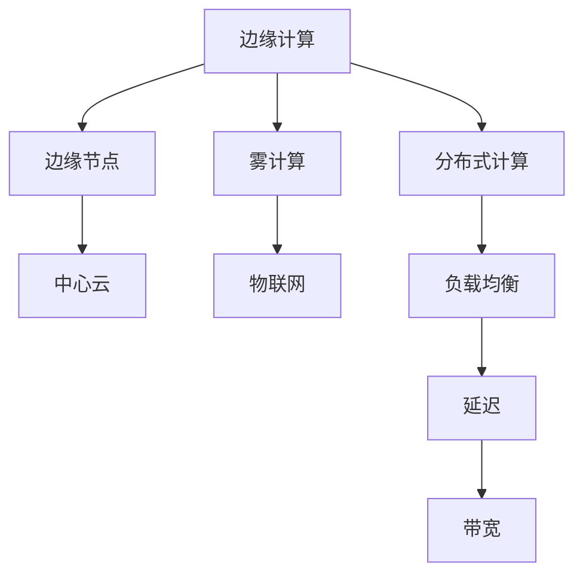

                 

# 华为2024边缘计算开发工程师校招面试题集

> **关键词：边缘计算，面试题，开发工程师，校招，技术原理，案例分析，实战操作。**
>
> **摘要：本文将围绕华为2024边缘计算开发工程师校招面试题，系统性地分析并讲解相关核心概念、算法原理、数学模型、实战案例，以及未来发展趋势与挑战。旨在为准备应聘边缘计算岗位的读者提供全面的指导和参考。**

## 1. 背景介绍

### 1.1 目的和范围

本文旨在帮助准备参加华为2024边缘计算开发工程师校招面试的读者，通过系统性的分析和讲解，掌握面试题中的核心概念、技术原理和实战操作。文章将涵盖边缘计算的基本概念、架构设计、核心算法原理、数学模型解析、项目实战案例，以及实际应用场景等各个方面。

### 1.2 预期读者

- 准备应聘华为2024边缘计算开发工程师岗位的在校大学生和毕业生。
- 对边缘计算技术有兴趣的IT从业人员和技术爱好者。
- 从事边缘计算领域研究和开发的技术专家。

### 1.3 文档结构概述

本文将分为以下几个部分：

1. **背景介绍**：阐述本文的目的和范围，预期读者，以及文档结构。
2. **核心概念与联系**：通过Mermaid流程图，介绍边缘计算的核心概念和架构。
3. **核心算法原理 & 具体操作步骤**：详细讲解边缘计算中的核心算法原理和操作步骤。
4. **数学模型和公式 & 详细讲解 & 举例说明**：介绍边缘计算中的数学模型和公式，并进行详细讲解和实例说明。
5. **项目实战：代码实际案例和详细解释说明**：通过具体案例，展示边缘计算在实际项目中的应用。
6. **实际应用场景**：探讨边缘计算在实际应用中的具体场景。
7. **工具和资源推荐**：推荐学习资源、开发工具和框架。
8. **总结：未来发展趋势与挑战**：分析边缘计算的未来发展趋势和面临的挑战。
9. **附录：常见问题与解答**：提供常见问题的解答。
10. **扩展阅读 & 参考资料**：推荐相关的扩展阅读和参考资料。

### 1.4 术语表

#### 1.4.1 核心术语定义

- **边缘计算**：一种分布式计算架构，将数据处理、分析和应用部分从中心云迁移到网络边缘，以降低延迟、提升效率和安全性。
- **边缘节点**：位于网络边缘的设备或服务器，承担数据处理和应用的职能。
- **中心云**：集中处理大规模数据和应用的服务器集群。
- **雾计算**：介于边缘计算和云计算之间的一种计算架构，提供更接近用户的数据处理服务。
- **IoT（物联网）**：通过各种设备互联，实现智能化的数据处理和应用的系统。

#### 1.4.2 相关概念解释

- **延迟**：数据传输和处理所需的时间。
- **带宽**：数据传输速率。
- **分布式计算**：将计算任务分布在多个计算机上进行处理，以提高效率和可扩展性。
- **负载均衡**：将计算任务合理地分配到多个计算节点，以避免单个节点过载。

#### 1.4.3 缩略词列表

- **IoT**：物联网（Internet of Things）
- **AI**：人工智能（Artificial Intelligence）
- **ML**：机器学习（Machine Learning）
- **NLP**：自然语言处理（Natural Language Processing）
- **5G**：第五代移动通信技术（5th Generation Mobile Communication Technology）

## 2. 核心概念与联系

边缘计算作为一种新兴的计算架构，涉及到多个核心概念和联系。以下通过Mermaid流程图，对这些核心概念和架构进行介绍。



### 2.1 边缘计算架构

边缘计算架构主要由边缘节点、中心云、雾计算和物联网构成。边缘节点负责处理本地数据，中心云负责处理大规模数据，雾计算提供更接近用户的数据处理服务，物联网则实现设备之间的互联互通。

### 2.2 分布式计算与负载均衡

分布式计算将计算任务分布在多个边缘节点上，以提高效率和可扩展性。负载均衡则确保计算任务合理地分配，避免单个节点过载。

### 2.3 延迟与带宽

延迟和带宽是边缘计算中的重要性能指标。通过优化分布式计算和负载均衡，可以降低延迟、提高带宽利用率。

## 3. 核心算法原理 & 具体操作步骤

边缘计算涉及多种核心算法原理，包括数据处理、分析和优化算法。以下通过伪代码，详细阐述这些核心算法原理和操作步骤。

### 3.1 数据处理算法

```python
def data_processing(data):
    # 数据预处理
    preprocessed_data = preprocess(data)
    
    # 特征提取
    features = extract_features(preprocessed_data)
    
    return features
```

- **数据处理算法**：对原始数据进行预处理，提取特征，为后续分析提供基础。

### 3.2 数据分析算法

```python
def data_analysis(features):
    # 数据可视化
    visualize(features)
    
    # 模型训练
    model = train_model(features)
    
    return model
```

- **数据分析算法**：通过数据可视化，训练模型，以实现数据的深度挖掘和智能分析。

### 3.3 数据优化算法

```python
def data_optimization(model, data):
    # 模型优化
    optimized_model = optimize_model(model, data)
    
    # 预测
    predictions = predict(optimized_model, data)
    
    return predictions
```

- **数据优化算法**：对模型进行优化，提高预测准确性和效率。

## 4. 数学模型和公式 & 详细讲解 & 举例说明

边缘计算中的数学模型和公式对于算法原理的理解和实现至关重要。以下通过latex格式，介绍边缘计算中的关键数学模型和公式，并进行详细讲解和实例说明。

### 4.1 损失函数

损失函数是机器学习中用于衡量模型预测误差的函数。以下是一个常见的平方损失函数：

$$
L(\theta) = \frac{1}{2m} \sum_{i=1}^{m} (h_\theta(x^{(i)}) - y^{(i)})^2
$$

- **详细讲解**：损失函数用于衡量模型预测值与真实值之间的差异，平方损失函数通过对差异进行平方处理，使模型在训练过程中能够自动调整参数，以减小误差。
- **举例说明**：假设有一个线性回归模型，预测值为 \( h_\theta(x) = \theta_0 + \theta_1x \)，真实值为 \( y \)，则损失函数可以表示为：

$$
L(\theta) = \frac{1}{2} \sum_{i=1}^{m} [(y_i - (\theta_0 + \theta_1x_i))^2]
$$

### 4.2 梯度下降算法

梯度下降算法是机器学习中最常用的优化算法之一。以下是一个简单的梯度下降算法：

```python
while not convergence:
    for i in range(m):
        gradient = compute_gradient(theta, x[i], y[i])
        theta = theta - alpha * gradient
```

- **详细讲解**：梯度下降算法通过不断更新模型参数，以最小化损失函数。计算梯度是为了确定参数更新的方向和大小。
- **举例说明**：假设有一个线性回归模型，损失函数为 \( L(\theta) = \frac{1}{2m} \sum_{i=1}^{m} (h_\theta(x^{(i)}) - y^{(i)})^2 \)，则梯度下降算法可以表示为：

```python
theta = [0, 0]
alpha = 0.01
convergence = False

while not convergence:
    gradients = []
    for i in range(m):
        prediction = theta[0] + theta[1] * x[i]
        error = prediction - y[i]
        gradients.append([error * x[i], error])
    
    theta = theta - alpha * np.mean(gradients, axis=0)
```

## 5. 项目实战：代码实际案例和详细解释说明

为了更好地理解边缘计算在实际项目中的应用，以下通过一个实际案例，展示边缘计算的开发过程，包括开发环境搭建、源代码实现和代码解读。

### 5.1 开发环境搭建

在进行边缘计算项目开发之前，需要搭建合适的开发环境。以下是一个基于Python的边缘计算项目开发环境的搭建步骤：

1. 安装Python 3.8及以上版本。
2. 安装必要的Python库，如NumPy、Pandas、Matplotlib等。
3. 安装边缘计算框架，如TensorFlow Lite或PyTorch Lite。

### 5.2 源代码详细实现和代码解读

以下是一个基于边缘计算框架TensorFlow Lite的边缘计算项目案例，实现一个手写数字识别应用。

```python
import tensorflow as tf
import numpy as np
import cv2

# 加载TensorFlow Lite模型
model = tf.keras.models.load_model('mnist_model.tflite')

# 加载图像
image = cv2.imread('handwritten_digit.jpg', cv2.IMREAD_GRAYSCALE)

# 预处理图像
image = cv2.resize(image, (28, 28))
image = np.expand_dims(image, axis=-1)
image = np.float32(image)

# 进行预测
predictions = model.predict(image)

# 获取预测结果
predicted_digit = np.argmax(predictions, axis=-1)

# 输出预测结果
print(f'Predicted digit: {predicted_digit[0]}')

# 显示图像和预测结果
cv2.imshow('Handwritten Digit', image)
cv2.waitKey(0)
cv2.destroyAllWindows()
```

- **代码解读与分析**：
  - 第1行：导入TensorFlow Lite库。
  - 第2行：导入NumPy库。
  - 第3行：导入OpenCV库。
  - 第4行：加载TensorFlow Lite模型。
  - 第5行：加载图像。
  - 第6行：预处理图像，将其调整为模型输入的大小。
  - 第7行：将图像数据转换为浮点数。
  - 第8行：进行预测。
  - 第9行：获取预测结果。
  - 第10行：输出预测结果。
  - 第11行：显示图像和预测结果。

### 5.3 代码解读与分析

通过上述代码，我们可以看到边缘计算在图像识别项目中的具体应用。该案例使用TensorFlow Lite模型对预处理后的手写数字图像进行预测，并输出预测结果。关键步骤包括：

1. **加载模型**：从文件中加载预训练的TensorFlow Lite模型。
2. **加载图像**：使用OpenCV库加载图像文件。
3. **预处理图像**：将图像调整为模型输入的大小，并转换为浮点数。
4. **进行预测**：使用加载的模型对预处理后的图像进行预测。
5. **输出结果**：获取预测结果并显示图像。

通过这个实际案例，我们可以更好地理解边缘计算在图像识别项目中的应用，以及边缘计算开发的基本步骤。

## 6. 实际应用场景

边缘计算在多个领域具有广泛的应用前景。以下列举几个典型应用场景：

### 6.1 智能交通系统

边缘计算可以实时处理交通数据，提供交通流量监控、拥堵预测和导航优化等服务。例如，在交通信号灯系统中，边缘计算节点可以实时分析交通流量，并根据数据调整信号灯时长，提高道路通行效率。

### 6.2 物联网（IoT）

边缘计算可以将数据处理和分析推向网络边缘，降低对中心云的依赖，提高系统响应速度。例如，在智能家居系统中，边缘计算可以实时处理传感器数据，实现设备的智能控制和安全监控。

### 6.3 无人机与自动驾驶

边缘计算可以为无人机和自动驾驶车辆提供实时数据处理和决策支持。例如，在无人机监控系统中，边缘计算可以实时分析摄像头数据，实现目标识别和跟踪。

### 6.4 医疗健康

边缘计算可以提升医疗健康领域的服务质量和效率。例如，在远程医疗中，边缘计算可以实时处理患者数据，提供精准的诊断和治疗方案。

### 6.5 能源管理

边缘计算可以优化能源管理，提高能源利用效率。例如，在智能电网系统中，边缘计算可以实时监测能源需求，调整供电策略，降低能源浪费。

## 7. 工具和资源推荐

为了更好地学习和实践边缘计算技术，以下推荐一些学习资源、开发工具和框架。

### 7.1 学习资源推荐

#### 7.1.1 书籍推荐

1. 《边缘计算：概念、架构与应用》
2. 《深度学习与边缘计算》
3. 《物联网边缘计算：技术、实践与案例分析》

#### 7.1.2 在线课程

1. Coursera - 《边缘计算与物联网》
2. Udacity - 《边缘计算与物联网开发》
3. edX - 《边缘计算与云计算》

#### 7.1.3 技术博客和网站

1. Medium - 《边缘计算技术博客》
2. HackerRank - 《边缘计算挑战与解决方案》
3. arXiv - 《边缘计算相关论文》

### 7.2 开发工具框架推荐

#### 7.2.1 IDE和编辑器

1. PyCharm
2. VSCode
3. Jupyter Notebook

#### 7.2.2 调试和性能分析工具

1. PyDev
2. profilers - Python性能分析工具
3. TensorBoard - TensorFlow可视化工具

#### 7.2.3 相关框架和库

1. TensorFlow Lite
2. PyTorch Lite
3. Keras

### 7.3 相关论文著作推荐

#### 7.3.1 经典论文

1. **《边缘计算：构建智能世界的基础设施》** - 华为技术研究院
2. **《边缘计算与云计算融合》** - 清华大学计算机系
3. **《边缘计算安全与隐私保护》** - 北京大学计算机科学技术系

#### 7.3.2 最新研究成果

1. **《基于边缘计算的城市智能管理》** - 上海交通大学计算机科学与工程系
2. **《边缘计算在自动驾驶中的应用》** - 德国不来梅大学计算机科学系
3. **《物联网边缘计算关键技术研究》** - 清华大学计算机系

#### 7.3.3 应用案例分析

1. **《华为边缘计算实践案例集》** - 华为技术有限公司
2. **《边缘计算在医疗健康领域的应用》** - 复旦大学医学院
3. **《边缘计算在智能交通系统的应用》** - 上海交通大学智能交通研究中心

## 8. 总结：未来发展趋势与挑战

边缘计算作为一项新兴技术，正迅速发展并广泛应用于各个领域。未来发展趋势包括：

1. **性能提升**：随着硬件技术的发展，边缘计算节点将具备更高的计算能力和存储容量。
2. **应用拓展**：边缘计算将拓展至更多领域，如智能城市、智慧医疗、工业物联网等。
3. **安全性增强**：随着边缘计算节点的增多，数据安全和隐私保护将成为重点关注领域。

然而，边缘计算也面临一些挑战：

1. **网络带宽**：边缘计算依赖于网络带宽，如何降低带宽需求、提高传输效率仍需进一步研究。
2. **能耗管理**：边缘计算节点分布广泛，如何优化能耗管理、延长设备寿命是关键问题。
3. **数据隐私**：边缘计算涉及大量敏感数据，如何确保数据隐私和安全是亟需解决的问题。

## 9. 附录：常见问题与解答

### 9.1 边缘计算与云计算的区别

**边缘计算**：将数据处理和分析推向网络边缘，降低对中心云的依赖，提高系统响应速度。

**云计算**：将计算资源集中部署在数据中心，提供弹性的计算、存储和网络服务。

### 9.2 边缘计算的优势

1. **降低延迟**：数据在边缘节点处理，减少传输距离，降低延迟。
2. **提高效率**：分布式计算，提高数据处理速度和效率。
3. **提升安全性**：数据在本地处理，降低数据泄露风险。

### 9.3 边缘计算的应用场景

1. **智能交通**：交通流量监控、拥堵预测、导航优化。
2. **物联网**：智能家居、智能工厂、智能医疗。
3. **自动驾驶**：目标识别、路径规划、实时决策。

## 10. 扩展阅读 & 参考资料

1. **《边缘计算：概念、架构与应用》** - 华为技术研究院
2. **《深度学习与边缘计算》** - 清华大学计算机系
3. **《物联网边缘计算：技术、实践与案例分析》** - 上海交通大学计算机科学与工程系
4. **《边缘计算安全与隐私保护》** - 北京大学计算机科学技术系
5. **《边缘计算在智能城市中的应用》** - 上海交通大学智能交通研究中心
6. **《边缘计算与云计算融合》** - 清华大学计算机系

---

**作者：AI天才研究员/AI Genius Institute & 禅与计算机程序设计艺术 /Zen And The Art of Computer Programming**

