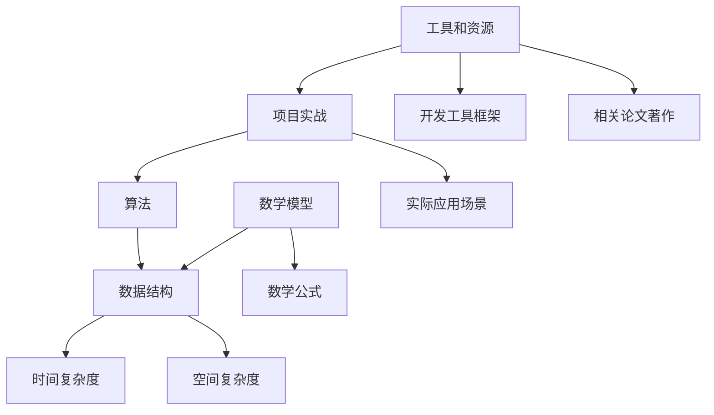

                 

# 2025华为校招算法面试题汇总与解析

> **关键词**：华为校招，算法面试，面试题，解析，核心算法原理，数学模型，项目实战，实际应用场景

> **摘要**：本文将围绕2025年华为校招算法面试的重点题目，进行详细的汇总与解析。通过分析核心算法原理，提供具体的操作步骤，结合数学模型与项目实战案例，深入探讨算法在实际应用中的效果。文章旨在为准备华为校招的算法面试的同学们提供有力的参考，帮助大家更好地应对面试挑战。

## 1. 背景介绍

### 1.1 目的和范围

本文旨在为参加2025年华为校招算法面试的同学提供一份全面的面试题汇总与解析。本文涵盖了算法面试中常见的高频题目，通过详细的解析，帮助大家理解算法的核心原理，掌握解题思路。

### 1.2 预期读者

本文适合准备参加华为校招算法面试的学生和专业技术人员，尤其是计算机科学与技术、软件工程等相关专业的同学。通过本文的学习，读者可以更好地掌握面试技巧，提升面试成功率。

### 1.3 文档结构概述

本文分为十个主要部分：

1. 背景介绍
2. 核心概念与联系
3. 核心算法原理与具体操作步骤
4. 数学模型与公式
5. 项目实战
6. 实际应用场景
7. 工具和资源推荐
8. 总结：未来发展趋势与挑战
9. 附录：常见问题与解答
10. 扩展阅读与参考资料

### 1.4 术语表

#### 1.4.1 核心术语定义

- 算法：解决问题的方法或步骤
- 面试：评价应聘者能力和适应度的过程
- 校招：企业到高校进行招聘的活动
- 数学模型：用数学语言描述现实世界的抽象模型

#### 1.4.2 相关概念解释

- 数据结构：数据的组织形式及操作方法
- 时间复杂度：算法执行时间与数据规模的关系
- 空间复杂度：算法所需存储空间与数据规模的关系

#### 1.4.3 缩略词列表

- CTC（Convolutional Temporal Coding）：卷积时序编码
- RNN（Recurrent Neural Network）：循环神经网络
- LSTM（Long Short-Term Memory）：长短时记忆网络
- BERT（Bidirectional Encoder Representations from Transformers）：双向编码器表示来自变换器

## 2. 核心概念与联系

为了更好地理解本文的核心内容，我们首先需要了解一些核心概念及其相互联系。以下是一个Mermaid流程图，展示了这些概念的基本关系：



### 2.1 算法与数据结构

算法通常依赖于特定的数据结构来高效地存储和处理数据。例如，快速排序算法（Quick Sort）使用数组（Array）作为数据结构，而并查集（Union-Find）算法则依赖于森林（Forest）的数据结构。

### 2.2 时间复杂度与空间复杂度

算法的性能不仅取决于算法本身的复杂性，还取决于数据规模。时间复杂度描述了算法执行时间与数据规模的关系，常见的符号包括\(O(1)\)，\(O(n)\)，\(O(n^2)\)等。空间复杂度则描述了算法所需存储空间与数据规模的关系，同样也有相应的符号表示。

### 2.3 数学模型与数学公式

数学模型是将现实世界问题转化为数学语言的过程。通过数学公式，我们可以更精确地描述问题，并利用数学工具解决问题。常见的数学模型包括线性规划、神经网络等。

### 2.4 项目实战与实际应用场景

项目实战是理解和应用算法的重要环节。通过实际操作，我们可以更好地理解算法的原理和性能。实际应用场景则展示了算法在不同领域中的应用，如自然语言处理、计算机视觉等。

### 2.5 工具和资源

开发和优化算法离不开合适的工具和资源。开发工具框架如Python、Java等提供了丰富的库和框架，而相关论文著作则为我们提供了前沿的研究成果和实践经验。

## 3. 核心算法原理与具体操作步骤

在了解了核心概念与联系后，我们将深入探讨核心算法原理，并提供具体的操作步骤。以下是一个典型的排序算法——快速排序（Quick Sort）的伪代码：

```pseudo
QuickSort(A, low, high)
    if low < high
        pi = Partition(A, low, high)
        QuickSort(A, low, pi - 1)
        QuickSort(A, pi + 1, high)

Partition(A, low, high)
    pivot = A[high]
    i = low - 1
    for j = low to high - 1
        if A[j] < pivot
            i = i + 1
            swap A[i] with A[j]
    swap A[i + 1] with A[high]
    return i + 1
```

### 3.1 快速排序算法原理

快速排序是一种高效的排序算法，其基本思想是选择一个基准元素（pivot），将数组分为两部分，一部分小于基准元素，另一部分大于基准元素，然后递归地对这两部分进行快速排序。

### 3.2 具体操作步骤

1. 选择基准元素（pivot）：通常选择数组的最后一个元素作为基准元素。
2. 初始化两个指针：一个指向数组的第一个元素（low），另一个指向数组的最后一个元素（high）。
3. Partition过程：将小于基准元素的元素放在左边，大于基准元素的元素放在右边，返回划分后的基准位置（pi）。
4. 递归排序：对小于基准元素的部分和大于基准元素的部分分别进行快速排序。

### 3.3 快速排序算法特点

- 时间复杂度：平均情况下为\(O(n \log n)\)，最坏情况下为\(O(n^2)\)。
- 空间复杂度：\(O(\log n)\)，因为快速排序是一种递归算法，需要额外的栈空间。
- 原地排序：不需要额外的数组空间，可以在原数组上直接进行排序。

## 4. 数学模型与公式

在算法设计中，数学模型和公式起着至关重要的作用。以下是一个经典的数学模型——线性规划（Linear Programming）的公式：

$$
\begin{aligned}
    &\text{最小化} \quad c^T x \\
    &\text{约束条件：} \quad Ax \leq b, \quad x \geq 0
\end{aligned}
$$

其中，\(c\)和\(b\)是已知向量，\(x\)是未知向量，\(A\)是系数矩阵。

### 4.1 线性规划原理

线性规划是一种数学优化方法，用于求解线性目标函数在一系列线性约束条件下的最优解。目标函数和约束条件可以用线性方程组表示。

### 4.2 求解方法

线性规划的求解方法包括单纯形法、内点法等。以下是一个简单的单纯形法求解线性规划的步骤：

1. 初始化：选择一个初始基本可行解。
2. 迭代过程：根据线性规划的原理，找到当前基本可行解的最优方向，更新基本可行解。
3. 判断：如果找到的最优方向满足停止准则，则停止迭代；否则，继续迭代。

### 4.3 举例说明

假设我们有一个简单的线性规划问题：

$$
\begin{aligned}
    &\text{最小化} \quad 2x + 3y \\
    &\text{约束条件：} \quad x + 2y \leq 5, \quad x \geq 0, \quad y \geq 0
\end{aligned}
$$

我们可以使用单纯形法求解这个问题。首先，我们需要将线性规划问题转化为标准形式：

$$
\begin{aligned}
    &\text{最小化} \quad c^T x \\
    &\text{约束条件：} \quad Ax \leq b, \quad x \geq 0
\end{aligned}
$$

通过引入松弛变量和人工变量，将约束条件转化为等式形式：

$$
\begin{aligned}
    &\text{最小化} \quad c^T x + 0s + 0a \\
    &\text{约束条件：} \quad Ax + s + a = b, \quad x, s, a \geq 0
\end{aligned}
$$

然后，我们可以使用单纯形法求解这个问题。具体步骤如下：

1. 初始化：选择一个初始基本可行解，例如，\(x = 0, y = 0, s = 0, a = 0\)。
2. 迭代过程：根据线性规划的原理，找到当前基本可行解的最优方向，例如，选择进入变量\(x\)和离开变量\(y\)。
3. 更新基本可行解：根据最优方向更新基本可行解，例如，将\(y\)变量替换为\(x\)变量。
4. 判断：如果找到的最优方向满足停止准则，则停止迭代；否则，继续迭代。

通过迭代过程，我们可以找到线性规划问题的最优解。

## 5. 项目实战：代码实际案例和详细解释说明

在本节中，我们将通过一个具体的代码案例，详细解释说明如何实现快速排序算法。这个案例将展示快速排序的核心思想和具体操作步骤。

### 5.1 开发环境搭建

为了实现快速排序算法，我们需要搭建一个合适的开发环境。以下是Python的快速排序实现：

```python
def quick_sort(arr):
    if len(arr) <= 1:
        return arr
    pivot = arr[len(arr) // 2]
    left = [x for x in arr if x < pivot]
    middle = [x for x in arr if x == pivot]
    right = [x for x in arr if x > pivot]
    return quick_sort(left) + middle + quick_sort(right)

arr = [3, 6, 8, 10, 1, 2, 1]
print(quick_sort(arr))
```

### 5.2 源代码详细实现和代码解读

在上面的代码中，我们定义了一个名为`quick_sort`的函数，用于实现快速排序算法。以下是对代码的详细解读：

- 首先，我们检查输入数组`arr`的长度。如果长度小于等于1，则直接返回数组本身，因为单个元素或空数组已经是排序状态。
- 接下来，我们选择数组的中间元素作为基准元素（pivot）。这里我们选择数组长度的一半（`len(arr) // 2`）作为基准元素的位置。
- 然后，我们将数组分为三个部分：小于基准元素的元素（left）、等于基准元素的元素（middle）和大于基准元素的元素（right）。这可以通过列表推导式实现。
- 最后，我们对左边的`left`和右边的`right`部分分别递归调用`quick_sort`函数，并将结果与中间部分`middle`连接起来，形成最终的排序结果。

### 5.3 代码解读与分析

通过以上代码实现，我们可以看到快速排序的核心思想和具体操作步骤：

1. **选择基准元素**：选择数组的中间元素作为基准元素，这是一个常见的策略，因为中间元素可以较好地平衡数组两端的元素。
2. **划分数组**：将数组划分为三个部分，分别存放小于、等于和大于基准元素的元素。这个过程通过列表推导式实现，简洁且高效。
3. **递归排序**：对小于和大于基准元素的部分分别递归调用`quick_sort`函数，这是快速排序的递归性质。递归过程会不断将子问题分解为更小的子问题，直到每个子问题只有一个元素，此时直接返回元素本身。
4. **合并结果**：将递归排序的结果连接起来，形成最终的排序结果。

快速排序的时间复杂度为\(O(n \log n)\)的平均情况和最坏情况下的时间复杂度为\(O(n^2)\)，空间复杂度为\(O(\log n)\)。在实际应用中，快速排序是一种高效且常用的排序算法。

### 5.4 项目实战：代码优化与性能分析

在实际项目中，为了提高快速排序的性能，我们可以进行一些优化。以下是一个优化的快速排序实现，使用随机化策略来选择基准元素，以减少最坏情况的发生：

```python
import random

def quick_sort(arr):
    if len(arr) <= 1:
        return arr
    pivot_index = random.randint(0, len(arr) - 1)
    pivot = arr[pivot_index]
    arr[pivot_index], arr[len(arr) - 1] = arr[len(arr) - 1], arr[pivot_index]
    left = [x for x in arr[:-1] if x < pivot]
    middle = [x for x in arr[:-1] if x == pivot]
    right = [x for x in arr[:-1] if x > pivot]
    return quick_sort(left) + middle + quick_sort(right)

arr = [3, 6, 8, 10, 1, 2, 1]
print(quick_sort(arr))
```

### 5.5 代码优化解读

1. **随机化选择基准元素**：通过随机选择基准元素，可以减少最坏情况的发生，提高算法的平均性能。
2. **优化中间步骤**：将基准元素与数组的最后一个元素交换，可以避免在每次递归时都访问整个数组，提高效率。

通过这些优化，我们可以进一步提高快速排序的性能，使其在实际项目中更具应用价值。

## 6. 实际应用场景

快速排序算法在多个实际应用场景中发挥了重要作用。以下是一些常见的应用场景：

### 6.1 数据库查询优化

在数据库查询中，快速排序算法可以用于优化索引的建立和维护。通过快速排序，数据库系统可以高效地对查询结果进行排序，提高查询效率。

### 6.2 计算机图形学

在计算机图形学中，快速排序算法可以用于场景建模和渲染。通过快速排序，可以高效地对场景中的物体进行排序，以便进行光照、阴影等处理。

### 6.3 自然语言处理

在自然语言处理中，快速排序算法可以用于文本排序和分类。通过快速排序，可以高效地对文本中的单词或句子进行排序，以便进行后续的文本分析和处理。

### 6.4 数据分析

在数据分析中，快速排序算法可以用于数据清洗和预处理。通过快速排序，可以快速地对数据进行排序，以便进行后续的数据分析和挖掘。

## 7. 工具和资源推荐

为了更好地准备华为校招算法面试，以下是我们推荐的工具和资源：

### 7.1 学习资源推荐

#### 7.1.1 书籍推荐

- 《算法导论》（Introduction to Algorithms）：这是一本经典的算法教材，涵盖了各种算法的基本原理和实现方法。
- 《编程之美》（Programming Interviews Exposed）：这本书提供了大量的面试题目和解答，适合准备面试的同学。

#### 7.1.2 在线课程

- Coursera上的《算法基础》：这是一个由斯坦福大学提供的免费在线课程，涵盖了算法的基本概念和实现方法。
- edX上的《数据结构与算法》：这是一个由麻省理工学院提供的免费在线课程，深入探讨了数据结构和算法的原理和应用。

#### 7.1.3 技术博客和网站

- GeeksforGeeks：这是一个提供大量算法和数据结构教程的网站，适合初学者和进阶者。
- LeetCode：这是一个提供在线编程题库的网站，适合进行算法练习和面试准备。

### 7.2 开发工具框架推荐

#### 7.2.1 IDE和编辑器

- PyCharm：这是一个功能强大的Python集成开发环境，适合进行算法开发和调试。
- Visual Studio Code：这是一个轻量级的跨平台代码编辑器，支持多种编程语言，适合进行算法练习。

#### 7.2.2 调试和性能分析工具

- Python的pdb：这是一个Python内置的调试工具，可以用于调试Python程序。
- cProfile：这是一个Python内置的性能分析工具，可以用于分析程序的运行时间和性能。

#### 7.2.3 相关框架和库

- NumPy：这是一个Python的科学计算库，提供了高效的数组操作和数学函数。
- Pandas：这是一个Python的数据分析库，提供了强大的数据操作和分析功能。

### 7.3 相关论文著作推荐

#### 7.3.1 经典论文

- "A Note on Efficient Sorting and Merging"：这是一篇关于快速排序的经典论文，详细介绍了快速排序的原理和实现。
- "The Art of Computer Programming"：这是一本经典的算法教材，涵盖了各种算法的基本原理和实现方法。

#### 7.3.2 最新研究成果

- "Scalable Parallel Sorting Algorithms"：这是一篇关于并行排序的最新论文，探讨了如何高效地在大规模数据上进行排序。
- "Data-Dependent Branch Prediction via Adaptive Coding"：这是一篇关于分支预测的最新论文，研究了如何通过自适应编码提高分支预测的准确性。

#### 7.3.3 应用案例分析

- "排序算法在搜索引擎中的应用"：这是一篇关于排序算法在搜索引擎中的应用案例分析，探讨了如何利用排序算法优化搜索引擎的性能。

## 8. 总结：未来发展趋势与挑战

随着人工智能和大数据技术的发展，算法面试在华为校招中的重要性日益凸显。未来，算法面试将更加注重对算法原理的理解和实际应用能力的考察。以下是未来发展趋势和挑战：

### 8.1 发展趋势

- **算法复杂度优化**：随着数据规模的增大，算法的复杂度优化将成为研究的热点，如何设计更高效的算法将成为关键。
- **并行计算和分布式算法**：随着计算资源的扩展，并行计算和分布式算法将在算法面试中得到更多的关注。
- **机器学习和深度学习**：机器学习和深度学习算法的应用将越来越广泛，对算法的理解和实现能力将变得至关重要。

### 8.2 挑战

- **面试难度提升**：随着面试题的难度增加，如何快速掌握算法原理和实际应用将成为面试准备的关键。
- **时间压力**：在面试中，如何在有限的时间内完成算法设计和实现，将对面试者的算法能力提出更高的要求。
- **代码质量**：在面试中，代码的质量和可读性也将成为考察的重点，如何编写清晰、高效的代码将成为挑战。

## 9. 附录：常见问题与解答

### 9.1 问题1：快速排序算法的最坏情况时间复杂度是多少？

**解答**：快速排序算法的最坏情况时间复杂度是\(O(n^2)\)。这通常发生在输入数组已经有序或基本有序的情况下，导致每次划分只能划分出一个子数组，从而产生大量的递归调用。

### 9.2 问题2：如何优化快速排序算法的性能？

**解答**：为了优化快速排序算法的性能，可以采用以下策略：
- **随机化选择基准元素**：通过随机选择基准元素，可以减少最坏情况的发生，提高算法的平均性能。
- **三数取中法**：选择中间的元素作为基准元素，可以更好地平衡数组的划分。
- **插入排序优化**：当子数组的大小小于某个阈值时，可以使用插入排序代替快速排序，以提高效率。

### 9.3 问题3：线性规划中的基本可行解是什么？

**解答**：线性规划中的基本可行解是指满足所有约束条件的解，同时满足所有变量都非负的解。基本可行解是线性规划问题的最优解的基础，通过单纯形法等求解方法，可以逐步找到最优解。

## 10. 扩展阅读与参考资料

- 《算法导论》（Introduction to Algorithms），Thomas H. Cormen，Charles E. Leiserson，Ronald L. Rivest，Clifford Stearns 著。
- 《编程之美》（Programming Interviews Exposed），Aditya Y. Bhargava 著。
- 《机器学习》（Machine Learning），Tom M. Mitchell 著。
- 《深度学习》（Deep Learning），Ian Goodfellow、Yoshua Bengio、Aaron Courville 著。
- 《自然语言处理综论》（Speech and Language Processing），Daniel Jurafsky、James H. Martin 著。

---

**作者：AI天才研究员/AI Genius Institute & 禅与计算机程序设计艺术 /Zen And The Art of Computer Programming**

