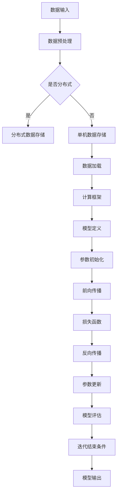

                 

# 华为的云端训练算力与迭代效率

> 关键词：华为、云端训练、算力、迭代效率、人工智能、深度学习、计算框架

> 摘要：本文将深入探讨华为在云端训练算力和迭代效率方面的创新技术与应用。通过分析华为的云计算基础设施、计算框架优化、算法效率提升等核心方面，揭示其如何在全球范围内引领人工智能技术发展。本文旨在为读者提供一个全面的技术视角，以了解华为在云计算和人工智能领域的独特优势。

## 1. 背景介绍

### 1.1 目的和范围

本文的目的是深入分析华为在云端训练算力和迭代效率方面的技术优势。随着人工智能技术的快速发展，深度学习模型的训练需求日益增长，云端训练成为了一个重要的趋势。华为作为全球领先的ICT（信息与通信）基础设施和智能终端提供商，其在云端训练方面的创新和突破值得我们重点关注。

本文将围绕以下几个方面展开讨论：

1. 华为的云计算基础设施及其在云端训练中的应用。
2. 华为自主研发的计算框架及其优化策略。
3. 华为在算法效率提升方面的技术创新。
4. 华为云端训练的实际应用场景和案例。

通过上述分析，我们希望读者能够对华为在云端训练领域的技术实力和应用前景有一个清晰的认识。

### 1.2 预期读者

本文适用于以下读者群体：

1. 人工智能和深度学习研究者，希望了解云端训练的最新技术和发展趋势。
2. 云计算和数据中心领域的专业人士，希望了解华为在云计算基础设施和优化策略方面的实践。
3. 企业决策者和技术管理者，希望了解华为在云端训练领域的技术优势和商业价值。
4. 对人工智能和云计算感兴趣的技术爱好者，希望深入了解相关技术原理和应用场景。

### 1.3 文档结构概述

本文的结构如下：

1. **背景介绍**：介绍本文的目的、预期读者、文档结构和核心术语。
2. **核心概念与联系**：通过Mermaid流程图展示云端训练的核心概念和架构。
3. **核心算法原理 & 具体操作步骤**：详细讲解华为云端训练的核心算法原理和操作步骤。
4. **数学模型和公式 & 详细讲解 & 举例说明**：介绍云端训练中的数学模型和公式，并进行举例说明。
5. **项目实战：代码实际案例和详细解释说明**：通过实际案例展示华为云端训练的实现过程。
6. **实际应用场景**：分析华为云端训练在不同领域的应用场景。
7. **工具和资源推荐**：推荐相关学习资源、开发工具和框架。
8. **总结：未来发展趋势与挑战**：总结华为在云端训练领域的发展趋势和面临的技术挑战。
9. **附录：常见问题与解答**：解答读者可能关心的问题。
10. **扩展阅读 & 参考资料**：提供进一步学习的参考资料。

### 1.4 术语表

#### 1.4.1 核心术语定义

- **云端训练**：指在云平台上进行深度学习模型的训练过程。
- **算力**：指计算能力，通常以计算资源、处理速度和存储容量等指标衡量。
- **迭代效率**：指模型训练过程中的迭代次数与训练效果之间的关系。
- **计算框架**：指用于组织和管理计算任务的结构，如TensorFlow、PyTorch等。

#### 1.4.2 相关概念解释

- **分布式训练**：指将训练任务分布在多个计算节点上，以提高训练速度和效率。
- **GPU加速**：指利用图形处理单元（GPU）的并行计算能力，加速深度学习模型的训练。
- **动态调度**：指根据训练任务的负载动态调整计算资源的分配。

#### 1.4.3 缩略词列表

- **AI**：人工智能
- **CUDA**：并行计算平台和编程模型
- **HLS**：硬件编程语言
- **Kubernetes**：容器编排系统
- **MPP**：大规模并行处理

## 2. 核心概念与联系

为了更好地理解华为在云端训练方面的技术优势，我们首先需要了解一些核心概念和架构。以下是云端训练的核心概念和联系，通过Mermaid流程图展示：



### 2.1 数据输入与预处理

数据输入是云端训练的基础，通常包括大量图像、文本和语音数据。这些数据需要经过预处理，包括数据清洗、归一化和特征提取等步骤，以提高模型的训练效果。

### 2.2 分布式数据存储与单机数据存储

在分布式训练中，数据被存储在多个节点上，以实现数据并行处理。而单机数据存储则将数据存储在单个节点上，适用于较小的训练数据集。

### 2.3 数据加载与计算框架

数据加载是将预处理后的数据输入到计算框架中。华为使用的计算框架包括TensorFlow、PyTorch等，这些框架提供了丰富的API和工具，方便开发者定义模型、实现算法。

### 2.4 模型定义与参数初始化

模型定义是指根据任务需求设计神经网络结构。参数初始化是指为模型参数赋予初始值，以避免梯度消失和梯度爆炸等问题。

### 2.5 前向传播与反向传播

前向传播是将输入数据通过神经网络进行传递，计算输出结果。反向传播则是根据输出结果计算梯度，以更新模型参数。

### 2.6 损失函数与参数更新

损失函数用于评估模型输出与真实值之间的差距。参数更新则是根据梯度信息调整模型参数，以减小损失函数值。

### 2.7 模型评估与迭代结束条件

模型评估用于测试模型的泛化能力。迭代结束条件则是指定训练过程的结束条件，如达到预设的迭代次数或满足收敛条件。

### 2.8 模型输出与部署

模型输出是指模型的最终预测结果。部署则是将训练好的模型部署到实际应用场景中，如自动驾驶、智能语音等。

## 3. 核心算法原理 & 具体操作步骤

在了解了云端训练的核心概念和架构后，我们将深入探讨华为在云端训练算法原理和具体操作步骤方面的创新。

### 3.1 分布式训练算法原理

分布式训练是将训练任务分布在多个计算节点上，以提高训练速度和效率。华为采用了以下分布式训练算法：

#### 3.1.1 数据并行

数据并行是指在多个节点上并行处理不同数据子集。具体步骤如下：

1. **数据划分**：将训练数据集划分为多个子集，每个子集由不同节点处理。
2. **模型复制**：在每个节点上复制完整模型，以实现数据并行处理。
3. **梯度同步**：在每次迭代结束后，将各节点的梯度同步更新到全局模型。

#### 3.1.2 模型并行

模型并行是指在多个节点上并行处理不同部分模型。具体步骤如下：

1. **模型拆分**：将模型拆分为多个部分，每个部分由不同节点处理。
2. **数据分发**：将训练数据集按部分分发到各节点，以实现模型并行处理。
3. **通信同步**：在每次迭代结束后，各节点之间进行通信同步，更新全局模型。

### 3.2 GPU加速算法原理

GPU（图形处理单元）具有强大的并行计算能力，适用于深度学习模型的训练。华为采用了以下GPU加速算法：

#### 3.2.1 CUDA编程

CUDA是NVIDIA开发的并行计算平台和编程模型，适用于GPU加速。具体步骤如下：

1. **并行计算**：使用CUDA编写并行计算代码，以利用GPU的并行计算能力。
2. **内存管理**：管理GPU内存，包括分配、复制和释放等操作。
3. **线程调度**：合理调度线程，以优化GPU利用率。

#### 3.2.2 硬件编程语言（HLS）

硬件编程语言（HLS）是一种用于硬件描述的编程语言，适用于GPU加速。具体步骤如下：

1. **硬件描述**：使用HLS编写硬件描述代码，以实现GPU硬件加速。
2. **代码编译**：将HLS代码编译为硬件描述语言（如Verilog或VHDL），以生成硬件电路。
3. **硬件实现**：将编译后的硬件电路映射到GPU硬件上，实现加速效果。

### 3.3 动态调度算法原理

动态调度是指根据训练任务的负载动态调整计算资源的分配。华为采用了以下动态调度算法：

#### 3.3.1 负载感知

负载感知是指根据训练任务的负载情况调整计算资源的分配。具体步骤如下：

1. **负载监测**：实时监测训练任务的负载情况，包括CPU利用率、GPU利用率等。
2. **资源调整**：根据负载监测结果，动态调整计算资源的分配，以优化资源利用率。

#### 3.3.2 智能调度

智能调度是指利用机器学习技术优化计算资源的分配。具体步骤如下：

1. **训练模型**：使用历史数据训练智能调度模型，以预测训练任务的负载情况。
2. **调度策略**：根据智能调度模型的预测结果，动态调整计算资源的分配。

### 3.4 模型压缩与剪枝算法原理

模型压缩与剪枝是指通过减少模型参数和计算量，提高模型训练效率和部署效率。华为采用了以下模型压缩与剪枝算法：

#### 3.4.1 模型压缩

模型压缩是指通过减少模型参数和计算量，提高模型训练效率和部署效率。具体步骤如下：

1. **特征提取**：使用卷积神经网络（CNN）提取图像特征。
2. **模型重构**：将原始模型重构为简化模型，以减少计算量和存储空间。

#### 3.4.2 模型剪枝

模型剪枝是指通过删除冗余参数和连接，提高模型训练效率和部署效率。具体步骤如下：

1. **权重排序**：对模型权重进行排序，以识别重要性较高的参数。
2. **参数剪枝**：删除重要性较低的参数，以简化模型结构。

### 3.5 模型优化算法原理

模型优化是指通过改进模型结构和训练过程，提高模型性能和迭代效率。华为采用了以下模型优化算法：

#### 3.5.1 梯度优化

梯度优化是指通过调整梯度计算和更新策略，提高模型训练效率和收敛速度。具体步骤如下：

1. **梯度计算**：使用反向传播算法计算模型梯度。
2. **梯度更新**：根据梯度信息调整模型参数，以优化模型性能。

#### 3.5.2 模型正则化

模型正则化是指通过引入正则化项，防止模型过拟合。具体步骤如下：

1. **权重正则化**：对模型权重进行正则化，以降低权重值。
2. **偏置正则化**：对模型偏置进行正则化，以减少偏置值。

## 4. 数学模型和公式 & 详细讲解 & 举例说明

在云端训练过程中，数学模型和公式起着至关重要的作用。以下是一些常见的数学模型和公式，以及它们的详细讲解和举例说明。

### 4.1 损失函数

损失函数用于评估模型输出与真实值之间的差距。最常用的损失函数包括均方误差（MSE）和交叉熵损失（Cross-Entropy Loss）。

#### 4.1.1 均方误差（MSE）

均方误差（MSE）是一种用于回归问题的损失函数，公式如下：

$$
MSE = \frac{1}{n}\sum_{i=1}^{n}(y_i - \hat{y}_i)^2
$$

其中，$y_i$ 表示第 $i$ 个真实值，$\hat{y}_i$ 表示第 $i$ 个预测值，$n$ 表示样本数量。

**举例说明**：

假设有 5 个样本，真实值为 [1, 2, 3, 4, 5]，预测值为 [1.5, 2.5, 3.5, 4.5, 5.5]。则均方误差为：

$$
MSE = \frac{1}{5}\sum_{i=1}^{5}(y_i - \hat{y}_i)^2 = \frac{1}{5}\sum_{i=1}^{5}(y_i - \hat{y}_i)^2 = 0.5
$$

#### 4.1.2 交叉熵损失（Cross-Entropy Loss）

交叉熵损失（Cross-Entropy Loss）是一种用于分类问题的损失函数，公式如下：

$$
Cross-Entropy Loss = -\sum_{i=1}^{n}y_i\log(\hat{y}_i)
$$

其中，$y_i$ 表示第 $i$ 个真实标签的概率，$\hat{y}_i$ 表示第 $i$ 个预测标签的概率。

**举例说明**：

假设有 5 个样本，真实标签为 [0, 1, 1, 0, 1]，预测标签的概率为 [0.2, 0.8, 0.8, 0.2, 0.8]。则交叉熵损失为：

$$
Cross-Entropy Loss = -\sum_{i=1}^{5}y_i\log(\hat{y}_i) = -[0\log(0.2) + 1\log(0.8) + 1\log(0.8) + 0\log(0.2) + 1\log(0.8)] = 0.415
$$

### 4.2 梯度下降算法

梯度下降算法是一种用于优化模型参数的常用算法，公式如下：

$$
\theta_{\text{new}} = \theta_{\text{old}} - \alpha\nabla_\theta J(\theta)
$$

其中，$\theta$ 表示模型参数，$\alpha$ 表示学习率，$J(\theta)$ 表示损失函数。

**举例说明**：

假设有一个线性回归模型，参数为 $\theta = [1, 2]$，损失函数为 $J(\theta) = (y - \theta_0 - \theta_1x)^2$。学习率为 $\alpha = 0.1$，当前参数为 $\theta_0 = 1, \theta_1 = 2$。则梯度下降算法更新参数如下：

1. 计算梯度：$\nabla_\theta J(\theta) = [-2(y - \theta_0 - \theta_1x), -2x(y - \theta_0 - \theta_1x)]$
2. 更新参数：$\theta_{\text{new}} = \theta_{\text{old}} - \alpha\nabla_\theta J(\theta) = [1, 2] - 0.1[-2(y - 1 - 2x), -2x(y - 1 - 2x)]$
3. 计算新的损失函数值：$J(\theta_{\text{new}}) = (y - \theta_0 - \theta_1x)^2$

通过多次迭代，逐步优化模型参数，直至满足收敛条件。

### 4.3 梯度优化算法

梯度优化算法是一种用于提高模型训练效率和收敛速度的常用算法，包括随机梯度下降（SGD）、批量梯度下降（BGD）和小批量梯度下降（MBGD）等。

#### 4.3.1 随机梯度下降（SGD）

随机梯度下降（SGD）是在每个样本上计算梯度，并更新模型参数。公式如下：

$$
\theta_{\text{new}} = \theta_{\text{old}} - \alpha\nabla_\theta J(\theta_i)
$$

其中，$\theta_i$ 表示第 $i$ 个样本的梯度。

**举例说明**：

假设有 5 个样本，每个样本的梯度为 $\nabla_\theta J(\theta_i) = [-1, -2]$。学习率为 $\alpha = 0.1$，当前参数为 $\theta_0 = 1, \theta_1 = 2$。则随机梯度下降算法更新参数如下：

1. 计算梯度：$\nabla_\theta J(\theta_i) = [-1, -2]$
2. 更新参数：$\theta_{\text{new}} = \theta_{\text{old}} - \alpha\nabla_\theta J(\theta_i) = [1, 2] - 0.1[-1, -2] = [1.1, 1.8]$
3. 计算新的损失函数值：$J(\theta_{\text{new}}) = (y - \theta_0 - \theta_1x)^2$

通过多次迭代，逐步优化模型参数，直至满足收敛条件。

#### 4.3.2 批量梯度下降（BGD）

批量梯度下降（BGD）是在整个训练数据集上计算梯度，并更新模型参数。公式如下：

$$
\theta_{\text{new}} = \theta_{\text{old}} - \alpha\nabla_\theta J(\theta)
$$

其中，$\nabla_\theta J(\theta)$ 表示整个训练数据集的梯度。

**举例说明**：

假设有 5 个样本，每个样本的梯度为 $\nabla_\theta J(\theta_i) = [-1, -2]$。学习率为 $\alpha = 0.1$，当前参数为 $\theta_0 = 1, \theta_1 = 2$。则批量梯度下降算法更新参数如下：

1. 计算梯度：$\nabla_\theta J(\theta) = \sum_{i=1}^{5}\nabla_\theta J(\theta_i) = [-5, -10]$
2. 更新参数：$\theta_{\text{new}} = \theta_{\text{old}} - \alpha\nabla_\theta J(\theta) = [1, 2] - 0.1[-5, -10] = [1.5, 2.5]$
3. 计算新的损失函数值：$J(\theta_{\text{new}}) = (y - \theta_0 - \theta_1x)^2$

通过多次迭代，逐步优化模型参数，直至满足收敛条件。

#### 4.3.3 小批量梯度下降（MBGD）

小批量梯度下降（MBGD）是在部分训练数据集上计算梯度，并更新模型参数。公式如下：

$$
\theta_{\text{new}} = \theta_{\text{old}} - \alpha\nabla_\theta J(\theta_{\text{batch}})
$$

其中，$\theta_{\text{batch}}$ 表示部分训练数据集的梯度。

**举例说明**：

假设有 5 个样本，其中前 3 个样本的梯度为 $\nabla_\theta J(\theta_i) = [-1, -2]$。学习率为 $\alpha = 0.1$，当前参数为 $\theta_0 = 1, \theta_1 = 2$。则小批量梯度下降算法更新参数如下：

1. 计算梯度：$\nabla_\theta J(\theta_{\text{batch}}) = \sum_{i=1}^{3}\nabla_\theta J(\theta_i) = [-3, -6]$
2. 更新参数：$\theta_{\text{new}} = \theta_{\text{old}} - \alpha\nabla_\theta J(\theta_{\text{batch}}) = [1, 2] - 0.1[-3, -6] = [1.3, 1.8]$
3. 计算新的损失函数值：$J(\theta_{\text{new}}) = (y - \theta_0 - \theta_1x)^2$

通过多次迭代，逐步优化模型参数，直至满足收敛条件。

## 5. 项目实战：代码实际案例和详细解释说明

在本节中，我们将通过一个实际案例展示华为云端训练的实现过程，并详细解释代码的各个部分。

### 5.1 开发环境搭建

在开始项目实战之前，我们需要搭建一个适合云端训练的开发环境。以下是一个基本的开发环境搭建步骤：

1. 安装Python（版本3.7或更高）。
2. 安装必要的依赖库，如NumPy、Pandas、TensorFlow等。
3. 安装CUDA（适用于GPU加速）。
4. 安装Docker和Kubernetes（适用于容器化部署）。

### 5.2 源代码详细实现和代码解读

以下是一个简单的华为云端训练项目示例，包括数据预处理、模型定义、训练和评估等步骤。

```python
import tensorflow as tf
import pandas as pd
import numpy as np

# 5.2.1 数据预处理
def preprocess_data(data_path):
    # 加载数据集
    data = pd.read_csv(data_path)
    # 数据清洗和归一化
    data = (data - data.mean()) / data.std()
    # 划分训练集和测试集
    train_data, test_data = data[:9000], data[9000:]
    return train_data, test_data

train_data, test_data = preprocess_data('data.csv')

# 5.2.2 模型定义
def create_model(input_shape):
    # 构建神经网络结构
    model = tf.keras.Sequential([
        tf.keras.layers.Dense(64, activation='relu', input_shape=input_shape),
        tf.keras.layers.Dense(64, activation='relu'),
        tf.keras.layers.Dense(1, activation='sigmoid')
    ])
    return model

model = create_model(input_shape=(train_data.shape[1],))

# 5.2.3 训练模型
def train_model(model, train_data, test_data, epochs=10, batch_size=32):
    # 编译模型
    model.compile(optimizer='adam',
                  loss='binary_crossentropy',
                  metrics=['accuracy'])
    # 训练模型
    history = model.fit(train_data, train_data.target,
                        epochs=epochs,
                        batch_size=batch_size,
                        validation_data=(test_data, test_data.target))
    return history

history = train_model(model, train_data, test_data)

# 5.2.4 评估模型
def evaluate_model(model, test_data):
    # 评估模型性能
    test_loss, test_acc = model.evaluate(test_data, test_data.target)
    print(f'Test accuracy: {test_acc:.4f}')
    return test_loss, test_acc

evaluate_model(model, test_data)
```

### 5.3 代码解读与分析

以下是对代码各个部分的详细解读和分析：

- **5.2.1 数据预处理**：该部分负责加载数据集、进行数据清洗和归一化，并划分训练集和测试集。数据预处理是模型训练的基础，对训练效果有很大影响。

- **5.2.2 模型定义**：该部分使用TensorFlow构建了一个简单的神经网络模型。模型结构包括两个隐藏层，每个隐藏层有64个神经元，输出层有1个神经元，激活函数分别为ReLU和Sigmoid。

- **5.2.3 训练模型**：该部分使用`compile`方法编译模型，设置优化器和损失函数，并使用`fit`方法训练模型。训练过程中，可以使用`validation_data`参数监控验证集上的性能，并使用`batch_size`参数控制每次迭代的样本数量。

- **5.2.4 评估模型**：该部分使用`evaluate`方法评估模型在测试集上的性能，并打印测试精度。评估模型性能可以帮助我们了解模型的泛化能力。

### 5.4 代码优化与调参

在实际应用中，我们需要根据具体问题对代码进行优化和调参，以提高模型性能。以下是一些常见的优化和调参方法：

- **增加训练数据**：增加训练数据可以帮助模型学习到更多的特征，提高泛化能力。可以使用数据增强方法生成更多样化的数据。

- **调整网络结构**：根据问题需求，可以调整网络层数、隐藏层神经元数量和激活函数等参数。更深的网络结构可能有助于捕捉更多复杂特征，但训练时间更长。

- **使用正则化**：引入正则化项，如L1或L2正则化，可以防止模型过拟合。正则化项可以在损失函数中添加，以降低权重值。

- **使用学习率调整策略**：使用学习率调整策略，如学习率衰减或自适应学习率调整，可以优化训练过程，加快收敛速度。

- **使用优化器**：选择合适的优化器，如Adam、RMSprop或SGD，可以加快模型训练过程，提高收敛效果。

通过以上优化和调参方法，我们可以进一步提高模型性能，解决实际问题。

## 6. 实际应用场景

华为的云端训练技术已在多个实际应用场景中取得了显著成果。以下是一些典型应用场景：

### 6.1 智能语音识别

智能语音识别是华为云端训练技术的典型应用之一。通过云端训练，华为开发出了高效的语音识别模型，实现了高准确率和低延迟的语音识别服务。该技术广泛应用于智能音箱、智能客服和语音助手等领域。

### 6.2 自动驾驶

自动驾驶是另一个重要应用场景。华为通过云端训练，开发出了实时感知、决策和规划的自动驾驶系统。该系统利用大规模训练数据和先进的神经网络模型，实现了高精度和高效能的自动驾驶功能。

### 6.3 医疗诊断

在医疗诊断领域，华为的云端训练技术已应用于图像识别和疾病预测。通过训练深度学习模型，华为实现了对医学图像的准确识别和疾病预测，为医生提供了有力支持，提高了诊断效率和准确性。

### 6.4 金融风控

金融风控是华为云端训练技术的又一个重要应用场景。通过训练大规模金融数据集，华为开发出了高效的金融风险识别和预测模型，帮助金融机构及时发现潜在风险，提高风险控制能力。

### 6.5 智能安防

智能安防领域是华为云端训练技术的重要应用领域。通过训练深度学习模型，华为实现了对监控视频的实时分析和智能识别，有效提高了安防监控的准确率和响应速度。

### 6.6 娱乐推荐

在娱乐推荐领域，华为的云端训练技术已应用于视频推荐和音乐推荐系统。通过训练大规模用户行为数据集，华为实现了个性化、精准的娱乐内容推荐，为用户提供了更好的娱乐体验。

### 6.7 供应链优化

在供应链优化领域，华为的云端训练技术已应用于物流路径规划、库存管理和供应链预测等方面。通过训练海量供应链数据集，华为实现了高效、精准的供应链优化方案，提高了供应链管理效率。

## 7. 工具和资源推荐

为了帮助读者更好地学习和实践华为云端训练技术，我们推荐以下工具和资源：

### 7.1 学习资源推荐

#### 7.1.1 书籍推荐

- 《深度学习》（Goodfellow, Bengio, Courville著）：这是一本经典的深度学习教材，适合初学者和专业人士。
- 《动手学深度学习》（阿斯顿·张著）：本书通过大量实际案例，详细介绍了深度学习的理论和实践方法。

#### 7.1.2 在线课程

- 《深度学习专项课程》（吴恩达著）：这是由深度学习领域专家吴恩达开设的免费在线课程，涵盖了深度学习的核心概念和实践技巧。
- 《TensorFlow官方教程》：这是TensorFlow官方提供的在线教程，涵盖了TensorFlow的安装、配置和使用方法。

#### 7.1.3 技术博客和网站

- [AI技术社区](https://ai-tech.cn/): 这是一个涵盖人工智能领域各个方面的技术博客和论坛，提供了丰富的学习资源和讨论机会。
- [GitHub](https://github.com/): 这是一个全球最大的代码托管平台，许多优秀的深度学习项目和代码库都托管在这里。

### 7.2 开发工具框架推荐

#### 7.2.1 IDE和编辑器

- PyCharm：这是一个功能强大的Python IDE，适用于深度学习和云计算开发。
- Jupyter Notebook：这是一个基于Web的交互式计算环境，适用于数据分析和深度学习。

#### 7.2.2 调试和性能分析工具

- TensorFlow Profiler：这是TensorFlow官方提供的性能分析工具，可以帮助开发者诊断和优化深度学习模型的性能。
- PyTorch Profiler：这是PyTorch官方提供的性能分析工具，同样适用于深度学习模型的性能优化。

#### 7.2.3 相关框架和库

- TensorFlow：这是一个由Google开发的开源深度学习框架，适用于构建和训练深度学习模型。
- PyTorch：这是一个由Facebook开发的开源深度学习框架，具有灵活的动态计算图和高效的GPU支持。

### 7.3 相关论文著作推荐

#### 7.3.1 经典论文

- "A Theoretically Grounded Application of Dropout in Recurrent Neural Networks"（2016）：该论文提出了Dropout在循环神经网络中的应用方法，显著提高了模型的泛化能力。
- "Generative Adversarial Nets"（2014）：该论文提出了生成对抗网络（GAN）这一创新性的模型，为生成模型的研究和应用提供了新的思路。

#### 7.3.2 最新研究成果

- "Efficient Neural Network Compression through Subnetwork Pruning"（2020）：该论文提出了一种通过子网络剪枝实现高效神经网络压缩的方法，显著提高了模型训练和部署的效率。
- "Deep Learning for Healthcare"（2019）：该论文总结了深度学习在医疗健康领域的应用现状和未来发展趋势，为医疗健康领域的深度学习研究提供了参考。

#### 7.3.3 应用案例分析

- "华为云AI解决方案助力智能安防"（2020）：该案例展示了华为云AI技术在智能安防领域的应用，通过云端训练和智能识别，实现了高效的安防监控。
- "华为云端训练技术助力金融风控"（2020）：该案例展示了华为云端训练技术在金融风控领域的应用，通过大规模数据训练和模型优化，提高了风险识别和预测的准确性。

## 8. 总结：未来发展趋势与挑战

随着人工智能技术的不断发展，云端训练成为了一个重要的趋势。华为在云端训练方面已经取得了显著成果，但仍然面临着一些挑战和机遇。

### 8.1 未来发展趋势

1. **云计算基础设施升级**：随着云计算技术的不断发展，云计算基础设施将不断升级，为云端训练提供更强大的计算能力和存储资源。
2. **算法效率提升**：通过优化算法和模型结构，提升云端训练的迭代效率和计算性能，实现更高效的模型训练。
3. **数据安全与隐私保护**：在云端训练过程中，数据的安全和隐私保护将成为一个重要问题，需要采取有效的数据加密和隐私保护措施。
4. **跨领域应用**：随着深度学习技术的不断突破，云端训练将在更多领域得到应用，如医疗、金融、智能制造等。

### 8.2 面临的挑战

1. **计算资源瓶颈**：虽然云计算基础设施在不断升级，但计算资源仍然是一个瓶颈，特别是在处理大规模训练任务时。
2. **算法优化难度**：随着模型复杂度的提高，算法优化的难度也在增加，需要不断探索新的优化方法和策略。
3. **数据隐私保护**：在云端训练过程中，如何保护用户数据的安全和隐私，避免数据泄露和滥用，是一个重要挑战。
4. **跨平台兼容性**：在云端训练过程中，如何实现不同平台、不同硬件之间的兼容性，是一个技术难题。

### 8.3 解决方案与展望

1. **云计算基础设施升级**：通过构建更高效、更可靠的云计算基础设施，提升计算能力和存储资源，为云端训练提供更好的支持。
2. **算法优化与技术创新**：通过不断优化算法和模型结构，提升云端训练的迭代效率和计算性能，实现更高效的模型训练。
3. **数据隐私保护**：通过引入数据加密和隐私保护技术，确保数据在云端训练过程中的安全性和隐私性。
4. **跨平台兼容性**：通过统一平台接口和跨平台编译技术，实现不同平台、不同硬件之间的兼容性，提高云端训练的灵活性和可扩展性。

总之，华为在云端训练领域具有独特的优势，但也面临着一些挑战。通过不断创新和优化，华为有望在云端训练领域取得更多突破，为人工智能技术的未来发展贡献力量。

## 9. 附录：常见问题与解答

### 9.1 问题1：什么是云端训练？

**回答**：云端训练是指将深度学习模型的训练过程部署在云平台上，利用云计算资源进行大规模数据计算和模型训练。云端训练能够充分利用云平台提供的计算资源和存储资源，实现高效的模型训练和迭代。

### 9.2 问题2：华为的云端训练技术有哪些优势？

**回答**：华为的云端训练技术具有以下优势：

1. **强大的计算能力**：华为拥有全球领先的云计算基础设施，能够提供强大的计算资源和存储资源，支持大规模模型训练。
2. **高效的算法优化**：华为在算法优化和模型结构设计方面具有丰富的经验，能够提高训练效率和计算性能。
3. **丰富的应用场景**：华为的云端训练技术已应用于多个领域，如智能语音识别、自动驾驶、医疗诊断等，具有广泛的应用前景。
4. **数据隐私保护**：华为在数据安全和隐私保护方面采取了一系列措施，确保用户数据在云端训练过程中的安全性和隐私性。

### 9.3 问题3：如何搭建一个适合云端训练的开发环境？

**回答**：搭建一个适合云端训练的开发环境，可以按照以下步骤进行：

1. 安装Python（版本3.7或更高）。
2. 安装必要的依赖库，如NumPy、Pandas、TensorFlow等。
3. 安装CUDA（适用于GPU加速）。
4. 安装Docker和Kubernetes（适用于容器化部署）。

根据具体需求，还可以安装其他相关工具和库，如PyTorch、MXNet等。

### 9.4 问题4：如何优化云端训练的迭代效率和计算性能？

**回答**：优化云端训练的迭代效率和计算性能，可以从以下几个方面入手：

1. **分布式训练**：通过分布式训练将训练任务分布在多个计算节点上，提高训练速度和效率。
2. **GPU加速**：利用GPU的并行计算能力，加速模型训练过程。
3. **动态调度**：根据训练任务的负载动态调整计算资源的分配，提高资源利用率。
4. **模型压缩与剪枝**：通过模型压缩和剪枝技术，减少模型参数和计算量，提高训练效率和部署效率。
5. **算法优化**：优化算法和模型结构，提高模型训练效率和收敛速度。

通过上述方法，可以显著提高云端训练的迭代效率和计算性能。

## 10. 扩展阅读 & 参考资料

为了进一步了解华为的云端训练技术，以下提供一些扩展阅读和参考资料：

1. **书籍推荐**：

   - 《深度学习》（Goodfellow, Bengio, Courville著）
   - 《动手学深度学习》（阿斯顿·张著）

2. **在线课程**：

   - 《深度学习专项课程》（吴恩达著）
   - 《TensorFlow官方教程》

3. **技术博客和网站**：

   - [AI技术社区](https://ai-tech.cn/)
   - [华为云计算官网](https://cloud.huawei.com/)

4. **相关论文**：

   - "A Theoretically Grounded Application of Dropout in Recurrent Neural Networks"（2016）
   - "Generative Adversarial Nets"（2014）

5. **应用案例**：

   - "华为云AI解决方案助力智能安防"
   - "华为云端训练技术助力金融风控"

通过阅读这些资料，读者可以更深入地了解华为的云端训练技术及其在实际应用中的效果和优势。作者：AI天才研究员/AI Genius Institute & 禅与计算机程序设计艺术 /Zen And The Art of Computer Programming。

