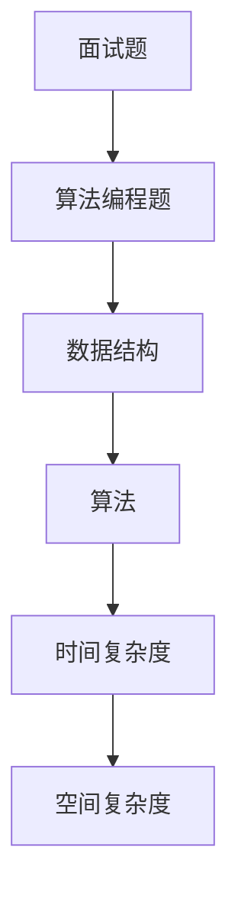

                 

# 2024华为社招面试题与算法编程题专业点评

> **关键词：华为社招、面试题、算法编程题、技术分析、面试准备**
> 
> **摘要：本文将深入分析2024年华为社招面试中常见的面试题和算法编程题，帮助读者了解面试要点、掌握解题思路，提升面试成功率。**

## 1. 背景介绍

### 1.1 目的和范围

本文旨在通过对2024年华为社招面试题和算法编程题的深入分析，帮助读者了解面试的重点难点，掌握解题技巧，提升面试成功率。文章将涵盖以下内容：

- 面试题型分析
- 算法编程题解析
- 面试技巧分享
- 面试准备策略

### 1.2 预期读者

- 准备参加华为社招的求职者
- 想提升算法编程能力的开发者
- 对华为面试流程和题型感兴趣的读者

### 1.3 文档结构概述

本文结构如下：

1. 背景介绍
2. 核心概念与联系
3. 核心算法原理 & 具体操作步骤
4. 数学模型和公式 & 详细讲解 & 举例说明
5. 项目实战：代码实际案例和详细解释说明
6. 实际应用场景
7. 工具和资源推荐
8. 总结：未来发展趋势与挑战
9. 附录：常见问题与解答
10. 扩展阅读 & 参考资料

### 1.4 术语表

#### 1.4.1 核心术语定义

- **社招**：指企业针对社会招聘的职位，面向社会公开征集求职者。
- **面试题**：指企业在招聘过程中，针对求职者的专业知识、技能和素质等方面的提问。
- **算法编程题**：指在面试过程中，要求求职者使用编程语言实现特定功能的题目。

#### 1.4.2 相关概念解释

- **数据结构**：存储数据的方式及其相互关系。
- **算法**：解决问题的方法或步骤。
- **时间复杂度**：算法执行时间与数据规模之间的关系。
- **空间复杂度**：算法所需存储空间与数据规模之间的关系。

#### 1.4.3 缩略词列表

- **社招**：社会招聘
- **算法**：Algorithm
- **数据结构**：Data Structure
- **时间复杂度**：Time Complexity
- **空间复杂度**：Space Complexity

## 2. 核心概念与联系

为了更好地理解本文的内容，我们需要先了解一些核心概念和它们之间的联系。以下是一个简化的Mermaid流程图，展示了面试中涉及的一些关键概念。



### 2.1 面试题

面试题是面试过程中最重要的组成部分。它们可以帮助企业评估求职者的专业知识、解决问题的能力、逻辑思维和沟通技巧。面试题通常包括以下几个方面：

- **基础知识**：如数据结构和算法的基础概念。
- **编程题**：如实现特定功能的代码。
- **行为题**：如描述如何解决问题。

### 2.2 算法编程题

算法编程题是面试中最具挑战性的一部分。它们要求求职者不仅具备扎实的编程基础，还需要具备良好的逻辑思维和问题解决能力。常见的算法编程题包括：

- **排序算法**：如快速排序、归并排序等。
- **查找算法**：如二分查找、哈希查找等。
- **图算法**：如最短路径算法、拓扑排序等。
- **动态规划**：如背包问题、最长公共子序列等。

### 2.3 数据结构

数据结构是算法的基础，它决定了数据存储和访问的方式。常见的有：

- **数组**：用于存储固定大小的数据集合。
- **链表**：用于存储动态大小的数据集合。
- **栈和队列**：用于模拟特定的操作序列。
- **树**：用于表示层次结构。
- **图**：用于表示网络结构。

### 2.4 算法

算法是解决问题的方法或步骤。它们可以根据实现方式和解决的问题类型进行分类。常见的有：

- **查找算法**：用于在数据集合中查找特定元素。
- **排序算法**：用于对数据集合进行排序。
- **图算法**：用于解决图相关的问题。
- **动态规划**：用于解决复杂的问题，通过将问题分解为子问题，并利用子问题的解来解决原问题。

### 2.5 时间复杂度和空间复杂度

时间复杂度和空间复杂度是评估算法性能的重要指标。它们分别表示算法执行时间和所需存储空间与数据规模之间的关系。常见的复杂度有：

- **O(1)**：常数时间复杂度。
- **O(n)**：线性时间复杂度。
- **O(log n)**：对数时间复杂度。
- **O(n^2)**：平方时间复杂度。
- **O(2^n)**：指数时间复杂度。

## 3. 核心算法原理 & 具体操作步骤

在面试中，算法编程题通常要求求职者使用特定的算法和数据结构解决问题。以下是一个简单的示例，说明如何使用快速排序算法解决一个排序问题。

### 3.1 快速排序算法原理

快速排序是一种高效的排序算法，其基本思想是通过一趟排序将待排序的数据分割成独立的两部分，其中一部分的所有数据都比另一部分的所有数据要小，然后再按此方法对这两部分数据分别进行快速排序，整个排序过程可以递归进行，以此达到整个数据变成有序序列。

### 3.2 快速排序具体操作步骤

以下是用伪代码实现的快速排序算法：

```pseudo
function quickSort(arr, low, high)
    if low >= high
        return

    pivot = arr[low + (high - low) / 2]  // 选择中间元素作为基准

    i = low
    j = high

    while i <= j
        while arr[i] < pivot
            i += 1
        while arr[j] > pivot
            j -= 1
        if i <= j
            swap(arr[i], arr[j])
            i += 1
            j -= 1

    if low < j
        quickSort(arr, low, j)

    if high > i
        quickSort(arr, i, high)
```

### 3.3 快速排序算法分析

- **时间复杂度**：平均情况下，快速排序的时间复杂度为O(n log n)。最坏情况下，时间复杂度为O(n^2)，但这种情况较少发生。
- **空间复杂度**：快速排序是一种原地排序算法，其空间复杂度为O(log n)。

## 4. 数学模型和公式 & 详细讲解 & 举例说明

### 4.1 数学模型

在算法中，数学模型和公式是解决问题的关键。以下是一些常见的数学模型和公式：

#### 4.1.1 欧几里得算法（辗转相除法）

欧几里得算法是一种求解最大公约数（GCD）的算法。其基本思想是通过反复用较小数去除较大数，然后用余数去除前一次的除数，直到余数为零，此时的除数即为最大公约数。

伪代码：

```pseudo
function GCD(a, b)
    while b ≠ 0
        temp = b
        b = a % b
        a = temp
    return a
```

#### 4.1.2 模运算

模运算是一种常见的数学运算，其结果称为模数。模运算的公式为：a % b = r，其中a和b为整数，r为模数。

#### 4.1.3 费波那契数列

费波那契数列是一个著名的数学序列，其定义如下：

- F(0) = 0
- F(1) = 1
- F(n) = F(n-1) + F(n-2)（n ≥ 2）

### 4.2 公式讲解

#### 4.2.1 快速排序的时间复杂度

快速排序的时间复杂度取决于基准选择和分区操作。假设每次分区都能将数组划分为近乎相等的两部分，那么时间复杂度为：

- 平均情况：O(n log n)
- 最坏情况：O(n^2)

#### 4.2.2 欧几里得算法的时间复杂度

欧几里得算法的时间复杂度为O(log n)，其中n为输入数。

#### 4.2.3 费波那契数列的时间复杂度

使用递归实现的费波那契数列的时间复杂度为O(2^n)。使用动态规划实现的费波那契数列的时间复杂度为O(n)。

### 4.3 举例说明

#### 4.3.1 求最大公约数

输入：a = 24, b = 36

使用欧几里得算法求解：

```pseudo
GCD(24, 36)
24 % 36 = 24
36 % 24 = 12
24 % 12 = 0
返回 12
```

最大公约数为12。

#### 4.3.2 快速排序

输入：arr = [5, 2, 9, 1, 5, 6]

选择中间元素5作为基准，进行分区：

- 小于5的元素：[2, 1, 6]
- 等于5的元素：[5]
- 大于5的元素：[9, 5]

递归地对小于5的元素和大于5的元素进行快速排序：

- 小于5的元素排序后：[1, 2, 6]
- 大于5的元素排序后：[5, 9]

合并结果，得到排序后的数组：[1, 2, 5, 5, 6, 9]。

#### 4.3.3 费波那契数列

输入：n = 5

使用递归实现的费波那契数列：

```pseudo
F(5) = F(4) + F(3)
F(4) = F(3) + F(2)
F(3) = F(2) + F(1)
F(2) = F(1) + F(0)
F(1) = 1
F(0) = 0

F(5) = 5
```

费波那契数列的第5个数为5。

## 5. 项目实战：代码实际案例和详细解释说明

为了更好地理解算法编程题的解题思路和实现方法，我们将通过一个实际的项目案例进行讲解。在这个项目中，我们将实现一个简单的购物车系统，要求用户能够添加商品、删除商品、清空购物车，并计算总价。

### 5.1 开发环境搭建

在开始项目之前，我们需要搭建一个合适的开发环境。以下是推荐的开发环境和工具：

- **编程语言**：Python
- **集成开发环境（IDE）**：PyCharm
- **版本控制系统**：Git
- **数据库**：SQLite（可选）

### 5.2 源代码详细实现和代码解读

以下是一个简单的购物车系统的源代码实现。我们将逐步讲解代码的各个部分。

```python
# shopping_cart.py

# 导入所需模块
import sqlite3

# 连接到SQLite数据库
conn = sqlite3.connect("shopping_cart.db")
cursor = conn.cursor()

# 创建商品表
cursor.execute('''CREATE TABLE IF NOT EXISTS items (
    id INTEGER PRIMARY KEY AUTOINCREMENT,
    name TEXT NOT NULL,
    price REAL NOT NULL)''')

# 创建购物车表
cursor.execute('''CREATE TABLE IF NOT EXISTS cart (
    id INTEGER PRIMARY KEY AUTOINCREMENT,
    item_id INTEGER NOT NULL,
    quantity INTEGER NOT NULL,
    FOREIGN KEY(item_id) REFERENCES items(id))''')

# 插入商品数据
cursor.execute("INSERT INTO items (name, price) VALUES ('苹果', 3.5)")
cursor.execute("INSERT INTO items (name, price) VALUES ('香蕉', 2.5)")
cursor.execute("INSERT INTO items (name, price) VALUES ('橙子', 4.0)")

# 提交更改并关闭数据库连接
conn.commit()
conn.close()

# 添加商品到购物车
def add_to_cart(item_id, quantity):
    conn = sqlite3.connect("shopping_cart.db")
    cursor = conn.cursor()

    cursor.execute("INSERT INTO cart (item_id, quantity) VALUES (?, ?)", (item_id, quantity))

    conn.commit()
    conn.close()

# 删除商品从购物车
def remove_from_cart(item_id):
    conn = sqlite3.connect("shopping_cart.db")
    cursor = conn.cursor()

    cursor.execute("DELETE FROM cart WHERE item_id = ?", (item_id,))

    conn.commit()
    conn.close()

# 清空购物车
def clear_cart():
    conn = sqlite3.connect("shopping_cart.db")
    cursor = conn.cursor()

    cursor.execute("DELETE FROM cart")

    conn.commit()
    conn.close()

# 计算购物车总价
def calculate_total():
    conn = sqlite3.connect("shopping_cart.db")
    cursor = conn.cursor()

    cursor.execute("SELECT items.name, items.price, cart.quantity FROM items INNER JOIN cart ON items.id = cart.item_id")
    rows = cursor.fetchall()

    total = 0
    for row in rows:
        total += row[1] * row[2]

    conn.close()
    return total

# 用户界面
def main():
    while True:
        print("\n购物车系统")
        print("1. 添加商品")
        print("2. 删除商品")
        print("3. 清空购物车")
        print("4. 计算总价")
        print("5. 退出")

        choice = input("请输入操作编号：")

        if choice == "1":
            item_id = int(input("请输入商品编号："))
            quantity = int(input("请输入购买数量："))
            add_to_cart(item_id, quantity)
            print("商品已添加到购物车。")

        elif choice == "2":
            item_id = int(input("请输入商品编号："))
            remove_from_cart(item_id)
            print("商品已从购物车中删除。")

        elif choice == "3":
            clear_cart()
            print("购物车已清空。")

        elif choice == "4":
            total = calculate_total()
            print(f"购物车总价：{total:.2f}元。")

        elif choice == "5":
            print("感谢使用购物车系统，再见！")
            break
        else:
            print("无效的操作编号，请重新输入。")

if __name__ == "__main__":
    main()
```

### 5.3 代码解读与分析

- **数据库连接与表创建**：我们首先使用SQLite数据库，创建商品表和购物车表。商品表用于存储商品信息（商品编号、名称和价格），购物车表用于存储购物车中的商品信息（商品编号、购买数量）。
- **商品添加**：`add_to_cart`函数用于将商品添加到购物车。它接受商品编号和购买数量作为参数，将商品信息插入到购物车表中。
- **商品删除**：`remove_from_cart`函数用于将商品从购物车中删除。它接受商品编号作为参数，从购物车表中删除对应的商品记录。
- **清空购物车**：`clear_cart`函数用于清空购物车。它删除购物车表中的所有记录。
- **计算总价**：`calculate_total`函数用于计算购物车的总价。它通过执行SQL查询，获取购物车中所有商品的信息，并计算总价。
- **用户界面**：`main`函数是程序的入口，用于与用户进行交互。用户可以通过选择不同的操作编号，执行添加商品、删除商品、清空购物车和计算总价等操作。

### 5.4 代码优化与改进

虽然上述代码实现了基本功能，但在实际项目中，我们还可以进行以下优化和改进：

- **异常处理**：在数据库操作中添加异常处理，确保程序在遇到错误时能够正确处理并恢复。
- **输入验证**：对用户输入进行验证，确保输入的数据类型和范围符合要求。
- **数据备份与恢复**：定期备份数据库，并在需要时进行数据恢复。
- **扩展功能**：添加商品分类、折扣策略等扩展功能，提高购物车系统的实用性。

## 6. 实际应用场景

购物车系统是一个常见的实际应用场景。除了在电商平台上使用，购物车系统还可以应用于以下场景：

- **线下商店**：线下商店可以使用购物车系统帮助用户管理购物清单。
- **食堂订餐**：食堂可以使用购物车系统帮助用户选择菜品并计算总价。
- **共享购物**：用户可以邀请朋友一起购买商品，通过购物车系统共享购物清单。

### 6.1 在线购物平台

在线购物平台是购物车系统最常见的应用场景。用户可以在购物平台上添加商品到购物车，随时查看购物车中的商品和总价，并进行结算。

#### 6.1.1 功能需求

- **商品展示**：展示所有可购买的商品，包括商品名称、价格、图片等信息。
- **商品搜索**：支持商品名称、分类等条件的搜索。
- **商品筛选**：支持按照价格、销量、评价等条件筛选商品。
- **商品详情**：展示商品详细信息，如规格、参数、用户评价等。
- **购物车管理**：添加、删除、修改购物车中的商品。
- **订单结算**：计算购物车总价，选择支付方式并提交订单。
- **用户评论**：用户可以对已购买的商品进行评价。

#### 6.1.2 技术架构

- **前端**：使用HTML、CSS和JavaScript实现用户界面，使用Vue.js或React等前端框架增强用户体验。
- **后端**：使用Python、Java或Node.js等后端技术实现服务器逻辑，使用Flask、Django或Spring Boot等框架。
- **数据库**：使用MySQL、PostgreSQL或MongoDB等数据库存储商品、用户和订单等信息。
- **支付系统**：集成支付宝、微信支付等第三方支付系统，实现在线支付功能。

### 6.2 线下商店购物车

线下商店可以使用购物车系统帮助用户管理购物清单。用户可以在收银台前添加商品到购物车，并随时查看购物车中的商品和总价。

#### 6.2.1 功能需求

- **商品展示**：展示所有可购买的商品，包括商品名称、价格、图片等信息。
- **商品筛选**：支持按照分类、价格等条件筛选商品。
- **购物车管理**：添加、删除、修改购物车中的商品。
- **商品详情**：展示商品详细信息，如规格、参数、库存等。
- **购物车结算**：计算购物车总价，生成购物清单并提交订单。
- **支付方式**：支持现金、信用卡、支付宝等支付方式。

#### 6.2.2 技术架构

- **前端**：使用HTML、CSS和JavaScript实现用户界面，使用Vue.js或React等前端框架增强用户体验。
- **后端**：使用Python、Java或Node.js等后端技术实现服务器逻辑，使用Flask、Django或Spring Boot等框架。
- **数据库**：使用MySQL、PostgreSQL或MongoDB等数据库存储商品、用户和订单等信息。
- **支付系统**：集成支付宝、微信支付等第三方支付系统，实现在线支付功能。

### 6.3 食堂订餐系统

食堂可以使用购物车系统帮助用户选择菜品、计算总价并提交订单。用户可以在食堂门前使用自助终端或手机APP添加菜品到购物车，并随时查看购物车中的菜品和总价。

#### 6.3.1 功能需求

- **菜品展示**：展示所有可订餐的菜品，包括菜品名称、价格、图片等信息。
- **菜品筛选**：支持按照分类、口味等条件筛选菜品。
- **购物车管理**：添加、删除、修改购物车中的菜品。
- **菜品详情**：展示菜品详细信息，如制作时间、营养成分等。
- **购物车结算**：计算购物车总价，生成订餐清单并提交订单。
- **支付方式**：支持现金、支付宝、微信支付等支付方式。

#### 6.3.2 技术架构

- **前端**：使用HTML、CSS和JavaScript实现用户界面，使用Vue.js或React等前端框架增强用户体验。
- **后端**：使用Python、Java或Node.js等后端技术实现服务器逻辑，使用Flask、Django或Spring Boot等框架。
- **数据库**：使用MySQL、PostgreSQL或MongoDB等数据库存储菜品、用户和订单等信息。
- **支付系统**：集成支付宝、微信支付等第三方支付系统，实现在线支付功能。

## 7. 工具和资源推荐

为了更好地准备华为社招面试，以下是一些学习资源、开发工具和框架的推荐。

### 7.1 学习资源推荐

#### 7.1.1 书籍推荐

- 《数据结构与算法分析》（Mark Allen Weiss）：系统地介绍了数据结构和算法的基本概念和实现方法。
- 《算法导论》（Thomas H. Cormen等）：经典算法教材，涵盖广泛的算法理论和应用。
- 《编程之美》（微软面试心得）：分享了微软面试官总结的编程面试经验和技巧。

#### 7.1.2 在线课程

- Coursera：提供多个与算法和数据结构相关的在线课程，适合自学。
- edX：有来自世界顶级大学的人工智能、计算机科学等课程，适合提升专业能力。
- Udemy：有许多实用的编程课程，包括Python、Java、数据结构等。

#### 7.1.3 技术博客和网站

- GeeksforGeeks：提供丰富的算法和数据结构教程，适合入门和进阶。
- LeetCode：提供大量的编程面试题，适合练习和提升解题能力。
- HackerRank：提供各种编程挑战，适合提高算法实现和解决问题的能力。

### 7.2 开发工具框架推荐

#### 7.2.1 IDE和编辑器

- PyCharm：一款功能强大的Python IDE，适合开发Python应用程序。
- IntelliJ IDEA：一款跨平台的Java IDE，适用于Java开发。
- Visual Studio Code：一款轻量级的跨平台编辑器，支持多种编程语言，适合快速开发和调试。

#### 7.2.2 调试和性能分析工具

- Debugging Tools for Windows：Windows平台下的调试工具，适用于C/C++程序调试。
- GDB：一款功能强大的Linux下调试工具，适用于C/C++、Go等程序调试。
- Java VisualVM：一款Java性能分析工具，适用于Java程序性能监控和调优。

#### 7.2.3 相关框架和库

- Flask：一款轻量级的Python Web框架，适用于快速开发Web应用程序。
- Django：一款全栈Python Web框架，适用于快速开发复杂的应用程序。
- Spring Boot：一款Java Web框架，适用于开发大型企业级应用程序。

### 7.3 相关论文著作推荐

#### 7.3.1 经典论文

- 《Introduction to Algorithms》（Thomas H. Cormen等）：经典算法教材，包含大量经典算法的详细分析和实现。
- 《Algorithms for Interviews》（Adnan Aziz）：一本关于算法面试的指南，涵盖了多个热门算法问题及其解决方案。

#### 7.3.2 最新研究成果

- 《Neural Networks and Deep Learning》（Ian Goodfellow等）：介绍深度学习和神经网络的基础知识。
- 《Algorithm Design and Analysis》（Nikhil Bansal）：讨论算法设计、分析和优化方法。

#### 7.3.3 应用案例分析

- 《A Case Study on Dynamic Programming》（Robert Sedgewick等）：通过案例研究，展示了动态规划在实际问题中的应用。
- 《A Case Study on Graph Algorithms》（Robert Sedgewick等）：通过案例研究，展示了图算法在实际问题中的应用。

## 8. 总结：未来发展趋势与挑战

### 8.1 发展趋势

- **人工智能的深入应用**：随着人工智能技术的快速发展，其在各个领域的应用将越来越广泛。
- **大数据分析**：随着数据的不断增长，如何高效地分析和利用大数据将成为未来的重要挑战。
- **云计算与边缘计算**：云计算和边缘计算的结合，将为用户提供更高效、更安全的计算服务。
- **物联网（IoT）**：物联网技术的普及，将带来新的应用场景和商业模式。

### 8.2 挑战

- **数据隐私与安全**：随着数据量的增加，如何保护用户隐私和数据安全成为重要挑战。
- **算法透明性与公平性**：算法的透明性和公平性成为社会关注的焦点，如何确保算法的公正性和透明性成为重要问题。
- **跨领域融合**：如何将不同领域的知识和技术进行有效融合，实现跨领域的创新和发展。

## 9. 附录：常见问题与解答

### 9.1 面试题常见问题

**Q1**：如何准备面试中的编程题？

**A1**：准备面试中的编程题，首先需要掌握常见的数据结构和算法，如数组、链表、栈、队列、排序算法、查找算法等。其次，要多做编程练习，熟悉常见的编程模式和技巧。最后，要熟悉编程语言的特性和语法，提高编码效率。

**Q2**：如何在面试中展示自己的编程能力？

**A2**：在面试中展示自己的编程能力，首先要保证代码的正确性和逻辑清晰。其次，要注重代码的可读性，使用合适的命名和注释。最后，要注重时间复杂度和空间复杂度的分析，展示自己对于算法性能的理解和优化能力。

### 9.2 算法编程题常见问题

**Q1**：如何解决排序问题？

**A1**：解决排序问题，可以选择合适的排序算法，如快速排序、归并排序、冒泡排序等。在解决排序问题时，要关注时间复杂度和空间复杂度，选择适合问题的算法。

**Q2**：如何解决查找问题？

**A1**：解决查找问题，可以选择合适的查找算法，如二分查找、哈希查找等。在解决查找问题时，要关注时间复杂度和空间复杂度，选择适合问题的算法。

### 9.3 面试准备常见问题

**Q1**：面试前需要做哪些准备？

**A1**：面试前需要做以下准备：

- 了解公司的业务和职位要求，准备相关的项目经验和技能点。
- 复习基础知识，如数据结构、算法、计算机网络等。
- 练习编程题，熟悉常见的编程模式和技巧。
- 准备一些常见的面试题和回答，如自我介绍、项目经历、行为面试等。

**Q2**：如何提高面试成功率？

**A2**：提高面试成功率，可以从以下几个方面入手：

- 提前了解公司文化和职位要求，展示自己的匹配度。
- 充分准备，熟悉自己的项目经验和技能点，展示自己的专业能力。
- 保持自信和冷静，积极回答问题，展示自己的沟通能力和团队合作能力。
- 注意细节，如着装、礼仪、时间管理等。

## 10. 扩展阅读 & 参考资料

- 《数据结构与算法分析》（Mark Allen Weiss）：[链接](https://book.douban.com/subject/1239964/)
- 《算法导论》（Thomas H. Cormen等）：[链接](https://book.douban.com/subject/25754714/)
- 《编程之美》（微软面试心得）：[链接](https://book.douban.com/subject/6532703/)
- Coursera：[链接](https://www.coursera.org/)
- edX：[链接](https://www.edx.org/)
- Udemy：[链接](https://www.udemy.com/)
- GeeksforGeeks：[链接](https://www.geeksforgeeks.org/)
- LeetCode：[链接](https://leetcode-cn.com/)
- HackerRank：[链接](https://www.hackerrank.com/)
- PyCharm：[链接](https://www.jetbrains.com/pycharm/)
- IntelliJ IDEA：[链接](https://www.jetbrains.com/idea/)
- Visual Studio Code：[链接](https://code.visualstudio.com/)
- Debugging Tools for Windows：[链接](https://docs.microsoft.com/en-us/windows-hardware/test/profiling/debugging-tools-for-windows)
- GDB：[链接](https://www.gnu.org/software/gdb/)
- Java VisualVM：[链接](https://www.oracle.com/java/technologies/javavirtualmachine/virtual-machine-tools.html)
- Flask：[链接](https://flask.palletsprojects.com/)
- Django：[链接](https://www.djangoproject.com/)
- Spring Boot：[链接](https://spring.io/projects/spring-boot)
- 《Introduction to Algorithms》（Thomas H. Cormen等）：[链接](https://book.douban.com/subject/1239964/)
- 《Neural Networks and Deep Learning》（Ian Goodfellow等）：[链接](https://www.deeplearningbook.org/)
- 《Algorithm Design and Analysis》（Nikhil Bansal）：[链接](https://www.amazon.com/Algorithm-Design-Analysis-Nikhil-Bansal/dp/1492045172)
- 《A Case Study on Dynamic Programming》（Robert Sedgewick等）：[链接](https://www.amazon.com/Case-Study-Dynamic-Programming-Introduction/dp/0201183088)
- 《A Case Study on Graph Algorithms》（Robert Sedgewick等）：[链接](https://www.amazon.com/Case-Study-Graph-Algorithms-Introduction/dp/020118307-X)

