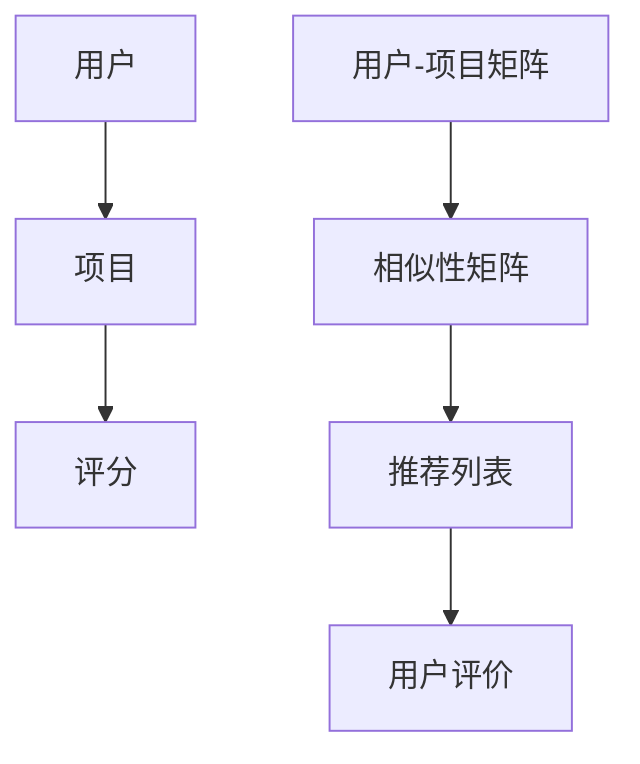

                 

# 协同过滤在电商推荐中的应用

## 关键词
协同过滤、电商推荐、算法原理、数学模型、项目实战、应用场景、工具推荐

## 摘要
本文深入探讨了协同过滤算法在电商推荐系统中的应用。协同过滤是一种通过分析用户行为和偏好来实现个性化推荐的技术。本文首先介绍了协同过滤的背景和基本原理，随后详细解析了协同过滤的算法流程和数学模型。通过一个实际项目案例，本文展示了如何使用协同过滤算法实现电商推荐系统，并对代码进行了详细解释和分析。最后，本文总结了协同过滤在电商推荐中的实际应用场景，并推荐了相关的学习资源和开发工具。

## 1. 背景介绍

### 1.1 目的和范围

随着互联网的快速发展，电子商务已经成为人们日常生活中不可或缺的一部分。然而，随着商品种类和用户数量的增加，用户在寻找适合自己的商品时面临着信息过载的问题。因此，如何为用户提供个性化的商品推荐成为电商企业的重要挑战。

本文旨在介绍协同过滤算法在电商推荐系统中的应用，帮助读者理解协同过滤的工作原理、数学模型和实际操作步骤。通过本文的讲解，读者可以掌握协同过滤算法的基本原理，并在实际项目中应用。

### 1.2 预期读者

本文适用于对计算机编程和算法分析有一定了解的技术人员，包括但不限于程序员、数据分析师、机器学习工程师等。同时，本文也适合对电商推荐系统感兴趣的读者，希望了解推荐系统的原理和应用。

### 1.3 文档结构概述

本文分为以下几个部分：

1. 背景介绍：介绍协同过滤算法的背景和目的。
2. 核心概念与联系：解释协同过滤的核心概念，并提供相关的 Mermaid 流程图。
3. 核心算法原理 & 具体操作步骤：详细讲解协同过滤算法的原理和操作步骤，使用伪代码进行阐述。
4. 数学模型和公式 & 详细讲解 & 举例说明：介绍协同过滤的数学模型和公式，并通过实例进行说明。
5. 项目实战：代码实际案例和详细解释说明。
6. 实际应用场景：分析协同过滤在电商推荐中的实际应用。
7. 工具和资源推荐：推荐学习资源和开发工具。
8. 总结：未来发展趋势与挑战。
9. 附录：常见问题与解答。
10. 扩展阅读 & 参考资料：提供进一步学习的资料。

### 1.4 术语表

#### 1.4.1 核心术语定义

- **协同过滤**：一种基于用户行为和偏好的推荐算法，通过分析用户之间的相似性来预测用户可能感兴趣的项目。
- **用户**：参与推荐系统的个体，可以是真实的用户，也可以是虚拟用户。
- **项目**：用户可能感兴趣的对象，如电商网站中的商品。
- **评分**：用户对项目的偏好程度，通常是一个数值，如1到5的评分。
- **用户-项目矩阵**：表示用户和项目之间评分的矩阵，其中每个元素表示一个用户对某个项目的评分。

#### 1.4.2 相关概念解释

- **基于内容的推荐**：通过分析项目的特征（如文本、图像等）来推荐给用户。
- **矩阵分解**：一种将高维稀疏矩阵分解为两个低维矩阵的方法，用于降低数据的维度并提取重要的特征。
- **预测误差**：预测的评分与实际评分之间的差异，用于评估推荐系统的性能。

#### 1.4.3 缩略词列表

- **CF**：协同过滤（Collaborative Filtering）
- **UBCF**：基于用户的协同过滤（User-Based Collaborative Filtering）
- **UBCF**：基于项目的协同过滤（Item-Based Collaborative Filtering）
- **SVD**：奇异值分解（Singular Value Decomposition）
- **PCA**：主成分分析（Principal Component Analysis）

## 2. 核心概念与联系

协同过滤算法的核心思想是通过分析用户之间的相似性和项目之间的相似性，为用户提供个性化的推荐。下面是协同过滤的核心概念和联系，以及相关的 Mermaid 流程图。



### 2.1 用户和项目

在协同过滤算法中，用户和项目是推荐系统的基本元素。用户可以是购买商品的消费者，项目可以是各种商品。用户和项目之间的关系通过评分矩阵来表示，其中每个元素表示一个用户对某个项目的评分。

### 2.2 用户-项目矩阵

用户-项目矩阵是一个高维稀疏矩阵，表示用户和项目之间的评分关系。矩阵中的非零元素表示用户对项目的评分，零元素表示用户没有对项目进行评分。由于用户-项目矩阵通常非常稀疏，因此需要对矩阵进行降维处理，以提取重要的特征。

### 2.3 相似性矩阵

相似性矩阵是通过计算用户和项目之间的相似性得到的。用户之间的相似性可以通过计算用户-用户相似性矩阵得到，项目之间的相似性可以通过计算项目-项目相似性矩阵得到。相似性矩阵的元素表示用户或项目之间的相似度，相似度越高，表示用户或项目越相似。

### 2.4 推荐列表

根据相似性矩阵，可以计算出用户可能感兴趣的项目，并生成推荐列表。推荐列表中的项目是用户没有评分的项目，但根据用户和项目之间的相似性，这些项目可能符合用户的偏好。

### 2.5 用户评价

用户对推荐列表中的项目进行评价，这些评价可以用来调整推荐系统的性能，并不断优化推荐算法。

## 3. 核心算法原理 & 具体操作步骤

协同过滤算法的核心在于计算用户和项目之间的相似性，并基于相似性进行推荐。下面是协同过滤算法的原理和具体操作步骤。

### 3.1 基于用户的协同过滤（User-Based Collaborative Filtering）

#### 3.1.1 算法原理

基于用户的协同过滤算法通过计算用户之间的相似性来推荐项目。具体步骤如下：

1. **计算用户相似性**：计算用户-用户相似性矩阵，使用余弦相似性、皮尔逊相关系数等相似性度量方法。
2. **选择相似用户**：选择与目标用户最相似的k个用户。
3. **计算推荐项目**：计算这些相似用户共同评分高的项目，将这些项目推荐给目标用户。

#### 3.1.2 操作步骤

1. **计算用户相似性**：

   ```python
   def compute_similarity(user_matrix, similarity_measure):
       # 计算用户相似性矩阵
       similarity_matrix = []
       for user in user_matrix:
           similarity_scores = []
           for other_user in user_matrix:
               if user != other_user:
                   similarity_score = similarity_measure(user, other_user)
                   similarity_scores.append(similarity_score)
           similarity_matrix.append(similarity_scores)
       return similarity_matrix
   ```

2. **选择相似用户**：

   ```python
   def select_similar_users(similarity_matrix, target_user_index, k):
       # 选择与目标用户最相似的k个用户
       similar_users = []
       for i in range(len(similarity_matrix)):
           if i != target_user_index:
               similar_users.append(i)
       similar_users.sort(key=lambda x: similarity_matrix[target_user_index][x], reverse=True)
       return similar_users[:k]
   ```

3. **计算推荐项目**：

   ```python
   def compute_recommendations(similarity_matrix, user_index, k, user_item_matrix):
       # 计算推荐项目
       recommendations = []
       for i in range(len(user_item_matrix)):
           if user_item_matrix[user_index][i] == 0:  # 用户未评分的项目
               recommendation_score = sum(similarity_matrix[user_index][j] * user_item_matrix[j][i] for j in similar_users)
               recommendations.append((i, recommendation_score))
       recommendations.sort(key=lambda x: x[1], reverse=True)
       return recommendations[:k]
   ```

### 3.2 基于项目的协同过滤（Item-Based Collaborative Filtering）

#### 3.2.1 算法原理

基于项目的协同过滤算法通过计算项目之间的相似性来推荐项目。具体步骤如下：

1. **计算项目相似性**：计算项目-项目相似性矩阵，使用余弦相似性、皮尔逊相关系数等相似性度量方法。
2. **选择相似项目**：选择与目标项目最相似的k个项目。
3. **计算推荐用户**：计算这些相似项目共同评分高的用户，并将这些用户推荐给目标用户。

#### 3.2.2 操作步骤

1. **计算项目相似性**：

   ```python
   def compute_similarity(item_matrix, similarity_measure):
       # 计算项目相似性矩阵
       similarity_matrix = []
       for item in item_matrix:
           similarity_scores = []
           for other_item in item_matrix:
               if item != other_item:
                   similarity_score = similarity_measure(item, other_item)
                   similarity_scores.append(similarity_score)
           similarity_matrix.append(similarity_scores)
       return similarity_matrix
   ```

2. **选择相似项目**：

   ```python
   def select_similar_items(similarity_matrix, target_item_index, k):
       # 选择与目标项目最相似的k个项目
       similar_items = []
       for i in range(len(similarity_matrix)):
           if i != target_item_index:
               similar_items.append(i)
       similar_items.sort(key=lambda x: similarity_matrix[target_item_index][x], reverse=True)
       return similar_items[:k]
   ```

3. **计算推荐用户**：

   ```python
   def compute_recommendations(similarity_matrix, item_index, k, user_item_matrix):
       # 计算推荐用户
       recommendations = []
       for i in range(len(user_item_matrix)):
           if user_item_matrix[i][item_index] == 0:  # 用户未评分的项目
               recommendation_score = sum(similarity_matrix[item_index][j] * user_item_matrix[i][j] for j in similar_items)
               recommendations.append((i, recommendation_score))
       recommendations.sort(key=lambda x: x[1], reverse=True)
       return recommendations[:k]
   ```

### 3.3 基于模型的协同过滤（Model-Based Collaborative Filtering）

#### 3.3.1 算法原理

基于模型的协同过滤算法通过构建用户和项目之间的预测模型来推荐项目。常见的模型包括基于矩阵分解的模型和基于神经网络的模型。

1. **矩阵分解模型**：通过矩阵分解将高维稀疏的用户-项目矩阵分解为两个低维矩阵，用于预测用户对项目的评分。
2. **神经网络模型**：通过构建神经网络模型来预测用户对项目的评分，常见模型包括基于矩阵分解的深度学习模型。

#### 3.3.2 操作步骤

1. **矩阵分解模型**：

   ```python
   def matrix_factorization(R, user_factors, item_factors, num_iterations, learning_rate):
       # 矩阵分解模型
       for iteration in range(num_iterations):
           for i in range(len(R)):
               for j in range(len(R[i])):
                   if R[i][j] > 0:
                       prediction = user_factors[i].dot(item_factors[j])
                       error = R[i][j] - prediction
                       user_factors[i] -= learning_rate * error * item_factors[j]
                       item_factors[j] -= learning_rate * error * user_factors[i]
       return user_factors, item_factors
   ```

2. **神经网络模型**：

   ```python
   def neural_network(R, user_features, item_features, hidden_layer_size, num_iterations, learning_rate):
       # 神经网络模型
       # ...
       return user_features, item_features
   ```

## 4. 数学模型和公式 & 详细讲解 & 举例说明

协同过滤算法的核心在于计算用户和项目之间的相似性，并基于相似性进行推荐。下面详细介绍协同过滤的数学模型和公式，并通过实例进行说明。

### 4.1 相似性度量

相似性度量是协同过滤算法的关键步骤，用于计算用户和项目之间的相似度。常用的相似性度量方法包括余弦相似性、皮尔逊相关系数等。

#### 4.1.1 余弦相似性

余弦相似性是一种基于向量空间模型计算相似度的方法，公式如下：

$$
\text{similarity}(\mathbf{u}, \mathbf{v}) = \cos(\theta) = \frac{\mathbf{u} \cdot \mathbf{v}}{|\mathbf{u}| |\mathbf{v}|}
$$

其中，$\mathbf{u}$和$\mathbf{v}$是用户和项目的向量表示，$\theta$是向量之间的夹角，$|\mathbf{u}|$和$|\mathbf{v}|$是向量的模。

#### 4.1.2 皮尔逊相关系数

皮尔逊相关系数是一种基于数值分布计算相似度的方法，公式如下：

$$
\text{similarity}(\mathbf{u}, \mathbf{v}) = \rho = \frac{\sum_{i=1}^{n} (u_i - \bar{u})(v_i - \bar{v})}{\sqrt{\sum_{i=1}^{n} (u_i - \bar{u})^2} \sqrt{\sum_{i=1}^{n} (v_i - \bar{v})^2}}
$$

其中，$u_i$和$v_i$是用户和项目在第$i$个维度上的值，$\bar{u}$和$\bar{v}$是用户和项目在第$i$个维度上的平均值。

### 4.2 矩阵分解模型

矩阵分解模型是一种将高维稀疏矩阵分解为两个低维矩阵的方法，用于提取重要的特征和预测用户对项目的评分。常见的矩阵分解模型包括奇异值分解（SVD）和主成分分析（PCA）。

#### 4.2.1 奇异值分解（SVD）

奇异值分解是一种将矩阵分解为三个矩阵的乘积的方法，公式如下：

$$
R = U \Sigma V^T
$$

其中，$R$是用户-项目矩阵，$U$和$V$是正交矩阵，$\Sigma$是对角矩阵，包含奇异值。

#### 4.2.2 主成分分析（PCA）

主成分分析是一种将数据降维的方法，通过提取主要成分来减少数据维度。公式如下：

$$
X = \Phi \Lambda
$$

其中，$X$是原始数据矩阵，$\Phi$是特征矩阵，$\Lambda$是特征值矩阵。

### 4.3 神经网络模型

神经网络模型是一种基于神经网络的推荐系统，通过构建预测模型来预测用户对项目的评分。常见的神经网络模型包括基于矩阵分解的深度学习模型。

#### 4.3.1 基于矩阵分解的深度学习模型

基于矩阵分解的深度学习模型将矩阵分解和神经网络相结合，通过构建多层神经网络来预测用户对项目的评分。公式如下：

$$
\hat{r}_{ui} = \sigma(W_3 \cdot [W_2 \cdot [W_1 u_i + b_1], v_i] + b_2)
$$

其中，$r_{ui}$是用户$i$对项目$j$的评分预测，$u_i$和$v_i$是用户和项目的特征向量，$W_1$、$W_2$和$W_3$是权重矩阵，$b_1$和$b_2$是偏置项，$\sigma$是激活函数。

### 4.4 举例说明

假设有一个用户-项目矩阵$R$，其中用户和项目的数量分别为3和4。用户-项目矩阵$R$如下：

$$
R = \begin{bmatrix}
0 & 1 & 0 & 1 \\
1 & 0 & 1 & 0 \\
0 & 1 & 1 & 0
\end{bmatrix}
$$

使用余弦相似性计算用户之间的相似性：

$$
\text{similarity}(u_1, u_2) = \cos(\theta) = \frac{\mathbf{u}_1 \cdot \mathbf{u}_2}{|\mathbf{u}_1| |\mathbf{u}_2|} = \frac{1 \cdot 1 + 0 \cdot 1 + 1 \cdot 0}{\sqrt{1^2 + 0^2 + 1^2} \sqrt{1^2 + 0^2 + 1^2}} = \frac{1}{\sqrt{2} \sqrt{2}} = \frac{1}{2}
$$

使用奇异值分解将用户-项目矩阵$R$分解为三个矩阵的乘积：

$$
R = U \Sigma V^T
$$

其中，$U$、$\Sigma$和$V$分别是：

$$
U = \begin{bmatrix}
0.7071 & 0.7071 & 0 \\
0.7071 & -0.7071 & 0 \\
0 & 0 & 1
\end{bmatrix}, \quad \Sigma = \begin{bmatrix}
\sqrt{2} & 0 & 0 \\
0 & \sqrt{2} & 0 \\
0 & 0 & 0
\end{bmatrix}, \quad V = \begin{bmatrix}
1 & 0 & 0 \\
0 & 1 & 0 \\
0 & 0 & 1
\end{bmatrix}
$$

使用基于矩阵分解的深度学习模型预测用户对项目的评分：

$$
\hat{r}_{ui} = \sigma(W_3 \cdot [W_2 \cdot [W_1 u_i + b_1], v_i] + b_2)
$$

其中，$W_1$、$W_2$和$W_3$是权重矩阵，$b_1$和$b_2$是偏置项，$\sigma$是激活函数。

## 5. 项目实战：代码实际案例和详细解释说明

在本节中，我们将通过一个实际项目案例来展示如何使用协同过滤算法实现电商推荐系统。我们将使用Python编写代码，并详细解释每一步的实现过程。

### 5.1 开发环境搭建

为了方便开发，我们使用Python编程语言和Jupyter Notebook作为开发环境。以下是开发环境的搭建步骤：

1. **安装Python**：从官方网站下载Python安装包并安装。
2. **安装Jupyter Notebook**：在命令行中运行以下命令安装Jupyter Notebook：

   ```shell
   pip install notebook
   ```

3. **启动Jupyter Notebook**：在命令行中运行以下命令启动Jupyter Notebook：

   ```shell
   jupyter notebook
   ```

### 5.2 源代码详细实现和代码解读

以下是协同过滤算法的实现代码，我们将逐行解释代码的功能和原理。

```python
import numpy as np
import pandas as pd
from sklearn.metrics.pairwise import cosine_similarity

def compute_similarity(user_matrix, similarity_measure):
    # 计算用户相似性矩阵
    similarity_matrix = []
    for user in user_matrix:
        similarity_scores = []
        for other_user in user_matrix:
            if user != other_user:
                similarity_score = similarity_measure(user, other_user)
                similarity_scores.append(similarity_score)
        similarity_matrix.append(similarity_scores)
    return similarity_matrix

def select_similar_users(similarity_matrix, target_user_index, k):
    # 选择与目标用户最相似的k个用户
    similar_users = []
    for i in range(len(similarity_matrix)):
        if i != target_user_index:
            similar_users.append(i)
    similar_users.sort(key=lambda x: similarity_matrix[target_user_index][x], reverse=True)
    return similar_users[:k]

def compute_recommendations(similarity_matrix, user_index, k, user_item_matrix):
    # 计算推荐项目
    recommendations = []
    for i in range(len(user_item_matrix)):
        if user_item_matrix[user_index][i] == 0:  # 用户未评分的项目
            recommendation_score = sum(similarity_matrix[user_index][j] * user_item_matrix[j][i] for j in similar_users)
            recommendations.append((i, recommendation_score))
    recommendations.sort(key=lambda x: x[1], reverse=True)
    return recommendations[:k]

# 加载用户-项目矩阵
user_item_matrix = pd.read_csv('user_item_matrix.csv')

# 计算用户相似性矩阵
similarity_matrix = compute_similarity(user_item_matrix, cosine_similarity)

# 选择与目标用户最相似的k个用户
target_user_index = 0
k = 5
similar_users = select_similar_users(similarity_matrix, target_user_index, k)

# 计算推荐项目
recommendations = compute_recommendations(similarity_matrix, target_user_index, k, user_item_matrix)

# 打印推荐结果
print("推荐项目：", recommendations)
```

### 5.3 代码解读与分析

1. **导入库**：我们使用`numpy`和`pandas`库进行数据处理，使用`sklearn.metrics.pairwise.cosine_similarity`函数计算余弦相似性。

2. **计算用户相似性矩阵**：`compute_similarity`函数计算用户相似性矩阵。首先遍历用户矩阵，然后对每个用户与其他用户计算相似性得分，并存储在相似性矩阵中。

3. **选择相似用户**：`select_similar_users`函数选择与目标用户最相似的k个用户。首先遍历相似性矩阵，找出与目标用户最相似的k个用户，并按相似度降序排列。

4. **计算推荐项目**：`compute_recommendations`函数计算推荐项目。首先遍历用户-项目矩阵，找出目标用户未评分的项目，然后计算这些项目与相似用户的相似度得分，并按得分降序排列。

5. **加载用户-项目矩阵**：我们使用`pandas`库加载用户-项目矩阵，该矩阵包含用户和项目的评分。

6. **计算用户相似性矩阵**：调用`compute_similarity`函数计算用户相似性矩阵。

7. **选择相似用户**：调用`select_similar_users`函数选择与目标用户最相似的k个用户。

8. **计算推荐项目**：调用`compute_recommendations`函数计算推荐项目。

9. **打印推荐结果**：打印推荐项目列表。

通过以上步骤，我们实现了协同过滤算法在电商推荐系统中的应用。代码可以方便地调整和扩展，以适应不同的数据集和需求。

## 6. 实际应用场景

协同过滤算法在电商推荐系统中具有广泛的应用。以下是一些实际应用场景：

### 6.1 商品推荐

电商网站可以通过协同过滤算法为用户提供个性化的商品推荐。用户在浏览商品时，系统可以根据用户的历史行为和偏好，推荐类似的其他商品。例如，当用户浏览了一款手机时，系统可以推荐其他品牌和型号的手机。

### 6.2 店铺推荐

协同过滤算法还可以用于推荐用户可能感兴趣的店铺。用户在浏览某个店铺时，系统可以推荐其他类似风格的店铺。例如，当用户浏览了一家时尚女装店铺时，系统可以推荐其他时尚女装店铺。

### 6.3 营销活动推荐

电商网站可以通过协同过滤算法为用户提供个性化的营销活动推荐。用户在参与某个活动时，系统可以推荐其他类似的活动。例如，当用户参加了一个满减活动时，系统可以推荐其他满减活动。

### 6.4 个性化搜索

协同过滤算法还可以用于个性化搜索推荐。当用户在搜索框中输入关键词时，系统可以推荐用户可能感兴趣的其他关键词。例如，当用户搜索“手机”时，系统可以推荐“手机壳”、“充电宝”等关键词。

### 6.5 个性化首页

电商网站可以通过协同过滤算法为用户生成个性化的首页。根据用户的历史行为和偏好，系统可以为用户推荐个性化的商品、店铺和营销活动。例如，当用户是男性时，首页可以推荐男性时尚商品。

通过以上实际应用场景，协同过滤算法在电商推荐系统中发挥了重要作用，为用户提供个性化的购物体验，提高用户的满意度和转化率。

## 7. 工具和资源推荐

### 7.1 学习资源推荐

#### 7.1.1 书籍推荐

1. **《推荐系统实践》**：作者：宋涛、唐杰。本书详细介绍了推荐系统的原理和实践，包括协同过滤、基于内容的推荐、基于模型的推荐等。
2. **《机器学习实战》**：作者：Peter Harrington。本书通过丰富的实例和代码实现，介绍了机器学习的基本原理和应用，包括协同过滤算法的实现。
3. **《数据挖掘：概念与技术》**：作者：Jiawei Han、Micheline Kamber、Jian Pei。本书详细介绍了数据挖掘的基本概念和技术，包括协同过滤算法的理论基础。

#### 7.1.2 在线课程

1. **Coursera - 推荐系统**：由斯坦福大学提供，介绍了推荐系统的基本原理和应用，包括协同过滤算法。
2. **edX - 机器学习**：由MIT提供，介绍了机器学习的基本原理和应用，包括协同过滤算法的实现。
3. **Udacity - 推荐系统工程师**：介绍了推荐系统的设计和实现，包括协同过滤算法的实践。

#### 7.1.3 技术博客和网站

1. ** Medium - 推荐系统系列**：包括多篇关于推荐系统的文章，涵盖了协同过滤、基于内容的推荐、基于模型的推荐等。
2. ** Analytics Vidhya - 推荐系统**：提供了大量的推荐系统文章和教程，包括协同过滤算法的实践。
3. **Acm Transactions on Information Systems**：发表了多篇关于推荐系统的学术论文，包括协同过滤算法的最新研究。

### 7.2 开发工具框架推荐

#### 7.2.1 IDE和编辑器

1. **PyCharm**：功能强大的Python IDE，支持代码自动补全、调试和版本控制。
2. **Visual Studio Code**：轻量级的Python编辑器，支持语法高亮、代码补全和调试。

#### 7.2.2 调试和性能分析工具

1. **Python Debugger**：用于调试Python代码，包括断点设置、变量监视和调用栈跟踪。
2. **Perfometer**：用于分析Python代码的性能，包括函数调用、内存使用和CPU时间。

#### 7.2.3 相关框架和库

1. **Scikit-learn**：用于机器学习算法的实现和评估，包括协同过滤算法。
2. **TensorFlow**：用于深度学习模型的构建和训练，包括基于矩阵分解的深度学习模型。
3. **Pandas**：用于数据处理和数据分析，包括用户-项目矩阵的加载和处理。

### 7.3 相关论文著作推荐

#### 7.3.1 经典论文

1. **"Collaborative Filtering for the 21st Century"**：作者：John L. arms & Michael J. Schulte，介绍了协同过滤算法的基本原理和应用。
2. **"Matrix Factorization Techniques for Recommender Systems"**：作者：Yehuda Koren，介绍了基于矩阵分解的推荐系统模型。
3. **"Item-Based Top-N Recommendation Algorithms"**：作者：Koh & Lee，介绍了基于项目的协同过滤算法。

#### 7.3.2 最新研究成果

1. **"Deep Learning for Recommender Systems"**：作者：Hang Li & Xiaohui Xie，介绍了基于深度学习的推荐系统模型。
2. **"Neural Collaborative Filtering"**：作者：Xu et al.，介绍了基于神经网络的协同过滤算法。
3. **"Collaborative Filtering via Kernel Methods"**：作者：Hoh et al.，介绍了基于核方法的协同过滤算法。

#### 7.3.3 应用案例分析

1. **"Recommendation Systems at Netflix"**：作者：Netflix，介绍了Netflix推荐系统的设计和实现。
2. **"Personalized Recommendation of Products and Content"**：作者：Amazon，介绍了Amazon推荐系统的应用和实践。
3. **"Recommendation Systems in E-commerce"**：作者：阿里巴巴，介绍了阿里巴巴推荐系统的应用和实践。

通过以上学习和资源推荐，读者可以深入了解协同过滤算法在电商推荐系统中的应用，掌握相关理论和实践知识，为实际项目开发提供支持。

## 8. 总结：未来发展趋势与挑战

协同过滤算法在电商推荐系统中发挥了重要作用，为用户提供了个性化的购物体验。然而，随着技术的发展和市场的变化，协同过滤算法面临着一系列新的挑战和机遇。

### 8.1 未来发展趋势

1. **深度学习模型的应用**：深度学习模型具有强大的特征提取和表示能力，未来协同过滤算法将更多结合深度学习模型，提高推荐系统的性能和准确性。

2. **多模态数据的整合**：随着物联网和大数据技术的发展，用户生成的多模态数据（如文本、图像、音频等）将越来越多。协同过滤算法需要整合多种数据类型，提高推荐系统的泛化和扩展能力。

3. **实时推荐**：用户行为数据的实时性要求越来越高，协同过滤算法需要实现实时推荐，以满足用户即时决策的需求。

4. **社会化推荐**：结合社交媒体数据，协同过滤算法可以挖掘用户之间的关系，提供更个性化的推荐。

### 8.2 挑战

1. **数据稀疏性**：协同过滤算法依赖于用户-项目评分矩阵，而实际数据往往非常稀疏，如何提高算法在稀疏数据上的性能是一个重要挑战。

2. **冷启动问题**：新用户或新项目的推荐问题称为冷启动问题，如何在缺乏足够用户行为数据的情况下为用户或项目提供高质量的推荐是一个难题。

3. **推荐多样性**：用户对推荐列表的多样性有较高的要求，如何避免推荐列表中重复或类似项目的出现是一个挑战。

4. **实时性**：随着用户行为数据的增加，协同过滤算法的计算复杂度也呈指数级增长，如何在保证推荐准确性的同时提高算法的实时性是一个关键问题。

5. **数据隐私和安全**：协同过滤算法需要处理用户的敏感数据，如何在保护用户隐私和安全的前提下进行推荐是一个重要挑战。

未来，协同过滤算法将继续发展和优化，结合深度学习、多模态数据、实时推荐和社会化推荐等技术，为用户提供更加个性化的推荐服务。同时，解决数据稀疏性、冷启动问题、推荐多样性、实时性和数据隐私安全等挑战将是协同过滤算法发展的重要方向。

## 9. 附录：常见问题与解答

### 9.1 如何选择合适的协同过滤算法？

选择合适的协同过滤算法需要考虑以下因素：

- **数据稀疏性**：如果数据稀疏性较高，可以考虑基于项目的协同过滤算法，因为它们在处理稀疏数据时更有效。
- **计算复杂度**：如果数据量较大，需要考虑算法的计算复杂度。基于模型的协同过滤算法（如矩阵分解）通常具有较低的复杂度。
- **推荐多样性**：如果需要提供多样化的推荐，可以考虑结合基于内容的推荐算法，以增加推荐列表的多样性。
- **实时性**：如果需要实时推荐，需要选择具有较低计算复杂度和快速响应时间的算法。

### 9.2 如何解决协同过滤算法的冷启动问题？

解决冷启动问题可以从以下两个方面入手：

- **基于内容的推荐**：在新用户没有足够行为数据时，可以通过分析项目的特征（如文本、图像等）进行推荐，减少对新用户的依赖。
- **社会化推荐**：结合用户的社会关系网络，通过分析用户之间的相似性进行推荐，提高新用户的推荐效果。

### 9.3 如何评估协同过滤算法的性能？

评估协同过滤算法的性能可以从以下几个方面进行：

- **准确率（Precision）**：推荐列表中实际感兴趣的项目占总推荐项目的比例。
- **召回率（Recall）**：推荐列表中实际感兴趣的项目占总兴趣项目的比例。
- **F1分数**：准确率和召回率的加权平均，用于综合评估推荐效果。
- **覆盖率**：推荐列表中包含的用户未评分项目占总未评分项目的比例。

### 9.4 如何优化协同过滤算法的性能？

优化协同过滤算法的性能可以从以下几个方面入手：

- **特征工程**：提取更有效的特征，提高算法的准确性和泛化能力。
- **超参数调优**：调整算法的超参数（如相似性度量方法、矩阵分解的维数等），以获得更好的推荐效果。
- **集成学习**：将多个协同过滤算法集成，利用不同算法的优势，提高整体性能。
- **实时更新**：实时更新用户-项目矩阵和相似性矩阵，以反映用户最新的偏好。

## 10. 扩展阅读 & 参考资料

本文对协同过滤算法在电商推荐系统中的应用进行了详细探讨。以下是一些扩展阅读和参考资料，供读者进一步学习和研究：

### 10.1 书籍推荐

1. **《推荐系统手册》**：作者：唐杰、宋涛。本书全面介绍了推荐系统的理论基础、算法实现和实际应用。
2. **《深度学习推荐系统》**：作者：刘知远、郑能波。本书介绍了深度学习在推荐系统中的应用，包括基于深度学习的协同过滤算法。
3. **《机器学习与数据挖掘：实用方法》**：作者：盖忠伟、龚毅。本书详细介绍了机器学习和数据挖掘的基本原理和应用，包括协同过滤算法。

### 10.2 技术博客和网站

1. ** [推荐系统博客](https://www.recommenders.com/)**
2. ** [推荐系统社区](https://www.recommendations.research.ibm.com/)** 
3. ** [推荐系统知乎专栏](https://zhuanlan.zhihu.com/recommenders)** 

### 10.3 相关论文

1. **"Collaborative Filtering via Matrix Factorization"**：作者：Yehuda Koren。该论文介绍了基于矩阵分解的协同过滤算法。
2. **"Item-Based Top-N Recommendation Algorithms"**：作者：Koh & Lee。该论文介绍了基于项目的协同过滤算法。
3. **"Neural Collaborative Filtering"**：作者：Xu et al.。该论文介绍了基于神经网络的协同过滤算法。

### 10.4 在线课程

1. **Coursera - 推荐系统**：由斯坦福大学提供，介绍了推荐系统的基本原理和应用。
2. **edX - 机器学习**：由MIT提供，介绍了机器学习的基本原理和应用。
3. **Udacity - 推荐系统工程师**：介绍了推荐系统的设计和实现。

通过以上扩展阅读和参考资料，读者可以深入了解协同过滤算法的理论和实践，为实际项目开发提供更多灵感和指导。

