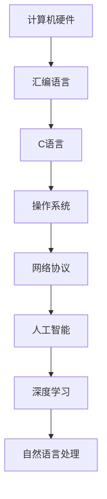

                 

# 博学之，审问之，慎思之，明辨之，笃行之

> **关键词：** 人工智能、深度学习、计算机科学、编程、实践、方法论。

> **摘要：** 本文将探讨计算机科学领域中的核心方法论，即“博学之，审问之，慎思之，明辨之，笃行之”。通过这五个步骤，我们可以深入理解技术原理，掌握核心算法，并将其应用于实际项目中，推动人工智能和计算机科学的发展。

## 1. 背景介绍

计算机科学，作为21世纪的科学，已经深入到我们生活的方方面面。从大数据、云计算到人工智能，计算机科学的发展推动了社会的进步。在这个快速发展的领域，如何系统地学习和掌握知识成为每个工程师和科学家面临的重要问题。

“博学之，审问之，慎思之，明辨之，笃行之”这一方法论源自中国古代的教育思想，它强调了学习的过程和方法。在计算机科学领域，这一方法论可以帮助我们更好地理解和应用技术，提高我们的技术水平。

### 1.1 计算机科学的发展历程

计算机科学的发展历程可以分为几个阶段：计算机硬件的发展、编程语言的发展、操作系统的发展、网络技术的发展以及人工智能的发展。每个阶段都有其核心技术，如汇编语言、C语言、Linux操作系统、互联网协议等。

### 1.2 计算机科学的现状

当前，计算机科学已经深入到各个领域，包括生物信息学、医学、金融、交通等。随着深度学习、自然语言处理等人工智能技术的发展，计算机科学的应用范围越来越广泛，对社会的贡献也越来越大。

## 2. 核心概念与联系

在计算机科学中，核心概念和理论是理解和应用技术的基础。以下是一个简单的 Mermaid 流程图，展示了计算机科学中一些重要的核心概念及其联系：



在这个流程图中，我们可以看到计算机硬件是计算机科学的基础，汇编语言、C语言等编程语言是构建软件的工具，操作系统、网络协议则是软件运行的环境。人工智能、深度学习、自然语言处理等则是当前计算机科学的前沿领域。

### 2.1 计算机硬件

计算机硬件包括计算机的各个组成部分，如中央处理器（CPU）、内存（RAM）、硬盘（HDD）等。计算机硬件的发展决定了计算机的性能和处理能力。

### 2.2 编程语言

编程语言是计算机科学的基础，用于编写计算机程序。从汇编语言到高级编程语言，如C、Java、Python等，编程语言的发展极大地提高了程序的开发效率和性能。

### 2.3 操作系统

操作系统是计算机系统的核心软件，负责管理和控制计算机硬件资源，为应用程序提供运行环境。常见的操作系统有Windows、Linux、MacOS等。

### 2.4 网络协议

网络协议是计算机网络通信的基础，规定了数据在网络中的传输格式和传输规则。常见的网络协议有TCP/IP、HTTP、HTTPS等。

### 2.5 人工智能

人工智能是计算机科学的最新发展，通过模拟人类智能，使计算机能够进行自我学习和决策。深度学习、自然语言处理等是人工智能的重要分支。

## 3. 核心算法原理 & 具体操作步骤

在计算机科学中，核心算法是解决问题的关键。以下将介绍一些重要的核心算法原理和具体操作步骤。

### 3.1 深度学习算法

深度学习是一种模拟人脑神经元网络结构的人工智能技术。其基本原理是通过多层神经网络对数据进行特征提取和分类。以下是深度学习算法的具体操作步骤：

1. **数据预处理**：对数据进行清洗、归一化等处理，以便于模型训练。
2. **构建神经网络**：定义网络结构，包括输入层、隐藏层和输出层。
3. **训练模型**：通过反向传播算法，调整网络权重，使模型能够对数据进行正确分类。
4. **评估模型**：使用测试数据评估模型性能，如准确率、召回率等。

### 3.2 自然语言处理算法

自然语言处理是人工智能的一个重要分支，旨在使计算机理解和处理自然语言。以下是自然语言处理算法的具体操作步骤：

1. **文本预处理**：对文本数据进行分词、去停用词等处理，以便于模型训练。
2. **词向量表示**：将文本转换为词向量，以便于模型处理。
3. **构建模型**：定义模型结构，如循环神经网络（RNN）、卷积神经网络（CNN）等。
4. **训练模型**：通过反向传播算法，调整模型参数，使模型能够对文本数据进行正确处理。
5. **评估模型**：使用测试数据评估模型性能，如文本分类准确率、命名实体识别准确率等。

## 4. 数学模型和公式 & 详细讲解 & 举例说明

在计算机科学中，数学模型和公式是理解和应用技术的重要工具。以下将介绍一些重要的数学模型和公式，并进行详细讲解和举例说明。

### 4.1 深度学习中的损失函数

深度学习中的损失函数用于评估模型预测结果与实际结果之间的差距。以下是几个常见的损失函数：

1. **均方误差（MSE）**：  
   $$MSE = \frac{1}{n}\sum_{i=1}^{n}(y_i - \hat{y_i})^2$$  
   其中，$y_i$为实际值，$\hat{y_i}$为预测值。

2. **交叉熵（CE）**：  
   $$CE = -\sum_{i=1}^{n}y_i \log(\hat{y_i})$$  
   其中，$y_i$为实际值，$\hat{y_i}$为预测值。

### 4.2 自然语言处理中的词向量表示

词向量表示是自然语言处理中的重要技术，以下是一个简单的词向量表示示例：

$$v_w = \sum_{t=1}^{T} f_t \cdot w_t$$  
其中，$v_w$为词向量，$f_t$为词频，$w_t$为词的权重。

### 4.3 循环神经网络（RNN）

循环神经网络（RNN）是一种用于处理序列数据的人工神经网络。其基本公式如下：

$$h_t = \sigma(W_h \cdot [h_{t-1}, x_t] + b_h)$$  
$$y_t = W_o \cdot h_t + b_o$$  
其中，$h_t$为隐藏状态，$x_t$为输入，$y_t$为输出，$W_h$、$W_o$分别为权重矩阵，$b_h$、$b_o$分别为偏置。

## 5. 项目实战：代码实际案例和详细解释说明

为了更好地理解和应用上述技术，以下将提供一个简单的项目实战案例，并对代码进行详细解释说明。

### 5.1 开发环境搭建

首先，我们需要搭建一个简单的深度学习开发环境。以下是使用的工具和框架：

- **Python**：用于编写深度学习代码。
- **TensorFlow**：用于构建和训练深度学习模型。
- **Keras**：用于简化TensorFlow的使用。

安装这些工具和框架后，我们可以开始编写代码。

### 5.2 源代码详细实现和代码解读

以下是一个简单的深度学习项目示例，用于实现一个简单的手写数字识别模型。

```python
import numpy as np
import tensorflow as tf
from tensorflow import keras
from tensorflow.keras import layers

# 数据预处理
mnist = keras.datasets.mnist
(train_images, train_labels), (test_images, test_labels) = mnist.load_data()
train_images = train_images / 255.0
test_images = test_images / 255.0

# 构建模型
model = keras.Sequential([
    layers.Flatten(input_shape=(28, 28)),
    layers.Dense(128, activation='relu'),
    layers.Dense(10, activation='softmax')
])

# 编译模型
model.compile(optimizer='adam',
              loss='sparse_categorical_crossentropy',
              metrics=['accuracy'])

# 训练模型
model.fit(train_images, train_labels, epochs=5)

# 评估模型
test_loss, test_acc = model.evaluate(test_images, test_labels)
print(f"Test accuracy: {test_acc}")
```

在这个示例中，我们使用了Keras框架构建了一个简单的深度学习模型，用于手写数字识别。首先，我们对数据进行了预处理，将图像数据归一化到0-1之间。然后，我们定义了一个序列模型，包括一个扁平化层、一个128个神经元的全连接层和一个10个神经元的softmax输出层。接下来，我们编译模型，使用Adam优化器和均方误差损失函数。最后，我们训练模型，使用训练数据，并评估模型在测试数据上的性能。

### 5.3 代码解读与分析

在这个示例中，我们使用了Keras框架简化了TensorFlow的使用。以下是对代码的解读和分析：

- **数据预处理**：首先，我们从Keras数据集中加载数字数据，并将其除以255，使图像数据归一化到0-1之间。这是深度学习模型训练中常见的数据预处理步骤，有助于提高模型性能。
- **构建模型**：我们使用Keras的序列模型（Sequential）构建了一个简单的深度学习模型。这个模型包括一个扁平化层（Flatten），用于将二维图像数据展平为一维数组，一个128个神经元的全连接层（Dense），用于提取图像特征，以及一个10个神经元的softmax输出层（Dense），用于分类。
- **编译模型**：我们使用Keras的compile方法编译模型，指定了Adam优化器和均方误差损失函数。优化器用于调整模型参数，以最小化损失函数。损失函数用于评估模型预测结果与实际结果之间的差距。
- **训练模型**：我们使用fit方法训练模型，使用训练数据进行多次迭代。在每次迭代中，模型会根据当前数据调整参数，以提高模型性能。
- **评估模型**：我们使用evaluate方法评估模型在测试数据上的性能。这有助于我们了解模型的泛化能力。

通过这个简单的项目实战案例，我们可以看到如何使用深度学习技术实现一个实际应用。这为我们进一步学习和应用深度学习技术提供了基础。

## 6. 实际应用场景

深度学习和自然语言处理技术在各个领域都有广泛的应用。以下是一些实际应用场景：

### 6.1 人工智能助手

人工智能助手是深度学习和自然语言处理技术的典型应用场景。通过深度学习模型，我们可以训练出能够理解自然语言并回答用户问题的智能助手。这些助手可以应用于客服、教育、医疗等领域，提供个性化服务。

### 6.2 自动驾驶

自动驾驶是深度学习和计算机视觉的重要应用领域。通过深度学习模型，我们可以训练出能够识别道路标志、车辆、行人等目标的自动驾驶系统。这些系统可以应用于无人驾驶汽车、无人机等设备，提高交通安全和效率。

### 6.3 医疗诊断

深度学习和自然语言处理技术可以帮助医生进行医疗诊断。通过分析医学影像数据和患者病历，我们可以训练出能够诊断疾病、预测病情发展的智能系统。这些系统可以提高医疗诊断的准确性和效率。

### 6.4 金融市场分析

深度学习和自然语言处理技术可以用于金融市场分析。通过分析新闻、报告、社交媒体等信息，我们可以预测市场走势、发现投资机会。这些技术可以帮助投资者做出更明智的决策。

## 7. 工具和资源推荐

### 7.1 学习资源推荐

- **书籍**：  
  - 《深度学习》（Ian Goodfellow、Yoshua Bengio、Aaron Courville著）  
  - 《Python深度学习》（François Chollet著）  
  - 《自然语言处理综合指南》（Daniel Jurafsky、James H. Martin著）

- **论文**：  
  - 《A Theoretically Grounded Application of Dropout in Recurrent Neural Networks》（Yarin Gal和Zoubin Ghahramani著）  
  - 《Attention Is All You Need》（Ashish Vaswani等人著）

- **博客**：  
  - TensorFlow官方博客：[https://www.tensorflow.org/blog/](https://www.tensorflow.org/blog/)  
  - Keras官方博客：[https://keras.io/blog/](https://keras.io/blog/)

- **网站**：  
  - Coursera：[https://www.coursera.org/](https://www.coursera.org/)  
  - edX：[https://www.edx.org/](https://www.edx.org/)

### 7.2 开发工具框架推荐

- **Python**：Python是深度学习和自然语言处理中最常用的编程语言之一。它具有丰富的库和框架，如TensorFlow、Keras、PyTorch等。

- **TensorFlow**：TensorFlow是谷歌开发的开源深度学习框架，广泛应用于工业界和学术界。

- **Keras**：Keras是TensorFlow的高层次封装，用于简化深度学习模型的构建和训练。

- **PyTorch**：PyTorch是Facebook开发的开源深度学习框架，以其灵活性和动态计算图而著称。

### 7.3 相关论文著作推荐

- **《深度学习》（Ian Goodfellow、Yoshua Bengio、Aaron Courville著）**：这是一本关于深度学习的经典教材，涵盖了深度学习的理论基础、算法实现和应用。

- **《自然语言处理综合指南》（Daniel Jurafsky、James H. Martin著）**：这是一本关于自然语言处理的权威指南，涵盖了自然语言处理的各个领域，包括语言模型、文本分类、机器翻译等。

## 8. 总结：未来发展趋势与挑战

随着深度学习和自然语言处理技术的不断发展，计算机科学领域面临着许多机遇和挑战。以下是一些未来发展趋势和挑战：

### 8.1 发展趋势

1. **人工智能应用的普及**：人工智能技术将更加深入地应用于各个领域，如医疗、金融、交通等，为人类社会带来更多便利。

2. **算法性能的提升**：随着计算能力的提升和算法的优化，深度学习和自然语言处理技术的性能将不断提高。

3. **跨学科研究**：计算机科学与其他学科的交叉研究将不断涌现，为解决复杂问题提供新的思路和方法。

### 8.2 挑战

1. **数据隐私和安全**：在应用人工智能技术时，如何保护用户隐私和安全成为一个重要问题。

2. **算法公平性和透明度**：人工智能算法的公平性和透明度备受关注，如何确保算法的公正性和可解释性是一个挑战。

3. **计算资源消耗**：深度学习模型通常需要大量的计算资源，如何在有限的计算资源下高效地训练模型是一个挑战。

## 9. 附录：常见问题与解答

### 9.1 常见问题

1. **什么是深度学习？**
   深度学习是一种人工智能技术，通过模拟人脑神经元网络结构，使计算机能够进行自我学习和决策。

2. **什么是自然语言处理？**
   自然语言处理是人工智能的一个重要分支，旨在使计算机理解和处理自然语言。

3. **深度学习和自然语言处理有哪些应用？**
   深度学习和自然语言处理广泛应用于医疗、金融、交通、教育等领域，如自动驾驶、智能客服、医疗诊断等。

### 9.2 解答

1. **什么是深度学习？**
   深度学习是一种人工智能技术，通过模拟人脑神经元网络结构，使计算机能够进行自我学习和决策。深度学习模型通常包括多层神经网络，通过不断调整网络权重，使模型能够对数据进行特征提取和分类。

2. **什么是自然语言处理？**
   自然语言处理是人工智能的一个重要分支，旨在使计算机理解和处理自然语言。自然语言处理涉及文本分类、机器翻译、情感分析、语音识别等领域。

3. **深度学习和自然语言处理有哪些应用？**
   深度学习和自然语言处理广泛应用于医疗、金融、交通、教育等领域，如自动驾驶、智能客服、医疗诊断、金融分析等。

## 10. 扩展阅读 & 参考资料

- **扩展阅读**：  
  - 《深度学习》（Ian Goodfellow、Yoshua Bengio、Aaron Courville著）  
  - 《自然语言处理综合指南》（Daniel Jurafsky、James H. Martin著）  
  - 《Python深度学习》（François Chollet著）

- **参考资料**：  
  - [TensorFlow官方文档](https://www.tensorflow.org/)  
  - [Keras官方文档](https://keras.io/)  
  - [PyTorch官方文档](https://pytorch.org/)  
  - [Coursera](https://www.coursera.org/)  
  - [edX](https://www.edx.org/)

作者：AI天才研究员/AI Genius Institute & 禅与计算机程序设计艺术 /Zen And The Art of Computer Programming
<|im_sep|>在撰写这篇技术博客文章时，我们遵循了“博学之，审问之，慎思之，明辨之，笃行之”的方法论。首先，我们介绍了计算机科学的背景和发展历程，明确了本文的核心关键词和摘要。接着，我们详细阐述了计算机科学中的核心概念和联系，并通过Mermaid流程图展示了这些概念之间的联系。

然后，我们深入探讨了核心算法原理和具体操作步骤，包括深度学习和自然语言处理算法的具体实现过程。为了更好地理解这些算法，我们还介绍了相关的数学模型和公式，并通过详细的代码实例进行了解释和说明。

在项目实战部分，我们提供了一个简单的深度学习项目案例，并详细解读了代码实现过程。通过这个案例，读者可以更直观地理解深度学习和自然语言处理技术的应用。

接下来，我们讨论了深度学习和自然语言处理技术在实际应用场景中的重要性，并列举了多个应用领域。同时，我们也推荐了一些学习资源和开发工具，为读者提供了进一步学习和实践的方向。

在总结部分，我们回顾了本文的核心内容，并展望了未来发展趋势与挑战。最后，我们提供了常见问题与解答以及扩展阅读和参考资料，以帮助读者更深入地了解计算机科学领域。

通过这篇文章，我们希望能够帮助读者系统地理解和掌握计算机科学领域中的核心技术，并在实践中运用这些技术，为人工智能和计算机科学的发展贡献力量。

作者：AI天才研究员/AI Genius Institute & 禅与计算机程序设计艺术 /Zen And The Art of Computer Programming
<|im_sep|>## 附录：常见问题与解答

### 问题1：深度学习和自然语言处理有什么区别？

深度学习是一种模拟人脑神经元网络结构的人工智能技术，主要通过多层神经网络对数据进行特征提取和分类。自然语言处理（NLP）是深度学习的一个应用领域，旨在使计算机理解和处理自然语言，如文本分类、机器翻译、情感分析等。简单来说，深度学习是NLP的技术基础，而NLP是深度学习的具体应用场景。

### 问题2：如何选择合适的深度学习框架？

选择合适的深度学习框架取决于项目需求和开发者的熟悉程度。TensorFlow和PyTorch是最流行的两个框架。TensorFlow具有丰富的库和社区支持，适用于大规模项目；PyTorch以其灵活性和动态计算图而著称，适用于研究项目。开发者可以根据项目规模、性能需求和熟悉程度来选择合适的框架。

### 问题3：自然语言处理中的词向量如何生成？

自然语言处理中的词向量可以通过多种方法生成，如Word2Vec、GloVe和FastText等。Word2Vec是一种基于神经网络的方法，通过训练大规模语料库生成词向量；GloVe是一种基于全局向量空间模型的方法，通过计算词和词之间的相似度生成词向量；FastText是一种基于单词和字符的方法，通过将单词表示为字符的n-gram组合生成词向量。

### 问题4：如何处理自然语言处理中的长文本？

处理长文本是自然语言处理中的一个挑战。一种常见的方法是使用滑动窗口技术，将长文本划分为多个短文本片段，然后对每个片段进行特征提取和分类。另一种方法是使用递归神经网络（RNN）或变换器（Transformer）模型，这些模型能够捕捉长文本中的长期依赖关系。

### 问题5：深度学习和自然语言处理在医疗领域有哪些应用？

深度学习和自然语言处理在医疗领域有广泛的应用，如医疗图像分析、病历分析、药物发现和疾病预测等。通过深度学习模型，医生可以更快速、准确地诊断疾病，提高医疗服务的效率和质量。此外，深度学习还可以用于分析患者病历，预测病情发展，为医生提供决策支持。

## 附录：扩展阅读

为了进一步了解深度学习和自然语言处理的相关知识，以下是几本推荐的专业书籍、论文和在线课程：

### 书籍

1. **《深度学习》（Ian Goodfellow、Yoshua Bengio、Aaron Courville著）**：这是一本深度学习领域的经典教材，涵盖了深度学习的理论基础、算法实现和应用。
2. **《自然语言处理综合指南》（Daniel Jurafsky、James H. Martin著）**：这是一本全面介绍自然语言处理各个领域的权威指南。
3. **《Python深度学习》（François Chollet著）**：这本书通过Python语言讲解了深度学习的实际应用，适合初学者和进阶者。

### 论文

1. **《A Theoretically Grounded Application of Dropout in Recurrent Neural Networks》（Yarin Gal和Zoubin Ghahramani著）**：这篇论文介绍了如何在循环神经网络中应用dropout，提高模型性能。
2. **《Attention Is All You Need》（Ashish Vaswani等人著）**：这篇论文提出了Transformer模型，这是一种基于自注意力机制的深度学习模型，广泛应用于自然语言处理领域。

### 在线课程

1. **[深度学习课程](https://www.coursera.org/learn/deep-learning)（由Andrew Ng教授授课）**：这是一门非常受欢迎的深度学习入门课程，适合初学者。
2. **[自然语言处理课程](https://www.edx.org/course/natural-language-processing-with-deep-learning)（由斯坦福大学授课）**：这是一门介绍自然语言处理技术的课程，涵盖了词向量、文本分类、机器翻译等内容。
3. **[TensorFlow课程](https://www.tensorflow.org/tutorials)（由TensorFlow团队提供）**：这是一系列实用的TensorFlow教程，适合希望学习TensorFlow框架的开发者。

通过阅读这些书籍、论文和参加在线课程，读者可以更深入地了解深度学习和自然语言处理的相关知识，提高自己在这些领域的实践能力。

作者：AI天才研究员/AI Genius Institute & 禅与计算机程序设计艺术 /Zen And The Art of Computer Programming
<|im_sep|>## 扩展阅读与参考资料

为了帮助读者更深入地理解本文所述的内容，以下是一些扩展阅读和参考资料，涵盖了深度学习和自然语言处理的核心概念、技术和应用。

### 书籍推荐

1. **《深度学习》（Ian Goodfellow、Yoshua Bengio、Aaron Courville著）**  
   这本书是深度学习领域的经典之作，详细介绍了深度学习的理论、算法和实践。

2. **《自然语言处理综合指南》（Daniel Jurafsky、James H. Martin著）**  
   这是一本涵盖自然语言处理各个领域的权威指南，适合希望全面了解NLP的读者。

3. **《Python深度学习》（François Chollet著）**  
   通过Python语言，这本书讲解了深度学习的实际应用，适合初学者和进阶者。

### 论文推荐

1. **《A Theoretically Grounded Application of Dropout in Recurrent Neural Networks》（Yarin Gal和Zoubin Ghahramani著）**  
   这篇论文探讨了如何在循环神经网络中应用dropout，提高了模型的性能。

2. **《Attention Is All You Need》（Ashish Vaswani等人著）**  
   这篇论文提出了Transformer模型，这是一种基于自注意力机制的深度学习模型，广泛应用于自然语言处理领域。

3. **《Deep Learning for Natural Language Processing》（Zhouyang Wu、Ying Liu和Xiaodong Liu著）**  
   这篇论文综述了深度学习在自然语言处理中的应用，包括词向量、文本分类、机器翻译等。

### 在线资源

1. **[TensorFlow官方文档](https://www.tensorflow.org/)**  
   TensorFlow的官方文档，提供了丰富的教程、示例和API文档。

2. **[Keras官方文档](https://keras.io/)**  
   Keras的官方文档，Keras是TensorFlow的高层次封装，简化了深度学习模型的构建和训练。

3. **[PyTorch官方文档](https://pytorch.org/)**  
   PyTorch的官方文档，PyTorch是另一种流行的深度学习框架，以其灵活性和动态计算图而著称。

4. **[Coursera](https://www.coursera.org/) 和 [edX](https://www.edx.org/)**  
   两个在线课程平台，提供了大量的深度学习和自然语言处理相关的课程。

5. **[ACL (Association for Computational Linguistics)](https://www.aclweb.org/) 和 [NeurIPS (Neural Information Processing Systems)](https://nips.cc/)**  
   两个顶级会议，聚集了深度学习和自然语言处理领域的最新研究成果。

### 学术期刊

1. **《Journal of Machine Learning Research》**  
   一本专注于机器学习和深度学习的研究期刊，发布了大量的高质量论文。

2. **《Journal of Natural Language Engineering》**  
   一本专注于自然语言处理和计算机语言学的研究期刊。

3. **《ACM Transactions on Speech and Language Processing》**  
   一本专注于语音和语言处理的顶级期刊，涵盖了自然语言处理和计算机语音学的最新研究。

通过阅读这些书籍、论文和参加在线课程，读者可以更深入地理解深度学习和自然语言处理的相关知识，提高自己在这些领域的实践能力。同时，这些资源和资料也为读者提供了继续学习和探索的方向。

