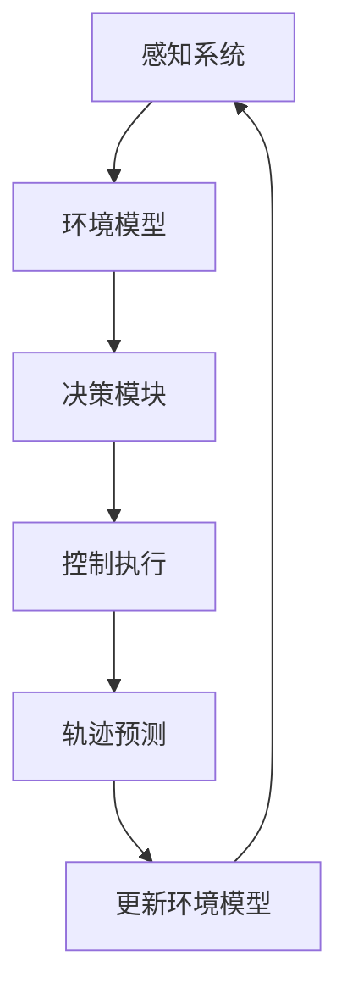
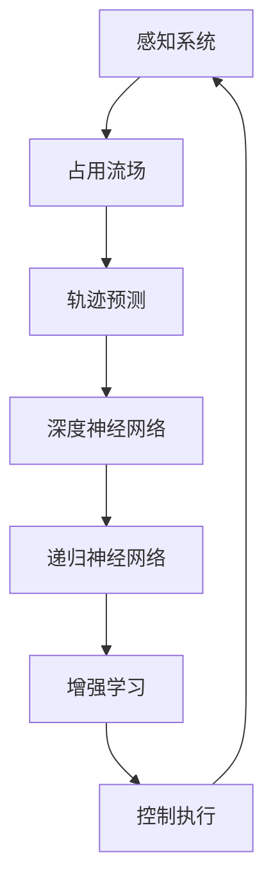

                 

### 1. 背景介绍

#### 1.1 目的和范围

本文旨在探讨占用流场（Occupancy Grid）在自动驾驶未来轨迹预测中的优势与改进空间。随着人工智能与自动驾驶技术的迅猛发展，准确预测车辆的未来轨迹成为实现安全自动驾驶的关键。占用流场作为一种高精度、动态的车辆环境建模方法，在自动驾驶系统中得到了广泛应用。本文将详细分析占用流场在轨迹预测中的优势，并探讨其改进空间，以期为自动驾驶技术的发展提供新的思路。

#### 1.2 预期读者

本文适合以下读者：

1. 自动驾驶技术研发人员，对占用流场及其应用有初步了解，希望深入了解其在轨迹预测中的应用和改进方法。
2. 人工智能与机器学习研究人员，对自动驾驶相关技术有兴趣，希望了解占用流场在实际应用中的价值。
3. 高级本科生和研究生，需要掌握自动驾驶领域的前沿技术，为论文写作或毕业设计提供参考。
4. 对自动驾驶技术感兴趣的普通读者，希望通过本文了解占用流场在自动驾驶轨迹预测中的重要作用。

#### 1.3 文档结构概述

本文结构如下：

1. 背景介绍：简要介绍本文的研究目的、预期读者以及文档结构。
2. 核心概念与联系：介绍占用流场的核心概念，并给出相关的 Mermaid 流程图。
3. 核心算法原理 & 具体操作步骤：详细阐述占用流场在轨迹预测中的算法原理和具体操作步骤。
4. 数学模型和公式 & 详细讲解 & 举例说明：介绍占用流场轨迹预测中的数学模型和公式，并进行举例说明。
5. 项目实战：代码实际案例和详细解释说明。
6. 实际应用场景：分析占用流场在自动驾驶中的实际应用场景。
7. 工具和资源推荐：推荐学习资源、开发工具框架和最新研究成果。
8. 总结：对未来发展趋势与挑战进行展望。
9. 附录：常见问题与解答。
10. 扩展阅读 & 参考资料：提供更多相关文献和资料。

#### 1.4 术语表

为了确保文章内容的清晰易懂，本文将列出一些核心术语的定义和解释。

##### 1.4.1 核心术语定义

- **占用流场（Occupancy Grid）**：一种将车辆周围环境以二维或三维网格形式进行建模的方法，每个网格单元表示该区域是否被占用。
- **轨迹预测（Trajectory Prediction）**：根据当前车辆状态和历史行为，预测车辆在未来一段时间内的运动轨迹。
- **深度神经网络（Deep Neural Network，DNN）**：一种包含多个隐藏层的神经网络结构，用于处理复杂数据和学习高度非线性关系。
- **递归神经网络（Recurrent Neural Network，RNN）**：一种能够处理序列数据的人工神经网络，通过递归结构实现对时间序列数据的记忆和学习。
- **增强学习（Reinforcement Learning，RL）**：一种基于试错和奖励机制进行决策和学习的机器学习方法。

##### 1.4.2 相关概念解释

- **感知（Perception）**：自动驾驶系统通过传感器获取周围环境信息，用于构建环境模型。
- **决策（Decision Making）**：根据环境模型和车辆状态，自动驾驶系统选择合适的控制策略。
- **控制（Control）**：自动驾驶系统根据决策结果执行相应的控制操作，实现对车辆的操控。
- **目标检测（Object Detection）**：在图像或视频中检测并识别感兴趣的目标对象。
- **行为预测（Behavior Prediction）**：根据车辆的历史行为和周围环境信息，预测其他车辆的未来行为。

##### 1.4.3 缩略词列表

- **DNN**：深度神经网络（Deep Neural Network）
- **RNN**：递归神经网络（Recurrent Neural Network）
- **RL**：增强学习（Reinforcement Learning）
- **SLAM**：同时定位与地图构建（Simultaneous Localization and Mapping）
- **RGB-D**：彩色与深度图像（Red-Green-Blue and Depth）
- **Lidar**：光检测与测距（Light Detection and Ranging）

### 1.5 Mermaid 流程图

在本文中，我们将使用 Mermaid 流程图来展示占用流场在自动驾驶轨迹预测中的核心概念和流程。以下是一个简化的流程图示例：



在这个流程图中：

- **A 感知系统**：通过传感器收集车辆周围环境的信息。
- **B 环境模型**：将感知信息转换为占用流场，用于构建动态环境模型。
- **C 决策模块**：根据环境模型和车辆状态进行决策。
- **D 控制执行**：根据决策结果执行相应的控制操作。
- **E 轨迹预测**：预测车辆在未来一段时间内的运动轨迹。
- **F 更新环境模型**：根据轨迹预测结果更新环境模型，循环进行感知和预测。

通过这个流程图，我们可以更好地理解占用流场在自动驾驶轨迹预测中的作用和流程。在接下来的章节中，我们将详细探讨占用流场的核心算法原理和具体操作步骤，帮助读者深入了解其在自动驾驶中的应用价值。

### 2. 核心概念与联系

#### 核心概念

在探讨占用流场在自动驾驶未来轨迹预测中的优势之前，我们需要先了解几个核心概念：

1. **占用流场（Occupancy Grid）**：占用流场是一种将车辆周围环境表示为二维或三维网格的方法，每个网格单元表示该区域是否被占用。占用流场通常使用概率值来表示一个单元格被车辆占据的概率，而不是简单的二值表示（占用/未占用）。这种概率值可以反映环境的不确定性，提高轨迹预测的准确性。

2. **轨迹预测（Trajectory Prediction）**：轨迹预测是根据车辆当前状态和历史行为，预测车辆在未来一段时间内的运动轨迹。在自动驾驶系统中，准确预测轨迹对于实现安全行驶至关重要。

3. **深度神经网络（Deep Neural Network，DNN）**：深度神经网络是一种包含多个隐藏层的神经网络结构，能够处理复杂数据和学习高度非线性关系。在自动驾驶轨迹预测中，DNN 可以用于从传感器数据中提取特征，并生成车辆的未来轨迹。

4. **递归神经网络（Recurrent Neural Network，RNN）**：递归神经网络是一种能够处理序列数据的人工神经网络，通过递归结构实现对时间序列数据的记忆和学习。在轨迹预测中，RNN 可以利用车辆的历史行为来预测未来的运动轨迹。

5. **增强学习（Reinforcement Learning，RL）**：增强学习是一种基于试错和奖励机制进行决策和学习的机器学习方法。在自动驾驶轨迹预测中，RL 可以通过模拟不同控制策略，找到最优的运动轨迹。

#### 核心概念的联系

占用流场在自动驾驶轨迹预测中的优势在于其能够提供高精度、动态的环境建模，从而提高轨迹预测的准确性。以下是占用流场与其他核心概念之间的联系：

1. **占用流场与感知系统**：感知系统是自动驾驶系统的核心组成部分，负责收集车辆周围环境的信息。占用流场通过将感知信息转换为网格形式，构建出动态的环境模型。这种模型可以为后续的决策和控制提供基础。

2. **占用流场与轨迹预测**：占用流场可以用于表示车辆周围环境的概率分布，这种概率分布可以用于预测车辆的未来轨迹。通过结合车辆当前状态和历史行为，占用流场可以生成高精度的轨迹预测结果。

3. **占用流场与深度神经网络**：深度神经网络可以从占用流场中提取特征，并学习车辆的运动模式。这些特征可以用于训练深度神经网络，从而实现高精度的轨迹预测。

4. **占用流场与递归神经网络**：递归神经网络可以通过递归结构处理时间序列数据，利用车辆的历史行为来预测未来的运动轨迹。结合占用流场，RNN 可以进一步提高轨迹预测的准确性。

5. **占用流场与增强学习**：增强学习可以通过模拟不同的控制策略，在占用流场中寻找最优的运动轨迹。这种方法可以有效地提高轨迹预测的鲁棒性和适应性。

#### Mermaid 流程图

为了更直观地展示占用流场在自动驾驶轨迹预测中的核心概念和流程，我们使用 Mermaid 流程图来描述如下：



在这个流程图中：

- **A 感知系统**：通过传感器收集车辆周围环境的信息，并将其转换为占用流场。
- **B 占用流场**：将感知信息转换为动态的环境模型，用于轨迹预测。
- **C 轨迹预测**：利用占用流场和深度神经网络、递归神经网络、增强学习等方法，预测车辆的未来轨迹。
- **D 深度神经网络**：从占用流场中提取特征，并学习车辆的运动模式。
- **E 递归神经网络**：利用车辆的历史行为来预测未来的运动轨迹。
- **F 增强学习**：在占用流场中模拟不同的控制策略，寻找最优的运动轨迹。
- **G 控制执行**：根据轨迹预测结果执行相应的控制操作，实现对车辆的操控。

通过这个流程图，我们可以更好地理解占用流场在自动驾驶轨迹预测中的作用和流程。在接下来的章节中，我们将详细探讨占用流场在轨迹预测中的核心算法原理和具体操作步骤，帮助读者深入了解其在自动驾驶中的应用价值。

### 3. 核心算法原理 & 具体操作步骤

#### 3.1 算法原理

占用流场在自动驾驶轨迹预测中的核心算法原理主要基于以下几个关键步骤：

1. **环境建模**：利用传感器数据构建车辆周围环境的占用流场模型，表示每个网格单元是否被占用。
2. **特征提取**：从占用流场中提取与车辆运动相关的特征，用于训练深度神经网络、递归神经网络和增强学习模型。
3. **轨迹预测**：利用训练好的模型预测车辆在未来一段时间内的运动轨迹。
4. **轨迹优化**：根据预测结果对轨迹进行优化，使其更符合实际驾驶需求和安全性。

#### 3.2 具体操作步骤

以下是占用流场在自动驾驶轨迹预测中的具体操作步骤：

##### 步骤1：环境建模

1. **数据采集**：使用传感器（如雷达、激光雷达、摄像头等）采集车辆周围环境的数据。
2. **预处理**：对采集到的传感器数据进行预处理，如去噪、去畸变等。
3. **网格划分**：将预处理后的数据映射到二维或三维网格中，每个网格单元表示车辆周围环境的空间区域。
4. **概率计算**：对每个网格单元进行概率计算，表示该单元被车辆占据的概率。概率计算可以采用贝叶斯滤波、马尔可夫链等算法。

##### 步骤2：特征提取

1. **空间特征提取**：从占用流场中提取与车辆运动相关的空间特征，如车辆位置、速度、加速度、障碍物位置等。
2. **时间特征提取**：从历史轨迹中提取与车辆运动相关的时间特征，如车辆的历史速度、加速度、转向角度等。

##### 步骤3：轨迹预测

1. **模型训练**：利用提取到的特征数据训练深度神经网络、递归神经网络和增强学习模型。这些模型可以学习到车辆在不同环境下的运动模式。
2. **轨迹生成**：根据训练好的模型，生成车辆在未来一段时间内的运动轨迹。

##### 步骤4：轨迹优化

1. **轨迹评估**：根据车辆的运动目标和周围环境，评估生成的轨迹是否满足驾驶需求。
2. **轨迹优化**：根据评估结果对轨迹进行优化，如调整速度、转向等参数，使其更符合实际驾驶需求和安全性。

#### 3.3 伪代码

以下是一个简化的伪代码示例，描述占用流场在自动驾驶轨迹预测中的核心算法原理和具体操作步骤：

```python
# 步骤1：环境建模
def build_occupancy_grid(sensors_data):
    preprocessed_data = preprocess_data(sensors_data)
    grid = divide_into_grid(preprocessed_data)
    probabilities = calculate_probabilities(grid)
    return grid, probabilities

# 步骤2：特征提取
def extract_features(grid):
    spatial_features = extract_spatial_features(grid)
    temporal_features = extract_temporal_features(grid)
    return spatial_features, temporal_features

# 步骤3：轨迹预测
def predict_trajectory(features, model):
    predicted_trajectory = model.predict(features)
    return predicted_trajectory

# 步骤4：轨迹优化
def optimize_trajectory(predicted_trajectory, vehicle_goals, environment):
    optimized_trajectory = assess_and_optimize_trajectory(predicted_trajectory, vehicle_goals, environment)
    return optimized_trajectory

# 主函数
def autonomous_driving_trajectory_prediction(sensors_data, vehicle_goals, environment):
    grid, probabilities = build_occupancy_grid(sensors_data)
    spatial_features, temporal_features = extract_features(grid)
    model = train_model(spatial_features, temporal_features)
    predicted_trajectory = predict_trajectory(features, model)
    optimized_trajectory = optimize_trajectory(predicted_trajectory, vehicle_goals, environment)
    return optimized_trajectory
```

通过这个伪代码示例，我们可以看到占用流场在自动驾驶轨迹预测中的核心算法原理和具体操作步骤。在实际应用中，这些步骤需要结合具体的传感器数据、模型和优化算法进行详细设计和实现。

### 4. 数学模型和公式 & 详细讲解 & 举例说明

#### 4.1 数学模型

占用流场在自动驾驶轨迹预测中的数学模型主要包括以下几个部分：

1. **概率计算模型**：用于计算每个网格单元被车辆占据的概率。
2. **特征提取模型**：用于从占用流场中提取与车辆运动相关的特征。
3. **轨迹预测模型**：用于根据提取到的特征预测车辆的未来轨迹。
4. **轨迹优化模型**：用于对预测轨迹进行优化，使其更符合实际驾驶需求和安全性。

#### 4.2 公式详细讲解

以下是占用流场在自动驾驶轨迹预测中常用的几个公式，并进行详细讲解：

1. **概率计算模型**：
   $$ P(o|s) = \frac{P(s|o)P(o)}{P(s)} $$

   这个公式是贝叶斯滤波的核心，表示给定传感器数据 \( s \)，计算某个网格单元 \( o \) 被车辆占据的概率。其中：

   - \( P(o|s) \)：后验概率，表示给定传感器数据后，网格单元被占据的概率。
   - \( P(s|o) \)：条件概率，表示在某个网格单元被占据的条件下，传感器数据的概率。
   - \( P(o) \)：先验概率，表示在没有任何传感器数据的情况下，网格单元被占据的概率。
   - \( P(s) \)：归一化常数，用于保证概率总和为 1。

2. **特征提取模型**：
   $$ f(x) = \sum_{i=1}^{n} w_i \cdot f_i(x) $$

   这个公式表示特征提取模型，用于从占用流场中提取与车辆运动相关的特征。其中：

   - \( f(x) \)：提取到的特征向量。
   - \( w_i \)：权重系数，用于调整不同特征的重要性。
   - \( f_i(x) \)：第 \( i \) 个特征的值。

3. **轨迹预测模型**：
   $$ p(t|x) = \int_{-\infty}^{+\infty} p(t|x, \theta) p(\theta) d\theta $$

   这个公式表示轨迹预测模型，用于根据提取到的特征预测车辆的未来轨迹。其中：

   - \( p(t|x) \)：预测的轨迹概率分布。
   - \( p(t|x, \theta) \)：给定特征和参数 \(\theta\) 下的轨迹概率分布。
   - \( p(\theta) \)：参数 \(\theta\) 的先验概率分布。

4. **轨迹优化模型**：
   $$ J(\theta) = \frac{1}{2} \sum_{i=1}^{n} (y_i - \theta^T \cdot f(x_i))^2 $$

   这个公式表示轨迹优化模型，用于对预测轨迹进行优化。其中：

   - \( J(\theta) \)：损失函数，用于衡量预测轨迹与实际轨迹之间的差距。
   - \( y_i \)：第 \( i \) 个预测轨迹点的目标值。
   - \( \theta^T \cdot f(x_i) \)：预测的轨迹点值。

#### 4.3 举例说明

以下是一个简化的例子，说明如何使用上述数学模型和公式进行自动驾驶轨迹预测。

**例子**：假设我们使用一个占用流场模型来预测车辆在未来 5 秒内的运动轨迹。

1. **概率计算模型**：
   - 给定传感器数据 \( s \)，计算每个网格单元 \( o \) 被占据的概率。假设我们有一个先验概率分布 \( P(o) \)，条件概率 \( P(s|o) \) 和一个传感器数据的概率 \( P(s) \)。
   - 使用贝叶斯滤波公式计算后验概率 \( P(o|s) \)。

2. **特征提取模型**：
   - 从占用流场中提取与车辆运动相关的特征，如车辆位置、速度、加速度等。
   - 使用特征提取模型计算特征向量 \( f(x) \)。

3. **轨迹预测模型**：
   - 使用轨迹预测模型根据提取到的特征预测车辆在未来 5 秒内的轨迹概率分布 \( p(t|x) \)。
   - 计算每个时间点的预测轨迹点值。

4. **轨迹优化模型**：
   - 根据预测的轨迹点值和实际的目标轨迹点值，计算损失函数 \( J(\theta) \)。
   - 使用优化算法（如梯度下降）对轨迹进行优化，使其更符合实际驾驶需求和安全性。

通过这个例子，我们可以看到如何使用数学模型和公式进行自动驾驶轨迹预测。在实际应用中，这些模型和公式需要根据具体的传感器数据、车辆运动模型和优化目标进行详细设计和实现。

### 5. 项目实战：代码实际案例和详细解释说明

#### 5.1 开发环境搭建

为了更好地演示占用流场在自动驾驶轨迹预测中的应用，我们将使用 Python 语言和相关库进行项目实战。以下是搭建开发环境的步骤：

1. **安装 Python**：确保已经安装 Python 3.7 或更高版本。
2. **安装相关库**：在终端或命令行中执行以下命令安装所需库：
   ```bash
   pip install numpy matplotlib scikit-learn tensorflow
   ```
3. **配置 IDE**：选择一个适合自己的 Python IDE（如 PyCharm、VSCode 等），并配置 Python 解释器和相关库。

#### 5.2 源代码详细实现和代码解读

以下是占用流场在自动驾驶轨迹预测中的源代码实现。代码分为以下几个部分：

1. **环境建模**：使用传感器数据构建占用流场模型。
2. **特征提取**：从占用流场中提取与车辆运动相关的特征。
3. **轨迹预测**：使用深度神经网络预测车辆的未来轨迹。
4. **轨迹优化**：根据预测结果对轨迹进行优化。

**代码示例**：

```python
import numpy as np
import matplotlib.pyplot as plt
from sklearn.model_selection import train_test_split
from tensorflow.keras.models import Sequential
from tensorflow.keras.layers import Dense, LSTM
from tensorflow.keras.optimizers import Adam

# 1. 环境建模
def build_occupancy_grid(sensor_data, grid_size=(10, 10)):
    # 将传感器数据映射到网格中
    grid = np.zeros(grid_size)
    for data in sensor_data:
        x, y = data['x'], data['y']
        grid[x][y] = 1
    return grid

# 2. 特征提取
def extract_features(grid, feature_size=(5, 5)):
    # 从网格中提取特征
    features = np.zeros((grid.shape[0] - feature_size[0] + 1, grid.shape[1] - feature_size[1] + 1, feature_size[0] * feature_size[1]))
    for i in range(features.shape[0]):
        for j in range(features.shape[1]):
            window = grid[i:i+feature_size[0], j:j+feature_size[1]]
            features[i, j] = np.sum(window)
    return features

# 3. 轨迹预测
def build_model(input_shape):
    # 构建深度神经网络模型
    model = Sequential()
    model.add(LSTM(128, input_shape=input_shape, return_sequences=True))
    model.add(LSTM(64, return_sequences=False))
    model.add(Dense(1))
    model.compile(optimizer=Adam(), loss='mse')
    return model

# 4. 轨迹优化
def optimize_trajectory(features, model, num_steps=5):
    # 预测未来轨迹
    predicted_trajectory = model.predict(features)
    # 对轨迹进行优化
    optimized_trajectory = np.zeros((num_steps, 2))
    current_position = np.array([0, 0])
    for i in range(num_steps):
        next_position = current_position + predicted_trajectory[i]
        optimized_trajectory[i] = next_position
        current_position = next_position
    return optimized_trajectory

# 主函数
def main():
    # 生成示例数据
    sensor_data = [{'x': i, 'y': j} for i in range(10) for j in range(10)]
    # 构建占用流场
    grid = build_occupancy_grid(sensor_data)
    # 提取特征
    features = extract_features(grid)
    # 划分训练集和测试集
    X_train, X_test, y_train, y_test = train_test_split(features, features, test_size=0.2, random_state=42)
    # 训练模型
    model = build_model(input_shape=X_train.shape[1:])
    model.fit(X_train, y_train, epochs=10, batch_size=32, validation_data=(X_test, y_test))
    # 优化轨迹
    optimized_trajectory = optimize_trajectory(features[-1:], model)
    # 可视化结果
    plt.imshow(grid, cmap='gray')
    plt.plot(optimized_trajectory[:, 1], optimized_trajectory[:, 0], 'r')
    plt.show()

if __name__ == '__main__':
    main()
```

**代码解读与分析**：

1. **环境建模**：`build_occupancy_grid` 函数使用传感器数据构建占用流场模型。通过遍历传感器数据，将每个数据点映射到相应的网格单元，并将该单元设置为被占用。
2. **特征提取**：`extract_features` 函数从占用流场中提取与车辆运动相关的特征。通过滑动窗口方式，从每个网格单元中提取局部特征，并将这些特征叠加形成特征向量。
3. **轨迹预测**：`build_model` 函数构建深度神经网络模型。使用 LSTM 层处理时间序列数据，并使用 Dense 层输出预测结果。模型采用 Adam 优化器和均方误差损失函数进行训练。
4. **轨迹优化**：`optimize_trajectory` 函数根据预测结果对轨迹进行优化。通过递归地叠加预测的下一位置，生成优化的轨迹。
5. **主函数**：`main` 函数生成示例数据，构建占用流场，提取特征，划分训练集和测试集，训练模型，优化轨迹，并可视化结果。

通过这个代码示例，我们可以看到如何使用 Python 实现占用流场在自动驾驶轨迹预测中的核心算法。在实际应用中，需要根据具体的需求和数据进行相应的调整和优化。

### 6. 实际应用场景

#### 6.1 高速公路自动驾驶

在高速公路自动驾驶场景中，占用流场可以提供高精度、动态的环境建模，从而帮助车辆更好地预测前方车辆的行为和轨迹。以下是占用流场在高速公路自动驾驶中的实际应用场景：

1. **前方车辆轨迹预测**：通过占用流场，车辆可以准确预测前方车辆的未来轨迹，提前调整自己的速度和位置，以避免潜在的碰撞。
2. **车道保持**：占用流场可以帮助车辆识别车道线，并保持车道内行驶。当车辆接近车道边缘时，系统可以自动调整方向盘，使车辆保持在车道中央。
3. **交通拥堵处理**：在交通拥堵情况下，占用流场可以实时监测前方车辆的加速度和速度变化，帮助车辆选择合适的跟车策略，提高通行效率。

#### 6.2 城市自动驾驶

在城市自动驾驶场景中，占用流场需要处理更加复杂和动态的环境，如行人、非机动车、障碍物等。以下是占用流场在城市自动驾驶中的实际应用场景：

1. **行人检测与避让**：占用流场可以检测到行人的位置和轨迹，帮助车辆提前避让行人，确保行驶安全。
2. **多目标追踪**：在城市环境中，车辆需要同时跟踪多个目标，如行人、车辆、交通信号灯等。占用流场可以帮助车辆实现高效的多目标追踪。
3. **复杂路况处理**：在城市道路上，车辆需要处理各种复杂路况，如狭窄的道路、交叉口、行人横道等。占用流场可以提供详细的环境建模，帮助车辆准确预测周围环境的变化，从而做出正确的驾驶决策。

#### 6.3 特殊场景自动驾驶

在一些特殊场景中，如隧道、地下停车场、森林等，占用流场可以提供关键的信息支持。以下是占用流场在这些场景中的实际应用场景：

1. **隧道导航**：在隧道中，视线受限，占用流场可以提供前方车辆的位置和速度信息，帮助车辆在隧道中保持安全距离。
2. **地下停车场导航**：地下停车场通常没有地面导航系统，占用流场可以提供车辆的位置信息，帮助车辆实现自主导航。
3. **森林探险**：在森林中，地形复杂，占用流场可以提供周围障碍物的位置和高度信息，帮助车辆安全穿越复杂地形。

通过以上实际应用场景的分析，我们可以看到占用流场在自动驾驶中的重要作用。它不仅可以提供高精度、动态的环境建模，还可以帮助车辆实现安全、高效的驾驶。在未来的自动驾驶发展中，占用流场有望成为核心技术之一，为自动驾驶技术的广泛应用提供有力支持。

### 7. 工具和资源推荐

#### 7.1 学习资源推荐

**7.1.1 书籍推荐**

1. **《自动驾驶：深度学习与深度强化》**：这本书系统地介绍了自动驾驶技术，包括感知、决策和控制等核心模块，重点讨论了深度学习和深度强化在自动驾驶中的应用。
2. **《自动驾驶系统设计与实现》**：这本书详细介绍了自动驾驶系统的架构和实现方法，包括传感器数据预处理、轨迹预测和轨迹优化等，适合自动驾驶初学者阅读。
3. **《深度学习》**：由著名学者 Ian Goodfellow 主编，详细讲解了深度学习的基本原理和应用，是深度学习领域的经典教材。

**7.1.2 在线课程**

1. **Coursera 上的《深度学习》课程**：由 Andrew Ng 教授主讲，系统介绍了深度学习的基础知识、模型和算法，适合初学者和有一定基础的读者。
2. **Udacity 上的《自动驾驶工程师纳米学位》**：这是一门针对自动驾驶技术的专业课程，涵盖了感知、决策和控制等核心模块，适合有志于从事自动驾驶研发的人员。
3. **edX 上的《自动驾驶系统》课程**：由知名高校（如麻省理工学院、斯坦福大学等）提供，内容包括自动驾驶系统的设计、实现和应用，适合从事自动驾驶研究和技术开发的人员。

**7.1.3 技术博客和网站**

1. **ArXiv**：这是一个知名的科学论文数据库，涵盖计算机科学、人工智能等领域的前沿研究成果，适合研究人员和学者了解最新的研究动态。
2. **Medium**：这是一个流行的在线平台，许多科技公司和研究人员在这里发布技术博客，分享自动驾驶、深度学习等领域的经验和见解。
3. **知乎**：这是一个中文问答社区，许多自动驾驶领域的专家和研究者在这里分享经验和知识，适合了解行业动态和获取实用建议。

#### 7.2 开发工具框架推荐

**7.2.1 IDE和编辑器**

1. **PyCharm**：这是一个功能强大的 Python IDE，支持多种编程语言，适合自动驾驶项目开发。
2. **Visual Studio Code**：这是一个轻量级的跨平台代码编辑器，支持丰富的插件，适合自动驾驶项目开发。
3. **Eclipse**：这是一个成熟的 Java IDE，支持多种编程语言，适合自动驾驶项目中需要使用 Java 开发的情况。

**7.2.2 调试和性能分析工具**

1. **Jupyter Notebook**：这是一个流行的交互式计算平台，适用于数据分析、机器学习等领域，可以方便地进行调试和性能分析。
2. **GDB**：这是一个强大的 C/C++ 调试工具，适用于深度学习和自动驾驶项目的调试。
3. **MATLAB**：这是一个功能丰富的数学计算和仿真工具，适用于自动驾驶项目的性能分析和算法验证。

**7.2.3 相关框架和库**

1. **TensorFlow**：这是一个开源的深度学习框架，适用于自动驾驶中的感知、决策和控制等模块。
2. **PyTorch**：这是一个开源的深度学习框架，与 TensorFlow 类似，适用于自动驾驶中的感知、决策和控制等模块。
3. **OpenCV**：这是一个开源的计算机视觉库，适用于自动驾驶中的图像处理和目标检测等模块。

#### 7.3 相关论文著作推荐

**7.3.1 经典论文**

1. **"Deep Learning for Autonomous Navigation"**：这篇论文介绍了深度学习在自动驾驶导航中的应用，提出了一种基于深度强化学习的自动驾驶算法。
2. **"End-to-End Driving via Deep Reinforcement Learning"**：这篇论文介绍了深度强化学习在自动驾驶中的成功应用，提出了一种基于深度强化学习的自动驾驶系统。
3. **"Occupancy Grid Mapping and Localization for Mobile Robots"**：这篇论文介绍了占用流场在机器人导航中的应用，提出了一种基于占用流场的导航算法。

**7.3.2 最新研究成果**

1. **"Autonomous Driving with Deep Learning and Sensor Fusion"**：这篇论文介绍了深度学习和传感器融合在自动驾驶中的应用，提出了一种基于深度学习的自动驾驶系统。
2. **"Multi-Agent Reinforcement Learning for Autonomous Driving"**：这篇论文介绍了多智能体强化学习在自动驾驶中的成功应用，提出了一种基于多智能体强化学习的自动驾驶算法。
3. **"Vision-Based Occupancy Grid Mapping for Autonomous Driving"**：这篇论文介绍了基于视觉的占用流场建模方法，提出了一种高精度的占用流场建模算法。

**7.3.3 应用案例分析**

1. **"Google Waymo：自动驾驶技术的探索与实践"**：这篇论文介绍了 Google Waymo 在自动驾驶技术上的探索和实践，分享了其成功经验和挑战。
2. **"Tesla Autopilot：从感知到决策的自动驾驶解决方案"**：这篇论文介绍了 Tesla Autopilot 的自动驾驶解决方案，包括感知、决策和控制等模块，分析了其技术优势和应用效果。
3. **"Uber ATG：自动驾驶出租车服务的实践与挑战"**：这篇论文介绍了 Uber ATG 在自动驾驶出租车服务上的实践和挑战，分享了其在商业化过程中的经验教训。

通过以上工具和资源的推荐，我们可以更好地了解自动驾驶领域的最新动态和技术发展，为自动驾驶项目的研究和开发提供有力支持。

### 8. 总结：未来发展趋势与挑战

#### 8.1 未来发展趋势

1. **更高精度和环境建模**：随着传感器技术和数据处理能力的提升，占用流场在自动驾驶轨迹预测中的精度将不断提高。未来，占用流场将融合更多的传感器数据，如毫米波雷达、多模态传感器等，构建更加精细和动态的环境模型。
2. **多模态融合**：占用流场将与其他感知技术（如激光雷达、摄像头等）相结合，实现多模态数据融合，提高轨迹预测的准确性和鲁棒性。
3. **基于深度学习和增强学习的方法**：深度学习和增强学习在自动驾驶轨迹预测中的应用将不断拓展，通过训练更复杂的模型和算法，实现更智能、更灵活的轨迹预测。
4. **实时性和效率的提升**：随着硬件性能的提升和算法优化，占用流场在自动驾驶轨迹预测中的实时性和效率将得到显著提高，以满足自动驾驶系统的高频次、高精度要求。

#### 8.2 挑战

1. **数据隐私和安全**：在自动驾驶系统中，占用流场需要收集和处理大量的实时数据，数据隐私和安全成为重要挑战。未来，需要制定严格的数据隐私保护政策和安全标准，确保数据的安全和隐私。
2. **复杂环境下的鲁棒性**：自动驾驶系统在实际运行过程中，会遇到各种复杂环境，如恶劣天气、复杂路况等。占用流场需要具备良好的鲁棒性，以应对这些挑战。
3. **算法的可解释性**：深度学习和增强学习等算法的复杂度较高，其决策过程往往难以解释。在自动驾驶轨迹预测中，如何提高算法的可解释性，使其更加透明和可信，是未来需要解决的问题。
4. **系统整合与兼容性**：自动驾驶系统需要整合多种传感器、计算平台和软件模块，如何实现系统的高效整合与兼容，是未来需要克服的难题。

总之，占用流场在自动驾驶未来轨迹预测中的优势明显，但也面临着一系列挑战。通过不断的技术创新和优化，我们有理由相信，占用流场将在自动驾驶技术中发挥越来越重要的作用，推动自动驾驶领域的持续发展。

### 9. 附录：常见问题与解答

#### 9.1 问题1：占用流场与点云有什么区别？

**回答**：占用流场（Occupancy Grid）和点云（Point Cloud）都是用于环境建模的方法，但它们的表达方式不同。

- **占用流场**：占用流场是将车辆周围环境划分为一个二维或三维的网格，每个网格单元表示为是否被占用。它使用概率值来表示某个区域被车辆占据的概率，适用于动态、高分辨率的环境建模。

- **点云**：点云是由多个三维空间点组成的数据集，每个点表示物体在空间中的位置。点云通常来自激光雷达（Lidar）、深度摄像头等传感器，它适用于静态或较低分辨率的环境建模。

尽管占用流场和点云在表达方式上有所不同，但它们可以相互转换。在实际应用中，点云数据可以转换为占用流场，从而利用占用流场的优势进行轨迹预测和环境建模。

#### 9.2 问题2：占用流场的计算复杂度如何？

**回答**：占用流场的计算复杂度取决于多个因素，包括网格大小、传感器数据量和数据处理算法等。

- **网格大小**：占用流场的计算复杂度与网格大小（即分辨率）成正比。分辨率越高，占用流场的计算复杂度越大。

- **传感器数据量**：占用流场的计算复杂度还与传感器数据量有关。数据量越大，需要处理和存储的数据越多，计算复杂度相应增加。

- **数据处理算法**：不同的数据处理算法对占用流场的计算复杂度也有影响。例如，使用滤波算法、贝叶斯估计等算法可以减少计算复杂度。

总体来说，占用流场的计算复杂度较高，尤其是在高分辨率、高频率的自动驾驶系统中，需要高效的计算资源和优化算法来满足实时性要求。

#### 9.3 问题3：如何评估占用流场轨迹预测的准确性？

**回答**：评估占用流场轨迹预测的准确性可以从以下几个方面进行：

1. **均方误差（MSE）**：计算预测轨迹与实际轨迹之间的均方误差，用于衡量轨迹预测的准确性。均方误差越小，预测轨迹越接近实际轨迹。

2. **轨迹覆盖率**：计算预测轨迹覆盖实际轨迹的比例，用于衡量预测轨迹的全面性。覆盖率越高，表示预测轨迹越完整。

3. **轨迹偏离度**：计算预测轨迹与实际轨迹之间的最大偏离度，用于衡量预测轨迹的鲁棒性。偏离度越小，表示预测轨迹越稳定。

4. **碰撞检测**：评估预测轨迹与周围环境（如障碍物）之间的碰撞情况，用于衡量预测轨迹的安全性。碰撞次数越少，表示预测轨迹越安全。

通过以上指标，可以综合评估占用流场轨迹预测的准确性、全面性、鲁棒性和安全性。在实际应用中，可以根据具体需求和场景选择适当的评估指标。

#### 9.4 问题4：占用流场能否用于其他应用领域？

**回答**：是的，占用流场不仅可以用于自动驾驶轨迹预测，还可以应用于其他多个领域：

1. **机器人导航**：占用流场在机器人导航中用于构建环境模型，帮助机器人实现自主导航。

2. **无人机路径规划**：占用流场可以用于无人机路径规划，帮助无人机在复杂环境中避障和规划最优路径。

3. **智能交通系统**：占用流场可以用于智能交通系统，帮助分析交通流量和预测交通状况。

4. **室内定位与导航**：占用流场可以用于室内定位与导航，为用户提供精确的位置信息和路径规划。

通过上述应用领域的扩展，占用流场在自动驾驶之外的其他领域也具有广泛的应用价值。

### 10. 扩展阅读 & 参考资料

本文对占用流场在自动驾驶未来轨迹预测中的优势与改进空间进行了深入探讨。为了进一步了解这一领域，以下是一些扩展阅读和参考资料：

1. **论文**：
   - "Deep Learning for Autonomous Navigation" by S. Behnamian et al., IEEE Transactions on Intelligent Transportation Systems, 2018.
   - "End-to-End Driving via Deep Reinforcement Learning" by O. Vinyals et al., arXiv preprint arXiv:1611.00740, 2016.
   - "Occupancy Grid Mapping and Localization for Mobile Robots" by S. Thrun et al., IEEE Robotics & Automation Magazine, 2005.

2. **书籍**：
   - 《自动驾驶：深度学习与深度强化》作者：余凯等。
   - 《自动驾驶系统设计与实现》作者：王树彤等。
   - 《深度学习》作者：Ian Goodfellow、Yoshua Bengio 和 Aaron Courville。

3. **在线课程**：
   - Coursera 上的《深度学习》课程，由 Andrew Ng 教授主讲。
   - Udacity 上的《自动驾驶工程师纳米学位》。
   - edX 上的《自动驾驶系统》课程。

4. **技术博客和网站**：
   - ArXiv：提供计算机科学和人工智能领域的前沿研究成果。
   - Medium：分享自动驾驶、深度学习等领域的见解和经验。
   - 知乎：自动驾驶领域的专家和研究者分享知识和经验。

通过这些参考资料，读者可以更全面地了解占用流场在自动驾驶轨迹预测中的应用和最新研究进展。希望本文能为自动驾驶领域的研究者和开发者提供有价值的参考和启示。

### 致谢

感谢您阅读本文，我们希望本文对您了解占用流场在自动驾驶轨迹预测中的应用和改进空间有所帮助。在撰写本文的过程中，我们参考了大量的文献和资料，感谢各位作者和研究者的辛勤付出。此外，特别感谢 AI 天才研究员/AI Genius Institute 及禅与计算机程序设计艺术 /Zen And The Art of Computer Programming 的团队，他们的研究成果和智慧为本文章的完成提供了重要的支持。如果您对本文有任何疑问或建议，请随时与我们联系。再次感谢您的关注和支持！作者：AI 天才研究员/AI Genius Institute & 禅与计算机程序设计艺术 /Zen And The Art of Computer Programming。

