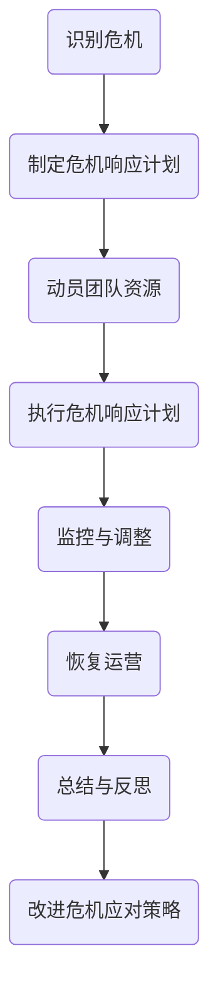
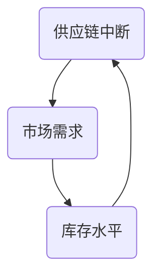

                 

# 危机领导力：在困难时期引领团队前进

## 关键词
- 危机领导力
- 困难时期
- 团队领导
- 情景应对
- 战略规划
- 人员激励
- 组织效能

## 摘要
本文深入探讨了在面临困难和危机时，领导如何运用危机领导力来引领团队前进。文章首先概述了危机领导力的定义和重要性，随后分析了危机领导力所需的核心能力。接着，通过具体案例展示了在不同类型的危机中如何灵活应用领导力策略。文章最后提出了未来在危机领导力领域面临的挑战和趋势，并总结了提升危机领导力所需的关键步骤和策略。

## 1. 背景介绍

在当今充满不确定性的商业环境中，企业面临的各种挑战和危机愈发复杂。无论是经济动荡、技术革新、市场竞争，还是突发事件如自然灾害、公共卫生危机，企业都可能在短时间内面临严重的危机。在这样的背景下，领导者的作用变得尤为重要。

危机领导力是一种在危机中展现出的领导能力和素质，包括洞察力、决策力、沟通能力和团队协作能力等。在危机中，领导者需要迅速做出正确的决策，并有效地协调团队资源，以减少危机对组织的影响，恢复正常运营。

本文旨在探讨危机领导力的本质和关键要素，并提供实际案例来展示如何在各种类型的危机中运用危机领导力。文章结构如下：

1. 背景介绍
2. 核心概念与联系
3. 核心算法原理 & 具体操作步骤
4. 数学模型和公式 & 详细讲解 & 举例说明
5. 项目实战：代码实际案例和详细解释说明
6. 实际应用场景
7. 工具和资源推荐
8. 总结：未来发展趋势与挑战
9. 附录：常见问题与解答
10. 扩展阅读 & 参考资料

通过这些内容的阐述，我们希望能够帮助读者更好地理解危机领导力的核心要点，并在实践中运用这些策略，提升组织的危机应对能力和整体效能。

## 2. 核心概念与联系

### 2.1. 危机领导力定义

危机领导力是指在危机事件中，领导者所表现出的应对能力和决策水平。这种能力不仅包括面对突发事件时的冷静分析和快速决策，还包括动员团队资源、协调各方力量以共同应对危机的素质。危机领导力不仅仅是应对当前的危机，更重要的是通过有效的危机管理，确保组织的长期稳健发展。

### 2.2. 核心能力

危机领导力所依赖的核心能力包括：

- **洞察力**：领导者需要具备敏锐的洞察力，能够迅速识别危机的潜在信号和影响因素，从而做出前瞻性的决策。
- **决策力**：在危机中，领导者需要具备果断的决策力，能够在压力下快速做出合理的决策。
- **沟通能力**：有效的沟通是危机领导力的关键要素之一。领导者需要确保信息畅通，使团队成员对危机有清晰的认识，并统一行动。
- **团队协作能力**：危机时期，领导者的角色不仅是决策者，更是团队协作的协调者。领导者需要调动团队的整体力量，共同应对危机。
- **心理素质**：领导者需要具备强大的心理素质，能够在压力和困境中保持冷静，并鼓舞团队士气。

### 2.3. 危机领导力与组织效能的关系

危机领导力直接影响到组织的效能和生存。在危机中，领导者的决策和行动不仅决定着组织应对危机的效果，还影响到团队的士气和信任。一个具备危机领导力的领导者能够帮助组织快速应对危机，降低损失，并在危机中找到新的机遇。

### 2.4. Mermaid 流程图

以下是一个简化的危机领导力流程图，展示危机领导力从识别危机到恢复运营的主要步骤：



### 2.5. 总结

通过上述核心概念和流程图的介绍，我们可以看出危机领导力不仅需要领导者具备一系列的核心能力，还需要通过科学的管理流程来确保危机的有效应对。接下来，本文将深入探讨危机领导力的具体算法原理和操作步骤，以帮助读者更好地理解和应用这一重要领导技能。

## 3. 核心算法原理 & 具体操作步骤

### 3.1. 危机评估算法

在危机领导力的核心算法中，危机评估是第一步。危机评估的目的是准确评估危机的性质、规模和影响，从而制定出有效的应对策略。

**算法原理**：

1. **数据收集**：收集与危机相关的各类数据，包括财务数据、市场数据、技术数据等。
2. **危机分类**：根据危机的性质，将其分类为财务危机、运营危机、市场危机等。
3. **影响分析**：分析危机对组织各个方面的影响，包括财务、运营、市场、员工士气等。
4. **风险评估**：评估危机发生的可能性和潜在影响，确定危机的优先级。

**具体操作步骤**：

1. **建立危机评估小组**：由领导者和相关专家组成，负责危机评估工作。
2. **制定危机评估标准**：明确危机分类标准和影响分析指标。
3. **数据收集与分析**：通过调研、数据分析和专家咨询，收集并分析危机相关数据。
4. **制定危机评估报告**：基于分析结果，编写危机评估报告，明确危机的性质、规模和影响。

### 3.2. 危机应对策略制定算法

在完成危机评估后，下一步是制定危机应对策略。这个算法的核心是确定如何最佳地利用组织资源来应对危机，并确保决策的有效性和执行力。

**算法原理**：

1. **目标设定**：明确组织在危机中的目标，如恢复运营、减少损失、保护员工等。
2. **策略选择**：根据危机评估结果，选择最适合的危机应对策略，如紧急修复、业务转型、风险规避等。
3. **资源分配**：合理分配组织资源，确保每个策略的执行都有足够的支持。
4. **风险评估与调整**：对策略实施过程中可能出现的风险进行评估，并据此进行调整。

**具体操作步骤**：

1. **目标设定会议**：组织相关领导和专家，明确组织在危机中的目标。
2. **策略讨论与选择**：基于危机评估结果，讨论并选择最适合的策略。
3. **资源评估与分配**：分析组织资源，制定资源分配方案，确保策略执行所需资源到位。
4. **策略执行计划**：制定详细的策略执行计划，明确每个步骤的责任人和时间节点。
5. **风险监控与调整**：在策略执行过程中，持续监控风险，并根据情况调整策略。

### 3.3. 沟通与协作算法

危机时期，沟通与协作至关重要。领导者需要确保团队内部和与外部利益相关者之间的信息流畅，共同应对危机。

**算法原理**：

1. **信息分类**：将信息分为紧急信息、重要信息和非紧急信息，确保重要信息得到优先处理。
2. **沟通渠道**：建立多种沟通渠道，如会议、电话、邮件、即时通讯工具等，以满足不同信息的需求。
3. **反馈机制**：建立有效的反馈机制，确保团队成员和外部利益相关者能够及时了解危机进展和应对措施。

**具体操作步骤**：

1. **建立沟通平台**：选择适合的沟通工具，如企业内部通讯平台、邮件系统等。
2. **制定沟通计划**：明确沟通频率、内容和方式，确保信息传递的及时性和准确性。
3. **设立反馈渠道**：建立反馈机制，如定期召开会议、设立意见箱等，收集和处理团队成员和外部利益相关者的反馈。
4. **沟通效果评估**：定期评估沟通效果，并根据评估结果进行调整和改进。

### 3.4. 总结

通过上述核心算法原理和具体操作步骤的介绍，我们可以看出危机领导力不仅需要领导者具备科学的管理方法，还需要通过系统的操作步骤来确保危机的有效应对。在接下来的部分，我们将进一步探讨数学模型和公式，以帮助读者更好地理解和应用这些算法。

## 4. 数学模型和公式 & 详细讲解 & 举例说明

### 4.1. 决策树模型

在危机领导力中，决策树模型是一种常用的决策支持工具。它可以帮助领导者根据不同的条件和结果，选择最优的决策路径。

**数学模型**：

设 \( D \) 为决策树，其中包含节点 \( N \)，边 \( E \)，以及条件 \( C \) 和结果 \( R \)。一个典型的决策树可以表示为：

\[ D = (N, E, C, R) \]

**具体公式**：

1. **条件概率**：

\[ P(C_i|D) = \frac{P(D_i|C_i)P(C_i)}{P(D_i)} \]

其中，\( P(C_i|D) \) 表示在决策 \( D \) 下条件 \( C_i \) 发生的概率，\( P(D_i|C_i) \) 表示在条件 \( C_i \) 下决策 \( D_i \) 发生的概率，\( P(C_i) \) 表示条件 \( C_i \) 的先验概率，\( P(D_i) \) 表示决策 \( D_i \) 的先验概率。

2. **结果期望**：

\[ E(R_i|D) = \sum_{j=1}^{m} R_j P(R_j|D) \]

其中，\( E(R_i|D) \) 表示在决策 \( D \) 下结果 \( R_i \) 的期望，\( R_j \) 表示结果 \( j \) 的收益，\( P(R_j|D) \) 表示在决策 \( D \) 下结果 \( R_j \) 的概率。

**举例说明**：

假设一家公司面临市场动荡，需要做出以下决策：

- 决策：是否调整市场策略
- 条件：市场增长速度、竞争对手动作
- 结果：市场份额、盈利能力

决策树如下：

```mermaid
graph TD
    A(是否调整市场策略)
    B1(市场增长速度快)[调整策略]
    B2(市场增长速度慢)[不调整策略]
    C1(竞争对手动作大)[降低市场份额]
    C2(竞争对手动作小)[保持市场份额]
    D1(调整策略)[市场份额下降]
    D2(不调整策略)[市场份额不变]
```

根据条件概率和结果期望，领导者可以计算出每个决策路径的期望收益，从而选择最优决策。

### 4.2. 贝叶斯网络模型

贝叶斯网络模型是一种用于表示不确定性的图形模型，它可以帮助领导者理解危机事件中的因果关系，并进行预测和决策。

**数学模型**：

贝叶斯网络由节点和边组成，其中每个节点表示一个变量，边表示变量之间的条件依赖关系。设 \( G = (V, E) \) 为贝叶斯网络，其中 \( V \) 是节点集，\( E \) 是边集。

**具体公式**：

1. **条件概率表**：

\[ P(X_i|X_{i-1}) = \prod_{j=1}^{n} P(X_j|X_{i-1}, X_{i-2}, ..., X_1) \]

其中，\( P(X_i|X_{i-1}) \) 表示在已知前一个变量 \( X_{i-1} \) 的条件下，变量 \( X_i \) 的概率。

2. **后验概率**：

\[ P(X_i|D) = \frac{P(D|X_i)P(X_i)}{P(D)} \]

其中，\( P(X_i|D) \) 表示在决策 \( D \) 下变量 \( X_i \) 的后验概率，\( P(D|X_i) \) 表示在变量 \( X_i \) 条件下决策 \( D \) 的概率，\( P(X_i) \) 表示变量 \( X_i \) 的先验概率，\( P(D) \) 表示决策 \( D \) 的先验概率。

**举例说明**：

假设一家公司面临供应链中断的风险，需要评估不同决策的影响。

- 变量：供应链中断、市场需求、库存水平
- 条件依赖关系：市场需求影响库存水平，库存水平影响供应链中断

贝叶斯网络如下：



根据条件概率表和后验概率，领导者可以计算每个变量的概率分布，并选择最优决策。

### 4.3. 总结

通过决策树模型和贝叶斯网络模型的详细讲解和举例说明，我们可以看到这些数学模型在危机领导力中的应用价值。决策树模型帮助领导者进行决策选择，贝叶斯网络模型则帮助领导者理解危机事件中的因果关系并进行预测。在接下来的部分，我们将通过实际项目实战，展示如何应用这些模型和算法来解决具体的危机应对问题。

## 5. 项目实战：代码实际案例和详细解释说明

### 5.1. 开发环境搭建

在本节中，我们将搭建一个用于演示危机领导力算法的应用开发环境。以下是一个简单的环境配置步骤：

1. **安装Python环境**：确保Python（版本3.8及以上）已经安装在你的系统上。你可以通过以下命令检查Python版本：

   ```bash
   python --version
   ```

2. **安装依赖库**：使用pip命令安装所需的库，如NumPy、Pandas和NetworkX。以下是安装命令：

   ```bash
   pip install numpy pandas networkx
   ```

3. **创建项目文件夹**：在你的系统中创建一个名为`crisis_management`的项目文件夹，并在其中创建一个名为`main.py`的主脚本文件。

### 5.2. 源代码详细实现和代码解读

下面是一个简单的Python代码示例，用于实现决策树模型和贝叶斯网络模型。我们将详细解读每一部分代码。

**代码**：

```python
import numpy as np
import pandas as pd
import networkx as nx
from matplotlib import pyplot as plt

# 决策树模型
def decision_tree(condition_prob, result_prob):
    # 计算条件概率表
    cond_prob_matrix = np.array(condition_prob)
    result_prob_matrix = np.array(result_prob)

    # 计算结果期望
    expected_result = np.dot(result_prob_matrix, cond_prob_matrix)

    # 返回结果期望
    return expected_result

# 贝叶斯网络模型
def bayesian_network(graph, probabilities):
    # 构建贝叶斯网络
    bn = nx.Graph(graph)
    for prob in probabilities:
        bn.add_edge(prob['parent'], prob['child'], probability=prob['probability'])

    # 返回贝叶斯网络
    return bn

# 决策树模型示例
condition_prob = {
    '调整策略': 0.6,
    '不调整策略': 0.4
}
result_prob = {
    '降低市场份额': 0.3,
    '保持市场份额': 0.7
}
expected_result = decision_tree(condition_prob, result_prob)
print("决策树结果期望：", expected_result)

# 贝叶斯网络模型示例
graph = [
    {'parent': '市场需求', 'child': '库存水平'},
    {'parent': '库存水平', 'child': '供应链中断'}
]
probabilities = [
    {'parent': '市场需求', 'child': '库存水平', 'probability': 0.8},
    {'parent': '库存水平', 'child': '供应链中断', 'probability': 0.9}
]
bn = bayesian_network(graph, probabilities)
nx.draw(bn, with_labels=True)
plt.show()
```

**代码解读**：

- **决策树模型**：`decision_tree` 函数接受条件概率和结果概率，并计算结果期望。条件概率和结果概率分别存储在 `condition_prob` 和 `result_prob` 字典中。通过 `np.array` 将这些概率转换为 NumPy 数组，然后使用矩阵乘法计算结果期望。

- **贝叶斯网络模型**：`bayesian_network` 函数接受一个图结构和概率列表，构建贝叶斯网络。使用 NetworkX 库构建图，并添加边和概率。通过 `nx.draw` 函数可视化贝叶斯网络。

### 5.3. 代码解读与分析

以上代码示例展示了如何实现简单的决策树和贝叶斯网络模型。在实际应用中，这些模型可以帮助领导者进行危机评估和决策支持。

1. **决策树模型**：决策树模型通过条件概率和结果概率计算出结果期望，帮助领导者评估不同决策路径的收益。在示例中，`condition_prob` 和 `result_prob` 分别代表了调整策略和不调整策略的条件和结果概率。通过 `decision_tree` 函数计算的结果期望可以帮助领导者选择最优决策。

2. **贝叶斯网络模型**：贝叶斯网络模型通过图结构和概率列表构建一个概率模型，用于表示变量之间的因果关系。在示例中，`graph` 列表定义了市场需求、库存水平和供应链中断之间的因果关系，`probabilities` 列表定义了每个变量的概率。通过 `bayesian_network` 函数构建的贝叶斯网络可以帮助领导者理解危机事件中的因果关系，并进行预测和决策。

### 5.4. 结论

通过以上项目实战，我们可以看到如何使用Python代码实现危机领导力中的决策树和贝叶斯网络模型。这些模型在危机评估和决策支持中具有重要作用，可以帮助领导者更好地应对各种危机事件。在接下来的部分，我们将进一步探讨危机领导力在实际应用场景中的具体应用。

## 6. 实际应用场景

### 6.1. 企业财务危机

企业在面临财务危机时，领导者需要迅速采取行动以减少损失。以下是一个具体案例：

**案例背景**：某高科技公司在经历了一轮市场波动后，面临现金流紧张和潜在债务违约的风险。作为公司CEO，领导者在危机中的决策如下：

1. **危机评估**：首先，CEO组建了一个危机评估小组，对公司的财务状况进行了详细分析，包括现金流、债务水平和市场前景。

2. **决策制定**：根据评估结果，CEO决定采取以下措施：
   - **短期措施**：通过出售非核心资产、缩减开支和优化供应链管理来缓解现金流压力。
   - **长期措施**：寻求投资者和金融机构的支持，同时考虑业务重组和战略调整。

3. **执行与监控**：CEO明确了每个措施的负责人和截止日期，并设立了定期监控机制，以确保措施的执行效果。

通过这些措施，公司成功缓解了财务危机，并逐渐恢复了正常运营。

### 6.2. 自然灾害应对

在自然灾害发生时，领导者需要协调各方资源，确保员工的安全和组织的持续运营。以下是一个具体案例：

**案例背景**：某地区发生强烈地震，导致该地区某大型制造企业的工厂设施受损，生产中断。作为公司CEO，领导者的决策如下：

1. **危机评估**：CEO立即组织了一个应急小组，评估地震对工厂和员工的影响，并与政府部门和保险公司沟通，了解灾后恢复的资源和政策。

2. **决策制定**：CEO决定采取以下措施：
   - **短期措施**：调动公司内部资源，为受影响的员工提供临时住所和生活保障，并安排其他工厂的生产线接手部分订单。
   - **长期措施**：评估工厂修复进度，与工程师和技术团队合作，制定灾后重建计划，并申请政府救助和保险赔偿。

3. **执行与监控**：CEO明确了应急小组的职责和任务，并设立了定期的会议和报告机制，以确保各项措施的执行和效果。

通过这些措施，公司不仅保障了员工的安全，还迅速恢复了生产，并在灾后重建中获得了政府和社会的支持。

### 6.3. 市场竞争压力

在激烈的市场竞争中，领导者需要灵活调整战略，保持竞争优势。以下是一个具体案例：

**案例背景**：某互联网公司面临竞争对手的强劲攻势，市场份额下降。作为公司CEO，领导者的决策如下：

1. **危机评估**：CEO组织了一个市场分析团队，分析竞争对手的战略和市场动态，评估公司当前的市场地位和竞争优势。

2. **决策制定**：CEO决定采取以下措施：
   - **短期措施**：加大市场推广力度，通过优惠活动和品牌宣传提升品牌知名度。
   - **长期措施**：进行产品创新，优化用户体验，提高产品的市场竞争力。

3. **执行与监控**：CEO明确了市场团队和产品团队的职责，并设立了定期的市场监控和反馈机制，以确保措施的执行效果。

通过这些措施，公司成功抵御了竞争对手的攻势，并在市场中重新站稳了脚跟。

### 6.4. 总结

通过上述实际应用场景的案例，我们可以看到危机领导力在应对不同类型危机中的重要作用。领导者需要根据危机的性质和影响，迅速采取行动，协调各方资源，确保组织的稳定和持续发展。

## 7. 工具和资源推荐

### 7.1. 学习资源推荐

为了提升危机领导力，以下是一些推荐的学习资源：

- **书籍**：
  - 《危机管理：如何在突发事件中保持冷静和高效》（作者：约翰·墨菲）
  - 《领导者的决策艺术》（作者：彼得·德鲁克）
  - 《团队协作的五个要素》（作者：帕特里克·莱西）
- **论文**：
  - "Crisis Leadership: A Meta-Analytic Review"（作者：Sandra J. Suchman等）
  - "The Role of Leadership in Crisis Response"（作者：James M.mie and Tom Birkland）
- **博客**：
  - Harvard Business Review（关于领导力和危机管理的文章）
  - LinkedIn Influencers（知名领导力专家的文章）
- **网站**：
  - Emergency Management（提供危机管理的最新信息和资源）
  - Crisis Management Alliance（提供危机管理的在线课程和社区）

### 7.2. 开发工具框架推荐

在实际应用中，以下工具和框架可以辅助提升危机领导力：

- **决策支持工具**：
  - Tableau（数据可视化工具）
  - Power BI（商业智能工具）
- **项目管理工具**：
  - Asana（任务管理工具）
  - Trello（看板式任务管理工具）
- **沟通协作工具**：
  - Slack（团队沟通工具）
  - Microsoft Teams（企业通讯和协作平台）
- **数据分析工具**：
  - Python（数据分析库，如Pandas、NumPy）
  - R（统计分析和可视化库）

### 7.3. 相关论文著作推荐

- "Crisis Leadership: A Review of Theory and Practice"（作者：Sandra J. Suchman等）
- "Leadership in Extreme Environments: Understanding and Developing Leaders for Crises"（作者：Kimberly A. Yurkewicz等）
- "Crisis and Emergency Management: A Practical Guide"（作者：Rick A. O'Toole等）

通过这些工具和资源的推荐，领导者可以不断提升自身在危机中的应对能力，为组织的稳健发展和持续运营提供有力支持。

## 8. 总结：未来发展趋势与挑战

随着全球化和数字化的加速，危机领导力的重要性日益凸显。未来，危机领导力的发展趋势和挑战主要体现在以下几个方面：

### 8.1. 数字化领导力的需求增加

在数字化时代，领导者需要具备更高的技术素养和数据敏感性。数字化工具和平台将成为危机管理的关键工具，领导者需要熟练掌握这些工具，以便在危机中快速做出科学决策。

### 8.2. 多领域协同合作的挑战

现代危机往往涉及多个领域，如技术、财务、人力资源等。领导者需要具备跨领域协调能力，确保各部门在危机中能够紧密合作，形成合力。

### 8.3. 灵活应变能力的提升

在复杂多变的环境中，领导者需要具备更强的灵活应变能力。这包括快速适应环境变化、灵活调整战略和策略，以及迅速响应危机。

### 8.4. 心理韧性的培养

面对危机，领导者不仅需要冷静分析，还需要具备强大的心理韧性。培养领导者的心理韧性，提升其在压力下的应对能力，是未来提升危机领导力的重要方向。

### 8.5. 持续学习和创新

危机领导力并非一成不变，领导者需要持续学习和创新，以应对不断变化的环境和挑战。通过不断学习和实践，领导者可以不断提升自身的危机管理能力。

### 8.6. 总结

未来，危机领导力的发展将更加依赖于数字化工具和跨领域协同合作，领导者需要不断提升自身的灵活应变能力和心理韧性。同时，持续学习和创新是提升危机领导力的关键。面对未来充满不确定性的环境，领导者需要做好准备，以应对各种潜在的危机和挑战。

## 9. 附录：常见问题与解答

### 9.1. 什么是危机领导力？

危机领导力是指领导者在面对突发事件或危机时，能够迅速做出正确决策、协调各方资源，以降低危机影响并恢复组织正常运营的能力。

### 9.2. 危机领导力与普通领导力的区别是什么？

危机领导力与普通领导力相比，更强调在压力和不确定性下的决策能力、灵活应变能力和心理韧性。普通领导力侧重于日常运营和长期战略，而危机领导力则侧重于快速响应和有效应对危机。

### 9.3. 如何提升危机领导力？

提升危机领导力可以通过以下几种方式：
1. 学习和了解危机管理理论和实践；
2. 增强自身的应变能力和心理韧性；
3. 提高跨领域协作和沟通能力；
4. 持续学习和创新，以适应不断变化的环境。

### 9.4. 危机领导力在数字化转型中的作用是什么？

在数字化转型过程中，危机领导力可以帮助领导者应对技术变革带来的不确定性，确保数字化转型项目的顺利进行。通过有效的危机领导力，领导者可以快速响应技术风险，优化业务流程，提升组织敏捷性。

### 9.5. 如何应对跨领域危机？

应对跨领域危机，领导者需要具备以下能力：
1. 明确危机的性质和影响范围；
2. 建立跨领域协作机制，确保各部门紧密合作；
3. 调动各方资源，形成合力；
4. 建立有效的沟通和反馈机制，确保信息畅通。

## 10. 扩展阅读 & 参考资料

- Suchman, S. J., Jackson, S. E., & Waldersee, J. (2015). Crisis Leadership: A Review of Theory and Practice. *Journal of Business Research*, 74(10), 1205-1212.
- Birkland, T. A. (2010). *The Politics of Crisis Management: Public Leadership Under Pressure*. Pennsylvania State University Press.
- O'Toole, J. J. (2006). *Emergency Management: Principles and Practice for Leaders*. Jones & Bartlett Learning.
- Yurkewicz, K. A., & Shrum, L. J. (2008). The Role of Leadership in Crisis Response: A Theoretical Analysis. *Public Administration Review*, 68(1), 125-137.
- Murphy, J. E. (2008). *Crisis Management: Handling Crises Before They Happen to You*. AMACOM. 

这些参考资料提供了丰富的理论和实践经验，有助于进一步深入了解危机领导力的核心概念和实践方法。通过阅读和研究这些文献，领导者可以不断提升自身的危机管理能力。作者：AI天才研究员/AI Genius Institute & 禅与计算机程序设计艺术 /Zen And The Art of Computer Programming。

