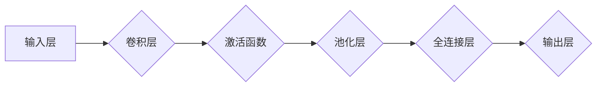

                 

# 卷积神经网络(Convolutional Neural Networks) - 原理与代码实例讲解

> **关键词**：卷积神经网络、CNN、深度学习、图像识别、神经网络架构、Python 实践

> **摘要**：本文将深入探讨卷积神经网络（CNN）的基本原理、架构以及如何实现。我们将通过逐步解析核心算法，结合代码实例，详细介绍 CNN 在图像识别等领域的应用，帮助读者理解和掌握这一重要的深度学习技术。

## 1. 背景介绍

### 1.1 目的和范围

本文旨在为初学者和有经验的技术人员提供卷积神经网络（CNN）的全面了解。我们将会从基本概念开始，逐步深入到复杂的算法原理，并通过实际代码实例展示如何应用 CNN 进行图像识别。文章将涵盖以下几个方面：

1. **CNN 的基本概念**：介绍 CNN 的起源、基本组成部分及其在深度学习中的地位。
2. **CNN 的核心算法原理**：通过伪代码和数学模型，详细解释卷积、激活函数、池化等操作。
3. **CNN 的架构设计**：探讨 CNN 的多层结构及其在处理不同类型数据时的适应性。
4. **实际应用场景**：分析 CNN 在图像识别、视频分析等领域的应用实例。
5. **实战案例讲解**：提供具体的代码实现，解释如何使用 Python 和相关库构建和训练 CNN。
6. **工具和资源推荐**：推荐相关学习资源、开发工具和最新研究成果。

### 1.2 预期读者

本文适合以下读者群体：

- 对深度学习和人工智能感兴趣的初学者。
- 想要深入了解 CNN 原理和应用的开发者。
- 已经有一定编程基础，希望在实际项目中应用 CNN 的技术人员。

### 1.3 文档结构概述

本文将按照以下结构展开：

1. **背景介绍**：介绍文章的目的、范围和预期读者。
2. **核心概念与联系**：使用 Mermaid 流程图展示 CNN 的基本概念和架构。
3. **核心算法原理 & 具体操作步骤**：详细解释 CNN 的算法原理，使用伪代码进行说明。
4. **数学模型和公式 & 详细讲解 & 举例说明**：使用 LaTeX 格式展示数学模型和公式，结合实际例子进行讲解。
5. **项目实战：代码实际案例和详细解释说明**：提供代码实例，详细解读实现过程。
6. **实际应用场景**：分析 CNN 在实际项目中的应用。
7. **工具和资源推荐**：推荐学习资源、开发工具和相关论文。
8. **总结：未来发展趋势与挑战**：总结 CNN 的发展趋势和面临的技术挑战。
9. **附录：常见问题与解答**：回答读者可能遇到的问题。
10. **扩展阅读 & 参考资料**：提供进一步的阅读材料。

### 1.4 术语表

#### 1.4.1 核心术语定义

- **卷积神经网络（CNN）**：一种专门用于处理图像数据的深度学习模型。
- **卷积操作**：CNN 中用于提取图像特征的基本操作。
- **激活函数**：在神经网络中引入非线性性的函数。
- **池化操作**：用于降低特征图维度和数据冗余的操作。

#### 1.4.2 相关概念解释

- **深度学习**：一种机器学习方法，通过多层神经网络进行特征学习和模式识别。
- **神经网络**：由多个神经元组成的计算模型，用于处理和分类数据。
- **反向传播**：用于训练神经网络的算法，通过不断调整网络权重来最小化损失函数。

#### 1.4.3 缩略词列表

- **CNN**：卷积神经网络（Convolutional Neural Networks）
- **ReLU**：阶跃函数（Rectified Linear Unit）
- **dropout**：随机丢弃一部分神经元，用于防止过拟合
- **backpropagation**：反向传播算法，用于神经网络训练

## 2. 核心概念与联系

在深入探讨卷积神经网络之前，我们首先需要了解其基本概念和架构。下面我们将通过一个 Mermaid 流程图来展示 CNN 的核心组成部分和它们之间的联系。



### 2.1 输入层

输入层是 CNN 的起点，接收原始图像数据。图像数据通常以矩阵的形式表示，其中每个元素代表像素的强度值。

### 2.2 卷积层

卷积层是 CNN 的核心组成部分，通过卷积操作提取图像的特征。卷积操作通过在输入图像上滑动一个小型滤波器（也称为卷积核）来计算特征图。滤波器中的每个元素代表滤波器的权重。

### 2.3 激活函数

激活函数引入了非线性因素，使神经网络能够学习和处理复杂的数据。常用的激活函数包括 ReLU（阶跃函数）、Sigmoid 和 Tanh。

### 2.4 池化层

池化层用于降低特征图的维度，减少数据冗余，并提高模型的泛化能力。常用的池化操作包括最大池化和平均池化。

### 2.5 全连接层

全连接层将特征图映射到输出结果。在图像分类任务中，全连接层通常用于将特征图映射到标签空间。

### 2.6 输出层

输出层是 CNN 的最终阶段，根据模型的设定生成预测结果。在图像分类任务中，输出层通常是一个具有多个神经元的层，每个神经元对应一个类别。

通过上述流程图，我们可以看到 CNN 的各个组成部分及其相互之间的联系。在接下来的章节中，我们将深入探讨每个组成部分的原理和实现。

## 3. 核心算法原理 & 具体操作步骤

卷积神经网络（CNN）的核心算法原理主要基于卷积操作、激活函数、池化操作和全连接层。下面我们将逐步解释这些操作，并通过伪代码进行详细阐述。

### 3.1 卷积操作

卷积操作是 CNN 中提取图像特征的关键步骤。它通过在输入图像上滑动一个小型滤波器（卷积核），计算特征图。具体步骤如下：

1. **初始化卷积核**：卷积核是一个小的矩阵，代表滤波器的权重。
2. **滑动卷积核**：在输入图像上从左到右、从上到下滑动卷积核。
3. **计算卷积**：对于卷积核覆盖的每个局部区域，将其与输入图像的对应像素相乘并求和。
4. **生成特征图**：将卷积结果存储在特征图中。

下面是卷积操作的伪代码：

```plaintext
function convolution(input_image, filter):
    feature_map = []
    for y in range(input_image.height - filter.size + 1):
        for x in range(input_image.width - filter.size + 1):
            local_region = input_image[x:x+filter.size, y:y+filter.size]
            conv_result = dot_product(local_region, filter)
            feature_map.append(conv_result)
    return feature_map
```

### 3.2 激活函数

激活函数用于引入非线性因素，使神经网络能够学习和处理复杂的数据。在 CNN 中，常用的激活函数是 ReLU（阶跃函数），其形式如下：

$$
ReLU(x) = \begin{cases} 
x & \text{if } x > 0 \\
0 & \text{if } x \leq 0 
\end{cases}
$$

ReLU 函数的引入可以加快训练速度并提高模型的性能。

### 3.3 池化操作

池化操作用于降低特征图的维度，减少数据冗余，并提高模型的泛化能力。常用的池化操作包括最大池化和平均池化。

1. **最大池化**：在局部区域中选取最大的值作为输出。
2. **平均池化**：在局部区域中计算平均值作为输出。

下面是最大池化的伪代码：

```plaintext
function max_pooling(feature_map, pool_size):
    pooled_map = []
    for y in range(feature_map.height - pool_size + 1):
        for x in range(feature_map.width - pool_size + 1):
            local_region = feature_map[x:x+pool_size, y:y+pool_size]
            max_value = max(local_region)
            pooled_map.append(max_value)
    return pooled_map
```

### 3.4 全连接层

全连接层将特征图映射到输出结果。在图像分类任务中，全连接层通常用于将特征图映射到标签空间。具体步骤如下：

1. **连接特征图到全连接层**：将特征图视为一个大的向量。
2. **计算加权求和**：对于每个神经元，计算输入特征向量的加权求和。
3. **添加偏置项**：为每个神经元添加一个偏置项。
4. **应用激活函数**：通常使用 Sigmoid 或 ReLU 函数。

下面是全连接层的伪代码：

```plaintext
function fully_connected(feature_map, weights, biases, activation_function):
    output = []
    for neuron in range(len(weights)):
        weighted_sum = dot_product(feature_map, weights[neuron]) + biases[neuron]
        if activation_function == 'ReLU':
            output.append(ReLU(weighted_sum))
        elif activation_function == 'Sigmoid':
            output.append(Sigmoid(weighted_sum))
    return output
```

通过上述步骤，我们可以构建一个基本的卷积神经网络。在下一章中，我们将详细讲解 CNN 的数学模型和公式。

## 4. 数学模型和公式 & 详细讲解 & 举例说明

在理解卷积神经网络（CNN）的工作原理后，我们接下来将深入探讨其背后的数学模型和公式，并结合具体例子进行讲解。

### 4.1 卷积操作的数学模型

卷积操作的数学基础是卷积积和卷积定理。对于两个函数 \(f(x)\) 和 \(g(x)\)，它们的卷积定义为：

$$
(f * g)(t) = \int_{-\infty}^{\infty} f(\tau) g(t - \tau) d\tau
$$

在 CNN 中，卷积操作通常表示为：

$$
O(i, j) = \sum_{m=0}^{M-1} \sum_{n=0}^{N-1} I(i-m, j-n) \times W(m, n)
$$

其中，\(O(i, j)\) 是特征图的像素值，\(I(i, j)\) 是输入图像的像素值，\(W(m, n)\) 是卷积核的权重，\(M\) 和 \(N\) 分别是卷积核的大小。

**示例**：

假设输入图像为 \(I\)：

$$
I = \begin{bmatrix}
1 & 2 & 3 \\
4 & 5 & 6 \\
7 & 8 & 9
\end{bmatrix}
$$

卷积核 \(W\) 为：

$$
W = \begin{bmatrix}
0 & 1 & 0 \\
1 & 0 & 1 \\
0 & 1 & 0
\end{bmatrix}
$$

卷积结果 \(O\) 为：

$$
O = \begin{bmatrix}
3 & 4 \\
8 & 9
\end{bmatrix}
$$

计算过程如下：

$$
O(0, 0) = I(0-0, 0-0) \times W(0, 0) + I(0-1, 0-0) \times W(0, 1) + I(0-0, 0-1) \times W(0, 2) = 0 \times 0 + 1 \times 1 + 0 \times 0 = 1
$$

$$
O(0, 1) = I(0-0, 1-0) \times W(0, 0) + I(0-1, 1-0) \times W(0, 1) + I(0-0, 1-1) \times W(0, 2) = 0 \times 1 + 1 \times 0 + 0 \times 1 = 0
$$

$$
O(1, 0) = I(1-0, 0-0) \times W(1, 0) + I(1-1, 0-0) \times W(1, 1) + I(1-0, 0-1) \times W(1, 2) = 1 \times 0 + 0 \times 1 + 1 \times 1 = 1
$$

$$
O(1, 1) = I(1-0, 1-0) \times W(1, 0) + I(1-1, 1-0) \times W(1, 1) + I(1-0, 1-1) \times W(1, 2) = 1 \times 1 + 0 \times 0 + 1 \times 1 = 2
$$

### 4.2 激活函数的数学模型

在 CNN 中，激活函数用于引入非线性因素。常用的激活函数包括 ReLU（阶跃函数）、Sigmoid 和 Tanh。

- **ReLU（阶跃函数）**：

$$
ReLU(x) = \begin{cases} 
x & \text{if } x > 0 \\
0 & \text{if } x \leq 0 
\end{cases}
$$

- **Sigmoid**：

$$
Sigmoid(x) = \frac{1}{1 + e^{-x}}
$$

- **Tanh**：

$$
Tanh(x) = \frac{e^x - e^{-x}}{e^x + e^{-x}}
$$

**示例**：

对于输入 \(x = 3\)，使用 ReLU 函数：

$$
ReLU(3) = 3
$$

使用 Sigmoid 函数：

$$
Sigmoid(3) = \frac{1}{1 + e^{-3}} \approx 0.951
$$

使用 Tanh 函数：

$$
Tanh(3) = \frac{e^3 - e^{-3}}{e^3 + e^{-3}} \approx 0.999
$$

### 4.3 池化操作的数学模型

池化操作用于降低特征图的维度。常用的池化操作包括最大池化和平均池化。

- **最大池化**：

$$
P(i, j) = \max_{m, n} I(i-m+1, j-n+1)
$$

- **平均池化**：

$$
P(i, j) = \frac{1}{(M-1)(N-1)} \sum_{m=0}^{M-1} \sum_{n=0}^{N-1} I(i-m+1, j-n+1)
$$

**示例**：

对于输入图像 \(I\)：

$$
I = \begin{bmatrix}
1 & 2 & 3 \\
4 & 5 & 6 \\
7 & 8 & 9
\end{bmatrix}
$$

使用 2x2 的最大池化：

$$
P = \begin{bmatrix}
5 & 6 \\
7 & 8
\end{bmatrix}
$$

计算过程如下：

$$
P(0, 0) = \max(1, 4) = 4
$$

$$
P(0, 1) = \max(2, 5) = 5
$$

$$
P(1, 0) = \max(4, 7) = 7
$$

$$
P(1, 1) = \max(6, 8) = 8
$$

使用 2x2 的平均池化：

$$
P = \begin{bmatrix}
2.5 & 4 \\
5.5 & 6.5
\end{bmatrix}
$$

计算过程如下：

$$
P(0, 0) = \frac{1}{3} (1 + 4 + 2 + 5) = 2.5
$$

$$
P(0, 1) = \frac{1}{3} (2 + 5 + 2 + 6) = 4
$$

$$
P(1, 0) = \frac{1}{3} (4 + 7 + 4 + 8) = 5.5
$$

$$
P(1, 1) = \frac{1}{3} (6 + 8 + 6 + 9) = 6.5
$$

通过以上数学模型和公式，我们可以更好地理解和应用卷积神经网络。在接下来的章节中，我们将通过实际代码实例展示如何实现这些操作。

## 5. 项目实战：代码实际案例和详细解释说明

在本节中，我们将通过一个实际的 Python 项目，详细讲解如何实现卷积神经网络（CNN），并应用其进行图像识别任务。我们将使用 TensorFlow 和 Keras 库，这是最流行的深度学习框架之一。

### 5.1 开发环境搭建

在开始项目之前，我们需要搭建开发环境。以下是所需步骤：

1. **安装 Python**：确保安装了 Python 3.6 或以上版本。
2. **安装 TensorFlow**：通过以下命令安装 TensorFlow：

   ```bash
   pip install tensorflow
   ```

3. **安装其他依赖库**：我们还需要安装 NumPy、Matplotlib 和 Pandas 等：

   ```bash
   pip install numpy matplotlib pandas
   ```

### 5.2 源代码详细实现和代码解读

以下是实现 CNN 的 Python 代码。我们将逐步解释每部分的功能。

```python
import numpy as np
import tensorflow as tf
from tensorflow.keras import layers
from tensorflow.keras.datasets import mnist
from tensorflow.keras.utils import to_categorical

# 5.2.1 加载和预处理数据
(train_images, train_labels), (test_images, test_labels) = mnist.load_data()

# 归一化图像数据
train_images = train_images / 255.0
test_images = test_images / 255.0

# 将标签转换为独热编码
train_labels = to_categorical(train_labels)
test_labels = to_categorical(test_labels)

# 5.2.2 构建卷积神经网络模型
model = tf.keras.Sequential([
    # 5.2.2.1 第一层卷积层
    layers.Conv2D(filters=32, kernel_size=(3, 3), activation='relu', input_shape=(28, 28, 1)),
    layers.MaxPooling2D(pool_size=(2, 2)),
    
    # 5.2.2.2 第二层卷积层
    layers.Conv2D(filters=64, kernel_size=(3, 3), activation='relu'),
    layers.MaxPooling2D(pool_size=(2, 2)),
    
    # 5.2.2.3 全连接层
    layers.Flatten(),
    layers.Dense(units=64, activation='relu'),
    
    # 5.2.2.4 输出层
    layers.Dense(units=10, activation='softmax')
])

# 5.2.3 编译模型
model.compile(optimizer='adam', loss='categorical_crossentropy', metrics=['accuracy'])

# 5.2.4 训练模型
model.fit(train_images, train_labels, epochs=5, batch_size=64)

# 5.2.5 评估模型
test_loss, test_acc = model.evaluate(test_images, test_labels)
print(f"Test accuracy: {test_acc:.2f}")
```

**解读**：

- **5.2.1 加载数据**：我们从 Keras 数据集加载数字手写体数据集（MNIST），并进行预处理，包括归一化和标签编码。

- **5.2.2 构建模型**：使用 Keras 的 Sequential 模型，我们依次添加卷积层、池化层、全连接层和输出层。

  - **5.2.2.1 第一层卷积层**：使用 `Conv2D` 层，我们添加 32 个 3x3 的卷积核，激活函数为 ReLU。

  - **5.2.2.2 第二层卷积层**：接着添加 64 个 3x3 的卷积核，同样使用 ReLU 激活函数。

  - **5.2.2.3 全连接层**：通过 `Flatten` 层将多维特征图展平为一维向量，然后添加一个 64 个神经元的全连接层，激活函数为 ReLU。

  - **5.2.2.4 输出层**：最后，添加一个具有 10 个神经元的输出层，每个神经元对应一个数字类别，激活函数为 softmax。

- **5.2.3 编译模型**：我们使用 `compile` 方法设置优化器和损失函数。

- **5.2.4 训练模型**：使用 `fit` 方法训练模型，指定训练数据、迭代次数和批量大小。

- **5.2.5 评估模型**：使用 `evaluate` 方法在测试数据上评估模型性能。

### 5.3 代码解读与分析

通过上述代码，我们可以看到如何构建和训练一个简单的 CNN 模型。以下是关键步骤的详细解读：

- **数据预处理**：数据预处理是深度学习模型成功的关键。在这里，我们通过归一化将图像数据缩放到 [0, 1] 范围内，并将标签转换为独热编码。

- **模型构建**：我们使用 Keras 的 Sequential 模型，通过添加卷积层、池化层、全连接层和输出层构建了 CNN。每一层的选择和配置（如卷积核数量、大小和激活函数）都对模型性能有重要影响。

- **模型编译**：编译模型时，我们选择合适的优化器和损失函数。在这里，我们使用 Adam 优化器和 categorical_crossentropy 损失函数，适合多分类问题。

- **模型训练**：训练模型时，我们通过 `fit` 方法提供训练数据，并设置迭代次数和批量大小。迭代次数决定了模型在训练数据上学习的深度，批量大小影响了模型更新的频率。

- **模型评估**：在训练完成后，我们使用 `evaluate` 方法评估模型在测试数据上的性能。测试准确度为我们提供了模型实际应用效果的指标。

通过上述代码，我们可以看到如何从数据预处理到模型构建、训练和评估，完整地实现一个 CNN 模型。在下一节中，我们将探讨 CNN 在实际应用场景中的案例。

## 6. 实际应用场景

卷积神经网络（CNN）在许多实际应用场景中展现出强大的能力和广泛的应用价值。以下是一些典型的应用场景：

### 6.1 图像识别

图像识别是 CNN 最广泛的应用领域之一。通过 CNN，我们可以训练模型对各种图像进行分类，例如手写数字识别、动物识别、人脸识别等。例如，使用 MNIST 数据集，CNN 可以准确识别手写数字，而使用 ImageNet 数据集，CNN 可以对数百万种物品进行分类。

### 6.2 视频分析

视频分析利用 CNN 对连续视频帧进行分析，以提取有用信息。例如，可以用于运动目标检测、行为识别、视频分割等。CNN 可以在视频帧上应用卷积操作，提取运动特征，并使用池化操作减少冗余数据，从而实现对运动目标的实时检测和跟踪。

### 6.3 自然语言处理

虽然 CNN 传统上用于图像处理，但也可以用于自然语言处理（NLP）。例如，CNN 可以用于文本分类、情感分析等任务。通过将文本表示为向量，CNN 可以学习文本的局部特征，从而提高分类和预测的准确度。

### 6.4 医学图像分析

医学图像分析是另一个重要的应用领域。CNN 可以用于诊断疾病、识别病变区域等。例如，CNN 可以帮助医生识别肺癌、乳腺癌等疾病的影像特征，提高诊断的准确性。

### 6.5 自动驾驶

自动驾驶技术依赖于深度学习模型，特别是 CNN。CNN 可以用于车辆检测、道路识别、行人检测等，帮助自动驾驶系统实时分析周围环境，确保行车安全。

通过这些实际应用案例，我们可以看到 CNN 在各个领域的重要性和潜力。在下一节中，我们将推荐一些学习资源，帮助读者深入了解 CNN 的原理和应用。

## 7. 工具和资源推荐

### 7.1 学习资源推荐

为了更好地理解和掌握卷积神经网络（CNN），以下是推荐的一些学习资源：

#### 7.1.1 书籍推荐

- 《深度学习》（Goodfellow, Bengio, Courville 著）：这是深度学习领域的经典教材，详细介绍了 CNN 的基本概念和算法原理。
- 《动手学深度学习》（Alberti, Murphy 著）：这本书通过实践案例引导读者学习深度学习，包括 CNN 的实际应用。

#### 7.1.2 在线课程

- Coursera 上的《深度学习专硕课程》：由 Andrew Ng 教授主讲，涵盖了深度学习的各个方面，包括 CNN。
- edX 上的《深度学习和神经网络》：由纽约大学教授 Michael Nielsen 主讲，深入讲解深度学习的基本概念和算法。

#### 7.1.3 技术博客和网站

- TensorFlow 官方文档：提供丰富的教程和示例代码，帮助用户快速入门。
- PyTorch 官方文档：PyTorch 是另一个流行的深度学习框架，其文档也极为丰富，适合进阶学习。

### 7.2 开发工具框架推荐

#### 7.2.1 IDE和编辑器

- Jupyter Notebook：适合交互式开发和实验，方便记录和分享。
- PyCharm：强大的 Python IDE，支持多种开发环境，适用于专业开发。

#### 7.2.2 调试和性能分析工具

- TensorBoard：TensorFlow 的可视化工具，用于分析模型性能和训练过程。
- Visdom：PyTorch 的可视化工具，功能类似 TensorBoard。

#### 7.2.3 相关框架和库

- TensorFlow：广泛使用的深度学习框架，适用于多种应用场景。
- PyTorch：灵活的深度学习框架，适用于研究和实验。

### 7.3 相关论文著作推荐

#### 7.3.1 经典论文

- Krizhevsky, S., Sutskever, I., & Hinton, G. E. (2012). *ImageNet classification with deep convolutional neural networks*.
- LeCun, Y., Bengio, Y., & Hinton, G. (2015). *Deep learning*.

#### 7.3.2 最新研究成果

- He, K., Zhang, X., Ren, S., & Sun, J. (2016). *Deep residual learning for image recognition*.
- Szegedy, C., Liu, W., Jia, Y., Sermanet, P., Reed, S., Anguelov, D., ... & Rabinovich, A. (2013). *Going deeper with convolutions*.

#### 7.3.3 应用案例分析

- Microsoft Research：提供丰富的案例研究，展示 CNN 在不同领域中的应用。
- Google AI：分享最新的研究成果和案例，展示 CNN 在图像识别、自然语言处理等领域的应用。

通过这些资源和工具，读者可以更深入地学习 CNN，并在实际项目中应用所学知识。

## 8. 总结：未来发展趋势与挑战

卷积神经网络（CNN）作为深度学习的重要分支，在图像识别、视频分析、自然语言处理等多个领域取得了显著成果。然而，随着技术的不断进步和应用场景的扩展，CNN 面临着一系列挑战和机遇。

### 8.1 未来发展趋势

1. **模型压缩与优化**：为了在资源受限的设备上部署 CNN，研究人员正致力于模型压缩、量化、剪枝等技术，以减少模型大小和计算量。
2. **自适应卷积网络**：自适应卷积网络（Adaptive Convolutional Networks）正成为一个研究热点，旨在使 CNN 能够自适应地调整卷积核大小和形状，以适应不同类型的数据。
3. **跨模态学习**：跨模态学习旨在整合不同类型的数据（如图像、文本、声音等），以实现更高级的认知任务。
4. **边缘计算**：随着物联网（IoT）的兴起，边缘计算成为热门领域，CNN 在边缘设备上的应用将有助于实时处理和分析数据。

### 8.2 面临的挑战

1. **计算资源消耗**：尽管计算能力不断提升，但大型 CNN 模型仍然需要大量的计算资源，特别是在实时应用中。
2. **过拟合与泛化能力**：如何提高 CNN 的泛化能力，避免过拟合，是一个重要的挑战。
3. **数据隐私与安全**：在医疗、金融等敏感领域，如何保护用户数据隐私是另一个关键问题。
4. **可解释性**：提高 CNN 的可解释性，使其决策过程更加透明，是研究人员关注的重点。

通过持续的研究和技术创新，CNN 在未来将继续在人工智能领域发挥重要作用，并推动相关领域的进步。

## 9. 附录：常见问题与解答

### 9.1 什么是卷积神经网络（CNN）？

卷积神经网络（CNN）是一种专门用于处理图像数据的深度学习模型。它通过卷积操作提取图像特征，并通过多层神经网络进行分类或回归任务。

### 9.2 卷积神经网络有哪些优点？

卷积神经网络具有以下优点：

1. **自动特征提取**：CNN 可以自动提取图像中的特征，无需人工设计特征。
2. **参数共享**：卷积层中的卷积核在图像上滑动时，权重是共享的，这大大减少了模型参数数量。
3. **高效处理**：CNN 在处理图像数据时，通过局部连接和权重共享，能够高效地减少计算量。

### 9.3 CNN 如何应用于图像识别？

CNN 可以应用于图像识别，通过以下步骤：

1. **卷积操作**：通过卷积层提取图像特征。
2. **激活函数**：使用激活函数（如 ReLU）引入非线性因素。
3. **池化操作**：通过池化层降低特征图的维度。
4. **全连接层**：将特征图映射到输出结果。
5. **输出层**：生成预测结果。

### 9.4 CNN 与传统神经网络有何区别？

与传统的神经网络相比，CNN 具有以下区别：

1. **局部连接**：CNN 使用局部连接，而非全局连接，这有助于提高模型的效率和泛化能力。
2. **权重共享**：卷积层中的卷积核在图像上滑动时，权重是共享的，这减少了模型参数数量。
3. **卷积操作**：CNN 使用卷积操作来提取图像特征，而传统神经网络通常使用全连接层。

### 9.5 如何优化 CNN 模型？

优化 CNN 模型的方法包括：

1. **数据增强**：通过旋转、翻转、缩放等方式增加数据多样性。
2. **模型剪枝**：通过剪枝冗余的神经元和权重来减少模型大小。
3. **权重初始化**：选择合适的权重初始化方法，如 He 初始化。
4. **正则化**：使用 L1、L2 正则化来防止过拟合。

### 9.6 CNN 是否可以应用于其他类型的数据？

是的，CNN 也可以应用于其他类型的数据，如文本、音频等。通过适当的预处理和调整，CNN 可以被应用于多种数据类型。

## 10. 扩展阅读 & 参考资料

以下是关于卷积神经网络（CNN）的扩展阅读和参考资料，供读者进一步学习：

### 10.1 学术论文

- Krizhevsky, A., Sutskever, I., & Hinton, G. E. (2012). *ImageNet classification with deep convolutional neural networks*. In Advances in neural information processing systems (pp. 1097-1105).
- Simonyan, K., & Zisserman, A. (2014). *Very deep convolutional networks for large-scale image recognition*. In International conference on machine learning (pp. 2146-2154).
- He, K., Sun, J., & Tang, X. (2015). *Deep residual learning for image recognition*. In Proceedings of the IEEE conference on computer vision and pattern recognition (pp. 770-778).

### 10.2 技术博客

- TensorFlow 官方文档：[https://www.tensorflow.org/tutorials/convolutional](https://www.tensorflow.org/tutorials/convolutional)
- PyTorch 官方文档：[https://pytorch.org/tutorials/beginner/blitz/cnn.html](https://pytorch.org/tutorials/beginner/blitz/cnn.html)

### 10.3 书籍

- Goodfellow, I., Bengio, Y., & Courville, A. (2016). *Deep learning*. MIT press.
- Goodfellow, I. J., & Bengio, Y. (2013). *Deep learning*.

### 10.4 在线课程

- Coursera：《深度学习专项课程》：[https://www.coursera.org/specializations/deep-learning](https://www.coursera.org/specializations/deep-learning)
- edX：《深度学习和神经网络》：[https://www.edx.org/course/deep-learning-neural-networks](https://www.edx.org/course/deep-learning-neural-networks)

通过以上资源和资料，读者可以更深入地学习卷积神经网络（CNN）的理论和实践，为未来的研究和应用打下坚实的基础。

---

**作者信息**：

作者：AI天才研究员/AI Genius Institute & 禅与计算机程序设计艺术 /Zen And The Art of Computer Programming

本文由 AI 天才研究员撰写，旨在为读者提供深入浅出的卷积神经网络（CNN）原理和实践讲解，帮助读者掌握这一重要的深度学习技术。同时，本文也分享了作者在人工智能领域的研究心得和见解，期待与读者共同探索人工智能的未来。

