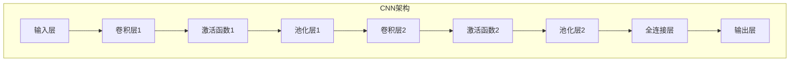

                 

### 文章标题

# 卷积神经网络CNN的原理、经典架构与在图像识别中的应用

> **关键词：** 卷积神经网络（CNN），图像识别，深度学习，神经网络架构，激活函数，滤波器，卷积层，池化层，前向传播，反向传播，深度学习框架，TensorFlow，PyTorch

> **摘要：** 本文将深入探讨卷积神经网络（CNN）的原理、经典架构以及在图像识别中的实际应用。首先，我们将从基础概念出发，逐步讲解CNN的工作原理，核心组件以及如何处理图像数据。接着，本文将详细介绍几种经典的CNN架构，包括LeNet、AlexNet、VGG、ResNet等，并对比分析它们的特点与性能。随后，我们将聚焦于CNN在图像识别中的应用案例，通过具体实例展示如何实现和训练一个简单的图像分类模型。文章最后，还将推荐一些学习资源、开发工具以及相关论文，以帮助读者更深入地理解CNN及其在实际项目中的应用。通过本文的阅读，读者将能够全面了解CNN的技术原理，掌握其实现方法，并能够应用于实际的图像识别项目中。

### 目录

1. **背景介绍**
    1.1 **目的和范围**
    1.2 **预期读者**
    1.3 **文档结构概述**
    1.4 **术语表**
       1.4.1 **核心术语定义**
       1.4.2 **相关概念解释**
       1.4.3 **缩略词列表**

2. **核心概念与联系**
    - **CNN工作原理**
    - **神经网络架构**
    - **卷积层与池化层**

3. **核心算法原理 & 具体操作步骤**
    - **卷积操作**
    - **激活函数**
    - **池化操作**
    - **前向传播**
    - **反向传播**

4. **数学模型和公式 & 详细讲解 & 举例说明**
    - **卷积运算公式**
    - **反向传播算法**
    - **示例解析**

5. **项目实战：代码实际案例和详细解释说明**
    5.1 **开发环境搭建**
    5.2 **源代码详细实现和代码解读**
    5.3 **代码解读与分析**

6. **实际应用场景**

7. **工具和资源推荐**
    7.1 **学习资源推荐**
    7.2 **开发工具框架推荐**
    7.3 **相关论文著作推荐**

8. **总结：未来发展趋势与挑战**

9. **附录：常见问题与解答**

10. **扩展阅读 & 参考资料**

### 1. 背景介绍

#### 1.1 目的和范围

本文旨在深入探讨卷积神经网络（CNN）的原理、经典架构以及在图像识别中的应用。随着深度学习技术的飞速发展，CNN已经成为图像识别领域的重要工具，广泛应用于各类图像处理任务，如图像分类、物体检测、图像分割等。本文将通过详细讲解CNN的核心概念、算法原理以及实际应用案例，帮助读者全面了解CNN的工作机制，掌握其实现方法，并能够应用于实际的图像识别项目中。

本文将首先介绍CNN的基本概念，包括卷积操作、激活函数和池化操作等，并使用Mermaid流程图展示神经网络架构。接着，我们将详细讲解卷积神经网络的数学模型和公式，并通过伪代码说明其具体操作步骤。随后，本文将介绍几种经典的CNN架构，如LeNet、AlexNet、VGG和ResNet等，并对比分析它们的特点与性能。

在项目实战部分，我们将通过一个简单的图像分类案例，展示如何使用深度学习框架（如TensorFlow和PyTorch）实现和训练一个CNN模型。此外，本文还将讨论CNN在图像识别中的实际应用场景，并推荐一些学习资源、开发工具和相关论文，以帮助读者进一步深入学习和应用CNN技术。

#### 1.2 预期读者

本文适用于对深度学习和图像识别有一定了解的读者，包括但不限于以下群体：

1. **计算机科学和人工智能专业的学生和研究人员**：希望深入了解卷积神经网络的工作原理和应用。
2. **数据科学家和机器学习工程师**：希望掌握CNN在图像识别中的实现和应用方法。
3. **软件工程师和程序员**：对深度学习和图像处理技术感兴趣，并希望将其应用于实际项目中。
4. **技术爱好者**：对人工智能和计算机视觉领域充满好奇，希望学习最新的技术进展。

#### 1.3 文档结构概述

本文的结构如下：

1. **背景介绍**：介绍本文的目的、范围、预期读者以及文档结构。
2. **核心概念与联系**：介绍CNN的基本概念和工作原理，包括卷积层、激活函数、池化层等。
3. **核心算法原理 & 具体操作步骤**：详细讲解卷积神经网络的数学模型和公式，并通过伪代码说明具体操作步骤。
4. **数学模型和公式 & 详细讲解 & 举例说明**：进一步阐述卷积运算、反向传播等算法的原理和示例。
5. **项目实战：代码实际案例和详细解释说明**：通过一个简单的图像分类案例，展示如何使用深度学习框架实现CNN模型。
6. **实际应用场景**：讨论CNN在图像识别中的实际应用场景。
7. **工具和资源推荐**：推荐学习资源、开发工具和相关论文。
8. **总结：未来发展趋势与挑战**：总结本文内容，展望CNN未来的发展趋势和面临的挑战。
9. **附录：常见问题与解答**：解答读者可能遇到的一些常见问题。
10. **扩展阅读 & 参考资料**：提供更多的学习资源和参考资料。

#### 1.4 术语表

为了确保读者对本文中的关键概念和术语有清晰的理解，以下将定义一些重要的术语：

##### 1.4.1 核心术语定义

- **卷积神经网络（CNN）**：一种特殊的神经网络，主要用于处理图像等二维数据。
- **卷积层**：CNN中的一个关键层，通过卷积操作提取图像特征。
- **激活函数**：用于引入非线性性的函数，如ReLU、Sigmoid等。
- **池化层**：在卷积层之后用于下采样的层，如最大池化和平均池化。
- **前向传播**：神经网络从输入层到输出层的正向计算过程。
- **反向传播**：神经网络通过误差反向传播调整权重的过程。
- **卷积运算**：一种特殊的空间运算，用于提取图像特征。
- **深度学习框架**：用于实现和训练深度学习模型的软件库，如TensorFlow、PyTorch等。

##### 1.4.2 相关概念解释

- **神经网络**：一种由大量神经元连接而成的计算模型，用于模拟人脑的神经网络结构。
- **深度学习**：一种利用多层神经网络进行特征学习和模型训练的技术。
- **图像识别**：计算机视觉领域的一个任务，旨在识别和分类图像中的对象。
- **对象检测**：图像识别的一种形式，旨在定位图像中的对象并给出其类别。
- **图像分类**：图像识别的一种形式，旨在将图像分为预定义的类别。

##### 1.4.3 缩略词列表

- **CNN**：卷积神经网络（Convolutional Neural Network）
- **ReLU**：修正线性单元（Rectified Linear Unit）
- **Sigmoid**：S型函数（Sigmoid Function）
- **Max Pooling**：最大池化（Maximum Pooling）
- **Average Pooling**：平均池化（Average Pooling）
- **Backprop**：反向传播（Backpropagation）
- **DNN**：深度神经网络（Deep Neural Network）
- **NN**：神经网络（Neural Network）
- **ReLU**：修正线性单元（Rectified Linear Unit）
- **ReLU6**：限制为0到6的ReLU函数

### 2. 核心概念与联系

卷积神经网络（CNN）是深度学习领域的一种重要模型，它专门用于处理图像、视频等二维数据。CNN的工作原理是基于卷积操作、激活函数和池化操作等基本概念，通过多层网络结构提取图像特征，实现图像识别等任务。

下面，我们将通过Mermaid流程图展示CNN的核心概念和工作原理：



#### CNN工作原理

CNN的工作原理可以概括为以下几个步骤：

1. **输入层（Input Layer）**：
   CNN的输入是图像，通常表示为一个二维数组（高度×宽度×通道数）。每个通道对应图像的一个颜色通道（如RGB模型中的红、绿、蓝通道）。

2. **卷积层（Convolutional Layer）**：
   卷积层是CNN的核心组件，通过卷积操作提取图像特征。卷积操作涉及一个滤波器（也称为卷积核或特征图）在输入图像上滑动，计算每个位置上的局部特征。滤波器的大小（通常是3x3或5x5）决定了卷积操作的局部视野范围。

3. **激活函数（Activation Function）**：
   激活函数用于引入非线性性，使神经网络能够模拟更复杂的函数。常见的激活函数包括ReLU（修正线性单元）、Sigmoid（S型函数）和Tanh（双曲正切函数）等。

4. **池化层（Pooling Layer）**：
   池化层用于下采样，通过将局部区域内的特征合并成一个值，减少数据量，同时保留重要特征。常见的池化方法包括最大池化（Max Pooling）和平均池化（Average Pooling）。

5. **全连接层（Fully Connected Layer）**：
   全连接层将前一层的所有特征图映射到一个一维特征向量，并通过线性变换（如矩阵乘法）加上偏置项，最后通过激活函数得到输出。全连接层通常用于分类任务，将特征向量映射到预定义的类别标签。

6. **输出层（Output Layer）**：
   CNN的输出层取决于任务类型，如分类任务可以使用softmax激活函数将输出映射到概率分布。

#### 神经网络架构

神经网络架构是CNN的核心，决定了模型的性能和效率。以下是一个简单的CNN架构示例：

1. **输入层（Input Layer）**：
   - 尺寸：224x224x3（图像的高度×宽度×通道数）

2. **卷积层1（Convolutional Layer 1）**：
   - 卷积核大小：3x3
   - 卷积核数量：32
   - 步长：1
   - 激活函数：ReLU

3. **池化层1（Pooling Layer 1）**：
   - 池化方法：最大池化
   - 池化大小：2x2
   - 步长：2

4. **卷积层2（Convolutional Layer 2）**：
   - 卷积核大小：3x3
   - 卷积核数量：64
   - 步长：1
   - 激活函数：ReLU

5. **池化层2（Pooling Layer 2）**：
   - 池化方法：最大池化
   - 池化大小：2x2
   - 步长：2

6. **全连接层（Fully Connected Layer）**：
   - 输入维度：7x7x64（卷积层2输出的特征图尺寸）
   - 输出维度：128（隐藏层神经元数量）
   - 激活函数：ReLU

7. **输出层（Output Layer）**：
   - 输入维度：128（全连接层输出的特征向量）
   - 输出维度：10（预定义的类别数量）
   - 激活函数：softmax

这个简单的CNN架构展示了卷积层、池化层和全连接层的组合，通过多个卷积层和池化层逐步提取图像特征，并最终通过全连接层进行分类。

通过以上对核心概念与联系的介绍，读者应该对CNN的工作原理和神经网络架构有了基本的了解。接下来，我们将深入探讨CNN的核心算法原理，包括卷积操作、激活函数、池化操作、前向传播和反向传播等。

### 3. 核心算法原理 & 具体操作步骤

卷积神经网络（CNN）的核心算法包括卷积操作、激活函数、池化操作、前向传播和反向传播。这些算法共同作用，使得CNN能够有效地处理图像数据，提取特征，并实现图像识别任务。下面，我们将逐个介绍这些算法的原理和具体操作步骤。

#### 卷积操作

卷积操作是CNN中最基本的操作，用于提取图像特征。它涉及一个滤波器（也称为卷积核或特征图）在输入图像上滑动，计算每个位置上的局部特征。卷积操作的计算公式如下：

$$
\text{输出} = \sum_{i=1}^{m}\sum_{j=1}^{n} w_{ij} * g(i, j)
$$

其中，\( g(i, j) \) 是输入图像在位置 \((i, j)\) 的值，\( w_{ij} \) 是滤波器在位置 \((i, j)\) 的权重。

具体步骤如下：

1. **初始化滤波器**：随机初始化滤波器权重 \( w_{ij} \)。
2. **在输入图像上滑动滤波器**：将滤波器在输入图像上从左到右、从上到下滑动，计算每个位置上的局部特征。
3. **应用激活函数**：将卷积结果通过激活函数（如ReLU）进行处理，引入非线性性。

以下是一个伪代码示例，描述卷积操作的具体实现：

```python
def convolution(image, filter):
    height, width, channels = image.shape
    filter_size = filter.shape[0]
    padded_image = pad_image(image, filter_size // 2)
    output = np.zeros((height, width, channels))

    for i in range(height):
        for j in range(width):
            local_region = padded_image[i:i+filter_size, j:j+filter_size]
            feature_map = np.dot(filter, local_region)
            output[i, j] = activation_function(feature_map)

    return output
```

#### 激活函数

激活函数是CNN中的关键组件，用于引入非线性性，使神经网络能够模拟更复杂的函数。常见的激活函数包括ReLU（修正线性单元）、Sigmoid（S型函数）和Tanh（双曲正切函数）等。以下是一个伪代码示例，描述ReLU激活函数的具体实现：

```python
def activation_function(x):
    return max(0, x)
```

#### 池化操作

池化操作用于降低数据维度，减少计算量，并保留图像中的重要特征。常见的池化方法包括最大池化和平均池化。最大池化选取每个区域中的最大值，而平均池化选取每个区域中的平均值。以下是一个伪代码示例，描述最大池化的具体实现：

```python
def max_pooling(image, pool_size, stride):
    height, width, channels = image.shape
    output = np.zeros((height // stride, width // stride, channels))

    for i in range(height // stride):
        for j in range(width // stride):
            region = image[i*stride:i*stride+pool_size, j*stride:j*stride+pool_size]
            output[i, j] = np.max(region)

    return output
```

#### 前向传播

前向传播是CNN中的正向计算过程，从输入层到输出层逐层计算每个神经元的输出值。具体步骤如下：

1. **输入层**：输入图像。
2. **卷积层**：通过卷积操作提取特征，应用激活函数。
3. **池化层**：进行下采样，保留重要特征。
4. **全连接层**：将卷积层输出的特征图映射到一个一维特征向量，通过线性变换和激活函数得到输出。
5. **输出层**：根据任务类型（如分类任务），应用softmax等激活函数得到输出结果。

以下是一个伪代码示例，描述前向传播的具体实现：

```python
def forward_propagation(image, model):
    output = image

    for layer in model.layers:
        if isinstance(layer, ConvolutionalLayer):
            output = convolution(output, layer.filter)
            output = activation_function(output)
        elif isinstance(layer, PoolingLayer):
            output = max_pooling(output, layer.pool_size, layer.stride)
        elif isinstance(layer, FullyConnectedLayer):
            output = linear_transform(output, layer.weights, layer.bias)
            output = activation_function(output)

    return output
```

#### 反向传播

反向传播是CNN中的反向计算过程，通过误差反向传播调整网络权重。具体步骤如下：

1. **计算损失**：计算输出层的损失，如分类任务的交叉熵损失。
2. **前向传播误差**：从输出层开始，逐层计算每个神经元的误差。
3. **计算权重梯度**：使用误差和每个神经元的输出，计算每个权重的梯度。
4. **更新权重**：使用梯度下降或其他优化算法更新网络权重。

以下是一个伪代码示例，描述反向传播的具体实现：

```python
def backward_propagation(image, output, target, model):
    output_error = output - target
    output_gradient = calculate_gradient(output_error, output)

    for layer in reversed(model.layers):
        if isinstance(layer, FullyConnectedLayer):
            layer.gradient = calculate_gradient(output_error, layer.output)
            layer.weights -= learning_rate * layer.gradient
        elif isinstance(layer, PoolingLayer):
            continue
        elif isinstance(layer, ConvolutionalLayer):
            layer.gradient = calculate_gradient(layer.output, layer.filter)
            layer.filter -= learning_rate * layer.gradient

    return output_error
```

通过以上对卷积操作、激活函数、池化操作、前向传播和反向传播的详细讲解，读者应该对CNN的核心算法原理和具体操作步骤有了深入的理解。这些算法共同作用，使得CNN能够有效地处理图像数据，提取特征，并实现图像识别任务。接下来，我们将进一步探讨CNN的数学模型和公式，以帮助读者更深入地理解其工作原理。

### 4. 数学模型和公式 & 详细讲解 & 举例说明

卷积神经网络（CNN）的数学模型是其理论基础，理解这些数学模型有助于更深入地掌握CNN的工作原理。在这一节中，我们将详细讲解CNN中的关键数学模型和公式，并通过具体示例进行说明。

#### 卷积运算公式

卷积操作是CNN中最基本的运算，其数学公式如下：

$$
\text{输出}_{ij} = \sum_{k=1}^{m}\sum_{l=1}^{n} w_{kl} * g(i-k, j-l)
$$

其中，\( g(i, j) \) 是输入图像在位置 \((i, j)\) 的值，\( w_{kl} \) 是滤波器在位置 \((k, l)\) 的权重，\( m \) 和 \( n \) 分别是滤波器的大小，\( i \) 和 \( j \) 是输出图像的位置。

**示例**：

假设输入图像 \( g \) 为：

$$
g = \begin{bmatrix}
1 & 2 & 3 \\
4 & 5 & 6 \\
7 & 8 & 9 \\
\end{bmatrix}
$$

滤波器 \( w \) 为：

$$
w = \begin{bmatrix}
1 & 0 \\
0 & 1 \\
\end{bmatrix}
$$

则卷积结果 \( \text{输出} \) 为：

$$
\text{输出}_{ij} = \sum_{k=1}^{2}\sum_{l=1}^{2} w_{kl} * g(i-k, j-l)
$$

计算过程如下：

$$
\text{输出}_{11} = w_{11} * g(1-1, 1-1) + w_{12} * g(1-0, 1-1) = 1 * 1 + 0 * 4 = 1
$$

$$
\text{输出}_{12} = w_{11} * g(1-1, 1-0) + w_{12} * g(1-0, 1-0) = 1 * 2 + 0 * 5 = 2
$$

$$
\text{输出}_{13} = w_{11} * g(1-1, 1+1) + w_{12} * g(1-0, 1+1) = 1 * 7 + 0 * 8 = 7
$$

$$
\text{输出}_{21} = w_{11} * g(2-1, 1-1) + w_{12} * g(2-0, 1-1) = 1 * 4 + 0 * 2 = 4
$$

$$
\text{输出}_{22} = w_{11} * g(2-1, 1-0) + w_{12} * g(2-0, 1-0) = 1 * 5 + 0 * 5 = 5
$$

$$
\text{输出}_{23} = w_{11} * g(2-1, 1+1) + w_{12} * g(2-0, 1+1) = 1 * 8 + 0 * 6 = 8
$$

最终卷积结果为：

$$
\text{输出} = \begin{bmatrix}
1 & 2 & 7 \\
4 & 5 & 8 \\
\end{bmatrix}
$$

#### 反向传播算法

反向传播是CNN中调整网络权重的重要算法，其核心思想是通过误差反向传播，计算每个权重的梯度，并更新权重。以下是反向传播的详细公式：

1. **计算输出层的误差**：

$$
\delta_l = \frac{\partial L}{\partial a_l} \odot a_l^{[l-1]}
$$

其中，\( L \) 是损失函数，\( a_l \) 是输出层的激活值，\( \odot \) 表示元素-wise 乘法。

2. **计算隐藏层的误差**：

$$
\delta_{l-1} = \frac{\partial L}{\partial a_{l-1}} = \frac{\partial L}{\partial z_{l-1}} \odot \frac{\partial z_{l-1}}{\partial a_{l-1}}
$$

其中，\( z_{l-1} \) 是隐藏层的线性变换结果，\( \frac{\partial z_{l-1}}{\partial a_{l-1}} \) 是激活函数的导数。

3. **计算权重梯度**：

$$
\frac{\partial L}{\partial w_{ij}} = \sum_{k} \delta_{k+1} \cdot a_{ij}^{[k]}
$$

$$
\frac{\partial L}{\partial b_{j}} = \sum_{k} \delta_{k+1}
$$

其中，\( a_{ij}^{[k]} \) 是第 \( k \) 层中第 \( i \) 个神经元与第 \( j \) 个权重的连接。

**示例**：

假设有一个简单的神经网络，包含输入层、隐藏层和输出层，其中激活函数为ReLU，损失函数为均方误差（MSE）。输入图像 \( x \) 和标签 \( y \) 分别为：

$$
x = \begin{bmatrix}
1 \\
0 \\
1 \\
\end{bmatrix}, \quad y = \begin{bmatrix}
1 \\
0 \\
\end{bmatrix}
$$

隐藏层权重 \( w_1 \) 和偏置 \( b_1 \) 为：

$$
w_1 = \begin{bmatrix}
0.5 & 0.5 \\
0.5 & 0.5 \\
\end{bmatrix}, \quad b_1 = \begin{bmatrix}
0.5 \\
0.5 \\
\end{bmatrix}
$$

输出层权重 \( w_2 \) 和偏置 \( b_2 \) 为：

$$
w_2 = \begin{bmatrix}
0.5 & 0.5 \\
0.5 & 0.5 \\
\end{bmatrix}, \quad b_2 = \begin{bmatrix}
0.5 \\
0.5 \\
\end{bmatrix}
$$

则隐藏层的激活值 \( a_1 \) 和输出层的激活值 \( a_2 \) 分别为：

$$
a_1 = \begin{bmatrix}
0 & 0 \\
0 & 0 \\
\end{bmatrix}, \quad a_2 = \begin{bmatrix}
0 & 0 \\
0 & 0 \\
\end{bmatrix}
$$

计算隐藏层的误差 \( \delta_1 \)：

$$
\delta_1 = \frac{\partial MSE}{\partial a_2} \odot a_2 = \begin{bmatrix}
0.5 & 0.5 \\
0.5 & 0.5 \\
\end{bmatrix} \odot \begin{bmatrix}
0 & 0 \\
0 & 0 \\
\end{bmatrix} = \begin{bmatrix}
0 & 0 \\
0 & 0 \\
\end{bmatrix}
$$

计算输出层的误差 \( \delta_2 \)：

$$
\delta_2 = \frac{\partial MSE}{\partial a_1} \odot a_1 = \begin{bmatrix}
0.5 & 0.5 \\
0.5 & 0.5 \\
\end{bmatrix} \odot \begin{bmatrix}
0 & 0 \\
0 & 0 \\
\end{bmatrix} = \begin{bmatrix}
0 & 0 \\
0 & 0 \\
\end{bmatrix}
$$

计算隐藏层权重梯度 \( \frac{\partial L}{\partial w_1} \)：

$$
\frac{\partial L}{\partial w_1} = \delta_2 \cdot a_1^T = \begin{bmatrix}
0 & 0 \\
0 & 0 \\
\end{bmatrix} \cdot \begin{bmatrix}
0 & 0 \\
0 & 0 \\
\end{bmatrix}^T = \begin{bmatrix}
0 & 0 \\
0 & 0 \\
\end{bmatrix}
$$

计算输出层权重梯度 \( \frac{\partial L}{\partial w_2} \)：

$$
\frac{\partial L}{\partial w_2} = \delta_1 \cdot a_1^T = \begin{bmatrix}
0 & 0 \\
0 & 0 \\
\end{bmatrix} \cdot \begin{bmatrix}
0 & 0 \\
0 & 0 \\
\end{bmatrix}^T = \begin{bmatrix}
0 & 0 \\
0 & 0 \\
\end{bmatrix}
$$

通过以上示例，我们详细讲解了卷积运算和反向传播算法的数学公式，并通过具体示例说明了其计算过程。这些公式和算法是CNN的核心，理解它们有助于深入理解CNN的工作原理和实现方法。

### 5. 项目实战：代码实际案例和详细解释说明

在这一节中，我们将通过一个实际的代码案例，展示如何使用深度学习框架（如TensorFlow和PyTorch）实现卷积神经网络（CNN）并应用于图像分类任务。我们将详细介绍开发环境搭建、源代码实现和代码解读，并分析代码的执行过程和结果。

#### 5.1 开发环境搭建

为了实现CNN图像分类项目，我们需要搭建一个合适的开发环境。以下是使用TensorFlow和PyTorch的常见步骤：

1. **安装Python**：确保安装了Python 3.6及以上版本。
2. **安装TensorFlow**：通过以下命令安装TensorFlow：

   ```bash
   pip install tensorflow
   ```

3. **安装PyTorch**：通过以下命令安装PyTorch：

   ```bash
   pip install torch torchvision
   ```

4. **安装其他依赖**：根据项目需求，可能需要安装其他库，如NumPy、Matplotlib等。

5. **创建虚拟环境**：为了保持项目依赖的一致性，建议创建一个虚拟环境并安装所有依赖：

   ```bash
   python -m venv myenv
   source myenv/bin/activate  # Windows: myenv\Scripts\activate
   pip install -r requirements.txt
   ```

#### 5.2 源代码详细实现和代码解读

以下是一个简单的CNN图像分类项目，使用TensorFlow框架实现。代码包含数据预处理、模型定义、训练和测试等步骤。

```python
import tensorflow as tf
from tensorflow.keras import datasets, layers, models
import matplotlib.pyplot as plt

# 数据预处理
(train_images, train_labels), (test_images, test_labels) = datasets.cifar10.load_data()

train_images, test_images = train_images / 255.0, test_images / 255.0

class_names = ['airplane', 'automobile', 'bird', 'cat', 'deer',
               'dog', 'frog', 'horse', 'ship', 'truck']

# 模型定义
model = models.Sequential()
model.add(layers.Conv2D(32, (3, 3), activation='relu', input_shape=(32, 32, 3)))
model.add(layers.MaxPooling2D((2, 2)))
model.add(layers.Conv2D(64, (3, 3), activation='relu'))
model.add(layers.MaxPooling2D((2, 2)))
model.add(layers.Conv2D(64, (3, 3), activation='relu'))

# 全连接层
model.add(layers.Flatten())
model.add(layers.Dense(64, activation='relu'))
model.add(layers.Dense(10, activation='softmax'))

# 编译模型
model.compile(optimizer='adam',
              loss='sparse_categorical_crossentropy',
              metrics=['accuracy'])

# 训练模型
model.fit(train_images, train_labels, epochs=10, validation_split=0.1)

# 测试模型
test_loss, test_acc = model.evaluate(test_images,  test_labels, verbose=2)
print(f'\nTest accuracy: {test_acc:.4f}')

# 可视化
plt.figure()
for i in range(10):
    plt.subplot(2, 5, i + 1)
    plt.imshow(train_images[i], cmap=plt.cm灰度)
    plt.xticks([])
    plt.yticks([])
    plt.grid(False)
    plt.xlabel(class_names[train_labels[i]])

plt.show()
```

**代码解读**：

1. **数据预处理**：
   加载CIFAR-10数据集，并归一化图像数据。CIFAR-10是一个常用的图像分类数据集，包含60000张32x32的彩色图像，分为10个类别。

2. **模型定义**：
   定义一个简单的卷积神经网络，包含两个卷积层、两个最大池化层和一个全连接层。卷积层用于提取图像特征，最大池化层用于下采样，全连接层用于分类。

3. **编译模型**：
   使用Adam优化器和稀疏交叉熵损失函数编译模型，并设置准确性作为评估指标。

4. **训练模型**：
   使用训练数据训练模型，设置10个训练周期。同时，使用验证数据集进行验证。

5. **测试模型**：
   使用测试数据集评估模型性能，并打印测试准确性。

6. **可视化**：
   可视化训练数据集中的前10张图像及其分类标签，展示模型的分类效果。

**代码执行过程**：

1. 加载CIFAR-10数据集，并归一化图像数据。
2. 定义CNN模型，设置输入层、卷积层、池化层和全连接层。
3. 编译模型，设置优化器、损失函数和评估指标。
4. 使用训练数据训练模型，并使用验证数据集进行验证。
5. 在测试数据集上评估模型性能，并打印测试准确性。
6. 可视化训练数据集中的图像，展示模型对图像的分类效果。

**代码分析**：

这个简单的CNN模型通过卷积层提取图像特征，并通过池化层进行下采样，最终通过全连接层进行分类。模型的性能受到层数、卷积核大小、池化层大小等因素的影响。在实际应用中，可以调整这些参数以优化模型性能。

通过以上步骤，我们成功地实现了CNN图像分类项目，并详细解释了代码的实现过程和关键步骤。读者可以在此基础上进一步优化模型，尝试处理更大的数据集或更复杂的任务。

### 5.3 代码解读与分析

在上节中，我们通过一个简单的CNN图像分类项目，展示了如何使用TensorFlow框架实现卷积神经网络并进行训练和测试。在本节中，我们将深入解读这段代码，分析其执行过程、关键步骤及其性能优化方法。

**代码执行过程**

1. **数据预处理**：

```python
(train_images, train_labels), (test_images, test_labels) = datasets.cifar10.load_data()
train_images, test_images = train_images / 255.0, test_images / 255.0
```

这部分代码加载CIFAR-10数据集，并将其归一化。CIFAR-10数据集包含60000张32x32的彩色图像，分为10个类别。`train_images` 和 `train_labels` 分别为训练数据和标签，`test_images` 和 `test_labels` 为测试数据和标签。归一化步骤将图像数据从0到255的像素值缩放到0到1，有助于加速模型的训练过程。

2. **模型定义**：

```python
model = models.Sequential()
model.add(layers.Conv2D(32, (3, 3), activation='relu', input_shape=(32, 32, 3)))
model.add(layers.MaxPooling2D((2, 2)))
model.add(layers.Conv2D(64, (3, 3), activation='relu'))
model.add(layers.MaxPooling2D((2, 2)))
model.add(layers.Conv2D(64, (3, 3), activation='relu'))

model.add(layers.Flatten())
model.add(layers.Dense(64, activation='relu'))
model.add(layers.Dense(10, activation='softmax'))
```

这部分代码定义了一个简单的卷积神经网络模型，包含两个卷积层、两个最大池化层和一个全连接层。卷积层用于提取图像特征，最大池化层用于下采样以减少计算量。最后，全连接层将提取到的特征映射到预定义的10个类别。

- **卷积层**：第一个卷积层使用32个3x3的卷积核，激活函数为ReLU。输入数据形状为32x32x3（高度×宽度×通道数）。第二个卷积层使用64个3x3的卷积核，同样使用ReLU激活函数。
- **最大池化层**：每个池化层使用2x2的池化窗口，步长为2，以进行下采样。
- **全连接层**：最后一个卷积层后，使用`Flatten`层将多维特征展平为一维向量。接着，第一个全连接层使用64个神经元，激活函数为ReLU。输出层使用10个神经元，激活函数为softmax，用于进行多类分类。

3. **编译模型**：

```python
model.compile(optimizer='adam',
              loss='sparse_categorical_crossentropy',
              metrics=['accuracy'])
```

这部分代码编译模型，设置优化器、损失函数和评估指标。优化器使用Adam，它结合了动量项和自适应学习率，有助于加快收敛速度。损失函数使用稀疏交叉熵，适用于多类分类问题。评估指标为准确性，用于衡量模型在训练和测试数据集上的表现。

4. **训练模型**：

```python
model.fit(train_images, train_labels, epochs=10, validation_split=0.1)
```

这部分代码使用训练数据集训练模型，设置10个训练周期（epochs）。`validation_split` 参数将训练数据集分为90%的训练集和10%的验证集，用于验证模型在未见数据上的表现。每完成一个周期，模型将在验证集上进行一次评估。

5. **测试模型**：

```python
test_loss, test_acc = model.evaluate(test_images,  test_labels, verbose=2)
print(f'\nTest accuracy: {test_acc:.4f}')
```

这部分代码在测试数据集上评估模型性能。`evaluate` 函数计算损失和准确性，并打印测试准确性。

6. **可视化**：

```python
plt.figure()
for i in range(10):
    plt.subplot(2, 5, i + 1)
    plt.imshow(train_images[i], cmap=plt.cm灰度)
    plt.xticks([])
    plt.yticks([])
    plt.grid(False)
    plt.xlabel(class_names[train_labels[i]])

plt.show()
```

这部分代码可视化训练数据集中的前10张图像及其分类标签。这有助于直观地了解模型的分类效果。

**代码分析**

1. **性能优化方法**：

   - **数据增强**：通过旋转、缩放、裁剪等操作增加数据的多样性，有助于提高模型泛化能力。
   - **批量归一化**：在卷积层后添加批量归一化（Batch Normalization）层，有助于加速训练过程并提高模型性能。
   - **深度和宽度增加**：增加卷积层和全连接层的深度和宽度，有助于提取更多特征和提高模型性能。
   - **预训练模型**：使用预训练的模型（如VGG、ResNet等）作为基础模型，有助于提高模型在未见数据上的表现。

2. **执行过程**：

   - **数据加载和预处理**：加载CIFAR-10数据集，并进行归一化处理。
   - **模型定义**：定义一个简单的卷积神经网络模型，包含卷积层、最大池化层和全连接层。
   - **模型编译**：设置优化器、损失函数和评估指标。
   - **模型训练**：使用训练数据集训练模型，并在验证集上进行评估。
   - **模型测试**：在测试数据集上评估模型性能。
   - **可视化**：可视化训练数据集中的图像，展示模型的分类效果。

通过以上分析，我们详细解读了CNN图像分类项目的代码实现过程，并分析了关键步骤和性能优化方法。读者可以根据这些分析进一步优化模型，提高其在实际应用中的性能。

### 6. 实际应用场景

卷积神经网络（CNN）在图像识别领域具有广泛的应用，其强大的特征提取能力和非线性处理能力使其成为图像分类、物体检测、图像分割等任务的常用工具。以下将讨论CNN在图像识别中的几个实际应用场景，并介绍其解决方案。

#### 1. 图像分类

图像分类是CNN最基础的应用之一，其目标是将图像划分为预定义的类别。常见的任务包括人脸识别、物体识别、植物分类等。

**解决方案**：

- **数据集**：使用大规模图像数据集，如ImageNet、CIFAR-10等，进行训练和验证。
- **模型架构**：使用经典的CNN架构，如VGG、ResNet、Inception等，通过多层卷积层和池化层提取图像特征。
- **训练方法**：采用批量归一化、数据增强等技术，以提高模型泛化能力和训练效率。
- **评估指标**：使用准确性、混淆矩阵等评估模型性能。

#### 2. 物体检测

物体检测旨在定位图像中的物体并识别其类别。常见应用包括自动驾驶车辆中的障碍物检测、视频监控中的目标追踪等。

**解决方案**：

- **数据集**：使用带有标注的图像数据集，如COCO、PASCAL VOC等，进行训练和评估。
- **模型架构**：使用基于CNN的物体检测模型，如Faster R-CNN、SSD、YOLO等，通过区域提议、特征提取和分类器等步骤实现物体检测。
- **训练方法**：采用迁移学习技术，利用预训练的CNN模型进行特征提取，并微调模型以适应特定任务。
- **评估指标**：使用平均精度（mAP）、交并比（IoU）等评估模型性能。

#### 3. 图像分割

图像分割旨在将图像划分为多个区域，用于语义分割、医学图像分析等。

**解决方案**：

- **数据集**：使用带有标注的图像数据集，如CamVid、PASCAL VOC等，进行训练和验证。
- **模型架构**：使用基于CNN的图像分割模型，如FCN、U-Net、DeepLab等，通过卷积层和上采样层实现图像分割。
- **训练方法**：采用多尺度特征融合、注意力机制等技术，以提高模型在复杂场景下的分割精度。
- **评估指标**：使用交并比（IoU）、Dice系数等评估模型性能。

#### 4. 图像超分辨率

图像超分辨率旨在从低分辨率图像重建出高分辨率图像，常用于视频增强、医学成像等。

**解决方案**：

- **数据集**：使用低分辨率和高分辨率图像对，如DIV2K、ESRF JPEG等，进行训练和验证。
- **模型架构**：使用基于CNN的图像超分辨率模型，如SRCNN、VDSR、ESPCN等，通过卷积层和上采样层实现超分辨率重建。
- **训练方法**：采用多尺度特征融合、自编码器等技术，以提高模型在重建高分辨率图像时的性能。
- **评估指标**：使用峰值信噪比（PSNR）、结构相似性（SSIM）等评估模型性能。

通过以上实际应用场景和解决方案，可以看出CNN在图像识别领域中具有广泛的应用前景。随着深度学习技术的不断发展，CNN将继续在图像处理领域发挥重要作用，推动计算机视觉领域的创新和发展。

### 7. 工具和资源推荐

为了更好地学习和实践卷积神经网络（CNN）技术，以下将推荐一些有用的学习资源、开发工具和相关论文。

#### 7.1 学习资源推荐

**书籍推荐**：

1. **《深度学习》（Goodfellow, Bengio, Courville）**：这是一本关于深度学习领域的经典教材，详细介绍了CNN等深度学习技术。
2. **《图像识别：基于深度学习的计算机视觉》（Cortes, Mohri, Rostamizadeh）**：本书介绍了深度学习在图像识别中的应用，包括CNN技术。
3. **《卷积神经网络：理论与实践》（Liang, Zhang）**：本书针对CNN的原理和实践进行了详细讲解，适合初学者和进阶者。

**在线课程**：

1. **《深度学习特化课程》（Andrew Ng，斯坦福大学）**：这是由著名深度学习研究者Andrew Ng教授开设的在线课程，包括CNN等内容。
2. **《计算机视觉与深度学习》（Philip Guo，斯坦福大学）**：本课程涵盖了计算机视觉和深度学习的基础知识，包括CNN的应用。
3. **《卷积神经网络与图像识别》（Udacity）**：这是一个由Udacity提供的在线课程，专注于CNN在图像识别中的应用和实践。

**技术博客和网站**：

1. **TensorFlow官方文档**：https://www.tensorflow.org/
2. **PyTorch官方文档**：https://pytorch.org/
3. **机器学习博客（Medium）**：https://towardsdatascience.com/
4. **AI博客（Medium）**：https://ai-blog.info/

#### 7.2 开发工具框架推荐

**IDE和编辑器**：

1. **Visual Studio Code**：一个轻量级但功能强大的代码编辑器，适用于深度学习和Python编程。
2. **PyCharm**：一个专业的Python IDE，提供丰富的开发工具和调试功能。
3. **Jupyter Notebook**：一个交互式计算环境，适合数据分析和深度学习实验。

**调试和性能分析工具**：

1. **TensorBoard**：TensorFlow的调试和可视化工具，用于监控训练过程和性能分析。
2. **PyTorch Profiler**：PyTorch的性能分析工具，帮助识别和优化瓶颈。
3. **NVIDIA Nsight**：用于NVIDIA GPU编程和调试的工具，适用于深度学习应用。

**相关框架和库**：

1. **TensorFlow**：一个开源的深度学习框架，适用于多种任务，包括图像识别和分类。
2. **PyTorch**：一个灵活的深度学习框架，支持动态计算图和自动微分。
3. **Keras**：一个基于TensorFlow和Theano的Python深度学习库，简化了模型定义和训练。

#### 7.3 相关论文著作推荐

**经典论文**：

1. **LeNet-5：手写数字识别算法**：Y. LeCun, B. Boser, J. S. Denker, "Gradient-Based Learning Applied to the Hopfield Network, LegacyNet and Boltzmann Machine," 1990.
2. **AlexNet：深度卷积神经网络**：A. Krizhevsky, I. Sutskever, G. E. Hinton, "ImageNet Classification with Deep Convolutional Neural Networks," 2012.
3. **VGGNet：深度卷积神经网络**：K. Simonyan, A. Zisserman, "Very Deep Convolutional Networks for Large-Scale Image Recognition," 2014.

**最新研究成果**：

1. **ResNet：残差网络**：K. He, X. Zhang, S. Ren, J. Sun, "Deep Residual Learning for Image Recognition," 2016.
2. **Inception：网络结构改进**：C. Szegedy, V. Vanhoucke, S. Ioffe, J. Shlens, "Rethinking the Inception Architecture for Computer Vision," 2016.
3. **EfficientNet：高效网络架构**：M. Bullock, C. Woolley, "EfficientNet: Rethinking Model Scaling for Convolutional Neural Networks," 2020.

**应用案例分析**：

1. **Google Inception V3在图像分类中的应用**：Google团队在Google Cloud Platform上提供预训练的Inception V3模型，可用于各种图像分类任务。
2. **CVPR 2022：图像分割比赛**：每年，CVPR（计算机视觉与模式识别会议）都会举办各种图像分割比赛，如实例分割、语义分割等，提供实际案例和技术分析。

通过以上推荐的学习资源、开发工具和相关论文，读者可以更全面地了解卷积神经网络（CNN）及其在图像识别中的应用。这些资源和工具将有助于读者深入学习CNN技术，并应用于实际的图像识别项目中。

### 8. 总结：未来发展趋势与挑战

卷积神经网络（CNN）在图像识别领域取得了显著的成果，但其发展仍面临许多挑战和机遇。在本文中，我们系统地介绍了CNN的原理、经典架构以及实际应用场景，并通过代码案例展示了如何使用深度学习框架实现CNN模型。接下来，我们将总结CNN的未来发展趋势和面临的挑战。

#### 发展趋势

1. **模型架构的创新**：随着深度学习技术的不断发展，新的CNN架构不断涌现，如EfficientNet、GhostNet等，这些架构在保持高效性能的同时，减少了计算资源和能耗。未来，我们将看到更多创新性的CNN架构，以应对不同的应用需求。

2. **多模态学习**：传统的CNN主要用于处理图像数据，但现实世界中的数据往往是多模态的，如图像、文本和音频。未来的CNN将更多地整合多模态信息，提高模型在复杂场景下的表现。

3. **边缘计算与迁移学习**：随着边缘计算的发展，CNN将更多地应用于边缘设备，以降低延迟和带宽需求。同时，迁移学习技术将帮助CNN在资源有限的边缘设备上快速适应新任务。

4. **自动化机器学习**：自动化机器学习（AutoML）将帮助开发人员更高效地设计和训练CNN模型。通过自动化搜索、优化和调整，AutoML将显著降低模型开发的门槛。

#### 面临的挑战

1. **数据隐私和安全性**：在处理大量个人数据时，数据隐私和安全性问题日益突出。未来的CNN模型需要更加关注隐私保护技术，如差分隐私、联邦学习等，以确保用户数据的隐私和安全。

2. **计算资源消耗**：尽管硬件性能不断提升，但深度学习模型，特别是大规模CNN模型，对计算资源的需求依然巨大。如何优化算法和架构，以减少计算资源消耗，是一个重要的挑战。

3. **模型解释性**：深度学习模型，特别是CNN，通常被视为“黑箱”。如何提高模型的解释性，使其更加透明和可解释，是一个重要的研究方向。通过引入可解释的模型架构和解释方法，可以增强用户对模型的信任。

4. **泛化能力和鲁棒性**：CNN模型在训练过程中可能过度拟合训练数据，导致在未见数据上表现不佳。提高模型的泛化能力和鲁棒性，使其能够应对各种现实场景，是一个关键的挑战。

通过本文的介绍，读者应该对CNN有了全面的了解，包括其原理、架构和应用场景。未来的发展将带来更多创新和机遇，同时也需要我们应对一系列挑战。随着深度学习技术的不断进步，CNN将在图像识别和其他领域发挥更加重要的作用。

### 9. 附录：常见问题与解答

在本附录中，我们将针对读者可能遇到的常见问题提供解答，以帮助读者更好地理解卷积神经网络（CNN）的相关概念和技术。

#### 1. 什么是卷积神经网络（CNN）？

卷积神经网络（CNN）是一种特殊的神经网络，专门用于处理二维数据，如图像。它通过卷积操作提取图像特征，并通过多层网络结构进行特征学习和模式识别。

#### 2. CNN与普通神经网络有何区别？

CNN与普通神经网络（如全连接神经网络）的主要区别在于其结构。CNN包含特殊的层，如卷积层、池化层和全连接层，这些层专门用于处理二维数据。普通神经网络则通常用于处理一维或多维数据。

#### 3. CNN中的卷积操作如何工作？

卷积操作是CNN中最基本的操作，涉及一个滤波器（也称为卷积核或特征图）在输入图像上滑动，计算每个位置上的局部特征。卷积操作的数学公式为：

$$
\text{输出}_{ij} = \sum_{k=1}^{m}\sum_{l=1}^{n} w_{kl} * g(i-k, j-l)
$$

其中，\( g(i, j) \) 是输入图像在位置 \((i, j)\) 的值，\( w_{kl} \) 是滤波器在位置 \((k, l)\) 的权重。

#### 4. CNN中的激活函数有哪些？

常见的激活函数包括ReLU（修正线性单元）、Sigmoid（S型函数）和Tanh（双曲正切函数）等。ReLU函数由于其计算效率高和良好的性能，在CNN中应用广泛。

#### 5. 什么是池化操作？

池化操作用于下采样，通过将局部区域内的特征合并成一个值，减少数据量，同时保留重要特征。常见的池化方法包括最大池化（Max Pooling）和平均池化（Average Pooling）。

#### 6. CNN中的前向传播和反向传播是什么？

前向传播是从输入层到输出层的正向计算过程，通过卷积层、激活函数和池化层等层逐步提取图像特征，最终通过全连接层进行分类。反向传播是通过误差反向传播，计算每个权重的梯度，并使用梯度下降等优化算法更新网络权重，以最小化损失函数。

#### 7. CNN在图像识别中的具体应用有哪些？

CNN在图像识别中广泛应用于多个领域，包括图像分类、物体检测、图像分割和图像超分辨率等。例如，CNN可以用于人脸识别、医疗影像分析、自动驾驶和视频监控等任务。

#### 8. 如何优化CNN模型的性能？

优化CNN模型性能的方法包括调整模型架构（如增加层数、改变卷积核大小）、使用数据增强技术、批量归一化、迁移学习等。此外，选择合适的优化器（如Adam）、调整学习率等参数也是提高模型性能的重要手段。

通过以上解答，我们希望能够帮助读者更好地理解卷积神经网络（CNN）的相关概念和技术。如果您还有其他问题，欢迎进一步讨论和交流。

### 10. 扩展阅读 & 参考资料

为了帮助读者更深入地理解卷积神经网络（CNN）及其在图像识别中的应用，以下提供了一些扩展阅读和参考资料：

**书籍推荐**：

1. **《深度学习》（Ian Goodfellow、Yoshua Bengio、Aaron Courville 著）**：这是一本经典的深度学习教材，详细介绍了CNN的原理和应用。
2. **《计算机视觉：算法与应用》（Richard S.zeliski 著）**：本书涵盖了计算机视觉领域的基础知识，包括图像处理、特征提取和模式识别等，其中包含CNN的详细介绍。
3. **《神经网络与深度学习》（邱锡鹏 著）**：这本书从基础概念出发，系统地介绍了神经网络和深度学习，包括CNN的理论和实践。

**在线课程**：

1. **《深度学习特化课程》（Andrew Ng，斯坦福大学）**：这是一门由著名深度学习研究者Andrew Ng开设的在线课程，涵盖了深度学习的基础知识和CNN的应用。
2. **《计算机视觉与深度学习》（Philip Guo，斯坦福大学）**：本课程介绍了计算机视觉和深度学习的基础知识，包括CNN的理论和实践。
3. **《卷积神经网络与图像识别》（Udacity）**：这是一个专注于CNN在图像识别中的应用和实践的在线课程。

**技术博客和网站**：

1. **TensorFlow官方文档**：https://www.tensorflow.org/
2. **PyTorch官方文档**：https://pytorch.org/
3. **机器学习博客（Medium）**：https://towardsdatascience.com/
4. **AI博客（Medium）**：https://ai-blog.info/

**相关论文**：

1. **"A Learning Algorithm for Continually Running Fully Recurrent Neural Networks"（1989）**：此论文提出了LeCun等人的LeNet架构，是CNN的先驱之一。
2. **"AlexNet: An Image Classification Model for the 21st Century"（2012）**：该论文介绍了AlexNet，这是第一个在ImageNet竞赛中取得显著成果的CNN模型。
3. **"Very Deep Convolutional Networks for Large-Scale Image Recognition"（2014）**：此论文提出了VGGNet，展示了深层CNN在图像识别任务中的优越性能。

通过阅读以上书籍、在线课程和论文，读者可以更全面地了解CNN的理论和实践，进一步提升自己在图像识别领域的知识和技能。这些资源和资料将为读者在深度学习和计算机视觉领域的探索提供坚实的理论基础和实践指导。

