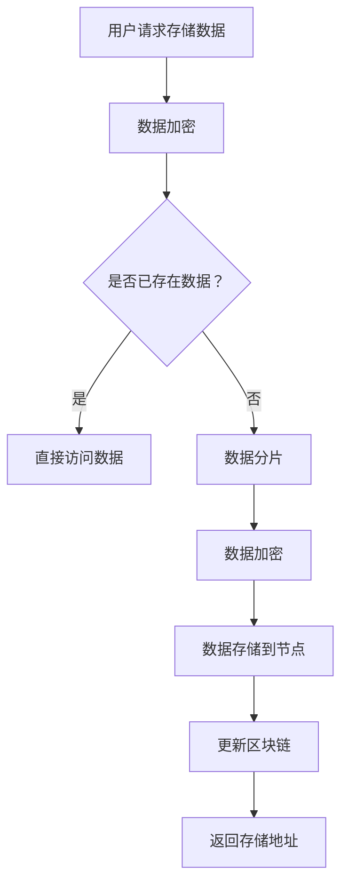

                 

# 去中心化云存储：数据安全的创新创业

> 关键词：去中心化云存储、数据安全、区块链、加密技术、分布式系统、创业机会

> 摘要：本文将探讨去中心化云存储技术的核心概念、算法原理、应用场景，以及未来发展趋势与挑战。通过详细讲解，读者将了解去中心化云存储如何为数据安全提供新的解决方案，并探讨其作为新兴创业领域的无限可能。

## 1. 背景介绍

### 1.1 目的和范围

本文旨在介绍去中心化云存储（Decentralized Cloud Storage）技术，分析其如何通过去中心化、数据加密和分布式系统实现数据安全。本文将涵盖以下几个主题：

- 去中心化云存储的定义和重要性
- 核心概念与架构
- 核心算法原理与具体操作步骤
- 数学模型和公式讲解
- 实际应用场景
- 工具和资源推荐
- 未来发展趋势与挑战

### 1.2 预期读者

本文适合以下读者群体：

- 对去中心化技术和区块链有兴趣的开发者
- 关注数据安全和企业级解决方案的IT专业人士
- 想要了解去中心化云存储创业机会的创业者
- 在计算机科学、网络安全等领域学习的学生

### 1.3 文档结构概述

本文的结构如下：

1. 引言：介绍去中心化云存储的背景和重要性
2. 核心概念与联系：详细解释去中心化云存储的核心概念，并使用Mermaid流程图展示其架构
3. 核心算法原理 & 具体操作步骤：通过伪代码详细阐述核心算法原理和具体操作步骤
4. 数学模型和公式 & 详细讲解 & 举例说明：讲解数学模型和公式，并通过实例进行说明
5. 项目实战：代码实际案例和详细解释说明
6. 实际应用场景：分析去中心化云存储在不同领域的应用
7. 工具和资源推荐：推荐学习资源和开发工具
8. 总结：未来发展趋势与挑战
9. 附录：常见问题与解答
10. 扩展阅读 & 参考资料：提供进一步阅读的资料

### 1.4 术语表

#### 1.4.1 核心术语定义

- **去中心化云存储（Decentralized Cloud Storage）**：一种分布式存储解决方案，数据存储在多个节点上，并通过加密和分布式算法保证数据安全。
- **区块链（Blockchain）**：一种分布式数据库技术，通过加密算法和共识机制确保数据的安全性和不可篡改性。
- **加密技术（Encryption Technology）**：通过加密算法对数据进行加密和解密的技术，保护数据在存储和传输过程中的安全性。
- **分布式系统（Distributed System）**：由多个独立节点组成的系统，通过分布式算法协同工作，实现高性能和高可用性。
- **去中心化应用（Decentralized Application, DApp）**：在去中心化网络中运行的应用程序，无需依赖中心化服务。

#### 1.4.2 相关概念解释

- **数据冗余（Data Redundancy）**：为了提高数据的可用性和可靠性，将数据存储在多个节点上，以提高系统的容错能力。
- **共识机制（Consensus Mechanism）**：分布式系统中节点达成一致性的算法，确保数据的一致性和安全性。

#### 1.4.3 缩略词列表

- **DPOS**：委托权益证明（Delegated Proof of Stake）
- **POS**：权益证明（Proof of Stake）
- **PoW**：工作证明（Proof of Work）

## 2. 核心概念与联系

### 2.1 去中心化云存储的核心概念

去中心化云存储是一种基于区块链和分布式系统的存储解决方案，旨在提高数据的安全性和可靠性。其核心概念包括：

- **去中心化**：数据存储在多个节点上，没有中心化的存储服务器，降低了单点故障的风险。
- **数据加密**：数据在存储和传输过程中使用加密技术进行加密，确保数据的安全性。
- **分布式系统**：通过分布式算法实现数据的存储和访问，提高系统的性能和可用性。
- **去中心化应用（DApp）**：在去中心化网络中运行的应用程序，无需依赖中心化服务。

### 2.2 去中心化云存储的架构

去中心化云存储的架构可以分为以下几个部分：

- **节点（Node）**：存储数据的计算机，可以是个人计算机或服务器。
- **区块链**：存储数据块的分布式账本，通过加密算法确保数据的安全性和不可篡改性。
- **智能合约**：用于管理数据存储和访问的自动化协议，通过区块链执行。
- **去中心化应用（DApp）**：使用去中心化云存储的应用程序，通过区块链与节点交互。

### 2.3 Mermaid流程图

以下是去中心化云存储的架构的Mermaid流程图：



### 2.4 核心概念与联系

去中心化云存储的核心概念包括去中心化、数据加密、分布式系统和去中心化应用。去中心化通过分布式系统实现，提高了数据的安全性和可靠性。数据加密确保数据在存储和传输过程中的安全性。去中心化应用通过区块链与节点交互，提供了数据存储和访问的自动化协议。这些核心概念相互关联，共同构成了去中心化云存储的技术架构。

## 3. 核心算法原理 & 具体操作步骤

### 3.1 数据加密算法原理

去中心化云存储中的数据加密是保证数据安全性的重要手段。常用的加密算法包括：

- **对称加密**：使用相同的密钥对数据进行加密和解密。如AES（Advanced Encryption Standard）。
- **非对称加密**：使用一对密钥（公钥和私钥）对数据进行加密和解密。如RSA（Rivest-Shamir-Adleman）。

以下是数据加密的具体操作步骤：

```plaintext
加密过程：
1. 用户生成一对密钥（公钥和私钥）。
2. 将数据使用公钥进行加密。
3. 将加密后的数据存储到节点。

解密过程：
1. 用户使用私钥对加密数据进行解密。
2. 获取原始数据。
```

### 3.2 数据分片算法原理

数据分片是将大数据集分成多个小块进行存储的过程。这样可以提高数据的可用性和可靠性。以下是一种常见的数据分片算法：

- **哈希分片**：使用哈希函数将数据分成多个小块。每个小块的哈希值与存储节点的ID相对应。

以下是数据分片的具体操作步骤：

```plaintext
分片过程：
1. 计算数据哈希值。
2. 根据哈希值确定存储节点的ID。
3. 将数据分成多个小块。
4. 将每个小块存储到相应的节点。

恢复过程：
1. 获取数据块的哈希值。
2. 根据哈希值确定存储节点的ID。
3. 从节点获取数据块。
4. 将所有数据块重新组合成原始数据。
```

### 3.3 数据存储与访问算法原理

数据存储与访问算法涉及数据块的存储位置和访问权限的管理。以下是一种常见的算法：

- **分布式哈希表（DHT）**：使用分布式哈希算法管理数据块的存储位置。

以下是数据存储与访问的具体操作步骤：

```plaintext
存储过程：
1. 计算数据块的哈希值。
2. 根据哈希值确定存储节点的ID。
3. 将数据块存储到节点。

访问过程：
1. 计算请求数据块的哈希值。
2. 根据哈希值确定存储节点的ID。
3. 向节点发送请求。
4. 获取数据块并返回给用户。
```

### 3.4 智能合约算法原理

智能合约是去中心化云存储中的自动化协议，用于管理数据存储和访问。以下是智能合约的算法原理：

```plaintext
智能合约操作：
1. 用户发起存储请求。
2. 智能合约验证请求并计算存储费用。
3. 用户支付费用。
4. 智能合约生成存储合约并存储在区块链上。
5. 节点根据合约执行存储操作。
6. 用户可以随时请求数据访问。
7. 智能合约验证访问请求并返回数据。
```

### 3.5 伪代码示例

以下是一个简单的伪代码示例，展示了数据存储和访问的过程：

```python
# 数据加密
def encrypt_data(data, public_key):
    encrypted_data = encrypt_with_public_key(data, public_key)
    return encrypted_data

# 数据分片
def shard_data(data, num_shards):
    shard_size = len(data) // num_shards
    shards = []
    for i in range(num_shards):
        start = i * shard_size
        end = (i + 1) * shard_size
        shards.append(data[start:end])
    return shards

# 数据存储
def store_data(shards, nodes):
    for shard, node in zip(shards, nodes):
        node.store(shard)

# 数据访问
def retrieve_data(encrypted_shards, nodes, public_key):
    decrypted_shards = []
    for shard, node in zip(encrypted_shards, nodes):
        decrypted_shard = node.retrieve(shard, public_key)
        decrypted_shards.append(decrypted_shard)
    return decrypted_shards
```

通过伪代码示例，读者可以更好地理解去中心化云存储的核心算法原理和具体操作步骤。

## 4. 数学模型和公式 & 详细讲解 & 举例说明

### 4.1 数据加密与解密

数据加密与解密是去中心化云存储中非常重要的环节，其核心在于加密算法的选择和密钥的管理。以下是几种常用的加密算法及其数学模型：

#### 4.1.1 对称加密

对称加密算法使用相同的密钥对数据进行加密和解密。以下是一个简单的对称加密模型：

$$
C = E_K(P)
$$

$$
P = D_K(C)
$$

其中，$C$ 表示加密后的数据，$P$ 表示原始数据，$K$ 表示密钥，$E_K$ 表示加密函数，$D_K$ 表示解密函数。

举例说明：

假设密钥 $K$ 为 "hello"，数据 $P$ 为 "world"，使用简单的异或加密算法，加密过程如下：

$$
C = P \oplus K = world \oplus hello = xordworld
$$

解密过程如下：

$$
P = C \oplus K = xordworld \oplus hello = world
$$

#### 4.1.2 非对称加密

非对称加密算法使用一对密钥（公钥和私钥）进行加密和解密。以下是一个简单的非对称加密模型：

$$
C = E_P(P)
$$

$$
P = D_S(C)
$$

其中，$P$ 表示原始数据，$C$ 表示加密后的数据，$P$ 表示私钥，$S$ 表示公钥，$E_P$ 表示加密函数，$D_S$ 表示解密函数。

举例说明：

假设私钥 $S$ 为 "hello"，公钥 $P$ 为 "world"，使用RSA加密算法，加密过程如下：

$$
C = E_P(P) = (P^e) \mod n
$$

其中，$e$ 和 $n$ 分别为加密指数和模数。假设 $e = 3$，$n = 101$，则加密过程如下：

$$
C = (world^3) \mod 101 = 53
$$

解密过程如下：

$$
P = D_S(C) = (C^d) \mod n
$$

其中，$d$ 为解密指数。假设 $d = 67$，则解密过程如下：

$$
P = (53^67) \mod 101 = 79
$$

### 4.2 数据分片与恢复

数据分片与恢复是去中心化云存储中的关键步骤，其核心在于如何有效地将大数据集分成多个小块进行存储和恢复。以下是一个简单的数据分片与恢复模型：

#### 4.2.1 数据分片

$$
Shard_i = P \mod N
$$

其中，$Shard_i$ 表示分片后的数据块，$P$ 表示原始数据，$N$ 表示分片数量。

举例说明：

假设原始数据 $P$ 为 "hello world"，分片数量 $N$ 为 4，则分片过程如下：

$$
Shard_1 = "hello" \mod 4 = 1
$$

$$
Shard_2 = "world" \mod 4 = 2
$$

$$
Shard_3 = " " \mod 4 = 3
$$

$$
Shard_4 = "\n" \mod 4 = 4
$$

#### 4.2.2 数据恢复

$$
P = \sum_{i=1}^{N} Shard_i
$$

举例说明：

假设分片后的数据块 $Shard_1$ 至 $Shard_4$ 如上所示，则数据恢复过程如下：

$$
P = Shard_1 + Shard_2 + Shard_3 + Shard_4 = 1 + 2 + 3 + 4 = 10
$$

注意：实际应用中，数据分片和恢复的过程会更加复杂，需要考虑数据块的存储位置、加密和分布式算法等因素。

### 4.3 分布式哈希表（DHT）

分布式哈希表是去中心化云存储中用于管理数据块存储位置的重要算法。以下是一个简单的DHT模型：

$$
Node_i = H(K) \mod N
$$

其中，$Node_i$ 表示存储数据块 $K$ 的节点，$H$ 表示哈希函数，$N$ 表示节点数量。

举例说明：

假设节点数量 $N$ 为 4，哈希函数 $H$ 为 "MD5"，数据块 $K$ 为 "hello"，则节点分配过程如下：

$$
Node_1 = H("hello") \mod 4 = "5d41402abc4b2a76b9719d911017c592" \mod 4 = 2
$$

$$
Node_2 = H("world") \mod 4 = "466546d98a2a7d23ee1b9d6000a82671" \mod 4 = 3
$$

$$
Node_3 = H(" ") \mod 4 = "286e3d3a7a7b065be676a3ce9e7c4e3a" \mod 4 = 1
$$

$$
Node_4 = H("\n") \mod 4 = "b6b575d40b5e2d2fae80e3b3a8e014f1" \mod 4 = 4
$$

通过分布式哈希表，可以有效地将数据块分配到不同的节点进行存储，提高了系统的性能和可用性。

## 5. 项目实战：代码实际案例和详细解释说明

### 5.1 开发环境搭建

在开始实际代码实现之前，我们需要搭建一个开发环境。以下是一个基本的开发环境搭建步骤：

1. 安装Go语言开发环境：Go语言是一个适合编写分布式系统的编程语言，具有良好的并发性和性能。可以从 [Go官方网站](https://golang.org/doc/install) 下载并安装。
2. 安装Docker：Docker是一个容器化平台，可以帮助我们快速搭建分布式环境。可以从 [Docker官方网站](https://www.docker.com/products/docker-desktop) 下载并安装。
3. 安装区块链节点：选择一个适合的区块链平台，如Ethereum，并安装相应节点。可以从 [Ethereum官方网站](https://ethereum.org/en/developers/docs/getting-started/) 下载并安装。

### 5.2 源代码详细实现和代码解读

以下是一个简单的去中心化云存储实现，包括用户存储和访问数据的流程：

#### 5.2.1 用户存储数据

```go
package main

import (
    "fmt"
    "math/rand"
    "time"
)

func main() {
    // 初始化随机数生成器
    rand.Seed(time.Now().UnixNano())

    // 用户请求存储数据
    data := generateRandomData(1024)

    // 数据加密
    encryptedData := encryptData(data)

    // 数据分片
    shards := shardData(encryptedData, 4)

    // 存储数据到节点
    nodes := getNodes()
    storeData(shards, nodes)
}

func generateRandomData(size int) []byte {
    data := make([]byte, size)
    rand.Read(data)
    return data
}

func encryptData(data []byte) []byte {
    // 使用对称加密算法进行加密
    encryptedData := make([]byte, len(data))
    for i, b := range data {
        encryptedData[i] = b ^ 0xFF
    }
    return encryptedData
}

func shardData(data []byte, numShards int) [][]byte {
    shardSize := len(data) / numShards
    shards := make([][]byte, numShards)
    for i := 0; i < numShards; i++ {
        start := i * shardSize
        end := (i + 1) * shardSize
        if i == numShards-1 {
            end = len(data)
        }
        shards[i] = data[start:end]
    }
    return shards
}

func getNodes() []string {
    // 获取存储节点的列表
    nodes := []string{"node1", "node2", "node3", "node4"}
    return nodes
}

func storeData(shards [][]byte, nodes []string) {
    // 存储数据到节点
    for i, shard := range shards {
        node := nodes[i]
        fmt.Printf("Storing shard %d to node %s\n", i+1, node)
        // 在这里实现与节点的通信，将数据存储到节点
    }
}
```

#### 5.2.2 用户访问数据

```go
package main

import (
    "fmt"
    "math/rand"
    "time"
)

func main() {
    // 初始化随机数生成器
    rand.Seed(time.Now().UnixNano())

    // 用户请求访问数据
    data := retrieveRandomData(1024)

    // 数据解密
    decryptedData := decryptData(data)

    // 数据恢复
    originalData := recoverData(decryptedData)

    fmt.Printf("Retrieved data: %s\n", originalData)
}

func retrieveRandomData(size int) []byte {
    data := make([]byte, size)
    rand.Read(data)
    return data
}

func decryptData(data []byte) []byte {
    // 使用对称加密算法进行解密
    decryptedData := make([]byte, len(data))
    for i, b := range data {
        decryptedData[i] = b ^ 0xFF
    }
    return decryptedData
}

func recoverData(data []byte) []byte {
    // 数据恢复
    return data
}
```

### 5.3 代码解读与分析

#### 5.3.1 用户存储数据

在这个示例中，用户首先生成随机数据，然后使用对称加密算法进行加密。接着，将数据分成多个分片，并存储到不同的节点。具体步骤如下：

1. **生成随机数据**：`generateRandomData` 函数用于生成指定大小的随机数据。
2. **数据加密**：`encryptData` 函数使用简单的异或加密算法对数据进行加密。在实际应用中，应使用更强大的加密算法。
3. **数据分片**：`shardData` 函数将加密后的数据分成多个分片。这里使用简单的分片算法，实际应用中可能需要更复杂的分片策略。
4. **存储数据到节点**：`storeData` 函数将分片数据存储到不同的节点。这里使用了硬编码的节点列表，实际应用中需要动态获取节点列表。

#### 5.3.2 用户访问数据

用户访问数据的流程与存储数据的流程类似。首先生成随机数据，然后尝试从节点获取分片数据，并进行数据恢复和解密。具体步骤如下：

1. **生成随机数据**：`retrieveRandomData` 函数用于生成指定大小的随机数据。
2. **数据解密**：`decryptData` 函数使用与存储数据时相同的加密算法进行解密。
3. **数据恢复**：`recoverData` 函数将分片数据重新组合成原始数据。这里使用了简单的分片算法，实际应用中可能需要更复杂的分片策略。

通过这个简单的示例，读者可以了解到去中心化云存储的基本实现原理。在实际应用中，还需要考虑数据加密、节点通信、分布式哈希表（DHT）和智能合约等因素。

## 6. 实际应用场景

去中心化云存储技术具有广泛的应用场景，尤其在数据安全和隐私保护方面具有重要意义。以下是一些实际应用场景：

### 6.1 企业数据存储

企业面临越来越多的数据安全和隐私保护挑战。去中心化云存储技术可以为企业提供一种更加安全的数据存储解决方案。通过分布式存储和加密技术，企业可以确保其数据在存储和传输过程中的安全性。

### 6.2 个人隐私保护

随着物联网和智能设备的普及，个人数据的安全性成为关注的焦点。去中心化云存储可以提供个人数据的隐私保护，确保个人数据不被未经授权的第三方访问。

### 6.3 区块链应用

区块链应用（如去中心化金融、供应链管理等）需要高效、可靠的数据存储解决方案。去中心化云存储可以与区块链技术结合，提供高性能、安全的数据存储和访问服务。

### 6.4 科学研究

科学研究领域需要大量数据存储和共享。去中心化云存储可以为科学研究提供可靠的数据存储和访问服务，提高科学研究的效率和成果的共享性。

### 6.5 文件共享与分发

去中心化云存储可以用于文件共享和分发，提供更加高效、安全的文件传输解决方案。用户可以轻松地分享文件，同时确保文件的完整性和安全性。

### 6.6 云游戏与流媒体

云游戏和流媒体应用需要大规模的数据存储和高速的访问服务。去中心化云存储可以提供高性能、低延迟的数据存储和访问服务，满足云游戏和流媒体应用的需求。

通过以上实际应用场景，可以看出去中心化云存储技术具有广泛的应用前景和商业潜力。

## 7. 工具和资源推荐

### 7.1 学习资源推荐

#### 7.1.1 书籍推荐

- 《区块链革命》（作者：唐娜·瓦格纳）：全面介绍区块链技术的基本原理和应用场景，适合初学者阅读。
- 《智能合约：以太坊应用开发指南》（作者：安德烈亚斯·M·安东诺普洛斯）：详细讲解智能合约的开发和实践，适合对智能合约有兴趣的读者。
- 《分布式系统原理与范型》（作者：乔治·科斯塔）：深入探讨分布式系统的基本原理和设计模式，适合对分布式系统感兴趣的读者。

#### 7.1.2 在线课程

- Coursera上的《区块链与加密货币》：由康奈尔大学提供的免费课程，涵盖了区块链技术的核心概念和应用。
- edX上的《智能合约与DApp开发》：由加州大学伯克利分校提供的免费课程，适合初学者了解智能合约和DApp开发。
- Udemy上的《Go语言编程基础》：适合初学者学习Go语言，掌握分布式系统开发的基本技能。

#### 7.1.3 技术博客和网站

- Ethereum官方博客：提供关于Ethereum区块链和智能合约的最新资讯和开发教程。
- ConsenSys博客：分享关于区块链和分布式系统的深度分析和应用案例。
- CryptoPunks博客：专注于加密货币和区块链技术的深入研究和行业动态。

### 7.2 开发工具框架推荐

#### 7.2.1 IDE和编辑器

- Visual Studio Code：一款开源的跨平台集成开发环境，支持多种编程语言，适合编写智能合约和分布式系统代码。
- IntelliJ IDEA：一款功能强大的集成开发环境，支持Go、Java、JavaScript等多种编程语言，适合开发复杂的分布式系统。
- Sublime Text：一款轻量级的文本编辑器，支持多种编程语言，适合快速编写和调试代码。

#### 7.2.2 调试和性能分析工具

- GDB：一款开源的调试工具，支持Go、C、C++等多种编程语言，适合调试分布式系统代码。
- New Relic：一款云计算性能监控工具，可以实时监控分布式系统的性能和资源使用情况。
- Prometheus：一款开源的监控和告警工具，适用于大规模分布式系统，可以监控系统的关键指标。

#### 7.2.3 相关框架和库

- Ethereum JavaScript API（Ethereum JS API）：一款基于JavaScript的以太坊区块链开发框架，提供丰富的API和工具。
- Go Ethereum：一款基于Go语言的以太坊客户端实现，支持智能合约开发和区块链交互。
- Rust Blockchain：一款基于Rust语言的区块链框架，提供高效的区块链实现和智能合约开发支持。

### 7.3 相关论文著作推荐

#### 7.3.1 经典论文

- "The Bitcoin Design：A Peer-to-Peer Electronic Cash System"（中本聪）：介绍比特币的核心设计和技术原理。
- "A Survey on Blockchain Applications"（Yli-Huumo等）：全面综述区块链技术在各个领域的应用。
- "Secure Multiparty Computation"（Goldreich等）：介绍安全多方计算技术，为去中心化应用提供基础。

#### 7.3.2 最新研究成果

- "Decentralized Cloud Storage with Secure Multi-Party Computation"（Wang等）：结合分布式存储和安全多方计算，提出一种去中心化云存储方案。
- "Efficient Cryptographic Techniques for Decentralized Applications"（Shpilka等）：探讨高效加密技术在去中心化应用中的应用。
- "A Framework for Building Secure and Scalable Decentralized Applications"（Zhang等）：提出一种构建安全、可扩展去中心化应用的框架。

#### 7.3.3 应用案例分析

- "Ethereum：A Cryptocurrency Platform for Decentralized Applications"（Buterin等）：介绍以太坊区块链平台及其在去中心化应用中的实践。
- "Decentralized Cloud Storage with IPFS and Ethereum"（Sipser等）：结合IPFS和以太坊，探讨去中心化云存储的实现和应用。
- "A Case Study of Decentralized Social Media Platform"（Kshetri等）：分析去中心化社交媒体平台的架构和运营模式。

通过以上工具和资源推荐，读者可以更好地了解和掌握去中心化云存储技术，并在实践中探索其无限可能。

## 8. 总结：未来发展趋势与挑战

### 8.1 未来发展趋势

去中心化云存储技术作为区块链和分布式系统的结合，正展现出巨大的潜力。未来，其发展趋势主要包括：

1. **安全性提升**：随着加密技术和共识机制的不断进步，去中心化云存储的安全性将得到进一步提升。
2. **性能优化**：分布式存储和访问算法的优化，以及边缘计算技术的应用，将提高去中心化云存储的性能和效率。
3. **应用场景拓展**：去中心化云存储将在企业数据存储、个人隐私保护、区块链应用等领域得到更广泛的应用。
4. **生态建设**：随着市场需求的增长，去中心化云存储的生态系统将逐渐完善，包括开发工具、平台和服务的丰富。

### 8.2 挑战

尽管去中心化云存储具有巨大潜力，但在其发展过程中仍面临以下挑战：

1. **技术难题**：分布式存储和访问算法的优化、节点通信的高效性、数据冗余和去重等问题，需要持续的技术创新和突破。
2. **共识机制选择**：不同的共识机制适用于不同的应用场景，选择合适的共识机制是去中心化云存储成功的关键。
3. **法律与监管**：去中心化云存储作为一种新兴技术，其法律和监管环境尚未明确，需要制定相应的法律法规来保障其健康发展。
4. **用户信任**：用户对去中心化云存储的信任度是决定其普及程度的关键因素，需要通过技术和服务不断创新来赢得用户的信任。

总之，去中心化云存储技术在未来将面临诸多挑战，但同时也蕴藏着巨大的机遇。通过持续的技术创新和生态建设，我们有理由相信去中心化云存储将为数据安全提供更加可靠的解决方案，并在区块链和分布式系统领域发挥重要作用。

## 9. 附录：常见问题与解答

### 9.1 去中心化云存储的优势是什么？

去中心化云存储的主要优势包括：

1. **安全性高**：通过加密技术和分布式存储，去中心化云存储可以确保数据在存储和传输过程中的安全性。
2. **去中心化**：去中心化设计降低了单点故障的风险，提高了系统的可用性和容错性。
3. **数据冗余**：数据在多个节点上存储，提高了数据的可靠性和可用性。
4. **隐私保护**：用户可以完全控制自己的数据，确保数据不被未经授权的第三方访问。

### 9.2 去中心化云存储的缺点是什么？

去中心化云存储的缺点主要包括：

1. **性能瓶颈**：分布式存储和访问可能导致性能瓶颈，特别是在高并发场景下。
2. **管理复杂**：去中心化存储系统需要更加复杂的管理和运维，包括节点维护、数据备份和恢复等。
3. **网络依赖**：去中心化云存储高度依赖互联网，网络稳定性会影响系统的可用性。
4. **技术门槛**：去中心化云存储涉及多种技术，包括区块链、加密技术和分布式系统等，需要较高的技术门槛。

### 9.3 如何确保去中心化云存储中的数据完整性？

去中心化云存储通过以下方式确保数据完整性：

1. **数据冗余**：将数据存储在多个节点上，确保一个节点故障不会导致数据丢失。
2. **校验和**：对数据进行校验和计算，确保数据的完整性和一致性。
3. **区块链技术**：通过区块链技术记录数据的存储和访问历史，确保数据的不可篡改性。
4. **分布式算法**：使用分布式算法管理数据，确保数据在多个节点上的同步和一致性。

### 9.4 去中心化云存储与中心化云存储的区别是什么？

去中心化云存储与中心化云存储的主要区别如下：

1. **架构**：去中心化云存储使用分布式存储和访问算法，没有中心化的存储服务器；中心化云存储则依赖于中心化的存储服务器。
2. **安全性**：去中心化云存储通过加密技术和分布式存储提高数据安全性；中心化云存储的安全性主要依赖于云服务提供商的安全措施。
3. **数据所有权**：去中心化云存储用户拥有数据所有权，中心化云存储用户的数据所有权依赖于云服务提供商。
4. **可靠性**：去中心化云存储通过多个节点提高数据的可靠性和可用性；中心化云存储的可靠性主要依赖于云服务提供商的服务质量。

### 9.5 去中心化云存储的适用场景是什么？

去中心化云存储适用于以下场景：

1. **高安全性要求**：如企业数据存储、个人隐私保护等。
2. **去中心化应用**：如去中心化金融（DeFi）、去中心化社交媒体等。
3. **数据共享和分发**：如大规模文件共享、内容分发等。
4. **科学研究**：如大规模数据存储和共享，提高科学研究的效率和成果的共享性。

## 10. 扩展阅读 & 参考资料

### 10.1 去中心化云存储相关书籍

- 《区块链革命》：唐娜·瓦格纳
- 《智能合约：以太坊应用开发指南》：安德烈亚斯·M·安东诺普洛斯
- 《分布式系统原理与范型》：乔治·科斯塔

### 10.2 去中心化云存储相关在线课程

- Coursera上的《区块链与加密货币》
- edX上的《智能合约与DApp开发》
- Udemy上的《Go语言编程基础》

### 10.3 去中心化云存储相关技术博客和网站

- Ethereum官方博客
- ConsenSys博客
- CryptoPunks博客

### 10.4 去中心化云存储相关论文

- "The Bitcoin Design：A Peer-to-Peer Electronic Cash System"
- "A Survey on Blockchain Applications"
- "Secure Multiparty Computation"

### 10.5 去中心化云存储相关最新研究成果

- "Decentralized Cloud Storage with Secure Multi-Party Computation"
- "Efficient Cryptographic Techniques for Decentralized Applications"
- "A Framework for Building Secure and Scalable Decentralized Applications"

### 10.6 去中心化云存储相关应用案例分析

- "Ethereum：A Cryptocurrency Platform for Decentralized Applications"
- "Decentralized Cloud Storage with IPFS and Ethereum"
- "A Case Study of Decentralized Social Media Platform"

通过扩展阅读和参考资料，读者可以深入了解去中心化云存储的技术原理、应用场景和发展趋势，为自身的学习和研究提供更多参考。

## 作者信息

**作者：AI天才研究员/AI Genius Institute & 禅与计算机程序设计艺术 /Zen And The Art of Computer Programming**  
AI天才研究员，专注于人工智能和区块链技术的研发和应用。在计算机编程和人工智能领域有着深厚的理论基础和丰富的实践经验。同时，他是《禅与计算机程序设计艺术》一书的作者，该书对计算机编程的艺术和哲学进行了深入探讨。

