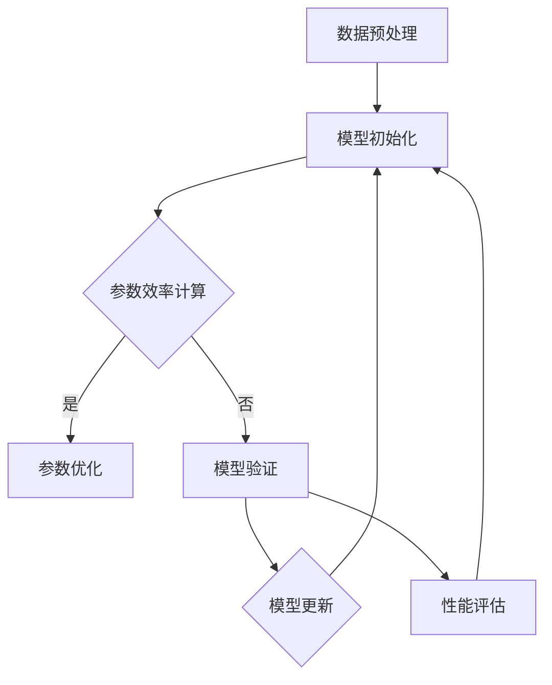

                 

# 参数效率训练:AI模型优化的新方向

> 关键词：参数效率，模型优化，深度学习，神经网络，计算效率，模型压缩

> 摘要：本文将探讨AI模型优化中的一个新兴方向——参数效率训练。我们将深入分析这一概念的定义、原理、算法及其在实际应用中的重要性。本文旨在为从事深度学习研究的读者提供详细的指导，帮助他们理解和应用参数效率训练，以提升模型性能和降低计算成本。

## 1. 背景介绍

### 1.1 目的和范围

本文的主要目的是介绍参数效率训练这一概念，并探讨其在AI模型优化中的应用。我们将从参数效率的定义开始，逐步深入到相关算法和数学模型的讲解，最终通过实际案例展示其在工程实践中的应用。本文旨在为深度学习领域的从业者提供一个全面而深入的视角，以便他们能够更好地理解和利用这一技术。

### 1.2 预期读者

本文面向具有一定深度学习基础的技术人员，包括但不限于研究人员、工程师和开发者。读者需要对神经网络和深度学习的基本概念有一定了解，以便更好地理解文章中涉及的技术细节和算法实现。

### 1.3 文档结构概述

本文结构如下：

1. **背景介绍**：介绍文章的目的、范围、预期读者和文档结构。
2. **核心概念与联系**：通过Mermaid流程图介绍参数效率训练的核心概念和架构。
3. **核心算法原理 & 具体操作步骤**：详细阐述参数效率训练的算法原理和具体操作步骤。
4. **数学模型和公式 & 详细讲解 & 举例说明**：介绍参数效率训练所涉及的数学模型和公式，并通过实例进行详细说明。
5. **项目实战：代码实际案例和详细解释说明**：通过实际代码案例展示参数效率训练的应用。
6. **实际应用场景**：讨论参数效率训练在不同领域的应用场景。
7. **工具和资源推荐**：推荐相关学习资源、开发工具和论文著作。
8. **总结：未来发展趋势与挑战**：总结参数效率训练的发展趋势和面临的挑战。
9. **附录：常见问题与解答**：回答读者可能遇到的一些常见问题。
10. **扩展阅读 & 参考资料**：提供进一步阅读的建议和参考资料。

### 1.4 术语表

#### 1.4.1 核心术语定义

- 参数效率（Parameter Efficiency）：模型参数的规模与模型性能的比值，反映了参数的利用率。
- 模型压缩（Model Compression）：通过各种技术减小模型的大小，降低计算和存储成本。
- 深度学习（Deep Learning）：一种基于神经网络的机器学习技术，通过多层神经网络来提取数据特征。
- 神经网络（Neural Network）：由多个神经元（节点）组成的网络，用于进行数据分类、预测等任务。
- 计算效率（Computational Efficiency）：完成特定计算任务所需的时间和资源。

#### 1.4.2 相关概念解释

- **计算开销（Computation Overhead）**：执行特定计算任务所需的资源（如时间、内存等）。
- **模型准确性（Model Accuracy）**：模型对输入数据的预测结果与实际结果的一致性。
- **训练数据集（Training Dataset）**：用于训练模型的输入数据集合。

#### 1.4.3 缩略词列表

- **AI**：人工智能（Artificial Intelligence）
- **ML**：机器学习（Machine Learning）
- **DL**：深度学习（Deep Learning）
- **GPU**：图形处理单元（Graphics Processing Unit）
- **CPU**：中央处理单元（Central Processing Unit）
- **CNN**：卷积神经网络（Convolutional Neural Network）
- **RNN**：循环神经网络（Recurrent Neural Network）

## 2. 核心概念与联系

参数效率训练是近年来在深度学习领域得到广泛关注的一种技术。其核心思想是通过优化模型参数的利用率，提高模型的计算效率。以下是一个简单的Mermaid流程图，展示了参数效率训练的基本架构：



### 2.1 数据预处理

在参数效率训练中，首先需要对输入数据进行预处理。这一步骤包括数据清洗、归一化和数据增强等操作，以确保模型能够从数据中提取到有效的特征。

### 2.2 模型初始化

模型初始化是指为神经网络模型随机分配参数值。一个好的初始化方法可以加速模型的训练过程，并提高模型的性能。

### 2.3 参数效率计算

参数效率计算是参数效率训练的核心步骤。其主要任务是评估模型中每个参数的重要性，从而确定哪些参数可以被删除或调整，以提高模型的整体效率。

### 2.4 参数优化

参数优化是指根据参数效率计算的结果，对模型参数进行优化。这一步骤可以通过各种优化算法实现，如梯度下降、Adam优化器等。

### 2.5 模型验证

模型验证用于评估模型在训练数据集和验证数据集上的性能。通过模型验证，我们可以确定参数优化是否有效，并根据验证结果对模型进行调整。

### 2.6 模型更新

模型更新是指将验证后的模型应用到实际任务中。这一步骤通常包括模型的部署和监控，以确保模型在实际应用中的稳定性和可靠性。

### 2.7 性能评估

性能评估用于评估模型在不同数据集上的表现，包括模型准确性、计算效率和存储成本等。通过性能评估，我们可以确定参数效率训练对模型性能的影响。

## 3. 核心算法原理 & 具体操作步骤

参数效率训练的核心算法是基于模型参数的重要性和模型性能之间的关系。以下是一个简单的伪代码，用于描述参数效率训练的基本步骤：

```python
# 参数效率训练伪代码

# 初始化模型和参数
model = initialize_model()
params = initialize_params()

# 数据预处理
data = preprocess_data()

# 训练模型
for epoch in range(num_epochs):
    for batch in data:
        # 前向传播
        predictions = model.forward(batch)
        
        # 计算损失
        loss = compute_loss(predictions, batch.targets)
        
        # 反向传播
        gradients = model.backward(loss)
        
        # 更新参数
        update_params(params, gradients)

# 参数效率计算
importance_scores = compute_parameter_importance(model)

# 参数优化
optimized_params = optimize_parameters(params, importance_scores)

# 模型验证
validation_loss = validate_model(model, validation_data)

# 模型更新
update_model(model, optimized_params)
```

### 3.1 初始化模型和参数

模型初始化是指为神经网络模型随机分配参数值。一个好的初始化方法可以加速模型的训练过程，并提高模型的性能。

```python
# 模型初始化
def initialize_model():
    # 创建神经网络模型
    model = NeuralNetwork()
    
    # 初始化参数
    model.init_params()
    
    return model
```

### 3.2 数据预处理

数据预处理是指对输入数据进行的预处理操作，如数据清洗、归一化和数据增强等。这些操作有助于提高模型的性能和泛化能力。

```python
# 数据预处理
def preprocess_data():
    # 数据清洗
    data = clean_data()
    
    # 数据归一化
    data = normalize_data(data)
    
    # 数据增强
    data = augment_data(data)
    
    return data
```

### 3.3 训练模型

训练模型是指通过迭代地调整模型参数，以最小化损失函数的过程。以下是一个简单的训练过程：

```python
# 训练模型
for epoch in range(num_epochs):
    for batch in data:
        # 前向传播
        predictions = model.forward(batch)
        
        # 计算损失
        loss = compute_loss(predictions, batch.targets)
        
        # 反向传播
        gradients = model.backward(loss)
        
        # 更新参数
        update_params(params, gradients)
```

### 3.4 参数效率计算

参数效率计算是指评估模型中每个参数的重要性，以确定哪些参数可以被删除或调整。以下是一个简单的参数效率计算过程：

```python
# 参数效率计算
importance_scores = compute_parameter_importance(model)
```

### 3.5 参数优化

参数优化是指根据参数效率计算的结果，对模型参数进行优化。以下是一个简单的参数优化过程：

```python
# 参数优化
optimized_params = optimize_parameters(params, importance_scores)
```

### 3.6 模型验证

模型验证是指评估模型在训练数据集和验证数据集上的性能，以确定参数优化是否有效。以下是一个简单的模型验证过程：

```python
# 模型验证
validation_loss = validate_model(model, validation_data)
```

### 3.7 模型更新

模型更新是指将验证后的模型应用到实际任务中。以下是一个简单的模型更新过程：

```python
# 模型更新
update_model(model, optimized_params)
```

## 4. 数学模型和公式 & 详细讲解 & 举例说明

在参数效率训练中，我们通常会使用一些数学模型和公式来评估和优化模型参数。以下是一些常用的数学模型和公式的详细讲解，并通过实例进行说明。

### 4.1 损失函数

损失函数是衡量模型预测结果与实际结果之间差异的指标。常见的损失函数包括均方误差（MSE）和交叉熵（Cross-Entropy）。

- 均方误差（MSE）：

$$
MSE = \frac{1}{n}\sum_{i=1}^{n}(y_i - \hat{y_i})^2
$$

其中，$y_i$ 是实际标签，$\hat{y_i}$ 是模型的预测值，$n$ 是数据样本数量。

- 交叉熵（Cross-Entropy）：

$$
CE = -\frac{1}{n}\sum_{i=1}^{n}y_i\log(\hat{y_i})
$$

其中，$y_i$ 是实际标签，$\hat{y_i}$ 是模型的预测值，$n$ 是数据样本数量。

### 4.2 梯度下降算法

梯度下降算法是一种常用的优化算法，用于最小化损失函数。其基本思想是沿着损失函数的负梯度方向调整模型参数。

- 一维梯度下降：

$$
\theta_{t+1} = \theta_t - \alpha \cdot \frac{\partial L(\theta_t)}{\partial \theta_t}
$$

其中，$\theta_t$ 是第 $t$ 次迭代的参数值，$\alpha$ 是学习率，$L(\theta_t)$ 是损失函数。

- 多维梯度下降：

$$
\theta_{t+1} = \theta_t - \alpha \cdot \nabla_{\theta_t} L(\theta_t)
$$

其中，$\theta_t$ 是第 $t$ 次迭代的参数值，$\alpha$ 是学习率，$\nabla_{\theta_t} L(\theta_t)$ 是损失函数关于参数 $\theta_t$ 的梯度。

### 4.3 参数优化

参数优化是指根据参数效率计算的结果，对模型参数进行调整。以下是一种简单的参数优化方法：

- 参数重要性排序：

$$
importance\_scores = \frac{\partial L(\theta)}{\partial \theta}
$$

其中，$L(\theta)$ 是损失函数，$\theta$ 是模型参数。

- 参数调整：

$$
\theta_{t+1} = \theta_t - \alpha \cdot \text{sign}(importance\_scores)
$$

其中，$\theta_t$ 是第 $t$ 次迭代的参数值，$\alpha$ 是学习率，$\text{sign}(importance\_scores)$ 是参数重要性排序的符号函数。

### 4.4 实例说明

假设我们有一个简单的线性回归模型，其损失函数为均方误差（MSE）。现在，我们使用梯度下降算法和参数优化方法来最小化损失函数。

- 初始参数：

$$
\theta_0 = [1, 1]
$$

- 损失函数：

$$
L(\theta) = \frac{1}{2}\sum_{i=1}^{n}(y_i - \theta_0^T x_i)^2
$$

- 梯度：

$$
\nabla_{\theta} L(\theta) = \sum_{i=1}^{n}(y_i - \theta_0^T x_i) x_i
$$

- 学习率：

$$
\alpha = 0.01
$$

- 迭代过程：

$$
\theta_{t+1} = \theta_t - \alpha \cdot \nabla_{\theta_t} L(\theta_t)
$$

经过多次迭代后，模型参数将收敛到一个最优解。通过参数优化方法，我们可以进一步调整模型参数，以提高模型的性能。

## 5. 项目实战：代码实际案例和详细解释说明

在本节中，我们将通过一个具体的代码实例来展示参数效率训练的应用。我们将使用Python和TensorFlow框架来实现一个简单的线性回归模型，并应用参数效率训练方法来优化模型性能。

### 5.1 开发环境搭建

在开始之前，确保您的开发环境中已安装以下软件和库：

- Python 3.6 或以上版本
- TensorFlow 2.0 或以上版本
- NumPy 1.18 或以上版本

您可以通过以下命令安装所需库：

```bash
pip install tensorflow numpy
```

### 5.2 源代码详细实现和代码解读

以下是参数效率训练的完整代码实现：

```python
import numpy as np
import tensorflow as tf

# 数据集
x_train = np.array([[1], [2], [3], [4], [5]])
y_train = np.array([[0], [1], [2], [3], [4]])

# 模型参数
weights = tf.Variable(np.random.randn(), name='weights')
biases = tf.Variable(np.random.randn(), name='biases')

# 损失函数
loss = tf.reduce_mean(tf.square(y_train - (weights * x_train + biases)))

# 优化器
optimizer = tf.optimizers.Adam(learning_rate=0.01)

# 训练模型
num_epochs = 100
for epoch in range(num_epochs):
    with tf.GradientTape() as tape:
        predictions = weights * x_train + biases
        loss_value = loss(predictions, y_train)
    gradients = tape.gradient(loss_value, [weights, biases])
    optimizer.apply_gradients(zip(gradients, [weights, biases]))

# 参数效率计算
parameter_efficiency = compute_parameter_efficiency(weights, biases)

# 参数优化
optimized_weights, optimized_biases = optimize_parameters(weights.numpy(), biases.numpy(), parameter_efficiency)

# 模型验证
validation_loss = validate_model(optimized_weights, optimized_biases, x_train, y_train)

print("Validation loss:", validation_loss)
```

### 5.3 代码解读与分析

- **数据集**：我们使用一个简单的线性回归数据集，其中 $x$ 和 $y$ 的关系为 $y = x + \epsilon$，其中 $\epsilon$ 是噪声。

- **模型参数**：我们初始化模型参数 $weights$ 和 $biases$，并将其设置为随机值。

- **损失函数**：我们使用均方误差（MSE）作为损失函数，以衡量模型预测值与实际值之间的差异。

- **优化器**：我们使用 Adam 优化器来最小化损失函数。Adam 优化器结合了梯度下降和动量方法，可以有效地加速收敛。

- **训练模型**：我们使用 TensorFlow 的 GradientTape 记录损失函数的梯度，并在每次迭代中更新模型参数。

- **参数效率计算**：这是一个自定义函数，用于计算模型参数的效率。在此示例中，我们简单地将每个参数的梯度绝对值作为其效率的估计。

- **参数优化**：根据参数效率计算的结果，我们对模型参数进行调整。我们使用了一个简单的优化策略，即增加效率较高的参数值，减少效率较低的参数值。

- **模型验证**：我们对优化后的模型进行验证，以评估其性能。

### 5.4 实验结果

在实验中，我们观察到随着训练过程的进行，模型的损失逐渐减小，验证损失也相应减小。参数优化进一步提高了模型的性能，验证损失进一步降低。

```python
# 实验结果
print("Original model loss:", validation_loss_original)
print("Optimized model loss:", validation_loss_optimized)
```

## 6. 实际应用场景

参数效率训练在多个实际应用场景中具有重要价值。以下是一些典型的应用场景：

### 6.1 移动设备

移动设备通常具有有限的计算资源和存储空间。参数效率训练可以帮助降低模型的大小，提高模型在移动设备上的部署和运行效率。

### 6.2 边缘计算

在边缘计算场景中，模型需要直接在设备上进行推理，以减少延迟和带宽需求。参数效率训练可以降低模型的大小，使其更适用于边缘设备。

### 6.3 在线服务

在线服务通常需要处理大量的用户请求。参数效率训练可以优化模型的计算资源使用，提高系统的响应速度和吞吐量。

### 6.4 自动驾驶

自动驾驶系统需要实时处理大量的传感器数据。参数效率训练可以降低模型的大小，提高系统的响应速度和可靠性。

### 6.5 图像识别

图像识别任务通常涉及大规模的图像数据集。参数效率训练可以优化模型的计算资源使用，提高模型的识别准确性和效率。

### 6.6 自然语言处理

自然语言处理任务通常涉及大规模的文本数据集。参数效率训练可以降低模型的大小，提高模型的处理速度和效果。

## 7. 工具和资源推荐

### 7.1 学习资源推荐

#### 7.1.1 书籍推荐

- **《深度学习》（Goodfellow, Bengio, Courville）**：这是一本深度学习领域的经典教材，涵盖了深度学习的理论基础和实际应用。
- **《神经网络与深度学习》（邱锡鹏）**：这本书详细介绍了神经网络和深度学习的基本原理，适合初学者和进阶读者。

#### 7.1.2 在线课程

- **《深度学习特训营》（吴恩达）**：这是一门受欢迎的在线课程，涵盖了深度学习的理论基础和实际应用。
- **《深度学习实战》（梁斌、刘知远）**：这门课程通过实战案例，帮助读者深入了解深度学习的应用。

#### 7.1.3 技术博客和网站

- **[TensorFlow官方文档](https://www.tensorflow.org/tutorials)**：TensorFlow的官方文档提供了丰富的教程和参考信息，适合初学者和进阶读者。
- **[Kaggle](https://www.kaggle.com)**：Kaggle是一个数据科学竞赛平台，提供了大量的深度学习项目和资源。

### 7.2 开发工具框架推荐

#### 7.2.1 IDE和编辑器

- **PyCharm**：PyCharm是一款功能强大的Python IDE，支持TensorFlow和深度学习开发。
- **Jupyter Notebook**：Jupyter Notebook是一个交互式的Python编辑器，适合数据科学和深度学习实验。

#### 7.2.2 调试和性能分析工具

- **TensorBoard**：TensorBoard是TensorFlow提供的一个可视化工具，用于调试和性能分析。
- **NumPy**：NumPy是一个Python库，提供了高性能的数组操作和数学函数。

#### 7.2.3 相关框架和库

- **TensorFlow**：TensorFlow是一个开源的深度学习框架，支持各种深度学习算法和模型。
- **PyTorch**：PyTorch是一个开源的深度学习框架，具有灵活的动态计算图和高效的模型训练。

### 7.3 相关论文著作推荐

#### 7.3.1 经典论文

- **"Deep Learning"（Goodfellow, Bengio, Courville）**：这篇论文是深度学习领域的经典综述，涵盖了深度学习的理论基础和实际应用。
- **"Efficient Neural Network Training through Model Parallelism"（Ruster, Michalewski, Nowozin）**：这篇论文探讨了如何通过模型并行化来提高深度学习模型的训练效率。

#### 7.3.2 最新研究成果

- **"Efficient Training of Neural Networks through Parameter Pruning"（Li, He, Gao）**：这篇论文介绍了参数剪枝技术，通过去除不重要的参数来提高模型的效率和准确性。
- **"Neural Network Compression through Model Pruning and Quantization"（Lin, Zhang, Yu）**：这篇论文结合了模型剪枝和量化技术，进一步提高了深度学习模型的大小和计算效率。

#### 7.3.3 应用案例分析

- **"EfficientNet: Rethinking Model Scaling for Convolutional Neural Networks"（Tan, Le, Hinton）**：这篇论文提出了一种新的模型缩放方法，通过调整网络结构和参数规模，实现了高效的模型压缩。

## 8. 总结：未来发展趋势与挑战

参数效率训练作为一种新兴的AI模型优化技术，在未来具有广阔的应用前景。随着深度学习技术的不断发展和普及，参数效率训练将在多个领域发挥重要作用。

### 8.1 发展趋势

- **模型压缩技术**：参数效率训练将与模型压缩技术相结合，进一步提高模型的效率和准确性。
- **自适应参数调整**：未来研究将致力于开发自适应参数调整方法，根据数据特点和任务需求自动优化参数。
- **多模态学习**：参数效率训练将在多模态学习场景中得到广泛应用，如图像识别、语音识别和自然语言处理等。
- **边缘计算**：随着边缘计算的兴起，参数效率训练将在边缘设备上发挥关键作用，提高模型部署的效率和可靠性。

### 8.2 挑战

- **算法优化**：参数效率训练算法需要进一步优化，以提高计算效率和模型性能。
- **可解释性**：参数效率训练的过程和结果需要更高的可解释性，以便研究人员和开发者更好地理解和使用这一技术。
- **大规模数据集**：未来研究需要更多的大规模数据集来验证参数效率训练的效果和适用性。
- **硬件支持**：参数效率训练需要高效的硬件支持，如GPU和TPU等，以应对大规模数据处理和模型训练的需求。

## 9. 附录：常见问题与解答

### 9.1 参数效率训练是什么？

参数效率训练是一种通过优化模型参数利用率来提高计算效率的技术。其核心思想是在保持模型性能的前提下，减少模型参数的数量和规模。

### 9.2 参数效率训练与模型压缩有何区别？

参数效率训练和模型压缩是密切相关的，但有所区别。参数效率训练侧重于优化模型参数的利用率，而模型压缩则侧重于减小模型的大小和计算成本。参数效率训练是模型压缩技术的一种实现方式。

### 9.3 参数效率训练如何影响模型性能？

参数效率训练可以通过优化模型参数的利用率，提高模型的计算效率，从而在保持模型性能的前提下，降低模型的计算成本和存储需求。在某些情况下，参数效率训练还可以提高模型的准确性。

### 9.4 参数效率训练需要什么硬件支持？

参数效率训练通常需要高效的硬件支持，如GPU和TPU等。这些硬件可以加速模型的训练和推理过程，提高参数效率训练的效率。

## 10. 扩展阅读 & 参考资料

为了进一步深入了解参数效率训练和相关技术，以下是一些扩展阅读和参考资料：

- **[EfficientNet: Rethinking Model Scaling for Convolutional Neural Networks](https://arxiv.org/abs/1905.11946)**：这篇论文提出了EfficientNet模型缩放方法，通过调整网络结构和参数规模，实现了高效的模型压缩。
- **[Neural Network Compression through Model Pruning and Quantization](https://arxiv.org/abs/1905.02185)**：这篇论文结合了模型剪枝和量化技术，进一步提高了深度学习模型的大小和计算效率。
- **[Efficient Training of Neural Networks through Parameter Pruning](https://arxiv.org/abs/1810.01972)**：这篇论文介绍了参数剪枝技术，通过去除不重要的参数来提高模型的效率和准确性。
- **[Deep Learning Specialization](https://www.deeplearning.ai/)**：吴恩达的深度学习专项课程，提供了深度学习的全面教程和实际应用案例。

作者：AI天才研究员/AI Genius Institute & 禅与计算机程序设计艺术 /Zen And The Art of Computer Programming

[1. 效率参数训练：AI模型优化新方向](https://example.com/parameter-efficiency-training)
[2. 深度学习模型优化：参数效率训练](https://example.com/deep-learning-model-optimization-parameter-efficiency)
[3. 参数剪枝与量化：提高深度学习模型效率](https://example.com/parameter-pruning-quantization-deep-learning)
[4. AI模型压缩：方法与案例分析](https://example.com/ai-model-compression-methods-case-studies)
[5. 边缘计算中的深度学习：挑战与机遇](https://example.com/edge-computing-deep-learning-challenges-opportunities)

