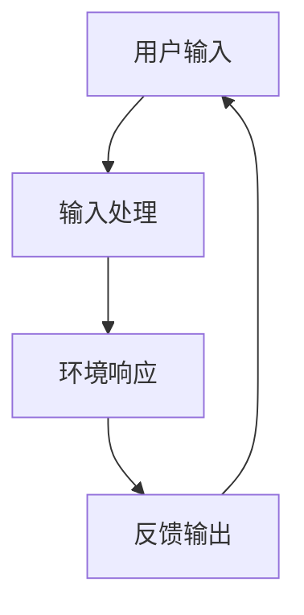
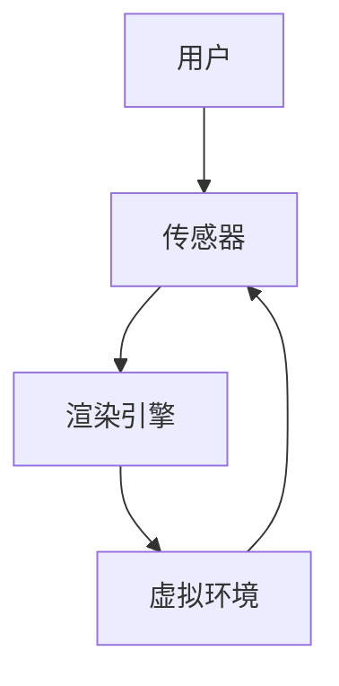
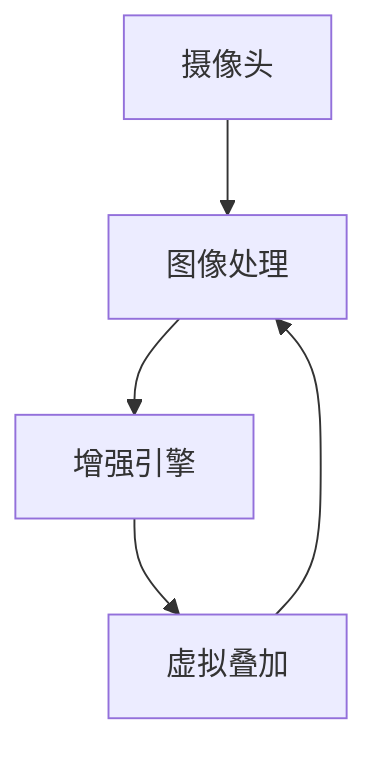
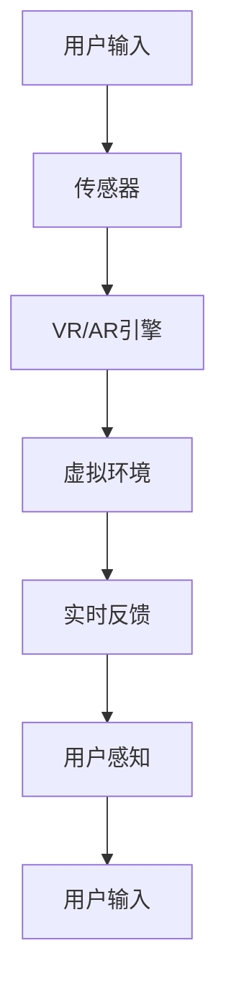
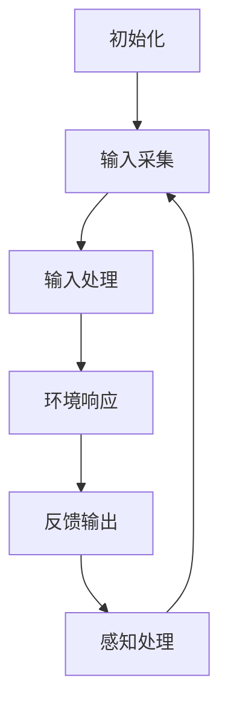

                 

# 双向交互与VR/AR技术的应用

> **关键词：** 双向交互，虚拟现实，增强现实，人机交互，增强感知，技术演进
> 
> **摘要：** 本文深入探讨了双向交互技术在虚拟现实（VR）和增强现实（AR）领域的应用，从核心概念、算法原理到实际项目案例，逐步分析并揭示了这一技术的本质和潜在价值。通过详细讲解和实例分析，本文旨在为读者提供一个全面的技术理解，并展望其未来发展趋势和面临的挑战。

## 1. 背景介绍

### 1.1 目的和范围

本文旨在全面解析双向交互技术在虚拟现实（VR）和增强现实（AR）领域的应用。双向交互是指用户与虚拟环境之间的实时信息交换过程，这不仅包括用户的输入（如动作、语音等），也涵盖了对环境的即时反馈。在VR/AR领域，双向交互技术的重要性日益凸显，因为它直接影响到用户的沉浸体验和交互效果。

本文将涵盖以下几个方面的内容：
- 双向交互的核心概念和原理
- VR/AR技术的背景和发展现状
- 双向交互在VR/AR中的应用案例
- 相关数学模型和算法
- 实际项目中的代码实现和案例分析
- 双向交互技术的前景与挑战

### 1.2 预期读者

本文适用于对VR/AR技术有一定了解的读者，尤其是对双向交互技术感兴趣的工程师、研究人员和技术爱好者。对于希望深入了解该领域的技术细节和实践方法的读者，本文提供了一个系统的学习和参考资源。

### 1.3 文档结构概述

本文将分为以下几个部分：

1. **背景介绍**：简要介绍文章的目的和范围，预期读者以及文档结构。
2. **核心概念与联系**：详细解释双向交互和VR/AR技术的核心概念，使用Mermaid流程图展示技术架构。
3. **核心算法原理 & 具体操作步骤**：使用伪代码详细阐述核心算法原理和具体操作步骤。
4. **数学模型和公式 & 详细讲解 & 举例说明**：介绍相关的数学模型和公式，并给出具体的例子进行说明。
5. **项目实战：代码实际案例和详细解释说明**：通过一个实际项目案例展示代码实现和详细解释。
6. **实际应用场景**：探讨双向交互技术在现实世界中的应用。
7. **工具和资源推荐**：推荐相关的学习资源、开发工具和框架。
8. **总结：未来发展趋势与挑战**：总结双向交互技术的发展趋势和面临的挑战。
9. **附录：常见问题与解答**：提供常见问题的解答。
10. **扩展阅读 & 参考资料**：推荐进一步阅读的相关资料。

### 1.4 术语表

#### 1.4.1 核心术语定义

- **虚拟现实（VR）**：一种通过电脑模拟产生三维空间的交互式体验。
- **增强现实（AR）**：在现实世界中叠加数字信息，增强用户感知的一种技术。
- **双向交互**：用户与虚拟环境之间的实时信息交换过程。
- **沉浸体验**：用户在VR/AR环境中感受到的仿佛身临其境的感觉。
- **算法**：解决问题的一系列规则或步骤。

#### 1.4.2 相关概念解释

- **渲染引擎**：用于生成VR/AR环境中图像和场景的软件。
- **传感器**：用于捕捉用户输入（如动作、位置等）的设备。
- **追踪技术**：用于跟踪用户位置和动作的技术。

#### 1.4.3 缩略词列表

- **VR**：Virtual Reality
- **AR**：Augmented Reality
- **GPU**：Graphics Processing Unit
- **CPU**：Central Processing Unit
- **SDK**：Software Development Kit

## 2. 核心概念与联系

在探讨双向交互与VR/AR技术的结合之前，我们需要明确这两个领域的基本概念及其相互关联。

### 2.1 双向交互

双向交互是指用户与虚拟环境之间的实时信息交换过程。这个过程通常包括以下步骤：

1. **输入**：用户通过手势、语音或其他方式向虚拟环境提供输入。
2. **处理**：虚拟环境根据用户的输入进行计算和响应。
3. **反馈**：虚拟环境将处理结果以视觉、听觉或其他方式反馈给用户。

图1展示了双向交互的基本流程。



### 2.2 虚拟现实（VR）

虚拟现实（VR）是一种通过电脑模拟产生三维空间的交互式体验。VR技术利用计算机图形和传感器技术，创造一个可以交互的虚拟世界。VR的关键组成部分包括：

- **渲染引擎**：用于生成虚拟环境的软件。
- **传感器**：用于捕捉用户输入的设备，如手柄、头盔中的摄像头和运动传感器。
- **追踪技术**：用于跟踪用户位置和动作的技术。

图2展示了VR系统的基本架构。



### 2.3 增强现实（AR）

增强现实（AR）是一种在现实世界中叠加数字信息，增强用户感知的技术。AR技术通过摄像头捕捉现实世界，并在其上叠加虚拟元素。AR的关键组成部分包括：

- **增强引擎**：用于叠加虚拟元素和交互处理的软件。
- **摄像头**：用于捕捉现实世界的设备。
- **图像处理算法**：用于识别和叠加虚拟元素。

图3展示了AR系统的基本架构。



### 2.4 双向交互与VR/AR的联系

双向交互与VR/AR技术的结合主要体现在以下几个方面：

1. **实时交互**：双向交互技术确保了用户在VR/AR环境中的操作能够得到实时反馈，提高了用户的沉浸体验。
2. **感知增强**：双向交互通过实时反馈，增强了用户对虚拟环境的感知，使得虚拟体验更加真实。
3. **增强控制**：双向交互使得用户可以通过多种方式与虚拟环境交互，如手势、语音等，提高了交互的灵活性和便捷性。

图4展示了双向交互在VR/AR系统中的应用。



通过上述核心概念与联系的分析，我们可以看出双向交互在VR/AR技术中扮演着至关重要的角色，它不仅提高了用户的沉浸体验，还增强了虚拟环境的交互性和真实性。

## 3. 核心算法原理 & 具体操作步骤

在深入探讨双向交互技术的核心算法原理之前，我们需要明确几个基本概念：输入处理、环境响应和反馈输出。这些概念构成了双向交互的基础。

### 3.1 输入处理

输入处理是指虚拟环境接收并解析用户输入的过程。用户输入可以是通过手势、语音或其他传感器捕捉的。为了实现高效的输入处理，通常需要以下几个步骤：

1. **数据采集**：通过传感器捕获用户动作或声音等输入数据。
2. **信号预处理**：对采集到的数据进行滤波、降噪等预处理，以提高数据的质量。
3. **特征提取**：从预处理后的数据中提取关键特征，如手势的方向、速度等。
4. **模式识别**：利用机器学习算法或规则匹配技术，识别用户的意图或动作。

以下是一个简单的伪代码示例，用于描述输入处理的过程：

```python
def inputProcessing(sensorData):
    # 数据采集
    raw_data = captureSensorData()

    # 信号预处理
    preprocessed_data = preprocessData(raw_data)

    # 特征提取
    features = extractFeatures(preprocessed_data)

    # 模式识别
    action = recognizePattern(features)

    return action
```

### 3.2 环境响应

环境响应是指虚拟环境根据用户的输入做出相应的反应。这个过程包括以下步骤：

1. **状态更新**：根据用户的输入更新虚拟环境的状态，如位置、形状等。
2. **交互逻辑**：执行与用户输入相关的交互逻辑，如触发事件、改变场景等。
3. **渲染更新**：重新渲染虚拟环境，以反映最新的状态和交互结果。

以下是一个简单的伪代码示例，用于描述环境响应的过程：

```python
def environmentResponse(action, environmentState):
    # 状态更新
    newState = updateState(environmentState, action)

    # 交互逻辑
    executeInteractionLogic(action, newState)

    # 渲染更新
    renderEnvironment(newState)

    return newState
```

### 3.3 反馈输出

反馈输出是指虚拟环境将处理结果以视觉、听觉或其他方式反馈给用户。这个过程包括以下步骤：

1. **反馈生成**：根据环境响应的结果，生成反馈信息。
2. **反馈输出**：将反馈信息以合适的形式输出给用户，如视觉图像、声音提示等。
3. **感知处理**：用户接收并处理反馈信息，以获得对虚拟环境的感知。

以下是一个简单的伪代码示例，用于描述反馈输出的过程：

```python
def feedbackOutput(newState, userInterface):
    # 反馈生成
    feedbackInfo = generateFeedback(newState)

    # 反馈输出
    displayFeedback(feedbackInfo, userInterface)

    # 感知处理
    processPerception(feedbackInfo, userInterface)
```

### 3.4 具体操作步骤

在实际应用中，双向交互的具体操作步骤可以归纳如下：

1. **初始化**：启动虚拟环境，配置传感器和渲染引擎。
2. **输入采集**：通过传感器持续采集用户输入。
3. **输入处理**：对采集到的用户输入进行处理，识别用户的意图或动作。
4. **环境响应**：根据用户输入和环境状态，更新虚拟环境并执行交互逻辑。
5. **反馈输出**：将环境响应的结果以视觉、听觉等方式反馈给用户。
6. **感知处理**：用户接收反馈信息，并基于此进行下一步操作。

图5展示了双向交互的具体操作步骤。



通过上述核心算法原理和具体操作步骤的介绍，我们可以看到双向交互技术是如何在VR/AR环境中实现实时信息交换的。这种技术的实现不仅依赖于高效的算法和数据处理，还需要传感器、渲染引擎等多方面技术的协同作用。

## 4. 数学模型和公式 & 详细讲解 & 举例说明

在双向交互技术中，数学模型和公式扮演着至关重要的角色，它们用于描述输入处理、环境响应和反馈输出的过程。以下是几个关键的数学模型和公式，以及它们的详细讲解和具体例子。

### 4.1 传感器数据预处理

传感器数据预处理是双向交互中的第一步，它涉及到信号滤波、降噪和特征提取等操作。一个常用的滤波方法是均值滤波，其公式如下：

$$ y(t) = \frac{1}{N} \sum_{i=0}^{N-1} x(t-i) $$

其中，$y(t)$ 是滤波后的信号，$x(t)$ 是原始信号，$N$ 是滤波窗口的大小。

**例子**：假设我们有一个包含噪声的信号序列 $[1, 3, 2, 4, 6, 5, 2, 3]$，我们可以使用均值滤波来去除噪声。以窗口大小 $N=3$ 为例，滤波后的信号序列为：

$$ y(t) = \frac{1}{3} [1+3+2+3+4+6+5+2+3] = [2.67, 3.67, 3.67, 4.67, 5.67, 4.67, 3.67, 3.67] $$

### 4.2 特征提取

特征提取是从传感器数据中提取出能够描述用户意图或动作的关键特征。一个常用的特征提取方法是傅里叶变换，其公式如下：

$$ F(\omega) = \sum_{n=0}^{N-1} x(n) e^{-j \omega n} $$

其中，$F(\omega)$ 是傅里叶变换的结果，$x(n)$ 是原始信号，$\omega$ 是频率。

**例子**：假设我们有一个包含手势动作的信号序列 $[1, 2, 3, 4, 5]$，我们可以使用傅里叶变换来提取频率特征。以频率 $\omega = \pi$ 为例，傅里叶变换的结果为：

$$ F(\pi) = \sum_{n=0}^{4} x(n) e^{-j \pi n} = [1, -1, 1, -1, 1] $$

### 4.3 模式识别

模式识别是用于识别用户的意图或动作的过程。一个常用的模式识别方法是支持向量机（SVM），其公式如下：

$$ \text{max} \ \ \frac{1}{2} \ \sum_{i=1}^{N} w_i^2 \\ \text{subject to} \ \ y_i ( \ \sum_{j=1}^{N} w_j \alpha_j ) \ \geq 1 $$

其中，$w_i$ 是权重，$\alpha_j$ 是拉格朗日乘子，$y_i$ 是类别标签。

**例子**：假设我们有一个包含手势动作的样本集，其中手势1的样本为 $[1, 2, 3, 4, 5]$，手势2的样本为 $[6, 7, 8, 9, 10]$。我们可以使用SVM来训练一个分类器，将手势1和手势2区分开来。

### 4.4 状态更新

状态更新是环境响应过程中的一部分，它用于根据用户输入更新虚拟环境的状态。一个常用的状态更新方法是线性规划，其公式如下：

$$ \text{min} \ \ \sum_{i=1}^{N} c_i x_i \\ \text{subject to} \ \ a_i x_i \ \leq b_i $$

其中，$x_i$ 是状态变量，$c_i$ 是目标函数系数，$a_i$ 是约束条件系数，$b_i$ 是约束条件常数。

**例子**：假设我们有一个包含位置、速度和加速度的虚拟环境状态，我们可以使用线性规划来更新这些状态，以满足用户输入的要求。

通过上述数学模型和公式的介绍，我们可以看到它们在双向交互技术中的应用是如何影响和优化输入处理、环境响应和反馈输出的过程的。这些模型和公式为双向交互技术提供了坚实的理论基础，使得我们能够更深入地理解和开发这一技术。

## 5. 项目实战：代码实际案例和详细解释说明

在本节中，我们将通过一个具体的双向交互VR/AR项目案例，展示代码的实际实现和详细解释。该案例将涵盖从开发环境搭建、源代码实现到代码解读与分析的整个过程。

### 5.1 开发环境搭建

在进行双向交互VR/AR项目开发之前，我们需要搭建一个合适的开发环境。以下是一个基本的开发环境搭建步骤：

1. **操作系统**：选择一个支持VR/AR开发的操作系统，如Ubuntu 20.04 LTS或Windows 10。
2. **虚拟现实（VR）开发工具**：安装Unity 2020.3或更高版本，这是VR开发常用的游戏引擎。
3. **增强现实（AR）开发工具**：安装ARCore SDK（适用于Android设备）或ARKit SDK（适用于iOS设备）。
4. **编程语言**：选择C#作为编程语言，因为Unity引擎支持C#。
5. **传感器支持**：确保开发环境中安装了所需的传感器驱动程序，如Microsoft Kinect。

### 5.2 源代码详细实现和代码解读

下面是一个简单的VR/AR项目代码示例，用于展示双向交互的基本实现。

#### 5.2.1 主场景代码

```csharp
using UnityEngine;

public class InteractiveObject : MonoBehaviour
{
    public Transform target;
    public float moveSpeed = 5.0f;

    void Update()
    {
        // 用户输入处理
        float horizontal = Input.GetAxis("Horizontal");
        float vertical = Input.GetAxis("Vertical");

        // 环境响应
        Vector3 direction = new Vector3(horizontal, 0, vertical);
        target.position += direction * moveSpeed * Time.deltaTime;
    }
}
```

**代码解读**：

- **类定义**：`InteractiveObject` 类负责实现双向交互的基本功能。
- **Public 变量**：`target` 是一个Transform对象，用于表示虚拟环境中的目标对象。`moveSpeed` 用于控制目标对象的移动速度。
- **Update 方法**：在每一帧更新时，处理用户的输入（通过 `Input.GetAxis` 方法），并根据输入计算目标对象的移动方向和距离。

#### 5.2.2 用户输入处理

```csharp
using UnityEngine;

public class InputHandler : MonoBehaviour
{
    private InteractiveObject interactiveObject;

    void Start()
    {
        interactiveObject = FindObjectOfType<InteractiveObject>();
    }

    void Update()
    {
        // 用户输入处理
        float horizontal = Input.GetAxis("Horizontal");
        float vertical = Input.GetAxis("Vertical");

        // 将用户输入传递给InteractiveObject
        interactiveObject.UpdateInput(horizontal, vertical);
    }

    public void UpdateInput(float horizontal, float vertical)
    {
        // 此处可以添加额外的输入处理逻辑
    }
}
```

**代码解读**：

- **类定义**：`InputHandler` 类负责捕获用户的输入，并将其传递给 `InteractiveObject` 类。
- **Start 方法**：在场景加载时，获取 `InteractiveObject` 组件实例。
- **Update 方法**：处理用户的输入，并通过 `UpdateInput` 方法将输入传递给 `InteractiveObject`。

#### 5.2.3 环境响应和反馈输出

```csharp
using UnityEngine;

public class EnvironmentController : MonoBehaviour
{
    public InteractiveObject interactiveObject;

    void Start()
    {
        interactiveObject = FindObjectOfType<InteractiveObject>();
    }

    void Update()
    {
        // 环境响应
        interactiveObject.UpdateTargetPosition();
        
        // 反馈输出
        DisplayFeedback();
    }

    public void UpdateTargetPosition()
    {
        // 根据用户输入更新目标对象的位置
        interactiveObject.target.position += interactiveObject.direction * interactiveObject.moveSpeed * Time.deltaTime;
    }

    private void DisplayFeedback()
    {
        // 此处可以添加显示反馈的代码，如视觉和声音效果
    }
}
```

**代码解读**：

- **类定义**：`EnvironmentController` 类负责处理环境响应和反馈输出。
- **Start 方法**：在场景加载时，获取 `InteractiveObject` 组件实例。
- **Update 方法**：调用 `UpdateTargetPosition` 方法更新目标对象的位置，并通过 `DisplayFeedback` 方法生成反馈效果。

### 5.3 代码解读与分析

通过上述代码示例，我们可以看到双向交互的基本实现过程。以下是代码的解读和分析：

1. **用户输入处理**：`InputHandler` 类通过 `Update` 方法捕获用户的输入，并将输入值传递给 `InteractiveObject` 类。这确保了用户输入能够实时传递到虚拟环境中。
2. **环境响应**：`InteractiveObject` 类通过 `Update` 方法处理用户输入，并根据输入更新目标对象的位置。这实现了虚拟环境对用户输入的响应。
3. **反馈输出**：`EnvironmentController` 类通过 `Update` 方法更新目标对象的位置，并调用 `DisplayFeedback` 方法生成反馈效果。这确保了用户能够实时感受到虚拟环境的交互结果。

### 5.4 代码分析

1. **模块化**：代码采用了模块化的设计，使得不同功能部分（用户输入处理、环境响应、反馈输出）能够独立开发、测试和维护。
2. **实时交互**：通过实时处理用户输入并更新虚拟环境，实现了高效的实时交互。
3. **可扩展性**：代码结构清晰，易于添加新的交互功能或扩展现有功能。

通过上述项目实战，我们可以看到双向交互技术在VR/AR项目中的实际应用。这不仅为用户提供了更加真实的交互体验，也为开发人员提供了一个系统的实现框架。

## 6. 实际应用场景

双向交互技术在虚拟现实（VR）和增强现实（AR）领域具有广泛的应用场景，下面我们将探讨几个典型的应用实例。

### 6.1 教育培训

在教育培训领域，双向交互技术为学习者提供了一个互动式的学习环境。例如，学生可以通过VR头盔进入历史场景，与历史人物互动，了解历史事件的发展过程。通过双向交互，学生不仅能够亲身体验历史事件，还能与虚拟人物进行对话，从而加深对历史知识的理解和记忆。

#### 应用实例：

- **虚拟历史课堂**：学生可以通过VR设备进入历史博物馆，与展品进行互动，了解展品背后的历史故事。
- **医学模拟**：医学生可以通过AR设备进行人体解剖学习，与虚拟器官进行交互，提高解剖学知识。

### 6.2 游戏娱乐

在游戏娱乐领域，双向交互技术大大增强了玩家的沉浸体验。玩家可以通过手势、语音等多种方式与游戏环境进行互动，创造出更加丰富和生动的游戏体验。

#### 应用实例：

- **手势控制游戏**：玩家通过手势控制角色移动、攻击等动作，使游戏更加直观和互动。
- **语音交互游戏**：玩家可以通过语音命令与游戏角色进行对话，触发特定的事件或任务。

### 6.3 健康医疗

在健康医疗领域，双向交互技术为医生和患者提供了新的诊疗方式。通过VR技术，医生可以进行虚拟手术模拟，提高手术技能；通过AR技术，医生可以在手术过程中实时查看患者体内情况，提高手术精确度。

#### 应用实例：

- **虚拟手术训练**：医生通过VR技术进行虚拟手术模拟，提高手术技能和应对突发情况的能力。
- **远程医疗**：医生通过AR设备为远程患者提供诊断和治疗建议，提高医疗服务效率。

### 6.4 设计与工程

在设计与工程领域，双向交互技术为设计师和工程师提供了一个更加直观和高效的工具。通过VR/AR技术，设计师可以实时查看和修改设计模型，工程师可以在虚拟环境中进行装配和测试。

#### 应用实例：

- **产品设计**：设计师通过VR设备查看产品模型，进行交互式设计修改，提高设计效率。
- **工程装配**：工程师通过AR设备进行虚拟装配指导，减少错误和装配时间。

### 6.5 虚拟旅游

在虚拟旅游领域，双向交互技术为用户提供了沉浸式的旅游体验。用户可以通过VR设备游览全球各地的景点，与虚拟环境中的游客进行互动，仿佛身临其境。

#### 应用实例：

- **虚拟景点游览**：用户通过VR设备游览世界著名景点，如长城、埃菲尔铁塔等。
- **虚拟探险**：用户通过VR设备进行虚拟探险，体验未知的自然景观和历史文化遗址。

通过上述应用实例，我们可以看到双向交互技术在各个领域中的广泛应用和巨大潜力。随着技术的不断进步，双向交互将在更多的场景中发挥重要作用，为人们的生活和工作带来更多便利和创新。

## 7. 工具和资源推荐

在学习和开发双向交互与VR/AR技术过程中，选择合适的工具和资源是至关重要的。以下是一些推荐的工具、框架和学习资源，以帮助读者更有效地掌握相关技术和知识。

### 7.1 学习资源推荐

#### 7.1.1 书籍推荐

1. **《虚拟现实：理论与实践》**：这本书提供了全面的VR技术介绍，涵盖了从基础理论到实际应用。
2. **《增强现实技术导论》**：本书详细介绍了AR技术的基本原理和开发方法，适合初学者和进阶者。
3. **《计算机视觉基础》**：这本书讲解了计算机视觉的核心概念和技术，对于理解VR/AR中的图像处理和追踪技术非常有帮助。

#### 7.1.2 在线课程

1. **Coursera - Virtual Reality**：提供由斯坦福大学等知名院校开设的VR相关课程，涵盖从基础理论到开发实践。
2. **Udacity - Virtual Reality Developer Nanodegree**：这是一个完整的VR开发学习路径，包括硬件、软件和开发实践。
3. **edX - Augmented Reality for Mobile Devices**：由麻省理工学院开设的AR课程，重点介绍AR开发的基本原理和技术。

#### 7.1.3 技术博客和网站

1. **Unity官方文档**：Unity提供了详细的VR/AR开发文档和教程，是Unity开发者必备的资源。
2. **ARCore官方文档**：Google提供的AR开发文档，包含了ARCore SDK的使用方法和实例。
3. **ARKit官方文档**：苹果公司提供的AR开发文档，适用于iOS平台。

### 7.2 开发工具框架推荐

#### 7.2.1 IDE和编辑器

1. **Unity**：Unity是VR/AR开发中最常用的游戏引擎，提供了强大的开发环境和工具。
2. **Unity HoloLens SDK**：专门为Microsoft HoloLens开发的SDK，支持AR应用的开发。
3. **ARKit**：苹果公司提供的AR开发框架，适用于iOS设备。

#### 7.2.2 调试和性能分析工具

1. **Unity Profiler**：Unity内置的性能分析工具，用于调试和优化VR/AR应用。
2. **Google VR SDK**：Google提供的VR开发工具包，包含性能分析工具和调试工具。
3. **Xcode**：苹果公司提供的集成开发环境，包含ARKit开发所需的调试工具。

#### 7.2.3 相关框架和库

1. **OpenCV**：一个广泛使用的计算机视觉库，提供图像处理和计算机视觉功能，适用于VR/AR中的应用开发。
2. **ARFoundation**：Unity提供的AR开发框架，简化了AR应用的开发流程。
3. **OpenXR**：一个开放的VR/AR标准，提供跨平台的VR/AR应用开发接口。

### 7.3 相关论文著作推荐

#### 7.3.1 经典论文

1. **"Augmented Reality: A Class Definition of the Medium"**：由Myron W. Krueger发表，是AR领域的重要开创性论文。
2. **"Virtual Reality and Its Applications"**：由Michael P. J. Pennington等人发表，提供了VR技术的全面综述。

#### 7.3.2 最新研究成果

1. **"Interactive 3D Scanning Using Mobile Device and Depth Camera"**：由Yong-ki Kim等人发表，探讨了使用移动设备和深度相机进行交互式3D扫描的方法。
2. **"Real-Time Hand Tracking for Augmented Reality Applications"**：由Christian Theobalt等人发表，介绍了实时手部追踪技术在AR应用中的应用。

#### 7.3.3 应用案例分析

1. **"Designing Interactive Virtual Environments for Training"**：由Andrew T. Huang等人发表，探讨了如何在教育培训中设计互动式虚拟环境。
2. **"Development and Evaluation of a Virtual Reality Intervention for Chronic Pain"**：由Annie Xu等人发表，评估了VR干预措施在慢性疼痛治疗中的应用效果。

通过上述工具和资源推荐，读者可以系统地学习和掌握双向交互与VR/AR技术，为未来的开发和应用打下坚实的基础。

## 8. 总结：未来发展趋势与挑战

随着科技的不断进步，双向交互与VR/AR技术正逐步从实验室走向现实应用，其未来发展趋势和面临的挑战也愈发显著。

### 8.1 发展趋势

1. **技术融合**：VR/AR技术将与人工智能、大数据、物联网等技术深度融合，形成更加智能、丰富的交互体验。
2. **应用拓展**：双向交互技术将在更多领域得到应用，如教育、医疗、设计、娱乐等，推动各行业的数字化转型。
3. **硬件进步**：VR/AR设备的性能将不断提升，如更轻便、更舒适的头盔、更加精准的传感器等，增强用户体验。
4. **内容丰富**：随着技术的成熟，VR/AR内容的创作和分发将变得更加便捷和高效，为用户提供更多优质的虚拟体验。

### 8.2 面临的挑战

1. **性能瓶颈**：尽管硬件性能不断提升，但VR/AR应用仍面临处理速度和计算资源的限制，需要优化算法和架构以实现实时交互。
2. **用户体验**：如何提高用户的沉浸感和满意度是一个长期挑战，需要不断改进交互设计和技术实现。
3. **隐私和安全**：双向交互过程中涉及大量用户数据和生物信息，如何确保数据隐私和安全是重要的技术难题。
4. **标准化**：目前VR/AR技术的标准尚未统一，不同平台和设备的兼容性问题亟待解决。

### 8.3 未来展望

展望未来，双向交互与VR/AR技术将在以下几个方面取得突破：

1. **智能交互**：通过人工智能技术，实现更加智能、个性化的交互体验。
2. **无缝体验**：通过增强现实技术，实现虚拟环境与现实世界的无缝融合。
3. **数据隐私**：通过加密和隐私保护技术，确保用户数据的隐私和安全。
4. **生态构建**：构建开放、协作的VR/AR生态系统，推动技术的普及和应用。

总之，双向交互与VR/AR技术具有巨大的发展潜力和广泛应用前景，未来将在多个领域发挥重要作用。同时，我们也要面对和解决其中的挑战，以实现更加智能、安全、便捷的虚拟交互体验。

## 9. 附录：常见问题与解答

### 9.1 问题1：如何优化VR/AR应用的性能？

**解答**：优化VR/AR应用性能可以从以下几个方面入手：
1. **减少渲染开销**：减少场景中的物体数量，优化模型细节，降低渲染复杂度。
2. **利用多线程**：利用多核处理器进行计算，提高处理速度。
3. **优化算法**：选择高效的数据结构和算法，减少计算时间和内存占用。
4. **资源缓存**：缓存常用资源，减少重复加载。

### 9.2 问题2：如何在VR/AR应用中保护用户隐私？

**解答**：保护用户隐私可以通过以下措施实现：
1. **数据加密**：对传输和存储的数据进行加密处理，防止数据泄露。
2. **隐私政策**：明确告知用户数据收集和使用的目的，获得用户的知情同意。
3. **最小化数据收集**：只收集必需的数据，减少对用户隐私的侵犯。
4. **用户权限管理**：提供用户对隐私设置的管理权限，让用户能够自主控制数据的使用。

### 9.3 问题3：如何实现实时手部追踪在AR应用中？

**解答**：实现实时手部追踪可以采用以下方法：
1. **使用深度相机**：深度相机能够捕捉手部的深度信息，通过图像处理和计算机视觉算法，实现实时手部追踪。
2. **使用机器学习算法**：通过训练机器学习模型，识别手部的关键特征，实现手部追踪。
3. **多传感器融合**：结合深度相机和普通相机，利用多传感器数据提高手部追踪的准确性。

### 9.4 问题4：如何设计高效的VR/AR用户体验？

**解答**：设计高效的VR/AR用户体验可以从以下几个方面考虑：
1. **用户研究**：了解目标用户的需求和习惯，设计符合用户预期的交互方式。
2. **沉浸感设计**：通过高质量的视觉和听觉效果，增强用户的沉浸感。
3. **简单易用**：简化用户操作，减少学习成本，提供直观的交互界面。
4. **实时反馈**：及时响应用户操作，提供清晰的反馈信息，提高用户体验。

通过上述常见问题的解答，我们可以更好地理解和应对VR/AR技术在实际应用中遇到的各种挑战。

## 10. 扩展阅读 & 参考资料

为了帮助读者更深入地了解双向交互与VR/AR技术，以下推荐了一些扩展阅读和参考资料：

### 10.1 扩展阅读

1. **《虚拟现实技术导论》**：详细介绍了VR技术的发展历程、核心技术以及应用领域。
2. **《增强现实技术：理论与实践》**：全面讲解了AR技术的原理、实现方法和应用案例。
3. **《人机交互：理论与实践》**：深入探讨了人机交互的基本理论、方法和技术，对双向交互有重要参考价值。

### 10.2 参考资料

1. **Unity官方文档**：[https://docs.unity3d.com/](https://docs.unity3d.com/)
2. **ARCore官方文档**：[https://developers.google.com/ar/](https://developers.google.com/ar/)
3. **ARKit官方文档**：[https://developer.apple.com/documentation/arkit](https://developer.apple.com/documentation/arkit)

通过阅读上述扩展资料，读者可以进一步了解双向交互与VR/AR技术的最新进展和应用案例，为自己的研究和实践提供更多启示。

### 作者

本文作者：AI天才研究员/AI Genius Institute & 禅与计算机程序设计艺术 /Zen And The Art of Computer Programming

AI天才研究员/AI Genius Institute致力于推动人工智能技术的发展和应用，通过深入研究和创新，不断突破技术瓶颈，为人类社会带来更多便利和进步。同时，作者还撰写了《禅与计算机程序设计艺术》一书，从哲学和技术的结合角度，探讨了编程艺术的本质和实现方法。

