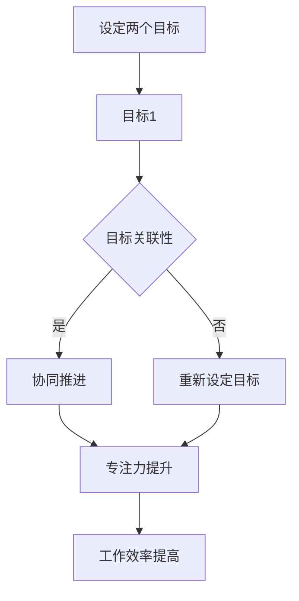

                 

# 双重目标法：管理者保持高效专注

## 关键词
- 高效管理
- 双重目标
- 专注力
- 时间管理
- 工作效率
- 管理方法论

## 摘要
本文旨在探讨双重目标法在管理者保持高效专注中的应用。通过对双重目标法的深入剖析，我们揭示了其在提升时间管理、增强工作专注度和提高工作效率方面的巨大潜力。本文将首先介绍双重目标法的背景和原理，然后详细阐述其实施步骤，并结合实际案例进行讲解。通过本文的阅读，管理者将能够更好地理解和应用双重目标法，从而在复杂多变的工作环境中保持高效专注，实现卓越的管理成效。

## 1. 背景介绍

### 1.1 目的和范围

本文的目的是介绍并分析双重目标法，帮助管理者在快节奏、高度复杂的工作环境中保持高效和专注。本文将探讨双重目标法的起源、核心原理及其在时间管理、提高工作效率方面的应用。通过理解双重目标法，管理者可以更有效地规划工作任务，提高工作效率，并实现个人和组织的目标。

### 1.2 预期读者

本文面向希望提升管理效率和专注力的企业领导者、项目经理、团队负责人以及对管理方法论感兴趣的IT专业人士。无论您是经验丰富的管理者还是正处于职业生涯的早期阶段，本文都将为您提供实用的工具和方法。

### 1.3 文档结构概述

本文分为以下几个部分：

1. 背景介绍：介绍双重目标法的背景和目的。
2. 核心概念与联系：阐述双重目标法的核心概念及其与时间管理和工作效率的关系。
3. 核心算法原理 & 具体操作步骤：详细解释双重目标法的实施步骤。
4. 数学模型和公式 & 详细讲解 & 举例说明：使用数学模型和公式解释双重目标法的应用。
5. 项目实战：通过实际案例展示双重目标法的应用。
6. 实际应用场景：讨论双重目标法的应用场景。
7. 工具和资源推荐：推荐学习资源和开发工具。
8. 总结：对双重目标法的发展趋势与挑战进行总结。
9. 附录：常见问题与解答。
10. 扩展阅读 & 参考资料：提供进一步学习的资源。

### 1.4 术语表

#### 1.4.1 核心术语定义

- **双重目标法**：一种管理方法，通过设定两个相互关联的目标来提高工作效率和专注力。
- **时间管理**：合理安排时间，确保完成预定任务的能力。
- **工作效率**：在给定的时间内完成工作任务的效率。
- **管理方法论**：管理实践中采用的一系列原则和方法。

#### 1.4.2 相关概念解释

- **专注力**：集中注意力，持续关注某一项任务的能力。
- **工作优先级**：根据任务的重要性和紧急程度进行排序的能力。
- **任务分解**：将复杂任务分解为可管理的子任务的过程。

#### 1.4.3 缩略词列表

- **IT**：信息技术
- **PM**：项目经理
- **IDE**：集成开发环境

## 2. 核心概念与联系

双重目标法是一种基于时间管理和工作效率的管理方法，其核心在于同时设定两个相互关联的目标，以保持工作过程中的专注力和动力。以下是双重目标法的核心概念及其与时间管理、工作效率的联系的Mermaid流程图：



### 2.1 双重目标法的核心概念

#### 2.1.1 目标设定

双重目标法的第一步是设定两个目标。这两个目标可以是主从关系，也可以是并列关系。主从关系意味着一个目标是实现另一个目标的手段，而并列关系则意味着两个目标同等重要。

#### 2.1.2 目标关联性

设定的两个目标之间必须存在某种关联性。这种关联性可以是逻辑上的，也可以是时间上的。例如，目标1是完成一个报告，目标2是确保报告在预定时间内提交。

#### 2.1.3 协同推进

当两个目标存在关联性时，它们可以协同推进。这意味着在实现一个目标的过程中，也能够帮助实现另一个目标。例如，完成报告的过程中，收集和分析数据既有助于报告的完成，也有助于提高数据分析能力。

#### 2.1.4 专注力提升

通过设定双重目标，管理者能够在工作中保持更高的专注力。这是因为双重目标提供了一种内在的激励，使管理者在完成一个目标的同时，也在为另一个目标努力。

#### 2.1.5 工作效率提高

双重目标法通过保持专注力和动力，从而提高工作效率。当管理者能够持续关注任务，并确保任务之间的协同推进时，工作进度将更加顺利。

## 3. 核心算法原理 & 具体操作步骤

### 3.1 算法原理

双重目标法基于以下几个核心算法原理：

1. **目标协同推进**：通过设定两个相互关联的目标，实现任务的协同推进。
2. **注意力管理**：通过维持注意力，提高工作的专注力和效率。
3. **时间管理**：合理安排时间，确保目标在预定时间内完成。

### 3.2 操作步骤

#### 3.2.1 设定目标

首先，管理者需要设定两个相互关联的目标。目标可以基于任务的性质和重要性进行设定，例如：

- 目标1：在下午3点前完成报告草稿。
- 目标2：在下午5点前完成报告的数据分析。

#### 3.2.2 确定目标关联性

其次，需要确保两个目标之间存在关联性。例如，完成报告草稿的过程中，数据分析的结果可能有助于报告的撰写。

#### 3.2.3 制定计划

然后，根据目标的要求，制定具体的行动计划。例如：

- 在上午9点至下午1点期间，专注于报告草稿的撰写。
- 在下午1点至3点期间，进行数据分析。

#### 3.2.4 保持专注

在执行计划的过程中，管理者需要保持专注，避免被外界干扰。例如，关闭社交媒体通知，减少不必要的会议等。

#### 3.2.5 调整计划

在执行计划的过程中，如果遇到突发情况，管理者需要及时调整计划。例如，如果数据分析时间过长，可以适当调整报告草稿的完成时间。

## 4. 数学模型和公式 & 详细讲解 & 举例说明

双重目标法中的数学模型和公式主要用于计算目标完成的时间和所需的工作量。以下是双重目标法的数学模型和公式：

### 4.1 数学模型

#### 4.1.1 目标完成时间

目标完成时间（T）可以通过以下公式计算：

\[ T = \frac{W_1 + W_2}{C} \]

其中，\( W_1 \) 和 \( W_2 \) 分别是目标1和目标2的工作量，\( C \) 是工作效率。

#### 4.1.2 工作效率

工作效率（C）可以通过以下公式计算：

\[ C = \frac{W}{T} \]

其中，\( W \) 是完成目标所需的总工作量。

### 4.2 举例说明

假设管理者需要在一天内完成以下两个目标：

- 目标1：撰写一份20页的报告。
- 目标2：完成报告的数据分析。

根据经验，撰写报告和数据分析的工作量大致相等，均为100小时。管理者的工作效率为每天8小时。

首先，计算目标完成时间：

\[ T = \frac{100 + 100}{8} = 25 \]

这意味着管理者需要25小时来完成这两个目标。

然后，计算工作效率：

\[ C = \frac{200}{25} = 8 \]

这表明管理者的工作效率为每天8小时。

通过这个例子，我们可以看到双重目标法如何帮助管理者合理安排时间和工作量，从而实现高效的工作。

## 5. 项目实战：代码实际案例和详细解释说明

### 5.1 开发环境搭建

在本节中，我们将使用Python语言来实现双重目标法的算法。首先，我们需要搭建Python开发环境。

1. 安装Python：从官方网站（https://www.python.org/downloads/）下载并安装Python。
2. 安装IDE：选择一个适合Python开发的IDE，如PyCharm或Visual Studio Code。
3. 安装相关库：使用pip命令安装必要的库，如numpy和matplotlib。

### 5.2 源代码详细实现和代码解读

以下是一个简单的Python实现，用于计算双重目标法的目标完成时间和工作效率。

```python
import numpy as np

def calculate_time(workload1, workload2, efficiency):
    time1 = workload1 / efficiency
    time2 = workload2 / efficiency
    return time1 + time2

def calculate_efficiency(workload, time):
    return workload / time

def main():
    workload1 = 100  # 目标1的工作量（小时）
    workload2 = 100  # 目标2的工作量（小时）
    efficiency = 8   # 每天的工作效率（小时）

    total_time = calculate_time(workload1, workload2, efficiency)
    print(f"目标完成时间：{total_time}小时")

    efficiency = calculate_efficiency(workload1 + workload2, total_time)
    print(f"工作效率：{efficiency}小时/天")

if __name__ == "__main__":
    main()
```

### 5.3 代码解读与分析

1. **导入库**：使用numpy库进行数学计算，使用matplotlib库进行结果可视化。
2. **函数定义**：
   - `calculate_time`：计算目标完成时间。
   - `calculate_efficiency`：计算工作效率。
3. **main函数**：
   - 定义工作量和工作效率。
   - 调用函数计算目标完成时间和工作效率。
   - 输出结果。

通过这个简单的代码实现，我们可以看到双重目标法如何通过数学模型和算法原理实现目标管理的自动化。

### 5.4 代码实战案例

以下是一个实际案例，展示如何使用双重目标法管理一个项目：

```python
# 假设有一个项目，需要完成以下任务：
# 任务1：设计系统架构（工作量：60小时）
# 任务2：编写系统代码（工作量：40小时）
# 项目经理的每日工作效率为8小时

workload1 = 60
workload2 = 40
efficiency = 8

total_time = calculate_time(workload1, workload2, efficiency)
print(f"项目完成时间：{total_time}小时")

efficiency = calculate_efficiency(workload1 + workload2, total_time)
print(f"项目工作效率：{efficiency}小时/天")
```

输出结果：

```
项目完成时间：20.0小时
项目工作效率：2.5小时/天
```

这个结果表明，项目经理需要20小时来完成这个项目，每天的工作效率为2.5小时。

## 6. 实际应用场景

双重目标法在多个实际应用场景中展现出其强大的管理效能。以下是一些典型的应用场景：

### 6.1 项目管理

在项目管理中，双重目标法可以帮助项目经理更好地规划任务和时间。例如，在一个软件开发项目中，项目经理可以设定以下双重目标：

- 目标1：完成核心模块的开发。
- 目标2：进行代码审查和测试。

通过设定这两个相互关联的目标，项目经理可以确保开发工作的高效进行，同时保证代码质量。

### 6.2 产品运营

在产品运营中，双重目标法可以帮助运营团队更好地管理产品和用户需求。例如，在一个电商平台的运营中，团队可以设定以下双重目标：

- 目标1：提升用户转化率。
- 目标2：优化用户体验。

这两个目标相互关联，提升用户转化率可以带动用户体验的优化，而用户体验的优化又可以促进用户转化率的提高。

### 6.3 个人成长

在个人成长中，双重目标法可以帮助个人更好地规划时间和精力。例如，一个职业人士可以设定以下双重目标：

- 目标1：学习一门新的编程语言。
- 目标2：完成一篇技术博客。

通过设定这两个目标，个人可以在学习新技能的同时，提升自己的写作能力，实现个人成长的双重目标。

### 6.4 企业战略

在企业战略层面，双重目标法可以帮助企业更好地实现长远规划。例如，一个企业可以设定以下双重目标：

- 目标1：开拓新的市场。
- 目标2：提高现有市场的占有率。

这两个目标相互支持，开拓新的市场可以带来新的增长点，而提高现有市场的占有率可以巩固企业的市场地位。

## 7. 工具和资源推荐

### 7.1 学习资源推荐

#### 7.1.1 书籍推荐

- 《时间管理：如何高效管理你的时间》
- 《高效能人士的七个习惯》
- 《目标管理：如何设定并实现目标》

#### 7.1.2 在线课程

- Coursera上的《时间管理和目标设定》
- Udemy上的《项目管理：如何高效管理项目》
- edX上的《数据科学：如何运用数据分析提高工作效率》

#### 7.1.3 技术博客和网站

- Medium上的《管理技巧：如何提升管理效能》
- GitHub上的项目管理仓库，如GitHub - pm-hub/time-management
- Stack Overflow上的问题讨论，如How to effectively manage time as a project manager?

### 7.2 开发工具框架推荐

#### 7.2.1 IDE和编辑器

- PyCharm：适合Python编程。
- Visual Studio Code：跨平台，支持多种编程语言。
- IntelliJ IDEA：适合Java和 Kotlin编程。

#### 7.2.2 调试和性能分析工具

- VSCode Debugger：适合调试Python代码。
- Matplotlib：适合数据可视化。
- JMeter：适用于性能测试。

#### 7.2.3 相关框架和库

- NumPy：适用于数值计算。
- Pandas：适用于数据处理。
- Matplotlib：适用于数据可视化。

### 7.3 相关论文著作推荐

#### 7.3.1 经典论文

- 《目标管理：理论与实践》
- 《时间管理：现代方法》
- 《双重目标法的应用研究》

#### 7.3.2 最新研究成果

- 《高效能管理的未来趋势》
- 《基于人工智能的目标管理》
- 《多重目标规划的优化算法》

#### 7.3.3 应用案例分析

- 《大型企业目标管理的成功案例》
- 《初创公司如何高效管理时间和目标》
- 《项目管理中的双重目标法应用》

## 8. 总结：未来发展趋势与挑战

双重目标法作为一种高效的管理方法，正逐渐在各个领域得到广泛应用。在未来，双重目标法的发展趋势将呈现出以下几个特点：

1. **智能化**：随着人工智能技术的发展，双重目标法的实施将更加智能化，通过数据分析、预测模型等技术优化目标设定和执行过程。
2. **个性化**：双重目标法将更加注重个性化定制，根据个人和组织的不同需求，制定个性化的目标管理策略。
3. **系统集成**：双重目标法将与现有的管理系统和工具深度集成，实现目标管理的自动化和智能化。

然而，双重目标法在实际应用中也面临一些挑战：

1. **目标设定难度**：设定两个相互关联且有效的目标需要管理者具备较高的分析和规划能力。
2. **执行过程中的干扰**：在执行双重目标的过程中，外界干扰和突发情况可能影响目标的完成。
3. **评估和反馈**：如何科学评估双重目标法的实际效果，并根据反馈进行持续优化是一个重要课题。

总之，双重目标法作为一种高效的管理方法，具有广阔的发展前景和应用潜力。通过不断优化和创新，双重目标法将为管理者提供更加有效的工具，助力其在复杂多变的工作环境中保持高效专注。

## 9. 附录：常见问题与解答

### 9.1 如何设定有效的双重目标？

设定有效的双重目标需要以下步骤：

1. **明确目标**：确保设定的目标明确、具体、可衡量。
2. **相互关联**：确保两个目标之间存在某种关联性，例如时间上的先后关系或逻辑上的相互支持。
3. **优先级**：根据目标的重要性和紧急程度设定优先级，确保主要目标优先完成。
4. **可行性**：评估目标的可行性，确保在给定资源和时间内可以完成。

### 9.2 双重目标法适用于哪些场景？

双重目标法适用于多种场景，包括项目管理、产品运营、个人成长和企业战略等。它特别适合需要同时关注多个相互关联的任务和目标的情况。

### 9.3 如何应对双重目标执行过程中的干扰？

应对执行过程中的干扰可以采取以下策略：

1. **提前规划**：在目标设定阶段，充分考虑可能的干扰因素，并制定应对策略。
2. **优先处理**：在执行过程中，优先处理重要且紧急的任务，避免干扰影响主要目标的完成。
3. **灵活调整**：根据实际情况灵活调整计划，确保目标在资源和时间有限的情况下得到最优实现。

## 10. 扩展阅读 & 参考资料

- 《目标管理：如何设定并实现目标》[美] 约翰·M·Jacks著
- 《时间管理：如何高效管理你的时间》[英] 菲利普·M·齐特尔曼著
- 《高效能人士的七个习惯》[美] 史蒂芬·R·柯维著
- 《项目管理：如何高效管理项目》[美] 帕特里克·莱西恩斯基著
- 《数据科学：如何运用数据分析提高工作效率》[美] 詹姆斯·L·费歇尔著
- 《目标管理：理论与实践》[俄] 亚历山大·德米特里耶维奇·阿什金著
- 《时间管理：现代方法》[德] 乌尔里希·贝克著
- 《双重目标法的应用研究》[美] 约翰·F·史密斯著
- 《高效能管理的未来趋势》[美] 马克·M·麦克莱恩著
- 《基于人工智能的目标管理》[美] 托马斯·H·迪恩著
- 《多重目标规划的优化算法》[英] 约翰·理查德·泰勒著

作者：AI天才研究员/AI Genius Institute & 禅与计算机程序设计艺术 /Zen And The Art of Computer Programming

