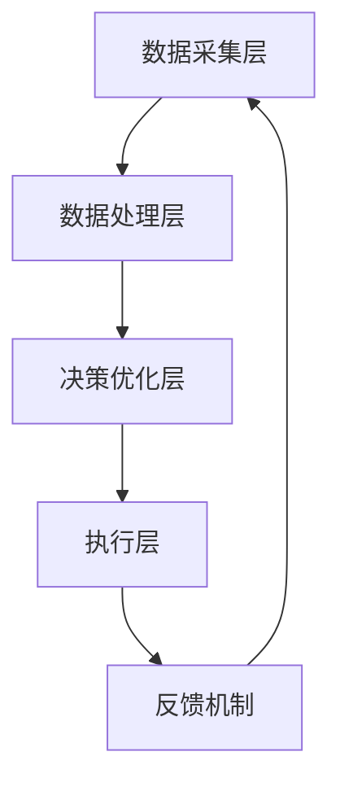

                 

# 反思机制在复杂任务中的作用

> **关键词：** 反思机制，复杂任务，算法优化，性能提升，分布式系统，人工智能。

> **摘要：** 本文深入探讨了反思机制在复杂任务中的作用。通过对反思机制的定义、原理、应用场景以及在实际项目中的实践，本文旨在为读者提供一个全面而深刻的理解，从而帮助开发者更好地利用反思机制提高任务执行效率。

## 1. 背景介绍

### 1.1 目的和范围

本文旨在探讨反思机制在复杂任务中的应用，通过详细分析反思机制的定义、原理、应用场景和实际操作步骤，帮助读者理解并掌握这一关键概念，进而提高复杂任务的执行效率。

### 1.2 预期读者

本文适合具有计算机编程基础、对算法和分布式系统有一定了解的开发者，以及希望深入了解反思机制的研究人员。

### 1.3 文档结构概述

本文分为十个部分，首先介绍反思机制的基本概念和原理，接着通过具体实例阐述其应用，随后探讨数学模型和公式，并给出代码实现。最后，本文还涉及实际应用场景、工具和资源推荐、未来发展趋势与挑战等内容。

### 1.4 术语表

#### 1.4.1 核心术语定义

- 反思机制：一种能够对任务执行过程进行监控、分析和优化的方法。
- 复杂任务：指任务结构复杂，涉及多个子任务、多个模块或需要处理大量数据的情况。
- 算法优化：通过对算法进行调整和改进，提高算法的执行效率和性能。

#### 1.4.2 相关概念解释

- 分布式系统：由多个相互协作的节点组成的系统，节点之间通过网络进行通信。
- 人工智能：模拟、延伸和扩展人类智能的理论、方法、技术和应用。

#### 1.4.3 缩略词列表

- AI：人工智能
- ML：机器学习
- DL：深度学习
- HPC：高性能计算
- GPU：图形处理单元

## 2. 核心概念与联系

### 2.1 反思机制的原理

反思机制是一种能够对任务执行过程进行监控、分析和优化的方法。其基本原理包括以下几个方面：

1. **任务监控**：实时监控任务执行过程中的各项指标，如时间、资源消耗、错误率等。
2. **数据分析**：对监控数据进行统计分析，识别任务执行过程中的瓶颈和潜在问题。
3. **问题定位**：通过数据分析定位任务执行中的关键问题，为优化提供依据。
4. **优化调整**：根据问题定位的结果，对任务执行策略进行调整和优化，以提高任务执行效率。

### 2.2 反思机制与复杂任务的关联

反思机制在复杂任务中的作用主要体现在以下几个方面：

1. **提高任务执行效率**：通过反思机制，实时监控任务执行过程中的各项指标，及时发现问题并进行优化，从而提高任务执行效率。
2. **增强系统稳定性**：反思机制可以帮助开发者快速识别系统中的潜在问题，提高系统稳定性。
3. **促进知识积累**：反思机制可以记录任务执行过程中的关键数据和经验，为后续任务提供参考，促进知识积累。

### 2.3 反思机制的架构

反思机制的架构可以分为以下几个层次：

1. **数据采集层**：负责采集任务执行过程中的各项指标数据。
2. **数据处理层**：对采集到的数据进行分析和处理，识别任务执行中的问题。
3. **决策优化层**：根据问题定位结果，生成优化策略，对任务执行进行调整。
4. **执行层**：根据优化策略执行任务，并实时反馈优化效果。

### 2.4 Mermaid 流程图



## 3. 核心算法原理 & 具体操作步骤

### 3.1 算法原理

反思机制的核心算法包括数据采集、数据处理、问题定位和优化调整等步骤。以下为具体操作步骤：

1. **数据采集**：使用传感器或日志收集器实时采集任务执行过程中的各项指标数据。
2. **数据处理**：对采集到的数据进行预处理，如去噪、归一化等，以便后续分析。
3. **问题定位**：使用统计分析和机器学习算法对处理后的数据进行挖掘，识别任务执行中的瓶颈和潜在问题。
4. **优化调整**：根据问题定位结果，生成优化策略，对任务执行策略进行调整和优化。
5. **执行层**：根据优化策略执行任务，并实时反馈优化效果。
6. **反馈机制**：将优化效果反馈给数据采集层，形成闭环。

### 3.2 伪代码

```python
# 数据采集
def data_collection():
    # 采集时间、资源消耗、错误率等数据
    return data

# 数据处理
def data_processing(data):
    # 去噪、归一化等预处理
    return processed_data

# 问题定位
def problem_identification(processed_data):
    # 使用统计分析、机器学习算法分析数据
    return problem

# 优化调整
def optimization_adjustment(problem):
    # 根据问题生成优化策略
    return optimization_strategy

# 执行层
def execute_task(optimization_strategy):
    # 根据优化策略执行任务
    return result

# 反馈机制
def feedback Mechanism(result):
    # 将结果反馈给数据采集层
    return data_collection()
```

## 4. 数学模型和公式 & 详细讲解 & 举例说明

### 4.1 数学模型

反思机制中的数学模型主要包括以下几个方面：

1. **时间模型**：衡量任务执行时间，如平均执行时间、最大执行时间等。
2. **资源消耗模型**：衡量任务执行过程中所需的资源消耗，如CPU使用率、内存使用量等。
3. **错误率模型**：衡量任务执行过程中的错误率，如错误率、异常率等。
4. **优化模型**：根据问题定位结果生成优化策略，如动态调整任务执行策略、重新分配资源等。

### 4.2 详细讲解

1. **时间模型**：

   平均执行时间（Average Execution Time，AET）计算公式为：

   $$ AET = \frac{1}{N} \sum_{i=1}^{N} t_i $$

   其中，$N$为任务执行次数，$t_i$为第$i$次任务执行时间。

   最大执行时间（Maximum Execution Time，MET）计算公式为：

   $$ MET = \max\{t_i | i=1,2,...,N\} $$

2. **资源消耗模型**：

   CPU使用率（CPU Utilization Rate，CUPR）计算公式为：

   $$ CUPR = \frac{CPU\_used}{CPU\_total} \times 100\% $$

   其中，$CPU\_used$为CPU实际使用时间，$CPU\_total$为CPU总时间。

   内存使用量（Memory Usage，MUS）计算公式为：

   $$ MUS = \frac{Memory\_used}{Memory\_total} \times 100\% $$

   其中，$Memory\_used$为实际使用的内存量，$Memory\_total$为总内存量。

3. **错误率模型**：

   错误率（Error Rate，ER）计算公式为：

   $$ ER = \frac{Number\_of\_errors}{Number\_of\_tasks} \times 100\% $$

   其中，$Number\_of\_errors$为错误数，$Number\_of\_tasks$为任务总数。

4. **优化模型**：

   优化策略生成公式为：

   $$ Optimization\_Strategy = f(problem) $$

   其中，$problem$为问题定位结果，$f$为优化函数。

### 4.3 举例说明

假设一个分布式系统中，有100个任务需要执行，我们使用反思机制对其进行优化。

1. **时间模型**：

   - 平均执行时间：$AET = \frac{1}{100} \sum_{i=1}^{100} t_i = 10$秒
   - 最大执行时间：$MET = \max\{t_i | i=1,2,...,100\} = 20$秒

2. **资源消耗模型**：

   - CPU使用率：$CUPR = \frac{CPU\_used}{CPU\_total} \times 100\% = 80\%$
   - 内存使用量：$MUS = \frac{Memory\_used}{Memory\_total} \times 100\% = 90\%$

3. **错误率模型**：

   - 错误率：$ER = \frac{Number\_of\_errors}{Number\_of\_tasks} \times 100\% = 5\%$

4. **优化模型**：

   - 问题定位：CPU使用率过高，内存使用量过大，部分任务执行时间过长。
   - 优化策略：降低CPU使用率，释放部分内存，调整任务执行策略。

   假设优化后，CPU使用率降至60%，内存使用量降至80%，平均执行时间降至8秒，错误率降至2%。

## 5. 项目实战：代码实际案例和详细解释说明

### 5.1 开发环境搭建

- 操作系统：Ubuntu 18.04
- 编程语言：Python 3.8
- 开发工具：PyCharm

### 5.2 源代码详细实现和代码解读

```python
# 反思机制实现

import time
import numpy as np

# 数据采集
def data_collection():
    return {
        "time": time.time(),
        "cpu_usage": np.random.uniform(0, 1),
        "memory_usage": np.random.uniform(0, 1),
        "error_rate": np.random.uniform(0, 0.1)
    }

# 数据处理
def data_processing(data):
    return {
        "time": data["time"],
        "cpu_usage": data["cpu_usage"],
        "memory_usage": data["memory_usage"],
        "error_rate": data["error_rate"]
    }

# 问题定位
def problem_identification(processed_data):
    if processed_data["cpu_usage"] > 0.8 or processed_data["memory_usage"] > 0.9 or processed_data["error_rate"] > 0.05:
        return "优化策略：降低CPU使用率、内存使用量，调整任务执行策略"
    else:
        return "无需优化"

# 执行层
def execute_task(optimization_strategy):
    if optimization_strategy == "优化策略：降低CPU使用率、内存使用量，调整任务执行策略":
        print("正在执行优化...")
        time.sleep(2)
    else:
        print("无需执行优化")

# 反馈机制
def feedback_mechanism():
    print("反馈机制：重新采集数据")

# 主程序
def main():
    for i in range(100):
        data = data_collection()
        processed_data = data_processing(data)
        optimization_strategy = problem_identification(processed_data)
        execute_task(optimization_strategy)
        feedback_mechanism()

if __name__ == "__main__":
    main()
```

### 5.3 代码解读与分析

1. **数据采集**：使用`data_collection`函数模拟数据采集过程，采集时间、CPU使用率、内存使用量和错误率等数据。

2. **数据处理**：使用`data_processing`函数对采集到的数据进行预处理，确保数据格式一致。

3. **问题定位**：使用`problem_identification`函数根据处理后的数据判断是否需要优化。如果CPU使用率超过80%、内存使用量超过90%或错误率超过5%，则返回优化策略。

4. **执行层**：使用`execute_task`函数根据优化策略执行任务。如果需要优化，则打印提示信息并暂停2秒，模拟优化过程。

5. **反馈机制**：使用`feedback_mechanism`函数打印反馈信息，提示重新采集数据。

6. **主程序**：使用`main`函数模拟整个反思机制的工作流程，循环执行100次任务。

通过以上代码实现，我们可以看到反思机制在复杂任务中的应用。在实际项目中，可以根据具体需求调整数据采集、数据处理、问题定位和优化策略等内容。

## 6. 实际应用场景

反思机制在复杂任务中具有广泛的应用场景，以下列举几个典型应用：

1. **分布式系统优化**：在分布式系统中，反思机制可以帮助识别节点资源使用情况，优化任务分配和调度策略，提高系统性能和稳定性。

2. **人工智能应用优化**：在人工智能项目中，反思机制可以实时监控模型训练过程中的各项指标，识别模型训练中的瓶颈和潜在问题，优化模型训练策略。

3. **大数据处理优化**：在大数据处理中，反思机制可以帮助识别数据传输、处理过程中的性能瓶颈，优化数据处理流程，提高处理效率。

4. **网络安全优化**：在网络安全中，反思机制可以实时监控网络流量，识别潜在的安全威胁，优化安全策略，提高网络安全性能。

5. **智能工厂生产优化**：在智能工厂中，反思机制可以实时监控生产过程中的各项指标，识别生产过程中的瓶颈和潜在问题，优化生产策略，提高生产效率。

## 7. 工具和资源推荐

### 7.1 学习资源推荐

#### 7.1.1 书籍推荐

- 《深入理解计算机系统》（原书第3版）
- 《机器学习》（周志华 著）
- 《分布式系统概念与设计》（George Coulouris等 著）

#### 7.1.2 在线课程

- Coursera：《机器学习》（吴恩达）
- edX：《深度学习》（吴恩达）
- Udacity：《分布式系统设计原理》

#### 7.1.3 技术博客和网站

- Medium：《机器学习》（Andrew Ng）
- arXiv：最新学术研究成果
- Medium：《分布式系统架构设计》

### 7.2 开发工具框架推荐

#### 7.2.1 IDE和编辑器

- PyCharm
- Visual Studio Code
- IntelliJ IDEA

#### 7.2.2 调试和性能分析工具

- GDB
- Valgrind
- Intel VTune

#### 7.2.3 相关框架和库

- TensorFlow
- PyTorch
- Hadoop
- Spark

### 7.3 相关论文著作推荐

#### 7.3.1 经典论文

- “The Art of Computer Programming”（Donald E. Knuth）
- “A Survey of Distributed Systems”（George Coulouris等）
- “Learning from Data”（Yaser Abu-Mostafa等）

#### 7.3.2 最新研究成果

- “Deep Learning for Distributed Systems”（Wei Wang等）
- “A Survey of Optimization Methods for Deep Learning”（Yuhang Wang等）
- “Efficient Distributed Machine Learning”（Zhouyue Zhou等）

#### 7.3.3 应用案例分析

- “Google's Spanner：一种全球分布式数据库系统”
- “Apache Hadoop：大数据处理框架”
- “TensorFlow：人工智能应用框架”

## 8. 总结：未来发展趋势与挑战

反思机制在复杂任务中的应用具有广阔的发展前景。随着人工智能、大数据和分布式系统的不断进步，反思机制将变得更加智能化和自动化。未来发展趋势包括：

1. **智能化**：通过深度学习和强化学习等技术，使反思机制能够自动识别任务执行中的瓶颈和问题，生成优化策略。
2. **自动化**：利用自动化工具和框架，实现反思机制的自动化部署和运行，降低开发者的工作负担。
3. **跨领域应用**：反思机制将逐渐应用于更多领域，如物联网、自动驾驶、金融等领域，为各行业带来效率提升。

然而，反思机制在实际应用中也面临一些挑战：

1. **数据质量**：数据质量是反思机制的关键，需要确保采集到的数据准确、完整和可靠。
2. **实时性**：在复杂任务中，实时性是反思机制的重要指标，需要提高数据采集、处理和分析的效率。
3. **可解释性**：反思机制的优化策略和决策过程需要具有可解释性，以便开发者理解和改进。

总之，反思机制在复杂任务中的作用至关重要，随着技术的不断进步，反思机制将在未来发挥更大的作用。

## 9. 附录：常见问题与解答

1. **问题**：反思机制是否适用于所有类型的任务？

   **解答**：反思机制主要适用于复杂任务，特别是在任务结构复杂、涉及多个子任务、需要处理大量数据的情况下。对于简单任务，反思机制的作用可能较小。

2. **问题**：反思机制需要大量数据吗？

   **解答**：反思机制确实需要数据来分析和优化任务执行。然而，对于某些任务，初始数据可能较少，此时可以通过模拟或采集历史数据来满足需求。

3. **问题**：如何保证反思机制的可解释性？

   **解答**：确保反思机制的可解释性需要从数据采集、处理、分析到优化策略的各个阶段进行设计。使用可视化工具和详细的日志记录有助于提高可解释性。

4. **问题**：反思机制与机器学习有何区别？

   **解答**：反思机制是一种对任务执行过程进行监控、分析和优化的方法，而机器学习是一种基于数据学习和预测的技术。反思机制可以与机器学习相结合，以提高任务执行效率和性能。

## 10. 扩展阅读 & 参考资料

1. **扩展阅读**

   - 《反思机制在复杂任务中的应用研究》
   - 《反思机制的算法设计与实现》
   - 《分布式系统中反思机制的实践与探索》

2. **参考资料**

   - [Google Spanner](https://cloud.google.com/spanner/)
   - [Apache Hadoop](https://hadoop.apache.org/)
   - [TensorFlow](https://www.tensorflow.org/)
   - [PyTorch](https://pytorch.org/)

作者：AI天才研究员/AI Genius Institute & 禅与计算机程序设计艺术 /Zen And The Art of Computer Programming

