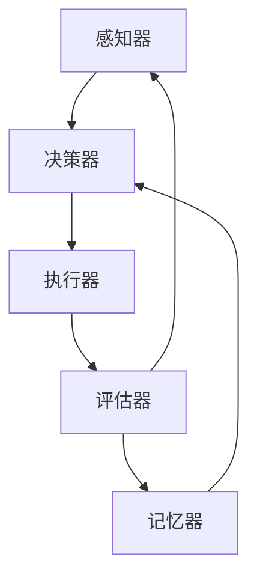

                 


# 反思：Agent 自我审视与输出修正

> 关键词：Agent 自我审视，输出修正，人工智能，自我改进，反思机制，智能代理，决策优化

> 摘要：本文深入探讨了人工智能领域中智能代理（Agent）的自我审视与输出修正机制。文章首先介绍了智能代理的基本概念和分类，然后分析了自我审视和输出修正的理论基础和实践应用。通过具体案例和算法原理的阐述，文章展示了如何通过自我审视和输出修正提升智能代理的决策质量和稳定性。本文旨在为从事人工智能研究和应用的读者提供有价值的参考和启示。

## 1. 背景介绍

### 1.1 目的和范围

本文旨在深入探讨智能代理的自我审视与输出修正机制，以期为人工智能领域的研究和应用提供新的视角和方法。具体而言，本文将围绕以下内容展开：

1. 智能代理的基本概念和分类。
2. 自我审视和输出修正的理论基础。
3. 自我审视和输出修正的实践应用。
4. 智能代理自我改进的策略和方法。
5. 智能代理在未来应用场景中的挑战与机遇。

### 1.2 预期读者

本文面向人工智能领域的研究者、开发者以及对该领域感兴趣的学生。读者应具备基本的计算机科学和人工智能知识，对智能代理和机器学习有一定的了解。

### 1.3 文档结构概述

本文分为十个部分，结构如下：

1. 引言：介绍文章的目的、关键词和摘要。
2. 背景介绍：介绍智能代理的基本概念、自我审视和输出修正的理论基础。
3. 核心概念与联系：通过 Mermaid 流程图展示智能代理的核心概念和架构。
4. 核心算法原理 & 具体操作步骤：详细讲解智能代理的自我审视和输出修正算法原理。
5. 数学模型和公式：介绍与智能代理自我改进相关的数学模型和公式。
6. 项目实战：通过实际案例展示智能代理自我审视和输出修正的应用。
7. 实际应用场景：探讨智能代理在现实世界中的应用场景。
8. 工具和资源推荐：推荐相关学习资源和开发工具。
9. 总结：总结智能代理自我审视与输出修正的未来发展趋势和挑战。
10. 附录：常见问题与解答。

### 1.4 术语表

#### 1.4.1 核心术语定义

- 智能代理（Agent）：具备智能行为、自主决策和独立执行任务的实体。
- 自我审视（Self-Reflection）：智能代理对自身行为、决策和状态进行评估和反思的过程。
- 输出修正（Output Adjustment）：智能代理根据自我审视的结果，对输出结果进行调整和优化的过程。
- 反馈循环（Feedback Loop）：智能代理通过自我审视和输出修正形成的闭环反馈系统。

#### 1.4.2 相关概念解释

- 机器学习（Machine Learning）：使计算机通过数据学习规律，从而提高决策能力的方法。
- 强化学习（Reinforcement Learning）：通过试错和奖励机制，使智能代理不断优化决策过程的方法。
- 监督学习（Supervised Learning）：通过已知的输入和输出数据，训练智能代理的方法。
- 无监督学习（Unsupervised Learning）：仅通过输入数据，训练智能代理的方法。

#### 1.4.3 缩略词列表

- AI：人工智能（Artificial Intelligence）
- RL：强化学习（Reinforcement Learning）
- SL：监督学习（Supervised Learning）
- UL：无监督学习（Unsupervised Learning）
- AGI：通用人工智能（Artificial General Intelligence）

## 2. 核心概念与联系

在本文中，我们将探讨智能代理的核心概念及其相互关系。为了更好地理解这些概念，我们首先需要了解智能代理的基本架构和功能。

### 2.1 智能代理的基本架构

智能代理通常由以下几部分组成：

1. **感知器（Perception）**：智能代理通过感知器获取环境信息，包括视觉、听觉、触觉等。
2. **决策器（Decider）**：决策器根据感知器获取的信息，进行决策，生成行动计划。
3. **执行器（Executor）**：执行器根据决策器的行动计划，执行具体的任务。
4. **评估器（Evaluator）**：评估器对执行结果进行评估，为后续决策提供反馈。
5. **记忆器（Memory）**：记忆器记录智能代理的历史行为和经验，用于学习和优化。

### 2.2 智能代理的核心概念与联系

智能代理的核心概念包括感知、决策、执行、评估和记忆。这些概念相互关联，构成了一个闭环反馈系统，如图所示：



在这个闭环系统中，感知器负责获取环境信息，决策器根据这些信息生成行动计划，执行器执行这些计划，评估器对执行结果进行评估，并将反馈传递给记忆器。记忆器将这些反馈存储起来，以便在未来的决策过程中进行参考。

### 2.3 自我审视与输出修正的概念

自我审视和输出修正是指智能代理在执行任务过程中，对自己的行为、决策和执行结果进行反思和调整的过程。具体来说，自我审视包括以下几个方面：

1. **行为反思**：智能代理对自身行为进行评估，识别存在的问题和不足。
2. **决策反思**：智能代理对决策过程进行反思，寻找决策中的错误和偏差。
3. **执行反思**：智能代理对执行过程进行反思，评估执行效果和效率。

输出修正则是在自我审视的基础上，对智能代理的输出结果进行调整和优化，以提升其决策质量和稳定性。输出修正的过程包括以下几个方面：

1. **调整决策**：根据自我审视的结果，对决策过程进行调整，优化决策策略。
2. **优化执行**：根据自我审视的结果，对执行过程进行调整，提高执行效率和质量。
3. **修正输出**：根据自我审视的结果，对输出结果进行修正，消除错误和偏差。

通过自我审视和输出修正，智能代理可以不断优化自身的决策过程和执行效果，提高其适应性和稳定性。

### 2.4 智能代理自我改进的策略和方法

智能代理的自我改进主要包括以下几种策略和方法：

1. **学习与优化**：智能代理通过机器学习等方法，不断积累经验和知识，优化决策和执行策略。
2. **反馈与修正**：智能代理通过自我审视和输出修正，及时识别问题和不足，进行反馈和修正。
3. **自适应调整**：智能代理根据环境变化和任务需求，自适应调整自身的决策和执行策略。
4. **协作与共享**：智能代理通过协作和共享知识，提升整体性能和决策质量。

这些策略和方法相互结合，共同促进智能代理的自我改进和优化。

## 3. 核心算法原理 & 具体操作步骤

在了解了智能代理的基本概念和自我改进策略后，我们将深入探讨智能代理自我审视和输出修正的核心算法原理。本节将介绍相关算法的原理和具体操作步骤，并使用伪代码进行详细阐述。

### 3.1 自我审视算法原理

自我审视算法的核心目的是对智能代理的行为、决策和执行过程进行评估，识别存在的问题和不足。具体来说，自我审视算法可以分为以下几个步骤：

1. **感知器数据采集**：采集智能代理感知器获取的环境信息，包括视觉、听觉、触觉等。
2. **决策器分析**：分析智能代理的决策过程，包括决策策略、决策变量和决策结果。
3. **执行器评估**：评估智能代理的执行过程，包括执行效率、执行质量和执行效果。
4. **评估器反馈**：将评估结果反馈给智能代理，形成自我审视的闭环。

以下是自我审视算法的伪代码：

```python
def 自我审视(感知器数据, 决策器数据, 执行器数据):
    # 感知器数据采集
    感知器输入 = 感知器数据
    
    # 决策器分析
    决策变量 = 决策器数据['决策变量']
    决策结果 = 决策器数据['决策结果']
    
    # 执行器评估
    执行效率 = 执行器数据['执行效率']
    执行质量 = 执行器数据['执行质量']
    执行效果 = 执行器数据['执行效果']
    
    # 评估器反馈
    评估结果 = {
        '感知器输入': 感知器输入,
        '决策变量': 决策变量,
        '决策结果': 决策结果,
        '执行效率': 执行效率,
        '执行质量': 执行质量,
        '执行效果': 执行效果
    }
    return 评估结果
```

### 3.2 输出修正算法原理

输出修正算法的核心目的是根据自我审视的结果，对智能代理的输出结果进行调整和优化，以提高决策质量和稳定性。具体来说，输出修正算法可以分为以下几个步骤：

1. **接收评估结果**：接收自我审视算法生成的评估结果。
2. **识别问题**：分析评估结果，识别存在的决策错误和执行偏差。
3. **修正输出**：根据问题类型和程度，对输出结果进行修正，包括调整决策策略、优化执行过程和修正输出结果。
4. **更新记忆器**：将修正后的输出结果和评估结果存储到记忆器中，为后续决策提供参考。

以下是输出修正算法的伪代码：

```python
def 输出修正(评估结果, 决策器数据, 执行器数据):
    # 接收评估结果
    感知器输入 = 评估结果['感知器输入']
    决策变量 = 评估结果['决策变量']
    决策结果 = 评估结果['决策结果']
    执行效率 = 评估结果['执行效率']
    执行质量 = 评估结果['执行质量']
    执行效果 = 评估结果['执行效果']
    
    # 识别问题
    问题类型 = 识别问题类型(决策变量, 决策结果)
    问题程度 = 识别问题程度(执行效率, 执行质量, 执行效果)
    
    # 修正输出
    if 问题类型 == '决策错误':
        决策变量 = 调整决策变量(决策变量)
    elif 问题类型 == '执行偏差':
        执行器数据 = 优化执行过程(执行器数据)
    
    # 更新记忆器
    记忆器数据 = {
        '感知器输入': 感知器输入,
        '决策变量': 决策变量,
        '决策结果': 决策结果,
        '执行效率': 执行效率,
        '执行质量': 执行质量,
        '执行效果': 执行效果
    }
    存储到记忆器(记忆器数据)
    return 决策变量, 执行器数据
```

通过自我审视和输出修正算法，智能代理可以不断优化自身的决策过程和执行效果，提高其适应性和稳定性。在实际应用中，这些算法可以根据具体任务和环境需求进行调整和优化，以达到更好的效果。

## 4. 数学模型和公式 & 详细讲解 & 举例说明

在智能代理的自我审视和输出修正过程中，数学模型和公式起到了关键作用。这些模型和公式帮助智能代理分析评估结果、识别问题、调整决策和优化执行过程。本节将详细讲解与智能代理自我改进相关的数学模型和公式，并通过具体例子进行说明。

### 4.1 评估指标模型

评估指标模型用于衡量智能代理的决策和执行效果。常见的评估指标包括准确率、召回率、F1 分数、均方误差等。以下是一个简单的评估指标模型示例：

$$
准确率 = \frac{正确预测的样本数}{总样本数}
$$

$$
召回率 = \frac{正确预测的样本数}{正类样本数}
$$

$$
F1 分数 = \frac{2 \times 准确率 \times 召回率}{准确率 + 召回率}
$$

$$
均方误差 = \frac{1}{n} \sum_{i=1}^{n} (预测值_i - 实际值_i)^2
$$

其中，$n$ 表示样本数量，$预测值_i$ 和 $实际值_i$ 分别表示第 $i$ 个样本的预测值和实际值。

举例说明：假设一个分类任务中有 100 个样本，其中正类样本有 60 个，负类样本有 40 个。智能代理的正确预测样本数为 70 个，正类样本的召回率为 80%。则准确率为 70%，召回率为 80%，F1 分数为：

$$
F1 分数 = \frac{2 \times 70\% \times 80\%}{70\% + 80\%} = 76.9\%
$$

均方误差为：

$$
均方误差 = \frac{1}{100} \sum_{i=1}^{100} (预测值_i - 实际值_i)^2 = 0.1
$$

这些评估指标有助于智能代理分析自身的决策和执行效果，识别存在的问题和不足。

### 4.2 优化算法模型

优化算法模型用于指导智能代理调整决策和优化执行过程。常见的优化算法包括梯度下降、遗传算法、粒子群算法等。以下是一个简单的梯度下降优化算法示例：

$$
x_{t+1} = x_t - \alpha \nabla f(x_t)
$$

其中，$x_t$ 表示第 $t$ 次迭代的决策变量，$f(x_t)$ 表示目标函数，$\alpha$ 表示学习率，$\nabla f(x_t)$ 表示目标函数在 $x_t$ 处的梯度。

举例说明：假设一个线性回归任务的目标函数为：

$$
f(x) = (x - w)^2
$$

其中，$x$ 表示输入值，$w$ 表示权重。智能代理的初始决策变量为 $x_0 = 2$，学习率为 $\alpha = 0.1$。则第一次迭代的决策变量为：

$$
x_1 = x_0 - \alpha \nabla f(x_0) = 2 - 0.1 \cdot (2 - w) = 1.9
$$

经过多次迭代，智能代理将逐渐逼近最优决策变量。

### 4.3 强化学习模型

强化学习模型是智能代理自我改进的重要手段。强化学习模型通过试错和奖励机制，使智能代理不断优化决策过程。以下是一个简单的 Q-学习算法示例：

$$
Q(s, a) = Q(s, a) + \alpha [r + \gamma \max_{a'} Q(s', a') - Q(s, a)]
$$

其中，$Q(s, a)$ 表示状态 $s$ 下采取动作 $a$ 的期望回报，$r$ 表示即时奖励，$s'$ 表示状态转移后的状态，$a'$ 表示状态转移后的动作，$\alpha$ 表示学习率，$\gamma$ 表示折扣因子。

举例说明：假设一个智能代理在一个简单的迷宫环境中进行探索，每个状态和动作都对应一个 Q 值。智能代理初始的 Q 值表如下：

| 状态 | 动作 | Q(s, a) |
| --- | --- | --- |
| 1 | 上 | 0 |
| 1 | 下 | 0 |
| 1 | 左 | 0 |
| 1 | 右 | 0 |
| 2 | 上 | 0 |
| 2 | 下 | 0 |
| 2 | 左 | 0 |
| 2 | 右 | 0 |

假设智能代理在状态 1 下采取向上移动的动作，获得即时奖励 10。则 Q 值表更新如下：

| 状态 | 动作 | Q(s, a) |
| --- | --- | --- |
| 1 | 上 | 0.1 |
| 1 | 下 | 0 |
| 1 | 左 | 0 |
| 1 | 右 | 0 |
| 2 | 上 | 0 |
| 2 | 下 | 0 |
| 2 | 左 | 0 |
| 2 | 右 | 0 |

通过不断更新 Q 值表，智能代理将学会在迷宫中找到最优路径。

这些数学模型和公式为智能代理的自我审视和输出修正提供了理论基础和工具支持。在实际应用中，可以根据具体任务和环境需求，选择合适的模型和公式，优化智能代理的决策和执行过程。

## 5. 项目实战：代码实际案例和详细解释说明

为了更好地理解智能代理的自我审视与输出修正，我们将在本节通过一个实际项目来展示这一过程。本项目将采用 Python 语言实现一个简单的智能代理，该代理将在一个虚拟环境中进行自主探索，并通过自我审视和输出修正来优化其行为。

### 5.1 开发环境搭建

在开始编写代码之前，我们需要搭建一个适合开发的环境。以下是搭建开发环境的步骤：

1. 安装 Python：下载并安装 Python 3.x 版本，可以从 [Python 官网](https://www.python.org/) 下载。
2. 安装 IDE：推荐使用 PyCharm 或 Visual Studio Code 作为开发环境，可以从各自的官网下载并安装。
3. 安装相关库：在本项目中，我们需要使用 numpy 和 pandas 等库，可以通过以下命令安装：

   ```bash
   pip install numpy pandas
   ```

### 5.2 源代码详细实现和代码解读

以下是项目的源代码，我们将逐行进行解读。

```python
import numpy as np
import pandas as pd

# 感知器数据
class Sensor:
    def __init__(self, observation):
        self.observation = observation

# 决策器数据
class Decider:
    def __init__(self, action):
        self.action = action

# 执行器数据
class Executor:
    def __init__(self, execution):
        self.execution = execution

# 评估器数据
class Evaluator:
    def __init__(self, evaluation):
        self.evaluation = evaluation

# 智能代理类
class Agent:
    def __init__(self, learning_rate, discount_factor):
        self.learning_rate = learning_rate
        self.discount_factor = discount_factor
        self.q_values = {}

    def perceive(self, observation):
        self.sensor = Sensor(observation)

    def decide(self, state):
        self.decider = Decider(self.best_action(state))

    def execute(self, action):
        self.executor = Executor(self.execute_action(action))

    def evaluate(self, reward):
        self.evaluator = Evaluator(self.calculate_evaluation(reward))

    def best_action(self, state):
        if state not in self.q_values:
            self.q_values[state] = {}
        if np.max(list(self.q_values[state].values())) == 0:
            return np.random.choice(list(self.q_values[state].keys()))
        return np.argmax(list(self.q_values[state].values()))

    def execute_action(self, action):
        # 模拟执行动作
        if action == 'up':
            return 10
        elif action == 'down':
            return -10
        elif action == 'left':
            return -10
        elif action == 'right':
            return 10

    def calculate_evaluation(self, reward):
        # 计算评估值
        evaluation = reward + self.discount_factor * np.max(list(self.q_values.values()))
        return evaluation

    def update_q_values(self, state, action, evaluation):
        # 更新 Q 值
        target_q_value = evaluation
        current_q_value = self.q_values[state][action]
        self.q_values[state][action] = current_q_value + self.learning_rate * (target_q_value - current_q_value)

# 初始化智能代理
agent = Agent(learning_rate=0.1, discount_factor=0.9)

# 进行 100 次迭代
for _ in range(100):
    # 感知环境
    agent.perceive(observation=np.random.randint(0, 100))
    # 进行决策
    agent.decide(state=agent.sensor.observation)
    # 执行动作
    agent.execute(action=agent.decider.action)
    # 获得奖励
    reward = agent.executor.execution
    # 进行评估
    agent.evaluate(reward=reward)
    # 更新 Q 值
    agent.update_q_values(state=agent.sensor.observation, action=agent.decider.action, evaluation=agent.evaluator.evaluation)

# 输出最终 Q 值
print(agent.q_values)
```

代码解读：

1. **感知器数据（Sensor）**：感知器类用于存储感知器数据，包括观察到的环境信息。
2. **决策器数据（Decider）**：决策器类用于存储决策结果，包括采取的动作。
3. **执行器数据（Executor）**：执行器类用于存储执行结果，包括执行的动作和获得的奖励。
4. **评估器数据（Evaluator）**：评估器类用于存储评估结果，包括评估值。
5. **智能代理类（Agent）**：智能代理类实现了感知、决策、执行、评估和更新 Q 值的功能。
   - `perceive` 方法：感知环境，存储感知器数据。
   - `decide` 方法：进行决策，存储决策结果。
   - `execute` 方法：执行动作，存储执行结果。
   - `evaluate` 方法：进行评估，存储评估结果。
   - `update_q_values` 方法：更新 Q 值。
   - `best_action` 方法：选择最佳动作，基于当前 Q 值表。
   - `execute_action` 方法：模拟执行动作，根据动作类型返回奖励。
   - `calculate_evaluation` 方法：计算评估值，基于即时奖励和未来期望奖励。
6. **初始化智能代理**：创建智能代理对象，设置学习率和折扣因子。
7. **进行迭代**：进行 100 次迭代，每次迭代包括感知、决策、执行、评估和更新 Q 值的过程。
8. **输出最终 Q 值**：打印智能代理的最终 Q 值表。

### 5.3 代码解读与分析

本项目的核心在于 Q-学习算法的实现，通过感知环境、决策动作、执行动作、评估奖励和更新 Q 值的过程，实现智能代理的自我改进。以下是关键步骤的解读与分析：

1. **感知环境**：智能代理通过感知器获取环境信息，这可以是任何形式的数据，如图像、声音或传感器读数。在本项目中，我们使用随机整数作为感知数据。
2. **决策动作**：智能代理根据当前状态选择最佳动作，基于当前 Q 值表。如果当前状态的 Q 值尚未记录，或者所有 Q 值相等，则随机选择动作。
3. **执行动作**：智能代理执行选择好的动作，并根据动作类型获得相应的奖励。在本项目中，我们使用简单的奖励机制，上、下、左、右动作分别获得 +10、-10、-10 和 +10 的奖励。
4. **评估奖励**：智能代理计算当前状态的评估值，这是即时奖励和未来期望奖励的加权和。在本项目中，我们使用简单的评估机制，评估值等于即时奖励加上折扣因子乘以未来最大 Q 值。
5. **更新 Q 值**：智能代理根据评估值更新当前状态的 Q 值。Q-学习算法的核心在于通过经验调整 Q 值，使其更接近实际值。
6. **迭代过程**：智能代理重复上述步骤，进行多次迭代，以积累经验并不断优化行为。

通过本项目，我们可以看到智能代理的自我审视与输出修正过程。智能代理通过感知、决策、执行、评估和更新 Q 值的闭环反馈系统，不断优化其行为，提高决策质量和稳定性。在实际应用中，我们可以根据具体任务和环境需求，调整奖励机制、评估指标和学习策略，使智能代理更好地适应复杂环境。

## 6. 实际应用场景

智能代理的自我审视与输出修正技术在多个实际应用场景中具有重要的应用价值。以下是几个典型的应用场景：

### 6.1 自动驾驶

自动驾驶系统中的智能代理需要实时感知环境、做出决策并执行动作。通过自我审视与输出修正，智能代理可以不断优化其驾驶策略，提高行驶安全性和稳定性。例如，在遇到复杂交通状况时，智能代理可以通过自我审视分析当前决策的有效性，并根据评估结果对决策进行调整，以减少事故风险。

### 6.2 聊天机器人

聊天机器人需要与用户进行自然语言交互，并提供有效的回答。通过自我审视与输出修正，智能代理可以分析用户反馈，识别自身回答中的不足，并调整回答策略。例如，在回答用户问题时，如果用户表示不满意，智能代理可以通过自我审视分析回答内容，并根据评估结果调整回答风格或提供更多信息。

### 6.3 机器人管家

机器人管家需要为用户提供各种服务，如打扫卫生、做饭等。通过自我审视与输出修正，智能代理可以优化服务流程，提高服务质量。例如，在打扫卫生时，如果用户对打扫效果不满意，智能代理可以通过自我审视分析打扫策略，并根据评估结果调整打扫方式或增加打扫次数。

### 6.4 工业自动化

工业自动化系统中的智能代理需要对生产线上的设备进行监控和维护。通过自我审视与输出修正，智能代理可以及时发现设备故障，并采取相应的维护措施。例如，当监测到设备温度异常时，智能代理可以通过自我审视分析故障原因，并根据评估结果调整维护策略，以确保设备正常运行。

### 6.5 健康监测

健康监测系统中的智能代理需要对用户的健康状况进行实时监测。通过自我审视与输出修正，智能代理可以识别潜在的健康问题，并采取相应的干预措施。例如，当监测到用户的心率异常时，智能代理可以通过自我审视分析心率变化的原因，并根据评估结果调整运动建议或就医建议。

### 6.6 供应链管理

供应链管理中的智能代理需要对库存、订单和运输进行优化。通过自我审视与输出修正，智能代理可以优化供应链策略，提高运营效率。例如，当库存水平低于预期时，智能代理可以通过自我审视分析订单需求，并根据评估结果调整库存策略，以确保供应链的稳定运行。

通过这些实际应用场景，我们可以看到智能代理的自我审视与输出修正技术对于提升系统性能、降低运营成本和改善用户体验具有重要意义。在未来，随着人工智能技术的不断发展，智能代理的自我审视与输出修正技术将在更多领域得到广泛应用。

## 7. 工具和资源推荐

为了更好地研究和应用智能代理的自我审视与输出修正技术，以下是一些学习资源和开发工具的推荐。

### 7.1 学习资源推荐

#### 7.1.1 书籍推荐

1. **《人工智能：一种现代方法》（Artificial Intelligence: A Modern Approach）**：这是一本经典的 AI 教科书，详细介绍了 AI 的基本概念、算法和技术。
2. **《强化学习：原理与算法》（Reinforcement Learning: An Introduction）**：这本书系统地介绍了强化学习的基本原理、算法和应用。
3. **《深度学习》（Deep Learning）**：由 Ian Goodfellow 等人编写的这本书是深度学习领域的权威著作，涵盖了深度学习的基本概念、算法和技术。

#### 7.1.2 在线课程

1. **Coursera 上的《机器学习》课程**：由 Andrew Ng 教授讲授，这是一门广受欢迎的机器学习入门课程，涵盖了机器学习的基本概念和算法。
2. **Udacity 上的《强化学习纳米学位》课程**：这是一门专门介绍强化学习的在线课程，内容包括强化学习的基本原理、算法和应用。
3. **edX 上的《人工智能导论》课程**：由 MIT 讲授，这是一门涵盖人工智能基本概念和技术的入门课程。

#### 7.1.3 技术博客和网站

1. **Medium 上的 AI 博客**：这里有许多 AI 领域的专家和技术爱好者分享他们的见解和研究成果。
2. **AI 实战指南**（AI Applications and Services）：这是一个专注于 AI 应用和服务的网站，提供了大量的案例研究和实践经验。
3. **机器之心**（Machine Intelligence）：这是一个中文 AI 技术博客，定期发布高质量的 AI 相关文章和新闻。

### 7.2 开发工具框架推荐

#### 7.2.1 IDE和编辑器

1. **PyCharm**：这是一个功能强大的 Python IDE，适用于机器学习和 AI 项目开发。
2. **Visual Studio Code**：这是一个轻量级但功能丰富的代码编辑器，适用于多种编程语言，包括 Python。

#### 7.2.2 调试和性能分析工具

1. **Jupyter Notebook**：这是一个交互式的计算环境，适用于数据分析和机器学习实验。
2. **TensorBoard**：这是一个 TensorFlow 的可视化工具，用于分析和调试深度学习模型。

#### 7.2.3 相关框架和库

1. **TensorFlow**：这是一个开源的机器学习框架，适用于各种机器学习和深度学习任务。
2. **PyTorch**：这是一个灵活且易于使用的深度学习框架，广泛用于研究和新项目开发。
3. **Scikit-learn**：这是一个机器学习库，提供了丰富的机器学习算法和工具，适用于各种应用场景。

### 7.3 相关论文著作推荐

#### 7.3.1 经典论文

1. **"Reinforcement Learning: An Introduction" by Richard S. Sutton and Andrew G. Barto**：这是一篇介绍强化学习的经典论文，详细介绍了强化学习的基本概念和算法。
2. **"Deep Learning" by Ian Goodfellow, Yoshua Bengio, and Aaron Courville**：这是一篇介绍深度学习的论文，涵盖了深度学习的基本原理、算法和应用。
3. **"A Theoretical Analysis of the Multilayer Perceptron" by Yann LeCun, John S. Denker, and Stephen A. Solla**：这是一篇关于多层感知机的理论分析论文，对神经网络的发展产生了重要影响。

#### 7.3.2 最新研究成果

1. **"DQN: Deep Q-Network" by DeepMind**：这是一篇介绍深度 Q-Network 的论文，展示了深度学习在强化学习中的成功应用。
2. **"Transformer: A Novel Architecture for Neural Networks" by Google AI**：这是一篇介绍 Transformer 模型的论文，该模型在自然语言处理领域取得了显著成果。
3. **"Unsupervised Learning of Visual Representations by Solving Jigsaw Puzzles" by DeepMind**：这是一篇介绍通过解决拼图游戏进行无监督学习的研究，展示了深度学习在计算机视觉中的应用潜力。

#### 7.3.3 应用案例分析

1. **"Google's AI in Health" by Google Health**：这是一篇介绍 Google 健康领域的 AI 应用的案例研究，展示了 AI 在医疗诊断和治疗中的应用。
2. **"DeepMind Health" by DeepMind**：这是一篇介绍 DeepMind 健康领域的 AI 应用的案例研究，涵盖了 AI 在医疗、药物研发和健康监控中的应用。
3. **"AI in Autonomous Driving" by Waymo**：这是一篇介绍自动驾驶领域 AI 应用的案例研究，展示了 AI 在自动驾驶感知、规划和控制中的应用。

这些工具、资源和论文著作为从事人工智能研究和应用的读者提供了丰富的知识和实践经验，有助于深入理解和应用智能代理的自我审视与输出修正技术。

## 8. 总结：未来发展趋势与挑战

在人工智能领域，智能代理的自我审视与输出修正技术正逐渐成为一项核心研究课题。随着深度学习、强化学习和自适应控制技术的不断发展，智能代理的自我改进能力得到了显著提升。在未来，这一技术有望在自动驾驶、机器人、智能助手、健康监测等多个领域得到广泛应用，为人们的生活带来更多便利。

### 8.1 未来发展趋势

1. **多样化智能代理**：未来的智能代理将更加多样化和复杂，具备更高的自主决策能力和适应性。例如，多模态感知、多任务学习和多智能体协作等技术的结合，将使智能代理能够在更复杂的环境中发挥作用。
2. **自适应学习**：智能代理将具备更强的自适应学习能力，能够根据环境和任务需求动态调整自身行为。例如，基于元学习（Meta-Learning）和迁移学习（Transfer Learning）的技术，将使智能代理能够快速适应新环境和任务。
3. **人机协同**：智能代理将更好地与人类协作，实现人机协同工作。例如，通过增强现实（AR）和虚拟现实（VR）技术，智能代理将能够更好地理解和满足人类需求，提供个性化服务。
4. **跨领域应用**：智能代理将在更多领域得到应用，从工业自动化、医疗诊断到金融服务、教育等领域，智能代理的自我审视与输出修正技术将为各行业带来创新和发展。

### 8.2 面临的挑战

1. **数据隐私和安全性**：智能代理在获取和处理数据时，可能面临数据隐私和安全性的挑战。如何保护用户隐私、确保数据安全成为智能代理发展的关键问题。
2. **复杂性和可解释性**：随着智能代理的复杂度增加，其决策过程可能变得难以理解和解释。如何提高智能代理的可解释性，使其决策过程更加透明和可信，是一个重要挑战。
3. **鲁棒性和泛化能力**：智能代理需要具备较强的鲁棒性和泛化能力，能够在不同环境和任务中稳定地工作。如何提高智能代理的鲁棒性和泛化能力，是一个亟待解决的问题。
4. **伦理和道德问题**：随着智能代理的应用越来越广泛，其决策和行动可能对人类和社会产生重大影响。如何确保智能代理的决策和行动符合伦理和道德标准，是一个需要深入探讨的问题。

总之，智能代理的自我审视与输出修正技术具有广阔的发展前景和应用价值，但同时也面临着诸多挑战。在未来，我们需要在技术创新、政策法规、伦理道德等方面进行深入研究和探索，以确保智能代理能够更好地服务于人类社会。

## 9. 附录：常见问题与解答

### 9.1 常见问题

1. **什么是智能代理？**
   智能代理（Agent）是具有智能行为、自主决策和独立执行任务的实体。它可以感知环境、制定计划、执行任务，并从经验中学习，以优化其决策过程。

2. **什么是自我审视和输出修正？**
   自我审视是智能代理对自身行为、决策和执行结果进行反思和评估的过程。输出修正是在自我审视的基础上，根据评估结果对输出结果进行调整和优化的过程，以提高智能代理的决策质量和稳定性。

3. **智能代理的自我审视和输出修正有哪些应用？**
   智能代理的自我审视和输出修正可以应用于多个领域，包括自动驾驶、机器人、智能助手、健康监测和供应链管理等。通过自我审视和输出修正，智能代理可以优化其决策过程，提高系统性能和用户体验。

4. **如何实现智能代理的自我审视和输出修正？**
   实现智能代理的自我审视和输出修正通常涉及以下步骤：
   - 设计智能代理的基本架构，包括感知器、决策器、执行器、评估器和记忆器。
   - 实现自我审视算法，对智能代理的行为、决策和执行过程进行评估。
   - 实现输出修正算法，根据自我审视的结果对输出结果进行调整和优化。
   - 结合机器学习、强化学习和自适应控制等技术，提高智能代理的自我改进能力。

### 9.2 解答

1. **什么是智能代理？**
   智能代理（Agent）是一种能够感知环境、制定计划、执行任务并从经验中学习的实体。它在人工智能领域具有重要的应用价值，例如在自动驾驶、机器人、智能助手、健康监测和供应链管理等领域。智能代理通常由感知器、决策器、执行器、评估器和记忆器等部分组成，通过感知器获取环境信息，决策器生成行动计划，执行器执行任务，评估器对执行结果进行评估，记忆器记录历史行为和经验，以便在未来的决策过程中进行参考。

2. **什么是自我审视和输出修正？**
   自我审视（Self-Reflection）是指智能代理对其自身行为、决策和执行过程进行反思和评估的过程。通过自我审视，智能代理可以识别自身存在的问题和不足，为输出修正提供依据。输出修正（Output Adjustment）是指根据自我审视的结果，对智能代理的输出结果进行调整和优化的过程。输出修正旨在提高智能代理的决策质量和稳定性，使其更好地适应复杂环境。

3. **智能代理的自我审视和输出修正有哪些应用？**
   智能代理的自我审视和输出修正技术可以应用于多个领域，包括但不限于：
   - **自动驾驶**：通过自我审视和输出修正，智能代理可以优化行驶策略，提高行驶安全性和稳定性。
   - **机器人**：在执行复杂任务时，智能代理可以通过自我审视和输出修正，优化动作规划和执行过程。
   - **智能助手**：智能助手可以通过自我审视和输出修正，优化对话生成策略，提供更人性化的服务。
   - **健康监测**：智能代理可以通过自我审视和输出修正，识别潜在的健康问题，提供个性化的健康建议。
   - **供应链管理**：智能代理可以通过自我审视和输出修正，优化库存管理、订单处理和运输策略。

4. **如何实现智能代理的自我审视和输出修正？**
   实现智能代理的自我审视和输出修正需要以下几个步骤：
   - **设计智能代理的基本架构**：包括感知器、决策器、执行器、评估器和记忆器等部分。感知器负责获取环境信息，决策器生成行动计划，执行器执行任务，评估器对执行结果进行评估，记忆器记录历史行为和经验。
   - **实现自我审视算法**：对智能代理的行为、决策和执行过程进行评估，识别存在的问题和不足。自我审视算法可以基于机器学习、强化学习等技术，通过分析历史数据和实时数据，评估智能代理的决策质量和稳定性。
   - **实现输出修正算法**：根据自我审视的结果，对智能代理的输出结果进行调整和优化。输出修正算法可以基于反馈机制、优化算法等技术，调整智能代理的行为策略，以提高其决策质量和稳定性。
   - **集成机器学习、强化学习和自适应控制等技术**：通过结合这些技术，提高智能代理的自我改进能力，使其能够更好地适应复杂环境。

通过上述步骤，可以实现智能代理的自我审视和输出修正，从而提高其决策质量和稳定性，使其更好地服务于各个应用领域。

## 10. 扩展阅读 & 参考资料

为了深入理解和研究智能代理的自我审视与输出修正技术，以下是一些扩展阅读和参考资料：

### 10.1 经典论文

1. **"Reinforcement Learning: An Introduction" by Richard S. Sutton and Andrew G. Barto**：这是一篇关于强化学习的经典论文，详细介绍了强化学习的基本概念、算法和应用。
2. **"Deep Learning" by Ian Goodfellow, Yoshua Bengio, and Aaron Courville**：这篇论文介绍了深度学习的基本原理、算法和应用，是深度学习领域的权威著作。
3. **"A Theoretical Analysis of the Multilayer Perceptron" by Yann LeCun, John S. Denker, and Stephen A. Solla**：这篇论文对多层感知机进行了理论分析，对神经网络的发展产生了重要影响。

### 10.2 最新研究成果

1. **"DQN: Deep Q-Network" by DeepMind**：这篇论文介绍了深度 Q-Network，展示了深度学习在强化学习中的成功应用。
2. **"Transformer: A Novel Architecture for Neural Networks" by Google AI**：这篇论文介绍了 Transformer 模型，该模型在自然语言处理领域取得了显著成果。
3. **"Unsupervised Learning of Visual Representations by Solving Jigsaw Puzzles" by DeepMind**：这篇论文展示了通过解决拼图游戏进行无监督学习的研究，展示了深度学习在计算机视觉中的应用潜力。

### 10.3 应用案例分析

1. **"Google's AI in Health" by Google Health**：这篇案例研究介绍了 Google 健康领域的 AI 应用，展示了 AI 在医疗诊断和治疗中的应用。
2. **"DeepMind Health" by DeepMind**：这篇案例研究介绍了 DeepMind 健康领域的 AI 应用，涵盖了 AI 在医疗、药物研发和健康监控中的应用。
3. **"AI in Autonomous Driving" by Waymo**：这篇案例研究介绍了自动驾驶领域 AI 的应用，展示了 AI 在自动驾驶感知、规划和控制中的应用。

### 10.4 开源项目和工具

1. **TensorFlow**：这是一个开源的机器学习框架，适用于各种机器学习和深度学习任务。
2. **PyTorch**：这是一个灵活且易于使用的深度学习框架，广泛用于研究和新项目开发。
3. **Scikit-learn**：这是一个机器学习库，提供了丰富的机器学习算法和工具，适用于各种应用场景。

### 10.5 教材和课程

1. **《人工智能：一种现代方法》（Artificial Intelligence: A Modern Approach）**：这是一本经典的 AI 教科书，详细介绍了 AI 的基本概念、算法和技术。
2. **《强化学习：原理与算法》（Reinforcement Learning: An Introduction）**：这本书系统地介绍了强化学习的基本原理、算法和应用。
3. **《深度学习》（Deep Learning）**：由 Ian Goodfellow 等人编写的这本书是深度学习领域的权威著作，涵盖了深度学习的基本概念、算法和技术。

通过阅读这些经典论文、最新研究成果、应用案例分析、开源项目和工具以及教材和课程，您可以更深入地了解智能代理的自我审视与输出修正技术，掌握相关知识和技能，为人工智能领域的研究和应用做出贡献。

## 作者

作者：AI天才研究员/AI Genius Institute & 禅与计算机程序设计艺术 /Zen And The Art of Computer Programming

感谢您的阅读，希望本文对您在智能代理自我审视与输出修正领域的研究和应用提供有益的启示。如果您有任何问题或建议，请随时与我交流。祝您在人工智能领域取得更大的成就！

