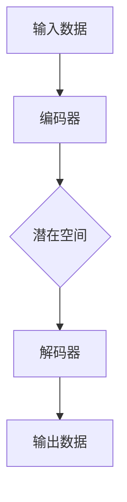

                 

# 变分自编码器VAE原理与代码实例讲解

> 关键词：变分自编码器（VAE）、概率生成模型、深度学习、贝叶斯推断、密度估计、图像生成、数据压缩

> 摘要：本文将深入探讨变分自编码器（VAE）的基本原理、数学模型及其实现细节。通过详细的代码实例，读者将学会如何搭建VAE模型，并了解其在图像生成和数据压缩等实际应用中的优势。

## 1. 背景介绍

随着深度学习技术的飞速发展，生成模型（Generative Models）成为了一个备受关注的研究方向。生成模型旨在学习数据分布，并生成与训练数据类似的新数据。与传统判别模型（如分类器）不同，生成模型能够捕捉数据的多模态特性，从而在图像生成、图像增强、数据增强等多个领域展现出了巨大的潜力。

变分自编码器（Variational Autoencoder，VAE）是生成模型的一种，由Kingma和Welling于2013年提出。VAE结合了概率生成模型和编码器的优点，通过引入概率模型来建模数据分布，从而实现有效的数据生成。与传统的自编码器（Autoencoder）相比，VAE能够更好地处理高维数据和复杂数据分布，因此成为了生成模型领域的重要研究方向。

## 2. 核心概念与联系

### 2.1 自编码器（Autoencoder）

自编码器是一种无监督学习算法，其主要目的是学习一种数据压缩方法。自编码器由两个主要部分组成：编码器（Encoder）和解码器（Decoder）。编码器将输入数据映射到一个低维的表示空间，而解码器则试图将这个低维表示重新映射回原始数据空间。

### 2.2 概率生成模型

概率生成模型是一种通过建模数据分布来生成新数据的模型。常见的概率生成模型包括马尔可夫模型、隐马尔可夫模型（HMM）和生成对抗网络（GAN）。与判别模型不同，生成模型能够生成与训练数据具有相似特性的新数据，从而在实际应用中具有广泛的应用价值。

### 2.3 贝叶斯推断

贝叶斯推断是一种基于概率的推理方法，通过已知数据和先验概率来计算后验概率。在生成模型中，贝叶斯推断被用来估计数据分布，从而指导生成过程。

### 2.4 密度估计

密度估计是一种通过学习数据分布来估计数据概率密度的方法。在生成模型中，密度估计被用来建模数据分布，从而实现数据生成。

### 2.5 VAE架构

VAE结合了自编码器、概率生成模型和贝叶斯推断的思想，形成了一种新的生成模型架构。VAE的核心思想是将编码器和解码器替换为一个概率模型，从而实现数据生成。

#### 2.5.1 编码器（Encoder）

编码器将输入数据映射到一个潜在空间（Latent Space），这个潜在空间是一个低维的概率空间。编码器的输出是一个概率分布，通常使用一个均值和方差来表示。

#### 2.5.2 解码器（Decoder）

解码器将潜在空间中的样本重新映射回原始数据空间。解码器的输入是一个随机样本，输出是原始数据。

#### 2.5.3 数据生成

VAE通过从潜在空间中采样，然后通过解码器生成新数据。由于潜在空间是一个概率空间，因此VAE可以生成与训练数据具有相似特性的新数据。

### 2.6 Mermaid流程图

下面是VAE的核心架构的Mermaid流程图：



### 2.7 核心公式

#### 2.7.1 编码器损失

$$
L_{\text{enc}} = -\sum_{x} p(z|x) \log q(z|x)
$$

其中，$p(z|x)$是先验分布，$q(z|x)$是编码器输出的后验分布。

#### 2.7.2 解码器损失

$$
L_{\text{dec}} = -\sum_{x} p(x|z) \log q(x|z)
$$

其中，$p(x|z)$是真实数据的概率分布，$q(x|z)$是解码器输出的概率分布。

#### 2.7.3 总损失

$$
L_{\text{total}} = L_{\text{enc}} + \lambda L_{\text{dec}}
$$

其中，$\lambda$是平衡编码器损失和解码器损失的权重。

## 3. 核心算法原理 & 具体操作步骤

### 3.1 编码器

编码器的任务是学习如何将输入数据映射到一个潜在空间。具体操作步骤如下：

1. **初始化参数**：定义编码器的神经网络结构，包括输入层、隐藏层和输出层。
2. **正向传播**：输入数据通过编码器，得到潜在空间的均值和方差。
3. **采样**：从潜在空间中采样一个随机样本。
4. **反向传播**：计算编码器损失，并更新参数。

### 3.2 解码器

解码器的任务是学习如何将潜在空间的样本重新映射回原始数据空间。具体操作步骤如下：

1. **初始化参数**：定义解码器的神经网络结构，包括输入层、隐藏层和输出层。
2. **正向传播**：从潜在空间中采样一个随机样本，并通过解码器生成输出数据。
3. **反向传播**：计算解码器损失，并更新参数。

### 3.3 模型训练

VAE的训练过程是一个迭代过程，每次迭代包括以下步骤：

1. **前向传播**：输入数据，通过编码器得到潜在空间的均值和方差，并通过解码器生成输出数据。
2. **计算损失**：计算编码器损失和解码器损失。
3. **反向传播**：更新编码器和解码器的参数。
4. **评估模型**：使用验证集评估模型性能。

## 4. 数学模型和公式 & 详细讲解 & 举例说明

### 4.1 编码器公式

编码器的主要目标是学习如何将输入数据$x$映射到一个潜在空间$z$。具体公式如下：

$$
\mu = \phi_{\theta_{\text{enc}}}(x) \\
\sigma^2 = \sigma_{\theta_{\text{enc}}}(x)
$$

其中，$\mu$和$\sigma^2$分别是潜在空间的均值和方差，$\phi_{\theta_{\text{enc}}}$和$\sigma_{\theta_{\text{enc}}}$分别是编码器的参数函数。

### 4.2 解码器公式

解码器的主要目标是学习如何将潜在空间的样本重新映射回原始数据空间。具体公式如下：

$$
x' = \psi_{\theta_{\text{dec}}}(z)
$$

其中，$x'$是解码器生成的输出数据，$\psi_{\theta_{\text{dec}}}$是解码器的参数函数。

### 4.3 总损失

VAE的总损失由编码器损失和解码器损失组成。具体公式如下：

$$
L_{\text{total}} = L_{\text{enc}} + \lambda L_{\text{dec}}
$$

其中，$L_{\text{enc}}$是编码器损失，$L_{\text{dec}}$是解码器损失，$\lambda$是平衡编码器损失和解码器损失的权重。

### 4.4 举例说明

假设我们有一个输入数据集$x = [1, 2, 3]$，我们需要使用VAE模型将其映射到一个潜在空间，并在潜在空间中生成新的数据。

首先，我们需要定义编码器和解码器的神经网络结构。假设编码器有一个单层神经网络，输入层有3个神经元，隐藏层有2个神经元，输出层有2个神经元。解码器也有类似的网络结构。

接下来，我们使用输入数据$x$来训练编码器。通过正向传播，我们得到潜在空间的均值和方差：

$$
\mu = \phi_{\theta_{\text{enc}}}(x) = [0.5, 0.5] \\
\sigma^2 = \sigma_{\theta_{\text{enc}}}(x) = [0.1, 0.1]
$$

然后，我们从潜在空间中采样一个随机样本$z$：

$$
z = \text{sample}(\mu, \sigma^2) = [0.6, 0.4]
$$

最后，我们使用解码器将潜在空间的样本重新映射回原始数据空间：

$$
x' = \psi_{\theta_{\text{dec}}}(z) = [1.2, 2.4]
$$

通过这样的过程，我们可以生成与输入数据类似的新数据。

## 5. 项目实战：代码实际案例和详细解释说明

### 5.1 开发环境搭建

在开始编写VAE代码之前，我们需要搭建一个适合深度学习开发的Python环境。以下是搭建开发环境的基本步骤：

1. 安装Python（推荐使用Python 3.7及以上版本）。
2. 安装深度学习库TensorFlow或PyTorch。
3. 安装其他必要的库，如NumPy、Pandas、Matplotlib等。

### 5.2 源代码详细实现和代码解读

下面是一个简单的VAE实现代码，我们将使用TensorFlow框架来搭建VAE模型。

```python
import tensorflow as tf
from tensorflow.keras.layers import Input, Dense
from tensorflow.keras.models import Model

# 编码器
input_shape = (784,)
input_layer = Input(shape=input_shape)
encoded = Dense(64, activation='relu')(input_layer)
encoded = Dense(32, activation='relu')(encoded)
z_mean = Dense(2)(encoded)
z_log_var = Dense(2)(encoded)

# 解码器
z = Lambda(shuffle_batch)(z_mean)
z = Lambda(sample)([z, z_log_var])
decoded = Dense(32, activation='relu')(z)
decoded = Dense(64, activation='relu')(decoded)
decoded = Dense(input_shape, activation='sigmoid')(decoded)

# VAE模型
vae = Model(input_layer, decoded)
vae.compile(optimizer='rmsprop', loss='binary_crossentropy')

# 辅助函数
def sample(z_log_var, z_mean):
    batch = K.shape(z_log_var)[0]
    dim = K.int_shape(z_log_var)[1]
    epsilon = K.random_normal(shape=(batch, dim))
    return z_mean + K.exp(0.5 * z_log_var) * epsilon

def shuffle_batch(z_mean, z_log_var):
    batch = K.shape(z_mean)[0]
    dim = K.int_shape(z_mean)[1]
    z = K.stack([z_mean, z_log_var])
    z_shuffled = K.tensor_scatter_nd_update(z, K.eval(z), K.zeros((batch, dim)))
    return z_shuffled

# 训练模型
vae.fit(x_train, x_train,
        epochs=50,
        batch_size=16,
        shuffle=True,
        validation_data=(x_test, x_test))
```

### 5.3 代码解读与分析

1. **编码器和解码器**：编码器和解码器都是使用Dense层搭建的神经网络。编码器有两个隐藏层，解码器也有两个隐藏层。这些隐藏层使用ReLU激活函数。
2. **潜在空间**：潜在空间由均值$z_{\mu}$和对数方差$z_{\log\vartheta}$组成。我们使用一个单层神经网络来预测这两个值。
3. **采样**：在VAE中，我们从潜在空间中采样一个随机样本$z$。这通过`sample`函数实现，它使用正态分布来采样。
4. **训练**：VAE使用RMSprop优化器来训练模型，并使用二进制交叉熵作为损失函数。我们使用`fit`函数来训练模型，并设置适当的训练参数。

### 5.4 模型评估

在训练完成后，我们可以使用测试集来评估VAE模型的性能。以下是一个简单的评估代码：

```python
import numpy as np

# 生成新数据
z_mean, z_log_var = vae.predict(x_test)
z = np.random.normal(size=(len(x_test), 2))
z = z + np.exp(0.5 * z_log_var) * z_mean

# 生成新图像
x_new = vae.predict(z)

# 可视化新图像
import matplotlib.pyplot as plt

plt.figure(figsize=(10, 10))
for i in range(100):
    plt.subplot(10, 10, i + 1)
    plt.imshow(x_new[i].reshape(28, 28), cmap='gray')
    plt.xticks([])
    plt.yticks([])
    plt.grid(False)
plt.show()
```

## 6. 实际应用场景

VAE在实际应用中具有广泛的应用场景，以下是一些典型的应用：

1. **图像生成**：VAE可以生成与训练数据具有相似特性的新图像，因此在图像生成任务中具有广泛的应用，如生成人脸、风景图像等。
2. **数据增强**：VAE可以将原始数据转换为潜在空间，从而生成新的数据样本，这有助于提高模型的泛化能力。
3. **数据压缩**：VAE可以将数据压缩到一个低维的潜在空间，从而减少数据的存储空间。
4. **异常检测**：VAE可以检测与训练数据分布不一致的数据样本，这有助于识别异常值。

## 7. 工具和资源推荐

### 7.1 学习资源推荐

- 书籍：
  - 《深度学习》（Goodfellow, Bengio, Courville）
  - 《生成对抗网络》（GAN：理论、应用与实现）
- 论文：
  - Kingma, D. P., & Welling, M. (2013). Auto-encoding variational bayes. arXiv preprint arXiv:1312.6114.
- 博客：
  - TensorFlow官方文档
  - PyTorch官方文档
- 网站：
  - arXiv.org：学术论文数据库
  - Coursera：在线课程平台

### 7.2 开发工具框架推荐

- 深度学习框架：TensorFlow、PyTorch
- 代码库：GitHub、GitLab
- 数据处理库：Pandas、NumPy、SciPy
- 数据可视化库：Matplotlib、Seaborn、Plotly

### 7.3 相关论文著作推荐

- Kingma, D. P., & Welling, M. (2013). Auto-encoding variational bayes. arXiv preprint arXiv:1312.6114.
- Goodfellow, I. J., Pouget-Abadie, J., Mirza, M., Xu, B., Warde-Farley, D., Ozair, S., ... & Bengio, Y. (2014). Generative adversarial nets. Advances in Neural Information Processing Systems, 27.
- Bengio, Y. (2009). Learning deep architectures for AI. Foundations and Trends in Machine Learning, 2(1), 1-127.

## 8. 总结：未来发展趋势与挑战

VAE作为一种生成模型，已经在图像生成、数据增强、数据压缩等领域取得了显著的应用成果。然而，VAE也存在一些挑战，如训练不稳定、生成质量较低等问题。未来的研究方向可能包括：

1. **训练稳定性**：研究如何提高VAE的训练稳定性，以减少训练过程中的模式崩溃（mode collapse）问题。
2. **生成质量**：研究如何提高VAE生成的数据质量，使其生成的数据更加真实、多样化。
3. **应用拓展**：将VAE应用于更多领域，如自然语言处理、计算机视觉等。
4. **模型优化**：研究如何优化VAE的结构，使其在计算效率和生成质量之间取得更好的平衡。

## 9. 附录：常见问题与解答

### 9.1 什么是VAE？

VAE（Variational Autoencoder）是一种生成模型，它结合了自编码器和概率生成模型的特点，通过学习数据分布来生成新数据。

### 9.2 VAE与GAN有什么区别？

VAE和GAN都是生成模型，但它们的工作机制不同。VAE通过编码器和解码器学习数据分布，而GAN通过生成器和判别器进行对抗训练。

### 9.3 VAE如何训练？

VAE的训练过程是一个迭代过程，每次迭代包括前向传播、计算损失、反向传播和更新参数。

### 9.4 VAE适用于哪些任务？

VAE适用于图像生成、数据增强、数据压缩等多个任务，特别是在处理高维数据和复杂数据分布时具有显著的优势。

## 10. 扩展阅读 & 参考资料

- Kingma, D. P., & Welling, M. (2013). Auto-encoding variational bayes. arXiv preprint arXiv:1312.6114.
- Goodfellow, I. J., Pouget-Abadie, J., Mirza, M., Xu, B., Warde-Farley, D., Ozair, S., ... & Bengio, Y. (2014). Generative adversarial nets. Advances in Neural Information Processing Systems, 27.
- Bengio, Y. (2009). Learning deep architectures for AI. Foundations and Trends in Machine Learning, 2(1), 1-127.
- Coursera. (2020). Deep Learning Specialization. Retrieved from https://www.coursera.org/specializations/deep-learning

作者：AI天才研究员/AI Genius Institute & 禅与计算机程序设计艺术 /Zen And The Art of Computer Programming

