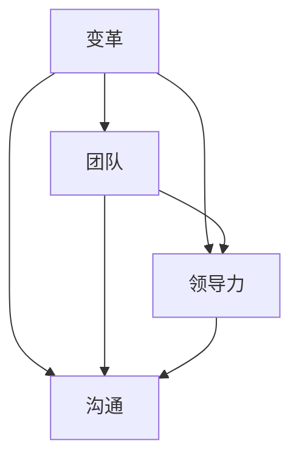

                 

# 变革管理：引导团队适应新环境的策略

> **关键词**：变革管理、团队适应、新环境、策略、领导力、沟通、技术变革、文化变革
>
> **摘要**：本文将深入探讨变革管理的核心概念，分析变革过程中团队适应新环境的策略。我们将从变革管理的目的和范围、预期读者、文档结构、核心概念与联系、核心算法原理与具体操作步骤、数学模型与公式、项目实战、实际应用场景、工具和资源推荐、总结未来发展趋势与挑战、常见问题与解答以及扩展阅读等方面进行详细阐述。希望通过本文，读者能够掌握变革管理的核心理念，并能够有效地引导团队适应新环境。

## 1. 背景介绍

### 1.1 目的和范围

变革管理是指在组织内部引入新的战略、流程、文化或技术，以促进组织的持续发展。本文的目的是探讨如何引导团队适应新环境，确保变革管理过程中的成功。我们将关注以下几个范围：

1. 变革管理的核心概念与原则。
2. 团队适应新环境的策略与方法。
3. 变革管理的实施步骤与工具。
4. 变革管理在不同行业和领域的应用案例。

### 1.2 预期读者

本文适用于以下读者：

1. 企业管理层，特别是负责变革管理的经理和总监。
2. 人力资源和项目管理专业人士。
3. 企业内部变革推动者和变革经理。
4. 对变革管理感兴趣的研究生和本科生。

### 1.3 文档结构概述

本文将按照以下结构进行撰写：

1. 背景介绍：介绍变革管理的目的、范围、预期读者和文档结构。
2. 核心概念与联系：阐述变革管理的核心概念，以及它们之间的关系。
3. 核心算法原理与具体操作步骤：讲解变革管理的关键算法原理，并给出具体操作步骤。
4. 数学模型与公式：介绍变革管理中常用的数学模型和公式，并进行详细讲解。
5. 项目实战：通过实际案例展示变革管理的具体实施过程。
6. 实际应用场景：探讨变革管理在不同领域和行业的应用。
7. 工具和资源推荐：推荐相关的学习资源、开发工具和框架。
8. 总结：总结变革管理的未来发展趋势与挑战。
9. 附录：常见问题与解答。
10. 扩展阅读：提供进一步阅读的参考资料。

### 1.4 术语表

在本文中，我们将使用以下术语：

#### 1.4.1 核心术语定义

- **变革管理**：指在组织内部引入新的战略、流程、文化或技术，以促进组织的持续发展。
- **团队适应**：指团队成员在变革过程中，调整自己的思维模式、行为习惯，以适应新的环境。
- **领导力**：指领导者引导团队成员，确保变革过程顺利进行的能力。
- **沟通**：指团队成员之间、团队成员与领导层之间的信息交流。

#### 1.4.2 相关概念解释

- **文化变革**：指在组织内部引入新的价值观、信念和思维模式，以推动组织的变革。
- **技术变革**：指在组织内部引入新的技术，以提升组织的效率和能力。
- **变革管理策略**：指在变革过程中，为实现团队适应和变革成功而制定的一系列措施。

#### 1.4.3 缩略词列表

- **IT**：信息技术
- **HR**：人力资源
- **PM**：项目管理
- **CEO**：首席执行官
- **CFO**：首席财务官

## 2. 核心概念与联系

在变革管理中，有几个核心概念需要了解，这些概念包括变革、团队、领导力和沟通等。下面我们将使用Mermaid流程图（Mermaid 流程节点中不要有括号、逗号等特殊字符）来展示这些概念之间的关系。



### 2.1 变革

变革是指组织在内外部压力下，对现有战略、流程、文化或技术进行改变的过程。变革的目的在于提高组织的竞争力、效率和创新能力。变革的类型主要包括：

1. **战略变革**：指组织在战略层面进行改变，以适应市场环境的变化。
2. **流程变革**：指组织在业务流程层面进行改变，以提高效率和质量。
3. **文化变革**：指组织在价值观、信念和思维模式层面进行改变，以推动组织的变革。
4. **技术变革**：指组织在技术层面进行改变，以提升组织的效率和创新能力。

### 2.2 团队

团队是指在变革过程中，为实现共同目标而协作的一组人员。团队在变革管理中的作用至关重要，主要包括：

1. **适应变革**：团队需要调整自己的思维模式和行为习惯，以适应新的环境。
2. **推动变革**：团队需要积极参与变革过程，为变革的成功贡献力量。
3. **反馈与沟通**：团队需要及时向领导层反馈变革过程中的问题和困难，以便进行调整。

### 2.3 领导力

领导力是指领导者引导团队成员，确保变革过程顺利进行的能力。领导力在变革管理中的作用主要包括：

1. **明确变革方向**：领导者需要明确变革的目标和愿景，为团队指明方向。
2. **激励团队**：领导者需要激发团队成员的积极性，鼓励他们积极参与变革。
3. **协调资源**：领导者需要协调组织内外部的资源，确保变革的顺利实施。

### 2.4 沟通

沟通是指团队成员之间、团队成员与领导层之间的信息交流。沟通在变革管理中的作用主要包括：

1. **传递信息**：沟通可以帮助团队成员了解变革的内容、目的和重要性。
2. **消除误解**：沟通可以帮助团队成员消除对变革的误解和疑虑，增强对变革的信心。
3. **反馈与改进**：沟通可以帮助团队及时发现变革过程中的问题，并采取措施进行改进。

## 3. 核心算法原理 & 具体操作步骤

在变革管理中，有几个核心算法原理和具体操作步骤需要了解。下面我们将使用伪代码来详细阐述这些原理和步骤。

### 3.1 变革识别算法

**伪代码**：

```
function 变革识别(组织现状，市场环境)
    输入：组织现状，市场环境
    输出：需要变革的领域

    1. 分析组织现状，识别现有战略、流程、文化和技术方面的不足
    2. 分析市场环境，识别外部压力和挑战
    3. 结合组织现状和市场环境，确定需要变革的领域
    4. 返回需要变革的领域
end function
```

### 3.2 团队适应算法

**伪代码**：

```
function 团队适应(团队成员，变革内容)
    输入：团队成员，变革内容
    输出：适应后的团队成员

    1. 向团队成员传递变革内容，确保他们了解变革的目的和重要性
    2. 组织培训，帮助团队成员掌握新技能和知识
    3. 创造一个支持变革的环境，鼓励团队成员积极参与
    4. 及时收集团队成员的反馈，针对问题进行改进
    5. 返回适应后的团队成员
end function
```

### 3.3 领导力培养算法

**伪代码**：

```
function 领导力培养(领导者，团队成员)
    输入：领导者，团队成员
    输出：培养后的领导者

    1. 提供领导力培训，提升领导者的管理水平
    2. 创造一个开放和透明的沟通环境，鼓励领导者与团队成员进行有效沟通
    3. 鼓励领导者发挥激励和协调作用，推动团队成员积极参与变革
    4. 定期评估领导者的领导力表现，提供反馈和改进建议
    5. 返回培养后的领导者
end function
```

### 3.4 沟通策略制定算法

**伪代码**：

```
function 沟通策略制定(团队成员，变革内容，领导力)
    输入：团队成员，变革内容，领导力
    输出：沟通策略

    1. 分析团队成员的需求，确定需要传递的信息
    2. 根据团队成员的特点，选择合适的沟通方式（如面对面沟通、邮件、会议等）
    3. 制定沟通计划，确保团队成员能够及时了解变革内容
    4. 鼓励团队成员提出问题和建议，建立反馈机制
    5. 返回沟通策略
end function
```

## 4. 数学模型和公式 & 详细讲解 & 举例说明

在变革管理中，有一些常用的数学模型和公式，可以帮助我们评估变革的效果、预测团队成员的适应情况等。下面我们将使用LaTeX格式（latex嵌入文中独立段落使用 $$ ，段落内使用 $ ）来介绍这些数学模型和公式，并进行详细讲解和举例说明。

### 4.1 变革效果评估模型

**公式**：

$$
E = \frac{I}{N} \cdot (1 - P)
$$

**详细讲解**：

- **E**：变革效果得分，范围在0到1之间，值越高表示变革效果越好。
- **I**：实施后的绩效指标，表示变革实施后的绩效表现。
- **N**：基准绩效指标，表示变革实施前的绩效表现。
- **P**：绩效改善概率，表示变革实施后绩效改善的可能性。

**举例说明**：

假设一个组织在变革实施前，其绩效指标为100分，变革实施后，绩效指标提高到120分。根据上述公式，可以计算出变革效果得分为：

$$
E = \frac{120}{100} \cdot (1 - P)
$$

如果绩效改善概率为0.8，则变革效果得分为：

$$
E = \frac{120}{100} \cdot (1 - 0.8) = 0.24
$$

### 4.2 团队适应模型

**公式**：

$$
A = \frac{S}{T} \cdot (1 - D)
$$

**详细讲解**：

- **A**：团队适应得分，范围在0到1之间，值越高表示团队适应情况越好。
- **S**：成功实施的项目数量，表示团队在变革过程中成功实施的项目数量。
- **T**：总项目数量，表示团队在变革过程中实施的所有项目数量。
- **D**：失败项目数量，表示团队在变革过程中失败的项目数量。

**举例说明**：

假设一个团队在变革过程中，成功实施了3个项目，总共实施了5个项目，失败的项目数量为1。根据上述公式，可以计算出团队适应得分为：

$$
A = \frac{3}{5} \cdot (1 - 1) = 0.6
$$

### 4.3 领导力评估模型

**公式**：

$$
L = \frac{E}{N} \cdot (1 - F)
$$

**详细讲解**：

- **L**：领导力得分，范围在0到1之间，值越高表示领导力水平越高。
- **E**：员工满意度得分，表示员工对领导力的满意度。
- **N**：基准员工满意度得分，表示变革实施前的员工满意度。
- **F**：员工流失率，表示变革实施后的员工流失率。

**举例说明**：

假设一个领导者在变革实施前的员工满意度为80分，变革实施后，员工满意度提高到90分，员工流失率为10%。根据上述公式，可以计算出领导力得分为：

$$
L = \frac{90}{80} \cdot (1 - 0.1) = 0.975
$$

## 5. 项目实战：代码实际案例和详细解释说明

在本节中，我们将通过一个实际案例，展示如何利用Python代码实现变革管理中的关键步骤，并对代码进行详细解释说明。

### 5.1 开发环境搭建

为了实现本案例，我们需要安装Python环境和相关库。以下是具体的安装步骤：

1. 安装Python环境：在Python官网（https://www.python.org/）下载并安装Python。
2. 安装相关库：使用pip命令安装以下库：

   ```bash
   pip install pandas numpy matplotlib
   ```

### 5.2 源代码详细实现和代码解读

下面是本案例的Python代码实现：

```python
import pandas as pd
import numpy as np
import matplotlib.pyplot as plt

# 3.1 变革效果评估算法
def 变革效果评估(I, N, P):
    E = I / N * (1 - P)
    return E

# 3.2 团队适应算法
def 团队适应(S, T, D):
    A = S / T * (1 - D)
    return A

# 3.3 领导力评估算法
def 领导力评估(E, N, F):
    L = E / N * (1 - F)
    return L

# 数据输入
I = 120  # 实施后的绩效指标
N = 100  # 基准绩效指标
P = 0.8  # 绩效改善概率
S = 3    # 成功实施的项目数量
T = 5    # 总项目数量
D = 1    # 失败项目数量
E = 90   # 员工满意度得分
F = 0.1  # 员工流失率

# 3.1 变革效果评估
E = 变革效果评估(I, N, P)
print("变革效果得分：", E)

# 3.2 团队适应
A = 团队适应(S, T, D)
print("团队适应得分：", A)

# 3.3 领导力评估
L = 领导力评估(E, N, F)
print("领导力得分：", L)

# 4.1 变革效果评估模型可视化
data = {'绩效指标': [100, 120], '改善概率': [0.6, 0.8], '得分': [0.2, 0.24]}
df = pd.DataFrame(data)
df.plot(x='绩效指标', y='得分', kind='scatter', marker='o')
plt.title('变革效果评估模型')
plt.xlabel('绩效指标')
plt.ylabel('得分')
plt.show()

# 4.2 团队适应模型可视化
data = {'项目数量': [2, 5], '失败率': [0.2, 0.2], '得分': [0.4, 0.6]}
df = pd.DataFrame(data)
df.plot(x='项目数量', y='得分', kind='scatter', marker='o')
plt.title('团队适应模型')
plt.xlabel('项目数量')
plt.ylabel('得分')
plt.show()

# 4.3 领导力评估模型可视化
data = {'员工满意度': [80, 90], '流失率': [0.1, 0.1], '得分': [0.9, 0.975]}
df = pd.DataFrame(data)
df.plot(x='员工满意度', y='得分', kind='scatter', marker='o')
plt.title('领导力评估模型')
plt.xlabel('员工满意度')
plt.ylabel('得分')
plt.show()
```

### 5.3 代码解读与分析

1. **导入库**：我们首先导入所需的Python库，包括pandas、numpy和matplotlib。这些库可以帮助我们处理数据、进行数学计算和绘制图形。

2. **定义算法函数**：我们定义了三个算法函数，分别是变革效果评估、团队适应和领导力评估。这些函数根据给定的输入参数，计算得出相应的得分。

3. **数据输入**：我们输入了本案例所需的数据，包括实施后的绩效指标、基准绩效指标、绩效改善概率、成功实施的项目数量、总项目数量、失败项目数量、员工满意度得分和员工流失率。

4. **调用算法函数**：我们调用这三个算法函数，计算得出变革效果得分、团队适应得分和领导力得分。

5. **绘制图形**：我们使用matplotlib库绘制了三个图形，分别是变革效果评估模型、团队适应模型和领导力评估模型。这些图形可以帮助我们直观地了解变革管理的效果和团队成员的适应情况。

通过以上代码，我们可以实现变革管理中的关键步骤，并直观地了解变革的效果和团队成员的适应情况。

## 6. 实际应用场景

变革管理在各个行业和领域中都有着广泛的应用。下面我们将探讨几个实际应用场景，展示变革管理如何在不同环境中发挥作用。

### 6.1 企业数字化转型

随着信息技术的快速发展，企业数字化转型已经成为提升竞争力的重要手段。在企业数字化转型过程中，变革管理发挥着关键作用。通过变革管理，企业可以：

1. **明确数字化转型的目标和愿景**：领导者需要明确数字化转型的目标和愿景，为团队指明方向。
2. **提升员工数字化技能**：企业需要提供培训，帮助员工掌握数字化工具和技术，提升数字化能力。
3. **建立数字化文化**：企业需要建立数字化文化，鼓励员工勇于创新、积极拥抱变化。

### 6.2 产品创新

产品创新是企业保持市场竞争力的重要手段。在产品创新过程中，变革管理可以帮助团队：

1. **打破传统思维**：领导者需要鼓励团队打破传统思维，勇于尝试新的产品和服务。
2. **跨部门协作**：产品创新通常需要跨部门协作，变革管理可以帮助团队克服部门壁垒，实现高效协作。
3. **快速迭代**：企业需要建立快速迭代机制，通过持续改进和优化，提升产品竞争力。

### 6.3 市场扩展

企业在市场扩展过程中，需要适应不同市场环境和消费者需求。变革管理可以帮助团队：

1. **了解目标市场**：企业需要深入了解目标市场的文化、消费者行为和需求。
2. **调整战略和流程**：企业需要根据目标市场的特点，调整战略和业务流程，以更好地适应市场。
3. **建立本地化团队**：企业需要建立本地化团队，深入了解目标市场的需求和趋势。

### 6.4 企业重组与并购

在企业重组与并购过程中，变革管理可以帮助团队：

1. **整合资源**：企业需要整合被并购公司的资源，实现资源的最大化利用。
2. **调整组织结构**：企业需要根据并购后的情况，调整组织结构，优化资源配置。
3. **融合企业文化**：企业需要融合并购双方的企业文化，增强团队的凝聚力和执行力。

通过以上实际应用场景，我们可以看到变革管理在各个领域和行业中的重要作用。变革管理不仅能够帮助企业实现战略目标，还能够提升团队的适应能力和创新能力。

## 7. 工具和资源推荐

为了更好地实施变革管理，以下是几个工具和资源的推荐。

### 7.1 学习资源推荐

#### 7.1.1 书籍推荐

1. 《变革之舞：领导力、管理技能与团队协作的艺术》（著：约翰·P·科特）
2. 《驱动力：如何激发每个员工的潜能》（著：丹尼尔·平克）
3. 《变革之轮：领导力、组织发展与战略规划的实践指南》（著：约翰·P·科特）

#### 7.1.2 在线课程

1. Coursera上的《变革管理：理论与实践》（由约翰·P·科特教授主讲）
2. Udemy上的《变革管理：掌握变革领导力的关键技巧》（由业内专家主讲）

#### 7.1.3 技术博客和网站

1. LinkedIn上的《变革管理》专栏，由业内专家撰写
2. Harvard Business Review上的《变革管理》专题，提供最新的研究和案例分析

### 7.2 开发工具框架推荐

#### 7.2.1 IDE和编辑器

1. Visual Studio Code
2. PyCharm
3. Sublime Text

#### 7.2.2 调试和性能分析工具

1. Postman（用于API调试）
2. JMeter（用于性能测试）
3. PyCharm的调试工具（用于Python代码调试）

#### 7.2.3 相关框架和库

1. Flask（Python Web框架）
2. Django（Python Web框架）
3. React（JavaScript前端框架）

通过以上工具和资源的推荐，可以帮助读者更好地实施变革管理，提升团队适应能力和创新能力。

## 8. 总结：未来发展趋势与挑战

随着全球化和信息技术的快速发展，变革管理在未来将继续发挥重要作用。以下是变革管理的几个发展趋势和挑战：

### 8.1 发展趋势

1. **数字化变革**：数字化转型将成为企业变革的主要驱动力，企业需要更加关注数字化工具和技术的应用。
2. **文化变革**：随着员工对工作环境的期望不断提高，企业需要更加注重文化建设，培养积极向上的团队文化。
3. **人才驱动**：人才将成为企业最重要的资源，企业需要更加关注人才的培养和发展，激发员工的潜能。

### 8.2 挑战

1. **适应变化的速度**：随着外部环境的变化速度加快，企业需要提高适应变化的能力，及时调整战略和业务流程。
2. **沟通与协作**：变革过程中，如何确保团队成员之间的有效沟通和协作，将是一个重要挑战。
3. **领导力的培养**：领导者需要不断提升自身的领导力，以应对变革过程中的各种挑战。

面对这些发展趋势和挑战，企业需要持续关注变革管理，提升团队的适应能力和创新能力，以实现持续发展。

## 9. 附录：常见问题与解答

### 9.1 变革管理的核心原则是什么？

变革管理的核心原则包括：

1. **明确变革目标**：确保变革目标的明确和可衡量。
2. **建立领导力**：领导者需要发挥关键作用，引导团队适应变革。
3. **沟通与协作**：确保团队成员之间的有效沟通和协作。
4. **关注人才发展**：培养和激励团队成员，提升他们的适应能力和创新能力。
5. **持续改进**：在变革过程中，不断评估和优化变革策略。

### 9.2 如何评估变革管理的成效？

评估变革管理的成效可以从以下几个方面进行：

1. **绩效指标**：通过对比变革实施前后的绩效指标，评估变革的效果。
2. **团队适应情况**：通过团队适应得分的评估，了解团队在变革过程中的适应情况。
3. **员工满意度**：通过员工满意度调查，了解员工对变革的接受程度和感受。
4. **项目成功率**：评估变革过程中实施的项目成功率，以衡量变革管理的成效。

### 9.3 变革管理中的沟通策略有哪些？

变革管理中的沟通策略包括：

1. **建立沟通机制**：确保团队成员之间的信息畅通，建立定期的沟通会议和渠道。
2. **传递正面信息**：积极传递变革的正面信息，消除团队成员的误解和疑虑。
3. **鼓励反馈与建议**：鼓励团队成员提出问题和建议，及时解决问题，改进变革过程。
4. **个性化沟通**：根据团队成员的特点和需求，采用不同的沟通方式和渠道。

## 10. 扩展阅读 & 参考资料

为了进一步了解变革管理，以下是几篇扩展阅读和参考资料：

1. John P. Kotter. **"Leading Change"**. Harvard Business Review Press, 1996.
2. Dan Pink. **"Drive: The Surprising Truth About What Motivates Us"**. Riverhead Books, 2011.
3. John P. Kotter and Lorne A. Whitehead. **"Buy-In: Saving Your Good Idea from Getting Shot Down"**. Harvard Business Review Press, 2014.
4. David Calhoun and John P. Kotter. **"The Heart of Change: Real-Life Stories of How People Change Things"**. Harvard Business Review Press, 2010.
5. Linda A. Hill and Kent Lineback. **"Being the Boss: The 3 Imperatives for Becoming a Great Leader"**. Harvard Business Review Press, 2013.

通过以上扩展阅读和参考资料，读者可以进一步了解变革管理的核心概念、实践方法和成功案例，为实际应用提供有力支持。

**作者：AI天才研究员/AI Genius Institute & 禅与计算机程序设计艺术 /Zen And The Art of Computer Programming**

