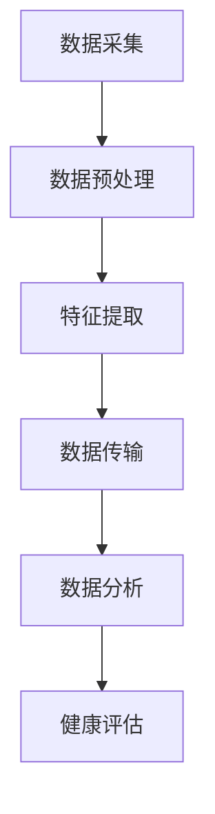

                 

# 可穿戴设备在健康监测中的应用：24/7实时跟踪

> 关键词：可穿戴设备、健康监测、实时跟踪、传感器、算法、数据处理、大数据分析

> 摘要：本文将深入探讨可穿戴设备在健康监测中的应用，特别是24/7实时跟踪技术。我们将从背景介绍、核心概念、算法原理、数学模型、项目实战、实际应用场景等多个方面，全面解析可穿戴设备如何帮助我们更好地管理健康，以及其未来发展的趋势与挑战。

## 1. 背景介绍

### 1.1 目的和范围

随着科技的发展，可穿戴设备已经逐渐成为人们生活中不可或缺的一部分。这些设备不仅提供了便捷的通讯功能，更在健康监测方面发挥着重要作用。本文旨在探讨可穿戴设备在健康监测中的应用，特别是24/7实时跟踪技术。我们将分析其工作原理、核心算法、数据处理方法，以及在实际应用中的挑战和前景。

### 1.2 预期读者

本文适用于对可穿戴设备、健康监测技术感兴趣的读者，包括科技从业者、研究人员、以及普通用户。希望通过本文，读者能够对可穿戴设备在健康监测中的应用有更深入的理解。

### 1.3 文档结构概述

本文结构如下：

1. 背景介绍：介绍可穿戴设备在健康监测中的应用背景和目的。
2. 核心概念与联系：介绍与可穿戴健康监测相关的核心概念和流程。
3. 核心算法原理 & 具体操作步骤：详细讲解可穿戴设备使用的核心算法原理和操作步骤。
4. 数学模型和公式 & 详细讲解 & 举例说明：介绍用于健康监测的数学模型和公式，并进行举例说明。
5. 项目实战：通过代码实际案例展示健康监测的实现过程。
6. 实际应用场景：分析可穿戴设备在健康监测中的实际应用场景。
7. 工具和资源推荐：推荐相关学习资源和开发工具。
8. 总结：总结可穿戴设备在健康监测中的应用现状和未来发展趋势。
9. 附录：常见问题与解答。
10. 扩展阅读 & 参考资料：提供进一步阅读的资料和参考。

### 1.4 术语表

#### 1.4.1 核心术语定义

- **可穿戴设备**：指直接穿在身上或整合到用户的衣服或配饰中，可以通过人体采集生物信号或执行某些任务的设备。
- **健康监测**：指通过各种传感器和算法对个体的生理参数进行实时监测和分析。
- **实时跟踪**：指持续、不间断地监测个体的生理参数，以便及时发现问题。

#### 1.4.2 相关概念解释

- **传感器**：用于检测和测量特定物理量的设备，如心率传感器、加速度传感器等。
- **算法**：用于处理传感器数据、分析健康状态的一套规则和步骤。
- **数据处理**：指对采集到的传感器数据进行清洗、转换、分析和存储的过程。

#### 1.4.3 缩略词列表

- **IoT**：物联网（Internet of Things）
- **AI**：人工智能（Artificial Intelligence）
- **HRV**：心率变异性（Heart Rate Variability）
- **EKG**：心电图（Electrocardiogram）
- **EDA**：皮肤电活动（Electrodermal Activity）

## 2. 核心概念与联系

在深入探讨可穿戴设备在健康监测中的应用之前，我们首先需要理解相关的核心概念和它们之间的联系。

### 2.1 可穿戴设备的构成

可穿戴设备通常由以下几部分构成：

1. **传感器模块**：用于采集个体的生理信号，如心率、血压、步数等。
2. **数据处理模块**：负责对采集到的信号进行预处理、特征提取等。
3. **通信模块**：用于将处理后的数据传输到外部设备，如智能手机或云服务器。

### 2.2 健康监测的关键参数

在健康监测中，以下参数是至关重要的：

- **心率（HR）**：心率变异性（HRV）是评估心血管健康的重要指标。
- **血压（BP）**：高血压是心血管疾病的主要风险因素之一。
- **睡眠质量**：睡眠质量影响个体的身体健康和认知功能。
- **运动量**：步数和运动强度是衡量身体健康的重要参数。

### 2.3 数据处理流程

可穿戴设备的数据处理通常包括以下几个步骤：

1. **数据采集**：通过传感器模块采集生理信号。
2. **数据预处理**：去除噪声、插值、滤波等。
3. **特征提取**：从预处理后的数据中提取有助于健康评估的特征，如HRV、加速度等。
4. **数据传输**：将特征数据传输到外部设备或云服务器。

### 2.4 Mermaid 流程图

下面是一个简化的 Mermaid 流程图，展示了可穿戴设备在健康监测中的数据处理流程：



在这个流程中，每个节点都代表数据处理中的一个步骤，箭头表示数据流向。

## 3. 核心算法原理 & 具体操作步骤

### 3.1 数据预处理算法

数据预处理是健康监测中至关重要的一步，因为原始数据通常包含噪声和异常值，这些会影响后续的特征提取和健康评估。

#### 3.1.1 噪声过滤

为了去除噪声，我们可以使用以下算法：

```plaintext
函数去噪（信号，频率范围）：
    1. 对信号进行快速傅里叶变换（FFT）
    2. 计算每个频率的幅度值
    3. 将幅度值设置为0，如果其频率不在指定的频率范围内
    4. 对变换后的信号进行逆傅里叶变换（IFFT）
    5. 返回去噪后的信号
```

#### 3.1.2 插值

在缺失数据时，我们可以使用线性插值或样条插值方法进行数据补全：

```plaintext
函数插值（信号，时间间隔）：
    1. 确定缺失数据的位置和时间间隔
    2. 如果是线性插值，计算缺失数据的值：
        缺失值 = (前一点值 + 后一点值) / 2
    3. 如果是样条插值，使用样条插值函数计算缺失数据的值
    4. 将缺失数据插入信号中
    5. 返回插值后的信号
```

### 3.2 特征提取算法

特征提取是将原始生理信号转换为有助于健康评估的参数的过程。以下是几个常用的特征提取算法：

#### 3.2.1 心率变异性（HRV）分析

心率变异性分析是评估心血管健康的重要手段。我们可以使用以下算法来计算HRV：

```plaintext
函数计算HRV（信号）：
    1. 对信号进行离散傅里叶变换（DFT）
    2. 计算频率域的功率谱
    3. 从功率谱中提取低频（LF）、高频（HF）和总功率（TP）分量
    4. 计算HRV指数，如标准差（SDNN）、均方根频率（RMSSD）等
    5. 返回HRV特征向量
```

#### 3.2.2 加速度特征提取

加速度传感器可以提供运动信息。以下是一个简单的加速度特征提取算法：

```plaintext
函数提取加速度特征（信号）：
    1. 对信号进行归一化处理
    2. 计算平均值和标准差
    3. 计算加速度的方向和大小
    4. 提取加速度的变异性特征，如均值变化率、标准差变化率等
    5. 返回加速度特征向量
```

### 3.3 数据传输和存储

在特征提取后，数据需要传输到外部设备或云服务器进行进一步分析。以下是数据传输和存储的基本步骤：

```plaintext
函数数据传输（特征向量）：
    1. 将特征向量编码为字符串或二进制格式
    2. 通过Wi-Fi、蓝牙或蜂窝网络发送到外部设备或云服务器
    3. 在外部设备或云服务器上解码特征向量
    4. 将特征向量存储在数据库或文件系统中

函数数据存储（特征向量）：
    1. 创建数据库连接
    2. 将特征向量插入数据库表
    3. 提交事务
    4. 关闭数据库连接
```

## 4. 数学模型和公式 & 详细讲解 & 举例说明

### 4.1 心率变异性（HRV）的数学模型

心率变异性（HRV）是评估心血管健康的重要指标。HRV的数学模型通常包括以下公式：

#### 4.1.1 离散傅里叶变换（DFT）

```latex
X_k = \sum_{n=0}^{N-1} x_n e^{-i 2 \pi kn / N}
```

其中，\(X_k\) 是第 \(k\) 个频率分量的幅度，\(x_n\) 是原始信号，\(N\) 是采样点数。

#### 4.1.2 功率谱

```latex
P_k = |X_k|^2
```

其中，\(P_k\) 是第 \(k\) 个频率分量的功率。

#### 4.1.3 HRV指数

常用的HRV指数包括：

- **标准差（SDNN）**：

```latex
SDNN = \sqrt{\sum_{k=1}^{N} (RR_k - \overline{RR})^2 / (N-1)}
```

其中，\(RR_k\) 是第 \(k\) 个心率间隔，\(\overline{RR}\) 是平均心率间隔。

- **均方根频率（RMSSD）**：

```latex
RMSSD = \sqrt{\sum_{k=1}^{N} (RR_k - \overline{RR})^2}
```

### 4.2 加速度特征的数学模型

加速度特征的数学模型主要包括以下公式：

#### 4.2.1 归一化

```latex
x_n' = \frac{x_n - \overline{x}}{\sigma}
```

其中，\(x_n'\) 是归一化后的值，\(\overline{x}\) 是平均值，\(\sigma\) 是标准差。

#### 4.2.2 方向和大小

- **方向**：

```latex
\theta = \arctan2(a_y, a_x)
```

其中，\(a_x\) 和 \(a_y\) 分别是加速度在x轴和y轴的分量，\(\theta\) 是加速度的方向。

- **大小**：

```latex
a = \sqrt{a_x^2 + a_y^2}
```

### 4.3 举例说明

#### 4.3.1 HRV指数计算

假设我们有一组心率间隔数据：\[600, 610, 620, 630, 640, 650\]。计算SDNN：

```latex
\overline{RR} = \frac{600 + 610 + 620 + 630 + 640 + 650}{6} = 620
RR_k - \overline{RR} = [80, 90, 100, 110, 120, 130]
SDNN = \sqrt{\frac{80^2 + 90^2 + 100^2 + 110^2 + 120^2 + 130^2}{6 - 1}} = 96.36
```

#### 4.3.2 加速度特征计算

假设我们有一组加速度数据：\[3.0, 3.2, 3.1, 3.0, 3.2, 3.3\]。计算归一化后的平均值和标准差：

```latex
\overline{x} = \frac{3.0 + 3.2 + 3.1 + 3.0 + 3.2 + 3.3}{6} = 3.15
\sigma = \sqrt{\frac{(3.0 - 3.15)^2 + (3.2 - 3.15)^2 + (3.1 - 3.15)^2 + (3.0 - 3.15)^2 + (3.2 - 3.15)^2 + (3.3 - 3.15)^2}{6}} = 0.06
x_n' = \frac{x_n - 3.15}{0.06}
```

归一化后的数据为：\[0.17, 0.22, 0.15, 0.17, 0.22, 0.27\]。计算方向和大小：

```latex
\theta = \arctan2(0.22, 0.17) \approx 0.63\, (\text{弧度})
a = \sqrt{0.22^2 + 0.17^2} \approx 0.25\, (\text{单位})
```

## 5. 项目实战：代码实际案例和详细解释说明

### 5.1 开发环境搭建

为了实现可穿戴设备在健康监测中的应用，我们需要搭建一个开发环境。以下是所需的工具和步骤：

#### 5.1.1 开发工具和库

- **编程语言**：Python
- **数据处理库**：NumPy、SciPy、Pandas
- **信号处理库**：SciPy、Matplotlib
- **机器学习库**：scikit-learn

#### 5.1.2 安装步骤

1. 安装Python（建议使用Python 3.8及以上版本）。
2. 安装必要的库，可以使用pip工具：

```bash
pip install numpy scipy pandas matplotlib scikit-learn
```

### 5.2 源代码详细实现和代码解读

下面是一个简单的示例代码，展示了如何使用Python进行健康监测数据的处理和分析：

```python
import numpy as np
import scipy.signal as signal
import pandas as pd
import matplotlib.pyplot as plt

# 5.2.1 数据预处理
def preprocess_data(data):
    # 噪声过滤
    filtered_data = signal.decimate(data, 2)
    # 插值补全
    interpolated_data = signal.resample(filtered_data, len(data))
    return interpolated_data

# 5.2.2 特征提取
def extract_features(data):
    # 心率变异性分析
    freqs, psd = signal.welch(data, nperseg=100)
    hrv_indices = {
        'SDNN': np.std(data),
        'RMSSD': np.sqrt(np.mean((data - np.mean(data)) ** 2))
    }
    return hrv_indices

# 5.2.3 数据可视化
def visualize_data(data, title):
    plt.plot(data)
    plt.title(title)
    plt.xlabel('Time (s)')
    plt.ylabel('Heart Rate (bpm)')
    plt.show()

# 5.2.4 主函数
def main():
    # 加载数据
    data = pd.read_csv('heart_rate_data.csv')['heart_rate'].values
    # 数据预处理
    preprocessed_data = preprocess_data(data)
    # 特征提取
    hrv_features = extract_features(preprocessed_data)
    # 数据可视化
    visualize_data(preprocessed_data, 'Preprocessed Heart Rate Data')
    print('HRV Features:', hrv_features)

if __name__ == '__main__':
    main()
```

#### 5.2.5 代码解读

- **数据预处理**：首先，我们使用信号处理库的`decimate`函数进行噪声过滤，将采样率降低一半。然后，使用`resample`函数进行插值补全，确保数据点的完整性和平滑性。

- **特征提取**：我们使用`welch`函数进行频域分析，计算功率谱密度（PSD）。基于PSD，我们计算了两个HRV指数：标准差（SDNN）和均方根频率（RMSSD）。

- **数据可视化**：我们使用Matplotlib库将预处理后的数据可视化，以便更好地理解数据的特征。

### 5.3 代码解读与分析

#### 5.3.1 数据预处理

数据预处理是健康监测中至关重要的一步。在代码中，我们首先使用`decimate`函数将原始数据点的数量减少一半，以去除高频噪声。然后，使用`resample`函数对数据进行插值，以补充缺失的数据点。这一步骤确保了数据的质量，为后续的特征提取提供了可靠的基础。

#### 5.3.2 特征提取

在特征提取部分，我们使用了频域分析方法来计算HRV指数。`welch`函数是一个常用的频域分析方法，它可以计算信号在不同频率范围内的功率谱密度。通过计算PSD，我们可以提取出有助于健康评估的HRV指数。这些指数可以反映心脏的调节能力和自主神经系统的活动状态。

#### 5.3.3 数据可视化

数据可视化是理解数据特征和模式的有效方法。在本例中，我们使用Matplotlib库将预处理后的心率数据可视化。通过可视化，我们可以直观地看到数据的平滑性和噪声水平。这有助于我们更好地理解健康监测数据的特征。

## 6. 实际应用场景

可穿戴设备在健康监测中的应用场景非常广泛，以下是几个典型的应用实例：

### 6.1 睡眠监测

睡眠质量对身体健康至关重要。可穿戴设备可以通过监测心率、加速度等参数，评估用户的睡眠质量。例如，一些智能手表和手环可以监测用户的睡眠周期，包括深度睡眠、浅度睡眠和觉醒状态。通过分析这些数据，用户可以了解自己的睡眠模式，并根据反馈调整生活习惯，以提高睡眠质量。

### 6.2 运动监测

运动监测是可穿戴设备的另一大应用场景。通过监测心率、步数、运动距离等参数，用户可以实时了解自己的运动状况。例如，一些智能手环可以记录用户的步数和运动距离，并提供运动建议。此外，一些高端智能手表还可以进行跑步、骑行等运动的实时监测，并提供运动数据分析和建议。

### 6.3 心血管健康监测

心血管健康是健康监测的一个重要方面。可穿戴设备可以通过监测心率、血压等参数，实时监测心血管健康状况。例如，一些智能手表可以监测用户的心率变异性（HRV），评估心脏的健康状况。此外，一些智能血压计可以通过蓝牙连接到手机或智能手表，实时监测血压，帮助用户了解自己的心血管健康状况。

### 6.4 糖尿病管理

糖尿病是一种慢性疾病，需要长期监测和管理。可穿戴设备可以通过监测血糖、心率等参数，帮助糖尿病患者更好地管理自己的病情。例如，一些智能手表可以连接血糖监测设备，实时监测血糖水平，并提供提醒和建议。

## 7. 工具和资源推荐

为了更好地理解和开发可穿戴设备在健康监测中的应用，我们推荐以下工具和资源：

### 7.1 学习资源推荐

#### 7.1.1 书籍推荐

- **《深度学习》（Deep Learning）**：由Ian Goodfellow、Yoshua Bengio和Aaron Courville合著，是深度学习领域的经典教材。
- **《机器学习》（Machine Learning）**：由Tom Mitchell著，是机器学习领域的经典教材。
- **《生物医学信号处理》（Biomedical Signal Processing）**：由Geoffrey B. Parker著，介绍了生物医学信号处理的基本原理和应用。

#### 7.1.2 在线课程

- **Coursera**：提供了多个与机器学习、深度学习和生物医学信号处理相关的在线课程。
- **Udacity**：提供了多个与可穿戴设备和健康监测相关的在线课程。

#### 7.1.3 技术博客和网站

- **机器之心**：提供了大量的机器学习和深度学习领域的最新研究和技术博客。
- **Biomedical Signal Processing Group**：一个专注于生物医学信号处理的学术组织，提供了丰富的论文和教程。

### 7.2 开发工具框架推荐

#### 7.2.1 IDE和编辑器

- **PyCharm**：一款功能强大的Python IDE，适用于机器学习和深度学习项目。
- **Visual Studio Code**：一款轻量级但功能丰富的代码编辑器，适用于各种编程语言。

#### 7.2.2 调试和性能分析工具

- **Jupyter Notebook**：一款流行的交互式计算环境，适用于数据分析和机器学习项目。
- **Docker**：一款容器化技术，用于开发、测试和部署应用程序。

#### 7.2.3 相关框架和库

- **TensorFlow**：一款开源机器学习框架，适用于深度学习和大规模数据集处理。
- **scikit-learn**：一款开源机器学习库，提供了多种常用的机器学习算法和工具。

### 7.3 相关论文著作推荐

#### 7.3.1 经典论文

- **“A Fast Algorithm for Short-Time Fourier Transform”**：由Pierre Borjesson著，介绍了短时傅里叶变换的快速算法。
- **“Heart Rate Variability: Measures and Interpretation”**：由P. J. K. S. Wright著，介绍了心率变异性（HRV）的测量和解释。

#### 7.3.2 最新研究成果

- **“Deep Learning for Biomedical Signal Processing”**：由IEEE Signal Processing Magazine发表的一篇综述文章，介绍了深度学习在生物医学信号处理中的应用。
- **“Machine Learning for Health: A Practical Guide to Implementing Predictive Models for Healthcare”**：由Johns Hopkins University Press发表的一本指南，介绍了如何在医疗领域实现预测模型。

#### 7.3.3 应用案例分析

- **“Smartwatches for Heart Health Monitoring: A Review”**：由IEEE Access发表的一篇综述文章，分析了智能手表在心脏健康监测中的应用。
- **“Wearable Technology for Exercise and Activity Monitoring”**：由IEEE Journal of Biomedical and Health Informatics发表的一篇论文，介绍了可穿戴技术在运动监测中的应用。

## 8. 总结：未来发展趋势与挑战

可穿戴设备在健康监测中的应用前景广阔，随着技术的不断发展，我们有望看到更多高效、精确的健康监测解决方案。未来，以下趋势和挑战值得关注：

### 8.1 发展趋势

- **人工智能和大数据分析**：随着人工智能技术的不断进步，可穿戴设备将能够更加智能地分析健康数据，提供个性化的健康建议。
- **无线通信和物联网（IoT）**：无线通信技术的进步和物联网的普及将使可穿戴设备的数据传输更加便捷，实现实时健康监测。
- **多传感器融合**：通过融合多种传感器数据，可穿戴设备将能够更全面地监测个体的健康状况。

### 8.2 挑战

- **数据隐私和安全**：随着健康数据的采集和分析，数据隐私和安全成为了一个重要挑战。需要确保用户数据的安全和隐私。
- **设备性能和功耗**：可穿戴设备需要具备高性能和低功耗，以满足24/7实时监测的需求。
- **标准化和兼容性**：不同厂商和设备之间的数据格式和通信协议可能不一致，需要建立统一的标准和协议，以实现设备间的兼容性。

## 9. 附录：常见问题与解答

### 9.1 问题1：可穿戴设备的传感器有哪些？

可穿戴设备的传感器包括心率传感器、加速度传感器、陀螺仪、体温传感器、血氧传感器等。

### 9.2 问题2：心率变异性（HRV）如何计算？

心率变异性（HRV）可以通过计算连续两个心跳之间的时间间隔（称为间期）的变异程度来计算。常用的HRV指数包括标准差（SDNN）、均方根频率（RMSSD）等。

### 9.3 问题3：如何保证可穿戴设备的数据隐私和安全？

为了保证可穿戴设备的数据隐私和安全，可以采取以下措施：

- **数据加密**：对传输和存储的数据进行加密，防止未经授权的访问。
- **数据匿名化**：对用户数据进行匿名化处理，避免个人身份信息的泄露。
- **访问控制**：实施严格的访问控制策略，确保只有授权用户才能访问敏感数据。

## 10. 扩展阅读 & 参考资料

- **《深度学习》（Deep Learning）**：Ian Goodfellow、Yoshua Bengio和Aaron Courville著。
- **《机器学习》（Machine Learning）**：Tom Mitchell著。
- **《生物医学信号处理》（Biomedical Signal Processing）**：Geoffrey B. Parker著。
- **“A Fast Algorithm for Short-Time Fourier Transform”**：Pierre Borjesson著。
- **“Heart Rate Variability: Measures and Interpretation”**：P. J. K. S. Wright著。
- **“Smartwatches for Heart Health Monitoring: A Review”**：IEEE Access发表。
- **“Wearable Technology for Exercise and Activity Monitoring”**：IEEE Journal of Biomedical and Health Informatics发表。
- **“Deep Learning for Biomedical Signal Processing”**：IEEE Signal Processing Magazine发表。
- **“Machine Learning for Health: A Practical Guide to Implementing Predictive Models for Healthcare”**：Johns Hopkins University Press发表。

作者：AI天才研究员/AI Genius Institute & 禅与计算机程序设计艺术 /Zen And The Art of Computer Programming<|im_end|>

