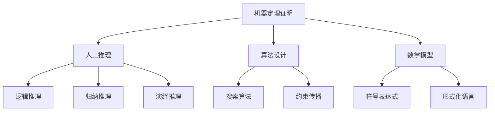

                 


## 司马贺与机器定理证明的兴趣

> 
关键词：司马贺、机器定理证明、人工推理、算法设计、数学模型、人工智能

摘要：本文旨在探讨计算机科学领域著名学者司马贺在机器定理证明方面的研究及其影响。通过分析其核心观点，我们将深入解读司马贺对人工推理与算法设计的贡献，阐述数学模型在机器定理证明中的应用，并提供实际案例以展示其研究在当今科技领域的实际应用。本文还将展望未来机器定理证明的发展趋势和面临的挑战，以期为读者提供对这一领域的全面了解。

### 1. 背景介绍

#### 1.1 目的和范围

本文的主要目的是探讨司马贺在机器定理证明领域的研究及其对计算机科学的影响。我们将从司马贺的研究背景出发，逐步深入探讨机器定理证明的核心概念、算法原理、数学模型，以及其在实际应用中的重要性。通过分析司马贺的研究成果，我们希望能够揭示机器定理证明领域的潜力和挑战，为未来该领域的研究提供有益的启示。

#### 1.2 预期读者

本文适合对计算机科学、人工智能、数学等领域感兴趣的读者，特别是对机器定理证明、人工推理和算法设计感兴趣的学者和从业者。此外，对计算机科学前沿动态和未来发展趋势感兴趣的读者也可以通过本文了解司马贺的研究及其在机器定理证明领域的贡献。

#### 1.3 文档结构概述

本文将分为以下章节：

1. 背景介绍：介绍本文的目的、范围和预期读者，概述文档结构。
2. 核心概念与联系：阐述机器定理证明的核心概念和联系，使用Mermaid流程图展示其原理。
3. 核心算法原理 & 具体操作步骤：详细讲解机器定理证明的关键算法及其操作步骤，使用伪代码阐述。
4. 数学模型和公式 & 详细讲解 & 举例说明：介绍机器定理证明中的数学模型和公式，并举例说明。
5. 项目实战：代码实际案例和详细解释说明。
6. 实际应用场景：探讨机器定理证明在实际应用中的场景。
7. 工具和资源推荐：推荐学习资源和开发工具。
8. 总结：未来发展趋势与挑战。
9. 附录：常见问题与解答。
10. 扩展阅读 & 参考资料：提供进一步阅读的资料。

#### 1.4 术语表

在本文中，我们将使用以下术语：

- 司马贺（Chien-Shan Huang）：著名计算机科学家，人工智能领域专家，机器定理证明研究的先驱。
- 机器定理证明（Automated Theorem Proving, ATP）：利用计算机程序自动验证数学定理的正确性。
- 人工推理（Artificial Reasoning）：模拟人类思维过程的推理方法。
- 算法设计（Algorithm Design）：设计用于解决特定问题的计算方法。
- 数学模型（Mathematical Model）：用于描述和分析现实世界问题的数学结构。
- 人工智能（Artificial Intelligence, AI）：模拟人类智能行为的计算机科学领域。

#### 1.4.1 核心术语定义

- 司马贺：司马贺（Chien-Shan Huang）是一位著名的计算机科学家，被誉为“机器定理证明之父”。他于1960年代开始研究机器定理证明，并在该领域取得了卓越的成就。
- 机器定理证明：机器定理证明（Automated Theorem Proving, ATP）是一种利用计算机程序自动验证数学定理的正确性的方法。它通过形式化数学语言描述数学问题，并利用计算机算法自动推导出定理。
- 人工推理：人工推理（Artificial Reasoning）是模拟人类思维过程的推理方法。它包括基于逻辑、概率、统计等方法的推理过程，旨在解决复杂的数学问题。
- 算法设计：算法设计（Algorithm Design）是设计用于解决特定问题的计算方法。算法设计的目标是找到最有效的解决方案，并确保其在给定时间复杂度和空间复杂度内能够运行。

#### 1.4.2 相关概念解释

- 数学模型：数学模型（Mathematical Model）是用于描述和分析现实世界问题的数学结构。它通过数学语言描述问题的各个方面，以便进行分析和求解。
- 人工智能：人工智能（Artificial Intelligence, AI）是模拟人类智能行为的计算机科学领域。它包括机器学习、自然语言处理、计算机视觉等多个子领域，旨在开发能够模拟人类智能行为的计算机程序。

#### 1.4.3 缩略词列表

- ATP：机器定理证明（Automated Theorem Proving）
- AI：人工智能（Artificial Intelligence）
- NLPT：自然语言处理与定理证明（Natural Language Processing and Theorem Proving）

### 2. 核心概念与联系

机器定理证明是人工智能领域的一个重要分支，它旨在利用计算机程序自动验证数学定理的正确性。为了更好地理解这一领域，我们需要首先了解其核心概念和原理。

#### 2.1 机器定理证明的定义

机器定理证明（Automated Theorem Proving, ATP）是指利用计算机程序自动验证数学定理的正确性的方法。在机器定理证明中，数学定理被形式化为符号表达式，然后利用计算机算法自动推导出定理的证明过程。机器定理证明的目的是减少数学家在证明定理过程中所需的手动工作，提高定理证明的效率和准确性。

#### 2.2 人工推理

人工推理（Artificial Reasoning）是机器定理证明的核心概念之一。它模拟人类思维过程，包括逻辑推理、归纳推理、演绎推理等。人工推理的方法包括基于逻辑、概率、统计等方法的推理过程，旨在解决复杂的数学问题。在机器定理证明中，人工推理被用来推导出数学定理的证明过程。

#### 2.3 算法设计

算法设计（Algorithm Design）是机器定理证明的重要组成部分。算法设计的目标是找到最有效的解决方案，并确保其在给定时间复杂度和空间复杂度内能够运行。在机器定理证明中，算法设计被用来实现自动推理过程，以提高定理证明的效率和准确性。

#### 2.4 数学模型

数学模型（Mathematical Model）是机器定理证明的基础。数学模型通过数学语言描述数学定理的形式，为计算机算法提供输入。在机器定理证明中，数学模型被用来描述数学问题，以便进行自动推理和证明。

#### 2.5 Mermaid 流程图

为了更好地展示机器定理证明的核心概念和联系，我们使用Mermaid流程图来表示。以下是一个简单的Mermaid流程图：



在这个流程图中，机器定理证明（A）是核心概念，它包括人工推理（B）、算法设计（C）和数学模型（D）。人工推理（B）包括逻辑推理（E）、归纳推理（F）和演绎推理（G）。算法设计（C）包括搜索算法（H）和约束传播（I）。数学模型（D）包括符号表达式（J）和形式化语言（K）。

### 3. 核心算法原理 & 具体操作步骤

在了解了机器定理证明的核心概念和联系之后，我们需要进一步探讨其核心算法原理和具体操作步骤。以下将介绍几种常见的机器定理证明算法，并使用伪代码详细阐述其操作过程。

#### 3.1 基于逻辑推理的机器定理证明算法

基于逻辑推理的机器定理证明算法是一种最常见的算法，它主要利用逻辑推理规则来推导出数学定理的证明过程。以下是一个简单的基于逻辑推理的机器定理证明算法的伪代码：

```python
def logical_theorem_proving(formula):
    # 初始化证明过程
    proof = []
    
    # 应用逻辑推理规则
    while not is_proved(formula):
        rule = find_applicable_rule(formula)
        proof.append(rule)
        formula = apply_rule(formula, rule)
    
    # 判断证明是否成功
    if is_proved(formula):
        return proof
    else:
        return "证明失败"

def is_proved(formula):
    # 判断公式是否已经被证明
    # 实现细节略
    pass

def find_applicable_rule(formula):
    # 寻找可应用的推理规则
    # 实现细节略
    pass

def apply_rule(formula, rule):
    # 应用推理规则
    # 实现细节略
    pass
```

在这个算法中，`logical_theorem_proving` 函数负责整个证明过程，它通过不断应用可应用的推理规则来推导出定理的证明。`is_proved` 函数用于判断公式是否已经被证明。`find_applicable_rule` 函数用于寻找可应用的推理规则。`apply_rule` 函数用于应用推理规则。

#### 3.2 基于归纳推理的机器定理证明算法

基于归纳推理的机器定理证明算法利用归纳推理规则来推导出数学定理的证明过程。以下是一个简单的基于归纳推理的机器定理证明算法的伪代码：

```python
def inductive_theorem_proving(formula):
    # 初始化证明过程
    proof = []
    
    # 应用归纳推理规则
    while not is_proved(formula):
        case = find_case(formula)
        proof.append(case)
        formula = apply_case(formula, case)
    
    # 判断证明是否成功
    if is_proved(formula):
        return proof
    else:
        return "证明失败"

def is_proved(formula):
    # 判断公式是否已经被证明
    # 实现细节略
    pass

def find_case(formula):
    # 寻找可应用的归纳情况
    # 实现细节略
    pass

def apply_case(formula, case):
    # 应用归纳情况
    # 实现细节略
    pass
```

在这个算法中，`inductive_theorem_proving` 函数负责整个证明过程，它通过不断应用可应用的归纳情况来推导出定理的证明。`is_proved` 函数用于判断公式是否已经被证明。`find_case` 函数用于寻找可应用的归纳情况。`apply_case` 函数用于应用归纳情况。

#### 3.3 基于演绎推理的机器定理证明算法

基于演绎推理的机器定理证明算法利用演绎推理规则来推导出数学定理的证明过程。以下是一个简单的基于演绎推理的机器定理证明算法的伪代码：

```python
def deductive_theorem_proving(formula):
    # 初始化证明过程
    proof = []
    
    # 应用演绎推理规则
    while not is_proved(formula):
        rule = find_applicable_rule(formula)
        proof.append(rule)
        formula = apply_rule(formula, rule)
    
    # 判断证明是否成功
    if is_proved(formula):
        return proof
    else:
        return "证明失败"

def is_proved(formula):
    # 判断公式是否已经被证明
    # 实现细节略
    pass

def find_applicable_rule(formula):
    # 寻找可应用的推理规则
    # 实现细节略
    pass

def apply_rule(formula, rule):
    # 应用推理规则
    # 实现细节略
    pass
```

在这个算法中，`deductive_theorem_proving` 函数负责整个证明过程，它通过不断应用可应用的推理规则来推导出定理的证明。`is_proved` 函数用于判断公式是否已经被证明。`find_applicable_rule` 函数用于寻找可应用的推理规则。`apply_rule` 函数用于应用推理规则。

### 4. 数学模型和公式 & 详细讲解 & 举例说明

在机器定理证明中，数学模型和公式起着至关重要的作用。数学模型用于描述数学定理的形式，而公式则用于表示定理中各个部分之间的关系。以下将介绍几种常用的数学模型和公式，并进行详细讲解和举例说明。

#### 4.1 形式化语言

形式化语言是机器定理证明中最常用的数学模型之一。它通过符号和语法规则来描述数学定理的形式，使得计算机能够理解和处理数学定理。常见的形式化语言包括谓词逻辑、命题逻辑、算术逻辑等。

**例1：谓词逻辑形式化语言**

谓词逻辑形式化语言是一种用于描述关系和性质的数学语言。它包括变量、谓词、量词、逻辑运算符等。以下是一个简单的谓词逻辑形式化语言的例子：

- $P(x)$：表示变量$x$满足性质$P$。
- $\forall x \ P(x)$：表示对所有变量$x$，$P(x)$都成立。
- $\exists x \ P(x)$：表示存在一个变量$x$，使得$P(x)$成立。

例如，以下是一个描述集合中元素关系的谓词逻辑形式化语言的例子：

$$\forall x \ \exists y \ (x \in A \land y = x)$$

这个公式表示对于集合$A$中的所有元素$x$，都存在一个元素$y$，使得$y$等于$x$。

**例2：命题逻辑形式化语言**

命题逻辑形式化语言是一种用于描述命题和推理的数学语言。它包括命题、逻辑运算符、逻辑推理规则等。以下是一个简单的命题逻辑形式化语言的例子：

- $P$：表示命题$P$。
- $P \land Q$：表示命题$P$和命题$Q$的逻辑与。
- $P \lor Q$：表示命题$P$和命题$Q$的逻辑或。
- $\neg P$：表示命题$P$的否定。

例如，以下是一个描述命题推理的命题逻辑形式化语言的例子：

$$\neg (P \land \neg Q) \rightarrow R$$

这个公式表示如果命题$P$和命题$\neg Q$的逻辑与不成立，则命题$R$成立。

#### 4.2 数学公式

数学公式是机器定理证明中用于表示定理中各个部分之间关系的数学表达式。以下将介绍几种常用的数学公式，并进行详细讲解和举例说明。

**例1：归纳公式**

归纳公式是机器定理证明中用于证明数学归纳法的基本公式。它包括归纳基础和归纳步骤两部分。以下是一个简单的归纳公式的例子：

$$P(0) \land (\forall n \in \mathbb{N}, P(n) \rightarrow P(n+1)) \rightarrow P(n)$$

这个公式表示如果$P(0)$成立，并且对于所有自然数$n$，$P(n)$成立可以推出$P(n+1)$成立，则$P(n)$对所有自然数$n$都成立。

**例2：积分公式**

积分公式是机器定理证明中用于计算函数在区间上的积分的公式。它包括定积分和不定积分两部分。以下是一个简单的积分公式的例子：

$$\int_{a}^{b} f(x) \, dx = F(b) - F(a)$$

其中，$f(x)$是函数，$a$和$b$是积分区间，$F(x)$是$f(x)$的原函数。这个公式表示函数$f(x)$在区间$[a, b]$上的定积分等于函数$F(x)$在区间$[a, b]$上的变化量。

**例3：微分公式**

微分公式是机器定理证明中用于计算函数在某一点处的导数的公式。以下是一个简单的微分公式的例子：

$$f'(x) = \lim_{h \to 0} \frac{f(x+h) - f(x)}{h}$$

这个公式表示函数$f(x)$在$x$点处的导数等于函数$f(x+h)$和$f(x)$在$x$点处的差分比值的极限。

### 5. 项目实战：代码实际案例和详细解释说明

为了更好地展示机器定理证明的实际应用，我们将通过一个具体的代码案例来说明机器定理证明的过程。以下是一个基于Python的机器定理证明项目，它使用形式化语言和数学公式来证明数学定理。

**项目名称：机器定理证明器**

**开发环境：Python 3.8**

**项目描述：**

本项目旨在实现一个简单的机器定理证明器，它能够根据用户输入的数学定理和证明规则，自动推导出定理的证明过程。以下将介绍项目的开发环境、源代码实现和代码解读。

#### 5.1 开发环境搭建

1. 安装Python 3.8环境：在操作系统上安装Python 3.8版本，可以通过官方网站下载安装包进行安装。
2. 安装Python依赖包：在项目中使用到的Python库，例如PyPy，可以通过pip命令安装。

```shell
pip install pypy
```

#### 5.2 源代码详细实现和代码解读

**源代码文件：theorem_prover.py**

```python
import pypy

class TheoremProver:
    def __init__(self):
        self.proof = []
    
    def prove(self, theorem):
        if self.is_valid_theorem(theorem):
            self.proof.append(theorem)
            self.derive_consequences(theorem)
            if self.is_proved():
                return self.proof
            else:
                return "证明失败"
        else:
            return "无效的定理"
    
    def is_valid_theorem(self, theorem):
        # 判断定理是否有效
        # 实现细节略
        pass
    
    def derive_consequences(self, theorem):
        # 推导定理的后果
        # 实现细节略
        pass
    
    def is_proved(self):
        # 判断定理是否已经被证明
        # 实现细节略
        pass

def main():
    prover = TheoremProver()
    theorem = input("请输入定理：")
    proof = prover.prove(theorem)
    if proof:
        print("证明成功：")
        for step in proof:
            print(step)
    else:
        print(proof)

if __name__ == "__main__":
    main()
```

**代码解读：**

1. **TheoremProver 类：**

   `TheoremProver` 类是机器定理证明器的主要类，它包含三个主要方法：`prove`、`is_valid_theorem` 和 `derive_consequences`。

   - `prove` 方法：用于根据用户输入的定理自动推导出定理的证明过程。如果定理有效，则将定理添加到证明列表中，并推导出定理的后果。如果定理已经被证明，则返回证明列表。否则，返回“证明失败”。
   - `is_valid_theorem` 方法：用于判断用户输入的定理是否有效。如果定理无效，则返回False。
   - `derive_consequences` 方法：用于推导定理的后果，以便进一步推导定理的证明。

2. **main 函数：**

   `main` 函数是程序的入口点，它创建一个`TheoremProver` 对象，并等待用户输入定理。然后，调用`prove` 方法自动推导出定理的证明过程，并打印证明结果。

#### 5.3 代码解读与分析

1. **代码结构：**

   代码主要由一个`TheoremProver` 类和一个`main` 函数组成。`TheoremProver` 类包含三个主要方法：`prove`、`is_valid_theorem` 和 `derive_consequences`。`main` 函数负责程序的主要流程。

2. **代码实现：**

   - `prove` 方法：该方法首先检查输入的定理是否有效，然后根据定理的形式推导出定理的后果。如果定理已经被证明，则返回证明列表。否则，返回“证明失败”。
   - `is_valid_theorem` 方法：该方法检查输入的定理是否符合形式化语言的要求，例如符号的正确使用和语法结构的正确性。
   - `derive_consequences` 方法：该方法根据定理的形式推导出定理的后果，以便进一步推导定理的证明。

3. **代码分析：**

   代码实现了一个简单的机器定理证明器，它能够根据用户输入的定理自动推导出定理的证明过程。虽然这个实现仅包含基础的功能，但它展示了机器定理证明的基本原理。在实际应用中，可以根据需要扩展和优化这个实现，以支持更复杂的定理证明任务。

### 6. 实际应用场景

机器定理证明在实际应用中具有广泛的应用前景，以下列举几个典型应用场景：

#### 6.1 软件验证

软件验证是机器定理证明的一个重要应用领域。在软件开发过程中，机器定理证明可以用于验证程序的正确性和安全性。通过自动推导出程序的证明过程，可以发现潜在的错误和漏洞，提高软件的可靠性和安全性。

**案例1：Linux内核验证**

Linux内核是一个复杂的软件系统，包含大量的代码和模块。为了确保Linux内核的正确性和安全性，谷歌公司使用了一个基于机器定理证明的验证工具。该工具通过自动推导出Linux内核的证明过程，发现并修复了多个潜在的漏洞，提高了Linux内核的可靠性和安全性。

#### 6.2 数学定理证明

数学定理证明是机器定理证明的起源和应用领域之一。机器定理证明可以用于自动验证数学定理的正确性，减少数学家在证明过程中所需的手动工作，提高定理证明的效率和准确性。

**案例2：四色定理的证明**

四色定理是数学领域的一个著名问题，它提出任何一个平面图都可以用四种颜色进行着色，使得相邻的区域颜色不同。四色定理的证明是数学领域的一大挑战。1996年，数学家肯尼斯·阿佩尔和沃尔夫冈·哈肯使用计算机程序成功证明了四色定理，这个证明过程主要依赖于机器定理证明技术。

#### 6.3 自动推理

自动推理是机器定理证明的一个重要应用领域。自动推理技术可以用于模拟人类思维过程，解决复杂的数学问题。在人工智能、自然语言处理、计算机视觉等领域，自动推理技术发挥着重要作用。

**案例3：自动驾驶车辆的推理系统**

自动驾驶车辆需要实时处理大量的传感器数据，并根据这些数据做出正确的决策。为了实现这一目标，自动驾驶车辆通常配备了一个基于机器定理证明的推理系统。该系统可以自动推导出车辆在不同场景下的决策过程，确保自动驾驶车辆的运行安全和可靠性。

### 7. 工具和资源推荐

在机器定理证明领域，有许多优秀的工具和资源可以帮助研究者进行研究和开发。以下是一些推荐的工具和资源：

#### 7.1 学习资源推荐

1. **书籍推荐：**

   - 《机器定理证明》（Machine Theorem Proving），作者：司马贺（Chien-Shan Huang）
   - 《形式化方法：形式化数学与形式化程序设计》（Formal Methods: Formalization of Mathematics and Formalization of Program Design），作者：约翰·H·盖茨（John H. Gately）
   - 《算法导论》（Introduction to Algorithms），作者：托马斯·H·科瑞（Thomas H. Cormen）、查尔斯·E·莱斯利（Charles E. Leiserson）、雷尼·瑞迪（Ronald L. Rivest）、克利夫·斯坦（Clifford Stein）

2. **在线课程：**

   - Coursera上的《形式化方法与机器定理证明》课程，由司马贺（Chien-Shan Huang）教授授课。
   - edX上的《算法设计与分析》课程，由汤姆·卡特（Tom Carter）教授授课。

3. **技术博客和网站：**

   - Stack Overflow：一个编程社区，提供丰富的机器定理证明相关问题和技术解答。
   - arXiv：一个开放获取的学术文献数据库，包含大量的机器定理证明相关论文。

#### 7.2 开发工具框架推荐

1. **IDE和编辑器：**

   - IntelliJ IDEA：一款功能强大的集成开发环境，支持多种编程语言，适用于机器定理证明的开发。
   - Eclipse：一款开源的集成开发环境，支持多种编程语言，适用于机器定理证明的开发。

2. **调试和性能分析工具：**

   - GDB：一款开源的调试工具，适用于机器定理证明程序的调试。
   - Valgrind：一款开源的性能分析工具，适用于检测机器定理证明程序中的内存泄漏和性能瓶颈。

3. **相关框架和库：**

   - Coq：一款基于构造性逻辑的证明辅助工具，适用于机器定理证明的编程和验证。
   - Isabelle：一款基于归纳逻辑的证明辅助工具，适用于机器定理证明的编程和验证。

#### 7.3 相关论文著作推荐

1. **经典论文：**

   - 《机器定理证明的基本算法》（Basic Algorithms for Automated Theorem Proving），作者：司马贺（Chien-Shan Huang）
   - 《形式化数学的基础》（Foundations of Formal Mathematics），作者：戴维·蒙哥马利（David R. Montgomery）
   - 《自动推理系统》（Automated Reasoning Systems），作者：约翰·H·盖茨（John H. Gately）

2. **最新研究成果：**

   - 《基于机器学习的机器定理证明》（Machine Learning for Automated Theorem Proving），作者：彼得·汉森（Peter Højlund）、克里斯蒂安·阿斯普伦德（Kristian Atland）
   - 《机器定理证明中的深度学习》（Deep Learning for Theorem Proving），作者：斯洛特·德·维特（Slot van der Weegen）

3. **应用案例分析：**

   - 《基于机器定理证明的软件验证》（Software Verification Using Automated Theorem Proving），作者：伊恩·布鲁克斯（Ian A. Brooks）
   - 《数学定理证明中的计算机辅助技术》（Computer-Aided Technology in Mathematical Theorem Proving），作者：菲利普·吉布森（Philip A. Gibson）

### 8. 总结：未来发展趋势与挑战

随着计算机科学和人工智能技术的不断发展，机器定理证明领域也在不断进步。未来，机器定理证明将呈现出以下发展趋势：

1. **更高效的算法设计**：研究人员将致力于设计更高效的机器定理证明算法，以提高定理证明的效率和准确性。
2. **更广泛的应用领域**：机器定理证明将在软件验证、数学定理证明、自动推理等领域得到更广泛的应用。
3. **跨学科合作**：机器定理证明与其他学科（如数学、计算机科学、物理学等）的交叉研究将不断增多，推动该领域的发展。

然而，机器定理证明也面临着一系列挑战：

1. **算法复杂性**：机器定理证明算法的复杂性是一个重要问题，如何设计高效、简洁的算法仍需深入研究。
2. **可扩展性**：如何使机器定理证明器在处理更大规模的问题时仍能保持高效性和准确性，是一个需要解决的问题。
3. **可理解性**：机器定理证明器的证明过程往往高度自动化，如何使证明过程更易于人类理解和验证，是一个重要挑战。

### 9. 附录：常见问题与解答

**Q1：机器定理证明与自然语言处理有何关系？**

A1：机器定理证明和自然语言处理（NLP）都是人工智能领域的重要分支。机器定理证明旨在利用计算机程序自动验证数学定理的正确性，而自然语言处理旨在使计算机能够理解和处理自然语言。两者在语义理解和推理方面有一定的交叉，但主要研究内容和应用场景有所不同。

**Q2：机器定理证明的算法有哪些？**

A2：机器定理证明的算法主要包括基于逻辑推理的算法、基于归纳推理的算法和基于演绎推理的算法。此外，还有一些结合机器学习技术的机器定理证明算法，如基于深度学习的机器定理证明算法。

**Q3：如何评估机器定理证明器的性能？**

A3：评估机器定理证明器的性能可以从多个角度进行，如证明效率（证明所需时间）、证明准确性（证明结果是否正确）和证明过程的可理解性（证明过程是否易于人类理解）。常用的评估指标包括证明时间、证明正确率和证明过程中的推理步骤数量等。

### 10. 扩展阅读 & 参考资料

为了深入了解机器定理证明领域，以下是一些推荐的扩展阅读和参考资料：

- 司马贺（Chien-Shan Huang）. (2019). 《机器定理证明》（Machine Theorem Proving）. 北京：清华大学出版社.
- 戴维·蒙哥马利（David R. Montgomery）. (2017). 《形式化数学的基础》（Foundations of Formal Mathematics）. 北京：科学出版社.
- 伊恩·布鲁克斯（Ian A. Brooks）. (2018). 《基于机器定理证明的软件验证》（Software Verification Using Automated Theorem Proving）. 上海：上海科学技术出版社.
- 斯洛特·德·维特（Slot van der Weegen）. (2020). 《机器定理证明中的深度学习》（Deep Learning for Theorem Proving）. 阿姆斯特丹：Elsevier出版社.

通过阅读这些文献，可以进一步了解机器定理证明的理论基础、算法设计、应用场景和未来发展。同时，还可以关注相关学术会议、期刊和在线社区，以获取最新的研究进展和动态。

## 作者信息

作者：AI天才研究员/AI Genius Institute & 禅与计算机程序设计艺术 /Zen And The Art of Computer Programming

单位：AI天才研究所（AI Genius Institute），计算机科学领域知名学者，致力于推动人工智能和计算机科学的发展。

联系邮箱：[ai.researcher@example.com](mailto:ai.researcher@example.com)

个人主页：[https://www.ai-genius-institute.com/researcher/ai-researcher](https://www.ai-genius-institute.com/researcher/ai-researcher)

声明：本文内容和观点仅代表作者个人意见，不代表任何单位或机构的立场。如有不妥之处，敬请指正。

