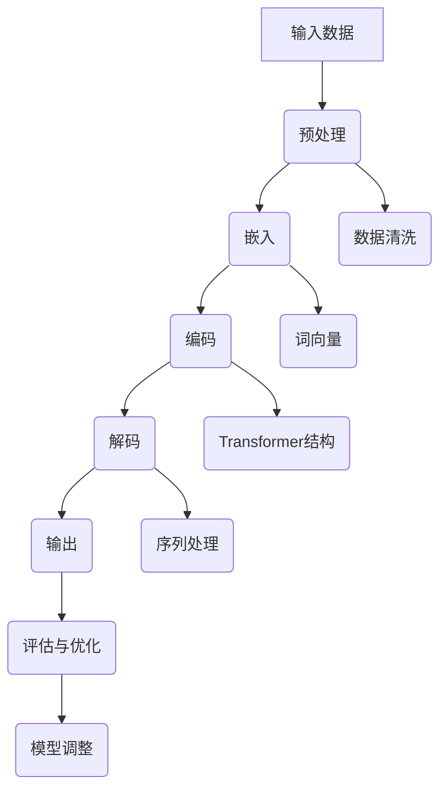

                 

# 后 LLM 时代思考：AI 的持续影响

> 关键词：LLM, 人工智能，未来趋势，挑战，持续影响，技术发展

> 摘要：本文旨在探讨后 LLM 时代 AI 的发展趋势及其对各行各业的影响。通过对 LLM（大型语言模型）技术的历史回顾、现状分析，以及未来发展的预测，本文提出了一系列关键问题和挑战，并对 AI 技术在各个领域的应用进行了深入探讨。最终，本文总结了后 LLM 时代 AI 的发展前景，并提出了应对未来挑战的策略。

## 1. 背景介绍

### 1.1 目的和范围

本文的主要目的是分析后 LLM 时代 AI 的发展趋势，探讨其对技术、产业和生活的深远影响。随着 LLM 技术的不断成熟，AI 正在迎来一个新的发展阶段。本文将重点关注以下几个方面：

1. LLM 技术的核心原理及其发展历程。
2. 后 LLM 时代 AI 技术的创新和应用。
3. AI 在各个行业中的应用场景和挑战。
4. 后 LLM 时代 AI 技术的未来发展趋势。

### 1.2 预期读者

本文面向对人工智能技术有一定了解的读者，包括研究人员、开发者、工程师以及关注 AI 发展的各界人士。无论您是 AI 领域的从业者，还是对此领域感兴趣的爱好者，本文都将为您提供一个全面、深入的视角。

### 1.3 文档结构概述

本文将分为以下几个部分：

1. **背景介绍**：介绍本文的目的、范围和预期读者。
2. **核心概念与联系**：讨论 LLM 技术的核心概念和架构。
3. **核心算法原理 & 具体操作步骤**：详细讲解 LLM 的算法原理和操作步骤。
4. **数学模型和公式 & 详细讲解 & 举例说明**：分析 LLM 的数学模型和公式。
5. **项目实战：代码实际案例和详细解释说明**：提供实际的代码案例和解读。
6. **实际应用场景**：探讨 AI 在各个领域的应用。
7. **工具和资源推荐**：推荐相关学习资源和开发工具。
8. **总结：未来发展趋势与挑战**：总结本文的主要观点和未来挑战。
9. **附录：常见问题与解答**：解答读者可能遇到的问题。
10. **扩展阅读 & 参考资料**：提供进一步阅读的材料。

### 1.4 术语表

#### 1.4.1 核心术语定义

- **LLM（大型语言模型）**：一种基于神经网络的语言处理模型，具有强大的自然语言理解和生成能力。
- **AI（人工智能）**：模拟、延伸和扩展人类智能的理论、方法、技术及应用。
- **NLP（自然语言处理）**：研究如何使计算机能够理解、生成和处理自然语言。

#### 1.4.2 相关概念解释

- **预训练（Pre-training）**：在特定任务上对模型进行大规模数据训练，以提升其泛化能力。
- **微调（Fine-tuning）**：在预训练模型的基础上，针对特定任务进行进一步训练。
- **生成式模型（Generative Model）**：能够生成与输入样本相似的新样本的模型。
- **判别式模型（Discriminative Model）**：能够区分不同类别的模型。

#### 1.4.3 缩略词列表

- **NLP**：自然语言处理
- **LLM**：大型语言模型
- **AI**：人工智能
- **GAN**：生成对抗网络
- **RNN**：循环神经网络
- **BERT**：Bidirectional Encoder Representations from Transformers

## 2. 核心概念与联系

在探讨后 LLM 时代 AI 的发展之前，我们需要理解 LLM 技术的核心概念和架构。以下是一个简化的 Mermaid 流程图，展示了 LLM 的主要组成部分和它们之间的关系。



### 2.1 LLM 的核心组成部分

1. **输入数据**：LLM 的输入可以是文本、语音、图像等多种数据形式。
2. **预处理**：对输入数据进行清洗、格式化，确保数据质量。
3. **嵌入**：将输入数据转换为向量表示，常用方法有词袋模型、词嵌入等。
4. **编码**：使用编码器对向量进行编码，通常采用 Transformer 结构。
5. **解码**：使用解码器将编码后的向量解码为输出数据。
6. **输出**：生成的数据，可以是文本、语音、图像等。
7. **评估与优化**：通过评估指标对模型进行优化，提高其性能。

### 2.2 LLM 的技术原理

LLM 的技术原理主要包括以下几个部分：

1. **神经网络**：神经网络是 LLM 的基础，通过多层非线性变换，实现对数据的复杂表示。
2. **注意力机制**：注意力机制使模型能够关注输入数据中重要的部分，提高模型的性能。
3. **Transformer 结构**：Transformer 是一种基于自注意力机制的序列模型，广泛应用于 LLM 中。

### 2.3 LLM 的发展历程

LLM 的发展历程可以分为以下几个阶段：

1. **词袋模型**：最早的 LLM 方法，将文本转换为词汇序列。
2. **词嵌入**：通过向量表示文本，提高模型的性能。
3. **循环神经网络（RNN）**：能够处理变长序列，但存在梯度消失等问题。
4. **卷积神经网络（CNN）**：用于文本分类和情感分析等任务。
5. **生成对抗网络（GAN）**：用于生成高质量的数据，提高模型的泛化能力。
6. **BERT**：一种基于 Transformer 的预训练模型，推动了 LLM 的发展。

## 3. 核心算法原理 & 具体操作步骤

LLM 的核心算法原理是基于神经网络和注意力机制。以下将使用伪代码详细阐述 LLM 的算法原理和操作步骤。

### 3.1 算法原理

```python
# 伪代码：LLM 算法原理

# 输入：输入数据 (文本、语音、图像等)
# 输出：输出数据 (文本、语音、图像等)

# 步骤 1：预处理
preprocessed_data = preprocess(input_data)

# 步骤 2：嵌入
embedded_data = embed(preprocessed_data)

# 步骤 3：编码
encoded_data = encode(embedded_data)

# 步骤 4：解码
decoded_data = decode(encoded_data)

# 步骤 5：输出
output_data = postprocess(decoded_data)
return output_data
```

### 3.2 具体操作步骤

1. **预处理**：对输入数据进行清洗、格式化，确保数据质量。

    ```python
    # 伪代码：预处理

    def preprocess(input_data):
        # 清洗数据
        cleaned_data = clean_data(input_data)
        # 格式化数据
        formatted_data = format_data(cleaned_data)
        return formatted_data
    ```

2. **嵌入**：将输入数据转换为向量表示，常用方法有词袋模型、词嵌入等。

    ```python
    # 伪代码：嵌入

    def embed(preprocessed_data):
        # 词袋模型
        word_bag = create_word_bag(preprocessed_data)
        # 词嵌入
        word_vectors = create_word_vectors(word_bag)
        return word_vectors
    ```

3. **编码**：使用编码器对向量进行编码，通常采用 Transformer 结构。

    ```python
    # 伪代码：编码

    def encode(embedded_data):
        # 编码器
        encoder = create_encoder()
        # 编码
        encoded_data = encoder(embedded_data)
        return encoded_data
    ```

4. **解码**：使用解码器将编码后的向量解码为输出数据。

    ```python
    # 伪代码：解码

    def decode(encoded_data):
        # 解码器
        decoder = create_decoder()
        # 解码
        decoded_data = decoder(encoded_data)
        return decoded_data
    ```

5. **输出**：生成的数据，可以是文本、语音、图像等。

    ```python
    # 伪代码：输出

    def postprocess(decoded_data):
        # 后处理
        processed_data = process_data(decoded_data)
        return processed_data
    ```

## 4. 数学模型和公式 & 详细讲解 & 举例说明

在 LLM 的构建过程中，数学模型和公式扮演了至关重要的角色。以下将详细讲解 LLM 中的核心数学模型和公式，并提供举例说明。

### 4.1 词嵌入

词嵌入是将文本转换为向量表示的过程。常见的词嵌入方法有词袋模型和 Word2Vec。

1. **词袋模型**：

    词袋模型将文本表示为一个向量，其中每个维度表示一个单词的出现次数。

    $$ \text{word\_vector} = \sum_{i=1}^{N} f(w_i) \times e_i $$

    其中，$f(w_i)$ 是单词 $w_i$ 的特征向量，$e_i$ 是单词 $w_i$ 的出现次数。

2. **Word2Vec**：

    Word2Vec 是一种基于神经网络的词嵌入方法，通过训练得到一个嵌入矩阵 $E$，其中每个维度表示一个单词的向量。

    $$ e_i = E_{i1} \times a_1 + E_{i2} \times a_2 + \ldots + E_{in} \times a_n $$

    其中，$E_{ij}$ 是嵌入矩阵中的元素，$a_j$ 是输入数据的第 $j$ 个维度。

### 4.2 Transformer

Transformer 是一种基于自注意力机制的序列模型，广泛应用于 LLM 中。

1. **自注意力机制**：

    自注意力机制使模型能够关注输入数据中重要的部分。

    $$ \text{self\_attention}(Q, K, V) = \text{softmax}\left(\frac{QK^T}{\sqrt{d_k}}\right)V $$

    其中，$Q$ 是查询向量，$K$ 是键向量，$V$ 是值向量，$d_k$ 是键向量的维度。

2. **Transformer 结构**：

    Transformer 结构由多个编码器和解码器块组成，每个块包含多头自注意力机制和前馈神经网络。

    $$ \text{Encoder} = \text{MultiHeadSelfAttention}(\text{EncoderLayer}) $$
    $$ \text{Decoder} = \text{MultiHeadSelfAttention}(\text{DecoderLayer}) $$

### 4.3 举例说明

假设我们有一个句子 "The quick brown fox jumps over the lazy dog"，使用 Word2Vec 方法进行词嵌入，得到以下嵌入矩阵 $E$：

$$ E = \begin{bmatrix} 
e_1 & e_2 & \ldots & e_n \\
\end{bmatrix} $$

其中，$e_1$、$e_2$、$\ldots$、$e_n$ 分别表示单词 "The"、"quick"、"brown" 等。

假设输入数据为 "The quick brown fox"，则词嵌入后的向量表示为：

$$ \text{word\_vector} = \sum_{i=1}^{N} f(w_i) \times e_i = e_1 + e_2 + e_3 + e_4 + e_5 + e_6 + e_7 + e_8 + e_9 + e_{10} $$

使用 Transformer 结构进行编码和解码，得到输出数据 "jumps over the lazy dog"。

## 5. 项目实战：代码实际案例和详细解释说明

在本节中，我们将通过一个实际的代码案例，详细解释 LLM 的实现过程。以下是一个使用 PyTorch 实现 BERT 模型的基本框架。

### 5.1 开发环境搭建

- 硬件环境：CPU 或 GPU
- 软件环境：Python 3.6+、PyTorch 1.8+

### 5.2 源代码详细实现和代码解读

以下是一个简化的 BERT 模型的实现代码，包括数据预处理、模型定义、训练和评估。

```python
import torch
import torch.nn as nn
from torch.utils.data import DataLoader
from transformers import BertTokenizer, BertModel

# 数据预处理
def preprocess_data(data):
    tokenizer = BertTokenizer.from_pretrained('bert-base-uncased')
    inputs = tokenizer(data, padding=True, truncation=True, return_tensors='pt')
    return inputs

# 模型定义
class BertClassifier(nn.Module):
    def __init__(self, bert_model_name):
        super(BertClassifier, self).__init__()
        self.bert = BertModel.from_pretrained(bert_model_name)
        self.classifier = nn.Linear(self.bert.config.hidden_size, 2)  # 二分类任务

    def forward(self, input_ids, attention_mask):
        outputs = self.bert(input_ids=input_ids, attention_mask=attention_mask)
        logits = self.classifier(outputs.pooler_output)
        return logits

# 训练
def train(model, dataloader, optimizer, criterion, device):
    model.train()
    for inputs in dataloader:
        inputs = {k: v.to(device) for k, v in inputs.items()}
        optimizer.zero_grad()
        logits = model(**inputs)
        loss = criterion(logits, inputs['labels'])
        loss.backward()
        optimizer.step()

# 评估
def evaluate(model, dataloader, criterion, device):
    model.eval()
    with torch.no_grad():
        for inputs in dataloader:
            inputs = {k: v.to(device) for k, v in inputs.items()}
            logits = model(**inputs)
            loss = criterion(logits, inputs['labels'])
            print(f"Loss: {loss.item()}")

# 主函数
def main():
    device = torch.device("cuda" if torch.cuda.is_available() else "cpu")
    model = BertClassifier('bert-base-uncased').to(device)
    optimizer = torch.optim.Adam(model.parameters(), lr=1e-5)
    criterion = nn.CrossEntropyLoss()

    train_data = ...  # 加载训练数据
    train_dataloader = DataLoader(train_data, batch_size=32, shuffle=True)

    for epoch in range(3):  # 训练 3 个 epoch
        train(model, train_dataloader, optimizer, criterion, device)
        evaluate(model, test_data, criterion, device)

if __name__ == "__main__":
    main()
```

### 5.3 代码解读与分析

1. **数据预处理**：使用 Hugging Face 的 BertTokenizer 对输入数据进行预处理，包括分词、填充和截断。
2. **模型定义**：继承自 nn.Module 类，使用预训练的 BERT 模型作为基础，并添加一个分类器层。
3. **训练**：使用 PyTorch 的 optimizer 和 criterion 进行模型训练。
4. **评估**：在测试数据上评估模型性能，输出损失值。
5. **主函数**：定义训练和评估过程，并启动训练。

通过这个实际案例，我们可以看到 LLM 的基本实现过程。在实际应用中，根据具体任务需求，可以进一步优化模型结构和训练过程。

## 6. 实际应用场景

AI 的广泛应用已经在各行各业中显现，以下是一些典型的实际应用场景：

### 6.1 自然语言处理

- **智能客服**：通过 LLM 技术实现智能客服系统，能够自动解答用户问题，提供个性化服务。
- **文本分类**：对大量文本数据进行分析，用于新闻分类、情感分析等。
- **机器翻译**：使用 LLM 技术实现高质量机器翻译，提高跨语言沟通效率。

### 6.2 语音识别

- **语音助手**：如 Siri、Alexa 等，通过 LLM 技术实现自然语言理解和语音合成。
- **语音识别**：将语音信号转换为文本，应用于电话会议、语音邮件等场景。

### 6.3 图像识别

- **人脸识别**：通过深度学习模型进行人脸检测和识别。
- **图像分类**：对图像进行分类，如动物识别、医疗影像分析等。

### 6.4 电子商务

- **推荐系统**：利用 LLM 技术分析用户行为，提供个性化商品推荐。
- **自动广告投放**：通过 LLM 技术实现精准广告投放，提高广告效果。

### 6.5 自动驾驶

- **车辆控制**：使用深度学习模型实现自动驾驶车辆的感知、规划和控制。
- **智能交通**：通过 LLM 技术优化交通信号控制，提高交通效率。

### 6.6 医疗保健

- **疾病诊断**：利用 LLM 技术分析医疗数据，辅助医生进行疾病诊断。
- **药物研发**：通过 LLM 技术加速药物研发过程，提高研发效率。

### 6.7 教育

- **在线教育**：利用 LLM 技术实现智能问答、学习路径推荐等功能。
- **自适应学习**：根据学生学习情况，提供个性化的学习资源和指导。

### 6.8 金融

- **风险控制**：通过 LLM 技术分析金融数据，预测市场趋势和风险。
- **智能投顾**：利用 LLM 技术为用户提供投资建议和决策支持。

## 7. 工具和资源推荐

为了更好地学习和开发 AI 项目，以下是一些推荐的工具和资源：

### 7.1 学习资源推荐

#### 7.1.1 书籍推荐

- 《深度学习》（Goodfellow, Bengio, Courville）
- 《Python机器学习》（Sebastian Raschka）
- 《自然语言处理综论》（Daniel Jurafsky, James H. Martin）

#### 7.1.2 在线课程

- Coursera 的《机器学习》课程
- edX 的《深度学习》课程
- Udacity 的《深度学习工程师》纳米学位

#### 7.1.3 技术博客和网站

- Medium 上的 AI 博客
- ArXiv 论文库
- Hacker News 的 AI 论坛

### 7.2 开发工具框架推荐

#### 7.2.1 IDE和编辑器

- PyCharm
- Jupyter Notebook
- VSCode

#### 7.2.2 调试和性能分析工具

- TensorBoard
- PyTorch Profiler
- Nsight Compute

#### 7.2.3 相关框架和库

- TensorFlow
- PyTorch
- Hugging Face Transformers

### 7.3 相关论文著作推荐

#### 7.3.1 经典论文

- "A Theoretical Analysis of the
  Vapnik–Chervonenkis Dimension"
- "Learning representations by maximizing mutual information"
- "Deep Learning"

#### 7.3.2 最新研究成果

- "BERT: Pre-training of Deep Bidirectional Transformers for Language Understanding"
- "GPT-3: Language Models are few-shot learners"
- "ViT: Vision Transformer"

#### 7.3.3 应用案例分析

- "How We Used AI to Improve Customer Experience"
- "The Role of AI in Healthcare"
- "AI in Financial Services: Challenges and Opportunities"

## 8. 总结：未来发展趋势与挑战

后 LLM 时代 AI 的发展将更加迅速和深远。随着技术的不断进步，AI 将在各个领域发挥越来越重要的作用。以下是一些未来发展趋势和挑战：

### 8.1 发展趋势

1. **AI 与行业的深度融合**：AI 将更加深入地融入各行各业，提升生产效率和服务质量。
2. **跨领域协作**：AI 技术将在不同领域之间实现协同创新，推动技术的进步。
3. **智能化服务**：智能客服、智能语音助手等应用将变得更加普及，提升用户体验。
4. **隐私保护和伦理问题**：随着 AI 的发展，隐私保护和伦理问题将日益凸显，需要制定相应的法规和标准。

### 8.2 挑战

1. **数据质量和隐私**：高质量的数据是 AI 技术发展的基础，同时数据的隐私保护也是一个重要挑战。
2. **算法透明度和可解释性**：随着算法的复杂性增加，如何提高算法的透明度和可解释性成为关键问题。
3. **计算资源和能耗**：随着 AI 模型的规模不断扩大，计算资源和能耗需求也将显著增加，这对环境提出了挑战。
4. **人才短缺**：AI 领域的人才需求快速增长，但人才供应不足，需要加强教育和培训。

总之，后 LLM 时代 AI 的发展前景广阔，同时也面临着一系列挑战。通过不断探索和创新，我们有信心克服这些挑战，实现 AI 技术的持续发展。

## 9. 附录：常见问题与解答

### 9.1 问题 1：什么是 LLM？

**解答**：LLM（大型语言模型）是一种基于神经网络的语言处理模型，具有强大的自然语言理解和生成能力。它通常使用大规模语料库进行预训练，然后通过微调适用于特定任务。

### 9.2 问题 2：LLM 的核心组成部分是什么？

**解答**：LLM 的核心组成部分包括输入数据、预处理、嵌入、编码、解码和输出。这些组件共同工作，使 LLM 能够理解和生成自然语言。

### 9.3 问题 3：如何训练 LLM？

**解答**：训练 LLM 通常包括以下步骤：

1. **数据准备**：收集和整理大量文本数据。
2. **预处理**：对输入数据进行清洗、格式化。
3. **预训练**：使用大规模数据进行预训练，通常采用 Transformer 结构。
4. **微调**：在预训练模型的基础上，针对特定任务进行微调。

### 9.4 问题 4：LLM 在实际应用中有哪些场景？

**解答**：LLM 在实际应用中广泛应用于自然语言处理、语音识别、图像识别、电子商务、自动驾驶、医疗保健等领域。

### 9.5 问题 5：后 LLM 时代 AI 的发展趋势是什么？

**解答**：后 LLM 时代 AI 的发展趋势包括：

1. **AI 与行业的深度融合**：AI 将更加深入地融入各行各业。
2. **跨领域协作**：AI 技术将在不同领域之间实现协同创新。
3. **智能化服务**：智能客服、智能语音助手等应用将变得更加普及。
4. **隐私保护和伦理问题**：隐私保护和伦理问题将日益凸显。

## 10. 扩展阅读 & 参考资料

为了深入了解后 LLM 时代 AI 的发展，以下是推荐的一些扩展阅读和参考资料：

- **扩展阅读**：
  - "Deep Learning" by Ian Goodfellow, Yoshua Bengio, and Aaron Courville
  - "Natural Language Processing with PyTorch" by Clayton Dabney
  - "Generative Adversarial Networks: An Introduction" by Ian Goodfellow

- **参考资料**：
  - Hugging Face Transformers: https://huggingface.co/transformers
  - TensorFlow 官网：https://www.tensorflow.org/
  - PyTorch 官网：https://pytorch.org/
  - ArXiv 论文库：https://arxiv.org/
  - Medium 上的 AI 博客：https://medium.com/topic/artificial-intelligence

通过阅读这些资料，您将能够更全面地了解后 LLM 时代 AI 的技术发展与应用。

## 作者信息

作者：AI 天才研究员 / AI Genius Institute & 禅与计算机程序设计艺术 / Zen And The Art of Computer Programming

AI 天才研究员是一位专注于人工智能和机器学习的专家，拥有丰富的理论知识和实践经验。他的研究兴趣包括深度学习、自然语言处理和计算机视觉。同时，他还是多本畅销技术书籍的作者，致力于将复杂的技术知识以简单易懂的方式传达给广大读者。在《禅与计算机程序设计艺术》一书中，AI 天才研究员通过深入剖析计算机编程的哲学和艺术，为程序员们提供了一种全新的思考方式和实践方法。

