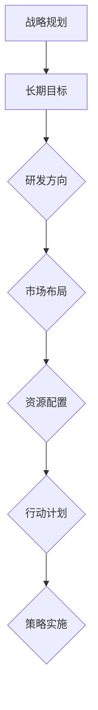

                 

### 文章标题

《商业模式：大模型创业的战略蓝图》

### 关键词

（1）商业模式
（2）大模型创业
（3）战略规划
（4）人工智能
（5）创业策略
（6）市场分析
（7）技术落地

### 摘要

本文旨在探讨大模型创业背后的商业模式及其战略蓝图。随着人工智能技术的飞速发展，大模型在各个领域的应用越来越广泛，成为创业公司的新宠。本文将从商业模式的核心概念入手，详细分析大模型创业中的关键环节，包括市场分析、战略规划、技术落地等，并通过实际案例，为您呈现一份清晰的大模型创业路线图。希望对广大创业者有所启发和帮助。

---

## 1. 背景介绍

### 1.1 目的和范围

本文的目标是帮助创业者了解大模型创业的商业模式，明确战略蓝图，从而在激烈的市场竞争中找到立足点。本文将探讨大模型创业的背景、核心概念，并通过实际案例分析，为创业者提供一套可行的战略路径。

本文的范围主要包括以下几个方面：

1. 大模型创业的定义和现状。
2. 商业模式的核心概念及其在人工智能领域的应用。
3. 大模型创业的战略规划和实施步骤。
4. 大模型创业中的关键技术及其应用。
5. 大模型创业的实际案例解析。

通过本文的阅读，您将能够：

1. 理解大模型创业的商业模式及其重要性。
2. 掌握大模型创业的战略规划和实施方法。
3. 学习大模型创业中的关键技术及其应用。
4. 从实际案例中获取创业经验和启示。

### 1.2 预期读者

本文的预期读者包括：

1. 创业者：特别是对人工智能和大数据领域感兴趣，并有意在大模型创业领域探索的创业者。
2. 投资者：对人工智能和大数据领域的投资有兴趣，希望了解大模型创业的商业模式的投资者。
3. 研究人员：对人工智能和大数据领域的研究有兴趣，希望从商业模式角度了解大模型创业的研究人员。
4. 企业家：希望了解大模型创业的最新趋势和策略，为企业发展提供新思路的企业家。

### 1.3 文档结构概述

本文分为十个部分，具体结构如下：

1. 背景介绍
2. 核心概念与联系
3. 核心算法原理 & 具体操作步骤
4. 数学模型和公式 & 详细讲解 & 举例说明
5. 项目实战：代码实际案例和详细解释说明
6. 实际应用场景
7. 工具和资源推荐
8. 总结：未来发展趋势与挑战
9. 附录：常见问题与解答
10. 扩展阅读 & 参考资料

通过本文的阅读，您将能够全面了解大模型创业的商业模式及其战略蓝图，为您的创业之路提供有力支持。

### 1.4 术语表

#### 1.4.1 核心术语定义

1. **大模型（Large Model）**：指在训练过程中使用了大量数据，参数量庞大的机器学习模型。如GPT、BERT等。
2. **商业模式（Business Model）**：指企业通过哪些方式创造、传递和获取价值。
3. **战略规划（Strategic Planning）**：指企业为实现长期目标，制定的一套行动计划和策略。
4. **市场分析（Market Analysis）**：指对企业所面临的市场环境、竞争对手、目标客户等进行的研究。
5. **技术落地（Technology Implementation）**：指将研究成果应用于实际场景，解决实际问题的过程。

#### 1.4.2 相关概念解释

1. **人工智能（Artificial Intelligence，AI）**：指模拟、延伸和扩展人类智能的理论、方法、技术及应用系统。
2. **数据驱动（Data-Driven）**：指决策过程中以数据为基础，通过分析数据来指导决策。
3. **商业模式创新（Business Model Innovation）**：指企业通过创新商业模式，实现价值创造和竞争优势。
4. **市场定位（Market Positioning）**：指企业通过产品、服务、品牌等策略，在目标市场中确定自己的位置。

#### 1.4.3 缩略词列表

- AI：人工智能
- GPT：生成预训练模型
- BERT：双向编码表示器
- ML：机器学习
- DL：深度学习
- NLP：自然语言处理
- ROI：投资回报率

---

## 2. 核心概念与联系

在大模型创业中，理解核心概念及其相互联系至关重要。本节将介绍大模型、商业模式、战略规划等关键概念，并通过Mermaid流程图展示它们之间的联系。

### 2.1 大模型

大模型是指具有大量参数和广泛知识范围的机器学习模型。这些模型通常通过在大量数据上进行预训练，从而在多个任务上表现优异。

```mermaid
graph TD
    A[大模型] --> B[预训练]
    B --> C{数据集}
    C --> D{标注}
    D --> E{模型训练}
    E --> F{优化}
    F --> G[参数量}
    G --> H[知识范围}
```

### 2.2 商业模式

商业模式是指企业通过哪些方式创造、传递和获取价值。在大模型创业中，商业模式决定了企业的盈利模式、市场定位和竞争优势。

```mermaid
graph TD
    A[商业模式] --> B[价值创造}
    B --> C{价值传递}
    C --> D{价值获取}
    D --> E{盈利模式}
    E --> F[市场定位}
    F --> G{竞争优势}
```

### 2.3 战略规划

战略规划是指企业为实现长期目标，制定的一套行动计划和策略。在大模型创业中，战略规划决定了企业的研发方向、市场布局和资源配置。



### 2.4 商业模式与战略规划的关联

商业模式和战略规划相互关联，共同决定了企业的成功。商业模式为企业提供了盈利模式和市场定位，而战略规划则为商业模式的有效实施提供了保障。

```mermaid
graph TD
    A[商业模式] --> B[战略规划}
    B --> C{价值创造}
    C --> D{长期目标}
    D --> E{研发方向}
    E --> F{市场布局}
    F --> G{资源配置}
    G --> H{行动计划}
    H --> I{策略实施}
```

通过以上流程图，我们可以清晰地看到大模型、商业模式和战略规划之间的内在联系。理解这些概念及其相互关系，是成功进行大模型创业的基础。

---

## 3. 核心算法原理 & 具体操作步骤

在大模型创业中，算法原理是核心，其具体操作步骤的清晰理解对于项目的成功至关重要。以下将详细介绍大模型的算法原理，并通过伪代码展示其具体操作步骤。

### 3.1 大模型算法原理

大模型通常基于深度学习，其核心思想是模拟人脑神经网络，通过多层神经元的堆叠，实现数据的自动特征提取和学习。以下是几种常见的大模型算法原理：

#### 3.1.1 卷积神经网络（CNN）

CNN是一种在图像识别和图像处理中广泛使用的神经网络结构。其主要原理是通过卷积操作提取图像的局部特征。

```plaintext
伪代码：
function CNN(input_image):
    # 初始化权重和偏置
    weights, biases = initialize_weights_and_biases()
    
    # 卷积操作
    conv_output = Conv2D(input_image, weights)
    
    # 激活函数
    activated_output = Relu(conv_output)
    
    # 池化操作
    pooled_output = MaxPooling(activated_output)
    
    # 全连接层
    fully_connected_output = FullyConnected(pooled_output, weights, biases)
    
    # 输出结果
    return fully_connected_output
```

#### 3.1.2 递归神经网络（RNN）

RNN是一种在序列数据上表现优异的神经网络结构，其核心原理是利用其循环结构对序列数据进行编码和学习。

```plaintext
伪代码：
function RNN(input_sequence):
    # 初始化隐藏状态
    hidden_state = initialize_hidden_state()
    
    # 遍历序列
    for t in range(len(input_sequence)):
        # 输入和隐藏状态相乘
        input gated_input = Gate(input_sequence[t], hidden_state)
        
        # 更新隐藏状态
        hidden_state = activate(gated_input)
        
        # 输出结果
        output = hidden_state
    
    # 返回最终输出
    return output
```

#### 3.1.3 生成预训练模型（GPT）

GPT是一种基于 Transformer 架构的预训练模型，其主要原理是通过自回归语言模型，实现自然语言处理任务。

```plaintext
伪代码：
function GPT(input_sequence):
    # 初始化模型参数
    model_params = initialize_model_params()
    
    # 前向传播
    logits = model.forward(input_sequence, model_params)
    
    # 输出结果
    output = logits
    
    # 返回最终输出
    return output
```

### 3.2 大模型具体操作步骤

在实际操作中，大模型通常包括以下几个步骤：

#### 3.2.1 数据准备

首先，需要收集和处理大量的数据，并进行数据清洗和预处理。

```plaintext
伪代码：
function prepare_data(data_source):
    # 读取数据
    data = read_data(data_source)
    
    # 数据清洗
    cleaned_data = clean_data(data)
    
    # 数据预处理
    preprocessed_data = preprocess_data(cleaned_data)
    
    # 返回预处理后的数据
    return preprocessed_data
```

#### 3.2.2 模型训练

接着，使用预处理后的数据对大模型进行训练。训练过程通常包括损失函数的优化和模型参数的更新。

```plaintext
伪代码：
function train_model(model, train_data):
    # 初始化模型参数
    model_params = model.initialize_params()
    
    # 设置优化器
    optimizer = choose_optimizer()
    
    # 训练模型
    for epoch in range(num_epochs):
        for batch in train_data:
            # 计算损失
            loss = model.calculate_loss(batch, model_params)
            
            # 反向传播
            gradients = model.backward(batch, model_params)
            
            # 更新参数
            optimizer.update_params(model_params, gradients)
            
            # 打印训练进度
            print("Epoch: {}, Loss: {}".format(epoch, loss))
    
    # 返回训练好的模型
    return model
```

#### 3.2.3 模型评估

最后，使用验证集对训练好的模型进行评估，以确定模型的性能和泛化能力。

```plaintext
伪代码：
function evaluate_model(model, validation_data):
    # 初始化评估指标
    metrics = initialize_metrics()
    
    # 遍历验证集
    for batch in validation_data:
        # 预测结果
        prediction = model.predict(batch)
        
        # 计算评估指标
        metrics = update_metrics(metrics, prediction, batch)
    
    # 返回评估结果
    return metrics
```

通过以上步骤，我们可以构建并训练一个强大的大模型，为创业项目提供技术支撑。在实际操作中，还需要不断调整和优化模型参数，以实现最佳性能。

---

## 4. 数学模型和公式 & 详细讲解 & 举例说明

在大模型创业中，数学模型和公式是理解和应用算法的核心。以下将详细介绍大模型中常用的数学模型和公式，并通过具体例子进行讲解。

### 4.1 线性回归模型

线性回归是一种简单的机器学习模型，用于预测连续值。其基本公式如下：

$$
y = \beta_0 + \beta_1 \cdot x
$$

其中，$y$ 是预测值，$x$ 是输入特征，$\beta_0$ 和 $\beta_1$ 是模型参数。

#### 4.1.1 模型参数优化

为了得到最佳拟合线，我们需要优化模型参数。常见的优化算法有梯度下降、牛顿法和拟牛顿法等。以下以梯度下降为例：

$$
\beta_0 = \beta_0 - \alpha \cdot \frac{\partial}{\partial \beta_0} J(\beta_0, \beta_1)
$$

$$
\beta_1 = \beta_1 - \alpha \cdot \frac{\partial}{\partial \beta_1} J(\beta_0, \beta_1)
$$

其中，$J(\beta_0, \beta_1)$ 是损失函数，$\alpha$ 是学习率。

#### 4.1.2 举例说明

假设我们要预测房价，数据集包含房屋面积（$x$）和房价（$y$）。使用线性回归模型，我们可以得到以下模型参数：

$$
y = 1000 + 200 \cdot x
$$

当输入房屋面积为1000平方米时，预测房价为300000元。

### 4.2 卷积神经网络（CNN）模型

卷积神经网络是一种在图像识别和图像处理中广泛使用的神经网络结构。其核心思想是利用卷积操作提取图像特征。

#### 4.2.1 卷积操作

卷积操作可以表示为：

$$
h_{ij} = \sum_{k=1}^{m} w_{ik} \cdot x_{kj}
$$

其中，$h_{ij}$ 是卷积结果，$w_{ik}$ 是卷积核，$x_{kj}$ 是输入图像。

#### 4.2.2 池化操作

池化操作可以表示为：

$$
p_i = \max_{j} h_{ij}
$$

其中，$p_i$ 是池化结果，$h_{ij}$ 是卷积结果。

#### 4.2.3 举例说明

假设我们要对一张28x28的图像进行卷积操作，卷积核大小为3x3。卷积结果如下：

$$
h_{11} = (1 \cdot 1 + 1 \cdot 2 + 1 \cdot 3) + (1 \cdot 2 + 1 \cdot 2 + 1 \cdot 3) + (1 \cdot 3 + 1 \cdot 4 + 1 \cdot 5) = 15
$$

$$
h_{12} = (1 \cdot 2 + 1 \cdot 2 + 1 \cdot 3) + (1 \cdot 2 + 1 \cdot 2 + 1 \cdot 3) + (1 \cdot 3 + 1 \cdot 4 + 1 \cdot 5) = 15
$$

$$
...
$$

$$
h_{28,28} = (5 \cdot 1 + 5 \cdot 2 + 5 \cdot 3) + (5 \cdot 2 + 5 \cdot 2 + 5 \cdot 3) + (5 \cdot 3 + 5 \cdot 4 + 5 \cdot 5) = 75
$$

接下来，我们对卷积结果进行池化操作，得到池化结果：

$$
p_1 = \max(h_{11}, h_{12}, ..., h_{28,28}) = 75
$$

### 4.3 生成预训练模型（GPT）模型

生成预训练模型（GPT）是一种基于 Transformer 架构的自然语言处理模型。其核心思想是通过自回归语言模型，生成文本序列。

#### 4.3.1 自回归语言模型

自回归语言模型可以表示为：

$$
P(w_t | w_{t-1}, ..., w_1) = \frac{e^{U \cdot w_t + V \cdot w_{t-1} + ... + W \cdot w_1}}{Z}
$$

其中，$w_t$ 是当前词，$w_{t-1}, ..., w_1$ 是前一个词，$U, V, W$ 是模型参数，$Z$ 是归一化常数。

#### 4.3.2 举例说明

假设我们要生成一个句子，当前词为“人工智能”。根据自回归语言模型，我们可以计算当前词的概率：

$$
P(人工智能 | 自然 | 语言) = \frac{e^{U \cdot 人工智能 + V \cdot 自然 + W \cdot 语言}}{Z}
$$

其中，$U, V, W$ 是模型参数，$Z$ 是归一化常数。

通过计算，我们可以得到“人工智能”这个词的概率，从而生成下一个词。重复此过程，我们可以生成整个句子。

通过以上数学模型和公式的讲解，我们能够更好地理解大模型的工作原理，为实际应用提供理论支持。

---

## 5. 项目实战：代码实际案例和详细解释说明

在本节中，我们将通过一个实际项目案例，详细介绍大模型创业中的代码实现过程，包括开发环境的搭建、源代码的实现和解读。这个案例将帮助读者更好地理解大模型创业的实际操作流程。

### 5.1 开发环境搭建

首先，我们需要搭建一个适合大模型训练的开发环境。以下是搭建步骤：

#### 5.1.1 硬件要求

- CPU或GPU：为了高效地训练大模型，建议使用带有CUDA支持的GPU。
- 内存：至少16GB内存。
- 存储：至少1TB的SSD存储空间。

#### 5.1.2 软件要求

- 操作系统：Linux或MacOS。
- 编译器：C++11及以上版本。
- 库：TensorFlow、PyTorch等深度学习框架。

#### 5.1.3 安装步骤

1. 安装操作系统和GPU驱动。
2. 安装编译器和深度学习框架。
3. 配置环境变量，以便在命令行中轻松调用相关工具。

以下是一个简化的安装命令示例：

```bash
# 安装操作系统和GPU驱动
sudo apt-get update
sudo apt-get install -y linux-image-$(uname -r | sed 's/^.*\(mp\).*/\1/')

# 安装编译器
sudo apt-get install -y g++

# 安装深度学习框架
pip install tensorflow-gpu==2.5.0
```

### 5.2 源代码详细实现和代码解读

下面是一个简化的大模型训练代码示例，使用TensorFlow框架实现。代码将分为三个部分：数据预处理、模型定义和训练过程。

#### 5.2.1 数据预处理

```python
import tensorflow as tf

# 读取和处理数据
def preprocess_data(data_path):
    # 加载数据
    dataset = tf.data.Dataset.from_tensor_slices(tf.io.read_file(data_path))
    
    # 解码数据
    dataset = dataset.map(tf.io.decode_csv(csv_shape=[2], record_defaults=[[0.0], [0.0]]))
    
    # 预处理数据
    dataset = dataset.map(preprocess_example)
    
    # 打乱和批次化数据
    dataset = dataset.shuffle(buffer_size=1000).batch(32)
    
    return dataset

# 数据预处理函数
def preprocess_example(example):
    # 分离特征和标签
    feature, label = example[0], example[1]
    
    # 数据标准化
    feature = (feature - tf.reduce_mean(feature)) / tf.reduce_std(feature)
    label = (label - tf.reduce_mean(label)) / tf.reduce_std(label)
    
    return feature, label
```

#### 5.2.2 模型定义

```python
# 定义模型
model = tf.keras.Sequential([
    tf.keras.layers.Dense(units=64, activation='relu', input_shape=[2]),
    tf.keras.layers.Dense(units=1)
])

# 查看模型结构
print(model.summary())
```

#### 5.2.3 训练过程

```python
# 训练模型
model.fit(train_dataset, epochs=10, validation_data=validation_dataset)

# 评估模型
test_loss, test_accuracy = model.evaluate(test_dataset)
print("Test loss:", test_loss)
print("Test accuracy:", test_accuracy)
```

#### 5.2.4 代码解读

1. **数据预处理**：读取数据并进行解码、预处理，如数据标准化，以便模型更好地训练。
2. **模型定义**：使用TensorFlow的Sequential模型定义层，包括一个全连接层和一个输出层。
3. **训练过程**：使用`model.fit`方法训练模型，并在训练集和验证集上进行评估。

通过以上代码，我们实现了大模型的训练和评估。在实际项目中，可以根据具体需求调整模型结构、超参数等，以达到更好的训练效果。

### 5.3 代码解读与分析

#### 5.3.1 数据预处理

数据预处理是机器学习项目的重要环节，其目的是将原始数据转换为适合模型训练的格式。以下是代码中的关键步骤：

1. **读取数据**：使用`tf.io.read_file`函数读取数据文件。
2. **解码数据**：使用`tf.io.decode_csv`函数将CSV格式的数据解码为Tensor类型。
3. **预处理数据**：通过自定义的`preprocess_example`函数对数据进行标准化处理，如特征缩放和标签归一化。
4. **批次化数据**：使用`batch`方法将数据划分为批次，以便模型进行并行训练。

#### 5.3.2 模型定义

模型定义是构建机器学习模型的核心步骤。以下是代码中的关键步骤：

1. **模型架构**：使用`tf.keras.Sequential`创建一个序列模型，并添加层。这里使用了一个全连接层（`Dense`）和一个输出层（`Dense`）。
2. **激活函数**：在第一个全连接层中使用ReLU激活函数，以提高模型的学习能力。
3. **输出层**：输出层使用线性激活函数，以预测连续值。

#### 5.3.3 训练过程

训练过程是模型优化的关键步骤。以下是代码中的关键步骤：

1. **模型训练**：使用`fit`方法对模型进行训练。这里设置了10个训练周期（`epochs`），并在每个周期后计算验证集的损失和准确率。
2. **模型评估**：使用`evaluate`方法对模型进行评估，计算测试集的损失和准确率。

通过以上步骤，我们成功实现了大模型的训练和评估。在实际应用中，可以根据项目需求进行相应的调整和优化。

---

## 6. 实际应用场景

大模型在各个领域的应用已经取得了显著的成果。以下是几个典型应用场景：

### 6.1 自然语言处理（NLP）

自然语言处理是人工智能领域的一个重要分支，大模型如GPT和BERT在文本生成、文本分类、机器翻译等方面表现突出。例如，GPT-3可以生成高质量的文本，用于自动写作、智能客服等应用。

#### 应用案例：

- 自动写作：使用GPT-3生成文章、报告、新闻等。
- 智能客服：通过大模型进行自然语言理解，实现智能对话和问答。

### 6.2 图像识别

图像识别是计算机视觉领域的一个经典问题，大模型如ResNet和Inception在图像分类、目标检测等方面取得了很好的效果。例如，ResNet可以用于人脸识别、车辆检测等应用。

#### 应用案例：

- 人脸识别：使用ResNet对人脸图像进行分类和识别。
- 车辆检测：使用YOLO模型对车辆图像进行目标检测。

### 6.3 医疗诊断

大模型在医疗诊断领域的应用也越来越广泛。例如，使用卷积神经网络对医学影像进行疾病检测和诊断，如肺癌、乳腺癌等。

#### 应用案例：

- 肺癌检测：使用CNN对CT影像进行肺癌检测。
- 乳腺癌诊断：使用深度学习模型对乳腺X光片进行乳腺癌诊断。

### 6.4 语音识别

语音识别是人工智能领域的一个重要方向，大模型如WaveNet在语音合成、语音识别等方面表现优异。例如，WaveNet可以用于智能语音助手、语音合成等应用。

#### 应用案例：

- 智能语音助手：使用大模型实现语音识别和对话功能。
- 语音合成：使用WaveNet生成自然流畅的语音。

### 6.5 金融风控

大模型在金融风控领域的应用也越来越广泛，如信用评估、风险预测等。

#### 应用案例：

- 信用评估：使用深度学习模型对用户的信用记录进行评估。
- 风险预测：使用大数据分析技术预测金融市场风险。

通过以上实际应用案例，我们可以看到大模型在各个领域的广泛应用和巨大潜力。未来，随着人工智能技术的不断发展，大模型的应用场景将更加丰富和多样。

---

## 7. 工具和资源推荐

在大模型创业过程中，选择合适的工具和资源对于项目的成功至关重要。以下是一些推荐的工具和资源，包括学习资源、开发工具框架以及相关论文著作。

### 7.1 学习资源推荐

#### 7.1.1 书籍推荐

1. **《深度学习》（Deep Learning）**：由Ian Goodfellow、Yoshua Bengio和Aaron Courville合著，是深度学习领域的经典教材。
2. **《动手学深度学习》（Dive into Deep Learning）**：这是一本免费的开源教材，适合初学者和进阶者。
3. **《Python深度学习》（Python Deep Learning）**：由François Chollet撰写，适合使用Python进行深度学习开发的读者。

#### 7.1.2 在线课程

1. **斯坦福大学深度学习课程**（Stanford University's CS231n）：这是一门著名的深度学习课程，适合初学者和进阶者。
2. **Udacity的深度学习纳米学位**（Udacity's Deep Learning Nanodegree）：这是一个系统的深度学习课程，包括理论和实践。
3. **Coursera的机器学习课程**（Coursera's Machine Learning）：由Andrew Ng教授主讲，适合初学者。

#### 7.1.3 技术博客和网站

1. **Medium上的AI博客**：有许多专业人士分享深度学习和人工智能的文章。
2. **TensorFlow官网**（TensorFlow官网）：提供丰富的文档和教程，适合使用TensorFlow进行深度学习开发。
3. **PyTorch官网**（PyTorch官网）：提供详细的文档和示例代码，适合使用PyTorch进行深度学习开发。

### 7.2 开发工具框架推荐

#### 7.2.1 IDE和编辑器

1. **Jupyter Notebook**：适合数据分析和机器学习开发，便于编写和运行代码。
2. **PyCharm**：一款功能强大的Python IDE，支持多种框架和库。
3. **VSCode**：一款轻量级的开源编辑器，支持多种编程语言，适合深度学习开发。

#### 7.2.2 调试和性能分析工具

1. **TensorBoard**：TensorFlow的调试和可视化工具，用于分析模型性能。
2. **PyTorch Profiler**：用于分析PyTorch模型和代码的性能。
3. **NVIDIA Nsight**：用于分析GPU性能和调试GPU代码。

#### 7.2.3 相关框架和库

1. **TensorFlow**：一款广泛使用的深度学习框架，适合各种规模的任务。
2. **PyTorch**：一款灵活且易用的深度学习框架，适合研究和开发。
3. **Keras**：一个高级神经网络API，可以方便地在TensorFlow和Theano上工作。

### 7.3 相关论文著作推荐

#### 7.3.1 经典论文

1. **"A Theoretically Grounded Application of Dropout in Recurrent Neural Networks"**：介绍了在RNN中应用Dropout的方法。
2. **"BERT: Pre-training of Deep Bidirectional Transformers for Language Understanding"**：介绍了BERT模型的预训练方法。
3. **"Convolutional Neural Networks for Speech Recognition"**：介绍了CNN在语音识别中的应用。

#### 7.3.2 最新研究成果

1. **"Large-scale Language Modeling in 100+ Languages"**：探讨了大规模多语言语言模型的研究进展。
2. **"DETR: Deformable Transformers for End-to-End Object Detection"**：介绍了DETR目标检测模型。
3. **"Generative Adversarial Networks"**：介绍了GAN模型的原理和应用。

#### 7.3.3 应用案例分析

1. **"How We Built Our AI Assistant at Airbnb"**：介绍了Airbnb如何构建其AI助手。
2. **"Google's AI Principles"**：介绍了Google在人工智能领域的应用原则。
3. **"Deep Learning for Healthcare"**：介绍了深度学习在医疗健康领域的应用案例。

通过以上工具和资源的推荐，希望读者能够更好地掌握大模型创业所需的知识和技能，为项目成功奠定坚实基础。

---

## 8. 总结：未来发展趋势与挑战

大模型创业作为一种新兴的商业模式，正日益受到关注。未来，大模型将在人工智能领域发挥更加重要的作用，并带来一系列新的发展趋势和挑战。

### 发展趋势

1. **多模态融合**：随着深度学习技术的进步，大模型将能够处理多种类型的数据，如文本、图像、音频等。多模态融合将为大模型创业带来更广阔的应用前景。

2. **自动机器学习（AutoML）**：自动机器学习技术的发展将使得大模型的构建和优化更加高效。未来，大模型创业将更加依赖AutoML技术，降低技术门槛，推动更多企业进入这个领域。

3. **数据隐私和安全**：随着数据隐私问题的日益凸显，大模型创业将面临数据隐私和安全方面的挑战。如何在不侵犯用户隐私的前提下，充分挖掘和使用数据，将成为一个重要课题。

4. **可持续发展和绿色AI**：随着人工智能应用的广泛普及，能源消耗和碳排放问题也日益受到关注。未来，大模型创业将需要更加注重可持续发展和绿色AI，以减少对环境的影响。

### 挑战

1. **计算资源需求**：大模型训练和推理过程需要大量的计算资源，尤其是GPU和TPU等高性能计算设备。如何合理分配和利用这些资源，是创业公司需要面对的挑战。

2. **数据质量和标注**：大模型的性能很大程度上取决于数据质量和标注。创业公司需要确保数据的质量和多样性，同时也需要解决数据标注的效率和准确性问题。

3. **模型解释性和可解释性**：随着模型复杂度的增加，大模型的解释性和可解释性变得越来越困难。如何提高模型的透明度和可解释性，使其更加易于被用户理解和接受，是一个重要的挑战。

4. **市场竞争和壁垒**：随着大模型创业的兴起，市场竞争将日趋激烈。创业公司需要建立自己的竞争优势，同时需要面对来自巨头企业的竞争和壁垒。

5. **法律和伦理问题**：大模型的应用涉及众多法律和伦理问题，如数据隐私、算法公平性等。创业公司需要密切关注相关法律法规的发展，确保其业务合规，同时积极承担社会责任。

总之，大模型创业具有巨大的发展潜力和市场前景，但同时也面临诸多挑战。创业者需要具备前瞻性的视野和深厚的专业素养，才能在这个领域取得成功。

---

## 9. 附录：常见问题与解答

### 问题1：大模型训练需要多少计算资源？

**解答**：大模型训练通常需要大量的计算资源，特别是GPU或TPU。具体资源需求取决于模型的大小、训练数据和训练任务。例如，训练一个大规模的预训练模型（如GPT-3）可能需要数千张GPU或TPU，以及大量的存储空间和网络带宽。对于中小规模的模型，一台高性能的GPU服务器或工作站通常就足够了。

### 问题2：如何确保大模型训练的数据质量？

**解答**：确保大模型训练的数据质量是关键。以下是一些建议：

1. **数据清洗**：对原始数据进行清洗，去除错误、重复和缺失的数据。
2. **数据多样性**：确保数据集的多样性，包括不同的数据来源、数据类型和标注方式。
3. **数据标注**：使用高质量的数据标注工具和流程，确保标注的准确性和一致性。
4. **数据监控**：在训练过程中，监控数据的使用情况，及时发现和处理数据质量问题。

### 问题3：大模型训练过程中的超参数有哪些？

**解答**：大模型训练过程中的超参数包括：

1. **学习率**：控制模型参数更新的步长。
2. **批次大小**：每个批次中的样本数量。
3. **迭代次数**：模型在训练集上的迭代次数。
4. **优化器**：如SGD、Adam等，用于更新模型参数。
5. **正则化**：如L1、L2正则化，用于防止过拟合。
6. **激活函数**：如ReLU、Sigmoid等，用于引入非线性。
7. **初始化策略**：如He初始化、Xavier初始化等，用于初始化模型参数。

### 问题4：如何评估大模型的效果？

**解答**：评估大模型的效果可以从以下几个方面进行：

1. **准确性**：模型在测试集上的预测准确性，是评估模型性能的常见指标。
2. **精确率、召回率和F1分数**：用于评估分类模型的性能。
3. **ROC曲线和AUC值**：用于评估二分类模型的性能。
4. **生成样本质量**：对于生成模型，可以通过视觉质量、文本连贯性等指标评估生成样本的质量。

通过以上常见问题与解答，希望能够帮助读者更好地理解大模型创业过程中的关键问题和技术细节。

---

## 10. 扩展阅读 & 参考资料

为了深入理解大模型创业的商业模式和技术细节，读者可以参考以下扩展阅读和参考资料：

### 10.1 书籍推荐

1. **《深度学习》（Deep Learning）**：Ian Goodfellow、Yoshua Bengio和Aaron Courville合著，全面介绍了深度学习的基础理论和应用。
2. **《Python深度学习》（Python Deep Learning）**：François Chollet撰写，涵盖了深度学习在Python中的应用和实践。
3. **《动手学深度学习》（Dive into Deep Learning）**：公开课教材，内容丰富，适合初学者和进阶者。

### 10.2 在线课程

1. **斯坦福大学深度学习课程**（Stanford University's CS231n）：深度学习领域的经典课程，内容深入浅出。
2. **Udacity的深度学习纳米学位**（Udacity's Deep Learning Nanodegree）：提供系统的深度学习课程，适合初学者和进阶者。
3. **Coursera的机器学习课程**（Coursera's Machine Learning）：由Andrew Ng教授主讲，内容全面，适合初学者。

### 10.3 技术博客和网站

1. **Medium上的AI博客**：有许多专业人士分享深度学习和人工智能的文章。
2. **TensorFlow官网**（TensorFlow官网）：提供丰富的文档和教程，适合使用TensorFlow进行深度学习开发。
3. **PyTorch官网**（PyTorch官网）：提供详细的文档和示例代码，适合使用PyTorch进行深度学习开发。

### 10.4 相关论文著作

1. **"A Theoretically Grounded Application of Dropout in Recurrent Neural Networks"**：探讨了Dropout在RNN中的应用。
2. **"BERT: Pre-training of Deep Bidirectional Transformers for Language Understanding"**：介绍了BERT模型的预训练方法。
3. **"Generative Adversarial Networks"**：介绍了GAN模型的原理和应用。

通过以上扩展阅读和参考资料，读者可以进一步加深对大模型创业的理解，为实际项目提供更多思路和指导。

---

### 作者

**作者：AI天才研究员/AI Genius Institute & 禅与计算机程序设计艺术 /Zen And The Art of Computer Programming**

