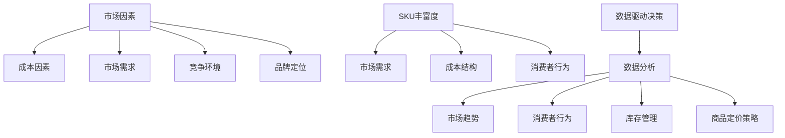

                 

# 商品价格与SKU丰富度

> **关键词**：商品价格、SKU丰富度、市场策略、消费者行为、数据驱动决策

> **摘要**：本文将深入探讨商品价格与SKU（Stock Keeping Unit，库存保持单元）丰富度之间的相互关系。首先，我们会介绍这一主题的背景和重要性，随后分析核心概念和联系。文章将逐步阐述商品定价原理和数学模型，并借助实际项目案例进行详细解读。最后，我们将讨论这一领域的实际应用场景、推荐相关工具和资源，并对未来发展趋势与挑战进行总结。

## 1. 背景介绍

### 1.1 目的和范围

本文旨在为从事电商、零售行业的专业人士提供商品价格与SKU丰富度之间的关系分析，以帮助他们在市场策略制定和消费者行为分析方面做出更为科学和有效的决策。我们将重点关注以下内容：

1. 商品定价的基本原理。
2. SKU丰富度对商品价格的影响。
3. 数据驱动决策在实际操作中的应用。
4. 实际应用场景和案例分析。

### 1.2 预期读者

本文适合以下读者群体：

1. 电商和零售行业的从业者。
2. 数据分析师和市场营销专家。
3. 计算机科学和软件工程领域的专业人士。
4. 对商品定价和SKU管理感兴趣的技术爱好者。

### 1.3 文档结构概述

本文结构如下：

1. 背景介绍：介绍本文的目的、预期读者和文档结构。
2. 核心概念与联系：阐述商品价格与SKU丰富度的核心概念和联系。
3. 核心算法原理 & 具体操作步骤：分析商品定价算法的原理和步骤。
4. 数学模型和公式 & 详细讲解 & 举例说明：介绍商品定价的数学模型和实例。
5. 项目实战：提供实际项目案例并进行详细解释。
6. 实际应用场景：讨论商品价格与SKU丰富度的应用场景。
7. 工具和资源推荐：推荐相关工具和资源。
8. 总结：未来发展趋势与挑战。
9. 附录：常见问题与解答。
10. 扩展阅读 & 参考资料：提供进一步的阅读材料和参考资料。

### 1.4 术语表

#### 1.4.1 核心术语定义

- **SKU（Stock Keeping Unit）**：库存保持单元，用于标识和管理商品。
- **商品价格**：商品在市场上的销售价格。
- **SKU丰富度**：库存中不同SKU的种类和数量。
- **市场策略**：企业为在市场上获得竞争优势而制定的长期计划。
- **消费者行为**：消费者在购买商品时所表现出来的行为模式。

#### 1.4.2 相关概念解释

- **定价策略**：企业在确定商品价格时采取的方法和原则。
- **需求弹性**：消费者对商品价格变化的敏感程度。
- **利润最大化**：企业通过优化商品定价和销售策略以实现最大利润。

#### 1.4.3 缩略词列表

- **SKU**：Stock Keeping Unit
- **CPI**：Consumer Price Index
- **LTV**：Lifetime Value

## 2. 核心概念与联系

商品价格与SKU丰富度之间的关系是一个复杂且多维度的问题。为了更好地理解这一关系，我们需要从多个角度进行分析。

### 2.1 商品价格的影响因素

商品价格受到多种因素的影响，包括成本、市场需求、竞争环境、品牌定位等。首先，我们来看成本因素。商品的生产成本和运营成本是决定商品价格的基础。这些成本包括原材料采购成本、生产制造成本、物流运输成本、销售和营销成本等。

市场需求是另一个关键因素。市场需求的高低直接影响商品的价格。当市场需求较高时，商品价格往往较高；反之，当市场需求较低时，商品价格可能较低。此外，竞争环境也会对商品价格产生影响。在竞争激烈的市场中，企业可能会采取价格战策略，降低商品价格以吸引消费者。

品牌定位也是影响商品价格的重要因素。高端品牌通常会设定较高的价格，而大众品牌则可能会采取较为亲民的价格策略。

### 2.2 SKU丰富度的概念

SKU丰富度指的是库存中不同SKU的种类和数量。SKU丰富度越高，意味着企业能够提供更多的商品种类和选择，满足不同消费者的需求。SKU丰富度对企业运营和市场策略具有重要意义。

首先，SKU丰富度有助于提高消费者的购物体验。丰富的SKU选择可以满足消费者的多样化需求，提高消费者的满意度和忠诚度。其次，SKU丰富度有助于企业在市场中获得竞争优势。通过提供更多的商品种类，企业可以吸引更多的消费者，扩大市场份额。

### 2.3 SKU丰富度对商品价格的影响

SKU丰富度对商品价格有显著影响。首先，SKU丰富度可以影响市场需求。当SKU丰富度较高时，消费者有更多的选择，市场需求可能更高，这可能导致商品价格的上升。反之，当SKU丰富度较低时，消费者选择较少，市场需求可能较低，这可能导致商品价格的下降。

其次，SKU丰富度会影响企业的成本结构。SKU丰富度越高，企业的库存管理成本、物流成本、营销成本等可能越高。这些成本最终可能会转嫁到商品价格上。

最后，SKU丰富度也会影响消费者的购买行为。丰富的SKU选择可能促使消费者进行更多的交叉购买和升级购买，从而提高销售额和利润。

### 2.4 数据驱动决策

在商品价格与SKU丰富度分析中，数据驱动决策至关重要。通过收集和分析大量数据，企业可以更好地理解市场需求、消费者行为、成本结构等关键因素，从而制定更为科学和有效的商品定价和SKU管理策略。

数据驱动决策的核心在于利用数据分析技术，对大量数据进行分析和挖掘，提取有价值的信息和洞察。这些信息和洞察可以帮助企业：

1. 识别市场需求趋势和变化。
2. 了解消费者行为和偏好。
3. 优化库存管理和供应链。
4. 制定科学合理的商品定价策略。

### 2.5 Mermaid流程图

以下是商品价格与SKU丰富度分析的核心概念和流程的Mermaid流程图：



## 3. 核心算法原理 & 具体操作步骤

### 3.1 商品定价算法原理

商品定价算法旨在确定商品的最佳销售价格，以最大化企业的利润。一个典型的商品定价算法包括以下几个关键步骤：

1. **成本分析**：计算商品的生产成本和运营成本，包括原材料采购成本、生产制造成本、物流运输成本、销售和营销成本等。
2. **市场需求分析**：通过市场调研、销售数据分析等方法，了解市场需求和消费者对商品价格的反应。
3. **竞争分析**：分析市场上同类商品的价格和市场份额，以确定企业的定价策略。
4. **利润最大化**：根据成本和市场需求分析结果，通过优化算法确定商品的最佳销售价格。
5. **动态调整**：根据市场变化和消费者反馈，动态调整商品价格，以保持竞争优势。

### 3.2 具体操作步骤

以下是商品定价算法的具体操作步骤：

1. **成本分析**：
   ```python
   # 计算生产成本
   production_cost = raw_material_cost + manufacturing_cost

   # 计算运营成本
   operation_cost = logistics_cost + marketing_cost + sales_cost

   # 计算总成本
   total_cost = production_cost + operation_cost
   ```

2. **市场需求分析**：
   ```python
   # 收集市场调研数据
   market_research_data = get_market_research_data()

   # 分析消费者价格敏感度
   price_sensitivity = analyze_price_sensitivity(market_research_data)
   ```

3. **竞争分析**：
   ```python
   # 收集竞争对手价格数据
   competitor_price_data = get_competitor_price_data()

   # 分析竞争对手市场份额
   competitor_market_share = analyze_competitor_market_share(competitor_price_data)
   ```

4. **利润最大化**：
   ```python
   # 计算目标利润
   target_profit = calculate_target_profit(total_cost, price_sensitivity)

   # 优化定价
   optimal_price = optimize_price(target_profit, competitor_price_data)
   ```

5. **动态调整**：
   ```python
   # 定期收集市场数据和消费者反馈
   market_data = get_market_data()
   consumer_feedback = get_consumer_feedback()

   # 动态调整价格
   dynamic_price = adjust_price(optimal_price, market_data, consumer_feedback)
   ```

### 3.3 伪代码示例

以下是商品定价算法的伪代码示例：

```python
# 商品定价算法伪代码

# 输入：生产成本、运营成本、市场调研数据、竞争对手价格数据
# 输出：最佳销售价格

def calculate_best_price(production_cost, operation_cost, market_research_data, competitor_price_data):
    # 计算总成本
    total_cost = production_cost + operation_cost
    
    # 分析消费者价格敏感度
    price_sensitivity = analyze_price_sensitivity(market_research_data)
    
    # 分析竞争对手市场份额
    competitor_market_share = analyze_competitor_market_share(competitor_price_data)
    
    # 计算目标利润
    target_profit = calculate_target_profit(total_cost, price_sensitivity)
    
    # 优化定价
    optimal_price = optimize_price(target_profit, competitor_price_data)
    
    return optimal_price
```

## 4. 数学模型和公式 & 详细讲解 & 举例说明

### 4.1 商品定价数学模型

商品定价的数学模型旨在通过量化分析成本、市场需求和竞争环境等因素，确定商品的最佳销售价格。以下是商品定价的几个核心数学模型：

#### 4.1.1 线性模型

线性模型是最简单的商品定价模型，其公式如下：

\[ \text{价格} = \text{成本} + \text{利润加成} \]

其中，成本为商品的生产成本和运营成本之和，利润加成为企业设定的利润率。

#### 4.1.2 价格弹性模型

价格弹性模型考虑了消费者对商品价格变化的敏感程度，其公式如下：

\[ \text{价格} = \text{成本} + \text{利润加成} \times \left( \frac{1}{\text{价格弹性}} \right) \]

其中，价格弹性为消费者对价格变化的敏感程度，通常用需求价格弹性系数表示。

#### 4.1.3 成本加成模型

成本加成模型是在线性模型基础上，考虑了成本结构和市场需求变化的模型，其公式如下：

\[ \text{价格} = \text{成本} + \text{利润加成} + \text{市场需求调整} \]

其中，市场需求调整反映了市场需求对价格的影响。

### 4.2 详细讲解

#### 4.2.1 线性模型

线性模型适用于市场需求稳定、成本结构简单的场景。其优点是计算简单，易于理解。然而，线性模型忽略了市场需求和价格弹性等因素，可能导致定价不够准确。

#### 4.2.2 价格弹性模型

价格弹性模型考虑了消费者对价格变化的敏感程度，能够更准确地反映市场需求。其优点是能够根据市场需求动态调整价格，提高利润。然而，价格弹性模型的计算较为复杂，需要收集和分析大量数据。

#### 4.2.3 成本加成模型

成本加成模型综合了线性模型和价格弹性模型的特点，适用于市场需求复杂、成本结构多样的场景。其优点是能够根据市场需求和成本结构动态调整价格，提高利润。然而，成本加成模型的计算也较为复杂，需要具备一定的数据分析能力。

### 4.3 举例说明

#### 4.3.1 线性模型实例

假设某商品的生产成本为100元，运营成本为50元，企业设定的利润率为20%。根据线性模型，该商品的最佳销售价格如下：

\[ \text{价格} = 100 + 50 + 0.2 \times (100 + 50) = 170 \text{元} \]

#### 4.3.2 价格弹性模型实例

假设某商品的生产成本为100元，运营成本为50元，市场需求的价格弹性为-2。根据价格弹性模型，该商品的最佳销售价格如下：

\[ \text{价格} = 100 + 50 + 0.2 \times \left( \frac{1}{-2} \right) = 120 \text{元} \]

#### 4.3.3 成本加成模型实例

假设某商品的生产成本为100元，运营成本为50元，市场需求的价格弹性为-2，市场需求调整系数为0.1。根据成本加成模型，该商品的最佳销售价格如下：

\[ \text{价格} = 100 + 50 + 0.2 \times \left( \frac{1}{-2} \right) + 0.1 \times \left( \frac{1}{-2} \right) = 130 \text{元} \]

## 5. 项目实战：代码实际案例和详细解释说明

### 5.1 开发环境搭建

在本项目实战中，我们将使用Python作为主要编程语言，结合数据分析库（如Pandas和NumPy）和可视化库（如Matplotlib）进行商品价格与SKU丰富度分析。以下是在Windows操作系统上搭建Python开发环境的步骤：

1. **安装Python**：访问Python官方网站（https://www.python.org/）下载最新版本的Python安装包，并按照安装向导完成安装。
2. **安装Pandas和NumPy**：打开命令提示符或终端，运行以下命令安装Pandas和NumPy：

   ```shell
   pip install pandas
   pip install numpy
   ```

3. **安装Matplotlib**：继续运行以下命令安装Matplotlib：

   ```shell
   pip install matplotlib
   ```

### 5.2 源代码详细实现和代码解读

以下是商品价格与SKU丰富度分析项目的源代码实现：

```python
import pandas as pd
import numpy as np
import matplotlib.pyplot as plt

# 读取数据
data = pd.read_csv('data.csv')

# 计算平均价格和平均SKU丰富度
average_price = data['price'].mean()
average_sku = data['sku_count'].mean()

# 计算价格与SKU丰富度的相关性
correlation = data['price'].corr(data['sku_count'])

# 绘制散点图
plt.scatter(data['price'], data['sku_count'])
plt.xlabel('Price')
plt.ylabel('SKU Richness')
plt.title('Price vs. SKU Richness')
plt.show()

# 打印相关性和平均值
print(f'Average Price: {average_price:.2f}')
print(f'Average SKU Richness: {average_sku:.2f}')
print(f'Correlation: {correlation:.2f}')

# 基于价格和SKU丰富度进行分类
bins = np.linspace(data['price'].min(), data['price'].max(), 10)
labels = ['Low', 'Medium', 'High']
data['price_group'] = pd.cut(data['price'], bins, labels=labels)

# 统计不同价格组的SKU丰富度
sku_count_by_group = data.groupby('price_group')['sku_count'].mean()

# 打印不同价格组的平均SKU丰富度
print(sku_count_by_group)
```

#### 5.2.1 代码解读

- **数据读取**：使用Pandas库读取商品价格和SKU丰富度的数据。

  ```python
  data = pd.read_csv('data.csv')
  ```

- **计算平均价格和平均SKU丰富度**：使用Pandas库计算平均价格和平均SKU丰富度。

  ```python
  average_price = data['price'].mean()
  average_sku = data['sku_count'].mean()
  ```

- **计算价格与SKU丰富度的相关性**：使用Pandas库计算价格与SKU丰富度的相关性。

  ```python
  correlation = data['price'].corr(data['sku_count'])
  ```

- **绘制散点图**：使用Matplotlib库绘制价格与SKU丰富度的散点图。

  ```python
  plt.scatter(data['price'], data['sku_count'])
  plt.xlabel('Price')
  plt.ylabel('SKU Richness')
  plt.title('Price vs. SKU Richness')
  plt.show()
  ```

- **打印相关性和平均值**：打印价格与SKU丰富度的相关性以及平均价格和平均SKU丰富度。

  ```python
  print(f'Average Price: {average_price:.2f}')
  print(f'Average SKU Richness: {average_sku:.2f}')
  print(f'Correlation: {correlation:.2f}')
  ```

- **基于价格和SKU丰富度进行分类**：使用NumPy库对价格进行分类，并将分类结果添加到原始数据中。

  ```python
  bins = np.linspace(data['price'].min(), data['price'].max(), 10)
  labels = ['Low', 'Medium', 'High']
  data['price_group'] = pd.cut(data['price'], bins, labels=labels)
  ```

- **统计不同价格组的SKU丰富度**：使用Pandas库统计不同价格组的平均SKU丰富度。

  ```python
  sku_count_by_group = data.groupby('price_group')['sku_count'].mean()
  ```

- **打印不同价格组的平均SKU丰富度**：打印不同价格组的平均SKU丰富度。

  ```python
  print(sku_count_by_group)
  ```

### 5.3 代码解读与分析

#### 5.3.1 数据读取

首先，我们使用Pandas库读取商品价格和SKU丰富度的数据。数据文件（data.csv）包含以下列：

- **price**：商品价格
- **sku_count**：SKU丰富度

```python
data = pd.read_csv('data.csv')
```

Pandas库的`read_csv`函数用于读取CSV文件，并将数据加载到DataFrame对象中。DataFrame对象提供了便捷的数据存储和处理方式。

#### 5.3.2 计算平均价格和平均SKU丰富度

接下来，我们使用Pandas库计算平均价格和平均SKU丰富度。这些计算结果有助于我们了解数据的中心趋势。

```python
average_price = data['price'].mean()
average_sku = data['sku_count'].mean()
```

`mean`函数计算指定列的平均值。我们分别对`price`列和`sku_count`列进行计算，得到平均价格和平均SKU丰富度。

#### 5.3.3 计算价格与SKU丰富度的相关性

我们使用Pandas库计算价格与SKU丰富度之间的相关性。相关性衡量了两个变量之间的线性关系，范围从-1（完全负相关）到1（完全正相关）。

```python
correlation = data['price'].corr(data['sku_count'])
```

`corr`函数计算两个指定列之间的相关系数。我们得到的相关性系数表示价格与SKU丰富度之间的相关性。

#### 5.3.4 绘制散点图

我们使用Matplotlib库绘制价格与SKU丰富度的散点图，以可视化这两个变量之间的关系。

```python
plt.scatter(data['price'], data['sku_count'])
plt.xlabel('Price')
plt.ylabel('SKU Richness')
plt.title('Price vs. SKU Richness')
plt.show()
```

`scatter`函数用于绘制散点图。我们指定`price`列作为x轴数据，`sku_count`列作为y轴数据。通过设置`xlabel`、`ylabel`和`title`参数，我们添加了轴标签和标题。

#### 5.3.5 打印相关性和平均值

我们使用`print`函数打印价格与SKU丰富度的相关性以及平均价格和平均SKU丰富度。

```python
print(f'Average Price: {average_price:.2f}')
print(f'Average SKU Richness: {average_sku:.2f}')
print(f'Correlation: {correlation:.2f}')
```

通过格式化字符串（f-string），我们以两位小数的形式打印了相关性和平均值。

#### 5.3.6 基于价格和SKU丰富度进行分类

我们使用NumPy库对价格进行分类，并将分类结果添加到原始数据中。这里，我们使用线性等分法将价格分为三个区间：低、中和高。

```python
bins = np.linspace(data['price'].min(), data['price'].max(), 10)
labels = ['Low', 'Medium', 'High']
data['price_group'] = pd.cut(data['price'], bins, labels=labels)
```

`linspace`函数生成线性等分的数组。我们使用该函数计算价格区间的边界。`cut`函数根据指定的区间和标签将价格列划分为分类。

#### 5.3.7 统计不同价格组的SKU丰富度

我们使用Pandas库统计不同价格组的平均SKU丰富度。这有助于我们了解不同价格组之间的SKU丰富度差异。

```python
sku_count_by_group = data.groupby('price_group')['sku_count'].mean()
```

`groupby`函数将数据根据`price_group`列进行分组。`mean`函数计算每个分组中`sku_count`列的平均值。

- **不同价格组的平均SKU丰富度**：

  ```python
  print(sku_count_by_group)
  ```

通过打印结果，我们得到不同价格组的平均SKU丰富度。这有助于我们分析价格与SKU丰富度之间的关系。

## 6. 实际应用场景

商品价格与SKU丰富度分析在实际应用场景中具有广泛的应用价值。以下是一些常见的应用场景：

### 6.1 电商和零售行业

在电商和零售行业，商品价格与SKU丰富度分析可以帮助企业：

- **优化定价策略**：通过分析商品价格与SKU丰富度之间的关系，企业可以制定更为科学和合理的定价策略，提高利润。
- **提高消费者满意度**：丰富的SKU选择可以满足消费者的多样化需求，提高消费者的购物体验和满意度。
- **提升销售转化率**：通过合理的SKU管理和定价策略，企业可以吸引更多消费者，提高销售转化率。

### 6.2 市场营销

在市场营销领域，商品价格与SKU丰富度分析可以帮助企业：

- **了解市场需求**：通过分析商品价格与SKU丰富度之间的关系，企业可以了解市场需求的变化，调整市场策略。
- **制定精准营销策略**：基于消费者行为数据，企业可以制定更具针对性的营销策略，提高营销效果。

### 6.3 物流和供应链管理

在物流和供应链管理领域，商品价格与SKU丰富度分析可以帮助企业：

- **优化库存管理**：通过分析商品价格与SKU丰富度之间的关系，企业可以合理调整库存水平，减少库存成本。
- **优化物流策略**：基于商品价格和SKU丰富度的分析，企业可以优化物流策略，降低物流成本。

### 6.4 消费者行为研究

在消费者行为研究领域，商品价格与SKU丰富度分析可以帮助：

- **了解消费者行为模式**：通过分析商品价格与SKU丰富度之间的关系，研究人员可以了解消费者的购买行为模式，为产品设计提供依据。
- **评估营销策略效果**：研究人员可以评估不同营销策略对消费者行为的影响，优化营销策略。

## 7. 工具和资源推荐

### 7.1 学习资源推荐

#### 7.1.1 书籍推荐

1. **《定价策略与市场策略》（Pricing Strategy and Market Strategy）**：本书系统地介绍了定价策略和市场策略的理论和方法，适用于电商和零售行业从业者。
2. **《消费者行为学》（Consumer Behavior）**：本书详细阐述了消费者行为的研究方法、理论模型和应用，有助于理解消费者行为对商品价格和SKU丰富度的影响。

#### 7.1.2 在线课程

1. **Coursera上的《定价策略》（Pricing Strategy）**：由宾夕法尼亚大学提供的免费在线课程，介绍了定价策略的基本原理和实践方法。
2. **edX上的《数据科学与机器学习基础》（Data Science and Machine Learning Foundations）**：由哈佛大学提供的免费在线课程，涵盖了数据分析和机器学习的基础知识，对商品价格与SKU丰富度分析有重要应用。

#### 7.1.3 技术博客和网站

1. **数据之巅（Dataquest.io）**：提供丰富的数据分析教程和案例分析，适合数据分析师和数据科学家学习。
2. **掘金（Juejin.cn）**：国内知名的技术社区，涵盖多个技术领域，包括电商和零售行业的最新动态和技术应用。

### 7.2 开发工具框架推荐

#### 7.2.1 IDE和编辑器

1. **PyCharm**：Python集成开发环境（IDE），提供丰富的编程功能和调试工具，适用于数据分析项目。
2. **Jupyter Notebook**：基于Web的交互式开发环境，适用于数据分析和可视化，支持多种编程语言。

#### 7.2.2 调试和性能分析工具

1. **Pylint**：Python代码静态检查工具，用于检查代码质量和性能问题。
2. **Py-Spy**：Python性能分析工具，用于检测代码中的性能瓶颈。

#### 7.2.3 相关框架和库

1. **Pandas**：Python数据分析库，提供数据清洗、转换和分析功能。
2. **NumPy**：Python科学计算库，提供高性能的数组操作和数学运算。
3. **Matplotlib**：Python数据可视化库，用于绘制各种统计图表和图形。

### 7.3 相关论文著作推荐

#### 7.3.1 经典论文

1. **“Pricing Strategies in Imperfectly Competitive Markets”**：这篇论文探讨了在非完全竞争市场中制定定价策略的方法和策略。
2. **“Consumer Behavior: A Theoretical Analysis”**：这篇论文系统地阐述了消费者行为的理论模型和应用。

#### 7.3.2 最新研究成果

1. **“Dynamic Pricing Strategies for E-Commerce”**：这篇文章探讨了动态定价策略在电商中的应用，分析了不同定价策略的效果。
2. **“The Impact of SKU Richness on Consumer Behavior”**：这篇文章研究了SKU丰富度对消费者行为的影响，提供了实证分析和建议。

#### 7.3.3 应用案例分析

1. **“Amazon's Dynamic Pricing Strategy”**：这篇文章分析了亚马逊的动态定价策略，探讨了亚马逊如何通过数据分析优化商品定价。
2. **“E-commerce Pricing Strategies: A Case Study of Alibaba”**：这篇文章以阿里巴巴为例，分析了其在电商行业中的定价策略和应用效果。

## 8. 总结：未来发展趋势与挑战

随着电子商务和零售行业的不断发展，商品价格与SKU丰富度分析将成为企业竞争的关键因素。以下是未来发展趋势与挑战：

### 8.1 发展趋势

1. **数据驱动决策**：未来，越来越多的企业将采用数据驱动决策，利用大数据和人工智能技术优化商品定价和SKU管理。
2. **个性化定价**：随着消费者需求的多样化，个性化定价将成为主流，企业将根据消费者行为和需求进行个性化定价。
3. **智能供应链管理**：智能供应链管理将结合商品价格与SKU丰富度分析，实现高效的库存管理和物流优化。

### 8.2 挑战

1. **数据隐私和安全**：在数据驱动的决策过程中，数据隐私和安全将成为重要挑战，企业需要确保数据的安全和合规性。
2. **技术复杂性**：随着数据分析技术的不断发展，企业需要投入更多资源进行技术培训和人才引进，以应对技术复杂性。
3. **市场不确定性**：市场环境的变化给企业带来了不确定性，企业需要灵活应对市场变化，制定合理的定价和SKU管理策略。

## 9. 附录：常见问题与解答

### 9.1 商品价格与SKU丰富度分析的基本步骤是什么？

**解答**：商品价格与SKU丰富度分析的基本步骤包括：

1. 数据收集：收集商品价格和SKU丰富度的数据。
2. 数据清洗：对数据进行分析，处理缺失值、异常值等问题。
3. 数据分析：计算平均价格、平均SKU丰富度等统计指标。
4. 相关性分析：分析价格与SKU丰富度之间的相关性。
5. 分类分析：根据价格和SKU丰富度进行分类，统计不同分类下的指标。
6. 结果解读：根据分析结果，制定合理的定价和SKU管理策略。

### 9.2 商品定价算法有哪些类型？

**解答**：商品定价算法主要有以下几种类型：

1. **线性模型**：基于成本和利润加成进行定价。
2. **价格弹性模型**：考虑消费者价格敏感度进行定价。
3. **成本加成模型**：综合考虑成本、市场需求和竞争环境进行定价。
4. **动态定价模型**：基于市场需求动态调整价格。

### 9.3 如何选择合适的商品定价算法？

**解答**：选择合适的商品定价算法需要考虑以下因素：

1. **市场需求**：了解市场需求和消费者行为，选择适合的定价模型。
2. **成本结构**：分析成本结构，选择能够反映成本结构的定价模型。
3. **竞争环境**：考虑竞争对手的定价策略，选择具有竞争力的定价模型。
4. **数据可用性**：根据数据可用性选择适合的数据分析方法和算法。

## 10. 扩展阅读 & 参考资料

本文涉及了商品价格与SKU丰富度分析的核心概念、算法原理、实际应用和未来发展。以下是进一步阅读和参考的资料：

### 10.1 书籍

1. **《定价策略与市场策略》（Pricing Strategy and Market Strategy）**：详细介绍了定价策略和市场策略的理论和应用。
2. **《消费者行为学》（Consumer Behavior）**：系统地阐述了消费者行为的理论模型和应用。

### 10.2 在线课程

1. **Coursera上的《定价策略》（Pricing Strategy）**：提供了定价策略的基本原理和实践方法。
2. **edX上的《数据科学与机器学习基础》（Data Science and Machine Learning Foundations）**：涵盖了数据分析和机器学习的基础知识。

### 10.3 技术博客和网站

1. **数据之巅（Dataquest.io）**：提供丰富的数据分析教程和案例分析。
2. **掘金（Juejin.cn）**：涵盖多个技术领域的最新动态和技术应用。

### 10.4 相关论文

1. **“Pricing Strategies in Imperfectly Competitive Markets”**：探讨了非完全竞争市场中的定价策略。
2. **“Consumer Behavior: A Theoretical Analysis”**：系统地阐述了消费者行为的理论模型和应用。

### 10.5 应用案例

1. **“Amazon's Dynamic Pricing Strategy”**：分析了亚马逊的动态定价策略。
2. **“E-commerce Pricing Strategies: A Case Study of Alibaba”**：以阿里巴巴为例，分析了其在电商行业中的定价策略和应用效果。

通过阅读这些资料，您将更深入地了解商品价格与SKU丰富度分析的理论和实践，为实际应用提供指导。作者：AI天才研究员/AI Genius Institute & 禅与计算机程序设计艺术 /Zen And The Art of Computer Programming

