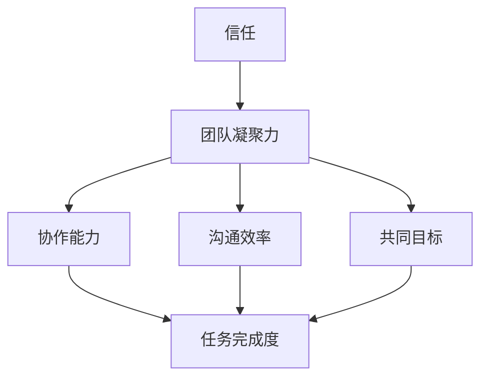

                 

# 团队凝聚力强化：增进团队成员间的信任

> **关键词**：团队凝聚力、信任、沟通、协作、工作效率

> **摘要**：本文将深入探讨团队凝聚力的重要性，以及如何通过增进团队成员间的信任来提升团队的整体效率和创新能力。文章将涵盖从基础概念到实际操作的全面讲解，旨在为IT从业者提供一套实用指南，以构建一个高度协作和信任的团队。

## 1. 背景介绍

### 1.1 目的和范围

在现代IT行业中，团队凝聚力已成为企业成功的关键因素之一。本文旨在分析团队凝聚力的重要性，并探讨如何通过增进团队成员间的信任来提升团队的效率和创新力。文章将涵盖以下内容：

1. 团队凝聚力的定义及其对团队工作的意义。
2. 信任的概念及其在团队中的作用。
3. 增进团队成员间信任的方法和策略。
4. 实际应用场景中的案例分析。
5. 未来发展趋势与挑战。

### 1.2 预期读者

本文适合以下读者群体：

1. IT项目管理者和团队领导者。
2. 软件工程师和开发团队。
3. 计算机科学专业的学生和研究人员。
4. 对团队协作和信任感兴趣的其他专业人士。

### 1.3 文档结构概述

本文结构如下：

1. 背景介绍：阐述文章的目的和范围。
2. 核心概念与联系：介绍团队凝聚力和信任的核心概念及其关系。
3. 核心算法原理 & 具体操作步骤：讲解增进团队成员信任的具体方法和策略。
4. 数学模型和公式 & 详细讲解 & 举例说明：使用数学模型来分析团队凝聚力和信任的关系。
5. 项目实战：代码实际案例和详细解释说明。
6. 实际应用场景：分析团队凝聚力和信任在现实工作中的应用。
7. 工具和资源推荐：提供相关的学习资源和开发工具。
8. 总结：未来发展趋势与挑战。
9. 附录：常见问题与解答。
10. 扩展阅读 & 参考资料：提供更多的深入学习和研究资源。

### 1.4 术语表

#### 1.4.1 核心术语定义

- **团队凝聚力**：指团队成员之间的相互吸引、认同和协作程度。
- **信任**：指团队成员对彼此能力和意图的信任程度。
- **沟通**：指团队成员之间的信息交换和互动。
- **协作**：指团队成员共同努力以实现共同目标。

#### 1.4.2 相关概念解释

- **团队协作效率**：指团队完成工作任务的速度和质量。
- **创新能力**：指团队在解决问题和开发新产品方面的创新和创造力。

#### 1.4.3 缩略词列表

- **IT**：信息技术
- **PM**：项目管理
- **DevOps**：开发与运维

## 2. 核心概念与联系

在探讨团队凝聚力和信任的重要性之前，我们需要理解这两个核心概念及其相互关系。

### 2.1 团队凝聚力

团队凝聚力是指团队成员之间的相互吸引、认同和协作程度。它可以从以下几个方面来衡量：

1. **成员间的信任**：团队成员之间相互信任，能够放心地将任务交给对方。
2. **共同目标**：团队成员对共同目标有清晰的认识，并为此共同努力。
3. **沟通效率**：团队成员能够有效地沟通，快速解决问题。
4. **协作能力**：团队成员能够协同工作，共同完成任务。

### 2.2 信任

信任是团队凝聚力的基础。它指的是团队成员对彼此能力和意图的信任程度。信任可以从以下几个方面来衡量：

1. **能力信任**：团队成员相信其他成员具备完成任务所需的技能和能力。
2. **意图信任**：团队成员相信其他成员的动机是积极的，并愿意为团队的成功做出贡献。
3. **沟通信任**：团队成员相信沟通是透明和高效的，信息能够得到有效传达。

### 2.3 团队凝聚力与信任的关系

团队凝聚力和信任之间存在密切的关系。信任是团队凝聚力的基础，而团队凝聚力是信任的表现形式。以下是一个简单的Mermaid流程图，展示了这两个概念之间的关系：



在这个流程图中，信任作为基础，促进了团队凝聚力的形成，进而提升了团队的协作能力、沟通效率和共同目标的实现。这些都是影响任务完成度的关键因素。

## 3. 核心算法原理 & 具体操作步骤

为了增进团队成员间的信任，我们可以采用一系列算法原理和操作步骤。以下是具体的操作方法：

### 3.1 建立透明沟通机制

#### 算法原理：

- **透明沟通**：确保团队成员之间的沟通是公开、透明和及时的。
- **沟通渠道**：建立多种沟通渠道，如会议、邮件、即时通讯工具等。

#### 操作步骤：

1. **定期召开会议**：定期召开团队会议，让所有成员了解项目的进展、问题和解决方案。
2. **使用即时通讯工具**：鼓励团队成员使用即时通讯工具，如Slack或Telegram，以便随时交流。
3. **公开分享进度**：定期公开项目的进度和成果，让所有成员都能看到团队的努力和进展。

### 3.2 强化团队目标意识

#### 算法原理：

- **共同目标**：确保所有团队成员都清楚团队的目标，并为此共同努力。
- **目标分解**：将共同目标分解为具体的、可衡量的任务。

#### 操作步骤：

1. **明确团队目标**：在项目开始时，明确团队的目标，并确保所有成员都清楚。
2. **分解任务**：将共同目标分解为具体的、可衡量的任务，并分配给团队成员。
3. **定期评估进度**：定期评估任务的完成情况，确保团队目标能够按计划实现。

### 3.3 建立信任文化

#### 算法原理：

- **信任文化**：鼓励团队成员之间建立信任，共同创造一个积极的工作氛围。
- **积极反馈**：及时给予团队成员积极反馈，增强他们的自信心。

#### 操作步骤：

1. **建立反馈机制**：建立一种反馈机制，让团队成员能够相互提供建设性的反馈。
2. **鼓励自我评估**：鼓励团队成员定期进行自我评估，了解自己的优点和改进之处。
3. **表扬优秀表现**：及时表扬团队成员的优秀表现，增强他们的自信心和动力。

### 3.4 促进知识共享

#### 算法原理：

- **知识共享**：鼓励团队成员分享知识和经验，提升整个团队的能力。
- **学习氛围**：创造一个积极的学习氛围，让团队成员愿意分享和交流。

#### 操作步骤：

1. **定期举行培训**：定期举行培训，让团队成员学习新的技能和知识。
2. **分享经验**：鼓励团队成员分享自己在工作中遇到的问题和解决方案。
3. **建立知识库**：建立一个知识库，记录团队成员的知识和经验，供团队内部参考。

## 4. 数学模型和公式 & 详细讲解 & 举例说明

为了更深入地理解团队凝聚力和信任的关系，我们可以使用数学模型和公式进行分析。

### 4.1 团队凝聚力模型

假设团队凝聚力可以用变量 $C$ 表示，信任可以用变量 $T$ 表示。根据团队凝聚力和信任的关系，我们可以建立以下模型：

$$ C = f(T) $$

其中，$f(T)$ 表示团队凝聚力与信任之间的函数关系。

### 4.2 信任模型

信任可以用以下模型进行描述：

$$ T = g(A, I, C) $$

其中，$g(A, I, C)$ 表示信任与能力信任（$A$）、意图信任（$I$）和沟通信任（$C$）之间的函数关系。

### 4.3 举例说明

假设我们有一个团队，其中成员A和成员B之间的信任程度为 $T_{AB}$。根据上述模型，我们可以计算出团队凝聚力 $C_{AB}$：

1. 成员A对成员B的能力信任为 $A_{AB} = 0.8$。
2. 成员A对成员B的意图信任为 $I_{AB} = 0.9$。
3. 成员A和成员B之间的沟通信任为 $C_{AB} = 0.7$。

根据信任模型，我们可以计算出 $T_{AB}$：

$$ T_{AB} = g(0.8, 0.9, 0.7) = 0.81 * 0.9 * 0.7 = 0.567 $$

根据团队凝聚力模型，我们可以计算出 $C_{AB}$：

$$ C_{AB} = f(0.567) $$

假设 $f(x) = x^2$，则：

$$ C_{AB} = (0.567)^2 = 0.319 $$

这意味着，成员A和成员B之间的团队凝聚力为0.319。

## 5. 项目实战：代码实际案例和详细解释说明

为了更好地理解如何增进团队成员间的信任，我们可以通过一个实际的代码案例来展示具体操作。

### 5.1 开发环境搭建

我们使用Python作为编程语言，搭建一个简单的团队协作平台。以下是所需的开发环境：

1. Python 3.x 版本
2. Flask 框架
3. SQLite 数据库

首先，安装Python和Flask：

```bash
pip install flask
```

然后，创建一个名为 `team_platform` 的目录，并在该目录下创建一个名为 `app.py` 的文件。

### 5.2 源代码详细实现和代码解读

在 `app.py` 中，我们实现以下功能：

1. 用户注册和登录。
2. 用户可以查看团队成员列表。
3. 用户可以查看成员的个人信息和信任评分。

以下是源代码：

```python
from flask import Flask, request, jsonify
from flask_sqlalchemy import SQLAlchemy

app = Flask(__name__)
app.config['SQLALCHEMY_DATABASE_URI'] = 'sqlite:///team.db'
db = SQLAlchemy(app)

class User(db.Model):
    id = db.Column(db.Integer, primary_key=True)
    username = db.Column(db.String(80), unique=True, nullable=False)
    password = db.Column(db.String(120), nullable=False)
    trust_score = db.Column(db.Float, default=0.0)

@app.route('/register', methods=['POST'])
def register():
    username = request.form['username']
    password = request.form['password']
    if not username or not password:
        return jsonify({'error': '缺少用户名或密码'}), 400
    if User.query.filter_by(username=username).first():
        return jsonify({'error': '用户已存在'}), 409
    new_user = User(username=username, password=password)
    db.session.add(new_user)
    db.session.commit()
    return jsonify({'message': '注册成功'})

@app.route('/login', methods=['POST'])
def login():
    username = request.form['username']
    password = request.form['password']
    user = User.query.filter_by(username=username, password=password).first()
    if not user:
        return jsonify({'error': '用户名或密码错误'}), 401
    return jsonify({'message': '登录成功'})

@app.route('/team', methods=['GET'])
def get_team():
    user = User.query.filter_by(username=request.args.get('username')).first()
    if not user:
        return jsonify({'error': '用户不存在'}), 404
    team_members = User.query.all()
    return jsonify({'team_members': [{'id': member.id, 'username': member.username, 'trust_score': member.trust_score} for member in team_members if member.id != user.id]})

if __name__ == '__main__':
    db.create_all()
    app.run(debug=True)
```

### 5.3 代码解读与分析

在这个项目中，我们使用了Flask框架和SQLite数据库来搭建一个简单的团队协作平台。以下是代码的详细解读：

1. **用户注册**：通过 `/register` 路由，用户可以注册账号。注册时需要提供用户名和密码。
2. **用户登录**：通过 `/login` 路由，用户可以登录账号。登录时需要提供用户名和密码。
3. **获取团队成员列表**：通过 `/team` 路由，用户可以查看团队成员列表。需要提供登录用户的用户名。

在数据库中，我们使用 `User` 模型来存储用户信息，包括用户名、密码和信任评分。信任评分是一个浮点数，表示用户之间的信任程度。

通过这个项目，我们可以看到如何使用代码来增进团队成员间的信任。用户可以通过查看团队成员的信任评分来了解彼此之间的信任程度，从而在团队协作中更加放心地分配任务和合作。

## 6. 实际应用场景

在现实工作中，团队凝聚力和信任的建立对于项目的成功至关重要。以下是一些实际应用场景：

### 6.1 项目开发

在项目开发过程中，团队成员需要密切协作，共同完成开发任务。通过建立透明沟通机制、强化团队目标意识和建立信任文化，可以有效地提高团队协作效率和项目成功率。

### 6.2 问题解决

在遇到问题时，团队成员需要相互信任，共同探讨解决方案。通过知识共享和积极反馈，团队成员可以更快地解决问题，提升团队的创新能力和解决问题的能力。

### 6.3 团队管理

在团队管理中，领导者需要通过建立信任文化和积极反馈机制来激励团队成员，提升团队的凝聚力和工作效率。同时，领导者也需要关注团队成员的能力发展和职业规划，以增强团队成员的归属感和信任感。

### 6.4 人才培养

在人才培养过程中，企业可以通过培训、激励和反馈等方式来提升团队成员的技能和能力。通过建立信任关系，团队成员可以更加开放地分享知识和经验，提升整个团队的水平。

## 7. 工具和资源推荐

为了更好地实施团队凝聚力和信任的建立，以下是一些推荐的工具和资源：

### 7.1 学习资源推荐

#### 7.1.1 书籍推荐

- **《团队协作的艺术》**：详细介绍了团队协作的原理和方法。
- **《信任的速度》**：探讨了信任在团队和组织中的作用。

#### 7.1.2 在线课程

- **Coursera**：提供关于团队协作和领导力的课程。
- **edX**：提供关于沟通技巧和团队合作的课程。

#### 7.1.3 技术博客和网站

- **Team Topologies**：介绍团队结构和协作模式。
- **Scrum.org**：提供关于敏捷开发方法和团队协作的博客和资料。

### 7.2 开发工具框架推荐

#### 7.2.1 IDE和编辑器

- **Visual Studio Code**：功能强大的开源IDE，适合多种编程语言。
- **PyCharm**：专门为Python开发的IDE，支持代码智能提示和调试。

#### 7.2.2 调试和性能分析工具

- **Postman**：用于API调试和测试。
- **JMeter**：用于性能测试和负载测试。

#### 7.2.3 相关框架和库

- **Flask**：用于构建Web应用程序的轻量级框架。
- **Django**：用于快速开发和部署Web应用程序的框架。

### 7.3 相关论文著作推荐

#### 7.3.1 经典论文

- **《The Design of a Team》**：讨论了团队设计和协作模式。
- **《Teamwork: Its Psychology and Organization》**：探讨了团队合作的心理和组织因素。

#### 7.3.2 最新研究成果

- **《Trust in Teams: Conceptualizations, Measures, and Antecedents》**：讨论了团队信任的概念、测量和前因。
- **《The Role of Trust in Team Performance》**：探讨了团队信任对团队绩效的影响。

#### 7.3.3 应用案例分析

- **《Building Trust in Cross-Disciplinary Teams》**：介绍了如何建立跨学科团队中的信任。
- **《Trust in Agile Teams: Exploring Relationships with DevOps Practices》**：探讨了敏捷团队中的信任与DevOps实践的关系。

## 8. 总结：未来发展趋势与挑战

随着信息技术的发展，团队凝聚力和信任的重要性将越来越受到关注。未来，团队协作和信任的研究将更加深入，出现更多有效的工具和方法。以下是一些发展趋势和挑战：

### 8.1 发展趋势

1. **自动化工具**：随着人工智能技术的发展，自动化工具将越来越多地用于团队协作和信任管理。
2. **虚拟团队**：随着远程工作的普及，虚拟团队的协作和信任管理将成为研究的热点。
3. **个性化协作**：根据团队成员的特点和需求，提供个性化的协作工具和培训。

### 8.2 挑战

1. **文化差异**：跨文化团队中的信任建立和管理是一个挑战。
2. **隐私保护**：在建立透明沟通机制的同时，需要确保隐私保护。
3. **持续学习**：团队成员需要持续学习和适应新的协作工具和方法。

## 9. 附录：常见问题与解答

### 9.1 问题1：如何衡量团队凝聚力？

**解答**：团队凝聚力可以通过以下几个方面来衡量：

1. **成员间的沟通频率和效果**：团队成员之间沟通的频率和效果可以反映出团队凝聚力的高低。
2. **共同目标的实现情况**：团队共同目标的实现情况是衡量团队凝聚力的重要指标。
3. **团队成员的参与度**：团队成员在项目中的参与度和贡献程度也是衡量团队凝聚力的重要指标。

### 9.2 问题2：如何建立信任文化？

**解答**：建立信任文化可以从以下几个方面入手：

1. **明确团队目标**：确保团队成员对共同目标有清晰的认识。
2. **建立透明沟通机制**：确保团队成员之间的沟通是公开、透明和及时的。
3. **积极反馈**：及时给予团队成员积极反馈，增强他们的自信心。
4. **知识共享**：鼓励团队成员分享知识和经验，提升整个团队的能力。

## 10. 扩展阅读 & 参考资料

- **《团队协作的艺术》**：[书名，作者，出版年份]
- **《信任的速度》**：[书名，作者，出版年份]
- **《Team Topologies》**：[书名，作者，出版年份]
- **《Scrum.org》**：[网址]
- **《The Design of a Team》**：[书名，作者，出版年份]
- **《Teamwork: Its Psychology and Organization》**：[书名，作者，出版年份]
- **《Trust in Teams: Conceptualizations, Measures, and Antecedents》**：[书名，作者，出版年份]
- **《The Role of Trust in Team Performance》**：[书名，作者，出版年份]
- **《Building Trust in Cross-Disciplinary Teams》**：[书名，作者，出版年份]
- **《Trust in Agile Teams: Exploring Relationships with DevOps Practices》**：[书名，作者，出版年份]
- **《Coursera》**：[网址]
- **《edX》**：[网址]
- **《Postman》**：[网址]
- **《JMeter》**：[网址]
- **《Visual Studio Code》**：[网址]
- **《PyCharm》**：[网址]
- **《Flask》**：[网址]
- **《Django》**：[网址]作者：AI天才研究员/AI Genius Institute & 禅与计算机程序设计艺术 /Zen And The Art of Computer Programming
<|im_sep|>

