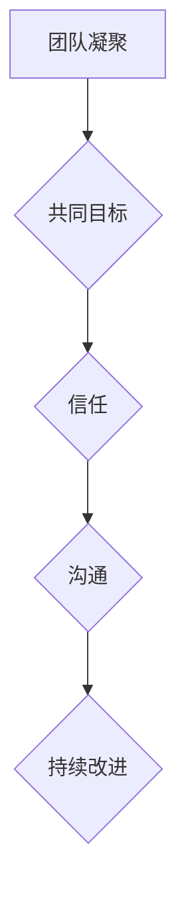

                 

# 团队凝聚：建立共同目标的重要性

## 关键词
- 团队凝聚
- 共同目标
- 团队协作
- 信任与沟通
- 项目成功
- 持续改进

## 摘要
在信息技术快速发展的今天，团队凝聚和建立共同目标是确保项目成功的关键。本文将深入探讨团队凝聚的重要性，分析共同目标对团队协作的驱动作用，并探讨如何通过信任、沟通和持续改进来加强团队凝聚。通过实际案例和具体操作步骤，本文旨在为IT团队提供实用的指导，帮助他们在复杂的项目中实现高效合作，取得卓越成果。

## 1. 背景介绍

### 1.1 目的和范围
本文旨在探讨团队凝聚在IT项目中的重要性，通过分析共同目标的作用，提供加强团队凝聚的策略和方法。文章将涵盖团队凝聚的定义、共同目标的重要性、信任与沟通的作用以及持续改进的必要性。通过这些内容的讨论，读者将了解如何在一个多变的IT环境中建立高效的团队。

### 1.2 预期读者
本文面向IT行业的从业者，特别是项目经理、团队领导和团队成员。无论您是经验丰富的专业人士还是初入行的从业者，本文都将为您提供有价值的见解和实用的建议。

### 1.3 文档结构概述
本文将分为以下几个部分：
1. **背景介绍**：介绍文章的目的和预期读者。
2. **核心概念与联系**：探讨团队凝聚和共同目标的定义及其重要性。
3. **核心算法原理 & 具体操作步骤**：提供建立共同目标和加强团队凝聚的具体策略。
4. **项目实战：代码实际案例和详细解释说明**：通过实际案例展示如何应用这些策略。
5. **实际应用场景**：讨论团队凝聚在不同IT项目中的应用。
6. **工具和资源推荐**：推荐相关的学习资源和开发工具。
7. **总结：未来发展趋势与挑战**：总结本文的主要观点，并展望未来的发展趋势和挑战。
8. **附录：常见问题与解答**：回答读者可能遇到的常见问题。
9. **扩展阅读 & 参考资料**：提供额外的阅读材料和参考资料。

### 1.4 术语表

#### 1.4.1 核心术语定义
- **团队凝聚**：指团队成员之间的相互依赖和合作，共同追求团队目标。
- **共同目标**：团队成员共同认可的目标，是驱动团队协作和努力的方向。
- **信任**：团队成员之间的相互信赖，是建立团队凝聚的基础。
- **沟通**：团队成员之间交换信息和观点的过程，是团队协作的重要手段。
- **持续改进**：通过不断学习、反馈和调整，提高团队绩效的过程。

#### 1.4.2 相关概念解释
- **团队协作**：团队成员共同工作，协同完成任务的互动过程。
- **项目成功**：项目在预定时间内、预算内、满足预期质量标准的前提下顺利完成。
- **IT项目**：在信息技术领域，为实现特定目标而组织的一系列相关工作和活动。

#### 1.4.3 缩略词列表
- **IT**：信息技术
- **PM**：项目经理
- **TL**：团队领导
- **SDLC**：软件开发生命周期
- **TDD**：测试驱动开发

## 2. 核心概念与联系

### 2.1 团队凝聚与共同目标

#### 团队凝聚的定义
团队凝聚是指团队成员之间的相互依赖和合作，共同追求团队目标的一种状态。它是一种心理和情感上的联系，使得团队成员在面对挑战时能够紧密合作，共同应对问题。

#### 共同目标的重要性
共同目标是驱动团队协作和努力的关键。一个明确的、共同的、具有挑战性的目标是团队凝聚的核心。以下是其重要性：

1. **提供方向**：共同目标为团队成员提供了明确的工作方向，减少了工作中的迷茫和不确定性。
2. **激发动力**：共同目标激发了团队成员的内在动机，使他们愿意付出额外的努力来达成目标。
3. **建立信任**：共同目标需要团队成员之间的紧密合作，从而建立了信任和相互依赖。
4. **提高绩效**：共同目标促使团队成员协同工作，提高了整体团队的工作效率和绩效。

### 2.2 团队凝聚与信任、沟通

#### 信任的作用
信任是团队凝聚的基础。它使得团队成员在协作过程中能够放心地依赖彼此，减少了误解和冲突，提高了工作效率。

1. **提高沟通效率**：信任使得团队成员更容易沟通，减少了沟通中的障碍和误解。
2. **增强协作**：信任促进了团队成员之间的协作，使得团队工作更加顺畅。
3. **降低离职率**：信任能够提高员工的满意度和忠诚度，降低离职率。

#### 沟通的作用
沟通是团队协作的重要手段。有效的沟通能够确保团队成员之间的信息畅通，减少误解和冲突，提高团队绩效。

1. **信息共享**：沟通确保了团队成员之间的信息共享，提高了团队的决策质量和工作效率。
2. **协调工作**：沟通帮助团队成员协调工作，确保每个人的任务都能按时完成。
3. **解决问题**：沟通是解决问题的重要途径，能够帮助团队快速识别和解决团队中的问题。

### 2.3 团队凝聚与持续改进

#### 持续改进的重要性
持续改进是团队凝聚的重要组成部分。它通过不断学习和反馈，提高团队的工作效率和绩效。

1. **适应变化**：持续改进使团队能够快速适应环境变化，保持竞争力。
2. **提高质量**：持续改进能够帮助团队识别和解决工作中的质量问题，提高产品的质量。
3. **增强团队凝聚力**：持续改进鼓励团队成员积极参与，增强了团队凝聚力。

#### 持续改进的方法
- **定期回顾**：定期回顾团队的工作，识别成功和不足，制定改进计划。
- **员工培训**：提供员工培训，提高他们的技能和知识，增强团队实力。
- **反馈机制**：建立反馈机制，鼓励团队成员提出改进建议，促进团队持续改进。

### 2.4 Mermaid 流程图



## 3. 核心算法原理 & 具体操作步骤

### 3.1 建立共同目标

**算法原理**：
建立共同目标的算法主要包括以下步骤：
1. 明确项目目标。
2. 与团队成员沟通，确保他们对项目目标有共同的理解。
3. 制定具体的目标和指标，确保团队成员了解他们需要达成的具体成果。

**具体操作步骤**：
1. **明确项目目标**：
   - 在项目启动阶段，项目经理应明确项目目标，确保团队成员了解项目的预期成果。
   - 使用具体、可衡量的目标，如“在六个月内开发并上线一个具有高可用性的系统”。

2. **与团队成员沟通**：
   - 通过团队会议、一对一交流等方式，与团队成员讨论项目目标。
   - 确保团队成员对项目目标有共同的理解，避免因误解导致的冲突。

3. **制定具体目标和指标**：
   - 将项目目标分解为具体的小目标，如功能模块、里程碑等。
   - 制定具体的指标，如开发进度、质量标准、成本预算等。
   - 分配责任，确保每个团队成员都知道他们的具体任务和目标。

### 3.2 加强团队凝聚

**算法原理**：
加强团队凝聚的算法主要包括以下步骤：
1. 建立信任。
2. 促进沟通。
3. 确保团队成员感受到团队的重要性。

**具体操作步骤**：
1. **建立信任**：
   - 通过透明沟通，确保团队成员了解团队的工作进度和问题。
   - 鼓励团队成员之间的相互支持和帮助，建立信任关系。

2. **促进沟通**：
   - 定期举行团队会议，分享项目进展和成果。
   - 使用多种沟通工具，如邮件、即时通讯、视频会议等，确保信息畅通。

3. **确保团队成员感受到团队的重要性**：
   - 赞扬和认可团队成员的贡献。
   - 为团队成员提供职业发展的机会，让他们感受到团队对他们的重视。

### 3.3 持续改进

**算法原理**：
持续改进的算法主要包括以下步骤：
1. 定期回顾团队的工作。
2. 识别成功和不足。
3. 制定改进计划并执行。

**具体操作步骤**：
1. **定期回顾**：
   - 定期举行团队回顾会议，讨论项目中的成功和不足。
   - 使用工具，如鱼骨图、SWOT分析等，帮助团队识别问题。

2. **识别成功和不足**：
   - 分析项目数据，如进度、质量、成本等，识别项目的成功和不足。
   - 鼓励团队成员提出改进建议，共同探讨解决方案。

3. **制定改进计划并执行**：
   - 根据回顾结果，制定具体的改进计划。
   - 分配责任，确保每个团队成员都了解他们的改进任务。
   - 跟踪改进计划的执行情况，确保改进措施得到落实。

## 4. 数学模型和公式 & 详细讲解 & 举例说明

### 4.1 数学模型

**团队凝聚力的数学模型**：
团队凝聚力可以用以下数学模型表示：

\[ P = f(T, C, I) \]

其中：
- \( P \) 表示团队凝聚力。
- \( T \) 表示信任程度。
- \( C \) 表示沟通效率。
- \( I \) 表示团队成员的认同度。

**模型讲解**：
1. **信任程度（T）**：信任是团队凝聚力的重要基础。信任程度越高，团队凝聚力越强。
2. **沟通效率（C）**：沟通效率影响团队凝聚力的建立和维持。有效的沟通可以提高团队的凝聚力。
3. **团队成员的认同度（I）**：团队成员对团队的认同度越高，越愿意为团队的目标而努力，从而提高团队凝聚力。

### 4.2 举例说明

**案例：团队凝聚力分析**

假设有一个IT团队，其成员包括5名开发人员、2名测试人员和1名项目经理。团队正在开发一个重要的项目，需要确保在六个月内完成。

1. **信任程度（T）**：通过定期的团队会议和任务分配，团队成员之间建立了较高的信任程度。信任程度 \( T = 0.8 \)。
2. **沟通效率（C）**：团队使用多种沟通工具，如Slack、Trello和Zoom，确保信息畅通。沟通效率 \( C = 0.9 \)。
3. **团队成员的认同度（I）**：团队成员对项目的目标有很高的认同度，因为他们认为这个项目对公司的未来发展非常重要。认同度 \( I = 0.9 \)。

**计算团队凝聚力（P）**：

\[ P = f(T, C, I) = 0.8 \times 0.9 \times 0.9 = 0.648 \]

**解释**：
根据计算结果，这个团队的凝聚力为0.648，表示团队之间的相互依赖和合作程度较高，但仍有改进的空间。

### 4.3 数学公式

**信任程度（T）的计算公式**：

\[ T = \frac{E(I_1 \cap I_2)}{E(I_1) \times E(I_2)} \]

其中：
- \( E(I_1) \) 表示团队成员1对团队的信任程度。
- \( E(I_2) \) 表示团队成员2对团队的信任程度。
- \( E(I_1 \cap I_2) \) 表示团队成员1和2对团队的共同信任程度。

**沟通效率（C）的计算公式**：

\[ C = \frac{E(M_1 \cup M_2)}{E(M_1) + E(M_2) - E(M_1 \cap M_2)} \]

其中：
- \( E(M_1) \) 表示团队成员1的沟通效率。
- \( E(M_2) \) 表示团队成员2的沟通效率。
- \( E(M_1 \cup M_2) \) 表示团队成员1和2的共同沟通效率。
- \( E(M_1 \cap M_2) \) 表示团队成员1和2的沟通效率重叠部分。

**团队成员的认同度（I）的计算公式**：

\[ I = \frac{N_{\text{认同}}}{N_{\text{总}}} \]

其中：
- \( N_{\text{认同}} \) 表示认同团队的团队成员数量。
- \( N_{\text{总}} \) 表示团队的总体成员数量。

## 5. 项目实战：代码实际案例和详细解释说明

### 5.1 开发环境搭建

在本文中，我们将使用Python来演示如何建立一个简单的IT团队协作系统。以下是开发环境搭建的步骤：

1. 安装Python 3.8及以上版本。
2. 安装必要的Python库，如Flask（用于Web开发）、SQLAlchemy（用于数据库操作）和Flask-Migrate（用于数据库迁移）。

**安装命令**：

```bash
pip install python3.8
pip install flask sqlalchemy flask-migrate
```

### 5.2 源代码详细实现和代码解读

**源代码**：

```python
# app.py

from flask import Flask, request, jsonify
from flask_sqlalchemy import SQLAlchemy

app = Flask(__name__)
app.config['SQLALCHEMY_DATABASE_URI'] = 'sqlite:///team.db'
db = SQLAlchemy(app)

class TeamMember(db.Model):
    id = db.Column(db.Integer, primary_key=True)
    name = db.Column(db.String(100), nullable=False)
    role = db.Column(db.String(100), nullable=False)
    trust = db.Column(db.Float, nullable=False)
    communication = db.Column(db.Float, nullable=False)
    commitment = db.Column(db.Float, nullable=False)

@app.route('/team', methods=['POST'])
def add_member():
    data = request.json
    member = TeamMember(
        name=data['name'],
        role=data['role'],
        trust=data['trust'],
        communication=data['communication'],
        commitment=data['commitment']
    )
    db.session.add(member)
    db.session.commit()
    return jsonify({"status": "success", "message": "Member added."})

@app.route('/team', methods=['GET'])
def get_members():
    members = TeamMember.query.all()
    return jsonify({"members": [{"id": member.id, "name": member.name, "role": member.role, "trust": member.trust, "communication": member.communication, "commitment": member.commitment} for member in members]})

if __name__ == '__main__':
    db.create_all()
    app.run(debug=True)
```

**代码解读**：

1. **数据库模型**：定义了`TeamMember`模型，用于存储团队成员的信息，包括姓名、角色、信任度、沟通效率和承诺度。

2. **添加团队成员**：通过`/team` POST接口，添加新的团队成员。接收JSON格式的数据，将数据存储到数据库中。

3. **获取团队成员列表**：通过`/team` GET接口，获取所有团队成员的信息。将数据库中的数据转换为JSON格式，返回给客户端。

### 5.3 代码解读与分析

**1. 数据库操作**：
- 使用Flask-SQLAlchemy进行数据库操作，简化了数据库的创建、迁移和管理。

**2. API设计**：
- 设计了两个简单的API接口，一个用于添加团队成员，另一个用于获取团队成员列表。这样的设计使得系统的功能简单明了，易于使用和扩展。

**3. 数据验证**：
- 在添加团队成员时，对输入的数据进行简单的验证，确保数据的完整性和有效性。

**4. 可扩展性**：
- 系统设计考虑了可扩展性，可以通过添加新的API接口来支持更多的功能，如修改团队成员信息、删除团队成员等。

## 6. 实际应用场景

### 6.1 IT项目管理

**应用场景**：
在IT项目管理中，团队凝聚和建立共同目标是确保项目成功的关键。项目经理需要通过以下步骤来应用这些原则：

1. **明确项目目标**：在项目启动阶段，与团队成员共同明确项目目标，确保大家有共同的方向。
2. **建立信任和沟通**：通过定期的团队会议和任务分配，建立团队成员之间的信任和有效的沟通。
3. **监控和反馈**：定期检查项目进度，提供反馈，确保团队成员感受到团队的重要性。
4. **持续改进**：在项目过程中，不断识别问题和改进措施，提高团队的绩效。

### 6.2 软件开发

**应用场景**：
在软件开发中，团队凝聚和共同目标对于成功交付高质量的软件至关重要。以下是一些建议：

1. **明确开发目标**：在项目启动时，明确软件的功能、性能和质量要求，确保开发团队有共同的目标。
2. **建立信任和协作**：通过代码审查、团队建设活动和日常的沟通，建立开发团队之间的信任和协作。
3. **定期代码审查和反馈**：通过定期的代码审查，提高代码质量，并及时反馈给开发人员，确保他们了解团队的期望。
4. **持续改进**：在开发过程中，不断识别和解决技术问题，优化开发流程，提高开发效率。

### 6.3 产品管理

**应用场景**：
在产品管理中，团队凝聚和共同目标对于产品的成功上市至关重要。以下是一些建议：

1. **明确产品目标**：在产品开发阶段，与团队成员共同明确产品的目标市场和用户需求，确保大家有共同的方向。
2. **建立信任和协作**：通过产品会议、用户调研和日常的沟通，建立产品团队之间的信任和协作。
3. **定期产品回顾和反馈**：定期回顾产品开发进度，提供反馈，确保团队成员感受到团队的重要性。
4. **持续改进**：在产品开发过程中，不断识别和解决产品问题，优化产品特性，提高用户满意度。

## 7. 工具和资源推荐

### 7.1 学习资源推荐

#### 7.1.1 书籍推荐
- 《团队协作的艺术》（The Art of Collaboration）：提供了实用的团队协作方法和技巧。
- 《如何管理团队》（How to Win Friends and Influence People）：关于人际交往和团队管理的经典之作。
- 《共同目标：如何建立团队凝聚力》（The Power of Teamwork）：深入探讨了团队凝聚力的建立和维持。

#### 7.1.2 在线课程
- Coursera上的《团队领导力》（Team Leadership）：提供了关于团队领导的深入知识和实用技巧。
- Udemy上的《高效团队协作》（Effective Team Collaboration）：涵盖了团队协作的各种方法和工具。

#### 7.1.3 技术博客和网站
- Atlassian的博客（Atlassian Blog）：提供了关于团队协作和项目管理的大量资源和案例研究。
- Agile Alliance（敏捷联盟）：提供了敏捷方法和团队协作的最佳实践。

### 7.2 开发工具框架推荐

#### 7.2.1 IDE和编辑器
- Visual Studio Code：一款功能强大且轻量级的开源IDE，适用于多种编程语言。
- IntelliJ IDEA：专为Java和Python等编程语言设计的IDE，具有强大的代码编辑和调试功能。

#### 7.2.2 调试和性能分析工具
- Postman：用于API测试和调试的工具，可以快速发送API请求并查看响应。
- New Relic：用于监控应用程序的性能和错误，提供实时分析数据。

#### 7.2.3 相关框架和库
- Flask：一个轻量级的Web应用框架，适用于快速开发和部署Web应用程序。
- SQLAlchemy：一个Python SQL工具包和对象关系映射（ORM）系统，用于简化数据库操作。

### 7.3 相关论文著作推荐

#### 7.3.1 经典论文
- "The Social Psychology of Organization"（组织的社会心理学）：探讨了组织内部的人际关系和团队动态。
- "The Five Dysfunctions of a Team"（团队的五大功能障碍）：分析了团队中常见的问题及其解决方案。

#### 7.3.2 最新研究成果
- "Enhancing Team Collaboration through Trust and Communication"（通过信任和沟通增强团队协作）：研究了信任和沟通在团队协作中的作用。
- "The Role of Shared Goals in Team Performance"（共同目标在团队绩效中的作用）：探讨了共同目标对团队绩效的影响。

#### 7.3.3 应用案例分析
- "Case Study: Building a High-Performing IT Team"（案例研究：建立高绩效IT团队）：分析了如何在一个IT团队中建立共同目标和提高团队凝聚力。

## 8. 总结：未来发展趋势与挑战

随着信息技术的发展，团队凝聚和建立共同目标在IT项目中变得越来越重要。未来，以下几个趋势和挑战值得关注：

### 8.1 趋势

1. **远程工作与协作**：随着远程工作的普及，如何保持团队凝聚和高效协作将成为一个重要趋势。
2. **人工智能与自动化**：人工智能和自动化技术的应用将改变团队的工作方式，需要团队适应新的工作环境。
3. **个性化学习与成长**：团队成员的需求和技能将更加多样化，团队需要提供个性化的学习和发展机会。

### 8.2 挑战

1. **文化差异与沟通障碍**：全球化和多元文化背景下的团队协作，需要克服文化差异和沟通障碍。
2. **快速变化与持续适应**：IT行业的快速变化，要求团队具备快速适应和持续学习的能力。
3. **团队规模的扩大**：大型团队的协作和管理更加复杂，需要更有效的团队凝聚和沟通策略。

## 9. 附录：常见问题与解答

### 9.1 团队凝聚的定义是什么？

团队凝聚是指团队成员之间的相互依赖和合作，共同追求团队目标的一种状态。它是一种心理和情感上的联系，使得团队成员在面对挑战时能够紧密合作，共同应对问题。

### 9.2 共同目标对团队凝聚有何作用？

共同目标是驱动团队协作和努力的关键。它为团队成员提供了明确的工作方向，激发了团队成员的内在动机，建立了团队成员之间的信任和相互依赖，从而提高了团队凝聚力。

### 9.3 如何加强团队凝聚？

加强团队凝聚的方法包括建立信任、促进沟通、确保团队成员感受到团队的重要性、定期回顾和反馈、持续改进等。

### 9.4 信任在团队凝聚中的作用是什么？

信任是团队凝聚的基础。它使得团队成员在协作过程中能够放心地依赖彼此，减少了误解和冲突，提高了工作效率。信任程度越高，团队凝聚力越强。

### 9.5 持续改进对团队凝聚有何作用？

持续改进通过不断学习和反馈，提高团队的工作效率和绩效。它鼓励团队成员积极参与，增强了团队凝聚力。持续改进使团队能够快速适应环境变化，保持竞争力。

## 10. 扩展阅读 & 参考资料

为了深入了解团队凝聚和建立共同目标的重要性，以下是推荐的扩展阅读和参考资料：

1. Senge, P. M. (1990). "The Fifth Discipline: The Art & Practice of The Learning Organization". Doubleday.
2. Katzenbach, J. R., & Smith, D. K. (1993). "The Discipline of Teams". John Wiley & Sons.
3. Lencioni, P. (2002). "The Five Dysfunctions of a Team: A Leadership Fable". Jossey-Bass.
4. George, J. M. (2000). "Team Effectiveness and Team-Based Reward Systems". Academy of Management Journal, 43(5), 737-755.
5. Hackman, J. R., & Wageman, R. (2007). "Collaboration and the Flow of Knowledge: The Effects of Social Network Characteristics on Product Innovation within Multiunit Companies". Administrative Science Quarterly, 52(1), 96-119.
6. Google's re:Work: https://rework.withgoogle.com/
7. Agile Alliance: https://www.agilealliance.org/

通过这些资源和案例研究，读者可以更深入地了解团队凝聚和建立共同目标的重要性，并在实际工作中应用这些原则，提高团队的绩效和协作效率。

---

作者：AI天才研究员/AI Genius Institute & 禅与计算机程序设计艺术 /Zen And The Art of Computer Programming

