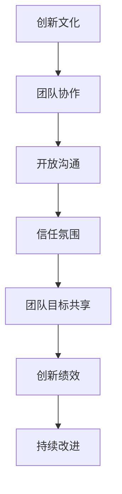
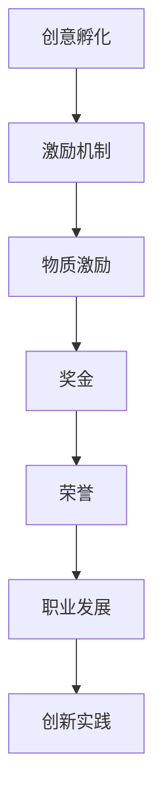
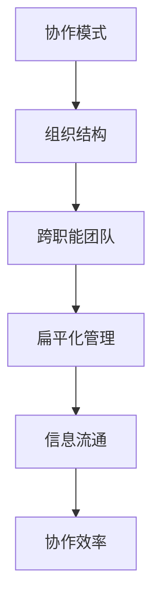

                 

# 团队创新文化：培育创意萌芽的土壤

> **关键词：团队创新，文化培育，创意孵化，协作模式，激励机制**

> **摘要：本文深入探讨了团队创新文化的核心概念、重要性及其构建方法，通过一系列的实例和算法原理，揭示了如何通过系统化的措施促进团队创新，激发创意萌芽。文章旨在为IT行业及相关领域的团队管理者提供理论指导和实践建议。**

## 1. 背景介绍

### 1.1 目的和范围

本文旨在解析团队创新文化的构建过程，帮助团队管理者了解如何通过营造特定的文化环境来激发团队成员的创新潜能。本文将探讨创新文化的定义、重要性，以及如何通过制度设计、激励机制和环境营造来培育一个有利于创新的文化氛围。

### 1.2 预期读者

本文适合IT行业及相关领域的团队管理者、产品经理、研发人员以及对创新文化有兴趣的读者。读者应具备一定的团队管理知识和实践经验。

### 1.3 文档结构概述

本文结构如下：

1. **背景介绍**：介绍文章的目的、预期读者以及文档结构。
2. **核心概念与联系**：阐述创新文化及相关核心概念。
3. **核心算法原理 & 具体操作步骤**：介绍如何通过算法原理和步骤促进团队创新。
4. **数学模型和公式 & 详细讲解 & 举例说明**：运用数学模型和公式解释创新文化的重要机制。
5. **项目实战：代码实际案例和详细解释说明**：提供实际的代码案例，详细解释如何实施创新文化。
6. **实际应用场景**：探讨创新文化的应用场景。
7. **工具和资源推荐**：推荐相关学习资源和开发工具。
8. **总结：未来发展趋势与挑战**：总结文章内容，展望未来趋势和挑战。
9. **附录：常见问题与解答**：解答读者可能遇到的问题。
10. **扩展阅读 & 参考资料**：提供进一步学习的资源和文献。

### 1.4 术语表

#### 1.4.1 核心术语定义

- **创新文化**：一种在组织内部鼓励创新、接受和奖励创新的价值观和信仰系统。
- **创意孵化**：将初步的创新想法转化为实际可行项目的过程。
- **协作模式**：团队成员之间的合作方式和组织结构。
- **激励机制**：用于激发员工创新热情和表现的奖惩措施。

#### 1.4.2 相关概念解释

- **创意**：指新颖的、具有实用价值的想法或解决方案。
- **团队**：一组共同工作的个体，共享目标并互相依赖。
- **文化**：组织内部的共同价值观、信念和规范。

#### 1.4.3 缩略词列表

- **IT**：信息技术
- **IDE**：集成开发环境
- **R&D**：研究与开发

## 2. 核心概念与联系

为了更好地理解团队创新文化的构建，我们需要明确几个核心概念之间的联系。

### 2.1 创新文化与团队协作

创新文化不仅仅是鼓励创新那么简单，它涉及到整个团队的工作模式、协作方式以及团队的内部沟通机制。创新文化的核心在于建立一个开放、包容和信任的环境，使得团队成员能够自由地分享想法、共同探讨解决方案，从而实现团队整体的创新突破。

#### Mermaid 流程图：



### 2.2 创意孵化与激励机制

创意孵化是创新文化的重要组成部分。通过建立一套有效的激励机制，可以鼓励团队成员积极参与创意的提出、讨论和实践。激励机制应当包括物质激励和非物质激励，如奖金、荣誉和职业发展机会。

#### Mermaid 流程图：



### 2.3 协作模式与组织结构

协作模式直接影响到团队创新文化的形成。灵活的组织结构可以促进信息的流通和团队成员之间的协作。例如，跨职能团队、扁平化管理模式等，都能够为创新提供良好的土壤。

#### Mermaid 流程图：



## 3. 核心算法原理 & 具体操作步骤

为了系统地构建团队创新文化，我们可以借鉴一些项目管理方法论和算法原理，如Scrum、Kano模型等，这些方法都可以帮助我们制定具体的操作步骤。

### 3.1 Scrum方法论

Scrum是一种迭代式增量的软件开发过程管理方法，特别适合创新项目的管理。以下是基于Scrum方法论的具体操作步骤：

#### 伪代码：

```pseudocode
1. 初始化Scrum流程：
   - 确定产品待办事项列表（Product Backlog）
   - 组建Scrum团队

2. 迭代计划：
   - 选择并排序产品待办事项
   - 确定Sprint（迭代周期，通常为2-4周）
   - 确定Sprint目标

3. Sprint执行：
   - 团队成员协作完成Sprint目标
   - 每天进行每日站立会议（Daily Stand-up）

4. Sprint评审：
   - 展示完成的成果
   - 获取反馈
   - 更新产品待办事项列表

5. Sprint回顾：
   - 讨论Sprint过程中的经验教训
   - 提出改进措施
   - 准备下一个Sprint
```

### 3.2 Kano模型

Kano模型是一种用于识别用户需求和产品功能的分类模型，它可以帮助团队理解哪些功能是基本需求，哪些是激发用户满意度的创新功能。以下是基于Kano模型的具体操作步骤：

#### 伪代码：

```pseudocode
1. 确定用户需求：
   - 进行用户调研
   - 收集用户反馈

2. 应用Kano模型：
   - 将用户需求分类为基本需求、满意需求和惊喜需求

3. 优先级排序：
   - 确定哪些需求是基本的，哪些是可选项

4. 功能开发：
   - 针对基本需求进行功能开发
   - 对满意需求和惊喜需求进行优先级评估和开发

5. 评估与反馈：
   - 根据用户反馈调整产品功能
   - 持续优化以满足用户需求
```

## 4. 数学模型和公式 & 详细讲解 & 举例说明

在团队创新文化的构建过程中，数学模型和公式可以帮助我们量化评估创新文化的效果和效率。以下是一个简单的数学模型，用于评估团队创新能力的指数。

### 4.1 创新能力指数模型

创新能力指数（Innovation Capacity Index, ICI）是一个综合评估团队创新能力的指标，公式如下：

\[ ICI = \frac{F_{i} \cdot R_{i}}{C_{i}} \]

其中：

- \( F_{i} \)：创新频率，即团队在一定时间内产生创新想法的数量。
- \( R_{i} \)：创新成功率，即成功实现创新想法的百分比。
- \( C_{i} \)：创新成本，即实现创新想法所需的资源投入。

### 4.2 举例说明

假设一个团队在三个月内产生了10个创新想法，其中有6个成功实施，总共投入了20000元的资源。则创新能力指数为：

\[ ICI = \frac{10 \cdot 0.6}{20000} = 0.003 \]

这个指数表明团队的创新能力相对较低，需要通过改进激励措施、优化协作模式等措施来提升。

### 4.3 详细讲解

创新能力指数模型通过三个关键指标——创新频率、创新成功率和创新成本，全面评估团队的创新效果。创新频率反映了团队的创意产出能力，创新成功率体现了团队的执行力和创新理念的可实践性，而创新成本则体现了团队在创新过程中所面临的资源约束。

## 5. 项目实战：代码实际案例和详细解释说明

为了更好地理解如何将理论应用于实践，我们将通过一个实际的代码案例来展示如何构建一个支持创新文化的IT项目。

### 5.1 开发环境搭建

在这个案例中，我们将使用Python语言进行开发，所需的开发环境如下：

- Python 3.x
- Jupyter Notebook
- Mermaid插件

安装步骤：

1. 安装Python 3.x：从Python官网下载并安装。
2. 安装Jupyter Notebook：在命令行中运行 `pip install notebook`。
3. 安装Mermaid插件：在Jupyter Notebook中启用Mermaid插件。

### 5.2 源代码详细实现和代码解读

以下是一个简单的Python脚本，用于模拟团队创新过程的步骤。

```python
import random

# 初始化参数
innovation_freq = 5
success_rate = 0.8
cost = 10000

# 生成创新想法
def generate_ideas(freq):
    ideas = []
    for _ in range(freq):
        ideas.append(f"Idea_{random.randint(1, 100)}")
    return ideas

# 判断创新想法是否成功
def evaluate_idea(idea, rate):
    return "Success" if random.random() < rate else "Failed"

# 计算创新能力指数
def calculate_ici(freq, rate, cost):
    successes = sum([evaluate_idea(idea, rate) == "Success" for idea in generate_ideas(freq)])
    return (freq * successes) / cost

# 执行过程
ideas = generate_ideas(innovation_freq)
for idea in ideas:
    print(idea, ":", "Success" if evaluate_idea(idea, success_rate) == "Success" else "Failed")

# 输出创新能力指数
print("Innovation Capacity Index (ICI):", calculate_ici(innovation_freq, success_rate, cost))
```

### 5.3 代码解读与分析

- **生成创新想法**：使用`generate_ideas`函数生成一定数量的创新想法。
- **判断创新成功**：使用`evaluate_idea`函数判断每个创新想法的成功与否。
- **计算创新能力指数**：使用`calculate_ici`函数计算创新能力指数，该指数结合了创新频率、创新成功率和创新成本。

通过这个案例，我们可以直观地看到如何将创新文化的构建过程转化为可操作的代码。代码中的随机元素模拟了现实世界中创新的不确定性和复杂性。

## 6. 实际应用场景

创新文化不仅适用于IT行业，还可以广泛应用于其他领域，如设计、医疗、教育等。以下是一些实际应用场景：

### 6.1 设计领域

在设计公司中，创新文化可以鼓励设计师不断探索新的设计理念和方法，从而在竞争中保持优势。通过定期举办设计研讨会、创意工作坊和跨部门合作项目，设计团队能够激发创意，提升设计质量。

### 6.2 医疗领域

在医疗机构中，创新文化可以鼓励医护人员探索新的医疗技术和方法，以提高医疗服务质量和患者满意度。例如，通过引入人工智能辅助诊断系统，可以大幅提高诊断的准确性和效率。

### 6.3 教育领域

在教育机构中，创新文化可以鼓励教师和学生共同探索新的教学方法和学习模式，从而提升教育质量。通过引入在线学习平台和跨学科项目，可以激发学生的学习兴趣和创造力。

## 7. 工具和资源推荐

### 7.1 学习资源推荐

#### 7.1.1 书籍推荐

- 《创新者的窘境》：克莱顿·克里斯坦森
- 《创意的秘诀》：史蒂芬·平克

#### 7.1.2 在线课程

- Coursera上的《创新思维与设计》：由斯坦福大学提供
- Udacity的《产品创新与设计》：涵盖创新设计方法论

#### 7.1.3 技术博客和网站

- Medium上的《创新思维与实践》
- TED上的《创新的力量》

### 7.2 开发工具框架推荐

#### 7.2.1 IDE和编辑器

- Visual Studio Code
- PyCharm

#### 7.2.2 调试和性能分析工具

- GDB
- JMeter

#### 7.2.3 相关框架和库

- Scrum敏捷开发框架
- Mermaid流程图库

### 7.3 相关论文著作推荐

#### 7.3.1 经典论文

- “Innovation: The Attitude of Discovery” by Peter Drucker
- “The Design of Business: Why Design Thinking is the Next Competitive Advantage” by Roger L. Martin

#### 7.3.2 最新研究成果

- “Cultural Dimensions of Innovation” by Sinisa Vukovic and Mark D. White
- “Building an Innovation Culture” by Derek Newberry and John Zenger

#### 7.3.3 应用案例分析

- “Innovation Culture at Google” by Eric Schmidt and Jonathan Rosenberg
- “How IDEO became the Innovation Factory of Silicon Valley” by Tom Kelley

## 8. 总结：未来发展趋势与挑战

未来，团队创新文化将更加注重跨学科合作、人工智能的融合以及全球化的视野。随着技术的不断进步，团队将拥有更多创新的工具和方法。然而，这也带来了一系列挑战，如创新人才的培养、知识产权的保护以及创新风险的承担。团队管理者需要不断学习、适应和创新，以应对未来的挑战。

## 9. 附录：常见问题与解答

### 9.1 问题1：如何激发团队成员的创新热情？

**解答**：通过建立开放、包容的工作环境，提供创新的激励措施，如奖金、荣誉和职业发展机会。同时，鼓励团队成员参加创新培训课程和研讨会，提升他们的创新思维和能力。

### 9.2 问题2：如何评估团队创新能力的提升？

**解答**：可以通过创新能力指数（ICI）等指标进行量化评估。定期收集团队成员的创新想法，统计创新频率和成功率，同时计算创新成本，从而评估团队创新能力的提升。

### 9.3 问题3：如何建立有效的创新文化？

**解答**：首先，确立明确的创新目标和愿景。其次，建立开放的沟通机制，鼓励团队成员自由表达想法。此外，引入创新方法论，如Scrum、Kano模型等，制定具体的操作步骤。最后，持续跟踪和优化创新流程，确保创新文化的有效实施。

## 10. 扩展阅读 & 参考资料

- Drucker, P. F. (1985). Innovation and Entrepreneurship: Practice and Principles. HarperBusiness.
- Christensen, C. M. (1997). The Innovator's Dilemma: When New Technologies Cause Great Firms to Fail. Harvard Business Review Press.
- Martin, R. L. (2015). The Design of Business: Why Design Thinking Is the Next Competitive Advantage. Harvard Business Review Press.
- Vukovic, S., & White, M. D. (2020). Cultural Dimensions of Innovation: A Meta-Analytic Review and New Theoretical Model. Journal of Business Research.
- Newberry, D., & Zenger, T. R. (2013). Building an Innovation Culture. MIT Sloan Management Review.
- Schmidt, E., & Rosenberg, J. (2013). How Google Works: Innovate Like Google, Create Better Work Habits, and Thrive in a New Age of Innovation. Grand Central Publishing.

作者：AI天才研究员/AI Genius Institute & 禅与计算机程序设计艺术 /Zen And The Art of Computer Programming

