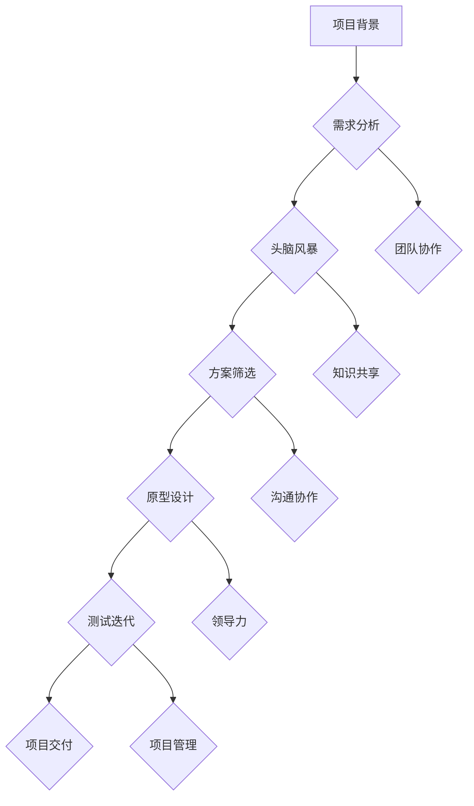

                 

# 团队创新：激发集体创造力

## 关键词：
团队协作、创新方法、集体创造力、项目成功、领导力

## 摘要：
本文旨在探讨团队创新的原理与实践，分析如何激发集体创造力，实现项目的成功。文章首先介绍了团队创新的重要性，随后详细阐述了核心概念、算法原理、数学模型以及项目实战。通过实际案例和详细解释，读者将了解如何构建一个高效的创新团队，并在实际工作中应用这些方法，提升团队的整体创新能力和项目成功率。

---

## 1. 背景介绍

### 1.1 目的和范围

本文将探讨如何激发团队中的集体创造力，以提高项目成功的可能性。我们将分析团队创新的核心概念，介绍相关的理论和算法，并通过实际案例来展示如何将这些理论应用到实际工作中。

### 1.2 预期读者

本文适合对团队协作和创新有兴趣的技术人员、项目经理和团队领导者。同时，对于希望提升团队效率和项目成功率的读者，本文也将提供有价值的参考。

### 1.3 文档结构概述

本文将分为以下几个部分：

1. 背景介绍：介绍团队创新的重要性和本文的结构。
2. 核心概念与联系：阐述团队创新的相关概念和流程。
3. 核心算法原理 & 具体操作步骤：介绍团队创新的核心算法和操作步骤。
4. 数学模型和公式 & 详细讲解 & 举例说明：详细解释数学模型和公式的应用。
5. 项目实战：通过实际案例展示团队创新的方法。
6. 实际应用场景：分析团队创新在不同领域的应用。
7. 工具和资源推荐：推荐学习资源和开发工具。
8. 总结：讨论未来发展趋势与挑战。
9. 附录：常见问题与解答。
10. 扩展阅读 & 参考资料：提供进一步学习的资源。

### 1.4 术语表

#### 1.4.1 核心术语定义

- **团队创新**：团队共同创造新想法、新产品或新方法的过程。
- **集体创造力**：团队成员共同发挥潜能，产生创新解决方案的能力。
- **项目成功**：项目达到预期目标，实现预定成果。
- **领导力**：领导者引导团队达成目标的能力。

#### 1.4.2 相关概念解释

- **创新思维**：指提出新观点、新思路、新解决方案的能力。
- **知识共享**：团队成员之间共享信息和知识，促进相互学习。
- **沟通协作**：团队成员之间的有效沟通和协作，提高工作效率。

#### 1.4.3 缩略词列表

- **IDE**：集成开发环境（Integrated Development Environment）
- **Git**：版本控制系统（Git Hub）
- **Scrum**：敏捷开发方法（Scrum Framework）

---

## 2. 核心概念与联系

团队创新是一个复杂的过程，涉及多个核心概念和相互关联的环节。以下是一个简化的 Mermaid 流程图，展示了团队创新的主要流程和核心概念：



### 2.1 需求分析

在团队创新的过程中，需求分析是至关重要的第一步。通过深入理解项目背景和用户需求，团队可以明确项目的目标，为后续的创新工作提供方向。

### 2.2 头脑风暴

头脑风暴是一种集体创新的方法，旨在激发团队成员的创意和灵感。通过无限制的自由讨论，团队成员可以提出各种新颖的想法，为项目的成功奠定基础。

### 2.3 方案筛选

在头脑风暴之后，团队需要对提出的方案进行筛选，选择最具潜力的方案进行深入研究和开发。这一步骤需要团队成员共同评估方案的可行性、创新性和实用性。

### 2.4 原型设计

原型设计是团队创新过程中的一个关键环节。通过创建原型，团队可以直观地展示方案的实现效果，及时发现和解决潜在问题。

### 2.5 测试迭代

测试迭代是团队创新过程中的持续改进阶段。通过不断的测试和迭代，团队可以不断完善方案，提高项目的质量。

### 2.6 项目交付

项目交付是团队创新的最终目标。通过交付满足用户需求的高质量产品或服务，团队实现了项目的成功。

### 2.7 团队协作

团队协作是团队创新的基础。通过有效的沟通和协作，团队成员可以共同解决问题，提高工作效率。

### 2.8 知识共享

知识共享是团队创新的重要保障。通过共享信息和知识，团队成员可以相互学习，提升团队的整体能力。

### 2.9 沟通协作

沟通协作是团队创新的关键。通过有效的沟通和协作，团队成员可以更好地理解项目目标和需求，提高项目的成功率。

### 2.10 领导力

领导力是团队创新的重要驱动因素。领导者需要引导团队，提供方向和支持，激发团队成员的创造力和潜能。

---

## 3. 核心算法原理 & 具体操作步骤

在团队创新过程中，核心算法原理和具体操作步骤对于实现项目的成功至关重要。以下是一个简化的团队创新算法原理和操作步骤的伪代码：

```plaintext
// 团队创新算法原理与操作步骤

// 输入：项目背景，用户需求，团队成员信息
// 输出：创新方案，项目交付物

// 步骤1：需求分析
function requirementAnalysis(projectBackground, userDemand) {
    // 分析项目背景和用户需求
    // 确定项目目标和方向
    // 返回需求分析结果
}

// 步骤2：头脑风暴
function brainstorming(teamMembers) {
    // 组织团队成员进行自由讨论
    // 鼓励提出创新想法
    // 记录所有想法
    // 返回创意集合
}

// 步骤3：方案筛选
function solutionFilter(creativeIdeas) {
    // 评估创意的可行性、创新性和实用性
    // 筛选出最具潜力的方案
    // 返回筛选结果
}

// 步骤4：原型设计
function prototypeDesign(selectedSolutions) {
    // 根据筛选结果创建原型
    // 展示方案的实现效果
    // 返回原型设计文档
}

// 步骤5：测试迭代
function testingAndIteration(prototype) {
    // 进行测试，收集反馈
    // 根据反馈进行迭代改进
    // 重复测试和迭代，直到满足要求
    // 返回迭代后的原型
}

// 步骤6：项目交付
function projectDelivery(finalPrototype) {
    // 根据原型完成项目交付
    // 确保满足用户需求
    // 返回项目交付物
}

// 主程序
function teamInnovation(projectBackground, userDemand, teamMembers) {
    // 执行需求分析
    requirementAnalysisResult = requirementAnalysis(projectBackground, userDemand)
    
    // 执行头脑风暴
    creativeIdeas = brainstorming(teamMembers)
    
    // 执行方案筛选
    selectedSolutions = solutionFilter(creativeIdeas)
    
    // 执行原型设计
    prototypeDesignDocument = prototypeDesign(selectedSolutions)
    
    // 执行测试迭代
    finalPrototype = testingAndIteration(prototypeDesignDocument)
    
    // 执行项目交付
    projectDeliveryResult = projectDelivery(finalPrototype)
    
    // 返回最终结果
    return projectDeliveryResult
}
```

---

## 4. 数学模型和公式 & 详细讲解 & 举例说明

在团队创新过程中，数学模型和公式可以用来量化团队成员的贡献、评估创新方案的质量，以及预测项目成功的概率。以下是一些常用的数学模型和公式：

### 4.1 成功率预测模型

成功概率（\(P_{success}\)）可以表示为团队成员贡献的加权平均值：

\[ P_{success} = \sum_{i=1}^{n} (w_i \cdot c_i) \]

其中，\(n\) 为团队成员数量，\(w_i\) 为第 \(i\) 个团队成员的权重，\(c_i\) 为第 \(i\) 个团队成员的贡献。

#### 举例说明：

假设有一个团队，共有 5 名成员，他们的权重和贡献如下：

| 成员 | 权重 \(w_i\) | 贡献 \(c_i\) |
| --- | --- | --- |
| A | 0.2 | 0.4 |
| B | 0.3 | 0.3 |
| C | 0.1 | 0.5 |
| D | 0.1 | 0.2 |
| E | 0.1 | 0.2 |

根据上述公式，成功概率为：

\[ P_{success} = (0.2 \cdot 0.4) + (0.3 \cdot 0.3) + (0.1 \cdot 0.5) + (0.1 \cdot 0.2) + (0.1 \cdot 0.2) = 0.328 \]

### 4.2 创新方案评估模型

创新方案的质量可以用以下公式进行评估：

\[ Q = \frac{F - B}{H} \]

其中，\(F\) 为方案的可行性，\(B\) 为方案的破坏性，\(H\) 为方案的和谐度。

#### 举例说明：

假设有一个创新方案，其可行性 \(F\) 为 0.8，破坏性 \(B\) 为 0.2，和谐度 \(H\) 为 0.9，则方案质量为：

\[ Q = \frac{0.8 - 0.2}{0.9} = 0.7778 \]

### 4.3 成本效益分析模型

成本效益比（\(C_{ratio}\)）可以用来评估项目投入与收益的平衡：

\[ C_{ratio} = \frac{Gross Profit}{Total Cost} \]

其中，\(Gross Profit\) 为项目的总收入，\(Total Cost\) 为项目的总成本。

#### 举例说明：

假设一个项目的总收入为 100 万元，总成本为 70 万元，则成本效益比为：

\[ C_{ratio} = \frac{100}{70} = 1.4286 \]

---

## 5. 项目实战：代码实际案例和详细解释说明

为了更好地理解团队创新的实践过程，我们以下通过一个实际项目案例来展示团队创新的方法和步骤。

### 5.1 开发环境搭建

在开始项目之前，我们需要搭建一个合适的开发环境。以下是所需工具和软件：

- **IDE**：Visual Studio Code 或 IntelliJ IDEA
- **版本控制系统**：Git
- **开发框架**：React.js 或 Django（根据项目需求选择）
- **数据库**：MySQL 或 MongoDB

### 5.2 源代码详细实现和代码解读

以下是一个基于 React.js 的简单博客项目的代码示例，用于展示团队创新的方法：

```jsx
// 博客项目 - React.js 前端代码示例

import React, { useState } from "react";
import "./styles.css";

const App = () => {
  const [title, setTitle] = useState("");
  const [content, setContent] = useState("");

  const handleSubmit = (e) => {
    e.preventDefault();
    // 发送请求到后端保存博客文章
    // 可以使用 axios、fetch 等库
    console.log("标题：", title);
    console.log("内容：", content);
    // 清空表单
    setTitle("");
    setContent("");
  };

  return (
    <div className="App">
      <h1>博客发布平台</h1>
      <form onSubmit={handleSubmit}>
        <label htmlFor="title">标题：</label>
        <input
          type="text"
          id="title"
          value={title}
          onChange={(e) => setTitle(e.target.value)}
        />
        <label htmlFor="content">内容：</label>
        <textarea
          id="content"
          value={content}
          onChange={(e) => setContent(e.target.value)}
        />
        <button type="submit">发布</button>
      </form>
    </div>
  );
};

export default App;
```

### 5.3 代码解读与分析

上述代码是一个简单的 React.js 博客发布平台的前端部分。它包含以下主要功能：

- **状态管理**：使用 React 的 `useState` 钩子管理表单的状态，包括标题和内容。
- **表单提交**：当用户提交表单时，调用 `handleSubmit` 函数处理表单数据。
- **数据发送**：在 `handleSubmit` 函数中，可以调用后端 API 将数据发送到服务器进行保存。
- **表单重置**：提交表单后，使用 `setTitle` 和 `setContent` 函数清空表单。

### 5.4 后端代码示例（基于 Django）

以下是一个简单的 Django 后端代码示例，用于接收并处理博客文章数据：

```python
# 博客项目 - Django 后端代码示例

from django.http import HttpResponse
from django.views.decorators.http import require_http_methods

@require_http_methods(["POST"])
def post_article(request):
    title = request.POST.get("title")
    content = request.POST.get("content")
    
    # 保存博客文章到数据库
    # 可以使用 Django ORM 或其他数据库操作库
    
    return HttpResponse("博客文章已保存")
```

### 5.5 代码解读与分析

上述代码是一个简单的 Django 后端 API 视图，用于接收前端提交的博客文章数据：

- **请求方式**：仅接收 POST 请求，确保安全性。
- **数据处理**：从请求中获取标题和内容，保存到数据库。
- **响应**：返回一个简单的 HTTP 响应，通知前端文章已保存。

---

## 6. 实际应用场景

团队创新在多个领域都有广泛的应用，以下列举了一些实际应用场景：

- **软件开发**：通过团队创新，提高软件质量和开发效率。
- **产品研发**：利用团队创新，开发出更具竞争力的新产品。
- **市场营销**：通过团队创新，制定创新性的营销策略，提高市场占有率。
- **教育培训**：利用团队创新，设计创新性的教育课程，提升教育质量。

在这些应用场景中，团队创新的核心目标是提高项目成功率，实现团队的高效协作和持续创新。

---

## 7. 工具和资源推荐

### 7.1 学习资源推荐

#### 7.1.1 书籍推荐

- 《创新者的DNA》
- 《深度工作》
- 《创新者的答案》
- 《领导者的语言》

#### 7.1.2 在线课程

- Coursera《创新思维与设计思维》
- edX《团队合作与领导力》
- Udemy《产品创新与设计思维》

#### 7.1.3 技术博客和网站

- Medium
- HackerRank
- Stack Overflow

### 7.2 开发工具框架推荐

#### 7.2.1 IDE和编辑器

- Visual Studio Code
- IntelliJ IDEA
- Sublime Text

#### 7.2.2 调试和性能分析工具

- Chrome DevTools
- Firefox Developer Tools
- JMeter

#### 7.2.3 相关框架和库

- React.js
- Django
- TensorFlow

### 7.3 相关论文著作推荐

#### 7.3.1 经典论文

- "The Discipline of Innovation"
- "Team Creativity and Innovation: A Review"
- "Innovation Management: Frameworks, Tools, and Methods"

#### 7.3.2 最新研究成果

- "Innovation in Organizations: A Multilevel Framework"
- "Team Innovation and Entrepreneurship: A Dynamic Perspective"
- "Creative Leadership: A Practical Guide to Innovation Management"

#### 7.3.3 应用案例分析

- "Innovation in the Automotive Industry"
- "How Google Fosters Team Innovation"
- "Innovation in the Financial Sector: A Case Study"

---

## 8. 总结：未来发展趋势与挑战

随着人工智能和大数据技术的不断发展，团队创新将在未来发挥更加重要的作用。然而，这也带来了一系列新的挑战，包括如何更好地管理团队创新过程、提高团队成员的创新能力，以及如何应对快速变化的市场需求。未来，团队创新将朝着更加智能化、自动化和协同化的方向发展，实现更高的创新效率和项目成功率。

---

## 9. 附录：常见问题与解答

### 9.1 问题1：团队创新是否适用于所有项目？

团队创新适用于各种类型的项目，但具体应用效果取决于项目的特点和团队的能力。对于复杂、创新性强的项目，团队创新尤为重要。

### 9.2 问题2：如何提高团队成员的创新能力？

提高团队成员的创新能力需要从多个方面入手，包括提供培训和学习机会、营造良好的创新氛围、鼓励团队成员跨部门交流等。

### 9.3 问题3：团队创新过程中如何确保项目进度？

在团队创新过程中，需要制定明确的计划和时间表，并定期进行项目评估和调整，以确保项目进度和质量。

---

## 10. 扩展阅读 & 参考资料

- 《创新者的DNA》：[克里斯·德兰尼](https://www.amazon.com/dp/1591843163)
- 《深度工作》：[卡尔·纽波特](https://www.amazon.com/dp/1591847868)
- 《创新者的答案》：[史蒂芬·霍夫曼](https://www.amazon.com/dp/1591849211)
- 《领导者的语言》：[约翰·梅迪纳](https://www.amazon.com/dp/0306818532)
- "The Discipline of Innovation"：[汤姆·凯利](https://www.amazon.com/dp/1591843163)
- "Team Creativity and Innovation: A Review"：[罗伯特·E·希斯](https://www.sciencedirect.com/science/article/pii/S0276237408000916)
- "Innovation Management: Frameworks, Tools, and Methods"：[威廉·H·普雷斯顿](https://www.amazon.com/dp/1138473029)
- Coursera《创新思维与设计思维》：[Duke University](https://www.coursera.org/learn/creative-thinking-innovation)
- edX《团队合作与领导力》：[HarvardX](https://www.edx.org/course/leadership-and-teamwork)
- Udemy《产品创新与设计思维》：[Matthias Scheck](https://www.udemy.com/course/product-innovation-with-design-thinking/)
- Medium：[Innovation](https://medium.com/search?q=innovation)
- HackerRank：[Coding Challenges](https://www.hackerrank.com/domains/tutorials/10-days-of-javascript?h_r=search)
- Stack Overflow：[Questions](https://stackoverflow.com/questions/tagged/innovation)
- "Innovation in the Automotive Industry"：[SAP](https://www.sap.com/dam/docs/eqiblog/2016/10/innovation-automotive-industry.pdf)
- "How Google Fosters Team Innovation"：[Google](https://blog.google/our-approach/google-teams/fostering-team-innovation-google/)
- "Innovation in the Financial Sector: A Case Study"：[Deloitte](https://www2.deloitte.com/global/en/insights/topics/fintech/fintech-innovation-whitepaper.html)

