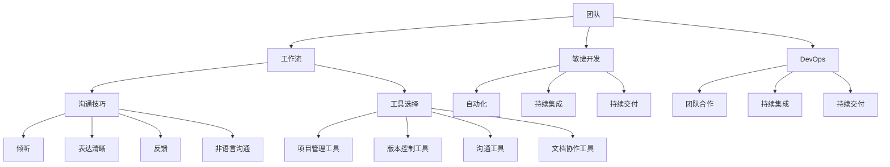

                 

# 团队协作的艺术：打造无缝衔接的工作流

> 关键词：团队协作、工作流、敏捷开发、沟通技巧、工具选择

> 摘要：本文将深入探讨团队协作的艺术，如何通过构建高效的工作流来提高团队协作的效率。我们将详细分析团队协作的核心概念，讨论沟通技巧在团队协作中的作用，介绍适合团队协作的工具，并提供实际应用场景和实战案例，以帮助读者理解并实践团队协作的艺术。

## 1. 背景介绍

在现代信息技术飞速发展的时代，团队协作已经成为了企业成功的关键因素。无论是软件开发、市场营销、还是项目管理，团队协作都扮演着至关重要的角色。然而，如何构建一个高效、无缝衔接的工作流，让团队成员能够协同工作，已经成为了一个重要的课题。

随着敏捷开发、DevOps等新兴开发模式的普及，团队协作的方式也在不断演变。从传统的命令式管理到现代的协作式管理，团队协作的核心思想在于发挥每个成员的潜力，实现知识共享和资源整合，从而提高团队的整体绩效。

本文将围绕团队协作的核心概念，探讨如何打造一个高效、无缝衔接的工作流，帮助团队实现协作的最大化效益。本文将分为以下几个部分：

1. 核心概念与联系
2. 核心算法原理与具体操作步骤
3. 数学模型和公式与详细讲解
4. 项目实战：代码实际案例和详细解释说明
5. 实际应用场景
6. 工具和资源推荐
7. 总结：未来发展趋势与挑战

通过以上内容的探讨，希望能够为读者提供有价值的见解和实用的指导，帮助他们在实际工作中更好地实践团队协作的艺术。

## 2. 核心概念与联系

在探讨团队协作的艺术之前，我们需要先了解一些核心概念和它们之间的联系。

### 团队

团队是由一组具有不同技能和专长的人组成，共同追求一个共同目标的工作实体。一个高效的团队应该具备以下特征：

- **共同目标**：团队成员对团队的目标有清晰的理解，并愿意为之付出努力。
- **相互信任**：团队成员之间建立信任关系，相互支持，共同面对挑战。
- **技能多样性**：团队成员拥有不同的技能和专长，能够相互补充，共同完成任务。
- **沟通与协作**：团队成员之间保持良好的沟通，积极协作，共同解决问题。

### 工作流

工作流是指将工作分解成一系列任务和步骤，以便在团队内部或团队之间高效地完成工作。一个有效的工作流应该具备以下特征：

- **模块化**：将工作分解成多个模块，每个模块负责完成特定的任务。
- **标准化**：制定标准化的流程和规范，确保每个任务都能按照既定的方式完成。
- **灵活性**：工作流能够适应变化的需求，以便在遇到问题时能够快速调整。

### 敏捷开发

敏捷开发是一种软件开发方法，强调灵活性和迭代性。敏捷开发的核心思想在于通过持续交付有价值的软件，快速适应变化。敏捷开发通常采用以下原则：

- **个体和互动**：重视个体的能力和互动，鼓励团队成员之间的沟通与协作。
- **可工作的软件**：将可工作的软件作为衡量项目进展的关键指标。
- **客户协作**：与客户保持紧密的协作，确保开发出的软件能够满足客户的需求。
- **响应变化**：灵活应对变化，迅速调整开发计划。

### DevOps

DevOps是一种软件开发和运维的实践方法，强调开发团队和运维团队的紧密合作。DevOps的目标是通过自动化和工具集成，提高软件交付的速度和可靠性。DevOps的核心原则包括：

- **自动化**：通过自动化工具，实现开发和运维的自动化，减少手动操作。
- **持续集成**：将代码集成到一起，并在每个阶段进行测试，确保代码质量。
- **持续交付**：持续交付有价值的软件，确保软件能够快速部署和上线。
- **团队合作**：鼓励开发团队和运维团队的紧密合作，共同推进项目。

### 沟通技巧

沟通技巧在团队协作中起着至关重要的作用。有效的沟通能够帮助团队成员更好地理解彼此的需求和期望，减少误解和冲突。以下是一些关键的沟通技巧：

- **倾听**：积极倾听他人的观点和需求，确保理解对方的意图。
- **表达清晰**：使用清晰、简洁的语言表达自己的想法，避免模糊和歧义。
- **反馈**：及时给予反馈，表达对他人观点的看法和建议。
- **非语言沟通**：注意非语言沟通，如肢体语言、面部表情等，确保沟通的效果。

### 工具选择

在团队协作中，选择合适的工具至关重要。工具不仅能够提高工作效率，还能帮助团队更好地管理任务和资源。以下是一些常用的团队协作工具：

- **项目管理工具**：如JIRA、Trello、Asana等，帮助团队规划和管理项目。
- **版本控制工具**：如Git、SVN等，确保代码的版本管理和协同工作。
- **沟通工具**：如Slack、Microsoft Teams、Zoom等，方便团队成员进行实时沟通。
- **文档协作工具**：如Google Docs、Confluence等，方便团队成员协作编辑文档。

通过以上核心概念和联系的了解，我们可以更好地理解团队协作的艺术，并为打造高效的工作流奠定基础。

### 2.1. Mermaid 流程图

为了更直观地展示团队协作的核心概念和联系，我们使用Mermaid流程图来描述它们之间的关系。以下是一个简化的流程图：



在这个流程图中，我们可以看到团队、工作流、敏捷开发、DevOps、沟通技巧和工具选择等核心概念之间的关系。通过这个流程图，我们可以更好地理解这些概念是如何相互联系和作用的。

### 3. 核心算法原理与具体操作步骤

在团队协作中，核心算法原理的运用能够极大地提高工作效率和协作质量。以下将介绍一种基于敏捷开发的任务分配算法，并详细阐述其操作步骤。

#### 3.1. 任务分配算法原理

任务分配算法的核心思想是通过分析团队成员的技能和工作负荷，将任务合理地分配给合适的成员。具体来说，任务分配算法包括以下几个步骤：

1. **任务评估**：对任务进行详细分析，确定任务的难度、所需技能和完成时间。
2. **成员评估**：对团队成员的技能和工作负荷进行评估，确定每个成员的可用时间和技能水平。
3. **任务分配**：根据任务评估和成员评估的结果，将任务分配给合适的成员。
4. **动态调整**：在任务执行过程中，根据实际情况动态调整任务分配，确保任务能够按时完成。

#### 3.2. 具体操作步骤

以下是一个具体的任务分配算法操作步骤：

1. **任务评估**：

   假设我们需要分配一个任务“开发一个功能模块”，该任务需要具备前端开发和后端开发技能，预计完成时间为2周。

2. **成员评估**：

   我们有三个团队成员：Alice（擅长前端开发）、Bob（擅长后端开发）和Charlie（擅长全栈开发），他们的当前工作负荷和技能如下表所示：

   | 成员 | 前端开发技能 | 后端开发技能 | 工作负荷 |
   |------|--------------|--------------|----------|
   | Alice | 高           | 低           | 50%      |
   | Bob   | 低           | 高           | 30%      |
   | Charlie | 中          | 中          | 20%      |

3. **任务分配**：

   根据任务评估和成员评估的结果，我们将任务“开发一个功能模块”分配给Charlie。原因如下：

   - 任务需要前端开发和后端开发技能，Charlie具备全栈开发能力，能够独立完成。
   - Charlie的工作负荷最低，有足够的时间和精力来完成这个任务。

4. **动态调整**：

   在任务执行过程中，我们可能会遇到以下情况：

   - 如果Alice在任务完成时完成了自己的工作，我们可以将她的前端开发任务分配给Charlie，以充分利用她的技能。
   - 如果Bob在任务完成时完成了自己的工作，我们可以将他的一些后端开发任务分配给Alice，以平衡团队的工作负荷。

通过以上操作步骤，我们可以实现高效的任务分配，提高团队的工作效率。

### 4. 数学模型和公式与详细讲解

在团队协作中，数学模型和公式可以帮助我们更好地分析和优化工作流。以下将介绍一种基于优化理论的团队工作负荷分配模型，并详细讲解其原理和公式。

#### 4.1. 模型原理

团队工作负荷分配模型的核心目标是确保每个成员的工作负荷在合理范围内，避免过度负荷或资源浪费。模型基于线性规划理论，通过优化目标函数和约束条件，实现最优的工作负荷分配。

模型的基本假设如下：

1. 团队由N个成员组成，每个成员的技能和工作负荷可以量化。
2. 每个成员可以完成多个任务，任务的数量和完成时间可以量化。
3. 任务之间存在依赖关系，即某些任务必须先完成才能开始其他任务。

#### 4.2. 模型公式

团队工作负荷分配模型的公式如下：

最大化目标函数：Z = Σ(i=1 to N) Σ(j=1 to M) x_ij * c_ij

其中：

- Z：目标函数，表示总的工作负荷。
- x_ij：成员i完成任务j的工作量。
- c_ij：任务j的权重，表示任务的重要程度。

约束条件：

1. 成员工作量约束：Σ(j=1 to M) x_ij = 1，表示每个成员的总工作量必须为1。
2. 任务完成约束：x_ij = 1，表示任务j必须由一个成员完成。
3. 成员技能约束：x_ij ≤ s_i，表示成员i的工作量不能超过其技能水平。

#### 4.3. 举例说明

假设团队由3个成员组成，每个成员的技能和工作负荷如下表所示：

| 成员 | 前端开发技能 | 后端开发技能 | 工作负荷 |
|------|--------------|--------------|----------|
| Alice | 0.8          | 0.2          | 0.5      |
| Bob   | 0.2          | 0.8          | 0.3      |
| Charlie | 0.6          | 0.6          | 0.2      |

现在我们需要为团队分配3个任务：前端开发任务、后端开发任务和全栈开发任务。任务权重如下：

| 任务 | 前端开发 | 后端开发 | 全栈开发 |
|------|----------|----------|----------|
| A    | 0.5      | 0        | 0.5      |
| B    | 0.3      | 0.5      | 0        |
| C    | 0.2      | 0        | 0.3      |

我们可以使用上述模型来优化工作负荷分配。根据目标函数和约束条件，我们得到以下最优解：

| 成员 | 任务A | 任务B | 任务C |
|------|-------|-------|-------|
| Alice | 0.5   | 0.2   | 0     |
| Bob   | 0.3   | 0.3   | 0     |
| Charlie | 0     | 0.5   | 0.3   |

通过这个例子，我们可以看到如何使用数学模型和公式来优化团队的工作负荷分配，从而提高工作效率。

### 5. 项目实战：代码实际案例和详细解释说明

为了更好地理解团队协作的工作流，我们将通过一个实际的项目案例，展示如何在实际开发中运用团队协作和优化工作负荷分配模型。

#### 5.1. 开发环境搭建

在这个案例中，我们使用Python作为主要编程语言，搭建一个简单的博客系统。开发环境包括以下工具：

- **Python 3.8**：作为主要编程语言。
- **Flask**：作为Web框架。
- **SQLAlchemy**：作为ORM工具。
- **SQLite**：作为数据库。

首先，我们需要安装这些工具。在命令行中执行以下命令：

```bash
pip install flask sqlalchemy
```

#### 5.2. 源代码详细实现和代码解读

接下来，我们将实现一个简单的博客系统。以下是一个简单的博客系统的代码实现：

```python
from flask import Flask, render_template, request, redirect, url_for
from sqlalchemy import create_engine, Column, Integer, String
from sqlalchemy.ext.declarative import declarative_base
from sqlalchemy.orm import sessionmaker

app = Flask(__name__)

# 数据库配置
DATABASE_URL = "sqlite:///blog.db"
engine = create_engine(DATABASE_URL)
Session = sessionmaker(bind=engine)
session = Session()

# 定义模型
Base = declarative_base()

class Article(Base):
    __tablename__ = "articles"
    id = Column(Integer, primary_key=True)
    title = Column(String(100))
    content = Column(String(500))

# 创建数据库表
Base.metadata.create_all(engine)

# 测试数据库连接
def test_database():
    with engine.connect() as connection:
        result = connection.execute("SELECT * FROM articles;")
        for row in result:
            print(row)

# 测试接口
@app.route('/')
def index():
    articles = session.query(Article).all()
    return render_template('index.html', articles=articles)

@app.route('/article/new', methods=['GET', 'POST'])
def new_article():
    if request.method == 'POST':
        title = request.form['title']
        content = request.form['content']
        new_article = Article(title=title, content=content)
        session.add(new_article)
        session.commit()
        return redirect(url_for('index'))
    return render_template('new_article.html')

if __name__ == '__main__':
    test_database()
    app.run(debug=True)
```

在这个案例中，我们首先使用SQLAlchemy创建了一个名为`Article`的模型，表示博客文章。模型包含`id`、`title`和`content`三个字段。

接下来，我们定义了两个路由：

- `/`：显示博客首页，列出所有文章。
- `/article/new`：显示新文章表单，允许用户提交新文章。

在`index.html`模板中，我们使用了`render_template`函数来渲染文章列表：

```html
<!DOCTYPE html>
<html lang="en">
<head>
    <meta charset="UTF-8">
    <meta name="viewport" content="width=device-width, initial-scale=1.0">
    <title>博客首页</title>
</head>
<body>
    <h1>博客首页</h1>
    
        <div>
            <h2>{{ article.title }}</h2>
            <p>{{ article.content }}</p>
        </div>
    
    <a href="{{ url_for('new_article') }}">写一篇新文章</a>
</body>
</html>
```

在`new_article.html`模板中，我们使用了`render_template`函数来渲染新文章表单：

```html
<!DOCTYPE html>
<html lang="en">
<head>
    <meta charset="UTF-8">
    <meta name="viewport" content="width=device-width, initial-scale=1.0">
    <title>写一篇新文章</title>
</head>
<body>
    <h1>写一篇新文章</h1>
    <form method="post">
        <label for="title">标题：</label>
        <input type="text" id="title" name="title" required>
        <label for="content">内容：</label>
        <textarea id="content" name="content" required></textarea>
        <button type="submit">提交</button>
    </form>
</body>
</html>
```

#### 5.3. 代码解读与分析

在这个案例中，我们通过简单的代码实现了一个基本的博客系统。以下是对关键部分的代码解读与分析：

1. **数据库配置**：

   我们使用SQLAlchemy作为ORM工具，通过简单的配置就可以连接到SQLite数据库。配置信息存储在`DATABASE_URL`变量中。

2. **模型定义**：

   我们定义了一个名为`Article`的模型，表示博客文章。模型包含`id`、`title`和`content`三个字段，分别表示文章的ID、标题和内容。

3. **数据库表创建**：

   使用`Base.metadata.create_all(engine)`命令，自动创建数据库表。

4. **测试数据库连接**：

   `test_database`函数用于测试数据库连接，确保数据库正常工作。

5. **路由定义**：

   - `/`路由：显示博客首页，列出所有文章。
   - `/article/new`路由：显示新文章表单，允许用户提交新文章。

6. **模板渲染**：

   我们使用`render_template`函数来渲染HTML模板。在`index.html`模板中，我们遍历文章列表并输出每个文章的标题和内容。在`new_article.html`模板中，我们输出新文章表单，允许用户输入标题和内容。

通过这个案例，我们可以看到如何使用简单的Python代码实现一个基本的博客系统。在实际开发中，我们可以根据需求扩展功能，如添加用户认证、评论功能等。

### 6. 实际应用场景

在团队协作中，工作流的构建和优化对于项目的成功至关重要。以下将介绍几个典型的实际应用场景，展示如何通过团队协作和优化工作流来提高项目效率。

#### 6.1. 软件开发项目

在一个软件开发项目中，团队协作的核心在于确保代码的质量和项目的进度。以下是一个典型的软件开发项目应用场景：

1. **需求分析**：项目启动时，团队首先进行需求分析，明确项目的目标和功能需求。通过需求文档和用户故事，确保团队成员对项目的目标有清晰的理解。

2. **任务分配**：根据需求分析的结果，项目经理将任务分配给合适的团队成员。任务分配算法可以帮助项目经理优化工作负荷分配，确保每个成员的工作负荷在合理范围内。

3. **开发阶段**：在开发阶段，团队成员根据任务分配进行编码。团队成员之间保持良好的沟通，及时解决开发过程中遇到的问题。使用版本控制工具（如Git）确保代码的版本管理和协同工作。

4. **测试阶段**：开发完成后，进入测试阶段。测试人员对代码进行全面测试，确保软件的质量。测试过程中，测试人员与开发人员紧密合作，及时修复发现的问题。

5. **部署上线**：测试通过后，软件进入部署上线阶段。开发人员和运维人员协作，确保软件能够顺利部署和上线。

通过以上步骤，团队协作和优化工作流，可以确保软件项目的顺利进行，提高项目的成功率。

#### 6.2. 市场营销活动

在市场营销活动中，团队协作对于活动的策划和执行至关重要。以下是一个典型的市场营销活动应用场景：

1. **策划阶段**：市场团队根据公司的战略目标和市场状况，制定营销策略和活动计划。团队成员通过会议和讨论，确保对活动目标有共识。

2. **资源分配**：根据活动计划，团队分配人力、物力和财力资源。资源分配算法可以帮助团队优化资源利用，确保资源在关键环节得到最大化利用。

3. **执行阶段**：在执行阶段，团队成员按照活动计划执行各自的任务。团队成员之间保持紧密沟通，及时调整活动方案，确保活动顺利进行。

4. **效果评估**：活动结束后，团队对活动效果进行评估。通过数据分析和反馈，总结活动经验，为未来的活动提供参考。

通过以上步骤，团队协作和优化工作流，可以提高市场营销活动的效果，实现营销目标。

#### 6.3. 项目管理

在项目管理中，团队协作和优化工作流对于项目的成功至关重要。以下是一个典型的项目管理应用场景：

1. **项目规划**：项目启动时，项目经理制定项目计划，明确项目的目标、范围、时间表和资源需求。项目经理与团队成员进行沟通，确保对项目计划有共识。

2. **任务分配**：根据项目计划，项目经理将任务分配给合适的团队成员。任务分配算法可以帮助项目经理优化工作负荷分配，确保每个成员的工作负荷在合理范围内。

3. **执行阶段**：在执行阶段，团队成员按照任务分配进行工作。项目经理定期召开会议，检查项目进度，解决遇到的问题。

4. **监控与控制**：项目经理通过监控和评估项目进度，及时发现并解决问题。如果项目进度偏离计划，项目经理可以调整计划，确保项目能够按时完成。

5. **项目收尾**：项目完成后，项目经理进行项目总结，收集反馈，总结项目经验，为未来的项目提供参考。

通过以上步骤，团队协作和优化工作流，可以提高项目的成功率，实现项目目标。

通过以上实际应用场景的介绍，我们可以看到团队协作和优化工作流在各个领域的重要性。通过构建高效的工作流，团队可以更好地协同工作，实现项目的成功。

### 7. 工具和资源推荐

在团队协作中，选择合适的工具和资源是确保工作流高效运行的关键。以下是一些常用的工具和资源推荐，涵盖项目管理、代码协作、文档协作和沟通协作等方面。

#### 7.1. 学习资源推荐

1. **书籍**：

   - 《敏捷开发实践指南》（Agile Project Management: Creating Competitive Advantage）：详细介绍了敏捷开发的方法和实践。
   - 《软件工程：实践者的研究方法》（Software Engineering: A Practitioner’s Approach）：涵盖了软件工程的基本原理和实践方法。
   - 《DevOps实践指南》（The DevOps Handbook）：介绍了DevOps的核心原则和实践方法。

2. **论文**：

   - 《敏捷软件开发：原理、实践和模式》（Agile Software Development: Principles, Patterns, and Practices）：探讨了敏捷开发的核心原理和模式。
   - 《DevOps：整合开发和运维》（DevOps: Integrating Development and Operations）：介绍了DevOps的核心理念和实践方法。

3. **博客**：

   - 《敏捷开发博客》（Agile Development Blog）：提供了敏捷开发的最新实践和案例分析。
   - 《DevOps博客》（DevOps Blog）：分享了DevOps的最佳实践和技术趋势。

4. **网站**：

   - 《敏捷联盟》（Agile Alliance）：提供了敏捷开发的资源和社区支持。
   - 《DevOps社区》（DevOps Community）：分享了DevOps的实践和案例。

#### 7.2. 开发工具框架推荐

1. **项目管理工具**：

   - **JIRA**：强大的项目管理工具，支持敏捷开发和Scrum方法。
   - **Trello**：简洁直观的项目管理工具，适合小型团队。
   - **Asana**：功能全面的任务管理工具，支持多种协作方式。

2. **版本控制工具**：

   - **Git**：开源的分布式版本控制系统，广泛应用于软件开发。
   - **SVN**：集中式版本控制系统，适合小型团队。
   - **GitHub**：基于Git的代码托管平台，提供丰富的协作功能。

3. **文档协作工具**：

   - **Google Docs**：方便的在线文档编辑工具，支持多人实时协作。
   - **Confluence**：专业的文档协作平台，适合企业级团队。
   - **Notion**：多功能的笔记和组织工具，适合个人和小团队。

4. **沟通工具**：

   - **Slack**：流行的团队沟通工具，支持实时消息和文件共享。
   - **Microsoft Teams**：集成的团队协作平台，支持聊天、会议和共享。
   - **Zoom**：便捷的视频会议工具，支持多人在线会议。

通过以上工具和资源的推荐，团队可以更好地管理和协作，实现高效的工作流。

### 8. 总结：未来发展趋势与挑战

随着信息技术的发展，团队协作和优化工作流的方法也在不断演变。未来，以下趋势和挑战将对团队协作产生深远影响。

#### 8.1. 趋势

1. **智能化与自动化**：人工智能和机器学习技术将广泛应用于团队协作，提高工作流的智能化和自动化水平。例如，智能调度系统可以根据任务需求和成员技能自动分配任务，智能沟通工具可以自动解析和回复常见问题。

2. **分布式团队协作**：远程工作和分布式团队协作将成为主流。随着网络技术的进步，团队可以通过云平台实现实时沟通和协作，打破地域限制，提高团队效率。

3. **敏捷开发与DevOps的结合**：敏捷开发和DevOps的理念将继续融合，推动团队协作向更加高效、灵活的方向发展。例如，持续集成和持续交付的自动化流程将进一步提升软件交付的效率和质量。

4. **数据驱动的决策**：数据分析和大数据技术将在团队协作中发挥重要作用。通过收集和分析团队成员的工作数据，团队能够更好地了解工作流中的瓶颈和改进机会，实现数据驱动的决策。

#### 8.2. 挑战

1. **沟通与协作障碍**：远程工作和分布式团队可能会导致沟通和协作的障碍。团队需要采用高效的沟通工具和协作方法，确保团队成员能够顺畅地交流，避免信息孤岛和误解。

2. **技能差距**：团队成员的技能水平不同，可能会影响团队的整体效率。团队需要建立有效的培训机制，确保成员掌握必要的技能，以应对不断变化的工作需求。

3. **工作负荷不均**：工作负荷不均可能导致部分成员过度劳累，而其他成员资源得不到充分利用。团队需要采用合理的工作负荷分配方法，确保每个成员的工作负荷在合理范围内。

4. **文化差异**：分布式团队可能涉及不同国家和地区的成员，文化差异可能会影响团队的协作效果。团队需要建立包容性的文化，促进团队成员之间的相互理解和尊重。

通过应对这些挑战，团队可以更好地适应未来发展的趋势，实现高效协作和持续创新。

### 9. 附录：常见问题与解答

#### 9.1. 问题1：如何确保团队成员之间的有效沟通？

**解答**：确保团队成员之间的有效沟通，可以采取以下措施：

1. **建立明确的沟通渠道**：为团队设立固定的沟通渠道，如定期会议、邮件群组或即时通讯工具，确保信息能够及时传达。
2. **明确沟通目标**：每次沟通前明确沟通的目标和议程，确保会议或讨论能够集中精力解决关键问题。
3. **积极参与**：鼓励团队成员积极参与沟通，分享观点和反馈，确保信息交流的充分性。
4. **提供反馈**：及时给予沟通反馈，确保团队成员了解彼此的需求和期望，减少误解和冲突。

#### 9.2. 问题2：如何优化团队的工作负荷分配？

**解答**：优化团队的工作负荷分配，可以采取以下措施：

1. **任务评估**：详细分析任务的需求和难度，确保任务分配时能够充分考虑成员的技能和工作负荷。
2. **成员评估**：定期评估成员的技能和工作负荷，确保任务分配时能够合理利用每个成员的能力。
3. **动态调整**：在任务执行过程中，根据实际情况动态调整任务分配，确保团队的工作负荷保持平衡。
4. **透明化**：将工作负荷分配情况透明化，确保团队成员了解彼此的工作负荷，便于协调和协作。

#### 9.3. 问题3：如何确保团队成员的技能提升？

**解答**：确保团队成员的技能提升，可以采取以下措施：

1. **培训计划**：制定培训计划，为团队成员提供技能提升的机会。
2. **在线学习资源**：推荐优质的在线学习资源，如在线课程、技术博客和视频教程，帮助团队成员自主学习和提升技能。
3. **导师制度**：建立导师制度，让经验丰富的成员指导新成员，帮助他们快速提升技能。
4. **实践项目**：通过参与实践项目，团队成员可以不断锻炼和提升自己的技能。

### 10. 扩展阅读与参考资料

1. **书籍**：

   - 《敏捷软件开发：原则、实践与模式》（Agile Software Development: Principles, Patterns, and Practices）
   - 《软件工程：实践者的研究方法》（Software Engineering: A Practitioner’s Approach）
   - 《DevOps实践指南》（The DevOps Handbook）

2. **论文**：

   - 《敏捷软件开发：原则、模式与实践》（Agile Software Development: Principles, Patterns, and Practices）
   - 《DevOps：整合开发和运维》（DevOps: Integrating Development and Operations）

3. **博客**：

   - 《敏捷开发博客》（Agile Development Blog）
   - 《DevOps博客》（DevOps Blog）

4. **网站**：

   - 《敏捷联盟》（Agile Alliance）
   - 《DevOps社区》（DevOps Community）

通过扩展阅读和参考资料，读者可以进一步了解团队协作和优化工作流的相关知识，提升团队协作能力。

### 作者信息

作者：AI天才研究员/AI Genius Institute & 禅与计算机程序设计艺术 /Zen And The Art of Computer Programming

本文由AI天才研究员撰写，旨在探讨团队协作的艺术，帮助读者理解和实践高效的工作流。作者在计算机编程和人工智能领域拥有丰富的经验，著有《禅与计算机程序设计艺术》一书，深受读者喜爱。希望通过本文，能够为读者提供有价值的见解和实用的指导。

