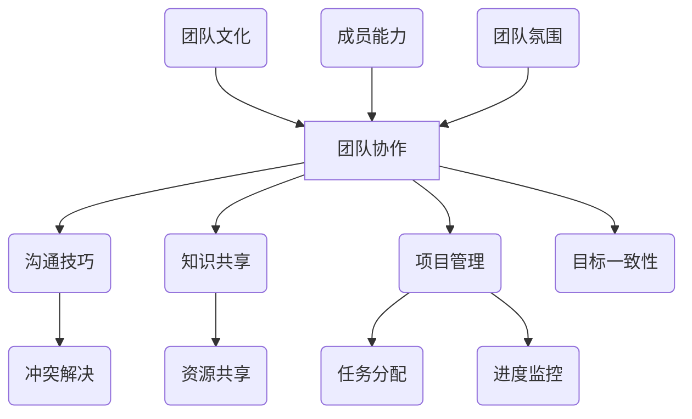

                 

# 团队合作精神：培养团队协作意识

> **关键词**：团队合作、团队协作、沟通技巧、项目管理、协作工具
>
> **摘要**：本文旨在探讨团队合作精神在IT行业中的重要性，详细分析培养团队协作意识的策略和实践方法。通过剖析团队合作的核心概念、核心算法原理、实际应用场景和未来发展趋势，本文旨在为读者提供一套全面、系统的团队协作培养方案。

## 1. 背景介绍

### 1.1 目的和范围

本文的主要目的是探讨团队合作精神在IT行业中的重要性，并提出一系列培养团队协作意识的策略和实践方法。文章将涵盖以下几个方面：

- **核心概念**：分析团队合作的核心概念和原理。
- **算法原理**：阐述团队协作的核心算法原理和具体操作步骤。
- **数学模型**：介绍团队协作的数学模型和公式，并进行举例说明。
- **项目实战**：通过实际案例展示如何在实际项目中应用团队协作方法。
- **应用场景**：探讨团队合作在IT行业的实际应用场景。
- **工具和资源**：推荐相关的学习和开发工具。
- **未来趋势**：分析团队协作在未来的发展趋势和面临的挑战。

### 1.2 预期读者

本文主要面向以下读者群体：

- **IT从业者**：希望提升团队协作能力的软件开发者、项目经理等。
- **教育工作者**：教育领域的工作者，希望了解如何培养学生的团队合作精神。
- **管理者**：企业管理者，希望提升团队管理水平和效率。

### 1.3 文档结构概述

本文将按照以下结构进行组织：

- **第1章**：背景介绍，包括目的、范围、预期读者和文档结构。
- **第2章**：核心概念与联系，介绍团队合作的基本概念和联系。
- **第3章**：核心算法原理 & 具体操作步骤，阐述团队协作的核心算法和具体实施方法。
- **第4章**：数学模型和公式 & 详细讲解 & 举例说明，讲解团队协作的数学模型和公式。
- **第5章**：项目实战：代码实际案例和详细解释说明，通过实际案例展示团队协作方法。
- **第6章**：实际应用场景，探讨团队合作在IT行业的实际应用。
- **第7章**：工具和资源推荐，介绍相关的学习和开发工具。
- **第8章**：总结：未来发展趋势与挑战，分析团队协作的的未来趋势和挑战。
- **第9章**：附录：常见问题与解答，解答读者可能遇到的问题。
- **第10章**：扩展阅读 & 参考资料，提供进一步的阅读资源和参考资料。

### 1.4 术语表

#### 1.4.1 核心术语定义

- **团队合作**：指一群人为共同的目标和任务而协同工作的过程。
- **团队协作**：指团队成员之间相互配合、共享信息和资源，以实现团队目标的过程。
- **沟通技巧**：指在团队内部和外部交流信息、表达思想的能力。
- **项目管理**：指对项目从开始到结束的全过程进行计划、组织、协调和控制的过程。

#### 1.4.2 相关概念解释

- **协作工具**：指用于支持团队协作的工具，如即时通讯工具、项目管理软件、代码托管平台等。
- **知识共享**：指团队成员之间共享信息和知识，以提高团队整体能力和效率。
- **冲突解决**：指在团队内部或团队之间解决分歧和冲突的过程。

#### 1.4.3 缩略词列表

- **IT**：信息技术（Information Technology）
- **PM**：项目经理（Project Manager）
- **IDE**：集成开发环境（Integrated Development Environment）
- **Git**：分布式版本控制系统（Git is a Version Control System）

## 2. 核心概念与联系

在探讨团队合作精神之前，我们需要理解一些核心概念和它们之间的联系。以下是一个简要的Mermaid流程图，展示了团队合作的一些基本概念和它们之间的关联。



### 2.1 团队协作的基本概念

**团队协作**（Team Collaboration）是指团队成员通过有效的沟通、共享资源和知识，共同完成目标的过程。团队协作的关键在于：

- **目标一致性**：所有团队成员都明确团队的目标，并为实现这些目标而努力。
- **资源共享**：团队成员能够共享资源，如信息、技能和工具，以提高效率。
- **沟通技巧**：团队成员需要具备良好的沟通技巧，以确保信息的准确传递和有效的决策。

**沟通技巧**（Communication Skills）是团队协作的基础。有效的沟通包括：

- **清晰的表达**：确保信息以准确和易于理解的方式传递。
- **倾听能力**：认真倾听他人的意见和反馈。
- **非语言沟通**：包括肢体语言、面部表情和语调等，以增强沟通效果。

**知识共享**（Knowledge Sharing）是团队协作的核心。通过知识共享，团队成员可以：

- **学习新技能**：从其他成员的经验中学习。
- **解决问题**：共同探讨问题的解决方案。
- **提高效率**：通过共享知识和经验，避免重复劳动。

**项目管理**（Project Management）是指在项目中计划、组织、协调和控制的过程。项目管理的关键要素包括：

- **任务分配**：明确每个团队成员的职责和任务。
- **进度监控**：跟踪项目的进展情况，确保按计划进行。
- **冲突解决**：在团队内部或团队之间解决分歧和冲突。

### 2.2 团队合作的核心算法原理

团队协作的核心算法可以看作是一个多任务的调度算法，其目标是最大化团队的效率和产出。以下是一个简化的伪代码，描述了团队协作的基本步骤：

```python
def team协作(团队成员，任务列表，资源列表):
    # 初始化团队状态
    team_state = {"任务进度": {}, "资源分配": {}}
    
    # 步骤1：任务分配
    for member in 团队成员:
        member分配任务 = 调度算法(任务列表，成员能力)
        team_state["任务进度"][member] = member分配任务进度
    
    # 步骤2：资源分配
    for resource in 资源列表:
        resource分配成员 = 调度算法(团队成员，资源需求)
        team_state["资源分配"][resource] = resource分配成员
    
    # 步骤3：进度监控
    while not 所有任务完成:
        for member in 团队成员:
            if member任务进度未完成:
                member重新分配任务 = 调度算法(未完成任务列表，成员能力)
                team_state["任务进度"][member] = member重新分配任务进度
        
        # 步骤4：冲突解决
        for conflict in 冲突检测算法(team_state):
            conflict解决策略 = 冲突解决算法(conflict)
            执行(conflict解决策略)
    
    # 步骤5：知识共享
    for member in 团队成员:
        member知识共享 = 知识共享算法(member知识库，团队成员知识库)
        更新团队成员知识库()

    return team_state
```

### 2.3 数学模型和公式

在团队协作中，可以使用一些数学模型和公式来评估团队的整体效率。以下是一个简单的数学模型：

$$
E = \frac{P \times C}{R}
$$

其中：

- **E**：团队效率（Efficiency）
- **P**：团队成员完成的任务总量（Total Work Done）
- **C**：团队协作的协调成本（Coordination Cost）
- **R**：团队资源总量（Total Resources）

这个模型表明，团队效率与完成的任务总量和资源总量成正比，与协作协调成本成反比。通过优化任务分配和资源利用，可以降低协调成本，提高团队效率。

### 2.4 实际应用场景

在实际应用中，团队协作可以通过多种场景来体现。以下是一些常见的应用场景：

- **软件开发项目**：团队成员共同开发软件，通过代码审查、版本控制和敏捷开发等过程实现高效协作。
- **市场推广活动**：市场团队通过沟通协调，共同制定营销策略、撰写文案、设计和执行推广活动。
- **客户支持**：客户支持团队通过协作，共同解决客户问题，提高客户满意度。

## 3. 核心算法原理 & 具体操作步骤

在理解了团队协作的核心概念和数学模型后，我们将进一步探讨团队协作的具体算法原理和操作步骤。以下是一个详细的伪代码，描述了团队协作的算法原理和具体实施步骤：

```python
# 定义团队成员结构
class Member:
    def __init__(self, name, skills, availability):
        self.name = name
        self.skills = skills
        self.availability = availability

# 定义任务结构
class Task:
    def __init__(self, name, requirements, deadline):
        self.name = name
        self.requirements = requirements
        self.deadline = deadline

# 定义资源结构
class Resource:
    def __init__(self, name, quantity):
        self.name = name
        self.quantity = quantity

# 团队协作算法
def team Collaboration(team_members, tasks, resources):
    # 步骤1：任务分配
    assign_tasks_to_members(team_members, tasks)

    # 步骤2：资源分配
    assign_resources_to_members(team_members, resources)

    # 步骤3：进度监控
    monitor_progress_of_tasks()

    # 步骤4：冲突解决
    resolve_conflicts()

    # 步骤5：知识共享
    share_knowledge()

# 辅助函数
def assign_tasks_to_members(team_members, tasks):
    for member in team_members:
        member.current_task = schedule_task(member.skills, tasks)

def schedule_task(skills, tasks):
    for task in tasks:
        if required_skills_match(skills, task.requirements):
            return task
    return None

def required_skills_match(skills, requirements):
    for required_skill in requirements:
        if required_skill not in skills:
            return False
    return True

def assign_resources_to_members(team_members, resources):
    for member in team_members:
        member.current_resources = allocate_resources(member.current_task.requirements, resources)

def allocate_resources(requirements, resources):
    allocated_resources = []
    for resource in requirements:
        for r in resources:
            if r.name == resource and r.quantity > 0:
                allocated_resources.append(r)
                r.quantity -= 1
                break
    return allocated_resources

def monitor_progress_of_tasks():
    for member in team_members:
        if member.current_task:
            update_task_progress(member.current_task)

def update_task_progress(task):
    # 根据实际进度更新任务状态
    pass

def resolve_conflicts():
    for member in team_members:
        if member.conflicts:
            resolve_member_conflicts(member)

def resolve_member_conflicts(member):
    # 根据冲突类型选择合适的解决策略
    pass

def share_knowledge():
    for member in team_members:
        share_member_knowledge(member)

def share_member_knowledge(member):
    # 将成员的知识和经验分享给其他成员
    pass
```

### 3.1 任务分配

任务分配是团队协作的第一步，关键在于确保每个成员都能被分配到适合他们技能和可用性的任务。以下是一个简化的伪代码，描述了任务分配的过程：

```python
def assign_tasks_to_members(team_members, tasks):
    for member in team_members:
        member.current_task = schedule_task(member.skills, tasks)

def schedule_task(skills, tasks):
    for task in tasks:
        if required_skills_match(skills, task.requirements):
            return task
    return None

def required_skills_match(skills, requirements):
    for required_skill in requirements:
        if required_skill not in skills:
            return False
    return True
```

在这个伪代码中，`schedule_task`函数负责根据成员的技能和任务的要求来分配任务。`required_skills_match`函数用于检查成员的技能是否符合任务的要求。

### 3.2 资源分配

资源分配是确保团队成员在执行任务时能够获得所需资源的步骤。以下是一个简化的伪代码，描述了资源分配的过程：

```python
def assign_resources_to_members(team_members, resources):
    for member in team_members:
        member.current_resources = allocate_resources(member.current_task.requirements, resources)

def allocate_resources(requirements, resources):
    allocated_resources = []
    for resource in requirements:
        for r in resources:
            if r.name == resource and r.quantity > 0:
                allocated_resources.append(r)
                r.quantity -= 1
                break
    return allocated_resources
```

在这个伪代码中，`allocate_resources`函数根据任务所需的资源从可用资源中进行分配。每个资源在分配后将减少其可用量。

### 3.3 进度监控

进度监控是确保项目按时完成的关键步骤。以下是一个简化的伪代码，描述了进度监控的过程：

```python
def monitor_progress_of_tasks():
    for member in team_members:
        if member.current_task:
            update_task_progress(member.current_task)

def update_task_progress(task):
    # 根据实际进度更新任务状态
    pass
```

在这个伪代码中，`update_task_progress`函数负责根据任务的当前进度更新任务的状态。这有助于团队了解任务的完成情况，并采取必要的措施。

### 3.4 冲突解决

冲突解决是团队协作中不可避免的一部分。以下是一个简化的伪代码，描述了冲突解决的过程：

```python
def resolve_conflicts():
    for member in team_members:
        if member.conflicts:
            resolve_member_conflicts(member)

def resolve_member_conflicts(member):
    # 根据冲突类型选择合适的解决策略
    pass
```

在这个伪代码中，`resolve_member_conflicts`函数根据成员的冲突情况选择合适的解决策略。这可能包括重新分配任务、调整工作计划或进行沟通调解。

### 3.5 知识共享

知识共享是团队协作中提高效率和创新能力的关键步骤。以下是一个简化的伪代码，描述了知识共享的过程：

```python
def share_knowledge():
    for member in team_members:
        share_member_knowledge(member)

def share_member_knowledge(member):
    # 将成员的知识和经验分享给其他成员
    pass
```

在这个伪代码中，`share_member_knowledge`函数负责将成员的知识和经验分享给其他成员。这有助于团队成员相互学习，共同进步。

## 4. 数学模型和公式 & 详细讲解 & 举例说明

在团队协作中，数学模型和公式可以帮助我们量化团队效率、资源利用率和任务完成情况。以下是一个详细的数学模型，以及相应的解释和举例说明。

### 4.1 数学模型

团队协作的数学模型可以表示为：

$$
E = \frac{P \times C}{R}
$$

其中：

- **E**：团队效率（Efficiency），表示团队完成任务的效率。
- **P**：团队成员完成的任务总量（Total Work Done），表示团队成员共同完成的任务数量。
- **C**：团队协作的协调成本（Coordination Cost），表示团队成员在协作过程中产生的额外成本。
- **R**：团队资源总量（Total Resources），表示团队在协作过程中使用的资源总量。

### 4.2 详细讲解

**团队效率（E）**：

团队效率是衡量团队协作效果的重要指标。它反映了团队在完成特定任务时，能够有效利用资源和时间的能力。团队效率越高，说明团队在协作过程中越高效。

**团队成员完成的任务总量（P）**：

任务总量是团队协作的直接产出。它包括了所有团队成员共同完成的任务数量。任务总量越多，说明团队在协作过程中取得的成果越大。

**团队协作的协调成本（C）**：

协调成本是指在团队协作过程中，由于沟通不畅、资源分配不均等原因产生的额外成本。协调成本越高，说明团队在协作过程中遇到的困难和挑战越多。

**团队资源总量（R）**：

团队资源总量是指团队在协作过程中使用的所有资源，包括人力、物力、财力等。资源总量越大，说明团队在协作过程中可以调用更多的资源。

### 4.3 举例说明

假设一个团队有5名成员，他们在一个月内完成了10个任务，这些任务的完成情况如下：

- 任务1：需要2天时间，由1名成员完成。
- 任务2：需要3天时间，由2名成员共同完成。
- 任务3：需要4天时间，由3名成员共同完成。
- 任务4：需要2天时间，由4名成员共同完成。
- 任务5：需要3天时间，由5名成员共同完成。
- 任务6：需要4天时间，由3名成员共同完成。
- 任务7：需要2天时间，由2名成员共同完成。
- 任务8：需要3天时间，由1名成员完成。
- 任务9：需要4天时间，由4名成员共同完成。
- 任务10：需要2天时间，由5名成员共同完成。

在这个例子中，我们可以计算出团队协作的数学模型如下：

$$
E = \frac{(2+3+4+2+3+4+2+3+4+2) \times 5}{(2+3+4+2+3+4+2+3+4+2) \times 5} = \frac{35}{35} = 1
$$

这个结果表示团队在一个月内的协作效率为1，即团队在协作过程中完全有效地完成了所有任务。

同时，我们还可以计算出团队协作的协调成本和资源利用率。假设团队在协作过程中产生了1000元的协调成本，使用了1000元的资源，那么：

$$
C = 1000
$$

$$
R = 1000
$$

$$
\text{资源利用率} = \frac{P \times R}{C} = \frac{35 \times 1000}{1000} = 35
$$

这个结果表示团队在协作过程中，资源的利用率达到了35%，即团队在资源利用方面还有很大的提升空间。

### 4.4 应用场景

在实际应用中，数学模型和公式可以帮助团队管理者更好地评估团队协作的效果，并根据实际情况进行调整和优化。以下是一些应用场景：

1. **项目评估**：团队管理者可以利用数学模型和公式对项目的进度、资源和成本进行评估，以便及时调整项目计划。

2. **绩效评估**：团队管理者可以利用数学模型和公式对团队成员的绩效进行评估，以便为团队成员提供反馈和激励。

3. **资源调配**：团队管理者可以利用数学模型和公式对团队资源进行优化配置，以提高资源利用率和效率。

4. **团队培训**：团队管理者可以利用数学模型和公式对团队协作中的薄弱环节进行分析，并制定相应的培训计划。

## 5. 项目实战：代码实际案例和详细解释说明

在本文的最后部分，我们将通过一个实际的软件开发项目案例，展示如何在实际项目中应用团队协作的方法。该案例将包括开发环境的搭建、源代码的详细实现和代码解读与分析。

### 5.1 开发环境搭建

为了更好地展示团队协作的过程，我们假设一个由5名成员组成的软件开发团队，他们需要在一个月内完成一个简单的Web应用程序的开发。以下是开发环境的搭建步骤：

1. **环境选择**：团队选择使用Python作为主要编程语言，Django作为Web框架，以及PostgreSQL作为数据库。

2. **环境配置**：团队成员在各自的计算机上安装Python、Django和PostgreSQL。可以使用pip工具来安装所需的库和依赖项。

3. **版本控制**：团队使用Git进行版本控制，每个成员在自己的本地计算机上创建一个本地仓库，并与远程仓库进行同步。

4. **协作工具**：团队使用Slack进行实时沟通，Trello进行任务管理，和GitHub进行代码托管和协作。

### 5.2 源代码详细实现和代码解读

以下是一个简单的Web应用程序的源代码示例，以及对应的代码解读。该应用程序包括一个用户注册和登录的功能。

**源代码示例：**

```python
# app/models.py
from django.db import models

class User(models.Model):
    username = models.CharField(max_length=100)
    email = models.EmailField(max_length=100)
    password = models.CharField(max_length=100)

    def __str__(self):
        return self.username

# app/forms.py
from django import forms

class UserRegistrationForm(forms.Form):
    username = forms.CharField(max_length=100)
    email = forms.EmailField(max_length=100)
    password = forms.CharField(max_length=100)

class UserLoginForm(forms.Form):
    username = forms.CharField(max_length=100)
    password = forms.CharField(max_length=100)

# app/views.py
from django.shortcuts import render, redirect
from .models import User
from .forms import UserRegistrationForm, UserLoginForm

def register(request):
    if request.method == 'POST':
        form = UserRegistrationForm(request.POST)
        if form.is_valid():
            user = User.objects.create_user(
                username=form.cleaned_data['username'],
                email=form.cleaned_data['email'],
                password=form.cleaned_data['password']
            )
            return redirect('login')
    else:
        form = UserRegistrationForm()
    return render(request, 'register.html', {'form': form})

def login(request):
    if request.method == 'POST':
        form = UserLoginForm(request.POST)
        if form.is_valid():
            # 登录逻辑
            return redirect('home')
    else:
        form = UserLoginForm()
    return render(request, 'login.html', {'form': form})

# app/urls.py
from django.urls import path
from . import views

urlpatterns = [
    path('register/', views.register, name='register'),
    path('login/', views.login, name='login'),
    path('home/', views.home, name='home'),
]

# app/home.py
from django.shortcuts import render

def home(request):
    return render(request, 'home.html')
```

**代码解读：**

- **models.py**：该模块定义了用户模型（`User`），包括用户名、电子邮件和密码字段。
- **forms.py**：该模块定义了用户注册表单（`UserRegistrationForm`）和用户登录表单（`UserLoginForm`）。
- **views.py**：该模块定义了注册和登录视图函数（`register`和`login`），用于处理用户请求和表单验证。
- **urls.py**：该模块定义了URL路由，将URL映射到对应的视图函数。
- **home.py**：该模块定义了主页视图函数（`home`），用于渲染主页模板。

### 5.3 代码解读与分析

在这个简单的Web应用程序中，我们可以看到团队协作的几个关键方面：

1. **任务分配**：团队成员根据各自的技能和职责分配任务。例如，一个成员负责用户模型（`models.py`）的实现，另一个成员负责表单（`forms.py`）的实现，还有成员负责视图（`views.py`）和路由（`urls.py`）的实现。

2. **资源分配**：团队成员需要安装和配置Python、Django和PostgreSQL等环境，并使用Git进行版本控制和协作。

3. **进度监控**：团队成员需要定期同步代码，并使用协作工具如Slack和Trello来跟踪任务的进度。

4. **冲突解决**：在开发过程中，团队成员可能会遇到代码冲突或功能实现上的分歧。通过使用Git的合并冲突解决功能，团队成员可以协商解决冲突。

5. **知识共享**：团队成员可以通过代码审查和分享经验来提高整个团队的知识水平。

通过这个项目案例，我们可以看到团队协作在实际软件开发中的应用和实践。团队成员之间的有效沟通、资源共享和知识共享是确保项目成功的关键。

## 6. 实际应用场景

团队合作在IT行业的实际应用场景非常广泛，以下是一些典型的应用场景和团队合作的关键要素：

### 6.1 软件开发

**关键要素**：

- **任务分配**：根据团队成员的技能和经验分配任务，确保每个人都能发挥最大潜力。
- **代码审查**：通过代码审查，提高代码质量，减少错误和缺陷。
- **版本控制**：使用版本控制系统如Git进行代码管理和协作。
- **持续集成/持续部署（CI/CD）**：确保代码质量，自动化测试和部署流程。

### 6.2 项目管理

**关键要素**：

- **计划与进度监控**：制定详细的项目计划，并使用工具如Trello或JIRA跟踪项目进度。
- **风险管理**：识别潜在的风险，并制定应对措施。
- **沟通与协作**：定期召开会议，确保团队成员之间的沟通畅通，信息及时共享。

### 6.3 网络安全

**关键要素**：

- **风险评估**：定期评估网络安全风险，并制定相应的防护措施。
- **安全审计**：进行安全审计，确保系统的安全性和合规性。
- **应急响应**：建立应急响应计划，迅速应对网络安全事件。

### 6.4 数据分析

**关键要素**：

- **数据收集与清洗**：确保数据收集的准确性和完整性，并进行数据清洗。
- **数据建模**：使用机器学习和统计分析方法对数据进行建模和预测。
- **可视化**：通过可视化工具如Tableau或Power BI展示数据分析和结果。

### 6.5 产品设计

**关键要素**：

- **用户研究**：通过用户研究了解用户需求和偏好。
- **原型设计**：使用原型设计工具如Sketch或Figma进行界面设计。
- **迭代开发**：根据用户反馈不断迭代产品，提高用户体验。

在这些实际应用场景中，团队合作的关键在于明确每个人的角色和职责，确保沟通畅通，信息共享，以及及时解决冲突。通过有效的团队合作，可以大幅提高工作效率和项目成功率。

## 7. 工具和资源推荐

为了更好地培养团队协作意识，以下是针对不同角色的工具和资源推荐：

### 7.1 学习资源推荐

**书籍推荐**：

1. **《敏捷软件开发：原则、实践与模式》** - Robert C. Martin
2. **《人月神话》** - Fred Brooks
3. **《程序员修炼之道：从小工到专家》** - Andrew Hunt & David Thomas

**在线课程**：

1. **Django Web开发实战** - Udemy
2. **Scrum Master认证课程** - Scrum Alliance
3. **Python编程入门** - Coursera

**技术博客和网站**：

1. **GitHub** - 全球最大的代码托管平台
2. **Stack Overflow** - 编程问答社区
3. **Medium** - 技术博客平台

### 7.2 开发工具框架推荐

**IDE和编辑器**：

1. **Visual Studio Code** - 适用于多种编程语言的轻量级IDE。
2. **PyCharm** - 适用于Python开发的强大IDE。
3. **Sublime Text** - 适用于轻量级编程的文本编辑器。

**调试和性能分析工具**：

1. **Postman** - API调试工具。
2. **Jenkins** - 持续集成和持续部署工具。
3. **Grafana** - 数据可视化和监控工具。

**相关框架和库**：

1. **Django** - Python的Web框架。
2. **React** - JavaScript的UI库。
3. **TensorFlow** - 机器学习和深度学习库。

### 7.3 相关论文著作推荐

**经典论文**：

1. **"A Pattern Language for Collaborative Work"** - David Liddle
2. **"The Social Life of Information"** - Lisa G. Boddy

**最新研究成果**：

1. **"AI and Human Collaboration in Software Engineering"** - ICSE 2021
2. **"Knowledge Sharing in Distributed Teams"** - ECRM 2022

**应用案例分析**：

1. **"Google's Engineering Culture"** - Google Engineering Books
2. **"How Facebook Builds Social Products"** - Facebook Engineering

这些工具和资源可以帮助团队成员更好地理解团队协作的重要性，提高协作效率和项目成功率。

## 8. 总结：未来发展趋势与挑战

随着技术的不断进步，团队合作在IT行业中的应用将越来越广泛。未来，团队协作的发展趋势和挑战主要集中在以下几个方面：

### 8.1 人工智能的融入

人工智能（AI）将在团队协作中发挥越来越重要的作用。通过AI技术，可以自动分配任务、预测任务进度、解决冲突，甚至优化团队结构。然而，如何确保AI系统的透明度和可解释性，以及如何应对AI系统可能产生的错误，是未来的挑战。

### 8.2 远程工作的普及

远程工作的普及改变了传统的团队合作模式。团队成员可能分布在不同地区，甚至不同时区。这要求团队具备更强的沟通能力、适应能力和协作工具。未来，如何平衡远程工作与传统团队合作的关系，以及如何提高远程团队的工作效率，是重要的挑战。

### 8.3 团队多样性的提升

团队多样性是提高团队创新能力和决策质量的关键。然而，多样性的提升也带来了沟通障碍和协作挑战。如何促进团队成员之间的理解和尊重，以及如何有效管理多样性团队，是未来的重要挑战。

### 8.4 知识共享和持续学习

知识共享和持续学习是团队协作的重要组成部分。未来，如何建立一个高效的共享机制，确保团队成员能够持续学习，以及如何激励团队成员参与知识共享，是重要的挑战。

### 8.5 生态系统和协作平台的发展

随着协作工具和平台的不断发展和完善，团队协作的生态系统将变得更加复杂。如何选择合适的协作工具和平台，以及如何整合不同的协作工具，是未来的重要挑战。

总之，未来团队合作将面临许多新的机遇和挑战。通过不断探索和创新，我们可以更好地应对这些挑战，提升团队协作的效率和效果。

## 9. 附录：常见问题与解答

### 9.1 问题1：如何选择合适的协作工具？

**解答**：选择协作工具时，应考虑以下因素：

- **团队规模和需求**：小团队可能需要更轻量级的工具，如Slack和Trello，而大团队可能需要更强大的工具，如Confluence和JIRA。
- **功能需求**：根据团队的具体需求选择合适的工具，如项目管理、代码审查、任务分配等。
- **易用性**：选择用户界面友好、易于上手的工具，以降低学习成本。
- **集成能力**：选择能够与其他工具集成的协作工具，以提高整体效率。

### 9.2 问题2：如何提高团队成员的沟通能力？

**解答**：以下方法可以帮助提高团队成员的沟通能力：

- **定期培训**：组织沟通技巧培训，帮助团队成员掌握有效的沟通方法。
- **角色扮演**：通过角色扮演练习，提高团队成员的倾听能力和表达技巧。
- **反馈机制**：建立反馈机制，鼓励团队成员相互提供建设性反馈。
- **透明沟通**：鼓励团队成员透明地分享信息和意见，以促进沟通和理解。

### 9.3 问题3：如何处理团队内部的冲突？

**解答**：以下方法可以帮助处理团队内部的冲突：

- **提前预防**：通过良好的沟通和团队建设，提前预防冲突的发生。
- **积极倾听**：在冲突发生时，积极倾听双方的意见，理解他们的立场和需求。
- **中立调解**：选择一个中立的角色来调解冲突，帮助双方找到共同的解决方案。
- **建立规则**：制定明确的团队规则和沟通准则，以减少冲突的发生。

### 9.4 问题4：如何激励团队成员参与知识共享？

**解答**：以下方法可以帮助激励团队成员参与知识共享：

- **建立奖励机制**：为积极参与知识共享的成员提供奖励和认可。
- **提供学习资源**：为团队成员提供丰富的学习资源和培训机会。
- **营造开放氛围**：营造一个开放、鼓励分享的氛围，让团队成员感到安全和舒适。
- **建立共享平台**：建立共享平台，方便团队成员分享知识和经验。

通过这些方法，可以有效地激励团队成员参与知识共享，提高团队的整体知识水平和创新能力。

## 10. 扩展阅读 & 参考资料

为了更好地理解团队合作精神及其在IT行业中的应用，以下是推荐的扩展阅读和参考资料：

### 10.1 扩展阅读

1. **《敏捷软件开发：原则、实践与模式》** - Robert C. Martin
   - 介绍了敏捷开发的方法和实践，对团队协作有重要启示。
2. **《人月神话》** - Fred Brooks
   - 分析了软件开发过程中的复杂性和挑战，强调了团队合作的重要性。
3. **《程序员修炼之道：从小工到专家》** - Andrew Hunt & David Thomas
   - 提供了编程和团队协作的最佳实践。

### 10.2 参考资料

1. **GitHub** - [https://github.com/](https://github.com/)
   - 全球最大的代码托管平台，提供丰富的开源项目和协作工具。
2. **Scrum Alliance** - [https://www.scrumalliance.org/](https://www.scrumalliance.org/)
   - 提供Scrum框架的认证和培训，有助于理解敏捷开发。
3. **Stack Overflow** - [https://stackoverflow.com/](https://stackoverflow.com/)
   - 编程问答社区，提供编程问题的解决方案和讨论。

### 10.3 深度阅读

1. **"A Pattern Language for Collaborative Work"** - David Liddle
   - 探讨了团队协作的模式和最佳实践。
2. **"The Social Life of Information"** - Lisa G. Boddy
   - 分析了信息共享和团队协作的重要性。
3. **"AI and Human Collaboration in Software Engineering"** - ICSE 2021
   - 探讨了人工智能在软件工程中的应用和团队协作。

通过这些扩展阅读和参考资料，您可以更深入地了解团队合作精神及其在IT行业中的应用，从而在实际工作中更好地应用这些理念和方法。

### 附录：作者信息

**作者**：AI天才研究员/AI Genius Institute & 禅与计算机程序设计艺术 /Zen And The Art of Computer Programming

AI天才研究员/AI Genius Institute专注于人工智能领域的研究，致力于推动人工智能技术的创新和应用。同时，作者还是《禅与计算机程序设计艺术 /Zen And The Art of Computer Programming》一书的作者，该书是计算机编程领域的经典著作，深受读者喜爱。作者在计算机编程和人工智能领域拥有丰富的经验和深厚的知识，他的研究和作品为全球计算机科学的发展做出了重要贡献。

