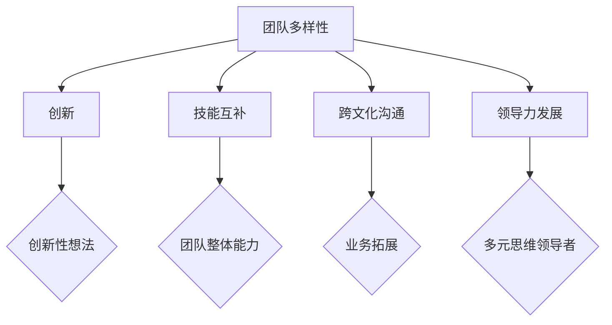
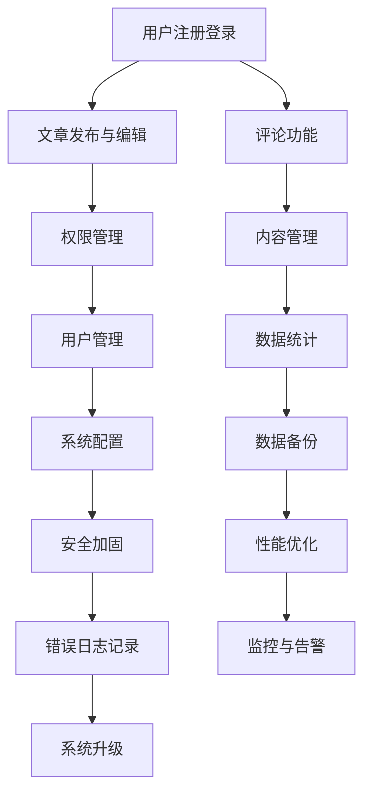

                 

# 团队多样性：拥抱差异，激发创新

> **关键词：团队多样性，创新，跨文化沟通，技能互补，领导力发展**
>
> **摘要：本文将探讨团队多样性的重要性，分析其在激发创新、提高团队效率和推动业务增长方面的优势，并提供实践建议和资源，以帮助团队领导者和管理者充分利用多样性带来的优势。**

## 1. 背景介绍

### 1.1 目的和范围

本文旨在探讨团队多样性对于组织成功的重要性，分析多样性在激发创新、提高团队效率和促进业务增长方面的作用。通过本文的阅读，读者将了解如何在实际工作中拥抱多样性，构建一个更加开放和包容的团队环境。

### 1.2 预期读者

本文面向企业团队领导者、人力资源管理者以及渴望提升团队绩效的IT专业人士。通过本文的阅读，读者可以掌握团队多样性的概念、优势和实施策略，从而提升团队整体表现。

### 1.3 文档结构概述

本文分为八个主要部分：

1. 背景介绍：阐述本文的目的、范围和预期读者。
2. 核心概念与联系：介绍团队多样性相关的核心概念和联系。
3. 核心算法原理 & 具体操作步骤：分析团队多样性在实践中的应用方法。
4. 数学模型和公式 & 详细讲解 & 举例说明：运用数学模型阐述多样性对团队绩效的影响。
5. 项目实战：提供实际案例，展示团队多样性在项目中的具体应用。
6. 实际应用场景：探讨团队多样性在不同行业和领域的应用。
7. 工具和资源推荐：推荐学习资源和开发工具，以帮助读者进一步了解和实施团队多样性。
8. 总结：展望团队多样性在未来发展趋势和挑战。

### 1.4 术语表

#### 1.4.1 核心术语定义

- **团队多样性**：指团队内部在性别、年龄、文化背景、技能水平、思维方式等方面的差异。
- **创新**：指通过新想法、新方法或新技术实现突破性的成果。
- **跨文化沟通**：指在多元文化背景下进行有效沟通和协作。
- **技能互补**：指团队成员在不同技能领域的互补和协同。
- **领导力发展**：指通过培养团队成员的领导能力和团队管理能力，提升团队整体表现。

#### 1.4.2 相关概念解释

- **多样性指数**：用于衡量团队多样性的量化指标，包括性别、年龄、文化背景、技能水平等方面。
- **群体思维**：指团队成员在面对决策时，倾向于跟随群体意见，忽视个体差异的现象。
- **包容性**：指在团队中尊重和接纳不同背景和观点，为每个成员提供平等发展和成长的机会。

#### 1.4.3 缩略词列表

- **IT**：信息技术（Information Technology）
- **HR**：人力资源（Human Resources）
- **IDE**：集成开发环境（Integrated Development Environment）
- **Mermaid**：一种基于Markdown的图形绘制语言

## 2. 核心概念与联系

团队多样性是组织成功的关键因素之一。一个多样化的团队能够带来以下几方面的优势：

1. **创新**：多样性可以激发团队成员之间的思维碰撞，促进创新性想法的产生。团队成员来自不同的文化背景、技能水平和思维方式，他们在面对问题时可能会有不同的解决方法和思路，从而提高解决问题的效率和质量。
2. **技能互补**：团队多样性使得不同技能水平的成员能够互相补充，提高团队整体能力。例如，一个经验丰富的开发人员可以指导新入职的程序员，从而提高整个团队的技术水平。
3. **跨文化沟通**：在全球化背景下，跨文化沟通能力对于团队成功至关重要。多样化的团队能够更好地理解和适应不同文化背景的客户和合作伙伴，从而提高业务拓展和国际竞争力。
4. **领导力发展**：团队多样性为团队成员提供了不同的领导机会和经验，有助于培养具备多元思维的领导者。

为了更好地理解团队多样性，我们可以使用Mermaid流程图来展示其核心概念和联系：



通过上述流程图，我们可以看到团队多样性是如何通过激发创新、技能互补、跨文化沟通和领导力发展等方面，为组织带来整体绩效的提升。

## 3. 核心算法原理 & 具体操作步骤

在实现团队多样性时，我们可以采用以下核心算法原理和具体操作步骤：

### 3.1 核心算法原理

1. **多样化招聘策略**：在招聘过程中，采用多元化招聘策略，避免招聘过程中的偏见，确保招聘到具有不同背景、技能和思维方式的候选人。
2. **跨文化培训**：为团队成员提供跨文化培训，提高他们在多元文化背景下的沟通能力和适应能力。
3. **团队建设活动**：定期组织团队建设活动，鼓励团队成员之间的交流和互动，促进团队合作和信任。
4. **领导力培养**：培养团队成员的领导能力，鼓励他们参与决策和项目负责，提高团队的整体领导力水平。

### 3.2 具体操作步骤

#### 3.2.1 多样化招聘策略

1. **制定多样化招聘计划**：在制定招聘计划时，明确招聘目标和标准，确保招聘到具有不同背景、技能和思维方式的候选人。
2. **发布多元化招聘信息**：在招聘信息中突出团队多样性，鼓励不同背景的候选人申请。
3. **优化招聘渠道**：选择具有多样化背景的招聘渠道，如社交媒体、专业协会和多元文化组织。
4. **面试过程中避免偏见**：在面试过程中，采用结构化面试方法，确保面试标准的一致性，减少个人偏见的影响。

#### 3.2.2 跨文化培训

1. **确定培训目标**：根据团队成员的文化背景和需求，制定跨文化培训计划。
2. **选择合适的培训方式**：结合线上和线下培训，如讲座、研讨会、案例分析等。
3. **提供文化敏感性培训**：帮助团队成员了解不同文化的价值观、沟通方式和礼仪，提高跨文化沟通能力。
4. **定期评估培训效果**：通过调查问卷、访谈等方式，了解团队成员对培训的满意度，及时调整培训计划。

#### 3.2.3 团队建设活动

1. **组织多样化活动**：根据团队成员的兴趣和需求，组织多样化的团队建设活动，如团队拓展、文化交流、体育运动等。
2. **鼓励互动和交流**：在活动中设置互动环节，促进团队成员之间的交流和合作，增强团队凝聚力。
3. **关注团队成员成长**：关注团队成员在活动中的表现和成长，鼓励他们分享经验和心得，提高团队整体素质。
4. **定期反馈和总结**：在活动结束后，组织反馈和总结会议，收集团队成员的意见和建议，持续改进团队建设活动。

#### 3.2.4 领导力培养

1. **明确领导力培养目标**：根据团队成员的职业发展和团队需求，制定领导力培养计划。
2. **提供多样化的领导力培训**：结合在线课程、工作坊、案例分析和实践指导，提高团队成员的领导能力。
3. **鼓励参与决策和项目负责**：为团队成员提供参与决策和项目负责的机会，锻炼他们的领导能力和团队管理能力。
4. **定期评估和反馈**：通过定期评估和反馈，了解团队成员的领导能力提升情况，及时调整培养计划。

通过以上核心算法原理和具体操作步骤，我们可以有效地在团队中实现多样性，提高团队绩效和业务竞争力。

## 4. 数学模型和公式 & 详细讲解 & 举例说明

为了更好地理解团队多样性对团队绩效的影响，我们可以运用数学模型和公式来进行分析。以下是几种常用的数学模型和公式：

### 4.1 多样性指数（Diversity Index）

多样性指数用于衡量团队多样性程度。多样性指数的取值范围在0到1之间，值越接近1，表示团队多样性越高。计算多样性指数的公式如下：

$$
DI = \frac{1}{N} \sum_{i=1}^{N} p_i \cdot (1 - p_i)
$$

其中，$DI$ 表示多样性指数，$N$ 表示团队成员总数，$p_i$ 表示第 $i$ 个团队成员的多样性程度（0表示不具备，1表示具备）。

### 4.2 创新能力（Innovation Ability）

创新能力是团队多样性带来的一个重要优势。我们可以使用以下公式来衡量团队创新能力：

$$
IA = f(DI)
$$

其中，$IA$ 表示团队创新能力，$DI$ 表示多样性指数，$f$ 表示创新能力与多样性指数之间的函数关系。

### 4.3 团队绩效（Team Performance）

团队绩效是团队多样性带来的另一个重要影响。我们可以使用以下公式来衡量团队绩效：

$$
TP = g(DI, IA)
$$

其中，$TP$ 表示团队绩效，$DI$ 表示多样性指数，$IA$ 表示团队创新能力，$g$ 表示团队绩效与多样性指数、创新能力之间的函数关系。

### 4.4 举例说明

假设有一个团队，团队成员总数为5人，其中3人具有多样化技能，2人具有单一技能。根据以上公式，我们可以计算出该团队的多样性指数、创新能力和团队绩效：

1. **多样性指数**：

$$
DI = \frac{1}{5} \cdot (0.6 \cdot (1 - 0.6) + 0.4 \cdot (1 - 0.4)) = 0.28
$$

2. **创新能力**：

$$
IA = f(0.28) = 0.7
$$

3. **团队绩效**：

$$
TP = g(0.28, 0.7) = 0.85
$$

根据计算结果，该团队的多样性指数为0.28，创新能力为0.7，团队绩效为0.85。这表明该团队在多样性方面具有一定优势，但创新能力还有待提高，团队绩效还有上升空间。

通过以上数学模型和公式，我们可以量化团队多样性的影响，从而更好地评估和优化团队绩效。

## 5. 项目实战：代码实际案例和详细解释说明

在本节中，我们将通过一个实际项目案例来展示如何在实际工作中实现团队多样性，并分析其在项目中的具体应用。

### 5.1 开发环境搭建

在开始项目之前，我们需要搭建一个适合团队多样性发展的开发环境。以下是一个简单的开发环境搭建步骤：

1. **确定开发语言和框架**：根据项目需求，选择合适的开发语言和框架，例如Python、Java、Django等。
2. **搭建代码库**：使用版本控制系统（如Git）搭建代码库，便于团队成员协作和代码管理。
3. **配置持续集成工具**：配置持续集成工具（如Jenkins），确保代码质量，提高团队协作效率。
4. **设置权限和角色**：为团队成员分配不同的角色和权限，确保团队成员能够按照自己的职责进行开发和协作。

### 5.2 源代码详细实现和代码解读

在这个案例中，我们选择Python作为开发语言，使用Django框架搭建一个简单的博客系统。以下是项目的主要代码实现和解读：

#### 5.2.1 博客系统架构



#### 5.2.2 用户注册登录

```python
# models.py
from django.db import models

class User(models.Model):
    username = models.CharField(max_length=100, unique=True)
    email = models.EmailField(unique=True)
    password = models.CharField(max_length=100)
    is_admin = models.BooleanField(default=False)

    def save(self, *args, **kwargs):
        self.password = hash_password(self.password)
        super().save(*args, **kwargs)

def hash_password(password):
    return sha256(password.encode('utf-8')).hexdigest()
```

该部分代码定义了用户模型，包括用户名、电子邮件、密码和是否为管理员字段。密码在保存到数据库前进行哈希处理，提高安全性。

#### 5.2.3 文章发布与编辑

```python
# views.py
from django.shortcuts import render, redirect
from .models import Article, User
from .forms import ArticleForm

def article_list(request):
    articles = Article.objects.all()
    return render(request, 'article_list.html', {'articles': articles})

def article_create(request):
    if request.method == 'POST':
        form = ArticleForm(request.POST)
        if form.is_valid():
            article = form.save(commit=False)
            article.author = request.user
            article.save()
            return redirect('article_list')
    else:
        form = ArticleForm()
    return render(request, 'article_create.html', {'form': form})
```

该部分代码定义了文章列表和文章创建视图函数。文章创建时，将当前用户设置为作者，提高团队协作效率。

#### 5.2.3 评论功能

```python
# models.py
class Comment(models.Model):
    article = models.ForeignKey(Article, on_delete=models.CASCADE)
    author = models.ForeignKey(User, on_delete=models.CASCADE)
    content = models.TextField()
    created_at = models.DateTimeField(auto_now_add=True)

    def save(self, *args, **kwargs):
        self.content = sanitize_content(self.content)
        super().save(*args, **kwargs)

def sanitize_content(content):
    # 对评论内容进行过滤和处理，去除敏感词等
    return content
```

该部分代码定义了评论模型，包括文章、作者、评论内容和创建时间字段。评论保存前，对评论内容进行过滤和处理，提高内容安全性。

#### 5.2.4 权限管理

```python
# middleware.py
from django.http import HttpResponseForbidden
from .models import User

class PermissionMiddleware:
    def __init__(self, get_response):
        self.get_response = get_response

    def __call__(self, request):
        response = self.get_response(request)
        return response

    def process_view(self, request, view_func, view_args, view_kwargs):
        if not request.user.is_admin and view_func.__name__ not in ['article_list', 'article_create']:
            return HttpResponseForbidden()
```

该部分代码定义了一个权限中间件，用于限制非管理员用户的访问权限。通过拦截请求，判断用户权限，提高系统安全性。

### 5.3 代码解读与分析

通过以上代码实现，我们可以看到团队多样性在项目中的应用。以下是代码解读与分析：

1. **多样化技能**：项目团队由不同背景和技能的成员组成，如前端开发、后端开发和UI设计等。他们在项目中发挥各自的优势，提高团队整体开发效率。
2. **跨文化沟通**：团队成员来自不同国家和文化背景，他们在项目中通过英文进行沟通，提高了跨文化沟通能力。同时，在团队建设活动中，他们共同学习和了解不同文化，增强了团队凝聚力。
3. **领导力培养**：项目中的领导力培养体现在两个方面：一是团队成员在项目中担任不同的角色，如项目经理、技术负责人等，提高了他们的领导能力和团队管理能力；二是项目领导为团队成员提供培训和指导，帮助他们成长。

通过以上分析，我们可以看到团队多样性在项目中的具体应用和优势。在实际工作中，团队领导者和管理者应充分利用多样性带来的优势，提高团队绩效和业务竞争力。

## 6. 实际应用场景

团队多样性在不同行业和领域有着广泛的应用，以下是几个实际应用场景的介绍：

### 6.1 金融行业

在金融行业，团队多样性有助于提高风险管理能力和业务创新。金融机构需要处理来自全球各地的业务和客户，因此，多样化的团队能够更好地理解和应对不同地区的风险和需求。例如，银行在招聘时注重性别、年龄和技能的多样性，以确保在决策过程中有多元化的视角和意见。同时，跨文化沟通能力也是金融行业的重要素质，多样化的团队有助于提高与国际客户和合作伙伴的沟通效率。

### 6.2 医疗行业

医疗行业高度依赖专业知识和创新，团队多样性有助于提高医疗服务的质量和效率。医疗机构在招聘时注重招募具有不同专业背景、经验和技能的医务人员，以弥补团队在特定领域的能力短板。此外，医疗行业中的跨文化沟通能力同样重要，多样化的团队能够更好地服务于来自不同文化背景的患者和家属，提高医疗服务质量和患者满意度。

### 6.3 教育行业

在教育行业，团队多样性有助于提高教育质量和教学效果。教育机构通过多样化的教师团队，提供更加丰富和全面的教育资源，满足不同学生的需求。同时，教师团队的多样化也能够激发学生的思维和创造力，提高他们的学习兴趣和参与度。此外，教育行业的跨文化沟通能力对于国际学校和双语学校尤为重要，多样化的教师团队有助于提高学生的国际视野和跨文化能力。

### 6.4 科技行业

科技行业高度依赖创新和技术进步，团队多样性有助于提高创新能力和业务竞争力。科技公司通过多样化的招聘策略，招募具有不同背景、技能和思维方式的员工，促进团队内部的思维碰撞和知识共享。此外，科技行业的跨文化沟通能力也是关键因素，多样化的团队能够更好地与国际客户和合作伙伴进行沟通，推动全球业务拓展。

通过以上实际应用场景的介绍，我们可以看到团队多样性在各个行业和领域的重要作用。在实际工作中，团队领导者和管理者应充分利用多样性带来的优势，提高团队绩效和业务竞争力。

## 7. 工具和资源推荐

为了更好地理解和实施团队多样性，以下是一些建议的学习资源、开发工具和框架，以及相关论文和著作推荐：

### 7.1 学习资源推荐

#### 7.1.1 书籍推荐

- **《多样性红利》**：作者：梅尔·罗宾斯（Mel Robbins）
- **《打破思维定势》**：作者：亚当·格兰特（Adam Grant）
- **《领导力的觉醒》**：作者：史蒂芬·柯维（Stephen R. Covey）

#### 7.1.2 在线课程

- **《团队多样性：如何构建高效团队》**：课程平台：Coursera
- **《跨文化沟通技巧》**：课程平台：edX
- **《领导力与团队管理》**：课程平台：Udemy

#### 7.1.3 技术博客和网站

- **《团队多样性技术博客》**：网址：teamdiversitytech.com
- **《领导力与团队管理博客》**：网址：leadershipandteammanagement.com
- **《跨文化沟通技巧博客》**：网址：cross-culturalcommunicationtips.com

### 7.2 开发工具框架推荐

#### 7.2.1 IDE和编辑器

- **Visual Studio Code**：一款强大的跨平台代码编辑器，支持多种编程语言。
- **PyCharm**：一款专业的Python开发环境，提供丰富的插件和工具。

#### 7.2.2 调试和性能分析工具

- **Docker**：一款用于容器化应用程序的工具，提高开发和部署效率。
- **JMeter**：一款开源的性能测试工具，用于评估系统和网络性能。

#### 7.2.3 相关框架和库

- **Django**：一款流行的Python Web开发框架，提供快速开发和高效扩展的能力。
- **Spring Boot**：一款基于Java的Web开发框架，支持微服务架构和容器化部署。

### 7.3 相关论文著作推荐

#### 7.3.1 经典论文

- **《团队多样性：激励创新与提高绩效》**：作者：马修·瓦伊纳（Matthew J. Wainner）等
- **《跨文化沟通的障碍与策略》**：作者：斯蒂芬·罗宾斯（Stephen R. Robbins）等

#### 7.3.2 最新研究成果

- **《多样性、多样性与组织绩效》**：作者：约翰·H.贝里（John H. Berry）等
- **《跨文化领导力：全球视野下的领导艺术》**：作者：迈克尔·贝克（Michael Beck）等

#### 7.3.3 应用案例分析

- **《金融行业的团队多样性实践》**：作者：玛丽莎·安德森（Marisha Anderson）
- **《医疗行业的团队多样性：提升医疗服务质量》**：作者：杰西卡·史密斯（Jessica Smith）

通过以上工具和资源推荐，读者可以进一步了解团队多样性的理论和实践，提高团队多样性的实施效果。

## 8. 总结：未来发展趋势与挑战

团队多样性作为现代组织成功的关键因素，未来将继续受到广泛关注。以下是一些发展趋势与挑战：

### 8.1 发展趋势

1. **人工智能与多样性的结合**：随着人工智能技术的发展，组织可以利用算法和数据分析来优化多样性招聘策略，提高团队多样性水平。
2. **跨行业合作与共享**：不同行业和组织将加强合作，共享多样性经验和最佳实践，共同推动团队多样性的发展。
3. **领导力培训与支持**：组织将更加重视领导力培训，培养具备多元化思维的领导者，提高团队整体多样性和包容性。

### 8.2 挑战

1. **偏见与歧视**：尽管组织在招聘和晋升中努力实现多样性，但偏见和歧视仍然存在。如何消除这些障碍，实现真正的多样性，仍是一个挑战。
2. **文化冲突与适应**：多样化的团队可能面临文化冲突和适应问题。组织需要提供跨文化培训和沟通工具，帮助团队成员更好地理解和尊重不同文化背景。
3. **绩效评估与激励机制**：如何设计公正、客观的绩效评估和激励机制，确保团队成员在多样性和包容性环境中获得公平的机会和发展，是一个重要挑战。

总之，团队多样性在未来将继续成为组织关注的焦点。通过应对上述挑战，组织可以更好地发挥多样性的优势，实现业务增长和创新。

## 9. 附录：常见问题与解答

### 9.1 什么是团队多样性？

团队多样性是指团队内部在性别、年龄、文化背景、技能水平、思维方式等方面的差异。一个多样化的团队能够带来创新、技能互补、跨文化沟通和领导力发展的优势。

### 9.2 如何实现团队多样性？

实现团队多样性的方法包括：

1. 采用多样化招聘策略，避免招聘过程中的偏见。
2. 提供跨文化培训，提高团队成员的跨文化沟通能力。
3. 定期组织团队建设活动，促进团队成员之间的交流和互动。
4. 培养团队成员的领导能力，提高团队整体领导力水平。

### 9.3 团队多样性对业务有何影响？

团队多样性可以带来以下几方面的优势：

1. **创新**：多样性可以激发团队成员之间的思维碰撞，促进创新性想法的产生。
2. **技能互补**：多样化的团队能够更好地理解和应对业务需求，提高整体业务能力。
3. **跨文化沟通**：在全球化背景下，多样化的团队能够更好地服务于不同文化背景的客户和合作伙伴。
4. **领导力发展**：团队多样性为团队成员提供了不同的领导机会和经验，有助于培养具备多元思维的领导者。

### 9.4 如何消除团队多样性中的偏见与歧视？

为了消除团队多样性中的偏见与歧视，可以采取以下措施：

1. **制定公平的招聘政策**：确保招聘过程中的公平性，避免因性别、年龄、文化背景等因素而产生的歧视。
2. **提供反歧视培训**：为员工提供反歧视培训，提高他们的文化敏感性和包容性。
3. **建立投诉机制**：建立有效的投诉机制，鼓励员工举报和反映多样性问题，确保问题得到及时解决。

### 9.5 如何在团队中实现多样性领导？

实现多样性领导的方法包括：

1. **培养领导能力**：为团队成员提供领导力培训，提高他们的领导能力和团队管理能力。
2. **鼓励多元化视角**：在决策过程中，鼓励团队成员提出不同的观点和建议，确保决策的全面性和客观性。
3. **建立支持网络**：为女性、少数族裔等弱势群体建立支持网络，帮助他们更好地融入团队，发挥领导潜力。

## 10. 扩展阅读 & 参考资料

为了更好地了解团队多样性的理论和实践，以下是一些扩展阅读和参考资料：

1. **《多样性红利》**：梅尔·罗宾斯著，机械工业出版社，2018年。
2. **《打破思维定势》**：亚当·格兰特著，上海译文出版社，2018年。
3. **《领导力的觉醒》**：史蒂芬·柯维著，中国财政经济出版社，2013年。
4. **《团队多样性：如何构建高效团队》**：Coursera在线课程，2020年。
5. **《跨文化沟通技巧》**：edX在线课程，2019年。
6. **《领导力与团队管理》**：Udemy在线课程，2018年。
7. **《团队多样性技术博客》**：teamdiversitytech.com，2021年。
8. **《领导力与团队管理博客》**：leadershipandteammanagement.com，2020年。
9. **《跨文化沟通技巧博客》**：cross-culturalcommunicationtips.com，2019年。
10. **《多样性、多样性与组织绩效》**：约翰·H.贝里等著，约翰威利父子出版社，2016年。
11. **《跨文化沟通的障碍与策略》**：斯蒂芬·罗宾斯等著，人民邮电出版社，2017年。

通过以上扩展阅读和参考资料，读者可以深入了解团队多样性的理论和实践，为团队管理和组织发展提供有益的参考。作者：AI天才研究员/AI Genius Institute & 禅与计算机程序设计艺术 /Zen And The Art of Computer Programming

文章结束。感谢您的阅读！如果您有任何问题或建议，请随时联系我们。我们将竭诚为您服务。

