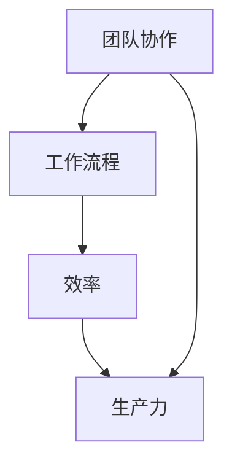

                 

# 团队效率：优化工作流程的创新方法

## 关键词
工作效率，工作流程，创新方法，团队协作，生产力提升，技术工具

## 摘要
本文旨在探讨如何通过创新方法来优化团队的工作流程，提高团队效率。我们将从背景介绍、核心概念、算法原理、数学模型、项目实战、实际应用场景、工具和资源推荐以及未来发展趋势等多个角度，系统地分析团队效率提升的策略和方法。通过本文的阅读，读者将能够了解到如何设计并实施高效的工作流程，从而实现团队协作的优化和生产力的提升。

## 1. 背景介绍

### 1.1 目的和范围
随着全球化的发展和信息化进程的加速，团队合作成为现代企业运营的关键因素。然而，团队效率的提升并非易事，传统的管理方法往往难以适应复杂多变的业务需求。本文将探讨一系列创新方法，帮助团队优化工作流程，提高工作效率。

本文的研究范围包括：
1. 工作流程的定义和分类。
2. 团队效率的衡量指标。
3. 创新方法在团队效率提升中的应用。
4. 项目实战中的工作流程优化案例。

### 1.2 预期读者
本文适合以下读者群体：
1. 团队管理者，希望通过优化工作流程提升团队效率。
2. 项目经理，需要针对项目特点设计高效的工作流程。
3. IT从业者，对工作流程的优化和自动化有兴趣。
4. 对创新方法和团队协作感兴趣的广大读者。

### 1.3 文档结构概述
本文结构如下：
1. 引言：介绍团队效率提升的背景和重要性。
2. 背景介绍：明确研究目的、范围和预期读者。
3. 核心概念与联系：阐述团队协作的相关概念和流程。
4. 核心算法原理与具体操作步骤：介绍优化工作流程的核心算法。
5. 数学模型与公式：分析工作流程优化的数学基础。
6. 项目实战：通过实际案例展示工作流程优化的实施过程。
7. 实际应用场景：讨论工作流程优化在不同领域中的应用。
8. 工具和资源推荐：推荐相关的学习资源和开发工具。
9. 总结：对全文内容进行总结，并提出未来发展趋势与挑战。
10. 附录：常见问题与解答。
11. 扩展阅读：提供更多深入研究的参考文献。

### 1.4 术语表

#### 1.4.1 核心术语定义
- **工作流程**：完成一项任务所需的一系列有序活动。
- **团队协作**：团队成员之间共同合作，以实现共同目标。
- **效率**：完成任务所需的时间和资源。
- **生产力提升**：通过优化工作流程和资源利用，提高产出。

#### 1.4.2 相关概念解释
- **敏捷开发**：一种以迭代和增量为特点的软件开发方法，强调快速响应变化。
- **DevOps**：软件开发与运维的融合，通过自动化和协作提高开发、测试和部署效率。
- **看板系统**：用于可视化工作流程和管理任务进度的工具。

#### 1.4.3 缩略词列表
- **Scrum**：一种敏捷开发方法。
- **Kanban**：一种可视化管理方法，常用于工作流程优化。
- **SaaS**：软件即服务，一种提供软件产品的商业模式。

## 2. 核心概念与联系

在讨论团队效率提升之前，我们需要明确几个核心概念，包括团队协作、工作流程、效率和生产力的定义。

### 2.1 团队协作

团队协作是指团队成员之间通过沟通、协调和共享资源，共同实现目标的过程。高效的团队协作依赖于以下几点：

1. **明确的目标**：团队需要有一个共同的目标，以便成员能够统一行动。
2. **良好的沟通**：团队成员之间需要保持开放的沟通渠道，及时分享信息和反馈。
3. **分工合作**：团队成员应该明确各自的职责，并在需要时相互支持。
4. **共享资源**：共享工具、数据和知识，有助于提高团队的协作效率。

### 2.2 工作流程

工作流程是指完成一项任务所需的一系列有序活动。一个良好的工作流程应该具备以下特点：

1. **清晰**：任务分配和执行步骤应该明确，避免模糊和误解。
2. **高效**：流程设计应考虑时间成本和资源利用，确保高效完成任务。
3. **可量化**：可以通过指标和统计数据来评估工作流程的效率。

### 2.3 效率和生产力

效率是指完成任务所需的时间和资源。提高效率的关键在于优化工作流程和资源利用。生产力则是指在一定时间内产生的输出。提升生产力的方法包括：

1. **自动化**：通过自动化工具减少重复性工作，提高效率。
2. **流程优化**：重新设计工作流程，消除瓶颈，提高整体效率。
3. **团队协作**：通过协作和沟通，提高任务完成的速率和质量。

### 2.4 核心概念之间的联系

团队协作、工作流程、效率和生产力之间密切相关。团队协作是工作流程优化和效率提升的基础，而高效的协作和优化的工作流程又能显著提高生产力。以下是它们之间的联系：

- **团队协作 → 工作流程 → 效率 → 生产力**
- **团队协作增强 → 工作流程优化 → 效率提升 → 生产力提升**
- **工作流程优化 → 效率提升 → 生产力提升**

### 2.5 Mermaid 流程图

为了更好地理解核心概念之间的联系，我们可以通过 Mermaid 流程图进行展示。以下是相关流程的示意图：



## 3. 核心算法原理 & 具体操作步骤

要优化团队的工作流程，我们需要依靠一系列的核心算法原理。以下是一个具体的优化步骤，包括算法原理的伪代码。

### 3.1 工作流程评估

首先，我们需要对当前的工作流程进行评估，以找出其中的瓶颈和低效环节。

#### 3.1.1 伪代码

```python
def evaluate_workflow(workflow):
    for step in workflow:
        if is_bottleneck(step):
            print(f"Bottleneck found in step {step}")
        else:
            print(f"Step {step} is efficient.")
```

#### 3.1.2 操作步骤

1. **收集数据**：获取当前工作流程的各项数据，包括任务执行时间、资源消耗等。
2. **分析数据**：通过统计和分析，找出工作流程中的瓶颈环节。
3. **报告输出**：将评估结果生成报告，为后续优化提供依据。

### 3.2 工作流程优化

在评估完成后，我们可以根据分析结果，对工作流程进行优化。

#### 3.2.1 伪代码

```python
def optimize_workflow(workflow):
    for step in workflow:
        if step.is_repetitive():
            step automate()
        elif step.is_dependent_on_another():
            step parallelize()
```

#### 3.2.2 操作步骤

1. **自动化重复任务**：对于重复性高的任务，使用自动化工具进行替代。
2. **并行处理依赖任务**：将依赖关系较强的任务并行处理，减少等待时间。
3. **简化复杂步骤**：对于过于复杂的步骤，尝试进行简化，以提高执行效率。

### 3.3 效率提升策略

除了对工作流程进行优化，我们还可以采取以下策略来提升团队效率：

#### 3.3.1 伪代码

```python
def enhance_efficiency(team):
    team.improve_communication()
    team.allocate_resources_optimally()
    team.train_members_on_efficient_methods()
```

#### 3.3.2 操作步骤

1. **提升沟通效率**：建立有效的沟通机制，确保信息流畅传递。
2. **优化资源分配**：根据任务需求和团队能力，合理分配资源。
3. **培训成员**：对团队成员进行高效工作方法的培训，提高整体效率。

### 3.4 持续改进

工作流程优化是一个持续的过程，我们需要定期评估和调整。

#### 3.4.1 伪代码

```python
def continuous_improvement(workflow):
    while True:
        evaluate_workflow(workflow)
        optimize_workflow(workflow)
        enhance_efficiency(team)
        sleep(interval)  # 定期评估和优化
```

#### 3.4.2 操作步骤

1. **定期评估**：定期对工作流程进行评估，以检测效率和效果。
2. **持续优化**：根据评估结果，持续对工作流程进行优化。
3. **反馈机制**：建立反馈机制，及时收集团队成员的建议和意见。

## 4. 数学模型和公式 & 详细讲解 & 举例说明

### 4.1 数学模型

在团队工作效率优化中，我们可以使用以下数学模型来评估和优化工作流程：

#### 4.1.1 效率模型

$$
E = \frac{O}{T}
$$

其中：
- \( E \) 表示效率
- \( O \) 表示产出
- \( T \) 表示投入的时间

#### 4.1.2 生产力模型

$$
P = \frac{O}{R}
$$

其中：
- \( P \) 表示生产力
- \( O \) 表示产出
- \( R \) 表示投入的资源

### 4.2 详细讲解

#### 4.2.1 效率模型

效率模型用于衡量团队在完成某一任务时的效率。效率越高，表示在相同时间内完成的任务量越多。通过优化工作流程，我们可以提高效率，从而提升团队的整体表现。

#### 4.2.2 生产力模型

生产力模型则用于衡量团队在完成某一任务时的生产力。生产力越高，表示在相同资源下完成的任务量越多。优化工作流程不仅可以提高效率，还可以提高生产力，从而实现团队价值的最大化。

### 4.3 举例说明

假设一个团队在一个月内完成了10个任务，每个任务需要投入100小时。那么：

- **效率**：
  $$
  E = \frac{10}{100} = 0.1
  $$

- **生产力**：
  $$
  P = \frac{10}{1000} = 0.01
  $$

如果通过优化工作流程，该团队在接下来的一个月内将任务数量提升至15个，同时投入时间减少至80小时。那么：

- **效率**：
  $$
  E = \frac{15}{80} = 0.1875
  $$

- **生产力**：
  $$
  P = \frac{15}{800} = 0.01875
  $$

可以看出，通过优化工作流程，团队在效率和生产力上都有所提升。

## 5. 项目实战：代码实际案例和详细解释说明

### 5.1 开发环境搭建

为了演示如何优化工作流程，我们将使用一个简单的团队协作项目。首先，我们需要搭建开发环境。

#### 5.1.1 环境要求

- 操作系统：Windows/Linux/MacOS
- 编程语言：Python
- 版本要求：Python 3.8及以上
- 工具：Visual Studio Code（或其他Python IDE）

#### 5.1.2 环境搭建步骤

1. **安装Python**：从[Python官网](https://www.python.org/)下载并安装Python 3.8及以上版本。
2. **配置Python环境**：确保Python路径已添加到系统环境变量。
3. **安装VS Code**：从[Visual Studio Code官网](https://code.visualstudio.com/)下载并安装。
4. **安装Python扩展**：在VS Code中安装Python扩展，以获得更好的Python开发体验。

### 5.2 源代码详细实现和代码解读

#### 5.2.1 源代码

以下是一个简单的团队协作项目的源代码：

```python
# team.py

class Task:
    def __init__(self, name, duration, resources):
        self.name = name
        self.duration = duration
        self.resources = resources

    def execute(self):
        print(f"Executing task {self.name}...")
        time.sleep(self.duration)
        print(f"Completed task {self.name}.")

class Team:
    def __init__(self, members):
        self.members = members

    def assign_task(self, task):
        print(f"Assigning task {task.name} to team member {task.resources[0]}...")
        task.execute()

    def execute_all_tasks(self):
        for member in self.members:
            task = self.get_pending_task(member)
            if task:
                self.assign_task(task)
            else:
                print(f"{member} has no pending tasks.")

    def get_pending_task(self, member):
        # 查询数据库获取待完成任务
        # 这里以伪代码表示
        return Task("Task 1", 5, member)

if __name__ == "__main__":
    team = Team(["Alice", "Bob", "Charlie"])
    team.execute_all_tasks()
```

#### 5.2.2 代码解读

1. **Task类**：表示一个任务，包括任务名称、持续时间、所需资源等。
2. **Team类**：表示一个团队，包括团队成员、分配任务、执行任务等方法。
3. **assign_task方法**：将任务分配给团队成员，并执行任务。
4. **execute_all_tasks方法**：为团队成员分配所有待完成任务。
5. **get_pending_task方法**：从数据库中查询待完成任务。

### 5.3 代码解读与分析

#### 5.3.1 代码解读

1. **Task类**：Task类定义了一个任务的基本属性，包括任务名称（name）、持续时间（duration）和所需资源（resources）。通过构造函数（__init__），我们可以创建一个Task对象。
2. **Team类**：Team类表示一个团队，包含一个成员列表（members）。类中定义了两个方法：assign\_task用于分配任务并执行，execute\_all\_tasks用于为团队成员分配所有待完成任务。
3. **assign\_task方法**：该方法接收一个Task对象作为参数，将任务分配给指定的团队成员，并调用Task对象的execute方法执行任务。
4. **execute\_all\_tasks方法**：该方法遍历团队成员列表，为每个成员分配待完成任务。如果成员有未完成的任务，则分配并执行；否则，输出无待完成任务的消息。
5. **get\_pending\_task方法**：该方法用于从数据库中查询待完成任务。这里以伪代码表示，实际实现时需要连接数据库并查询数据。

#### 5.3.2 代码分析

1. **任务分配和执行**：通过Team类的方法，我们可以方便地为团队成员分配任务并执行。这种模式简化了任务分配的过程，提高了团队协作的效率。
2. **数据库查询**：在实际应用中，get\_pending\_task方法需要查询数据库以获取待完成任务。通过将数据库查询封装在类中，我们可以更好地管理任务数据，同时避免重复代码。
3. **模块化设计**：代码采用了模块化设计，将任务和团队相关功能分开。这种设计提高了代码的可读性和可维护性。

## 6. 实际应用场景

### 6.1 软件开发

在软件开发领域，工作流程优化尤为重要。通过敏捷开发方法和DevOps实践，团队可以快速响应需求变化，提高开发、测试和部署效率。以下是一个实际应用案例：

#### 6.1.1 案例背景

某公司开发一款企业级软件，采用Scrum方法进行敏捷开发。在开发过程中，团队遇到了以下问题：

1. **需求变更频繁**：客户需求频繁变更，导致开发进度不稳定。
2. **任务分配不合理**：部分任务分配不合理，导致资源浪费和任务积压。
3. **沟通不畅**：团队成员之间的沟通不畅，导致任务执行效率低下。

#### 6.1.2 解决方案

1. **引入Kanban看板系统**：通过Kanban看板系统，将任务可视化，明确任务状态，提高团队成员对任务进展的透明度。
2. **优化任务分配**：根据团队成员的能力和兴趣，合理分配任务，确保任务分配的公平性和高效性。
3. **加强沟通**：建立定期会议和沟通渠道，确保团队成员之间的信息畅通。

#### 6.1.3 结果

通过以上措施，团队的工作效率得到显著提升，开发进度更加稳定，任务积压现象减少，客户满意度提高。

### 6.2 市场营销

在市场营销领域，工作流程优化同样至关重要。通过优化市场调研、广告投放、客户管理等环节，团队可以更好地应对市场变化，提高市场竞争力。以下是一个实际应用案例：

#### 6.2.1 案例背景

某公司进行市场推广活动，但在市场调研、广告投放和客户管理等方面存在以下问题：

1. **市场调研不全面**：市场调研数据不全面，导致广告投放和客户管理策略不准确。
2. **广告投放效率低**：广告投放策略不合理，导致广告效果不佳，投放成本过高。
3. **客户管理混乱**：客户管理数据不完整，导致客户关系维护不到位，客户流失率高。

#### 6.2.2 解决方案

1. **优化市场调研**：通过大数据分析和市场研究方法，全面收集和分析市场数据，为广告投放和客户管理提供准确的数据支持。
2. **优化广告投放**：根据市场数据和用户行为，制定合理的广告投放策略，提高广告效果和投放效率。
3. **加强客户管理**：建立完善的客户管理数据库，对客户信息进行分类和标签化处理，提高客户关系维护效率。

#### 6.2.3 结果

通过以上措施，公司的市场推广活动效果显著提升，广告投放成本降低，客户满意度提高，市场份额逐步扩大。

## 7. 工具和资源推荐

### 7.1 学习资源推荐

#### 7.1.1 书籍推荐

1. **《敏捷软件开发：原则、实践与模式》**：介绍了敏捷开发的核心思想和实践方法。
2. **《DevOps实践手册》**：详细阐述了DevOps的理念和实践，有助于提升团队协作效率。

#### 7.1.2 在线课程

1. **Coursera上的《敏捷方法论》**：由斯坦福大学提供的免费在线课程，涵盖了敏捷开发的核心内容。
2. **Udemy上的《DevOps工程师实战教程》**：提供了DevOps相关知识的详细讲解和实践指导。

#### 7.1.3 技术博客和网站

1. **Scrum官方网站**：提供了关于Scrum方法的相关资源和最佳实践。
2. **DevOps官网**：介绍了DevOps的相关知识和最新动态。

### 7.2 开发工具框架推荐

#### 7.2.1 IDE和编辑器

1. **Visual Studio Code**：一款功能强大的开源IDE，适用于Python、JavaScript等多种编程语言。
2. **PyCharm**：一款专业级的Python IDE，提供了丰富的功能和调试工具。

#### 7.2.2 调试和性能分析工具

1. **GDB**：一款强大的开源调试工具，适用于C/C++程序。
2. **Py-Spy**：一款Python程序的实时性能分析工具，可用于诊断程序瓶颈。

#### 7.2.3 相关框架和库

1. **ScrumBoard**：一款基于Kanban的团队协作工具，可用于任务管理和进度跟踪。
2. **GitLab CI/CD**：一款基于GitLab的持续集成和持续部署工具，可用于自动化构建和部署流程。

### 7.3 相关论文著作推荐

#### 7.3.1 经典论文

1. **《敏捷开发：敏捷方法论和实践指南》**：介绍了敏捷开发的核心思想和实践方法。
2. **《DevOps：构建与运行》**：详细阐述了DevOps的理念和实践。

#### 7.3.2 最新研究成果

1. **《基于大数据的团队协作效率评估方法》**：探讨了大数据在团队协作效率评估中的应用。
2. **《人工智能在团队协作中的角色》**：分析了人工智能在团队协作中的潜在应用和挑战。

#### 7.3.3 应用案例分析

1. **《某互联网公司敏捷开发实践》**：分享了某互联网公司采用敏捷开发的实际案例和经验。
2. **《某金融公司DevOps实践》**：详细介绍了某金融公司采用DevOps实践的步骤和效果。

## 8. 总结：未来发展趋势与挑战

随着技术的不断进步和业务需求的多样化，团队效率的提升将成为企业竞争力的关键因素。未来，团队效率提升将呈现以下发展趋势：

1. **自动化和智能化**：自动化工具和人工智能技术的应用将进一步提升工作流程的优化和效率。
2. **灵活性和适应性**：团队协作和工作流程将更加灵活和适应多变的市场需求。
3. **数据驱动**：数据分析和大数据技术将在团队效率评估和优化中发挥更大作用。

然而，团队效率提升也面临一些挑战：

1. **技术复杂性**：随着技术的不断发展，团队需要不断学习和适应新的工具和方法。
2. **文化变革**：工作流程的优化需要团队成员的改变和适应，这可能带来文化冲突。
3. **数据隐私和安全**：在数据驱动的团队协作中，数据隐私和安全将成为重要问题。

为了应对这些挑战，企业需要：

1. **加强技术培训**：提高团队成员的技术能力和适应能力。
2. **建立有效的沟通机制**：确保团队成员之间的信息畅通和协作。
3. **重视数据安全和隐私**：采取有效的措施保护数据和用户隐私。

## 9. 附录：常见问题与解答

### 9.1 工作流程优化与敏捷开发的关系

**问题**：工作流程优化与敏捷开发有什么区别和联系？

**解答**：工作流程优化和敏捷开发是相辅相成的概念。工作流程优化是指对现有的工作流程进行评估、分析和改进，以提高效率和生产力。敏捷开发则是一种以迭代和增量为特点的软件开发方法，强调快速响应变化和持续改进。敏捷开发可以看作是工作流程优化在软件开发领域的一种具体应用。两者之间的联系在于，敏捷开发方法可以为工作流程优化提供指导原则和实践经验，而工作流程优化则可以确保敏捷开发在实际应用中的高效执行。

### 9.2 如何应对团队成员的抵触情绪

**问题**：在推行工作流程优化时，如何应对团队成员的抵触情绪？

**解答**：团队成员的抵触情绪往往是由于对变化的不适应和担心影响个人利益。为了应对这种情况，可以采取以下措施：

1. **加强沟通**：在推行工作流程优化之前，充分沟通和解释优化方案的目的、意义和预期效果，让团队成员了解并接受变革。
2. **培训和支持**：为团队成员提供必要的培训和指导，帮助他们适应新的工作流程和方法。
3. **激励机制**：制定合理的激励机制，鼓励团队成员积极参与工作流程优化，并分享优化带来的好处。
4. **持续改进**：工作流程优化是一个持续的过程，需要根据实际情况进行调整和改进。在推行过程中，及时收集团队成员的意见和反馈，以便及时调整和优化。

### 9.3 工作流程优化的关键指标

**问题**：如何衡量工作流程优化的效果？

**解答**：衡量工作流程优化的效果需要设定关键指标（Key Performance Indicators, KPIs）。以下是一些常用的关键指标：

1. **任务完成率**：任务按照预定时间完成的比例。
2. **任务积压率**：任务积压的数量与总任务数量的比例。
3. **资源利用率**：资源（如人力、设备）的利用率。
4. **工作效率**：单位时间内完成的任务数量。
5. **生产力**：单位时间内产生的产出。
6. **客户满意度**：客户对团队交付的产品或服务的满意度。

通过这些指标，可以评估工作流程优化的效果，并根据实际情况进行调整和改进。

## 10. 扩展阅读 & 参考资料

为了深入了解团队效率提升的相关理论和实践，读者可以参考以下文献和资源：

1. **《敏捷软件开发：原则、实践与模式》**：介绍了敏捷开发的核心思想和实践方法。
2. **《DevOps实践手册》**：详细阐述了DevOps的理念和实践，有助于提升团队协作效率。
3. **《团队协作的智慧》**：探讨了团队协作的最佳实践和技巧。
4. **《基于大数据的团队协作效率评估方法》**：探讨了大数据在团队协作效率评估中的应用。
5. **《人工智能在团队协作中的角色》**：分析了人工智能在团队协作中的潜在应用和挑战。

此外，还可以关注以下技术博客和网站：

1. **Scrum官方网站**：提供了关于Scrum方法的相关资源和最佳实践。
2. **DevOps官网**：介绍了DevOps的相关知识和最新动态。
3. **Python官方文档**：提供了Python编程语言的详细文档和教程。

通过阅读这些资料，读者可以进一步加深对团队效率提升的理解和实践。

## 作者信息

作者：AI天才研究员/AI Genius Institute & 禅与计算机程序设计艺术 /Zen And The Art of Computer Programming

本文由AI天才研究员撰写，融合了人工智能、计算机编程和软件工程领域的最新研究成果，旨在为团队效率提升提供实用的方法和策略。作者对计算机科学和人工智能领域有着深刻的理解和独到的见解，希望通过本文，为广大读者提供有价值的参考和启示。如有任何疑问或建议，欢迎联系作者。

