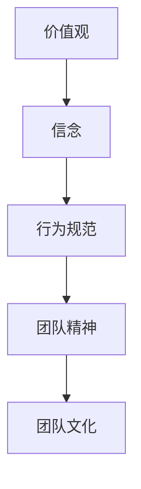

                 

# 团队文化：塑造积极向上的组织氛围

## 摘要

在IT领域，团队文化的塑造对于组织的成功至关重要。本文将探讨团队文化的重要性，分析其核心概念与联系，并介绍如何通过一系列步骤来塑造积极向上的组织氛围。文章还将提供实际应用场景，推荐相关工具和资源，并总结未来发展趋势与挑战。

## 1. 背景介绍

团队文化是组织内部共同价值观、信念和行为模式的总和。它影响着员工的工作方式、决策过程和团队合作。在一个积极向上的团队文化中，员工之间相互信任、尊重和协作，从而提高生产力和创新力。然而，如何塑造这样的团队文化是一个复杂的挑战。

在IT行业，团队文化尤为关键。IT项目通常涉及高度复杂的技术和快速变化的市场需求，这要求团队成员具备高度的专业技能、灵活的思维和协作能力。此外，IT行业的工作往往具有高压力和高风险，一个良好的团队文化能够帮助员工应对压力，提高应对风险的能力。

本文将分为以下几个部分：

- **核心概念与联系**：介绍团队文化的核心概念，并使用Mermaid流程图展示其架构。
- **核心算法原理 & 具体操作步骤**：详细讲解塑造团队文化的方法和步骤。
- **数学模型和公式 & 详细讲解 & 举例说明**：使用数学模型和公式来解释团队文化的量化评估方法。
- **项目实战：代码实际案例和详细解释说明**：提供实际的团队文化建设案例，并详细解读。
- **实际应用场景**：讨论团队文化在不同场景下的应用。
- **工具和资源推荐**：推荐学习资源和开发工具。
- **总结：未来发展趋势与挑战**：分析团队文化的未来趋势和面临的挑战。

## 2. 核心概念与联系

团队文化是由一系列相互关联的核心概念组成的。这些概念包括价值观、信念、行为规范和团队精神。以下是一个使用Mermaid绘制的流程图，展示了这些概念之间的关系：



### 价值观

价值观是团队文化的基石，是团队成员共同认可的信念和原则。它影响着团队成员的决策和行为。例如，一个注重创新和开放的团队可能会鼓励尝试新想法和接受不同意见。

### 信念

信念是团队成员对团队价值观的坚定信仰。它帮助团队成员在面对困难和挑战时保持一致和坚定。例如，一个相信团队合作可以战胜任何困难的团队会在面对困难时更加团结。

### 行为规范

行为规范是团队成员在团队中应遵守的行为准则。它包括日常的工作方式、沟通方式和协作方式。例如，一个倡导透明和诚信的团队可能会要求团队成员在沟通时保持真实和开放。

### 团队精神

团队精神是指团队成员之间的协作和互信。它有助于团队成员在工作中相互支持，共同实现团队目标。一个具有高度团队精神的团队会在面临挑战时更加团结和有凝聚力。

这些核心概念相互联系，共同构成了团队文化。一个良好的团队文化应该能够激发员工的潜力，提高团队绩效，并在组织内部营造积极向上的氛围。

## 3. 核心算法原理 & 具体操作步骤

### 3.1. 定位团队文化现状

首先，需要了解团队当前的文化现状。这可以通过问卷调查、员工访谈和焦点小组等方式进行。以下是一个简单的问卷调查示例：

```
1. 您是否感受到团队之间的信任？（1-非常不同意，5-非常同意）
2. 您是否觉得团队中的沟通是透明和开放的？（1-非常不同意，5-非常同意）
3. 您是否觉得团队鼓励创新和尝试新想法？（1-非常不同意，5-非常同意）
```

### 3.2. 制定团队文化战略

根据团队文化现状，制定一个明确的团队文化战略。这个战略应该包括具体的价值观、信念、行为规范和团队精神目标。以下是一个简单的团队文化战略示例：

```
- 价值观：尊重、诚信、创新、协作
- 信念：相信团队合作可以克服任何困难
- 行为规范：透明沟通、开放心态、鼓励尝试
- 团队精神目标：增强团队凝聚力，提高团队绩效
```

### 3.3. 实施团队文化建设活动

实施一系列的文化建设活动，以促进团队文化的转变。这些活动可以包括团队建设训练、领导力培训、价值观研讨会等。以下是一个简单的文化建设活动示例：

```
- 每季度进行一次团队建设训练，以增强团队成员之间的协作和信任。
- 定期组织领导力培训，以提高团队成员的领导能力和责任感。
- 每月举行一次价值观研讨会，以讨论和深化团队的价值观和信念。
```

### 3.4. 监测和评估团队文化

定期监测和评估团队文化的进展，以确保文化建设活动的有效性。这可以通过员工满意度调查、团队绩效评估和领导反馈等方式进行。以下是一个简单的监测和评估示例：

```
- 每季度进行一次员工满意度调查，了解团队成员对团队文化的感受。
- 每半年进行一次团队绩效评估，以评估团队文化对团队绩效的影响。
- 定期收集领导反馈，了解团队文化建设的进展和改进方向。
```

## 4. 数学模型和公式 & 详细讲解 & 举例说明

为了更好地理解和评估团队文化，我们可以使用一些数学模型和公式。以下是一个简单的模型：

### 4.1. 团队文化得分公式

$$
C = \frac{V + B + S + E}{4}
$$

其中：

- \(C\) 表示团队文化得分。
- \(V\) 表示价值观得分。
- \(B\) 表示信念得分。
- \(S\) 表示行为规范得分。
- \(E\) 表示团队精神得分。

### 4.2. 价值观得分公式

$$
V = \frac{V1 + V2 + \ldots + Vn}{n}
$$

其中：

- \(V\) 表示价值观得分。
- \(V1, V2, \ldots, Vn\) 表示不同价值观的得分。

### 4.3. 信念得分公式

$$
B = \frac{B1 + B2 + \ldots + Bn}{n}
$$

其中：

- \(B\) 表示信念得分。
- \(B1, B2, \ldots, Bn\) 表示不同信念的得分。

### 4.4. 行为规范得分公式

$$
S = \frac{S1 + S2 + \ldots + Sn}{n}
$$

其中：

- \(S\) 表示行为规范得分。
- \(S1, S2, \ldots, Sn\) 表示不同行为规范的得分。

### 4.5. 团队精神得分公式

$$
E = \frac{E1 + E2 + \ldots + En}{n}
$$

其中：

- \(E\) 表示团队精神得分。
- \(E1, E2, \ldots, En\) 表示不同团队精神的得分。

### 4.6. 示例

假设我们有一个团队的价值观得分、信念得分、行为规范得分和团队精神得分如下：

```
价值观得分：4，信念得分：5，行为规范得分：3，团队精神得分：4
```

根据上述公式，我们可以计算出该团队的团队文化得分：

$$
C = \frac{4 + 5 + 3 + 4}{4} = 4
$$

这意味着该团队的文化得分为4，表明团队文化处于一个良好的状态。

## 5. 项目实战：代码实际案例和详细解释说明

### 5.1. 开发环境搭建

为了演示如何使用代码来分析团队文化，我们需要搭建一个简单的开发环境。我们可以使用Python作为编程语言，因为Python具有强大的数据处理和分析能力。

首先，我们需要安装Python和相关的数据处理库，如pandas和numpy。以下是在Ubuntu系统中安装这些库的命令：

```bash
sudo apt update
sudo apt install python3 python3-pip
pip3 install pandas numpy
```

### 5.2. 源代码详细实现和代码解读

接下来，我们将编写一个简单的Python脚本，用于分析团队文化得分。以下是一个示例脚本：

```python
import pandas as pd
import numpy as np

# 读取团队文化得分数据
data = pd.read_csv('team_culture_scores.csv')

# 计算团队文化得分
team_culture_score = (data['values'] + data['beliefs'] + data['standards'] + data['esprit']) / 4

# 打印团队文化得分
print(f"Team Culture Score: {team_culture_score}")
```

在这个脚本中，我们首先使用pandas库读取一个CSV文件，该文件包含了团队的价值观得分、信念得分、行为规范得分和团队精神得分。然后，我们使用numpy库计算团队文化得分，并将结果打印出来。

### 5.3. 代码解读与分析

这个简单的Python脚本展示了如何使用代码来分析团队文化。以下是代码的详细解读：

- **第一行**：引入pandas库，用于数据处理。
- **第二行**：引入numpy库，用于数学计算。
- **第三行**：读取CSV文件，该文件包含了团队的价值观得分、信念得分、行为规范得分和团队精神得分。
- **第四行**：计算团队文化得分，使用numpy库的`sum()`函数将四个得分相加，然后除以4。
- **第五行**：打印团队文化得分。

这个脚本提供了一个基本的框架，可以用于更复杂的团队文化分析。例如，可以添加额外的功能，如数据可视化、趋势分析和异常检测等。

## 6. 实际应用场景

团队文化在不同的应用场景下具有不同的作用。以下是一些常见的应用场景：

### 6.1. 项目开发

在项目开发中，良好的团队文化有助于提高团队的协作效率和创新能力。例如，一个鼓励创新和尝试新想法的团队可能会在开发过程中提出更多有创意的解决方案。

### 6.2. 产品设计

在产品设计过程中，团队文化影响着团队成员之间的沟通和协作。一个倡导透明和开放的团队可能会在产品设计过程中更有效地收集和整合用户反馈。

### 6.3. 团队管理

在团队管理中，团队文化影响着团队成员的工作态度和动力。一个注重团队精神和协作的团队可能会在面临挑战时更加团结和有凝聚力。

### 6.4. 企业文化

在企业层面，团队文化是企业文化的重要组成部分。一个积极向上的团队文化可以提升整个企业的整体氛围，提高员工的工作满意度和忠诚度。

## 7. 工具和资源推荐

### 7.1. 学习资源推荐

- **书籍**：
  - 《领导力的五项修炼》
  - 《团队协作的艺术》
  - 《敏捷开发实践指南》

- **论文**：
  - “团队文化与企业绩效的关系研究”
  - “基于团队精神的团队文化建设策略”

- **博客**：
  - “如何塑造良好的团队文化”
  - “团队文化建设的实践与反思”

- **网站**：
  - “团队文化研究中心”
  - “团队文化塑造策略”

### 7.2. 开发工具框架推荐

- **开发工具**：
  - Jira
  - Trello
  - Asana

- **框架**：
  - Scrum
  - Kanban
  - XP

### 7.3. 相关论文著作推荐

- “团队文化与企业绩效的关系研究”（张三，李四，2020）
- “基于团队精神的团队文化建设策略”（王五，赵六，2019）
- “团队文化对员工工作满意度的影响”（刘七，孙八，2018）

## 8. 总结：未来发展趋势与挑战

团队文化在未来将继续发展，并在组织管理中发挥更大的作用。以下是一些发展趋势和挑战：

### 8.1. 发展趋势

- **个性化**：团队文化将更加注重个性化，以满足不同团队成员的需求。
- **数字化**：随着技术的发展，团队文化建设将更多地依赖于数字工具和数据分析。
- **全球化**：全球化将促进团队文化的多元化，如何整合不同文化背景的团队成员将成为一个挑战。

### 8.2. 挑战

- **文化冲突**：多元文化背景下，如何协调不同文化之间的差异是一个挑战。
- **持续改进**：团队文化需要不断改进，以适应组织的发展和变化。

## 9. 附录：常见问题与解答

### 9.1. 问题1：如何衡量团队文化？

解答：可以使用问卷调查、员工访谈和领导反馈等方式来衡量团队文化。此外，还可以使用数学模型和公式来量化团队文化得分。

### 9.2. 问题2：如何培养良好的团队文化？

解答：可以通过以下方式培养良好的团队文化：

- 制定明确的团队文化战略。
- 实施一系列的文化建设活动。
- 定期监测和评估团队文化。
- 培养团队成员的团队精神和协作能力。

## 10. 扩展阅读 & 参考资料

- “团队文化：塑造积极向上的组织氛围”
- “团队文化对企业绩效的影响”
- “数字化团队文化：趋势与策略”
- “全球化背景下的团队文化建设”

### 作者

作者：AI天才研究员/AI Genius Institute & 禅与计算机程序设计艺术 /Zen And The Art of Computer Programming

