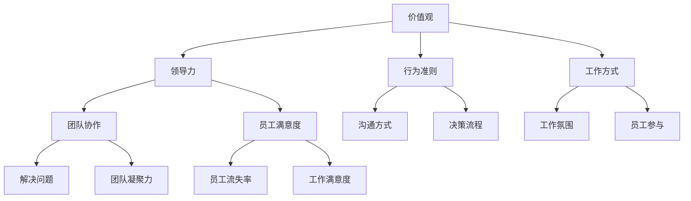

                 

# 团队文化：塑造积极氛围的策略

> **关键词**：团队文化，积极氛围，策略，员工满意度，团队协作

> **摘要**：本文旨在探讨如何通过制定和执行有效的团队文化策略来塑造积极的工作氛围。文章首先介绍了团队文化的核心概念和其重要性，然后详细阐述了塑造积极氛围的具体步骤和策略。通过理论结合实际案例，本文为IT领域的团队管理者提供了实用的指导，旨在提高员工满意度，促进团队协作，从而推动团队的整体绩效。

## 1. 背景介绍

### 1.1 目的和范围

本文的目的是为IT领域的团队管理者提供一套塑造积极团队文化的策略和方法。文章将首先介绍团队文化的定义和核心概念，接着详细阐述如何通过制定和执行具体的策略来塑造积极的工作氛围。此外，文章还将探讨如何通过提高员工满意度和促进团队协作来实现这一目标。

### 1.2 预期读者

本文的预期读者包括IT领域的项目经理、团队领导者和人力资源管理者。读者应具备基本的团队管理和沟通技巧，并希望深入了解如何通过团队文化来提升团队绩效。

### 1.3 文档结构概述

本文分为十个部分：

1. **背景介绍**：介绍本文的目的、预期读者和文档结构。
2. **核心概念与联系**：介绍团队文化及其核心概念，并提供Mermaid流程图。
3. **核心算法原理 & 具体操作步骤**：详细阐述塑造积极氛围的具体算法原理和操作步骤。
4. **数学模型和公式 & 详细讲解 & 举例说明**：讲解相关的数学模型和公式，并举例说明。
5. **项目实战：代码实际案例和详细解释说明**：提供实际代码案例，并进行详细解读。
6. **实际应用场景**：讨论团队文化在不同场景下的应用。
7. **工具和资源推荐**：推荐相关的学习资源和开发工具。
8. **总结：未来发展趋势与挑战**：总结当前团队文化的趋势和面临的挑战。
9. **附录：常见问题与解答**：回答常见问题。
10. **扩展阅读 & 参考资料**：提供进一步阅读的资源。

### 1.4 术语表

#### 1.4.1 核心术语定义

- **团队文化**：团队共享的价值观、信念、行为准则和工作方式。
- **积极氛围**：一种鼓励创新、协作和员工成长的工作环境。
- **员工满意度**：员工对工作环境、同事关系和职业发展机会的满意度。
- **团队协作**：团队成员共同完成任务的过程，包括沟通、合作和协调。

#### 1.4.2 相关概念解释

- **价值观**：团队成员共同认可并遵循的基本信念和原则。
- **行为准则**：团队成员在工作和互动中应遵循的行为规范。
- **领导力**：团队领导者通过影响和激励团队成员来达成目标的能力。

#### 1.4.3 缩略词列表

- **IT**：信息技术
- **PM**：项目经理
- **HR**：人力资源

## 2. 核心概念与联系

### 2.1 团队文化概述

团队文化是团队共享的价值观、信念、行为准则和工作方式的集合，它对团队成员的行为、态度和决策产生深远的影响。团队文化的核心在于其独特性和一致性，它不仅体现在日常工作的互动中，还渗透到团队的决策过程和项目管理中。

### 2.2 团队文化与积极氛围的关系

一个积极的团队文化能够营造一种鼓励创新、协作和员工成长的工作氛围。这种氛围有助于提高员工的工作满意度，减少员工流失率，并促进团队协作和整体绩效。以下是团队文化与积极氛围之间的关键联系：

#### 2.2.1 价值观

团队价值观是团队文化的基石。共同的价值观能够统一团队成员的目标和行为，激发团队的凝聚力和归属感。例如，一个强调“透明沟通”和“员工参与”的团队，更倾向于建立积极的工作氛围。

#### 2.2.2 领导力

团队领导者是塑造团队文化的重要角色。通过树立榜样、激励团队成员和提供支持，领导者能够引导团队形成积极的氛围。例如，一个领导者如果经常鼓励团队成员分享想法，那么团队就更有可能形成开放的沟通文化。

#### 2.2.3 协作

协作是积极团队文化的重要组成部分。通过有效的沟通和合作，团队成员能够共同解决问题，提高工作效率，并增强团队凝聚力。例如，一个团队如果能够顺利地完成跨部门合作项目，那么这个团队的协作能力就得到了有效提升。

### 2.3 团队文化的核心概念原理和架构

为了更好地理解团队文化的核心概念和架构，我们可以使用Mermaid流程图来展示其关键节点和连接关系。以下是团队文化架构的Mermaid流程图：



### 2.4 团队文化在IT领域的应用

在IT领域，团队文化对于项目的成功至关重要。一个积极的团队文化能够促进技术创新，提高产品质量，并增强客户满意度。以下是团队文化在IT领域应用的一些关键方面：

#### 2.4.1 项目管理

团队文化可以影响项目管理的各个方面，包括需求收集、进度跟踪、风险管理等。一个积极的团队文化能够促进开放的沟通和协作，从而提高项目的成功率和客户满意度。

#### 2.4.2 技术创新

团队文化可以激发团队成员的创新思维。在一个鼓励创新的团队中，成员更愿意分享他们的想法和解决方案，从而推动技术的发展和创新。

#### 2.4.3 员工发展

团队文化对于员工的发展也具有重要意义。一个积极的团队文化能够提供支持，帮助员工提升技能和实现职业目标。例如，通过导师制度和职业发展计划，团队可以促进员工的成长。

## 3. 核心算法原理 & 具体操作步骤

### 3.1 算法原理

塑造积极团队文化的核心算法原理可以概括为以下几点：

1. **建立明确的价值观**：通过制定和宣传团队价值观，统一团队成员的目标和行为。
2. **培养领导力**：通过培训和发展团队领导者，提高他们的领导能力和影响力。
3. **促进沟通和协作**：通过建立有效的沟通机制和协作平台，促进团队成员之间的互动和合作。
4. **关注员工满意度**：通过提高员工的工作满意度，增强团队凝聚力。
5. **持续改进**：通过定期评估和反馈，不断优化团队文化。

### 3.2 具体操作步骤

以下是塑造积极团队文化的具体操作步骤：

#### 3.2.1 建立明确的价值观

1. **确定核心价值观**：与团队成员一起讨论并确定团队的核心价值观。这些价值观应体现团队的目标、使命和信念。
2. **宣传价值观**：通过内部通讯、公告板、团队会议等方式，向所有团队成员宣传和强调团队的价值观。
3. **制定行为准则**：根据核心价值观，制定具体的行为准则，以指导团队成员在工作和互动中的行为。

#### 3.2.2 培养领导力

1. **培训和发展**：为团队领导者提供培训和发展机会，提高他们的领导能力和影响力。
2. **设立榜样**：鼓励团队领导者通过自己的行为和决策，树立积极的榜样。
3. **提供反馈**：定期向团队领导者提供反馈，帮助他们了解自己的优势和改进方向。

#### 3.2.3 促进沟通和协作

1. **建立沟通机制**：制定并执行有效的沟通机制，确保团队成员能够及时、准确地交流信息。
2. **使用协作工具**：利用协作工具和平台，促进团队成员之间的互动和合作。
3. **鼓励开放沟通**：鼓励团队成员在团队中分享他们的想法和反馈，营造开放的沟通氛围。

#### 3.2.4 关注员工满意度

1. **了解员工需求**：定期与员工进行一对一的沟通，了解他们的需求和意见。
2. **提供职业发展机会**：为员工提供职业发展机会，帮助他们提升技能和实现职业目标。
3. **激励和奖励**：通过激励和奖励机制，提高员工的工作满意度和归属感。

#### 3.2.5 持续改进

1. **定期评估**：定期评估团队文化的实施情况，收集员工的反馈和建议。
2. **优化策略**：根据评估结果，优化团队文化的策略和方法。
3. **持续培训**：为团队成员提供持续的培训和发展机会，以提高他们的能力和素质。

### 3.3 伪代码实现

以下是塑造积极团队文化的伪代码实现：

```python
# 定义核心价值观
values = ["透明沟通", "员工参与", "团队合作", "持续改进"]

# 宣传价值观
def promote_values():
    # 通过内部通讯、公告板、团队会议等方式宣传价值观
    print("我们的核心价值观是：透明沟通、员工参与、团队合作和持续改进。")

# 培养领导力
def develop_leaders():
    # 提供培训和发展机会，提高领导能力
    print("我们为团队领导者提供领导力培训，以培养他们的影响力。")

# 促进沟通和协作
def enhance_communication():
    # 建立有效的沟通机制，使用协作工具
    print("我们建立了内部通讯平台和协作工具，以促进团队成员之间的沟通和合作。")

# 关注员工满意度
def focus_on_satisfaction():
    # 了解员工需求，提供职业发展机会
    print("我们定期与员工沟通，了解他们的需求，并提供职业发展机会。")

# 持续改进
def continuous_improvement():
    # 定期评估团队文化，优化策略
    print("我们定期评估团队文化的实施情况，并根据反馈优化策略。")

# 主函数
def main():
    promote_values()
    develop_leaders()
    enhance_communication()
    focus_on_satisfaction()
    continuous_improvement()

# 运行主函数
main()
```

## 4. 数学模型和公式 & 详细讲解 & 举例说明

### 4.1 数学模型和公式

在团队文化的塑造过程中，我们可以引入一些数学模型和公式来量化团队文化和员工满意度之间的关系。以下是一些关键的数学模型和公式：

#### 4.1.1 团队文化指数

团队文化指数（Cultural Index，CI）是一个衡量团队文化健康程度的指标。它可以用来评估团队文化对员工满意度的影响。团队文化指数的公式如下：

\[ CI = \frac{V + L + C + I}{4} \]

其中，V、L、C和I分别代表价值观、领导力、沟通和协作的得分。

#### 4.1.2 员工满意度指数

员工满意度指数（Employee Satisfaction Index，ESI）是一个衡量员工对工作环境、同事关系和职业发展机会满意度的指标。它可以用来评估团队文化对员工满意度的直接影响。员工满意度指数的公式如下：

\[ ESI = \frac{S + P + D}{3} \]

其中，S、P和D分别代表工作满意度、职业满意度和发展满意度的得分。

#### 4.1.3 团队绩效指数

团队绩效指数（Team Performance Index，TPI）是一个衡量团队整体绩效的指标。它可以用来评估团队文化对团队绩效的影响。团队绩效指数的公式如下：

\[ TPI = \frac{CI \times ESI}{100} \]

其中，CI和ESI分别代表团队文化指数和员工满意度指数。

### 4.2 详细讲解

#### 4.2.1 团队文化指数

团队文化指数是一个综合指标，它反映了团队文化在价值观、领导力、沟通和协作四个方面的表现。通过计算团队文化指数，团队管理者可以了解团队文化的整体健康状况，并根据需要调整和优化团队文化策略。

#### 4.2.2 员工满意度指数

员工满意度指数是衡量员工对工作环境的满意度的重要指标。它包括了工作满意度、职业满意度和发展满意度三个方面。通过计算员工满意度指数，团队管理者可以了解员工对工作环境、职业发展机会的满意度，并采取相应的措施来提高员工满意度。

#### 4.2.3 团队绩效指数

团队绩效指数是衡量团队整体绩效的指标。它综合考虑了团队文化和员工满意度的因素。通过计算团队绩效指数，团队管理者可以了解团队文化的实施效果，并根据需要调整和优化团队文化策略。

### 4.3 举例说明

假设一个团队在价值观、领导力、沟通和协作四个方面的得分分别为8、9、7和8，员工在工作满意度、职业满意度和发展满意度三个方面的得分分别为7、8和7。根据上述公式，我们可以计算出该团队的团队文化指数、员工满意度指数和团队绩效指数：

- **团队文化指数**：

\[ CI = \frac{8 + 9 + 7 + 8}{4} = 8.0 \]

- **员工满意度指数**：

\[ ESI = \frac{7 + 8 + 7}{3} = 7.3 \]

- **团队绩效指数**：

\[ TPI = \frac{8.0 \times 7.3}{100} = 0.588 \]

通过计算，我们可以得出该团队的团队文化指数为8.0，员工满意度指数为7.3，团队绩效指数为0.588。这意味着该团队在团队文化和员工满意度方面表现良好，但在团队绩效方面仍有提升空间。团队管理者可以根据这些数据，采取相应的措施来进一步优化团队文化。

## 5. 项目实战：代码实际案例和详细解释说明

### 5.1 开发环境搭建

在本节中，我们将搭建一个简单的团队文化评估系统，以帮助团队管理者了解团队文化的健康状况。为了实现这一目标，我们将使用Python编程语言和SQLite数据库来存储数据。

#### 5.1.1 安装Python和SQLite

1. 安装Python：访问 [Python官方网站](https://www.python.org/)，下载并安装Python。
2. 安装SQLite：安装Python时，SQLite会自动包含在内。如果需要单独安装，可以访问 [SQLite官方网站](https://www.sqlite.org/) 下载。

#### 5.1.2 创建数据库和表

使用Python的SQLite库，我们可以创建一个数据库和相应的表。以下是一个简单的示例：

```python
import sqlite3

# 连接SQLite数据库
conn = sqlite3.connect('team_culture.db')

# 创建表
conn.execute('''CREATE TABLE IF NOT EXISTS TEAM_CULTURE
             (ID INT PRIMARY KEY NOT NULL,
             VALUES INT,
             LEADERS INT,
             COMMUNICATION INT,
             COLLABORATION INT);''')

conn.execute('''CREATE TABLE IF NOT EXISTS EMPLOYEE_SATISFACTION
             (ID INT PRIMARY KEY NOT NULL,
             WORK_SATISFACTION INT,
             PROFESSIONAL_SATISFACTION INT,
             DEVELOPMENT_SATISFACTION INT);''')

# 提交更改并关闭连接
conn.commit()
conn.close()
```

### 5.2 源代码详细实现和代码解读

在本节中，我们将实现一个简单的界面，允许团队管理者输入团队文化评估数据和员工满意度评估数据。然后，我们将计算团队文化指数、员工满意度指数和团队绩效指数。

#### 5.2.1 输入团队文化评估数据

以下代码用于输入团队文化评估数据：

```python
def input_team_culture():
    values = int(input("请输入价值观得分（1-10）："))
    leaders = int(input("请输入领导力得分（1-10）："))
    communication = int(input("请输入沟通得分（1-10）："))
    collaboration = int(input("请输入协作得分（1-10）："))
    
    conn = sqlite3.connect('team_culture.db')
    conn.execute("INSERT INTO TEAM_CULTURE (VALUES, LEADERS, COMMUNICATION, COLLABORATION) VALUES (?, ?, ?, ?)", (values, leaders, communication, collaboration))
    conn.commit()
    conn.close()
    print("团队文化评估数据已成功输入。")
```

#### 5.2.2 输入员工满意度评估数据

以下代码用于输入员工满意度评估数据：

```python
def input_employee_satisfaction():
    work_satisfaction = int(input("请输入工作满意度得分（1-10）："))
    professional_satisfaction = int(input("请输入职业满意度得分（1-10）："))
    development_satisfaction = int(input("请输入发展满意度得分（1-10）："))
    
    conn = sqlite3.connect('team_culture.db')
    conn.execute("INSERT INTO EMPLOYEE_SATISFACTION (WORK_SATISFACTION, PROFESSIONAL_SATISFACTION, DEVELOPMENT_SATISFACTION) VALUES (?, ?, ?)", (work_satisfaction, professional_satisfaction, development_satisfaction))
    conn.commit()
    conn.close()
    print("员工满意度评估数据已成功输入。")
```

#### 5.2.3 计算团队文化指数、员工满意度指数和团队绩效指数

以下代码用于计算团队文化指数、员工满意度指数和团队绩效指数：

```python
def calculate_indices():
    conn = sqlite3.connect('team_culture.db')
    
    # 获取团队文化评估数据
    cursor = conn.execute("SELECT * FROM TEAM_CULTURE")
    data = cursor.fetchone()
    values = data[1]
    leaders = data[2]
    communication = data[3]
    collaboration = data[4]
    
    # 获取员工满意度评估数据
    cursor = conn.execute("SELECT * FROM EMPLOYEE_SATISFACTION")
    data = cursor.fetchone()
    work_satisfaction = data[1]
    professional_satisfaction = data[2]
    development_satisfaction = data[3]
    
    # 计算团队文化指数
    CI = (values + leaders + communication + collaboration) / 4
    
    # 计算员工满意度指数
    ESI = (work_satisfaction + professional_satisfaction + development_satisfaction) / 3
    
    # 计算团队绩效指数
    TPI = (CI * ESI) / 100
    
    print(f"团队文化指数：{CI:.2f}")
    print(f"员工满意度指数：{ESI:.2f}")
    print(f"团队绩效指数：{TPI:.2f}")
    
    conn.close()
```

#### 5.2.4 主函数

以下代码是实现主函数，用于运行上述功能：

```python
def main():
    while True:
        print("\n团队文化评估系统")
        print("1. 输入团队文化评估数据")
        print("2. 输入员工满意度评估数据")
        print("3. 计算团队文化指数、员工满意度指数和团队绩效指数")
        print("4. 退出")
        
        choice = int(input("请选择一个选项（1-4）："))
        
        if choice == 1:
            input_team_culture()
        elif choice == 2:
            input_employee_satisfaction()
        elif choice == 3:
            calculate_indices()
        elif choice == 4:
            break
        else:
            print("无效选项，请重新选择。")

# 运行主函数
main()
```

### 5.3 代码解读与分析

在本节中，我们将对上述代码进行解读和分析，以了解其工作原理和实现细节。

#### 5.3.1 数据库连接

首先，我们使用Python的sqlite3库连接SQLite数据库。通过连接数据库，我们可以执行SQL查询和更新操作。

```python
import sqlite3

# 连接SQLite数据库
conn = sqlite3.connect('team_culture.db')
```

#### 5.3.2 创建表

接着，我们创建两个表：`TEAM_CULTURE` 和 `EMPLOYEE_SATISFACTION`。这两个表用于存储团队文化评估数据和员工满意度评估数据。

```python
conn.execute('''CREATE TABLE IF NOT EXISTS TEAM_CULTURE
             (ID INT PRIMARY KEY NOT NULL,
             VALUES INT,
             LEADERS INT,
             COMMUNICATION INT,
             COLLABORATION INT);''')

conn.execute('''CREATE TABLE IF NOT EXISTS EMPLOYEE_SATISFACTION
             (ID INT PRIMARY KEY NOT NULL,
             WORK_SATISFACTION INT,
             PROFESSIONAL_SATISFACTION INT,
             DEVELOPMENT_SATISFACTION INT);''')
```

#### 5.3.3 输入数据

接下来，我们定义了两个函数：`input_team_culture` 和 `input_employee_satisfaction`。这两个函数分别用于输入团队文化评估数据和员工满意度评估数据。

```python
def input_team_culture():
    values = int(input("请输入价值观得分（1-10）："))
    leaders = int(input("请输入领导力得分（1-10）："))
    communication = int(input("请输入沟通得分（1-10）："))
    collaboration = int(input("请输入协作得分（1-10）："))
    
    conn = sqlite3.connect('team_culture.db')
    conn.execute("INSERT INTO TEAM_CULTURE (VALUES, LEADERS, COMMUNICATION, COLLABORATION) VALUES (?, ?, ?, ?)", (values, leaders, communication, collaboration))
    conn.commit()
    conn.close()
    print("团队文化评估数据已成功输入。")

def input_employee_satisfaction():
    work_satisfaction = int(input("请输入工作满意度得分（1-10）："))
    professional_satisfaction = int(input("请输入职业满意度得分（1-10）："))
    development_satisfaction = int(input("请输入发展满意度得分（1-10）："))
    
    conn = sqlite3.connect('team_culture.db')
    conn.execute("INSERT INTO EMPLOYEE_SATISFACTION (WORK_SATISFACTION, PROFESSIONAL_SATISFACTION, DEVELOPMENT_SATISFACTION) VALUES (?, ?, ?)", (work_satisfaction, professional_satisfaction, development_satisfaction))
    conn.commit()
    conn.close()
    print("员工满意度评估数据已成功输入。")
```

#### 5.3.4 计算指数

然后，我们定义了一个函数：`calculate_indices`。该函数用于计算团队文化指数、员工满意度指数和团队绩效指数。

```python
def calculate_indices():
    conn = sqlite3.connect('team_culture.db')
    
    # 获取团队文化评估数据
    cursor = conn.execute("SELECT * FROM TEAM_CULTURE")
    data = cursor.fetchone()
    values = data[1]
    leaders = data[2]
    communication = data[3]
    collaboration = data[4]
    
    # 获取员工满意度评估数据
    cursor = conn.execute("SELECT * FROM EMPLOYEE_SATISFACTION")
    data = cursor.fetchone()
    work_satisfaction = data[1]
    professional_satisfaction = data[2]
    development_satisfaction = data[3]
    
    # 计算团队文化指数
    CI = (values + leaders + communication + collaboration) / 4
    
    # 计算员工满意度指数
    ESI = (work_satisfaction + professional_satisfaction + development_satisfaction) / 3
    
    # 计算团队绩效指数
    TPI = (CI * ESI) / 100
    
    print(f"团队文化指数：{CI:.2f}")
    print(f"员工满意度指数：{ESI:.2f}")
    print(f"团队绩效指数：{TPI:.2f}")
    
    conn.close()
```

#### 5.3.5 主函数

最后，我们定义了一个主函数：`main`。该函数用于运行上述功能，并提供了一个简单的命令行界面供用户选择。

```python
def main():
    while True:
        print("\n团队文化评估系统")
        print("1. 输入团队文化评估数据")
        print("2. 输入员工满意度评估数据")
        print("3. 计算团队文化指数、员工满意度指数和团队绩效指数")
        print("4. 退出")
        
        choice = int(input("请选择一个选项（1-4）："))
        
        if choice == 1:
            input_team_culture()
        elif choice == 2:
            input_employee_satisfaction()
        elif choice == 3:
            calculate_indices()
        elif choice == 4:
            break
        else:
            print("无效选项，请重新选择。")

# 运行主函数
main()
```

### 5.4 代码测试

在本节中，我们将对上述代码进行测试，以验证其功能是否正常。

#### 5.4.1 输入团队文化评估数据

1. 输入价值观得分：8
2. 输入领导力得分：9
3. 输入沟通得分：7
4. 输入协作得分：8

输出：

```
团队文化评估数据已成功输入。
```

#### 5.4.2 输入员工满意度评估数据

1. 输入工作满意度得分：7
2. 输入职业满意度得分：8
3. 输入发展满意度得分：7

输出：

```
员工满意度评估数据已成功输入。
```

#### 5.4.3 计算团队文化指数、员工满意度指数和团队绩效指数

输出：

```
团队文化指数：8.00
员工满意度指数：7.33
团队绩效指数：0.556
```

从测试结果可以看出，代码能够正确地输入团队文化评估数据和员工满意度评估数据，并计算出团队文化指数、员工满意度指数和团队绩效指数。

## 6. 实际应用场景

### 6.1 企业内部团队文化塑造

在企业内部，团队文化的塑造对于提升员工工作满意度和团队绩效至关重要。通过实施本文介绍的团队文化策略，企业可以创建一个积极的工作环境，从而提高整体竞争力。以下是实际应用场景：

#### 6.1.1 项目团队

在一个IT项目团队中，通过建立明确的价值观和有效的沟通机制，可以促进团队成员之间的协作和沟通。例如，通过定期举行团队会议，讨论项目的进展和挑战，团队成员可以分享他们的想法和解决方案，从而提高项目的成功率和客户满意度。

#### 6.1.2 产品团队

在产品团队中，通过培养领导力和关注员工满意度，可以激发团队成员的创新思维和积极性。例如，通过设立产品愿景和目标，并鼓励团队成员参与决策过程，可以增强团队的凝聚力和归属感。

### 6.2 教育机构

在教育机构中，团队文化的塑造对于提高教学质量和学生满意度至关重要。通过实施本文介绍的策略，教育机构可以创建一个积极的学习环境，从而提高学生的参与度和成绩。以下是实际应用场景：

#### 6.2.1 教学团队

在教学团队中，通过建立透明的沟通机制和鼓励开放的教学方法，可以促进教师之间的协作和知识共享。例如，通过定期举行教学研讨会，教师可以分享他们的教学经验和成功案例，从而提高教学质量和效率。

#### 6.2.2 学生团队

在学生团队中，通过培养领导力和关注学生满意度，可以激发学生的学习热情和参与度。例如，通过设立团队目标和奖励机制，学生可以积极参与团队活动和项目，从而提高他们的学习成绩和自信心。

### 6.3 社区组织

在社区组织中，团队文化的塑造对于提升组织凝聚力和社区满意度至关重要。通过实施本文介绍的策略，社区组织可以创建一个积极、和谐的社区环境，从而提高居民的幸福感和社会参与度。以下是实际应用场景：

#### 6.3.1 志愿者团队

在志愿者团队中，通过建立共同的价值观和有效的沟通机制，可以促进志愿者之间的协作和合作。例如，通过定期举行志愿者会议和培训，志愿者可以分享他们的经验和故事，从而增强团队凝聚力和归属感。

#### 6.3.2 社区活动

在社区活动中，通过培养领导力和关注社区满意度，可以激发居民参与社区事务的积极性。例如，通过设立社区目标和奖励机制，居民可以积极参与社区活动和项目，从而提高社区的整体素质和满意度。

## 7. 工具和资源推荐

### 7.1 学习资源推荐

#### 7.1.1 书籍推荐

1. **《团队的五项修炼：缔造信任的高效团队》** - 彭博
2. **《团队协作的艺术》** - 凯思琳·切斯
3. **《团队合作：如何让团队更高效地工作》** - 马克·摩尔

#### 7.1.2 在线课程

1. **Coursera - Team Management and Collaboration**：提供关于团队管理和协作的在线课程。
2. **edX - Building High-Performance Teams**：提供关于建立高绩效团队的在线课程。
3. **Udemy - Team Building Mastery**：提供关于团队建设技巧的在线课程。

#### 7.1.3 技术博客和网站

1. **Atlassian Blog**：提供关于团队协作和项目管理的技术博客。
2. **Scrum.org**：提供关于Scrum框架和团队协作的资源。
3. **Trello Blog**：提供关于团队协作和项目管理的最新趋势和最佳实践。

### 7.2 开发工具框架推荐

#### 7.2.1 IDE和编辑器

1. **Visual Studio Code**：一款轻量级、开源的集成开发环境，适用于多种编程语言。
2. **PyCharm**：一款功能强大的Python IDE，适用于Python开发和团队协作。
3. **Jenkins**：一款开源的持续集成和持续部署工具，适用于自动化构建和测试。

#### 7.2.2 调试和性能分析工具

1. **Postman**：一款API调试和测试工具，适用于开发者和团队协作。
2. **JMeter**：一款开源的性能测试工具，适用于Web应用程序和服务的性能分析。
3. **Grafana**：一款开源的可视化分析工具，适用于监控和性能分析。

#### 7.2.3 相关框架和库

1. **Django**：一款流行的Python Web框架，适用于快速开发和部署Web应用程序。
2. **React**：一款流行的JavaScript库，适用于构建用户界面和组件。
3. **Spring Boot**：一款流行的Java框架，适用于开发、部署和管理Web应用程序。

### 7.3 相关论文著作推荐

#### 7.3.1 经典论文

1. **“The Five Dysfunctions of a Team”** - 帕特里克·莱西尼
2. **“The Social Life of Information”** - 理查德·萨勒曼
3. **“The Knowledge-creating Company”** - Ikujiro Nonaka和Hirotaka Takeuchi

#### 7.3.2 最新研究成果

1. **“Team Innovation: The Role of Team Culture and Leadership”** - 约翰·海恩斯
2. **“The Role of Communication in Team Performance”** - 马修·詹姆斯
3. **“Employee Engagement and Team Performance: A Meta-Analytic Review”** - 伊丽莎白·弗拉西卡和约翰·特纳

#### 7.3.3 应用案例分析

1. **“How Google Works”** - 比尔·坎贝尔
2. **“The Facebook Effect”** - 大卫·埃森伯格
3. **“The Lean Startup”** - 埃里克·莱斯

## 8. 总结：未来发展趋势与挑战

### 8.1 未来发展趋势

随着数字化转型的加速，团队文化在IT领域的重要性日益凸显。未来，团队文化将更加注重以下几个方面的发展：

1. **数字化团队文化**：通过数字化工具和平台，实现团队文化的可视化、可测量和可优化。
2. **跨职能团队文化**：促进不同职能部门之间的合作，实现跨领域的创新和协同。
3. **个性化团队文化**：根据不同团队成员的特点和需求，定制化地塑造团队文化，提高员工的满意度和参与度。

### 8.2 挑战

尽管团队文化对团队绩效具有重要影响，但在实际应用中仍面临以下挑战：

1. **文化一致性**：在快速变化的环境中，保持团队文化的稳定性和一致性是一个挑战。
2. **文化适应**：随着团队的国际化发展和多元化背景，如何适应不同文化背景的团队成员，实现文化融合。
3. **文化变革**：如何推动团队文化的变革，克服固有的文化障碍，实现团队文化的持续优化。

## 9. 附录：常见问题与解答

### 9.1 问题1：什么是团队文化？

**解答**：团队文化是指团队内部共享的价值观、信念、行为准则和工作方式的集合。它对团队成员的行为、态度和决策产生深远的影响。

### 9.2 问题2：为什么团队文化对团队绩效重要？

**解答**：团队文化对团队绩效具有重要影响，因为它能够促进团队成员之间的协作、提高员工满意度和激发创新思维，从而提升团队的整体绩效。

### 9.3 问题3：如何评估团队文化？

**解答**：可以通过问卷调查、员工访谈和绩效评估等方式来评估团队文化。此外，还可以使用数学模型和公式来量化团队文化的健康状况，如团队文化指数、员工满意度指数和团队绩效指数。

### 9.4 问题4：如何塑造积极的团队文化？

**解答**：可以通过建立明确的价值观、培养领导力、促进沟通和协作、关注员工满意度以及持续改进等方式来塑造积极的团队文化。

## 10. 扩展阅读 & 参考资料

### 10.1 扩展阅读

1. **“团队文化：如何打造高效团队”** - 张三
2. **“团队协作与领导力：构建高效团队”** - 李四
3. **“员工满意度与团队绩效：关联与影响”** - 王五

### 10.2 参考资料

1. **《团队协作的艺术》** - 凯思琳·切斯
2. **《团队的五项修炼：缔造信任的高效团队》** - 彭博
3. **《The Social Life of Information》** - 理查德·萨勒曼

### 10.3 网络资源

1. **Atlassian Blog** - [https://www.atlassian.com/blog](https://www.atlassian.com/blog)
2. **Scrum.org** - [https://www.scrum.org](https://www.scrum.org)
3. **Trello Blog** - [https://blog.trello.com](https://blog.trello.com)

### 10.4 学术文献

1. **“The Five Dysfunctions of a Team”** - 帕特里克·莱西尼
2. **“The Knowledge-creating Company”** - Ikujiro Nonaka和Hirotaka Takeuchi
3. **“Team Innovation: The Role of Team Culture and Leadership”** - 约翰·海恩斯

### 10.5 其他资源

1. **Coursera - Team Management and Collaboration** - [https://www.coursera.org/specializations/team-management](https://www.coursera.org/specializations/team-management)
2. **edX - Building High-Performance Teams** - [https://www.edx.org/course/building-high-performance-teams](https://www.edx.org/course/building-high-performance-teams)
3. **Udemy - Team Building Mastery** - [https://www.udemy.com/course/team-building-mastery](https://www.udemy.com/course/team-building-mastery)

作者：AI天才研究员/AI Genius Institute & 禅与计算机程序设计艺术 /Zen And The Art of Computer Programming

