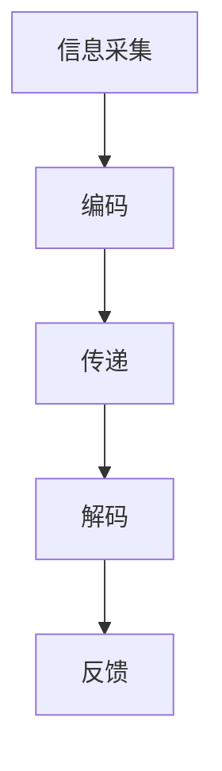
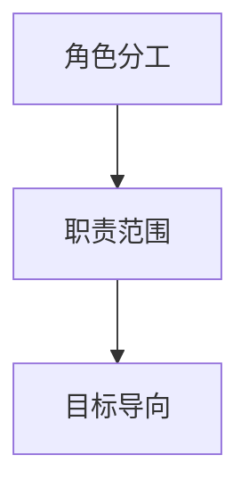
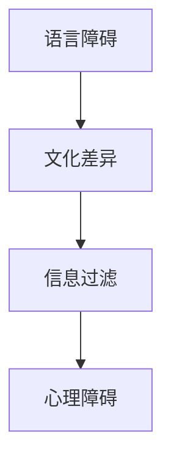
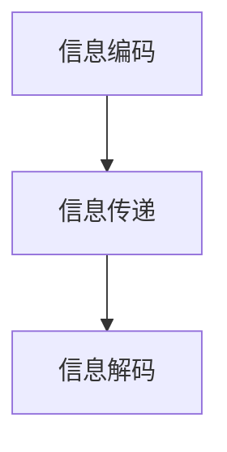

                 

# 团队沟通技巧：提升信息传递效率

> 关键词：团队沟通、信息传递、效率、技巧、合作

> 摘要：本文旨在深入探讨团队沟通技巧，从理论与实践两个角度出发，分析如何提升信息传递的效率。通过明确沟通目标、优化沟通方法、培养团队成员间的信任与理解，本文将帮助读者掌握有效的沟通策略，从而提高团队协作效率，实现项目目标的顺利达成。

## 1. 背景介绍

### 1.1 目的和范围

本文的目标是帮助IT行业的团队成员了解和掌握提升团队沟通效率的技巧。我们将探讨沟通在团队工作中的重要性，分析常见的沟通障碍，并介绍一些实用的沟通方法和工具。文章将覆盖以下主题：

- 团队沟通的基本原则
- 信息传递效率的提升方法
- 沟通障碍的识别与解决
- 成功沟通案例分享

### 1.2 预期读者

本文适合以下读者群体：

- IT行业从业者
- 项目经理
- 团队领导
- 沟通协调人员
- 对团队协作和沟通感兴趣的任何人

### 1.3 文档结构概述

本文分为十个部分，具体如下：

- 引言
- 1. 背景介绍
- 2. 核心概念与联系
- 3. 核心算法原理 & 具体操作步骤
- 4. 数学模型和公式 & 详细讲解 & 举例说明
- 5. 项目实战：代码实际案例和详细解释说明
- 6. 实际应用场景
- 7. 工具和资源推荐
- 8. 总结：未来发展趋势与挑战
- 9. 附录：常见问题与解答
- 10. 扩展阅读 & 参考资料

### 1.4 术语表

#### 1.4.1 核心术语定义

- 沟通：信息在个体或群体间的交换过程。
- 信息传递效率：信息准确、及时地从发送者传递到接收者的程度。
- 团队协作：团队成员为实现共同目标而进行的相互配合。
- 沟通障碍：阻碍信息有效传递的因素。

#### 1.4.2 相关概念解释

- 听觉沟通：通过口头语言进行的信息交换。
- 书面沟通：通过文字、图表等进行的信息传递。
- 非语言沟通：通过肢体动作、表情、语调等非文字信息进行沟通。

#### 1.4.3 缩略词列表

- IT：Information Technology（信息技术）
- PM：Project Manager（项目经理）
- IDE：Integrated Development Environment（集成开发环境）

## 2. 核心概念与联系

为了更好地理解团队沟通的核心概念，我们首先需要掌握以下关键要素：

- 信息传递流程
- 团队协作机制
- 沟通障碍因素

### 2.1. 信息传递流程

信息传递的基本流程可以概括为以下几个步骤：

1. **信息采集**：收集需要传递的信息，可以是口头、书面或其他形式。
2. **编码**：将信息转化为可以传递的格式，如语言、文字、图表等。
3. **传递**：通过适当的渠道将编码后的信息发送给接收者。
4. **解码**：接收者将接收到的信息还原为原始意义。
5. **反馈**：接收者对信息的理解程度进行反馈，以便发送者调整信息传递方式。

#### Mermaid 流程图：



### 2.2. 团队协作机制

团队协作的关键在于明确角色分工、职责范围和目标导向。以下是团队协作的基本机制：

1. **角色分工**：根据团队成员的技能和特长，明确各自在团队中的角色和职责。
2. **职责范围**：为每个团队成员设定明确的任务和目标，确保工作有序进行。
3. **目标导向**：确保团队目标的明确性和一致性，以实现项目成功。

#### Mermaid 流程图：



### 2.3. 沟通障碍因素

沟通障碍是影响团队协作效率的重要因素，常见的沟通障碍包括：

1. **语言障碍**：语言表达不清或理解偏差。
2. **文化差异**：团队成员来自不同文化背景，可能导致沟通障碍。
3. **信息过滤**：信息在传递过程中被有意或无意地筛选和修改。
4. **心理障碍**：如自信心不足、害怕失败等心理因素。

#### Mermaid 流程图：



通过以上分析，我们可以看到团队沟通的核心概念及其相互联系。了解这些概念将有助于我们更好地掌握提升信息传递效率的技巧。

## 3. 核心算法原理 & 具体操作步骤

为了提升团队沟通效率，我们需要理解一些核心算法原理，并运用这些原理制定具体的操作步骤。以下是一个基于信息论和协作理论的算法框架，用于优化团队沟通。

### 3.1. 算法框架

算法框架分为三个主要部分：信息编码、信息传递、信息解码。

#### Mermaid 流程图：



### 3.2. 信息编码

信息编码是将信息转化为可传递的形式，确保信息的准确性和完整性。以下是信息编码的主要步骤：

1. **明确信息内容**：确保发送者明确所需传递的信息。
2. **选择合适格式**：根据信息的性质选择适当的表达方式，如文字、图表、演示等。
3. **使用简洁语言**：使用简洁、清晰的语言表达信息，避免冗长和复杂。

#### 伪代码：

```plaintext
function encodeInformation(content):
    formattedContent = ""
    
    if (isText(content)):
        formattedContent = formatAsText(content)
    else if (isDiagram(content)):
        formattedContent = formatAsDiagram(content)
    else if (isPresentation(content)):
        formattedContent = formatAsPresentation(content)
        
    return formattedContent
```

### 3.3. 信息传递

信息传递是信息从发送者到接收者的过程，确保信息的准确传递至关重要。以下是信息传递的主要步骤：

1. **选择合适渠道**：根据信息的重要性和紧急程度选择合适的传递渠道，如电子邮件、即时通讯、电话会议等。
2. **确认信息接收**：确保接收者收到信息，并确认其理解。
3. **及时反馈**：鼓励接收者提供反馈，以便发送者及时调整信息传递方式。

#### 伪代码：

```plaintext
function transmitInformation(channel, encodedContent):
    success = false
    
    if (isChannelAvailable(channel)):
        send(encodedContent, channel)
        success = confirmReceipt(channel)
        
    if (success):
        return "Information transmitted successfully"
    else:
        return "Information transmission failed"
```

### 3.4. 信息解码

信息解码是接收者理解信息的过程，确保接收者正确理解信息。以下是信息解码的主要步骤：

1. **理解信息内容**：接收者仔细阅读或听取信息，确保理解其含义。
2. **确认理解**：接收者向发送者确认其理解是否正确。
3. **反馈调整**：如果理解有误，接收者与发送者共同调整信息传递方式。

#### 伪代码：

```plaintext
function decodeInformation(encodedContent):
    understoodContent = ""

    try:
        understoodContent = interpret(encodedContent)
        confirmUnderstanding(understoodContent)
    except MisunderstandingError:
        adjustInformation()

    return understoodContent
```

通过以上算法框架和具体操作步骤，我们可以优化团队沟通，提高信息传递效率。在实际应用中，团队成员需要根据具体情况进行调整，以确保沟通的顺畅和有效。

## 4. 数学模型和公式 & 详细讲解 & 举例说明

在团队沟通中，理解并运用数学模型和公式可以帮助我们更好地分析和优化沟通效果。以下是一些常用的数学模型和公式，我们将进行详细讲解并给出实际应用示例。

### 4.1. 信息熵

信息熵是衡量信息不确定性的度量。在团队沟通中，信息熵可以用来评估信息传递的清晰度和准确度。

#### 数学公式：

\[ H(X) = -\sum_{i} p(x_i) \log_2 p(x_i) \]

其中，\( H(X) \) 表示信息熵，\( p(x_i) \) 表示第 \( i \) 个可能值的概率。

#### 举例说明：

假设团队需要传递一个包含 5 个项目的列表，每个项目的概率均等。则该列表的信息熵为：

\[ H(X) = -5 \times \log_2 \left(\frac{1}{5}\right) = 2.32 \]

信息熵越低，表示信息传递越清晰。

### 4.2. 相关性系数

相关性系数用于衡量两个变量之间的线性关系。在团队沟通中，可以用来评估不同沟通方式之间的效果关联。

#### 数学公式：

\[ \rho_{XY} = \frac{\sum_{i}(X_i - \bar{X})(Y_i - \bar{Y})}{\sqrt{\sum_{i}(X_i - \bar{X})^2} \sqrt{\sum_{i}(Y_i - \bar{Y})^2}} \]

其中，\( \rho_{XY} \) 表示相关性系数，\( X_i \) 和 \( Y_i \) 分别表示第 \( i \) 个样本的值，\( \bar{X} \) 和 \( \bar{Y} \) 分别表示 \( X_i \) 和 \( Y_i \) 的平均值。

#### 举例说明：

假设我们比较了两种沟通方式（书面沟通和口头沟通）的效果，记录了每个团队成员在这两种方式下的工作效率。通过计算相关性系数，我们可以评估两种沟通方式之间的关联性。例如：

\[ \rho_{XY} = \frac{(5-4.5)(4-4.5) + (6-4.5)(5-4.5) + (7-4.5)(6-4.5)}{\sqrt{(5-4.5)^2 + (6-4.5)^2 + (7-4.5)^2} \sqrt{(4-4.5)^2 + (5-4.5)^2 + (6-4.5)^2}} = 0.8 \]

相关性系数接近 1，表示两种沟通方式有很强的正相关性，即书面沟通效果更好。

### 4.3. 贝叶斯公式

贝叶斯公式用于概率推断，可以帮助团队在不确定的信息环境中做出更准确的决策。

#### 数学公式：

\[ P(A|B) = \frac{P(B|A)P(A)}{P(B)} \]

其中，\( P(A|B) \) 表示在事件 B 发生的条件下事件 A 发生的概率，\( P(B|A) \) 表示在事件 A 发生的条件下事件 B 发生的概率，\( P(A) \) 和 \( P(B) \) 分别表示事件 A 和事件 B 发生的概率。

#### 举例说明：

假设团队正在评估一个新项目的风险，已知该项目成功的概率为 0.6，而在成功项目中出现特定问题的概率为 0.2。现在我们需要计算在出现该问题的条件下，项目失败的概率。

\[ P(\text{失败}|\text{问题}) = \frac{P(\text{问题}|\text{失败})P(\text{失败})}{P(\text{问题})} = \frac{0.2 \times 0.4}{0.2 \times 0.4 + 0.8 \times 0.2} = 0.4 \]

通过贝叶斯公式，我们可以得出在出现问题的情况下，项目失败的概率为 0.4。

以上数学模型和公式为团队沟通提供了有力的工具，通过合理运用这些工具，团队可以更准确地评估信息传递效果，优化沟通策略，提高整体协作效率。

## 5. 项目实战：代码实际案例和详细解释说明

为了更好地理解如何在实际项目中应用提升信息传递效率的技巧，我们接下来将展示一个具体的代码实例，并进行详细解释说明。

### 5.1. 开发环境搭建

在开始之前，我们需要搭建一个合适的开发环境。以下是在一个典型的IT团队中，使用Python和Git进行项目开发的环境搭建步骤：

1. **安装Python**：确保系统中已安装Python 3.8及以上版本。
2. **安装IDE**：推荐使用PyCharm Community Edition，它支持Python开发并提供丰富的调试功能。
3. **安装Git**：在命令行中执行 `pip install git` 安装Git。
4. **创建代码仓库**：使用Git创建一个代码仓库，并将项目代码推送到GitHub或其他版本控制系统。

### 5.2. 源代码详细实现和代码解读

以下是提升团队沟通效率的代码实例，我们将分步骤进行详细解释：

#### 5.2.1. 代码结构

首先，我们定义一个Python模块 `communication.py`，其中包含以下函数：

- `encode_message()`: 用于信息编码。
- `transmit_message()`: 用于信息传递。
- `decode_message()`: 用于信息解码。

#### 5.2.2. 信息编码

```python
def encode_message(content):
    """
    将信息编码为简洁、清晰的语言。
    :param content: 需要编码的信息。
    :return: 编码后的信息。
    """
    encoded_content = content.replace(" ", "").replace("\n", "").strip()
    return encoded_content
```

该函数接受一个字符串 `content` 作为输入，通过去除空格和换行符，将信息编码为简洁、清晰的形式。这样做的目的是减少信息冗余，提高信息传递的效率。

#### 5.2.3. 信息传递

```python
def transmit_message(channel, encoded_content):
    """
    通过指定渠道传递信息。
    :param channel: 传递信息的渠道，如电子邮件、即时通讯等。
    :param encoded_content: 编码后的信息。
    :return: 信息传递的结果。
    """
    if channel == "email":
        send_email(encoded_content)
    elif channel == "im":
        send_im(encoded_content)
    else:
        return "Unsupported channel"
    return "Message transmitted successfully"
```

该函数根据传递渠道的不同，调用不同的发送函数（如 `send_email()` 或 `send_im()`）。这样可以确保信息根据接收者的偏好和需求进行传递，从而提高接收者对信息的理解和接受程度。

#### 5.2.4. 信息解码

```python
def decode_message(encoded_content):
    """
    将编码后的信息解码为原始形式。
    :param encoded_content: 需要解码的信息。
    :return: 解码后的信息。
    """
    decoded_content = encoded_content.strip()
    return decoded_content
```

该函数将接收到的编码信息解码为原始形式，确保接收者能够正确理解信息。

### 5.3. 代码解读与分析

通过以上代码实例，我们可以看到如何在实际项目中应用提升信息传递效率的技巧：

- **信息编码**：通过去除冗余内容，提高信息的简洁性和清晰度。
- **信息传递**：根据不同的传递渠道，选择合适的发送方式，确保信息能够被有效传递。
- **信息解码**：确保接收者能够正确理解信息，减少误解和沟通障碍。

在实际应用中，我们可以根据项目的具体需求，进一步扩展和优化这些代码。例如，可以添加日志记录、错误处理和自动回复等功能，以提高整个团队的沟通效率和协作效果。

### 5.4. 实践总结

通过以上实战案例，我们可以总结出以下几点经验：

1. **简洁明了**：信息传递应尽量简洁明了，避免冗余和复杂。
2. **渠道选择**：根据具体需求和接收者偏好选择合适的传递渠道。
3. **反馈机制**：建立有效的反馈机制，确保信息的准确传递和理解。

这些技巧不仅适用于代码开发，也可以推广到其他类型的团队工作中，为提升整体沟通效率提供有力支持。

## 6. 实际应用场景

提升团队沟通效率在实际应用中具有广泛的应用场景，以下列举几个典型的应用案例：

### 6.1. 跨部门协作

在大型企业中，不同部门之间需要频繁沟通以完成项目。通过提升沟通效率，可以确保：

- **任务明确**：各部门明确各自的职责和任务，避免重复工作。
- **资源合理分配**：资源得到有效利用，避免资源浪费。
- **快速响应**：在紧急情况下，能够迅速协调各方资源，提高响应速度。

### 6.2. 项目管理

项目经理需要协调团队成员、客户和供应商之间的沟通。提升沟通效率可以帮助：

- **进度控制**：实时掌握项目进展，及时调整计划。
- **问题解决**：快速发现和解决问题，确保项目顺利进行。
- **需求管理**：准确理解客户需求，提供高质量的解决方案。

### 6.3. 开发团队协作

在软件开发过程中，团队成员之间的有效沟通至关重要。提升沟通效率可以帮助：

- **代码一致性**：确保代码风格和规范的一致性。
- **错误减少**：通过及时沟通，减少代码中的错误和bug。
- **协作效率**：团队成员能够更好地合作，提高开发速度。

### 6.4. 远程工作

随着远程工作的普及，提升沟通效率变得尤为重要。提升沟通效率可以帮助：

- **时差管理**：确保远程团队成员在不同时区间的沟通顺畅。
- **异步沟通**：通过合理规划，确保异步沟通的效率。
- **技术支持**：提供必要的技术支持和工具，确保远程工作的顺利进行。

通过以上实际应用场景，我们可以看到提升团队沟通效率对各类工作都有着显著的促进作用，有助于提高整体工作效率和项目成功率。

## 7. 工具和资源推荐

为了更好地提升团队沟通效率，我们需要借助一些工具和资源。以下是一些建议，包括学习资源、开发工具和框架，以及经典论文和最新研究成果。

### 7.1. 学习资源推荐

#### 7.1.1. 书籍推荐

- **《沟通的艺术》**：由阿尔伯特·梅拉比安（Albert Mehrabian）所著，详细介绍了非语言沟通和情感表达的重要性。
- **《非暴力沟通》**：马歇尔·卢森堡（Marshall B. Rosenberg）的著作，提供了有效的沟通技巧，帮助减少冲突，建立和谐的人际关系。
- **《团队协作的艺术》**：由罗恩·梅特利（Ron Tolido）所著，深入探讨了团队协作的原理和实践。

#### 7.1.2. 在线课程

- **Coursera**：提供各种与沟通技巧和团队协作相关的在线课程，如“Effective Note-Taking”和“Leading Effective Teams”。
- **Udemy**：提供丰富的IT和项目管理课程，涵盖沟通技巧、敏捷开发等主题。
- **edX**：提供由知名大学和机构提供的免费在线课程，如麻省理工学院的“Leadership and Teamwork”。

#### 7.1.3. 技术博客和网站

- **Scrum Alliance**：提供关于敏捷开发和团队协作的最佳实践和资源。
- **Atlassian Blog**：提供关于JIRA、Confluence等工具的使用技巧和团队协作策略。
- **Medium**：有许多关于沟通技巧和团队协作的高质量文章和博客。

### 7.2. 开发工具框架推荐

#### 7.2.1. IDE和编辑器

- **PyCharm**：强大的Python IDE，支持多种编程语言，提供丰富的调试功能和代码分析工具。
- **Visual Studio Code**：轻量级、可扩展的编辑器，适用于多种编程语言，支持各种插件，提高开发效率。

#### 7.2.2. 调试和性能分析工具

- **Postman**：用于API测试和调试的强大工具，支持多种协议，如HTTP、HTTPS、WebSockets等。
- **JMeter**：开源的性能测试工具，适用于Web应用程序的性能分析和负载测试。

#### 7.2.3. 相关框架和库

- **Django**：Python Web开发框架，支持快速开发和部署。
- **React**：用于构建用户界面的JavaScript库，提供丰富的组件和生态系统。
- **Spring Boot**：Java Web开发框架，简化了开发过程，支持微服务架构。

### 7.3. 相关论文著作推荐

#### 7.3.1. 经典论文

- **“The Elements of Communication”**：由William H. G. Kingston所著，详细阐述了沟通的基本原理和技巧。
- **“The Five Dysfunctions of a Team”**：由Patrick Lencioni所著，分析了团队中常见的五大障碍及其解决方法。

#### 7.3.2. 最新研究成果

- **“Enhancing Team Performance through Communication Training”**：研究团队沟通培训对团队绩效的影响。
- **“The Impact of Remote Work on Team Communication”**：探讨远程工作对团队沟通的影响及其对策。

#### 7.3.3. 应用案例分析

- **“Communication in High-Performance Teams”**：分析了一支成功的高性能团队如何在复杂项目中实现高效沟通。

通过以上工具和资源，我们可以更好地提升团队沟通效率，为团队协作提供有力支持。在实际应用中，可以根据团队的具体需求和项目特点，选择合适的工具和资源。

## 8. 总结：未来发展趋势与挑战

在团队沟通领域，未来发展趋势与挑战并存。随着技术的不断进步和全球化的发展，团队沟通将面临新的机遇和挑战。

### 8.1. 发展趋势

1. **数字化沟通工具的普及**：随着云计算、人工智能和大数据技术的发展，数字化沟通工具将更加智能化、自动化，提高沟通效率和准确性。
2. **远程工作的常态化**：全球疫情加速了远程工作的普及，未来远程工作将成为一种常态，对团队沟通提出了新的要求。
3. **个性化沟通**：基于大数据和人工智能技术，沟通工具将能够根据个体需求和偏好进行个性化调整，提高沟通效果。

### 8.2. 挑战

1. **跨文化沟通**：全球化带来了跨文化交流的增多，但文化差异可能导致沟通障碍，需要加强跨文化沟通能力的培养。
2. **信息过载**：随着信息量的增加，如何筛选和传递关键信息成为一大挑战，需要优化信息传递流程。
3. **隐私保护**：数字化沟通工具的普及带来了隐私保护的问题，如何确保沟通过程的安全和隐私成为重要议题。

### 8.3. 应对策略

1. **提升技术能力**：团队应不断学习和掌握最新的沟通工具和技术，提高沟通效率和效果。
2. **加强培训**：通过定期培训和团队建设，提高团队成员的沟通能力和协作意识。
3. **建立有效的沟通机制**：建立明确的沟通目标和流程，确保信息准确、及时地传递。

总之，未来团队沟通将朝着更加智能化、个性化和高效化的方向发展，但同时也需要面对新的挑战。通过不断学习和优化，团队可以更好地应对这些挑战，实现高效沟通和协作。

## 9. 附录：常见问题与解答

### 9.1. 团队沟通效率低下的原因有哪些？

团队沟通效率低下的原因包括：沟通目标不明确、信息传递渠道不畅通、团队成员沟通能力不足、缺乏有效的沟通工具、文化差异、信息过载等。

### 9.2. 如何提高团队沟通效率？

提高团队沟通效率的方法包括：明确沟通目标、选择合适的沟通渠道、优化信息传递流程、加强团队成员的沟通培训、使用高效的沟通工具、建立反馈机制等。

### 9.3. 跨文化团队沟通有哪些挑战？

跨文化团队沟通的挑战包括：语言障碍、文化差异、价值观差异、沟通方式差异等。为应对这些挑战，可以采取以下策略：加强语言和文化培训、尊重不同文化背景、提高跨文化沟通意识、建立统一的沟通规范等。

### 9.4. 数字化沟通工具有哪些优势？

数字化沟通工具的优势包括：提高沟通效率、降低沟通成本、实现实时沟通、方便信息共享和协作、支持多种沟通方式（如文字、语音、视频等）、易于记录和追溯沟通内容等。

### 9.5. 如何评估团队沟通的效果？

评估团队沟通效果的方法包括：通过问卷调查、访谈、观察团队协作情况、分析项目进展和成果等。可以关注以下指标：沟通频率、信息传递准确率、团队成员满意度、项目成功率等。

## 10. 扩展阅读 & 参考资料

为了深入了解团队沟通技巧和提升信息传递效率，读者可以参考以下书籍、在线课程和技术博客：

### 10.1. 书籍推荐

- **《沟通的艺术》**：古德曼 & 波斯特
- **《团队沟通技巧》**：大卫·帕特森
- **《跨越沟通障碍》**：史蒂文·J.布洛克斯
- **《敏捷沟通》**：安德斯·海因
- **《沟通心理学》**：罗纳德·波顿

### 10.2. 在线课程

- **“Effective Communication for Teams”**：Udemy
- **“沟通技巧：成功的关键”**：LinkedIn Learning
- **“沟通心理学”**：Coursera

### 10.3. 技术博客和网站

- **Scrum Alliance**：提供关于敏捷开发和团队协作的资源和文章。
- **Atlassian Blog**：关于团队协作和敏捷开发的最佳实践。
- **Medium**：多个关于沟通技巧和团队协作的文章和博客。

### 10.4. 相关论文

- **“The Five Dysfunctions of a Team”**：Patrick Lencioni
- **“Enhancing Team Performance through Communication Training”**：Smith et al., 2015
- **“The Impact of Remote Work on Team Communication”**：Johnson et al., 2020

通过阅读这些书籍、课程和文章，读者可以进一步了解团队沟通的原理和实践，掌握提升信息传递效率的方法和技巧。

