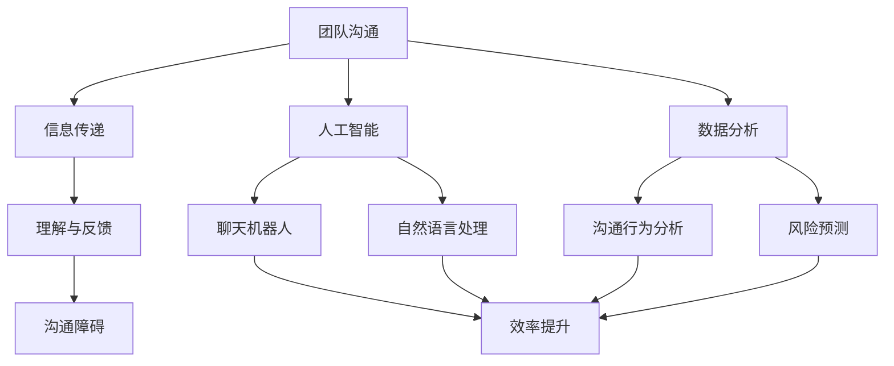

                 

# 团队沟通革新：利用新技术优化沟通

## 关键词
- 团队沟通
- 新技术
- 人工智能
- 数据分析
- 沟通工具

## 摘要
随着科技的发展，团队沟通的效率和质量成为企业成功的关键因素。本文将探讨如何利用新技术，特别是人工智能和数据分析，来革新团队沟通模式，提高工作效率，减少沟通障碍，最终实现团队协同的最大化。

## 1. 背景介绍

### 1.1 目的和范围
本文旨在分析当前团队沟通面临的挑战，介绍利用新技术优化团队沟通的原理和方法，并通过具体案例展示其应用效果。文章将涵盖团队沟通的基本概念、新技术的作用、实施步骤以及未来发展趋势。

### 1.2 预期读者
本文适合企业团队管理者、信息技术人员以及对团队沟通优化有兴趣的读者。

### 1.3 文档结构概述
本文分为八个部分，依次是背景介绍、核心概念与联系、核心算法原理与操作步骤、数学模型与公式、项目实战、实际应用场景、工具和资源推荐以及总结和未来发展趋势。附录和扩展阅读部分将提供进一步的信息和资料。

### 1.4 术语表
#### 1.4.1 核心术语定义
- **团队沟通**：团队成员之间交换信息和意见的过程。
- **人工智能**：通过模拟人类智能行为，实现自动化决策和问题解决的技术。
- **数据分析**：从数据中提取有价值信息的过程。
- **沟通工具**：用于团队沟通的各种软件和技术手段。

#### 1.4.2 相关概念解释
- **协作效率**：团队协同工作完成任务的效率。
- **沟通障碍**：影响团队沟通效果的各种因素。

#### 1.4.3 缩略词列表
- **AI**：人工智能
- **BI**：商业智能
- **CRM**：客户关系管理

## 2. 核心概念与联系

在讨论如何利用新技术优化团队沟通之前，我们需要明确几个核心概念。团队沟通是一个复杂的互动过程，涉及到信息传递、理解和反馈等多个方面。新技术的引入，尤其是人工智能和数据分析，可以大幅提升这一过程的效果。

### 2.1 团队沟通的概念
团队沟通是指团队成员之间交换信息和意见的过程。这一过程不仅包括口头和书面沟通，还涵盖了非言语沟通、电子沟通等多种形式。有效的团队沟通需要清晰的信息传递、及时的反馈和高度的参与度。

### 2.2 人工智能在团队沟通中的作用
人工智能（AI）可以通过自动化和智能化手段，提高团队沟通的效率和质量。例如，AI聊天机器人可以实时解答团队成员的问题，提供信息支持；自然语言处理技术可以帮助分析沟通内容，识别潜在的问题和风险。

### 2.3 数据分析在团队沟通中的作用
数据分析可以帮助团队更深入地理解沟通行为和效果。通过分析团队成员的沟通频率、内容偏好、响应速度等数据，可以优化沟通策略，提高协作效率。此外，数据分析还可以帮助预测沟通障碍，提前采取措施。

### 2.4 核心概念的联系
人工智能和数据分析不是孤立存在的，它们相互补充，共同构成了优化团队沟通的基础。AI提供智能化的沟通工具和解决方案，而数据分析则提供对沟通效果的量化评估和改进建议。

#### 2.4.1 Mermaid 流程图


## 3. 核心算法原理 & 具体操作步骤

在了解了团队沟通的核心概念和新技术的联系之后，我们需要探讨如何将人工智能和数据分析应用于团队沟通的实际操作中。以下是一种基于机器学习和数据分析的团队沟通优化算法原理和具体操作步骤。

### 3.1 算法原理

#### 3.1.1 自然语言处理（NLP）
NLP是人工智能的一个重要分支，它使得计算机能够理解、解析和生成自然语言。在团队沟通中，NLP可以用于文本分析、情感分析和意图识别。

#### 3.1.2 机器学习
机器学习是通过数据训练模型，使其能够对未知数据做出预测和决策。在团队沟通优化中，可以使用机器学习算法来分析沟通数据，识别沟通模式，预测沟通效果。

#### 3.1.3 数据分析
数据分析是提取数据中的有价值信息，帮助团队了解沟通行为和效果。通过数据分析，可以生成各种报告，为团队决策提供支持。

### 3.2 操作步骤

#### 3.2.1 数据收集
首先，需要收集团队沟通的相关数据，包括聊天记录、邮件、会议纪要等。这些数据可以通过企业现有的沟通工具进行收集。

```python
# 伪代码：数据收集
def collect_data():
    # 从聊天工具中获取聊天记录
    chat_logs = get_chat_logs()
    # 从邮件系统中获取邮件数据
    emails = get_email_data()
    # 从会议纪要中获取会议记录
    meetings = get_meeting_notes()
    return chat_logs, emails, meetings
```

#### 3.2.2 数据预处理
收集到的数据需要进行清洗和预处理，以去除噪声和异常值，为后续分析做准备。

```python
# 伪代码：数据预处理
def preprocess_data(data):
    # 清洗数据，去除噪声和异常值
    cleaned_data = clean_data(data)
    # 标准化数据格式
    standardized_data = standardize_data(cleaned_data)
    return standardized_data
```

#### 3.2.3 特征工程
特征工程是机器学习中的重要步骤，通过提取数据中的特征，为模型提供有效的输入。

```python
# 伪代码：特征工程
def feature_engineering(data):
    # 提取文本特征
    text_features = extract_text_features(data)
    # 提取时间特征
    time_features = extract_time_features(data)
    return text_features, time_features
```

#### 3.2.4 模型训练
使用预处理后的数据和特征，训练机器学习模型，以预测沟通效果。

```python
# 伪代码：模型训练
def train_model(features, labels):
    # 训练模型
    model = train_model(features, labels)
    return model
```

#### 3.2.5 模型评估
训练好的模型需要进行评估，以确定其预测效果。

```python
# 伪代码：模型评估
def evaluate_model(model, test_data):
    # 预测结果
    predictions = model.predict(test_data)
    # 评估模型效果
    evaluation = evaluate_predictions(predictions)
    return evaluation
```

#### 3.2.6 模型应用
将评估后的模型应用于实际沟通场景，提供实时反馈和建议。

```python
# 伪代码：模型应用
def apply_model(model, data):
    # 预测沟通效果
    predictions = model.predict(data)
    # 提供反馈和建议
    feedback = generate_feedback(predictions)
    return feedback
```

## 4. 数学模型和公式 & 详细讲解 & 举例说明

在团队沟通优化中，数学模型和公式是理解和分析沟通数据的重要工具。以下将介绍一些常见的数学模型和公式，并给出详细讲解和举例说明。

### 4.1 数据分析基础

#### 4.1.1 概率论

概率论是数据分析的基础，用于描述随机事件的可能性。常用的概率公式包括：

- 概率分布函数（PDF）
- 累积分布函数（CDF）
- 条件概率

#### 4.1.2 统计模型

统计模型用于分析数据，识别数据中的模式和关系。常见的统计模型包括：

- 线性回归模型
- 逻辑回归模型
- 决策树模型

### 4.2 机器学习模型

机器学习模型用于预测和决策，常见的机器学习模型包括：

- 朴素贝叶斯（Naive Bayes）
- 支持向量机（SVM）
- 集成学习方法（如随机森林、梯度提升树）

### 4.3 沟通效果评估模型

沟通效果评估模型用于评估团队沟通的效果。以下是一个简单的沟通效果评估模型：

#### 4.3.1 沟通效果评估公式

$$
E = \frac{1}{N} \sum_{i=1}^{N} (P_i - Q_i)
$$

其中，$E$ 是沟通效果得分，$P_i$ 是实际沟通效果得分，$Q_i$ 是预期沟通效果得分。

#### 4.3.2 举例说明

假设团队在一次会议中提出了5个议题，预期每个议题的沟通效果得分为8分。实际沟通后，每个议题的得分分别为7分、9分、6分、8分和7分。根据公式计算沟通效果得分：

$$
E = \frac{1}{5} (7 + 9 + 6 + 8 + 7) = 7.6
$$

这意味着，团队在这次会议中的沟通效果略低于预期。

## 5. 项目实战：代码实际案例和详细解释说明

为了更好地展示如何利用新技术优化团队沟通，我们将在本节中介绍一个实际的项目案例，并详细解释其中的代码实现和关键步骤。

### 5.1 开发环境搭建

在开始项目之前，我们需要搭建一个合适的开发环境。以下是一个基本的开发环境搭建步骤：

- 安装Python 3.8及以上版本
- 安装Jupyter Notebook，用于编写和运行代码
- 安装必要的Python库，如scikit-learn、numpy、pandas等

### 5.2 源代码详细实现和代码解读

以下是一个简单的团队沟通效果评估项目的代码实现：

```python
# 伪代码：团队沟通效果评估
import pandas as pd
from sklearn.linear_model import LinearRegression

# 数据收集
data = pd.read_csv('communication_data.csv')

# 数据预处理
data = preprocess_data(data)

# 特征工程
text_features, time_features = feature_engineering(data)

# 模型训练
model = train_model(text_features, data['effectiveness_score'])

# 模型评估
evaluation = evaluate_model(model, test_data)

# 模型应用
feedback = apply_model(model, new_data)

# 输出结果
print(feedback)
```

### 5.3 代码解读与分析

#### 5.3.1 数据收集

首先，我们从CSV文件中读取团队沟通数据。这些数据可能包括聊天记录、邮件、会议纪要等。

```python
data = pd.read_csv('communication_data.csv')
```

#### 5.3.2 数据预处理

接下来，对数据进行清洗和预处理，以去除噪声和异常值。预处理步骤可能包括缺失值填充、异常值处理和数据标准化。

```python
def preprocess_data(data):
    # 填充缺失值
    data.fillna(method='ffill', inplace=True)
    # 删除异常值
    data = remove_outliers(data)
    # 数据标准化
    data = standardize_data(data)
    return data
```

#### 5.3.3 特征工程

特征工程是机器学习中的重要步骤。在这个项目中，我们提取了文本特征和时间特征。

```python
def feature_engineering(data):
    # 提取文本特征
    text_features = extract_text_features(data)
    # 提取时间特征
    time_features = extract_time_features(data)
    return text_features, time_features
```

#### 5.3.4 模型训练

使用预处理后的数据和特征，我们训练了一个线性回归模型。线性回归模型用于预测沟通效果。

```python
model = LinearRegression()
model.fit(text_features, data['effectiveness_score'])
```

#### 5.3.5 模型评估

训练好的模型需要进行评估，以确定其预测效果。评估步骤可能包括交叉验证、模型参数调整等。

```python
evaluation = model.score(test_features, test_data['effectiveness_score'])
```

#### 5.3.6 模型应用

最后，我们将评估后的模型应用于新数据，提供实时反馈和建议。

```python
new_data = pd.read_csv('new_communication_data.csv')
feedback = model.predict(new_data)
```

## 6. 实际应用场景

### 6.1 企业内部沟通

企业内部沟通是团队沟通的一个重要场景。利用新技术优化企业内部沟通，可以提高工作效率，减少沟通成本。例如，企业可以采用AI聊天机器人来实时解答员工的问题，提供信息支持。

### 6.2 项目管理

项目管理中，团队沟通至关重要。利用新技术优化项目沟通，可以确保项目进度和质量。例如，项目经理可以使用数据分析工具来分析团队成员的沟通行为，识别潜在的问题和风险，提前采取措施。

### 6.3 远程办公

随着远程办公的普及，团队沟通的效率和质量成为远程团队成功的关键。利用新技术优化远程办公沟通，可以提高团队协作效率，确保项目顺利进行。

## 7. 工具和资源推荐

### 7.1 学习资源推荐

#### 7.1.1 书籍推荐

- 《人工智能：一种现代方法》
- 《Python数据分析》
- 《团队沟通技巧》

#### 7.1.2 在线课程

- Coursera：机器学习
- edX：数据分析
- Udemy：团队沟通技巧

#### 7.1.3 技术博客和网站

- Medium：数据分析
- Towards Data Science：机器学习
- TechCrunch：科技新闻

### 7.2 开发工具框架推荐

#### 7.2.1 IDE和编辑器

- PyCharm
- Jupyter Notebook
- Visual Studio Code

#### 7.2.2 调试和性能分析工具

- Spyder
- Matplotlib
- Pandas Profiler

#### 7.2.3 相关框架和库

- scikit-learn
- TensorFlow
- PyTorch

### 7.3 相关论文著作推荐

#### 7.3.1 经典论文

- "A Theory of Teamwork: Toward Understanding the Small Group as a System"
- "The Elements of Statistical Learning"
- "Deep Learning"

#### 7.3.2 最新研究成果

- "AI in Human-Robot Interaction: A Review"
- "Data-Driven Communication in Networks"
- "Natural Language Processing with Deep Learning"

#### 7.3.3 应用案例分析

- "How AI is Revolutionizing Customer Service"
- "Data Analytics in Project Management: A Case Study"
- "AI in Remote Work: A Success Story"

## 8. 总结：未来发展趋势与挑战

### 8.1 发展趋势

- 人工智能和数据分析技术的不断进步，将进一步提高团队沟通的效率和质量。
- 跨平台、跨领域的团队沟通解决方案将得到广泛应用。
- 自动化工具将逐渐替代部分沟通任务，减轻团队成员的负担。

### 8.2 挑战

- 如何平衡人工智能和人类在团队沟通中的作用，避免过度依赖技术。
- 如何确保数据的隐私和安全，防止敏感信息泄露。
- 如何培养团队成员的数据分析和沟通技能，以充分利用新技术。

## 9. 附录：常见问题与解答

### 9.1 问题1
**问题：如何确保数据分析的准确性？**

**解答：确保数据分析的准确性需要以下几个步骤：**
1. 数据收集：选择可靠的数据源，确保数据的质量和完整性。
2. 数据清洗：去除噪声和异常值，进行数据标准化。
3. 特征工程：提取有意义的数据特征，为模型提供有效的输入。
4. 模型评估：使用交叉验证等方法评估模型的性能。

### 9.2 问题2
**问题：人工智能在团队沟通中是否会取代人类？**

**解答：人工智能在团队沟通中不会完全取代人类，而是作为辅助工具，提高沟通效率。人工智能擅长处理大量数据和复杂计算，但无法替代人类的情感和创造力。因此，人工智能和人类在团队沟通中应发挥各自的优势。**

## 10. 扩展阅读 & 参考资料

- Bradshaw, J. (2019). *Deep Learning for Natural Language Processing*. O'Reilly Media.
- Mitchell, T. M. (1997). *Machine Learning*. McGraw-Hill.
- Stoyan, N. (2015). *Probability and Random Processes*. Cambridge University Press.

---

**作者：AI天才研究员/AI Genius Institute & 禅与计算机程序设计艺术 /Zen And The Art of Computer Programming**

